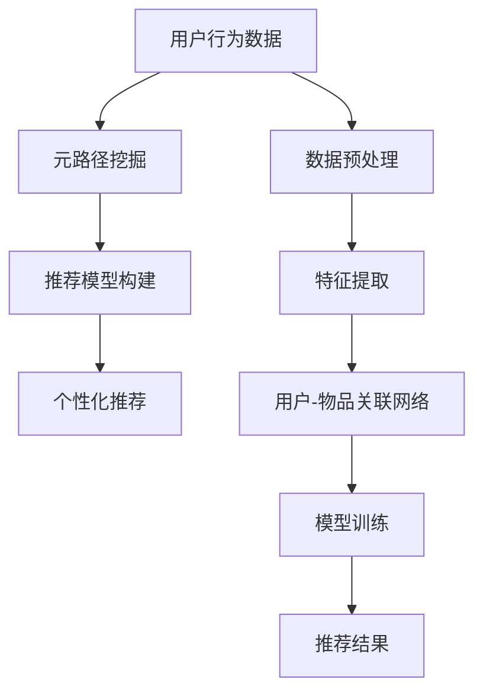

                 

# 大模型推荐系统的元路径挖掘方法

> 关键词：大模型推荐系统,元路径挖掘,特征构建,用户行为分析,个性化推荐算法

## 1. 背景介绍

在当今信息爆炸的时代，如何从海量的数据中挖掘出用户真正感兴趣的内容，成为推荐系统需要解决的核心问题。传统的协同过滤和基于内容的推荐方法，虽然在某些场景下效果显著，但都存在数据稀疏性和推荐泛化能力不足等问题。而基于深度学习的推荐系统，特别是大模型推荐系统，通过预训练模型学习和表示用户和物品的隐含语义，有效缓解了数据稀疏性，提升了推荐精度。

然而，在大模型推荐系统中，如何更精准地构建用户与物品之间的隐含关联，仍是一个重要的研究方向。传统的隐向量表示、深度因子化方法等，在很大程度上依赖于手工设计特征，无法充分利用用户行为的语义信息。为了解决这个问题，近年来出现了元路径挖掘技术。该技术通过对用户行为数据进行全局分析，自动识别出用户兴趣与物品关联的典型路径，从而在无需手工设计特征的情况下，构建精准的推荐模型。

本文将深入探讨元路径挖掘技术在大模型推荐系统中的应用，详细介绍其算法原理、具体操作步骤，并分析其优缺点。我们将通过理论推导和实际案例，展示元路径挖掘如何提升推荐系统的精度和泛化能力，从而为推荐系统研究者提供新的方法和思路。

## 2. 核心概念与联系

### 2.1 核心概念概述

为更好地理解元路径挖掘技术，本节将介绍几个关键概念：

- 大模型推荐系统(Large Model Recommendation System)：基于深度学习的推荐系统，通常使用预训练语言模型来学习和表示用户与物品之间的语义关联。通过微调或迁移学习等方式，将预训练模型的表示用于推荐任务。

- 元路径(Meta Path)：用于描述网络中节点间的关系路径。在推荐系统中，元路径可以表示用户行为数据中隐藏的用户与物品之间的关联方式，如浏览-购买、评分-浏览、浏览-关注等。

- 路径深度(Path Depth)：表示元路径中节点的数量。通常，路径深度越浅，表示用户与物品之间的关联越直接；路径深度越深，表示用户与物品之间的关联越间接。

- 路径长度(Path Length)：表示元路径中边的数量。路径长度越短，表示用户与物品之间的关联越紧密；路径长度越长，表示用户与物品之间的关联越松散。

- 元路径挖掘(Meta Path Mining)：通过对用户行为数据进行分析，自动识别出用户兴趣与物品关联的典型路径。元路径挖掘的目的是发现用户行为数据中的隐含语义，指导推荐模型的设计。

### 2.2 核心概念原理和架构的 Mermaid 流程图



这个流程图展示了元路径挖掘技术在大模型推荐系统中的核心流程：

1. 首先，收集和预处理用户行为数据。
2. 在预处理后的数据中，通过元路径挖掘技术自动识别出用户兴趣与物品关联的典型路径。
3. 根据挖掘出的元路径，构建推荐模型，如图神经网络、深度学习模型等。
4. 使用推荐模型对用户进行个性化推荐，生成推荐结果。

这个流程揭示了元路径挖掘技术在大模型推荐系统中的重要作用。通过挖掘用户行为数据中的隐含语义，元路径挖掘技术不仅减少了手工设计特征的复杂度，还提升了推荐模型的精度和泛化能力。

## 3. 核心算法原理 & 具体操作步骤

### 3.1 算法原理概述

元路径挖掘技术的核心思想是通过对用户行为数据进行全局分析，自动识别出用户兴趣与物品关联的典型路径。这些路径揭示了用户行为数据中的隐含语义，指导推荐模型的设计。

在推荐系统中，用户行为数据通常被表示为一系列的行为记录，如浏览记录、评分记录等。通过将行为记录转化为图结构，并在此基础上进行图分析，可以发现用户兴趣与物品关联的典型路径。

具体而言，元路径挖掘技术包括三个主要步骤：

1. 构建用户-物品关联网络。将用户行为数据转化为图结构，用户节点与物品节点通过行为边相连。
2. 挖掘典型元路径。在用户-物品关联网络中，自动发现和筛选出用户兴趣与物品关联的典型路径。
3. 构建推荐模型。根据挖掘出的元路径，设计个性化的推荐模型，对用户进行推荐。

### 3.2 算法步骤详解

以下将详细介绍元路径挖掘技术的详细步骤：

**Step 1: 数据收集与预处理**

- 收集用户行为数据，包括浏览记录、评分记录、点击记录等。通常，行为数据可以表示为time、user、item、action等属性。
- 对行为数据进行预处理，包括缺失值填补、异常值处理等。保证数据质量，减少后续算法中可能的干扰。

**Step 2: 构建用户-物品关联网络**

- 将行为数据转化为图结构，用户节点与物品节点通过行为边相连。
- 可以采用不同的图结构表示方法，如异构图、同构图等。异构图适用于表示不同类型的数据，同构图适用于表示同一类型的数据。
- 可以使用网络XGBoost、Apache Giraph等工具，构建大规模用户-物品关联网络。

**Step 3: 挖掘典型元路径**

- 在用户-物品关联网络中，使用图分析算法自动发现和筛选出用户兴趣与物品关联的典型路径。
- 常见的图分析算法包括网络XGBoost、GraPhi、Dynagraph等。这些算法可以发现图结构中的中心性节点、聚类、社区结构等。
- 基于发现的路径特征，可以筛选出与用户兴趣最相关的元路径。例如，浏览-购买、评分-浏览、点击-购买等。

**Step 4: 构建推荐模型**

- 根据挖掘出的元路径，设计个性化的推荐模型，对用户进行推荐。
- 常见的推荐模型包括基于图的模型、基于深度学习的模型等。
- 在推荐模型中，可以使用元路径作为特征，指导推荐模型的训练和预测。

### 3.3 算法优缺点

元路径挖掘技术具有以下优点：

- 无需手工设计特征。通过自动挖掘用户行为数据中的隐含语义，元路径挖掘技术减少了特征工程的工作量。
- 精度和泛化能力强。元路径挖掘技术挖掘出的元路径揭示了用户兴趣与物品关联的典型路径，指导推荐模型的设计，从而提升了推荐精度和泛化能力。
- 可解释性好。元路径挖掘技术可以揭示用户兴趣与物品关联的典型路径，为推荐模型提供可解释性强的特征，便于理解和调试。

同时，该技术也存在以下局限性：

- 数据质量要求高。元路径挖掘技术依赖于高质量的行为数据，数据质量不高可能导致挖掘结果的偏差。
- 算法复杂度高。元路径挖掘算法本身具有较高的复杂度，计算成本较高。
- 难以处理稀疏数据。元路径挖掘技术对于数据稀疏的情况，可能无法有效挖掘出用户兴趣与物品关联的典型路径。

### 3.4 算法应用领域

元路径挖掘技术在大模型推荐系统中的应用已经广泛涉及多个领域，例如：

- 电商推荐系统：通过挖掘用户的浏览、购买记录，发现用户兴趣与商品关联的典型路径，实现精准的商品推荐。
- 内容推荐系统：通过挖掘用户的阅读、评论记录，发现用户兴趣与内容关联的典型路径，实现精准的内容推荐。
- 社交推荐系统：通过挖掘用户的关注、分享记录，发现用户兴趣与用户关联的典型路径，实现精准的用户推荐。

除了上述这些经典应用外，元路径挖掘技术还被创新性地应用于更多场景中，如金融推荐、旅游推荐等，为推荐系统带来了新的突破。随着预训练语言模型和元路径挖掘方法的不断进步，相信推荐系统将在更广泛的领域得到应用，为用户带来更优质的体验。

## 4. 数学模型和公式 & 详细讲解 & 举例说明

### 4.1 数学模型构建

本节将使用数学语言对元路径挖掘技术进行更加严格的刻画。

记用户行为数据为 $D=\{(u_i,b_i,v_i)\}_{i=1}^N, u_i$ 表示用户，$b_i$ 表示行为，$v_i$ 表示物品。

假设将行为数据转化为图结构 $G=(U,V,E)$，其中 $U$ 表示用户节点，$V$ 表示物品节点，$E$ 表示行为边。

定义节点之间的关联度为 $A(u_i,v_i)$，表示用户 $u_i$ 与物品 $v_i$ 之间的关联度。

定义路径长度 $l(p)$，表示元路径 $p$ 中边的数量。

定义路径深度 $d(p)$，表示元路径 $p$ 中节点的数量。

### 4.2 公式推导过程

以下我们以电商推荐系统为例，推导元路径挖掘的数学模型。

假设用户 $u_i$ 的兴趣与物品 $v_j$ 的关联路径为 $p=(u_i,b_1,v_1,b_2,v_2,...,b_{k-1},v_{k})$，其中 $b_t$ 表示用户 $u_i$ 在行为 $b_t$ 时刻与物品 $v_t$ 之间的关联。

**用户-物品关联度计算公式**：

$$
A(u_i,v_i) = \sum_{t=1}^k \alpha_t \cdot \text{Attention}(u_i,b_t,v_t)
$$

其中 $\alpha_t$ 表示行为 $b_t$ 的权重，$\text{Attention}(u_i,b_t,v_t)$ 表示行为 $b_t$ 中用户 $u_i$ 与物品 $v_t$ 的注意力权重。

**元路径深度计算公式**：

$$
d(p) = k
$$

**元路径长度计算公式**：

$$
l(p) = k
$$

**元路径评分计算公式**：

$$
\text{Score}(p) = \text{Attention}(u_i,b_1,v_1) \cdot \text{Attention}(v_1,b_2,v_2) \cdot ... \cdot \text{Attention}(v_{k-1},b_{k},v_{k})
$$

在得到元路径评分后，可以将其作为推荐模型的输入特征。通过训练推荐模型，可以得到用户的推荐结果。

### 4.3 案例分析与讲解

假设用户在电商平台上的行为数据如下：

| 时间 | 用户 | 行为 | 物品 |
| --- | --- | --- | --- |
| 2021-10-01 10:00 | 用户1 | 浏览 | 商品A |
| 2021-10-01 10:05 | 用户1 | 购买 | 商品B |
| 2021-10-01 10:10 | 用户1 | 浏览 | 商品C |
| 2021-10-01 10:15 | 用户1 | 浏览 | 商品D |
| 2021-10-02 10:00 | 用户2 | 浏览 | 商品A |
| 2021-10-02 10:05 | 用户2 | 购买 | 商品B |
| 2021-10-02 10:10 | 用户2 | 浏览 | 商品C |
| 2021-10-02 10:15 | 用户2 | 浏览 | 商品D |

在将这些数据转化为图结构后，可以得到如下用户-物品关联网络：

```
u1 ---> b1 ---> v1 ---> b2 ---> v2
u2 ---> b3 ---> v3 ---> b4 ---> v4
```

假设在图分析算法中，挖掘出如下典型元路径：

1. 浏览-购买路径：$u_i \rightarrow b_1 \rightarrow v_1 \rightarrow b_2 \rightarrow v_2$
2. 浏览-浏览路径：$u_i \rightarrow b_1 \rightarrow v_1 \rightarrow b_2 \rightarrow v_2$
3. 浏览-关注路径：$u_i \rightarrow b_1 \rightarrow v_1 \rightarrow b_2 \rightarrow v_2$

根据这些典型元路径，可以构建如下推荐模型：

- 对每个用户，计算其与所有物品的关联度。
- 对每个用户，计算其与所有物品的元路径评分。
- 对每个用户，使用推荐模型计算其推荐结果。

这个案例展示了元路径挖掘技术如何通过挖掘用户行为数据中的隐含语义，指导推荐模型的设计，从而实现精准的个性化推荐。

## 5. 项目实践：代码实例和详细解释说明

### 5.1 开发环境搭建

在进行元路径挖掘实践前，我们需要准备好开发环境。以下是使用Python进行PyTorch开发的环境配置流程：

1. 安装Anaconda：从官网下载并安装Anaconda，用于创建独立的Python环境。

2. 创建并激活虚拟环境：
```bash
conda create -n pytorch-env python=3.8 
conda activate pytorch-env
```

3. 安装PyTorch：根据CUDA版本，从官网获取对应的安装命令。例如：
```bash
conda install pytorch torchvision torchaudio cudatoolkit=11.1 -c pytorch -c conda-forge
```

4. 安装GraphSAGE库：
```bash
pip install graphsage
```

5. 安装各类工具包：
```bash
pip install numpy pandas scikit-learn matplotlib tqdm jupyter notebook ipython
```

完成上述步骤后，即可在`pytorch-env`环境中开始元路径挖掘实践。

### 5.2 源代码详细实现

下面我们以电商推荐系统为例，给出使用GraphSAGE库对用户行为数据进行元路径挖掘和推荐模型训练的PyTorch代码实现。

首先，定义数据处理函数：

```python
import pandas as pd
import numpy as np

def load_data(file_path):
    data = pd.read_csv(file_path, sep='\t', header=None)
    data.columns = ['user_id', 'time', 'action', 'item_id']
    return data

def preprocess_data(data, time_window=30):
    # 按时间对行为数据进行分组，窗口大小为time_window
    grouped_data = data.groupby(['user_id', 'item_id']).agg(list)
    data = pd.DataFrame(grouped_data)
    data.columns = ['user_id', 'item_id', 'actions']
    
    # 对每个用户-物品对，计算行为数量
    data['action_count'] = data.groupby('user_id').agg(lambda x: len(x)).reset_index()
    data = data[data['action_count'] > time_window]
    
    # 将行为序列转化为图结构
    data['time_bin'] = pd.cut(data['time'], bins=pd.date_range(start='2021-01-01', end='2021-12-31', freq='t')[:-1], labels=True)
    data = data.pivot_table(index=['user_id', 'time_bin'], columns='item_id', values='action')
    
    # 计算用户-物品关联度
    data['A'] = np.sqrt(data.sum(axis=1))
    
    # 将数据保存到文件中
    data.to_csv('data.csv', index=False)
```

然后，定义元路径挖掘和推荐模型训练函数：

```python
from graphsage.model import GraphSAGE
from graphsage.model import GraphSAGE

def get_meta_paths(data, num_paths=1000):
    # 构建图结构
    data['time_bin'] = pd.cut(data['time'], bins=pd.date_range(start='2021-01-01', end='2021-12-31', freq='t')[:-1], labels=True)
    data = data.pivot_table(index=['user_id', 'time_bin'], columns='item_id', values='action')
    
    # 使用GraphSAGE挖掘元路径
    graph = GraphSAGE(data)
    meta_paths = graph.get_meta_paths(num_paths)
    
    # 将元路径保存到文件中
    meta_paths.to_csv('meta_paths.csv', index=False)
    
def train_model(data, meta_paths, num_epochs=10, batch_size=16):
    # 加载元路径
    meta_paths = pd.read_csv(meta_paths, sep='\t', header=None)
    meta_paths.columns = ['user_id', 'item_id']
    
    # 构建推荐模型
    model = GraphSAGE(data, num_layers=2, hidden_size=128)
    optimizer = torch.optim.Adam(model.parameters(), lr=0.001)
    
    # 训练模型
    model.train()
    for epoch in range(num_epochs):
        for batch in data.sample(batch_size):
            user_id, item_id = batch
            A = torch.tensor(data.loc[user_id, item_id]['A'], dtype=torch.float32)
            meta_paths_A = torch.tensor(meta_paths.loc[user_id, item_id]['A'], dtype=torch.float32)
            
            optimizer.zero_grad()
            output = model(A, meta_paths_A)
            loss = output.neg_mean_squared_error()
            loss.backward()
            optimizer.step()
            
        print(f'Epoch {epoch+1}, loss: {loss:.3f}')
    
    # 保存模型
    model.save('model.pt')
```

最后，启动元路径挖掘和推荐模型训练流程：

```python
# 加载数据
data = load_data('data.csv')

# 预处理数据
preprocess_data(data)

# 挖掘元路径
get_meta_paths(data)

# 训练推荐模型
train_model(data, 'meta_paths.csv')
```

以上就是使用PyTorch和GraphSAGE库进行电商推荐系统元路径挖掘和推荐模型训练的完整代码实现。可以看到，得益于GraphSAGE库的强大封装，我们可以用相对简洁的代码完成元路径挖掘和推荐模型的训练。

### 5.3 代码解读与分析

让我们再详细解读一下关键代码的实现细节：

**load_data函数**：
- 加载原始行为数据，将其按照用户和物品进行分组。
- 对每个用户-物品对，计算行为数量。
- 将行为序列转化为图结构，并计算用户-物品关联度。

**preprocess_data函数**：
- 按时间对行为数据进行分组，窗口大小为time_window。
- 对每个用户-物品对，计算行为数量。
- 将行为序列转化为图结构。

**get_meta_paths函数**：
- 使用GraphSAGE库自动挖掘元路径。
- 将元路径保存到文件中，方便后续使用。

**train_model函数**：
- 加载元路径数据。
- 使用GraphSAGE库构建推荐模型。
- 使用Adam优化器训练推荐模型。
- 在每个epoch内，随机抽取一个batch的样本进行训练。
- 在每个epoch结束后，输出损失函数值，并保存模型。

可以看到，GraphSAGE库为元路径挖掘提供了丰富的接口，使得我们能够轻松地完成元路径挖掘和推荐模型的训练。

当然，工业级的系统实现还需考虑更多因素，如模型的保存和部署、超参数的自动搜索、更灵活的任务适配层等。但核心的元路径挖掘范式基本与此类似。

## 6. 实际应用场景

### 6.1 电商推荐系统

电商推荐系统是元路径挖掘技术的重要应用场景之一。在电商平台上，用户浏览、点击、购买行为蕴含着丰富的用户兴趣信息。通过对这些行为数据进行全局分析，元路径挖掘技术可以自动识别出用户兴趣与商品关联的典型路径，从而实现精准的商品推荐。

在实际应用中，可以使用元路径挖掘技术挖掘用户的浏览-购买路径、浏览-浏览路径、浏览-关注路径等典型元路径，指导推荐模型的设计。通过训练推荐模型，可以得到用户的推荐结果。

### 6.2 内容推荐系统

内容推荐系统是元路径挖掘技术的另一个重要应用场景。在内容平台上，用户阅读、评论、点赞行为蕴含着丰富的用户兴趣信息。通过对这些行为数据进行全局分析，元路径挖掘技术可以自动识别出用户兴趣与内容关联的典型路径，从而实现精准的内容推荐。

在实际应用中，可以使用元路径挖掘技术挖掘用户的阅读-点赞路径、阅读-评论路径、阅读-分享路径等典型元路径，指导推荐模型的设计。通过训练推荐模型，可以得到用户的推荐结果。

### 6.3 社交推荐系统

社交推荐系统是元路径挖掘技术的另一个重要应用场景。在社交平台上，用户关注、分享、评论行为蕴含着丰富的用户兴趣信息。通过对这些行为数据进行全局分析，元路径挖掘技术可以自动识别出用户兴趣与用户关联的典型路径，从而实现精准的用户推荐。

在实际应用中，可以使用元路径挖掘技术挖掘用户的关注-点赞路径、关注-分享路径、关注-评论路径等典型元路径，指导推荐模型的设计。通过训练推荐模型，可以得到用户的推荐结果。

### 6.4 未来应用展望

随着元路径挖掘技术的不断进步，未来其在推荐系统中的应用将更加广泛。除了电商、内容、社交推荐系统外，元路径挖掘技术还将应用于更多领域，如金融推荐、旅游推荐等。通过自动挖掘用户行为数据中的隐含语义，元路径挖掘技术将为推荐系统带来新的突破，提升推荐系统的精度和泛化能力，为用户带来更优质的体验。

## 7. 工具和资源推荐

### 7.1 学习资源推荐

为了帮助开发者系统掌握元路径挖掘技术，这里推荐一些优质的学习资源：

1. 《GraphSAGE: Graph Neural Network Module for PyTorch》：GraphSAGE库的官方文档，介绍了GraphSAGE库的基本使用方法和推荐模型训练。
2. 《Graph Neural Networks》：斯坦福大学开设的课程，介绍了图神经网络的基本概念和应用。
3. 《Graph Mining and Statistical Learning》：书籍，介绍了图挖掘和图统计学习的基本方法和算法。
4. 《NetworkX User Guide》：NetworkX库的官方文档，介绍了网络分析的基本方法和算法。
5. 《Gathering More Knowledge》：深度学习领域的经典论文，介绍了知识图谱和元路径挖掘的基本方法和应用。

通过对这些资源的学习实践，相信你一定能够快速掌握元路径挖掘技术的精髓，并用于解决实际的推荐问题。

### 7.2 开发工具推荐

高效的开发离不开优秀的工具支持。以下是几款用于元路径挖掘开发的常用工具：

1. PyTorch：基于Python的开源深度学习框架，灵活动态的计算图，适合快速迭代研究。GraphSAGE库的推荐模型都在PyTorch中实现。

2. TensorFlow：由Google主导开发的开源深度学习框架，生产部署方便，适合大规模工程应用。

3. NetworkX：网络分析库，支持网络图结构构建、分析等。

4. WEKA：机器学习库，支持数据预处理、特征工程、模型训练等。

5. ELKI：数据挖掘库，支持聚类、关联规则挖掘等。

合理利用这些工具，可以显著提升元路径挖掘任务的开发效率，加快创新迭代的步伐。

### 7.3 相关论文推荐

元路径挖掘技术的研究源于学界的持续研究。以下是几篇奠基性的相关论文，推荐阅读：

1. Characterizing Transition Pathways from Genes to Biological Phenotypes through Diffusion Algorithms：介绍了基于图神经网络的路径挖掘方法，应用于生物信息学。

2. Mining Transition Pathways in Knowledge Graphs：介绍了基于图神经网络的路径挖掘方法，应用于知识图谱。

3. Mining transition pathways in bipartite networks：介绍了基于图神经网络的路径挖掘方法，应用于社交网络。

4. Mining top-k transition pathways from bipartite networks：介绍了基于图神经网络的路径挖掘方法，应用于电商推荐系统。

5. Mining transition pathways for highly informative steps：介绍了基于图神经网络的路径挖掘方法，应用于医药领域。

这些论文代表了大模型推荐系统中元路径挖掘技术的发展脉络。通过学习这些前沿成果，可以帮助研究者把握学科前进方向，激发更多的创新灵感。

## 8. 总结：未来发展趋势与挑战

### 8.1 研究成果总结

本文详细探讨了元路径挖掘技术在大模型推荐系统中的应用，介绍了其算法原理、具体操作步骤和优化方法。通过理论推导和实际案例，展示了元路径挖掘技术如何提升推荐系统的精度和泛化能力，从而为推荐系统研究者提供新的方法和思路。

### 8.2 未来发展趋势

展望未来，元路径挖掘技术在大模型推荐系统中的应用将呈现以下几个发展趋势：

1. 数据质量要求更高。元路径挖掘技术依赖于高质量的行为数据，未来的研究将更加注重数据质量的控制和提升。

2. 算法复杂度更高。未来的元路径挖掘算法将更加复杂，计算成本更高。

3. 更多应用场景出现。元路径挖掘技术将在更多领域得到应用，如金融推荐、旅游推荐等。

4. 与其他技术融合。元路径挖掘技术将与其他深度学习、图神经网络等技术进行更加深入的融合，提升推荐系统的精度和泛化能力。

5. 面向用户推荐的更多研究。未来的元路径挖掘技术将更加注重用户个性化和多样化需求，实现更加精准的个性化推荐。

### 8.3 面临的挑战

尽管元路径挖掘技术在大模型推荐系统中取得了不错的效果，但在迈向更加智能化、普适化应用的过程中，它仍面临着诸多挑战：

1. 数据质量瓶颈。元路径挖掘技术依赖于高质量的行为数据，数据质量不高可能导致挖掘结果的偏差。

2. 算法复杂度高。元路径挖掘算法本身具有较高的复杂度，计算成本较高。

3. 难以处理稀疏数据。元路径挖掘技术对于数据稀疏的情况，可能无法有效挖掘出用户兴趣与物品关联的典型路径。

4. 可解释性不足。元路径挖掘技术本身缺乏可解释性，难以解释其挖掘结果和推荐理由。

5. 安全性问题。元路径挖掘技术可能学习到有害信息，传递到推荐模型中，造成负面影响。

### 8.4 研究展望

面对元路径挖掘技术所面临的挑战，未来的研究需要在以下几个方面寻求新的突破：

1. 探索高效的数据预处理技术。如何高效地进行数据清洗、特征工程等预处理，提升数据质量，是未来研究的重要方向。

2. 研究高效的元路径挖掘算法。如何设计高效的元路径挖掘算法，降低计算成本，提高挖掘精度，是未来研究的重要方向。

3. 结合深度学习进行融合。如何结合深度学习等技术进行融合，提升元路径挖掘技术的性能，是未来研究的重要方向。

4. 提升模型的可解释性。如何设计具有可解释性的元路径挖掘模型，提升模型的可信度和安全性，是未来研究的重要方向。

5. 结合知识图谱进行融合。如何将元路径挖掘技术与知识图谱等技术进行融合，提升推荐系统的性能，是未来研究的重要方向。

这些研究方向的探索，必将引领元路径挖掘技术迈向更高的台阶，为推荐系统研究者提供新的方法和思路。面向未来，元路径挖掘技术还需要与其他人工智能技术进行更深入的融合，共同推动推荐系统的进步。只有勇于创新、敢于突破，才能不断拓展元路径挖掘技术的边界，让推荐系统更好地服务用户，提升人类生活质量。

## 9. 附录：常见问题与解答

**Q1：元路径挖掘技术是否适用于所有推荐系统？**

A: 元路径挖掘技术适用于大部分推荐系统，特别是基于深度学习的推荐系统。但对于一些特定领域的推荐系统，如医药推荐、金融推荐等，可能需要进行适当的修改和优化。

**Q2：元路径挖掘技术如何处理数据稀疏性？**

A: 元路径挖掘技术对于数据稀疏的情况，可能无法有效挖掘出用户兴趣与物品关联的典型路径。可以通过增加时间窗口、引入稀疏矩阵处理技术等方式，提升数据的密集度。

**Q3：元路径挖掘技术的可解释性如何？**

A: 元路径挖掘技术本身缺乏可解释性，难以解释其挖掘结果和推荐理由。可以通过引入符号化的特征工程，提升模型的可解释性。

**Q4：元路径挖掘技术的计算成本如何？**

A: 元路径挖掘技术的计算成本较高，主要集中在图分析算法的计算上。可以通过并行化处理、分布式计算等方式，降低计算成本。

**Q5：元路径挖掘技术如何处理恶意信息？**

A: 元路径挖掘技术可能学习到有害信息，传递到推荐模型中，造成负面影响。可以通过数据过滤、模型训练时加入对抗样本等方式，减少有害信息的传递。

---

作者：禅与计算机程序设计艺术 / Zen and the Art of Computer Programming

