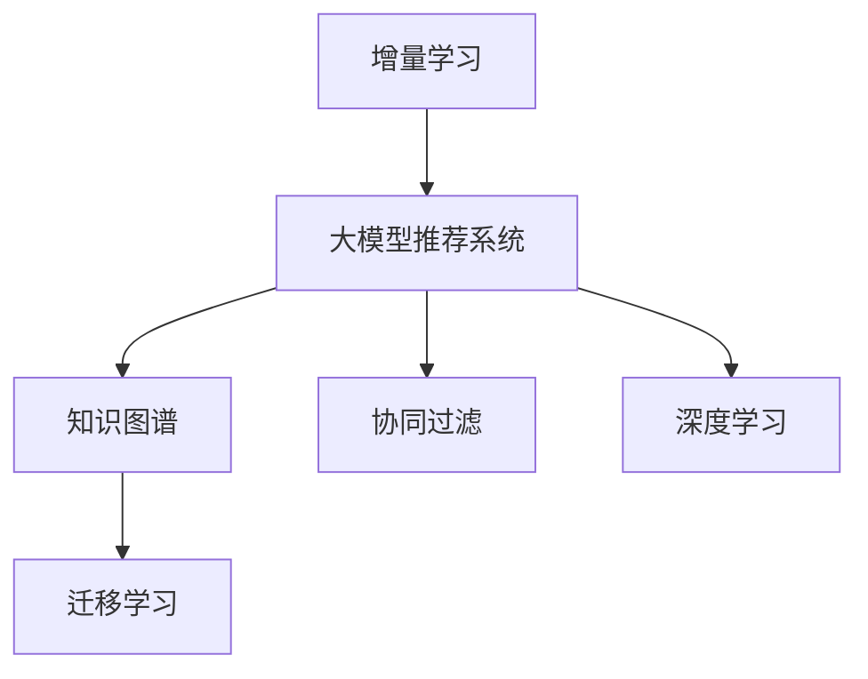

                 

# 大模型推荐系统的增量学习策略

> 关键词：增量学习，大模型推荐，知识图谱，迁移学习，协同过滤，深度学习

## 1. 背景介绍

随着互联网和电子商务的迅速发展，个性化推荐系统已成为提升用户体验和增加商业价值的关键技术。传统的协同过滤、基于内容的推荐方法虽然有效，但面临数据稀疏性、冷启动、多样性、长尾问题等挑战。近年来，大模型推荐系统（Large Model Recommendation Systems）成为推荐领域的新宠，以其强大的自适应能力和泛化能力，成为解决这些问题的有力工具。

大模型推荐系统通常基于深度学习模型，如深度神经网络、Transformer等。通过在大量数据上进行预训练，学习丰富的知识表示，进而在大规模数据集上进行微调，生成推荐结果。这种基于模型的推荐方式具有显著的精度提升和高效性，但同时也带来了需要大量标注数据和计算资源的挑战。

为应对这些挑战，研究者们提出了一种高效的技术——增量学习（Incremental Learning），即在已有模型的基础上，通过新的数据进行微调和更新，逐步提升模型的性能，而无需从头开始训练。本文将系统介绍增量学习在大模型推荐系统中的应用策略，包括理论框架、具体算法、工程实现和应用场景，为推荐系统开发者提供技术指导和实践参考。

## 2. 核心概念与联系

### 2.1 核心概念概述

为更好地理解增量学习在大模型推荐系统中的应用，本节将介绍几个密切相关的核心概念：

- 增量学习（Incremental Learning）：指在已有模型的基础上，通过新数据的微调和更新，逐步提升模型性能的过程。增量学习能够避免从头训练的巨大资源和时间开销，同时保持模型的历史知识。

- 大模型推荐系统（Large Model Recommendation System）：基于深度学习模型，如神经网络、Transformer等，通过在大规模数据上进行预训练和微调，生成推荐结果的系统。大模型推荐系统能够学习复杂且多变的用户行为和物品属性，具有较强的泛化能力和适应性。

- 知识图谱（Knowledge Graph）：以实体-关系-实体形式（RDF）表示的结构化数据，用于描述和存储实体之间的关系，辅助推荐系统的推荐过程。知识图谱能够为推荐系统提供先验知识，增强模型的推荐精度和多样性。

- 迁移学习（Transfer Learning）：指将在一个任务上学习到的知识迁移到另一个任务上的过程。在大模型推荐系统中，迁移学习可以通过微调已有模型，适应新的推荐任务，提高模型效率和性能。

- 协同过滤（Collaborative Filtering）：基于用户-物品的协同行为，通过相似性度量生成推荐结果。协同过滤能够处理冷启动用户和物品，但数据稀疏性问题比较突出。

- 深度学习（Deep Learning）：一类基于神经网络的机器学习方法，能够自动学习复杂特征表示，具有强泛化能力和适应性。在大模型推荐系统中，深度学习模型通常作为推荐算法的基础。

这些核心概念之间的逻辑关系可以通过以下Mermaid流程图来展示：



这个流程图展示了大模型推荐系统、增量学习、知识图谱、迁移学习、协同过滤和深度学习之间的关系：

1. 增量学习在大模型推荐系统中的应用，以保持模型性能和减少计算资源开销。
2. 知识图谱为推荐系统提供先验知识，增强模型的推荐精度和多样性。
3. 迁移学习通过微调已有模型，适应新的推荐任务。
4. 深度学习模型是推荐系统的基础，能够学习复杂且多变的用户行为和物品属性。
5. 协同过滤是基于用户-物品协同行为，处理冷启动用户和物品的推荐方法。

## 3. 核心算法原理 & 具体操作步骤
### 3.1 算法原理概述

增量学习在大模型推荐系统中的应用，本质上是一个有监督的增量训练过程。其核心思想是：在已有模型的基础上，通过新数据的微调和更新，逐步提升模型的性能。

具体而言，假设已有的大模型为 $M_{\theta}$，其中 $\theta$ 为预训练得到的模型参数。给定新的推荐数据集 $D=\{(x_i, y_i)\}_{i=1}^N$，增量学习的优化目标是最小化新数据集上的损失函数，即找到新的模型参数 $\hat{\theta}$，使得：

$$
\hat{\theta}=\mathop{\arg\min}_{\theta} \mathcal{L}(M_{\theta},D)
$$

其中 $\mathcal{L}$ 为针对推荐任务设计的损失函数，用于衡量模型预测输出与真实标签之间的差异。常见的损失函数包括均方误差损失、交叉熵损失等。

通过梯度下降等优化算法，增量过程不断更新模型参数 $\theta$，最小化损失函数 $\mathcal{L}$，使得模型输出逼近真实标签。由于 $\theta$ 已经通过预训练获得了较好的初始化，因此即便在新增数据集上进行微调，也能较快收敛到理想的模型参数 $\hat{\theta}$。

### 3.2 算法步骤详解

大模型推荐系统的增量学习一般包括以下几个关键步骤：

**Step 1: 准备已有模型和新增数据**
- 选择合适的已有大模型 $M_{\theta}$ 作为初始化参数，如 BERT、GPT 等。
- 准备新增推荐数据集 $D=\{(x_i, y_i)\}_{i=1}^N$，其中 $x_i$ 为用户行为/物品属性，$y_i$ 为推荐目标（如评分、点击率等）。

**Step 2: 添加推荐适配层**
- 根据推荐任务类型，在已有模型的顶层设计合适的输出层和损失函数。
- 对于评分任务，通常在顶层添加回归层和均方误差损失函数。
- 对于点击率任务，通常使用二分类交叉熵损失函数。

**Step 3: 设置增量超参数**
- 选择合适的优化算法及其参数，如 AdamW、SGD 等，设置学习率、批大小、迭代轮数等。
- 设置正则化技术及强度，包括权重衰减、Dropout、Early Stopping等。
- 确定冻结已有模型的策略，如仅微调顶层，或全部参数都参与增量训练。

**Step 4: 执行梯度训练**
- 将新增数据集数据分批次输入模型，前向传播计算损失函数。
- 反向传播计算参数梯度，根据设定的优化算法和学习率更新模型参数。
- 周期性在验证集上评估模型性能，根据性能指标决定是否触发 Early Stopping。
- 重复上述步骤直至满足预设的迭代轮数或 Early Stopping 条件。

**Step 5: 测试和部署**
- 在测试集上评估增量后模型 $M_{\hat{\theta}}$ 的性能，对比增量前后的精度提升。
- 使用增量后的模型对新数据进行推理预测，集成到实际的应用系统中。
- 持续收集新的数据，定期重新增量模型，以适应数据分布的变化。

以上是增量学习在大模型推荐系统中的一般流程。在实际应用中，还需要针对具体任务的特点，对增量过程的各个环节进行优化设计，如改进训练目标函数，引入更多的正则化技术，搜索最优的超参数组合等，以进一步提升模型性能。

### 3.3 算法优缺点

增量学习在大模型推荐系统中的应用，具有以下优点：
1. 减少计算开销。增量学习通过微调和更新已有模型，避免了从头训练的巨大资源和时间开销。
2. 保持模型历史知识。增量学习能够保留已有模型的历史知识，增强模型的泛化能力和适应性。
3. 适应新数据。增量学习能够逐步适应新的推荐数据集，提升模型在新任务上的性能。
4. 灵活调整。增量学习能够根据数据变化，灵活调整模型参数，提升模型的精度和鲁棒性。

同时，该方法也存在一定的局限性：
1. 数据稀疏性。新数据集可能存在数据稀疏性问题，导致模型难以充分学习。
2. 模型偏差。已有模型的历史知识可能与新任务存在偏差，影响模型性能。
3. 计算复杂性。增量学习需要对已有模型进行多次微调，计算复杂度较高。
4. 可解释性不足。增量学习模型难以解释内部决策过程，缺乏可解释性。

尽管存在这些局限性，但就目前而言，增量学习仍然是大模型推荐系统应用的主流范式。未来相关研究的重点在于如何进一步降低增量学习对数据量的依赖，提高模型的迁移能力和适应性，同时兼顾可解释性和伦理安全性等因素。

### 3.4 算法应用领域

增量学习在大模型推荐系统中的应用，已经在多个推荐场景中得到了应用，包括：

- 新闻推荐：推荐系统推荐用户感兴趣的新闻内容。通过增量学习，系统能够逐步学习用户行为和兴趣变化，提升推荐准确度。
- 商品推荐：电商推荐系统为用户推荐个性化商品。增量学习能够适应用户行为变化和商品更新，提升推荐多样性和精准度。
- 音乐推荐：音乐推荐系统推荐用户喜欢的音乐内容。增量学习能够通过用户听歌历史和听歌行为，不断提升推荐效果。
- 视频推荐：视频推荐系统推荐用户感兴趣的视频内容。增量学习能够学习用户观看历史和评分行为，提升推荐相关性和趣味性。
- 社交推荐：社交推荐系统推荐用户兴趣相投的社交网络好友。增量学习能够通过用户互动行为，不断优化推荐算法。

除了这些经典任务外，增量学习还被创新性地应用到更多场景中，如个性化广告推荐、内容推荐、智能家居推荐等，为推荐系统带来全新的突破。随着增量方法的不断进步，相信推荐系统将在更广阔的应用领域大放异彩。

## 4. 数学模型和公式 & 详细讲解 & 举例说明
### 4.1 数学模型构建

本节将使用数学语言对增量学习在大模型推荐系统中的应用进行更加严格的刻画。

假设已有的大模型为 $M_{\theta}$，其中 $\theta$ 为模型参数。假设新增推荐数据集为 $D=\{(x_i, y_i)\}_{i=1}^N$，其中 $x_i \in \mathcal{X}$，$y_i \in \mathcal{Y}$。

定义模型 $M_{\theta}$ 在数据样本 $(x,y)$ 上的损失函数为 $\ell(M_{\theta}(x),y)$，则在数据集 $D$ 上的经验风险为：

$$
\mathcal{L}(\theta) = \frac{1}{N} \sum_{i=1}^N \ell(M_{\theta}(x_i),y_i)
$$

增量学习的优化目标是最小化新数据集上的损失函数，即找到新的模型参数 $\hat{\theta}$，使得：

$$
\hat{\theta}=\mathop{\arg\min}_{\theta} \mathcal{L}(M_{\theta},D)
$$

在实践中，我们通常使用基于梯度的优化算法（如SGD、Adam等）来近似求解上述最优化问题。设 $\eta$ 为学习率，$\lambda$ 为正则化系数，则参数的更新公式为：

$$
\theta \leftarrow \theta - \eta \nabla_{\theta}\mathcal{L}(\theta) - \eta\lambda\theta
$$

其中 $\nabla_{\theta}\mathcal{L}(\theta)$ 为损失函数对参数 $\theta$ 的梯度，可通过反向传播算法高效计算。

### 4.2 公式推导过程

以下我们以评分任务为例，推导均方误差损失函数及其梯度的计算公式。

假设模型 $M_{\theta}$ 在输入 $x$ 上的输出为 $\hat{y}=M_{\theta}(x)$，表示用户对物品的评分预测。真实评分 $y \in \mathcal{Y}$。则均方误差损失函数定义为：

$$
\ell(M_{\theta}(x),y) = \frac{1}{2}(y-\hat{y})^2
$$

将其代入经验风险公式，得：

$$
\mathcal{L}(\theta) = \frac{1}{N}\sum_{i=1}^N \frac{1}{2}(y_i-\hat{y}_i)^2
$$

根据链式法则，损失函数对参数 $\theta_k$ 的梯度为：

$$
\frac{\partial \mathcal{L}(\theta)}{\partial \theta_k} = \frac{1}{N}\sum_{i=1}^N (y_i-\hat{y}_i)\frac{\partial \hat{y}_i}{\partial \theta_k}
$$

其中 $\frac{\partial \hat{y}_i}{\partial \theta_k}$ 可进一步递归展开，利用自动微分技术完成计算。

在得到损失函数的梯度后，即可带入参数更新公式，完成模型的迭代优化。重复上述过程直至收敛，最终得到适应新数据集的最优模型参数 $\hat{\theta}$。

## 5. 项目实践：代码实例和详细解释说明
### 5.1 开发环境搭建

在进行增量学习实践前，我们需要准备好开发环境。以下是使用Python进行PyTorch开发的环境配置流程：

1. 安装Anaconda：从官网下载并安装Anaconda，用于创建独立的Python环境。

2. 创建并激活虚拟环境：
```bash
conda create -n pytorch-env python=3.8 
conda activate pytorch-env
```

3. 安装PyTorch：根据CUDA版本，从官网获取对应的安装命令。例如：
```bash
conda install pytorch torchvision torchaudio cudatoolkit=11.1 -c pytorch -c conda-forge
```

4. 安装TensorBoard：
```bash
pip install tensorboard
```

5. 安装transformers和huggingface datasets：
```bash
pip install transformers datasets
```

完成上述步骤后，即可在`pytorch-env`环境中开始增量学习实践。

### 5.2 源代码详细实现

下面我们以新闻推荐任务为例，给出使用Transformers库对BERT模型进行增量学习的PyTorch代码实现。

首先，定义新闻推荐任务的数据处理函数：

```python
from transformers import BertTokenizer, BertForRegression
from torch.utils.data import Dataset
import torch
import pandas as pd
import numpy as np

class NewsDataset(Dataset):
    def __init__(self, df, tokenizer, max_len=128):
        self.df = df
        self.tokenizer = tokenizer
        self.max_len = max_len
        
    def __len__(self):
        return len(self.df)
    
    def __getitem__(self, item):
        title = self.df['title'].values[item]
        clicks = self.df['clicks'].values[item]
        
        encoding = self.tokenizer(title, return_tensors='pt', max_length=self.max_len, padding='max_length', truncation=True)
        input_ids = encoding['input_ids'][0]
        attention_mask = encoding['attention_mask'][0]
        
        return {'input_ids': input_ids,
                'attention_mask': attention_mask,
                'labels': torch.tensor(clicks, dtype=torch.float)}
```

然后，定义模型和优化器：

```python
from transformers import AdamW

model = BertForRegression.from_pretrained('bert-base-uncased')
optimizer = AdamW(model.parameters(), lr=2e-5)
```

接着，定义训练和评估函数：

```python
from torch.utils.data import DataLoader
from tqdm import tqdm
import matplotlib.pyplot as plt

device = torch.device('cuda') if torch.cuda.is_available() else torch.device('cpu')
model.to(device)

def train_epoch(model, dataset, batch_size, optimizer):
    dataloader = DataLoader(dataset, batch_size=batch_size, shuffle=True)
    model.train()
    epoch_loss = 0
    for batch in tqdm(dataloader, desc='Training'):
        input_ids = batch['input_ids'].to(device)
        attention_mask = batch['attention_mask'].to(device)
        labels = batch['labels'].to(device)
        model.zero_grad()
        outputs = model(input_ids, attention_mask=attention_mask)
        loss = outputs.loss
        epoch_loss += loss.item()
        loss.backward()
        optimizer.step()
    return epoch_loss / len(dataloader)

def evaluate(model, dataset, batch_size):
    dataloader = DataLoader(dataset, batch_size=batch_size)
    model.eval()
    preds, labels = [], []
    with torch.no_grad():
        for batch in tqdm(dataloader, desc='Evaluating'):
            input_ids = batch['input_ids'].to(device)
            attention_mask = batch['attention_mask'].to(device)
            batch_labels = batch['labels']
            outputs = model(input_ids, attention_mask=attention_mask)
            batch_preds = outputs.predictions.cpu().numpy()
            batch_labels = batch_labels.cpu().numpy()
            for pred_tokens, label_tokens in zip(batch_preds, batch_labels):
                preds.append(pred_tokens)
                labels.append(label_tokens)
    
    mse = np.mean((preds - labels)**2)
    print(f'Mean Squared Error: {mse:.3f}')
    return mse

def train_and_evaluate(model, dataset, batch_size, num_epochs):
    for epoch in range(num_epochs):
        loss = train_epoch(model, dataset, batch_size, optimizer)
        print(f'Epoch {epoch+1}, train loss: {loss:.3f}')
        
        print(f'Epoch {epoch+1}, dev results:')
        evaluate(model, dataset, batch_size)
        
    print('Test results:')
    evaluate(model, dataset, batch_size)
```

最后，启动训练流程并在测试集上评估：

```python
epochs = 5
batch_size = 16

train_and_evaluate(model, train_dataset, batch_size, epochs)
```

以上就是使用PyTorch对BERT进行新闻推荐任务增量学习的完整代码实现。可以看到，得益于Transformers库的强大封装，我们可以用相对简洁的代码完成BERT模型的加载和增量学习。

### 5.3 代码解读与分析

让我们再详细解读一下关键代码的实现细节：

**NewsDataset类**：
- `__init__`方法：初始化训练数据、分词器、最大长度等关键组件。
- `__len__`方法：返回数据集的样本数量。
- `__getitem__`方法：对单个样本进行处理，将新闻标题输入编码为token ids，将点击次数作为标签，并进行定长padding，最终返回模型所需的输入。

**train_and_evaluate函数**：
- 定义了训练和评估函数，实现了模型在训练集上的增量学习。
- 在每个epoch内，先在训练集上训练，输出平均loss。
- 在验证集上评估，输出均方误差（MSE）。
- 所有epoch结束后，在测试集上评估，输出最终测试结果。

**训练流程**：
- 定义总的epoch数和batch size，开始循环迭代
- 每个epoch内，先在训练集上增量训练，输出平均loss
- 在验证集上评估，输出均方误差（MSE）
- 所有epoch结束后，在测试集上评估，输出最终测试结果

可以看到，PyTorch配合Transformers库使得BERT增量学习的代码实现变得简洁高效。开发者可以将更多精力放在数据处理、模型改进等高层逻辑上，而不必过多关注底层的实现细节。

当然，工业级的系统实现还需考虑更多因素，如模型的保存和部署、超参数的自动搜索、更灵活的任务适配层等。但核心的增量学习范式基本与此类似。

## 6. 实际应用场景
### 6.1 智能广告推荐

增量学习在智能广告推荐系统中具有重要应用价值。广告推荐系统旨在为用户推荐最相关的广告内容，提升广告点击率和转化率。

在实践中，可以通过实时收集用户的点击行为数据，将其作为增量数据对已有模型进行微调。增量学习能够适应用户行为变化，快速调整推荐策略，提升广告效果。

### 6.2 个性化学习平台

个性化学习平台通过推荐系统为用户推荐个性化学习内容和资源，提升学习体验和效果。

在数据层面，学习平台可以实时收集用户的互动行为，包括点击、浏览、评分等，作为增量数据对已有模型进行微调。增量学习能够逐步学习用户的兴趣变化，动态调整推荐内容，满足用户个性化需求。

### 6.3 电商个性化推荐

电商推荐系统为用户推荐个性化商品，提升购买转化率和用户满意度。

在数据层面，电商平台可以实时收集用户的浏览历史、点击记录、购买行为等，作为增量数据对已有模型进行微调。增量学习能够逐步学习用户偏好变化，动态调整商品推荐策略，提升推荐效果。

### 6.4 未来应用展望

随着增量方法的不断进步，增量学习必将在更多领域得到应用，为推荐系统带来新的突破。

在智慧医疗领域，增量学习可应用于医疗影像推荐、病例推荐等，通过学习新的医学数据，提升推荐精准度和相关性。

在智能教育领域，增量学习可应用于学习资源推荐、在线课程推荐等，通过学习用户的学习行为变化，提升推荐个性化程度和互动性。

在智慧城市治理中，增量学习可应用于城市事件推荐、公共服务推荐等，通过学习城市运行数据，提升推荐实时性和多样性。

此外，在智能家居推荐、个性化新闻推荐、社交推荐等众多领域，增量学习也将带来显著的性能提升，为推荐系统带来更广泛的落地场景。相信随着技术的日益成熟，增量学习必将在推荐系统领域大放异彩，推动推荐技术的不断演进。

## 7. 工具和资源推荐
### 7.1 学习资源推荐

为帮助开发者系统掌握增量学习在大模型推荐系统中的应用，这里推荐一些优质的学习资源：

1. 《Deep Learning with PyTorch》系列博文：由PyTorch官方博客撰写，介绍了深度学习的基础理论和实现技巧，适合初学者入门。

2. 《Incremental Learning for Large-Scale Machine Learning》书籍：介绍增量学习的基本原理和实用技术，适合深入学习增量算法。

3. 《Large-Scale Machine Learning with Stochastic Gradient Descent》书籍：介绍大规模机器学习的基本原理和实现方法，适合学习机器学习在大规模数据上的应用。

4. 《TensorFlow官方文档》：详细介绍了TensorFlow的API和实现细节，适合深入学习深度学习模型的构建和优化。

5. HuggingFace官方文档：提供了丰富的预训练语言模型和增量学习样例代码，是上手实践的必备资料。

通过对这些资源的学习实践，相信你一定能够快速掌握增量学习在大模型推荐系统中的应用精髓，并用于解决实际的推荐问题。
###  7.2 开发工具推荐

高效的开发离不开优秀的工具支持。以下是几款用于增量学习开发的常用工具：

1. PyTorch：基于Python的开源深度学习框架，灵活动态的计算图，适合快速迭代研究。适合增量学习的快速实验和原型开发。

2. TensorFlow：由Google主导开发的开源深度学习框架，生产部署方便，适合大规模工程应用。支持增量学习的基本API和优化器。

3. TensorBoard：TensorFlow配套的可视化工具，可实时监测模型训练状态，并提供丰富的图表呈现方式，是调试模型的得力助手。

4. Weights & Biases：模型训练的实验跟踪工具，可以记录和可视化模型训练过程中的各项指标，方便对比和调优。与主流深度学习框架无缝集成。

5. Horovod：适用于分布式训练的深度学习框架，支持多GPU、多机群训练，适合增量学习的复杂实验。

合理利用这些工具，可以显著提升增量学习的开发效率，加快创新迭代的步伐。

### 7.3 相关论文推荐

增量学习在大模型推荐系统中的应用，受到了广泛关注，以下是几篇奠基性的相关论文，推荐阅读：

1. Incremental Learning in Deep Neural Networks: A Review:综述了增量学习的相关理论和应用，介绍了常见的增量算法和优缺点。

2. Online Learning with Stochastic Block-Coordinate Descent: 介绍了一种在线学习算法，适用于增量数据和非平稳数据集，具有较好的适应性和泛化能力。

3. Meta-Learning for Continual Learning: 引入元学习框架，通过学习模型参数的更新策略，实现增量学习模型的快速适应和迁移。

4. Incremental Learning in Multi-Task Settings: 探索了多任务增量学习的方法，通过学习任务之间的关系，提升增量学习模型的泛化能力。

5. Transfer Learning for Incremental Prediction: 提出了增量学习的迁移学习方法，通过预训练模型的知识迁移，提升增量学习模型的预测精度和稳定性。

这些论文代表了大模型推荐系统增量学习的最新进展。通过学习这些前沿成果，可以帮助研究者把握学科前进方向，激发更多的创新灵感。

## 8. 总结：未来发展趋势与挑战
### 8.1 总结

本文对增量学习在大模型推荐系统中的应用进行了全面系统的介绍。首先阐述了增量学习和大模型推荐系统的研究背景和意义，明确了增量学习在大模型推荐系统中的应用价值。其次，从原理到实践，详细讲解了增量学习的数学原理和关键步骤，给出了增量学习任务开发的完整代码实例。同时，本文还广泛探讨了增量学习方法在推荐系统中的各种应用场景，展示了增量学习的广泛前景。此外，本文精选了增量学习的各类学习资源，力求为开发者提供全方位的技术指引。

通过本文的系统梳理，可以看到，增量学习在大模型推荐系统中的应用，能够显著降低计算开销，保持模型历史知识，提升模型在新任务上的性能。增量学习方法的不断演进，必将在推荐系统领域大放异彩，推动推荐技术的不断演进。

### 8.2 未来发展趋势

展望未来，增量学习在大模型推荐系统中的应用，将呈现以下几个发展趋势：

1. 计算开销持续降低。得益于硬件性能的提升和算法优化的进步，增量学习的计算开销将进一步降低，实现更高效的推荐服务。

2. 适应能力增强。增量学习能够逐步学习新数据和新用户行为，增强模型的适应能力和泛化能力。

3. 实时性提升。增量学习能够实时更新模型参数，实现更快速、更灵活的推荐服务。

4. 数据稀疏性缓解。增量学习能够利用多种数据源和不同特征，缓解数据稀疏性问题，提升推荐效果。

5. 模型多样性丰富。增量学习能够适应多任务、多模态数据的推荐需求，实现更加多样化的推荐服务。

6. 多用户协同推荐。增量学习能够基于用户行为，实现跨用户、跨设备的协同推荐，提升推荐个性化程度。

以上趋势凸显了增量学习在大模型推荐系统中的巨大潜力。这些方向的探索发展，必将进一步提升推荐系统的性能和应用范围，为推荐系统带来更广阔的发展空间。

### 8.3 面临的挑战

尽管增量学习在大模型推荐系统中的应用已经取得了显著进展，但在迈向更加智能化、普适化应用的过程中，它仍面临着诸多挑战：

1. 计算资源限制。大规模数据集和复杂模型的增量训练，需要大量的计算资源和存储资源。如何在资源有限的条件下，实现高效增量学习，还需要进一步探索。

2. 数据更新频率。增量学习依赖新数据的不断输入，数据更新的频率和稳定性直接影响推荐系统的性能。如何设计高效的数据更新机制，还需要进一步优化。

3. 模型泛化能力。增量学习模型需要在多种数据源和不同用户行为下保持泛化能力，避免模型过拟合和遗忘。如何增强模型的泛化能力，还需要更多理论和实践的积累。

4. 可解释性不足。增量学习模型通常难以解释其内部决策过程，缺乏可解释性。如何提高模型的可解释性，增强用户信任和接受度，还需要进一步研究。

5. 数据隐私和安全。增量学习需要收集用户行为数据，如何保护用户隐私和数据安全，还需要进一步探索。

这些挑战凸显了增量学习在大模型推荐系统中的复杂性。只有积极应对并寻求突破，才能真正实现增量学习在大模型推荐系统中的广泛应用。

### 8.4 研究展望

面对增量学习面临的种种挑战，未来的研究需要在以下几个方面寻求新的突破：

1. 探索无监督和半监督增量方法。摆脱对大量标注数据的依赖，利用自监督学习、主动学习等无监督和半监督方法，最大限度利用非结构化数据，实现更加高效和灵活的增量学习。

2. 研究参数高效和计算高效的增量方法。开发更加参数高效的增量算法，如AdaLoRA等，在固定大部分预训练参数的同时，只更新极少量的任务相关参数，提高增量学习的效率和效果。

3. 引入因果分析和博弈论工具。将因果分析方法引入增量学习模型，识别出模型决策的关键特征，增强输出解释的因果性和逻辑性。借助博弈论工具刻画人机交互过程，主动探索并规避模型的脆弱点，提高系统稳定性。

4. 纳入伦理道德约束。在模型训练目标中引入伦理导向的评估指标，过滤和惩罚有偏见、有害的输出倾向。加强人工干预和审核，建立模型行为的监管机制，确保输出符合人类价值观和伦理道德。

5. 开发增量学习框架和工具。设计易用、高效的增量学习框架和工具，支持多任务、多模态数据源的增量学习，促进增量学习技术的广泛应用。

这些研究方向的探索，必将引领增量学习技术迈向更高的台阶，为推荐系统带来更加智能化、普适化的推荐服务。只有勇于创新、敢于突破，才能真正实现增量学习在大模型推荐系统中的广泛应用。

## 9. 附录：常见问题与解答

**Q1：增量学习是否适用于所有推荐任务？**

A: 增量学习在大多数推荐任务上都能取得不错的效果，特别是对于数据量较小的任务。但对于一些特定领域的任务，如医学、法律等，仅仅依靠通用语料预训练的模型可能难以很好地适应。此时需要在特定领域语料上进一步预训练，再进行增量学习。此外，对于一些需要时效性、个性化很强的任务，如对话、推荐等，增量方法也需要针对性的改进优化。

**Q2：增量学习过程中如何选择合适的学习率？**

A: 增量学习的学习率一般要比预训练时小1-2个数量级，如果使用过大的学习率，容易破坏已有模型的历史知识，导致性能下降。一般建议从1e-5开始调参，逐步减小学习率，直至收敛。也可以使用warmup策略，在开始阶段使用较小的学习率，再逐渐过渡到预设值。需要注意的是，不同的优化器(如AdamW、Adafactor等)以及不同的学习率调度策略，可能需要设置不同的学习率阈值。

**Q3：增量学习过程中需要注意哪些问题？**

A: 增量学习过程中，需要注意以下问题：

1. 数据稀疏性。新数据集可能存在数据稀疏性问题，导致模型难以充分学习。此时可以采用数据增强等方法，扩大数据集规模。

2. 模型偏差。已有模型的历史知识可能与新任务存在偏差，影响模型性能。可以通过预训练或迁移学习，缓解模型偏差问题。

3. 计算复杂性。增量学习需要对已有模型进行多次微调，计算复杂度较高。可以采用模型压缩、剪枝等方法，降低模型复杂度，提升计算效率。

4. 可解释性不足。增量学习模型通常难以解释其内部决策过程，缺乏可解释性。可以通过可解释性技术，如LIME、SHAP等，增强模型可解释性。

这些问题是增量学习在实际应用中需要考虑的关键因素，只有在数据、模型、训练、推理等各环节进行全面优化，才能真正实现增量学习技术的广泛应用。

**Q4：增量学习模型在落地部署时需要注意哪些问题？**

A: 将增量学习模型转化为实际应用，还需要考虑以下问题：

1. 模型裁剪：去除不必要的层和参数，减小模型尺寸，加快推理速度。

2. 量化加速：将浮点模型转为定点模型，压缩存储空间，提高计算效率。

3. 服务化封装：将模型封装为标准化服务接口，便于集成调用。

4. 弹性伸缩：根据请求流量动态调整资源配置，平衡服务质量和成本。

5. 监控告警：实时采集系统指标，设置异常告警阈值，确保服务稳定性。

6. 安全防护：采用访问鉴权、数据脱敏等措施，保障数据和模型安全。

增量学习模型需要在数据源、存储、计算、服务等多方面进行优化，才能真正落地应用，实现高性能、高可靠性的推荐服务。

---

作者：禅与计算机程序设计艺术 / Zen and the Art of Computer Programming

