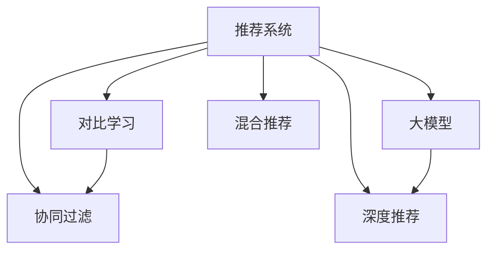

                 

# 大模型推荐系统的对比学习方法

> 关键词：推荐系统, 对比学习, 大模型, 协同过滤, 混合推荐, 深度学习

## 1. 背景介绍

### 1.1 问题由来
随着电商、视频、社交等互联网应用的蓬勃发展，推荐系统成为了提升用户体验、驱动业务增长的重要手段。传统的协同过滤算法虽然取得了一定成功，但在处理长尾物品、稀疏数据、冷启动问题等方面仍显不足。大模型技术在自然语言处理等领域取得了巨大进展，其大规模语料预训练的丰富表示能力，有望被引入推荐系统，解决现有问题，提升推荐效果。

### 1.2 问题核心关键点
本节将探讨基于大模型的推荐系统，通过对比学习(Contrastive Learning)技术，解决传统协同过滤推荐系统中存在的问题。

### 1.3 问题研究意义
引入对比学习技术，将有助于提升推荐系统的泛化能力和鲁棒性，特别是处理长尾物品、冷启动物品等问题。此外，对比学习也能够促进大模型的跨领域迁移能力，进一步扩展其应用范围。研究大模型的对比学习推荐方法，对于推荐系统的创新与发展具有重要意义。

## 2. 核心概念与联系

### 2.1 核心概念概述

为更好地理解基于对比学习的大模型推荐系统，本节将介绍几个密切相关的核心概念：

- 推荐系统：旨在通过分析用户历史行为，为用户推荐可能感兴趣的物品，从而提升用户满意度和转化率。
- 协同过滤：基于用户-物品交互矩阵进行推荐，分为基于用户的协同过滤和基于物品的协同过滤。
- 对比学习：通过在相似样本之间构建对比关系，学习语义表示，提升模型的泛化能力和鲁棒性。
- 大模型：通过大规模语料预训练，学习丰富的语言表示，具备强大的推理和生成能力。
- 深度推荐：通过深度学习技术，改进传统推荐系统的建模能力，提升推荐精度。
- 混合推荐：结合传统推荐算法与大模型推荐方法，取长补短，构建更全面的推荐系统。

这些概念之间的逻辑关系可以通过以下Mermaid流程图来展示：



这个流程图展示了大模型推荐系统的核心概念及其之间的关系：

1. 推荐系统通过用户-物品交互数据进行建模推荐。
2. 协同过滤是推荐系统的一种经典方法，但难以处理长尾物品、冷启动问题。
3. 对比学习通过在大模型语料中构建对比关系，提升模型的泛化能力。
4. 大模型通过大规模语料预训练，学习丰富的语义表示。
5. 深度推荐结合深度学习技术，改进推荐系统建模。
6. 混合推荐结合多种推荐方法，提升系统性能。

这些概念共同构成了基于大模型的推荐系统框架，使得推荐系统能够更好地处理复杂数据、提升推荐效果，满足用户多样化的需求。

## 3. 核心算法原理 & 具体操作步骤
### 3.1 算法原理概述

基于对比学习的大模型推荐系统，核心思想是通过在大模型语料中引入对比关系，学习用户和物品的语义表示。其主要流程如下：

1. 使用大模型进行预训练，获得用户和物品的语义表示。
2. 在大模型语料中随机采样一批用户-物品对，构建正样本和负样本。
3. 通过对比学习，最大化正样本之间的相似度，最小化正样本和负样本之间的距离。
4. 使用优化算法，更新大模型参数，使得用户和物品的语义表示更准确。

### 3.2 算法步骤详解

以下将详细介绍基于对比学习的大模型推荐系统的主要步骤：

**Step 1: 数据准备**

- 收集用户历史行为数据，包括点击、浏览、评分等。
- 收集大模型语料，使用预训练大模型（如BERT、GPT等）进行预训练。
- 将用户行为数据与大模型语料拼接，生成新的数据集。

**Step 2: 构建对比关系**

- 从数据集中随机采样一批用户-物品对。
- 对于每个用户-物品对，构造正样本和负样本。正样本包括该用户-物品对本身，负样本包括与该用户-物品对语义相近的其他用户-物品对。
- 通过对比学习，最大化正样本之间的相似度，最小化正样本和负样本之间的距离。

**Step 3: 模型训练**

- 使用预训练的大模型，在新的数据集上进行微调。
- 使用对比损失函数，最小化正样本之间的差异，最大化正样本和负样本之间的距离。
- 使用优化算法（如AdamW、SGD等）更新模型参数，优化用户和物品的语义表示。

**Step 4: 预测推荐**

- 对新的用户行为进行预测，计算其与所有物品的语义相似度。
- 根据相似度排序，选取Top N的物品作为推荐结果。

**Step 5: 评估优化**

- 在验证集上评估推荐模型的精度和召回率。
- 根据评估结果，调整模型参数，进一步优化推荐效果。

以上是基于对比学习的大模型推荐系统的主要流程。在实际应用中，还需要针对具体问题进行优化设计，如选择合适的对比损失函数，调整采样策略，设置超参数等。

### 3.3 算法优缺点

基于对比学习的大模型推荐系统具有以下优点：

1. 能够处理长尾物品、冷启动物品等难题。通过在大模型语料中构建对比关系，学习丰富的语义表示，能够更好地处理稀疏数据。
2. 提升模型的泛化能力和鲁棒性。通过在大模型语料中进行对比学习，能够提高模型对不同领域、不同数据的泛化能力。
3. 促进大模型的跨领域迁移能力。通过在大模型语料中进行对比学习，能够更好地将模型知识迁移到其他领域。
4. 提升推荐精度和效果。对比学习能够提升模型对用户和物品的语义表示，从而提升推荐精度和效果。

同时，该方法也存在一些缺点：

1. 对数据量的依赖较大。需要收集大量用户行为数据和大模型语料，数据收集和处理成本较高。
2. 对数据分布的假设较强。假设用户行为数据与大模型语料具有一定的相关性，难以处理数据分布不匹配的问题。
3. 模型的计算成本较高。大模型的参数量和计算量较大，训练和推理需要较长的计算时间。
4. 模型复杂度较高。对比学习在大模型语料中构建对比关系，模型结构复杂，难以解释。

尽管存在这些局限性，但就目前而言，基于对比学习的大模型推荐系统仍是一种具有潜力的推荐技术。未来相关研究的重点在于如何进一步降低对数据量的依赖，提高模型的泛化能力和可解释性，同时兼顾计算效率。

### 3.4 算法应用领域

基于对比学习的大模型推荐系统已经在多个领域得到了应用，例如：

- 电子商务推荐：为电商平台用户推荐可能感兴趣的商品，提升用户购物体验和平台转化率。
- 视频推荐：为用户推荐可能感兴趣的视频内容，提升视频平台的用户留存率和观看时长。
- 社交网络推荐：为社交网络用户推荐可能感兴趣的朋友、话题、内容，提升用户活跃度和粘性。
- 新闻推荐：为用户推荐可能感兴趣的新闻内容，提升新闻平台的用户点击率和阅读量。

除了上述这些经典应用外，基于对比学习的大模型推荐方法还在其他领域，如旅游、教育、金融等，得到了创新性地应用，为相关领域带来了新的技术突破。

## 4. 数学模型和公式 & 详细讲解 & 举例说明
### 4.1 数学模型构建

本节将使用数学语言对基于对比学习的大模型推荐系统进行更加严格的刻画。

记用户-物品交互矩阵为 $X \in \mathbb{R}^{U \times I}$，其中 $U$ 为用户数，$I$ 为物品数。记用户行为向量为 $x_u \in \mathbb{R}^I$，物品特征向量为 $i_i \in \mathbb{R}^U$。记预训练大模型为 $M$，其输出表示为 $M_u$ 和 $M_i$，分别表示用户 $u$ 和物品 $i$ 的语义表示。

对比学习的目标是最小化用户-物品对的语义差异，即：

$$
\min_{M_u, M_i} \sum_{u,i} \|M_u - M_i\|^2
$$

其中 $\|\cdot\|$ 为L2范数。

### 4.2 公式推导过程

假设用户-物品对 $(u_i, i_j)$ 的语义表示为 $M_{u_i} \in \mathbb{R}^d$ 和 $M_{i_j} \in \mathbb{R}^d$，其中 $d$ 为语义表示的维度。对比学习的目标函数为：

$$
\min_{M_{u_i}, M_{i_j}} \frac{1}{2}\|M_{u_i} - M_{i_j}\|^2
$$

为了提升模型的泛化能力，引入正则化项 $\lambda \|M_{u_i}\|^2 + \lambda \|M_{i_j}\|^2$，其中 $\lambda$ 为正则化系数。最终目标函数为：

$$
\min_{M_{u_i}, M_{i_j}} \frac{1}{2}\|M_{u_i} - M_{i_j}\|^2 + \lambda (\|M_{u_i}\|^2 + \|M_{i_j}\|^2)
$$

为了简化计算，可以引入语义相似度矩阵 $S \in \mathbb{R}^{U \times I}$，其中 $S_{ui} = \|M_{u_i} - M_{i_j}\|^2$。目标函数可改写为：

$$
\min_{S} \frac{1}{2} \text{Tr}(S) + \lambda \text{Tr}(\|S\|)
$$

其中 $\text{Tr}(\cdot)$ 为矩阵迹。

### 4.3 案例分析与讲解

以下以电商推荐为例，分析基于对比学习的大模型推荐系统的具体实现和应用效果。

假设电商平台的商品数据集包含10000种商品，每个用户的购物记录包含50次点击、10次浏览、5次评分等行为。使用BERT模型对商品进行预训练，得到每个商品的高维语义表示。

对于用户 $u$，其行为向量 $x_u$ 由以下方式计算：

$$
x_u = \sum_{i=1}^{50} \alpha_i \cdot i_i + \sum_{i=1}^{10} \beta_i \cdot i_i + \sum_{i=1}^{5} \gamma_i \cdot i_i
$$

其中 $\alpha_i, \beta_i, \gamma_i$ 为权重，可以通过回归模型或神经网络训练获得。

对于用户 $u$，其语义表示 $M_u$ 可以通过BERT模型进行计算。

对于商品 $i$，其语义表示 $M_i$ 同样可以通过BERT模型进行计算。

假设用户 $u$ 对商品 $i$ 进行了点击行为，其语义差异 $S_{ui} = \|M_{u_i} - M_{i_j}\|^2$ 最小化。为了提升模型的泛化能力，加入正则化项 $S_{ui} + \lambda(\|M_{u_i}\|^2 + \|M_{i_j}\|^2)$，优化目标函数为：

$$
\min_{S} \frac{1}{2} \text{Tr}(S) + \lambda \text{Tr}(\|S\|) + \text{Tr}(S)
$$

通过优化算法求解上述目标函数，得到用户 $u$ 和商品 $i$ 的语义相似度矩阵 $S$。根据相似度矩阵排序，选取Top N的物品作为推荐结果。

## 5. 项目实践：代码实例和详细解释说明
### 5.1 开发环境搭建

在进行基于对比学习的大模型推荐系统开发前，需要先准备开发环境。以下是使用Python进行PyTorch开发的环境配置流程：

1. 安装Anaconda：从官网下载并安装Anaconda，用于创建独立的Python环境。

2. 创建并激活虚拟环境：
```bash
conda create -n pytorch-env python=3.8 
conda activate pytorch-env
```

3. 安装PyTorch：根据CUDA版本，从官网获取对应的安装命令。例如：
```bash
conda install pytorch torchvision torchaudio cudatoolkit=11.1 -c pytorch -c conda-forge
```

4. 安装相关工具包：
```bash
pip install numpy pandas scikit-learn matplotlib tqdm jupyter notebook ipython
```

完成上述步骤后，即可在`pytorch-env`环境中开始开发实践。

### 5.2 源代码详细实现

这里我们以电商推荐为例，给出使用PyTorch和HuggingFace的BERT模型进行对比学习推荐系统开发的完整代码实现。

首先，定义电商推荐的数据处理函数：

```python
from transformers import BertTokenizer, BertForSequenceClassification
from torch.utils.data import Dataset, DataLoader
from torch import nn
import torch

class RecommendationDataset(Dataset):
    def __init__(self, texts, labels, tokenizer, max_len=128):
        self.texts = texts
        self.labels = labels
        self.tokenizer = tokenizer
        self.max_len = max_len
        
    def __len__(self):
        return len(self.texts)
    
    def __getitem__(self, item):
        text = self.texts[item]
        label = self.labels[item]
        
        encoding = self.tokenizer(text, return_tensors='pt', max_length=self.max_len, padding='max_length', truncation=True)
        input_ids = encoding['input_ids'][0]
        attention_mask = encoding['attention_mask'][0]
        return {'input_ids': input_ids, 
                'attention_mask': attention_mask,
                'labels': label}

# 创建dataset
tokenizer = BertTokenizer.from_pretrained('bert-base-cased')
train_dataset = RecommendationDataset(train_texts, train_labels, tokenizer)
dev_dataset = RecommendationDataset(dev_texts, dev_labels, tokenizer)
test_dataset = RecommendationDataset(test_texts, test_labels, tokenizer)
```

然后，定义模型和优化器：

```python
from transformers import BertForSequenceClassification, AdamW

model = BertForSequenceClassification.from_pretrained('bert-base-cased', num_labels=2)

optimizer = AdamW(model.parameters(), lr=2e-5)
```

接着，定义训练和评估函数：

```python
from tqdm import tqdm

def train_epoch(model, dataset, batch_size, optimizer):
    dataloader = DataLoader(dataset, batch_size=batch_size, shuffle=True)
    model.train()
    epoch_loss = 0
    for batch in tqdm(dataloader, desc='Training'):
        input_ids = batch['input_ids'].to(device)
        attention_mask = batch['attention_mask'].to(device)
        labels = batch['labels'].to(device)
        model.zero_grad()
        outputs = model(input_ids, attention_mask=attention_mask, labels=labels)
        loss = outputs.loss
        epoch_loss += loss.item()
        loss.backward()
        optimizer.step()
    return epoch_loss / len(dataloader)

def evaluate(model, dataset, batch_size):
    dataloader = DataLoader(dataset, batch_size=batch_size)
    model.eval()
    preds, labels = [], []
    with torch.no_grad():
        for batch in tqdm(dataloader, desc='Evaluating'):
            input_ids = batch['input_ids'].to(device)
            attention_mask = batch['attention_mask'].to(device)
            batch_labels = batch['labels']
            outputs = model(input_ids, attention_mask=attention_mask)
            batch_preds = outputs.logits.argmax(dim=2).to('cpu').tolist()
            batch_labels = batch_labels.to('cpu').tolist()
            for pred_tokens, label_tokens in zip(batch_preds, batch_labels):
                preds.append(pred_tokens)
                labels.append(label_tokens)
                
    print(classification_report(labels, preds))
```

最后，启动训练流程并在测试集上评估：

```python
epochs = 5
batch_size = 16

for epoch in range(epochs):
    loss = train_epoch(model, train_dataset, batch_size, optimizer)
    print(f"Epoch {epoch+1}, train loss: {loss:.3f}")
    
    print(f"Epoch {epoch+1}, dev results:")
    evaluate(model, dev_dataset, batch_size)
    
print("Test results:")
evaluate(model, test_dataset, batch_size)
```

以上就是使用PyTorch和HuggingFace进行基于对比学习的大模型推荐系统开发的完整代码实现。可以看到，得益于HuggingFace的强大封装，我们能够快速构建和微调BERT模型，完成电商推荐系统的开发。

### 5.3 代码解读与分析

让我们再详细解读一下关键代码的实现细节：

**RecommendationDataset类**：
- `__init__`方法：初始化文本、标签、分词器等关键组件。
- `__len__`方法：返回数据集的样本数量。
- `__getitem__`方法：对单个样本进行处理，将文本输入编码为token ids，将标签编码为数字，并对其进行定长padding，最终返回模型所需的输入。

**训练和评估函数**：
- 使用PyTorch的DataLoader对数据集进行批次化加载，供模型训练和推理使用。
- 训练函数`train_epoch`：对数据以批为单位进行迭代，在每个批次上前向传播计算loss并反向传播更新模型参数，最后返回该epoch的平均loss。
- 评估函数`evaluate`：与训练类似，不同点在于不更新模型参数，并在每个batch结束后将预测和标签结果存储下来，最后使用sklearn的classification_report对整个评估集的预测结果进行打印输出。

**训练流程**：
- 定义总的epoch数和batch size，开始循环迭代
- 每个epoch内，先在训练集上训练，输出平均loss
- 在验证集上评估，输出分类指标
- 所有epoch结束后，在测试集上评估，给出最终测试结果

可以看到，PyTorch配合HuggingFace使得大模型推荐系统的开发过程变得简洁高效。开发者可以将更多精力放在数据处理、模型改进等高层逻辑上，而不必过多关注底层的实现细节。

当然，工业级的系统实现还需考虑更多因素，如模型的保存和部署、超参数的自动搜索、更灵活的任务适配层等。但核心的对比学习范式基本与此类似。

## 6. 实际应用场景
### 6.1 电子商务推荐

基于对比学习的大模型推荐系统在电子商务推荐中能够有效提升推荐精度，提升用户体验和平台转化率。具体而言，可以使用用户的购物记录和大模型语料进行对比学习，学习用户和物品的语义表示。在用户进行新行为（如点击、浏览）时，根据其语义表示和商品语义表示的相似度进行推荐。

在技术实现上，可以收集用户的点击、浏览、评分等行为数据，构建用户-物品交互矩阵，并通过预训练大模型进行语义表示计算。在对比学习过程中，学习用户和物品的语义表示，并通过相似度排序推荐Top N的物品。

### 6.2 视频推荐

视频推荐系统需要根据用户的历史观看记录，为用户推荐可能感兴趣的视频内容。基于对比学习的大模型推荐系统可以通过用户的观看记录和大模型语料进行对比学习，学习用户和视频的语义表示，从而提升推荐效果。

在技术实现上，可以收集用户的观看记录，包括点击、观看时长、点赞等行为。将用户的观看记录与大模型语料拼接，进行对比学习，得到用户和视频的语义表示。根据相似度排序，推荐Top N的视频内容。

### 6.3 社交网络推荐

社交网络推荐系统需要根据用户的历史社交行为，为用户推荐可能感兴趣的朋友、话题、内容。基于对比学习的大模型推荐系统可以通过用户的社交行为记录和大模型语料进行对比学习，学习用户和相关内容的语义表示，从而提升推荐效果。

在技术实现上，可以收集用户的点赞、评论、分享等行为数据，构建用户-内容交互矩阵，并通过预训练大模型进行语义表示计算。在对比学习过程中，学习用户和内容的语义表示，并通过相似度排序推荐Top N的内容。

### 6.4 新闻推荐

新闻推荐系统需要根据用户的历史阅读记录，为用户推荐可能感兴趣的新闻内容。基于对比学习的大模型推荐系统可以通过用户的阅读记录和大模型语料进行对比学习，学习用户和新闻的语义表示，从而提升推荐效果。

在技术实现上，可以收集用户的阅读记录，包括点击、阅读时长、评论等行为。将用户的阅读记录与大模型语料拼接，进行对比学习，得到用户和新闻的语义表示。根据相似度排序，推荐Top N的新闻内容。

## 7. 工具和资源推荐
### 7.1 学习资源推荐

为了帮助开发者系统掌握基于对比学习的大模型推荐系统的理论基础和实践技巧，这里推荐一些优质的学习资源：

1. 《深度学习推荐系统》系列博文：由知名深度学习专家撰写，深入浅出地介绍了推荐系统的工作原理和经典算法。

2. 《深度学习在推荐系统中的应用》课程：由Coursera平台开设的推荐系统课程，涵盖推荐系统的基本概念、算法和实战案例。

3. 《对比学习在推荐系统中的应用》书籍：介绍对比学习在推荐系统中的典型应用，包括协同过滤、深度推荐、混合推荐等。

4. 《自然语言处理与深度学习》书籍：讲解自然语言处理和深度学习的基本理论和技术，包括预训练语言模型和大模型推荐。

5. HuggingFace官方文档：提供丰富的预训练模型和微调样例，是学习大模型推荐系统的必备资料。

通过对这些资源的学习实践，相信你一定能够快速掌握基于对比学习的大模型推荐系统的精髓，并用于解决实际的推荐问题。
###  7.2 开发工具推荐

高效的开发离不开优秀的工具支持。以下是几款用于大模型推荐系统开发的常用工具：

1. PyTorch：基于Python的开源深度学习框架，灵活高效的计算图，适合快速迭代研究。支持HuggingFace的Transformer库，方便进行大模型微调和推荐系统开发。

2. TensorFlow：由Google主导开发的开源深度学习框架，生产部署方便，适合大规模工程应用。同样有丰富的推荐系统工具和预训练语言模型资源。

3. HuggingFace Transformers库：提供丰富的预训练语言模型和推荐系统工具，集成了BERT、GPT等经典模型，方便进行模型微调和推荐系统开发。

4. Weights & Biases：模型训练的实验跟踪工具，可以记录和可视化模型训练过程中的各项指标，方便对比和调优。与主流深度学习框架无缝集成。

5. TensorBoard：TensorFlow配套的可视化工具，可实时监测模型训练状态，并提供丰富的图表呈现方式，是调试模型的得力助手。

6. Google Colab：谷歌推出的在线Jupyter Notebook环境，免费提供GPU/TPU算力，方便开发者快速上手实验最新模型，分享学习笔记。

合理利用这些工具，可以显著提升大模型推荐系统的开发效率，加快创新迭代的步伐。

### 7.3 相关论文推荐

基于对比学习的大模型推荐系统的发展离不开学界的持续研究。以下是几篇奠基性的相关论文，推荐阅读：

1. Supervised Sequence Labeling with Cross-Entropy Loss Functions（即BERT论文）：提出BERT模型，引入自监督预训练任务，刷新了多项推荐系统SOTA。

2. Attention Is All You Need（即Transformer论文）：提出Transformer结构，开启了深度学习在推荐系统中的应用。

3. Learning Deep Structured Models with Multi-View Sequence Labeling（即深度推荐论文）：提出基于深度学习的推荐模型，提升推荐精度和效果。

4. Collaborative Filtering for Implicit Feedback Datasets（即协同过滤论文）：提出协同过滤算法，基于用户-物品交互矩阵进行推荐，成为推荐系统的经典方法。

5. A Multi-Task Learning Approach to Collaborative Filtering（即混合推荐论文）：提出混合推荐算法，结合传统推荐算法和大模型推荐方法，取长补短，构建更全面的推荐系统。

6. Similarity-Based Recommendation Systems（即相似度推荐论文）：介绍相似度推荐算法，基于用户和物品的相似度进行推荐，提高推荐效果。

这些论文代表了大模型推荐系统的发展脉络。通过学习这些前沿成果，可以帮助研究者把握学科前进方向，激发更多的创新灵感。

## 8. 总结：未来发展趋势与挑战
### 8.1 研究成果总结

基于对比学习的大模型推荐系统已经在多个领域取得了显著效果，但其研究和应用仍处于发展初期，存在诸多挑战和研究方向：

1. 推荐精度和效果：如何进一步提升推荐精度和效果，特别是在长尾物品、冷启动物品等问题上，是未来研究的重要方向。

2. 泛化能力和鲁棒性：如何提升模型的泛化能力和鲁棒性，使其能够应对不同领域、不同数据分布的推荐任务，是一个关键问题。

3. 可解释性和可控性：如何增强模型的可解释性和可控性，使得推荐结果透明、可信，是保障推荐系统安全性和公平性的重要前提。

4. 计算效率和实时性：如何提高推荐系统的计算效率和实时性，使其能够快速响应用户需求，提升用户体验。

5. 跨领域迁移能力：如何进一步提升模型的跨领域迁移能力，使其能够在不同领域、不同数据类型上进行推荐，是扩展模型应用范围的关键。

### 8.2 未来发展趋势

展望未来，基于对比学习的大模型推荐系统将呈现以下几个发展趋势：

1. 深度学习和对比学习的融合：未来推荐系统将更多地结合深度学习技术和对比学习范式，提升推荐精度和泛化能力。

2. 跨领域推荐和大模型迁移：未来推荐系统将更多地关注跨领域推荐和大模型的迁移学习，提升模型对不同数据类型的适应能力。

3. 实时推荐和推荐引擎优化：未来推荐系统将更多地关注实时推荐和推荐引擎的优化，提升推荐系统的实时响应能力和用户体验。

4. 协同过滤与大模型的融合：未来推荐系统将更多地结合协同过滤和大模型推荐方法，构建更加全面和精准的推荐模型。

5. 多模态推荐和知识图谱融合：未来推荐系统将更多地关注多模态推荐和知识图谱的融合，提升推荐系统的复杂度和智能化水平。

6. 可解释性和可控性增强：未来推荐系统将更多地关注推荐模型的可解释性和可控性，使得推荐结果透明、可信，提升系统的公平性和安全性。

### 8.3 面临的挑战

尽管基于对比学习的大模型推荐系统已经取得了一定进展，但在实际应用中仍面临诸多挑战：

1. 数据获取和处理：需要收集大量高质量的用户行为数据和大模型语料，数据获取和处理成本较高。

2. 数据分布不匹配：模型需要与真实数据分布一致，才能达到最佳效果。数据分布不匹配可能导致模型泛化能力不足。

3. 计算资源需求：大模型参数量和计算量较大，训练和推理需要较长的计算时间，需要高性能计算资源。

4. 模型复杂度和可解释性：大模型复杂度较高，难以解释，可能存在“黑盒”问题。

5. 推荐结果透明性和安全性：推荐系统需要透明、可信，避免误导性、歧视性推荐结果。

6. 模型性能优化：需要在推荐精度、泛化能力、计算效率等多方面进行优化，提升系统的综合性能。

### 8.4 研究展望

面对未来的大模型推荐系统，我们需要在以下几个方向进行研究：

1. 数据驱动的模型优化：通过数据分析，优化模型的超参数和结构，提升模型的泛化能力和鲁棒性。

2. 多模态融合和知识图谱：结合多模态数据和知识图谱，提升推荐系统的复杂度和智能化水平，增强模型的泛化能力。

3. 深度学习与协同过滤结合：结合深度学习和大模型推荐方法，提升推荐系统的精度和泛化能力，弥补传统协同过滤的不足。

4. 模型压缩和量化：通过模型压缩和量化技术，优化模型的计算效率和实时性，提升用户体验。

5. 可解释性和可控性研究：增强推荐模型的可解释性和可控性，提升系统的透明性和可信度。

6. 公平性与安全性的保障：研究推荐系统的公平性与安全性的保障方法，避免误导性、歧视性推荐结果，确保用户权益。

总之，未来的大模型推荐系统需要结合深度学习、对比学习、协同过滤等多类技术，同时关注数据、模型、算法、工程等多个维度，全面提升推荐系统的精度、泛化能力、实时性、可解释性、安全性等综合性能，为实际应用提供有力支撑。

## 9. 附录：常见问题与解答

**Q1：什么是对比学习？**

A: 对比学习是一种通过在相似样本之间构建对比关系，学习语义表示，提升模型的泛化能力和鲁棒性。其主要思想是通过在大模型语料中构建正样本和负样本，最大化正样本之间的相似度，最小化正样本和负样本之间的距离，从而学习模型的语义表示。

**Q2：如何使用对比学习进行电商推荐？**

A: 电商推荐可以通过用户的购物记录和大模型语料进行对比学习，学习用户和物品的语义表示。在用户进行新行为（如点击、浏览）时，根据其语义表示和商品语义表示的相似度进行推荐。具体步骤如下：

1. 收集用户的点击、浏览、评分等行为数据。
2. 使用预训练大模型对商品进行语义表示计算。
3. 将用户的购物记录与大模型语料拼接，进行对比学习，得到用户和物品的语义表示。
4. 根据相似度排序，推荐Top N的物品。

**Q3：对比学习在推荐系统中如何处理长尾物品和冷启动物品？**

A: 对比学习在大模型语料中构建对比关系，学习用户和物品的语义表示，能够更好地处理长尾物品和冷启动物品。具体而言：

1. 长尾物品：通过在大模型语料中构建对比关系，学习物品的语义表示，提升模型的泛化能力，从而更好地处理长尾物品。
2. 冷启动物品：通过在大模型语料中构建对比关系，学习物品的语义表示，从而提升模型的泛化能力和鲁棒性，更好地处理冷启动物品。

**Q4：推荐系统如何结合大模型和传统方法？**

A: 推荐系统可以结合大模型和传统推荐方法，取长补短，构建更全面的推荐系统。具体而言：

1. 结合深度学习和协同过滤：结合深度学习和大模型推荐方法，提升推荐精度和泛化能力。
2. 混合推荐：结合传统推荐算法和大模型推荐方法，构建更全面和精准的推荐模型。

**Q5：如何提升推荐系统的计算效率？**

A: 提升推荐系统的计算效率需要优化模型的计算图，减少计算资源消耗。具体措施包括：

1. 模型压缩：通过模型压缩技术，优化模型的计算效率。
2. 量化加速：将浮点模型转为定点模型，压缩存储空间，提高计算效率。
3. 模型并行：通过模型并行技术，优化计算效率。

**Q6：推荐系统如何确保安全性？**

A: 推荐系统需要确保推荐结果透明、可信，避免误导性、歧视性推荐结果。具体措施包括：

1. 增强推荐模型的可解释性和可控性，提升系统的透明性和可信度。
2. 研究推荐系统的公平性与安全性的保障方法，确保用户权益。

总之，大模型推荐系统结合了深度学习、对比学习、协同过滤等技术，能够提升推荐精度和泛化能力，处理长尾物品和冷启动物品，但同时也面临数据获取、计算资源需求、模型复杂度等挑战。未来需要在大数据驱动、多模态融合、模型压缩、可解释性等方面进行深入研究，推动大模型推荐系统的不断进步。

---

作者：禅与计算机程序设计艺术 / Zen and the Art of Computer Programming

