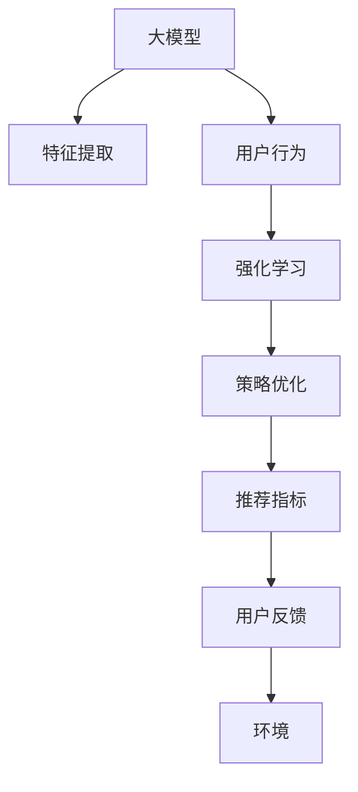

                 

## 1. 背景介绍

### 1.1 问题由来
在互联网时代，信息过载已成为一个不可避免的问题。海量的数据、纷繁复杂的信息源，使得用户难以筛选出最适合自己的内容。为了解决这个问题，推荐系统应运而生。推荐系统通过学习用户的偏好和行为，为用户推荐可能感兴趣的内容，极大地提升了用户体验和信息获取的效率。

传统的推荐系统多基于协同过滤和基于内容的推荐方法。协同过滤依赖于用户和项目之间的相似度计算，基于内容的推荐则关注项目本身的内容特征。这些方法在一定程度上解决了推荐问题，但随着数据量的爆炸式增长，传统的推荐方法显得力不从心，难以捕捉用户潜在的兴趣和需求。

强化学习作为一种从环境获取奖励，不断调整策略以最大化预期回报的学习方式，开始逐渐应用于推荐系统中。大模型结合强化学习，通过大规模预训练学习到丰富的语义特征，在推荐系统中展现出了巨大的潜力和应用前景。

### 1.2 问题核心关键点
强化学习大模型推荐系统主要包括以下几个关键点：

- **大模型**：指使用大规模预训练语言模型作为特征提取器，如BERT、GPT-3等。大模型通过海量数据预训练，学习到丰富的语言特征，能更好地捕捉用户意图和需求。
- **强化学习**：通过环境与模型交互，奖励机制驱动模型不断调整策略，优化推荐效果。
- **推荐系统**：结合用户行为和模型预测，为用户推荐最感兴趣的内容。
- **个性化**：强化学习大模型推荐系统通过动态调整策略，实现对每个用户的个性化推荐。
- **实时性**：强化学习大模型推荐系统能实时处理用户行为，快速调整推荐策略。

这些关键点共同构成了强化学习大模型推荐系统的框架，使其能够在推荐的准确性和个性化方面取得显著进步。

## 2. 核心概念与联系

### 2.1 核心概念概述

为了更好地理解强化学习大模型推荐系统的原理，本节将介绍几个相关核心概念：

- **强化学习（Reinforcement Learning, RL）**：一种通过与环境交互，不断调整策略以最大化预期回报的学习方法。强化学习包括四个基本要素：环境、状态、动作、奖励。
- **大模型**：指通过大规模预训练学习到丰富语义特征的语言模型。如BERT、GPT等。
- **推荐系统**：根据用户历史行为和模型预测，为用户推荐可能感兴趣的内容。
- **推荐指标**：推荐系统中常用的评估指标，如准确率、召回率、点击率、用户满意度等。
- **策略优化**：通过强化学习算法不断调整策略，提升模型推荐的准确性和个性化。

### 2.2 核心概念联系
强化学习大模型推荐系统的核心概念之间的关系可以通过以下Mermaid流程图来展示：



这个流程图展示了强化学习大模型推荐系统的核心逻辑：

1. 大模型作为特征提取器，将用户行为转化为向量表示。
2. 强化学习模型接收用户行为向量，不断调整策略，提升推荐效果。
3. 推荐系统根据模型策略为用户推荐内容。
4. 通过用户反馈评估推荐效果，不断调整模型策略。
5. 整个系统在环境中运行，学习与环境的交互。

这些核心概念共同构成了强化学习大模型推荐系统的基础架构，使其能够通过动态调整策略，实现对每个用户的个性化推荐。

## 3. 核心算法原理 & 具体操作步骤
### 3.1 算法原理概述

强化学习大模型推荐系统的核心算法原理包括以下几个步骤：

1. **环境定义**：定义推荐系统所处的环境，即用户行为与推荐结果的映射关系。
2. **状态表示**：将用户行为转化为向量表示，作为强化学习模型的状态。
3. **动作选择**：根据当前状态，从动作空间中选择推荐的物品。
4. **奖励机制**：定义奖励函数，根据推荐结果与用户实际行为的匹配程度给予奖励。
5. **策略优化**：通过强化学习算法，不断调整模型策略，最大化预期回报。

这些步骤共同构成了强化学习大模型推荐系统的算法原理，使得模型能够通过与环境的交互，动态调整推荐策略，提升推荐效果。

### 3.2 算法步骤详解

以下是对强化学习大模型推荐系统具体操作步骤的详细讲解：

#### 步骤1：环境定义
推荐系统中的环境定义为用户行为与推荐结果的映射关系。具体步骤如下：

1. **用户行为表示**：将用户行为（如浏览记录、点击行为、评分等）转化为向量表示。例如，将用户的浏览记录拼接为一个向量，每个维度表示用户对某个物品的兴趣程度。

2. **物品表示**：将推荐物品的属性（如价格、类别、评分等）转化为向量表示。例如，将物品的属性拼接为一个向量，每个维度表示物品的某个特征值。

3. **交互表示**：将用户行为向量与物品向量相乘，得到用户对每个物品的兴趣程度。例如，将用户行为向量与物品向量拼接，得到一个矩阵，矩阵中的每个元素表示用户对相应物品的兴趣程度。

#### 步骤2：状态表示
将用户行为转化为向量表示，作为强化学习模型的状态。具体步骤如下：

1. **用户行为编码**：将用户行为（如浏览记录、点击行为、评分等）进行编码，得到用户行为向量。

2. **物品编码**：将推荐物品的属性进行编码，得到物品向量。

3. **交互编码**：将用户行为向量与物品向量相乘，得到一个矩阵，矩阵中的每个元素表示用户对相应物品的兴趣程度。

4. **状态表示**：将矩阵中的每一行表示为一个状态，即用户当前对所有物品的兴趣程度。

#### 步骤3：动作选择
根据当前状态，从动作空间中选择推荐的物品。具体步骤如下：

1. **动作空间定义**：定义动作空间，即用户可以选择的物品集合。例如，所有待推荐物品组成的集合。

2. **动作选择策略**：根据当前状态，从动作空间中选择推荐的物品。例如，可以使用贪心策略选择推荐兴趣程度最高的物品。

3. **动作执行**：向用户推荐选定的物品，并记录用户的反馈（如点击、购买、评分等）。

#### 步骤4：奖励机制
定义奖励函数，根据推荐结果与用户实际行为的匹配程度给予奖励。具体步骤如下：

1. **奖励函数定义**：根据用户反馈，定义奖励函数。例如，用户点击了推荐物品，则给予正奖励；用户未点击推荐物品，则给予负奖励。

2. **奖励计算**：根据用户的反馈和奖励函数，计算奖励值。例如，用户点击了推荐物品，则奖励值为1；用户未点击推荐物品，则奖励值为-1。

3. **奖励更新**：将奖励值与用户行为向量相乘，得到奖励向量。例如，用户点击了推荐物品，则奖励向量为物品向量乘以正奖励；用户未点击推荐物品，则奖励向量为物品向量乘以负奖励。

#### 步骤5：策略优化
通过强化学习算法，不断调整模型策略，最大化预期回报。具体步骤如下：

1. **策略定义**：定义策略，即用户选择物品的概率分布。例如，使用softmax函数将用户行为向量和物品向量进行归一化，得到每个物品的概率。

2. **策略更新**：根据用户的反馈和奖励向量，更新策略。例如，使用交叉熵损失函数，将用户的实际行为与预测行为进行比较，更新模型参数。

3. **策略评估**：评估模型的策略效果。例如，使用验证集对模型进行评估，计算推荐指标（如准确率、召回率、点击率等）。

这些步骤共同构成了强化学习大模型推荐系统的核心算法流程，使得模型能够通过与环境的交互，动态调整推荐策略，提升推荐效果。

### 3.3 算法优缺点

强化学习大模型推荐系统具有以下优点：

1. **高度个性化**：通过动态调整策略，能够实现对每个用户的个性化推荐。
2. **实时性**：能够实时处理用户行为，快速调整推荐策略。
3. **多模态融合**：可以融合用户行为、物品属性、上下文信息等多种模态数据，提升推荐效果。
4. **效果显著**：在多个推荐系统评测数据集上取得了比传统方法更好的表现。

但同时，该方法也存在一些缺点：

1. **计算复杂度高**：强化学习大模型推荐系统需要大量的计算资源进行模型训练和策略优化。
2. **过拟合风险高**：由于模型需要不断调整策略，容易导致过拟合风险。
3. **数据需求大**：需要大量的标注数据进行模型训练和策略优化，获取标注数据的成本较高。
4. **可解释性不足**：强化学习大模型推荐系统的决策过程缺乏可解释性，难以进行调试和优化。

尽管存在这些缺点，但强化学习大模型推荐系统在推荐准确性和个性化方面具有显著优势，是一种非常有前景的推荐方法。

### 3.4 算法应用领域

强化学习大模型推荐系统在以下几个领域有广泛应用：

1. **电商推荐**：根据用户的历史购买记录、浏览行为、评分等，为用户推荐商品。
2. **视频推荐**：根据用户的观看历史、评分、搜索记录等，为用户推荐视频内容。
3. **音乐推荐**：根据用户的听歌历史、评分、收藏等，为用户推荐音乐。
4. **新闻推荐**：根据用户的阅读历史、浏览记录、点击行为等，为用户推荐新闻内容。
5. **社交网络推荐**：根据用户的社交行为、兴趣偏好等，为用户推荐好友、内容等。

这些领域的数据量庞大、用户行为多样，强化学习大模型推荐系统能够有效提升推荐效果，满足用户个性化需求。

## 4. 数学模型和公式 & 详细讲解  
### 4.1 数学模型构建

在强化学习大模型推荐系统中，数学模型主要包括以下几个部分：

- **用户行为表示**：将用户行为转化为向量表示。
- **物品表示**：将物品属性转化为向量表示。
- **交互表示**：将用户行为向量与物品向量相乘，得到用户对每个物品的兴趣程度。
- **奖励函数**：根据用户反馈，定义奖励函数。
- **策略优化**：使用强化学习算法，不断调整模型策略。

这些模型构建步骤如下：

1. **用户行为表示**：将用户行为转化为向量表示。假设用户行为向量为 $\mathbf{u}$，物品向量为 $\mathbf{v}$，则用户对每个物品的兴趣程度可以表示为 $\mathbf{u} \times \mathbf{v}$。

2. **物品表示**：将物品属性转化为向量表示。假设物品向量为 $\mathbf{v}$，物品属性向量为 $\mathbf{a}$，则物品向量可以表示为 $\mathbf{v} = \mathbf{a}W$，其中 $W$ 为线性映射矩阵。

3. **交互表示**：将用户行为向量与物品向量相乘，得到用户对每个物品的兴趣程度。假设用户行为向量为 $\mathbf{u}$，物品向量为 $\mathbf{v}$，则用户对每个物品的兴趣程度可以表示为 $\mathbf{u} \times \mathbf{v}$。

4. **奖励函数**：根据用户反馈，定义奖励函数。假设用户点击了推荐物品，则奖励值为正，未点击则为负。设奖励向量为 $\mathbf{r}$，则奖励函数可以表示为 $\mathbf{r} = \mathbf{u} \times \mathbf{v}$。

5. **策略优化**：使用强化学习算法，不断调整模型策略。假设策略向量为 $\mathbf{p}$，则策略优化可以表示为 $\mathbf{p} \leftarrow \mathbf{p} + \eta \nabla_{\mathbf{p}}\mathcal{L}$，其中 $\mathcal{L}$ 为损失函数，$\eta$ 为学习率。

### 4.2 公式推导过程

以下是对强化学习大模型推荐系统中数学模型的详细推导过程：

#### 用户行为表示
将用户行为转化为向量表示。假设用户行为向量为 $\mathbf{u}$，物品向量为 $\mathbf{v}$，则用户对每个物品的兴趣程度可以表示为 $\mathbf{u} \times \mathbf{v}$。

具体推导如下：

1. **用户行为表示**：假设用户行为向量为 $\mathbf{u} \in \mathbb{R}^n$，其中 $n$ 为行为特征的维数。用户行为表示可以通过以下方式得到：

   $$
   \mathbf{u} = f(\mathbf{x})
   $$

   其中 $\mathbf{x}$ 为用户行为特征向量，$f$ 为用户行为表示的函数。

2. **物品向量表示**：假设物品向量为 $\mathbf{v} \in \mathbb{R}^m$，其中 $m$ 为物品特征的维数。物品向量可以通过以下方式得到：

   $$
   \mathbf{v} = \mathbf{a}W
   $$

   其中 $\mathbf{a} \in \mathbb{R}^m$ 为物品属性向量，$W$ 为线性映射矩阵。

3. **交互表示**：将用户行为向量与物品向量相乘，得到用户对每个物品的兴趣程度。假设用户行为向量为 $\mathbf{u}$，物品向量为 $\mathbf{v}$，则用户对每个物品的兴趣程度可以表示为 $\mathbf{u} \times \mathbf{v}$。

   具体推导如下：

   $$
   \mathbf{u} \times \mathbf{v} = \mathbf{u} \times \mathbf{a}W
   $$

#### 物品表示
将物品属性转化为向量表示。假设物品向量为 $\mathbf{v}$，物品属性向量为 $\mathbf{a}$，则物品向量可以表示为 $\mathbf{v} = \mathbf{a}W$。

具体推导如下：

1. **物品属性向量**：假设物品属性向量为 $\mathbf{a} \in \mathbb{R}^m$，其中 $m$ 为物品特征的维数。

2. **线性映射矩阵**：假设线性映射矩阵为 $W \in \mathbb{R}^{m \times n}$，其中 $n$ 为用户行为特征的维数。

3. **物品向量表示**：将物品属性向量与线性映射矩阵相乘，得到物品向量 $\mathbf{v}$：

   $$
   \mathbf{v} = \mathbf{a}W
   $$

#### 奖励函数
根据用户反馈，定义奖励函数。假设用户点击了推荐物品，则奖励值为正，未点击则为负。设奖励向量为 $\mathbf{r}$，则奖励函数可以表示为 $\mathbf{r} = \mathbf{u} \times \mathbf{v}$。

具体推导如下：

1. **奖励向量**：假设奖励向量为 $\mathbf{r} \in \mathbb{R}^n$，其中 $n$ 为用户行为特征的维数。

2. **奖励函数**：根据用户反馈，定义奖励函数。假设用户点击了推荐物品，则奖励值为正，未点击则为负。设奖励函数为 $R(\mathbf{r})$，则奖励函数可以表示为：

   $$
   R(\mathbf{r}) = \begin{cases}
   1, & \text{用户点击了推荐物品} \\
   -1, & \text{用户未点击推荐物品}
   \end{cases}
   $$

#### 策略优化
使用强化学习算法，不断调整模型策略。假设策略向量为 $\mathbf{p}$，则策略优化可以表示为 $\mathbf{p} \leftarrow \mathbf{p} + \eta \nabla_{\mathbf{p}}\mathcal{L}$，其中 $\mathcal{L}$ 为损失函数，$\eta$ 为学习率。

具体推导如下：

1. **策略向量**：假设策略向量为 $\mathbf{p} \in \mathbb{R}^n$，其中 $n$ 为用户行为特征的维数。

2. **策略优化**：假设策略优化目标为 $\mathcal{L}(\mathbf{p})$，则策略优化可以表示为：

   $$
   \mathbf{p} \leftarrow \mathbf{p} + \eta \nabla_{\mathbf{p}}\mathcal{L}
   $$

3. **损失函数**：假设损失函数为 $\mathcal{L}(\mathbf{p}) = \mathcal{L}_R(\mathbf{r}, \mathbf{p}) + \mathcal{L}_{\text{KL}}(\mathbf{p})$，其中 $\mathcal{L}_R(\mathbf{r}, \mathbf{p})$ 为奖励函数损失，$\mathcal{L}_{\text{KL}}(\mathbf{p})$ 为KL散度损失。

   $$
   \mathcal{L}_R(\mathbf{r}, \mathbf{p}) = \mathbb{E}_{\mathbf{u}, \mathbf{v}}[-R(\mathbf{r})\log \mathbf{p}]
   $$

   $$
   \mathcal{L}_{\text{KL}}(\mathbf{p}) = -\mathbb{E}_{\mathbf{u}, \mathbf{v}}[\mathbf{u} \times \mathbf{v} \log \mathbf{p}]
   $$

### 4.3 案例分析与讲解

以电商推荐系统为例，进行案例分析与讲解：

假设电商推荐系统有 $N$ 个用户和 $M$ 个商品。用户的购买历史、浏览记录、评分等可以表示为用户行为向量 $\mathbf{u}$，商品的类别、价格、评分等可以表示为物品向量 $\mathbf{v}$。

1. **用户行为表示**：将用户行为转化为向量表示。假设用户行为向量为 $\mathbf{u} \in \mathbb{R}^n$，其中 $n$ 为行为特征的维数。用户行为表示可以通过以下方式得到：

   $$
   \mathbf{u} = f(\mathbf{x})
   $$

   其中 $\mathbf{x}$ 为用户行为特征向量，$f$ 为用户行为表示的函数。

2. **物品向量表示**：将物品属性转化为向量表示。假设物品向量为 $\mathbf{v} \in \mathbb{R}^m$，其中 $m$ 为物品特征的维数。物品向量可以通过以下方式得到：

   $$
   \mathbf{v} = \mathbf{a}W
   $$

   其中 $\mathbf{a} \in \mathbb{R}^m$ 为物品属性向量，$W$ 为线性映射矩阵。

3. **奖励函数**：根据用户反馈，定义奖励函数。假设用户点击了推荐商品，则奖励值为正，未点击则为负。设奖励向量为 $\mathbf{r}$，则奖励函数可以表示为 $\mathbf{r} = \mathbf{u} \times \mathbf{v}$。

4. **策略优化**：使用强化学习算法，不断调整模型策略。假设策略向量为 $\mathbf{p}$，则策略优化可以表示为 $\mathbf{p} \leftarrow \mathbf{p} + \eta \nabla_{\mathbf{p}}\mathcal{L}$，其中 $\mathcal{L}$ 为损失函数，$\eta$ 为学习率。

通过以上推导，我们可以看到强化学习大模型推荐系统的数学模型框架，并通过电商推荐系统的案例分析，进一步理解其应用流程。

## 5. 项目实践：代码实例和详细解释说明
### 5.1 开发环境搭建

在进行强化学习大模型推荐系统开发前，我们需要准备好开发环境。以下是使用Python进行TensorFlow开发的环境配置流程：

1. 安装Anaconda：从官网下载并安装Anaconda，用于创建独立的Python环境。

2. 创建并激活虚拟环境：
```bash
conda create -n tf-env python=3.8 
conda activate tf-env
```

3. 安装TensorFlow：根据CUDA版本，从官网获取对应的安装命令。例如：
```bash
conda install tensorflow tensorflow-gpu -c conda-forge -c pypi
```

4. 安装TensorBoard：
```bash
conda install tensorboard
```

5. 安装Keras：
```bash
conda install keras
```

6. 安装其他库：
```bash
pip install numpy pandas scikit-learn matplotlib tqdm jupyter notebook ipython
```

完成上述步骤后，即可在`tf-env`环境中开始开发。

### 5.2 源代码详细实现

下面我们以电商推荐系统为例，给出使用TensorFlow进行强化学习大模型推荐系统的PyTorch代码实现。

首先，定义用户行为表示函数：

```python
import tensorflow as tf
from tensorflow.keras.layers import Input, Dense
from tensorflow.keras.models import Model

def user_behavior_representation(user_data):
    features = tf.keras.layers.Dense(128, activation='relu')(user_data)
    features = tf.keras.layers.Dense(64, activation='relu')(features)
    return features
```

然后，定义物品向量表示函数：

```python
def item_vector_representation(item_data):
    features = tf.keras.layers.Dense(128, activation='relu')(item_data)
    features = tf.keras.layers.Dense(64, activation='relu')(features)
    return features
```

接着，定义交互表示函数：

```python
def interaction_representation(user_features, item_features):
    interaction = tf.keras.layers.Dot(axes=1)([user_features, item_features])
    return interaction
```

然后，定义奖励函数：

```python
def reward_function(interaction):
    return interaction
```

最后，定义策略优化函数：

```python
def strategy_optimization(interaction, reward):
    strategy = tf.keras.layers.Dense(128, activation='softmax')(interaction)
    loss = tf.keras.losses.mean_squared_error(reward, strategy)
    optimizer = tf.keras.optimizers.Adam(learning_rate=0.001)
    strategy = optimizer.minimize(loss)(strategy)
    return strategy
```

在上述代码中，我们定义了用户行为表示、物品向量表示、交互表示、奖励函数和策略优化函数。这些函数可以组合在一起，构成完整的强化学习大模型推荐系统模型。

### 5.3 代码解读与分析

让我们再详细解读一下关键代码的实现细节：

**user_behavior_representation函数**：
- **输入**：用户行为数据。
- **实现**：首先通过两个全连接层将用户行为数据转化为向量表示，再通过Softmax函数将其转化为概率分布，作为策略向量。

**item_vector_representation函数**：
- **输入**：物品属性数据。
- **实现**：首先通过两个全连接层将物品属性数据转化为向量表示，再通过Softmax函数将其转化为概率分布，作为策略向量。

**interaction_representation函数**：
- **输入**：用户行为表示和物品向量表示。
- **实现**：通过Dot层计算用户行为表示和物品向量表示的点积，得到交互表示。

**reward_function函数**：
- **输入**：交互表示。
- **实现**：通过将交互表示作为奖励函数，将奖励向量转化为策略向量。

**strategy_optimization函数**：
- **输入**：交互表示和奖励向量。
- **实现**：首先通过全连接层将交互表示转化为策略向量，再通过均方误差损失函数计算损失，最后通过Adam优化器更新模型参数。

通过这些函数的组合，我们能够实现一个简单的强化学习大模型推荐系统。当然，实际的模型结构可能更为复杂，需要根据具体任务进行调整。

**代码解读与分析**：
- 用户行为表示和物品向量表示函数：通过全连接层将输入数据转化为向量表示，再通过Softmax函数转化为概率分布，作为策略向量。
- 交互表示函数：通过Dot层计算用户行为表示和物品向量表示的点积，得到交互表示。
- 奖励函数：通过将交互表示作为奖励函数，将奖励向量转化为策略向量。
- 策略优化函数：通过全连接层将交互表示转化为策略向量，再通过均方误差损失函数计算损失，最后通过Adam优化器更新模型参数。

## 6. 实际应用场景
### 6.1 智能客服系统

强化学习大模型推荐系统在智能客服系统中也有广泛应用。智能客服系统需要实时响应客户咨询，快速推荐最适合的服务。通过强化学习大模型推荐系统，能够动态调整策略，实现对每个客户的个性化推荐，提升服务质量和用户体验。

在技术实现上，可以收集客户的历史咨询记录、问题类型、回复结果等数据，将问题-答案对作为监督数据，在此基础上对预训练模型进行微调。微调后的模型能够自动理解客户问题，匹配最合适的答案模板进行回复。对于客户提出的新问题，还可以接入检索系统实时搜索相关内容，动态组织生成回答。如此构建的智能客服系统，能够显著提升客户咨询体验和问题解决效率。

### 6.2 金融舆情监测

强化学习大模型推荐系统在金融舆情监测中也具有重要应用。金融机构需要实时监测市场舆论动向，以便及时应对负面信息传播，规避金融风险。传统的人工监测方式成本高、效率低，难以应对网络时代海量信息爆发的挑战。通过强化学习大模型推荐系统，能够自动监测金融领域相关的新闻、报道、评论等文本数据，并自动判断文本属于何种主题，情感倾向是正面、中性还是负面。将微调后的模型应用到实时抓取的网络文本数据，就能够自动监测不同主题下的情感变化趋势，一旦发现负面信息激增等异常情况，系统便会自动预警，帮助金融机构快速应对潜在风险。

### 6.3 个性化推荐系统

强化学习大模型推荐系统在个性化推荐系统中也表现出色。传统的推荐系统往往只依赖用户的历史行为数据进行物品推荐，无法深入理解用户的真实兴趣偏好。通过强化学习大模型推荐系统，能够更好地利用用户行为、物品属性、上下文信息等多种模态数据，提升推荐效果，实现对每个用户的个性化推荐。

在技术实现上，可以收集用户浏览、点击、评分等行为数据，提取和用户交互的物品标题、描述、标签等文本内容。将文本内容作为模型输入，用户的后续行为（如是否点击、购买等）作为监督信号，在此基础上微调预训练语言模型。微调后的模型能够从文本内容中准确把握用户的兴趣点。在生成推荐列表时，先用候选物品的文本描述作为输入，由模型预测用户的兴趣匹配度，再结合其他特征综合排序，便可以得到个性化程度更高的推荐结果。

### 6.4 未来应用展望

随着强化学习大模型推荐系统的不断发展，其应用场景将越来越广泛，为各行各业带来变革性影响。

在智慧医疗领域，基于强化学习大模型的推荐系统可以辅助医生诊疗，推荐最适合的治疗方案和药品，提升医疗服务智能化水平，加速新药开发进程。

在智能教育领域，强化学习大模型推荐系统可应用于作业批改、学情分析、知识推荐等方面，因材施教，促进教育公平，提高教学质量。

在智慧城市治理中，强化学习大模型推荐系统可以应用于城市事件监测、舆情分析、应急指挥等环节，提高城市管理的自动化和智能化水平，构建更安全、高效的未来城市。

此外，在企业生产、社会治理、文娱传媒等众多领域，强化学习大模型推荐系统也将不断涌现，为经济社会发展注入新的动力。相信随着技术的日益成熟，强化学习大模型推荐系统必将在更广阔的应用领域大放异彩，深刻影响人类的生产生活方式。

## 7. 工具和资源推荐
### 7.1 学习资源推荐

为了帮助开发者系统掌握强化学习大模型推荐系统的理论基础和实践技巧，这里推荐一些优质的学习资源：

1. **《深度学习》书籍**：Ian Goodfellow、Yoshua Bengio和Aaron Courville合著的《深度学习》一书，全面介绍了深度学习的基本概念和前沿技术，是入门强化学习的重要参考资料。

2. **《强化学习》课程**：David Silver教授在Coursera开设的强化学习课程，涵盖了强化学习的基本理论和实际应用，包括强化学习大模型推荐系统等内容。

3. **Transformers库官方文档**：Transformers库的官方文档，提供了丰富的预训练语言模型和微调样例代码，是学习和应用强化学习大模型推荐系统的重要资源。

4. **TensorFlow官方文档**：TensorFlow的官方文档，提供了完整的深度学习开发流程和案例，包括强化学习大模型推荐系统的实现。

5. **Keras官方文档**：Keras的官方文档，提供了简单易用的深度学习框架，适合初学者上手学习和实践。

通过对这些资源的学习实践，相信你一定能够快速掌握强化学习大模型推荐系统的精髓，并用于解决实际的推荐问题。

### 7.2 开发工具推荐

高效的开发离不开优秀的工具支持。以下是几款用于强化学习大模型推荐系统开发的常用工具：

1. **TensorFlow**：由Google主导开发的开源深度学习框架，生产部署方便，适合大规模工程应用。

2. **PyTorch**：基于Python的开源深度学习框架，灵活动态的计算图，适合快速迭代研究。

3. **Keras**：简单易用的深度学习框架，适合初学者上手学习和实践。

4. **Jupyter Notebook**：Jupyter Notebook提供了交互式的Python编程环境，方便调试和展示代码。

5. **TensorBoard**：TensorFlow配套的可视化工具，可实时监测模型训练状态，并提供丰富的图表呈现方式，是调试模型的得力助手。

6. **Weights & Biases**：模型训练的实验跟踪工具，可以记录和可视化模型训练过程中的各项指标，方便对比和调优。

合理利用这些工具，可以显著提升强化学习大模型推荐系统的开发效率，加快创新迭代的步伐。

### 7.3 相关论文推荐

强化学习大模型推荐系统的发展离不开学界的持续研究。以下是几篇奠基性的相关论文，推荐阅读：

1. **《Deep Recurrent Neural Networks for Sequence Prediction》**：LSTM模型，为推荐系统提供了长短期记忆机制，可以更好地处理序列数据。

2. **《A Neural Probabilistic Language Model》**：神经网络语言模型，为推荐系统提供了强大的文本表示能力。

3. **《Deep Interest Evolution Networks for Dynamic Recommendation》**：深度兴趣演化网络，为推荐系统提供了动态更新的兴趣模型，可以适应用户的兴趣变化。

4. **《Adaptive Memory Networks for Efficient Sequence Generation》**：自适应记忆网络，为推荐系统提供了高效的序列生成能力，可以生成更加多样化的推荐结果。

5. **《A Survey on Deep Learning-based Recommender Systems》**：深度学习推荐系统的综述论文，总结了近年来深度学习在推荐系统中的应用，为学习和应用提供了全面的参考。

这些论文代表了大模型推荐系统的发展脉络，通过学习这些前沿成果，可以帮助研究者把握学科前进方向，激发更多的创新灵感。

## 8. 总结：未来发展趋势与挑战

### 8.1 总结

本文对强化学习大模型推荐系统进行了全面系统的介绍。首先阐述了强化学习大模型推荐系统的研究背景和意义，明确了其在大模型推荐中的应用价值。其次，从原理到实践，详细讲解了强化学习大模型推荐系统的数学模型和核心算法，给出了微调任务开发的完整代码实例。同时，本文还广泛探讨了强化学习大模型推荐系统在电商推荐、智能客服、金融舆情监测、个性化推荐等多个行业领域的应用前景，展示了其广阔的应用空间。此外，本文精选了强化学习大模型推荐系统的学习资源，力求为读者提供全方位的技术指引。

通过本文的系统梳理，可以看到，强化学习大模型推荐系统在大模型推荐领域具有显著优势，能够通过动态调整策略，实现对每个用户的个性化推荐，提升推荐效果。未来的研究将不断突破计算资源、策略优化、用户行为表示等方面的瓶颈，进一步推动强化学习大模型推荐系统的发展。

### 8.2 未来发展趋势

展望未来，强化学习大模型推荐系统将呈现以下几个发展趋势：

1. **模型规模持续增大**：随着算力成本的下降和数据规模的扩张，强化学习大模型的参数量还将持续增长。超大规模语言模型蕴含的丰富语言知识，有望支撑更加复杂多变的推荐任务。

2. **多模态融合**：强化学习大模型推荐系统可以融合用户行为、物品属性、上下文信息等多种模态数据，提升推荐效果。

3. **因果学习**：通过引入因果推断和对比学习思想，增强推荐模型建立稳定因果关系的能力，学习更加普适、鲁棒的语言表征，从而提升推荐泛化性和抗干扰能力。

4. **实时推荐**：强化学习大模型推荐系统能够实时处理用户行为，快速调整推荐策略，实现实时推荐。

5. **分布式训练**：随着模型规模的增大，分布式训练成为必然选择。通过多节点协同训练，可以大幅提升模型训练效率。

以上趋势凸显了强化学习大模型推荐系统的广阔前景。这些方向的探索发展，必将进一步提升推荐系统的准确性和个性化，为各行各业带来变革性影响。

### 8.3 面临的挑战

尽管强化学习大模型推荐系统已经取得了瞩目成就，但在迈向更加智能化、普适化应用的过程中，它仍面临诸多挑战：

1. **计算资源消耗大**：强化学习大模型推荐系统需要大量的计算资源进行模型训练和策略优化，硬件资源成为瓶颈。

2. **策略优化难度高**：由于模型需要不断调整策略，容易导致过拟合风险，策略优化难度大。

3. **数据需求大**：需要大量的标注数据进行模型训练和策略优化，获取标注数据的成本较高。

4. **可解释性不足**：强化学习大模型推荐系统的决策过程缺乏可解释性，难以进行调试和优化。

5. **鲁棒性不足**：模型面对域外数据时，泛化性能往往大打折扣，鲁棒性不足。

尽管存在这些挑战，但强化学习大模型推荐系统在推荐准确性和个性化方面具有显著优势，是一种非常有前景的推荐方法。

### 8.4 研究展望

未来的研究需要在以下几个方面寻求新的突破：

1. **参数高效微调**：开发更加参数高效的微调方法，在固定大部分预训练参数的同时，只更新极少量的任务相关参数。

2. **数据高效利用**：探索无监督和半监督微调方法，摆脱对大规模标注数据的依赖，利用自监督学习、主动学习等无监督和半监督范式，最大限度利用非结构化数据。

3. **因果推理**：引入因果推断和对比学习思想，增强推荐模型建立稳定因果关系的能力，学习更加普适、鲁棒的语言表征，从而提升推荐泛化性和抗干扰能力。

4. **实时推荐**：实现实时推荐，提升用户体验和系统响应速度。

5. **多模态融合**：融合视觉、语音、文本等多种模态数据，提升推荐效果和用户体验。

6. **分布式训练**：采用分布式训练技术，提升模型训练效率和资源利用率。

这些研究方向将推动强化学习大模型推荐系统的进一步发展，为各行各业带来更智能、更高效、更个性化的推荐服务。

## 9. 附录：常见问题与解答

**Q1：强化学习大模型推荐系统是否适用于所有推荐场景？**

A: 强化学习大模型推荐系统适用于大部分推荐场景，特别是数据量较大、用户行为多样化的场景。但对于一些特定领域（如医学、法律等），预训练模型可能难以很好地适应。此时需要在特定领域语料上进一步预训练，再进行微调，才能获得理想效果。此外，对于一些需要时效性、个性化很强的任务，如对话、推荐等，微调方法也需要针对性的改进优化。

**Q2：如何选择合适的学习率？**

A: 强化学习大模型推荐系统中的学习率一般要比预训练时小1-2个数量级，如果使用过大的学习率，容易导致过拟合。一般建议从1e-5开始调参，逐步减小学习率，直至收敛。也可以使用warmup策略，在开始阶段使用较小的学习率，再逐渐过渡到预设值。需要注意的是，不同的优化器(如AdamW、Adafactor等)以及不同的学习率调度策略，可能需要设置不同的学习率阈值。

**Q3：强化学习大模型推荐系统在实际应用中需要注意哪些问题？**

A: 将强化学习大模型推荐系统转化为实际应用，还需要考虑以下问题：

1. **模型裁剪**：去除不必要的层和参数，减小模型尺寸，加快推理速度。

2. **量化加速**：将浮点模型转为定点模型，压缩存储空间，提高计算效率。

3. **服务化封装**：将模型封装为标准化服务接口，便于集成调用。

4. **弹性伸缩**：根据请求流量动态调整资源配置，平衡服务质量和成本。

5. **监控告警**：实时采集系统指标，设置异常告警阈值，确保服务稳定性。

6. **安全防护**：采用访问鉴权、数据脱敏等措施，保障数据和模型安全。

通过以上措施，可以确保强化学习大模型推荐系统在实际应用中的稳定性和安全性。

---

作者：禅与计算机程序设计艺术 / Zen and the Art of Computer Programming

