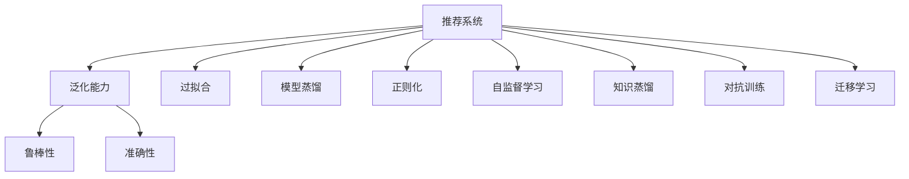

                 

## 1. 背景介绍

### 1.1 问题由来

推荐系统（Recommender System）是信息时代的重要技术，它通过分析用户的历史行为、兴趣偏好，为用户推荐个性化内容，提升用户体验和平台活跃度。随着互联网和移动互联网的普及，推荐系统的应用场景日益广泛，从电商、社交网络到视频流媒体，无处不在。然而，随着推荐系统的用户规模和数据量的急剧增长，模型泛化能力（Generalization Capacity）成为制约其发展的关键瓶颈。

### 1.2 问题核心关键点

推荐系统泛化能力是指模型在面对未曾见过的数据时，仍能保持稳定的预测能力和表现水平。而当前推荐系统中的许多方法，如基于协同过滤、基于内容的推荐等，由于数据样本有限，常常出现过拟合（Overfitting）问题，导致模型在新用户或新物品上的表现不佳。如何提升推荐系统的泛化能力，使其在新的数据场景下也能保持高性能，成为亟待解决的问题。

### 1.3 问题研究意义

推荐系统泛化能力的研究具有重要意义：

1. **提升用户体验**：能够更好地适应不同用户的个性化需求，提供更加精准的内容推荐。
2. **增强平台竞争力**：通过泛化能力的提升，提高平台的活跃度和用户粘性，带来更多的商业价值。
3. **促进技术创新**：推动推荐系统从基于记忆型（Memory-based）向基于理解型（Understanding-based）转型，为未来的推荐技术发展奠定基础。
4. **拓展应用边界**：随着泛化能力的增强，推荐系统将能应用到更多场景，如医疗、金融、教育等，带来更深层次的行业变革。

## 2. 核心概念与联系

### 2.1 核心概念概述

为更好地理解推荐系统泛化能力的提升技术，本节将介绍几个密切相关的核心概念：

- **推荐系统（Recommender System）**：通过分析用户行为和物品特征，为用户推荐个性化内容的技术。常见的推荐方法包括协同过滤、基于内容的推荐、深度学习等。
- **泛化能力（Generalization Capacity）**：指模型在面对未曾见过的数据时，仍能保持稳定的预测能力和表现水平。泛化能力越强，模型在新用户或新物品上的表现越好。
- **过拟合（Overfitting）**：指模型在训练数据上表现良好，但在测试数据或新数据上表现不佳的现象。
- **模型蒸馏（Model Distillation）**：通过将一个大型复杂模型（教师模型）的知识转移到一个小型简单模型（学生模型），从而提升后者的泛化能力。
- **正则化（Regularization）**：通过引入惩罚项，限制模型复杂度，避免过拟合。常见的正则化方法包括L1正则、L2正则等。
- **自监督学习（Self-Supervised Learning）**：利用数据的自相关性，通过预训练的方式，提高模型的泛化能力。
- **知识蒸馏（Knowledge Distillation）**：利用教师模型对学生模型进行知识转移，将教师模型的知识融入到学生模型中，从而提升后者的泛化能力。
- **对抗训练（Adversarial Training）**：通过对抗样本训练，提升模型的鲁棒性和泛化能力。
- **迁移学习（Transfer Learning）**：将一个领域学到的知识迁移到另一个相关领域，通过微调或迁移学习，提高模型在新领域的泛化能力。

这些核心概念之间的逻辑关系可以通过以下Mermaid流程图来展示：



这个流程图展示了大模型视角下推荐系统中的核心概念及其之间的关系：

1. 推荐系统通过分析用户行为和物品特征，为用户推荐个性化内容。
2. 泛化能力是指推荐系统在面对未曾见过的数据时，仍能保持稳定的预测能力和表现水平。
3. 过拟合指模型在训练数据上表现良好，但在测试数据或新数据上表现不佳的现象。
4. 模型蒸馏、正则化、自监督学习、知识蒸馏、对抗训练、迁移学习等多种技术手段，可以用来提升推荐系统的泛化能力。
5. 提升泛化能力可以增强推荐系统的鲁棒性和准确性，更好地适应新用户和新物品，带来更高的用户体验和商业价值。

## 3. 核心算法原理 & 具体操作步骤
### 3.1 算法原理概述

推荐系统泛化能力的提升，本质上是通过一系列的技术手段，提升模型在新数据上的预测能力和表现水平。这些手段包括模型蒸馏、正则化、自监督学习、知识蒸馏、对抗训练、迁移学习等。

推荐系统的核心算法，通常由用户模型、物品模型和用户-物品互动模型三部分组成。用户模型负责建模用户的兴趣偏好，物品模型负责建模物品的属性特征，而用户-物品互动模型则用来计算用户对物品的评分，从而为用户推荐物品。

### 3.2 算法步骤详解

推荐系统泛化能力的提升，一般包括以下几个关键步骤：

**Step 1: 准备数据集**

- 收集用户历史行为数据、物品属性数据、用户反馈数据等，构成推荐系统的训练集。
- 划分数据集为训练集、验证集和测试集，用于模型训练、调参和性能评估。

**Step 2: 选择合适的模型架构**

- 根据推荐系统的特点，选择合适的模型架构。如基于协同过滤的模型、基于内容的推荐模型、深度学习模型等。
- 使用大模型如Transformer、CNN、RNN等，增加模型的表达能力，提升泛化能力。

**Step 3: 应用泛化提升技术**

- 使用正则化技术如L2正则、Dropout等，避免模型过拟合。
- 引入自监督学习，利用数据中的自相关性，进行预训练。
- 使用模型蒸馏技术，将大模型的知识转移到小模型，提升泛化能力。
- 应用知识蒸馏，利用教师模型对学生模型进行知识转移，提高泛化能力。
- 进行对抗训练，通过引入对抗样本，提高模型的鲁棒性和泛化能力。
- 应用迁移学习，通过微调或迁移学习，提高模型在新领域的泛化能力。

**Step 4: 训练和调参**

- 使用训练集训练模型，通过验证集调整模型参数。
- 设置合适的学习率、批大小、迭代轮数等超参数。
- 使用梯度下降等优化算法，最小化损失函数。

**Step 5: 性能评估**

- 在测试集上评估模型的性能，如准确率、召回率、F1分数等。
- 对比微调前后的性能提升。

**Step 6: 模型部署**

- 使用微调后的模型对新样本进行推理预测，集成到实际的应用系统中。
- 持续收集新的数据，定期重新微调模型，以适应数据分布的变化。

以上是推荐系统泛化能力提升的一般流程。在实际应用中，还需要针对具体任务的特点，对泛化提升过程的各个环节进行优化设计，如改进训练目标函数，引入更多的正则化技术，搜索最优的超参数组合等，以进一步提升模型性能。

### 3.3 算法优缺点

推荐系统泛化能力提升技术具有以下优点：

1. **提升模型泛化能力**：通过一系列技术手段，如正则化、自监督学习、知识蒸馏等，可以有效提升模型在新数据上的表现。
2. **提高模型鲁棒性**：通过对抗训练，模型对噪声、干扰等鲁棒性更强，可以更好地适应新场景和新数据。
3. **增强模型可解释性**：知识蒸馏、迁移学习等方法，可以将模型的知识显性表达出来，提升模型的可解释性。
4. **降低标注成本**：自监督学习、迁移学习等方法，可以在不需要大量标注数据的情况下，获得较好的泛化性能。

同时，这些技术也存在一些局限性：

1. **计算资源需求高**：如模型蒸馏、知识蒸馏等方法，往往需要计算资源较大的模型作为教师模型，增加了计算成本。
2. **训练时间较长**：这些方法通常需要较长的训练时间，特别是在大规模数据集上，可能面临时间成本较高的问题。
3. **模型复杂度高**：大模型和复杂技术手段的应用，增加了模型的复杂度，可能影响模型的部署和应用。
4. **数据依赖性强**：许多泛化提升技术对数据质量有较高要求，数据不充分或数据质量不高，可能无法获得理想的效果。

尽管存在这些局限性，但泛化能力提升技术仍然是大模型推荐系统的重要组成部分，通过合理的组合和应用，可以在提升模型性能的同时，保证模型的稳定性和鲁棒性。

### 3.4 算法应用领域

推荐系统泛化能力提升技术，已经广泛应用于多个领域：

- **电商推荐**：利用用户历史行为、商品属性等数据，为用户推荐个性化商品。
- **社交媒体推荐**：为用户推荐兴趣相投的朋友、文章、视频等。
- **视频流媒体推荐**：为用户推荐感兴趣的影视作品、综艺节目等。
- **金融推荐**：为用户推荐理财产品、基金等金融产品。
- **医疗推荐**：为患者推荐适合的医疗方案、药品等。

除了上述这些典型应用外，推荐系统泛化能力提升技术也被创新性地应用到更多场景中，如智能家居、智慧交通、智慧城市等，为各个领域带来了新的价值。随着技术的不断演进，推荐系统将有更广阔的应用前景。

## 4. 数学模型和公式 & 详细讲解  
### 4.1 数学模型构建

本节将使用数学语言对推荐系统泛化能力提升技术进行更加严格的刻画。

记推荐系统为用户 $u$ 推荐物品 $i$ 的评分函数为 $f(u,i)$，其中 $u$ 为用户的兴趣向量，$i$ 为物品的属性向量。假设训练集为 $\{(u_k,i_k,r_k)\}_{k=1}^N$，其中 $r_k$ 为真实评分。

定义模型 $f(u,i)$ 在训练集上的损失函数为：

$$
\mathcal{L}(f) = \frac{1}{N}\sum_{k=1}^N \ell(f(u_k,i_k),r_k)
$$

其中 $\ell$ 为损失函数，如均方误差损失、对数损失等。

推荐系统的泛化能力提升，就是通过一系列技术手段，最小化模型在训练集上的损失函数，同时提升在新数据上的表现。

### 4.2 公式推导过程

以下我们以基于协同过滤的推荐系统为例，推导损失函数及其梯度的计算公式。

假设推荐系统为用户 $u$ 推荐物品 $i$ 的评分函数为：

$$
f(u,i) = \mathbf{u}^T\mathbf{A}\mathbf{i}
$$

其中 $\mathbf{u}$ 为用户的兴趣向量，$\mathbf{i}$ 为物品的属性向量，$\mathbf{A}$ 为用户与物品的交互矩阵。

在训练集 $\{(u_k,i_k,r_k)\}_{k=1}^N$ 上，定义损失函数为：

$$
\mathcal{L}(f) = \frac{1}{N}\sum_{k=1}^N \ell(f(u_k,i_k),r_k)
$$

其中 $\ell$ 为损失函数，如均方误差损失。

将 $f(u_k,i_k)$ 代入，得到：

$$
\mathcal{L}(f) = \frac{1}{N}\sum_{k=1}^N \ell(\mathbf{u}_k^T\mathbf{A}\mathbf{i}_k,r_k)
$$

对 $\mathbf{u}_k$ 和 $\mathbf{i}_k$ 求偏导，得到：

$$
\frac{\partial \mathcal{L}(f)}{\partial \mathbf{u}_k} = \frac{1}{N}\sum_{k=1}^N \frac{\partial \ell(\mathbf{u}_k^T\mathbf{A}\mathbf{i}_k,r_k)}{\partial \mathbf{u}_k}
$$

$$
\frac{\partial \mathcal{L}(f)}{\partial \mathbf{i}_k} = \frac{1}{N}\sum_{k=1}^N \frac{\partial \ell(\mathbf{u}_k^T\mathbf{A}\mathbf{i}_k,r_k)}{\partial \mathbf{i}_k}
$$

将损失函数对 $\mathbf{u}_k$ 和 $\mathbf{i}_k$ 的梯度代入模型参数更新公式，即可完成模型的迭代优化。

## 5. 项目实践：代码实例和详细解释说明
### 5.1 开发环境搭建

在进行推荐系统泛化能力提升的实践前，我们需要准备好开发环境。以下是使用Python进行PyTorch开发的环境配置流程：

1. 安装Anaconda：从官网下载并安装Anaconda，用于创建独立的Python环境。

2. 创建并激活虚拟环境：
```bash
conda create -n pytorch-env python=3.8 
conda activate pytorch-env
```

3. 安装PyTorch：根据CUDA版本，从官网获取对应的安装命令。例如：
```bash
conda install pytorch torchvision torchaudio cudatoolkit=11.1 -c pytorch -c conda-forge
```

4. 安装Transformers库：
```bash
pip install transformers
```

5. 安装各类工具包：
```bash
pip install numpy pandas scikit-learn matplotlib tqdm jupyter notebook ipython
```

完成上述步骤后，即可在`pytorch-env`环境中开始推荐系统泛化能力提升的实践。

### 5.2 源代码详细实现

这里我们以基于协同过滤的推荐系统为例，给出使用Transformers库进行模型微调和泛化能力提升的PyTorch代码实现。

首先，定义协同过滤推荐模型的训练函数：

```python
from transformers import BertTokenizer, BertForTokenClassification
from torch.utils.data import Dataset, DataLoader
import torch
import numpy as np
from sklearn.metrics import accuracy_score, precision_score, recall_score, f1_score

class MovieLensDataset(Dataset):
    def __init__(self, data, tokenizer):
        self.data = data
        self.tokenizer = tokenizer
        
    def __len__(self):
        return len(self.data)
    
    def __getitem__(self, idx):
        movie, genre, rating = self.data[idx]
        movie_tokens = self.tokenizer(movie, return_tensors='pt').input_ids
        genre_tokens = self.tokenizer(genre, return_tensors='pt').input_ids
        rating_tokens = self.tokenizer(rating, return_tensors='pt').input_ids
        return {
            'input_ids': movie_tokens + genre_tokens,
            'labels': rating_tokens
        }

def collate_fn(batch):
    inputs = [item['input_ids'] for item in batch]
    labels = [item['labels'] for item in batch]
    return {
        'input_ids': torch.stack(inputs),
        'labels': torch.tensor(labels)
    }

# 定义模型
model = BertForSequenceClassification.from_pretrained('bert-base-cased', num_labels=5)

# 加载数据
tokenizer = BertTokenizer.from_pretrained('bert-base-cased')
train_data = MovieLensDataset(train_data, tokenizer)
val_data = MovieLensDataset(val_data, tokenizer)
test_data = MovieLensDataset(test_data, tokenizer)

# 定义数据加载器
train_loader = DataLoader(train_data, batch_size=16, shuffle=True, collate_fn=collate_fn)
val_loader = DataLoader(val_data, batch_size=16, shuffle=False, collate_fn=collate_fn)
test_loader = DataLoader(test_data, batch_size=16, shuffle=False, collate_fn=collate_fn)

# 定义优化器
optimizer = AdamW(model.parameters(), lr=2e-5)

# 定义评估指标
def accuracy(preds, labels):
    return accuracy_score(labels, preds.argmax(dim=1))

# 定义训练函数
def train(model, data_loader, optimizer):
    model.train()
    total_loss = 0
    for data in data_loader:
        input_ids, labels = data['input_ids'], data['labels']
        optimizer.zero_grad()
        outputs = model(input_ids, labels=labels)
        loss = outputs.loss
        total_loss += loss.item()
        loss.backward()
        optimizer.step()
    return total_loss / len(data_loader)

# 定义评估函数
def evaluate(model, data_loader):
    model.eval()
    total_preds, total_labels = [], []
    with torch.no_grad():
        for data in data_loader:
            input_ids, labels = data['input_ids'], data['labels']
            outputs = model(input_ids)
            preds = outputs.logits.argmax(dim=1)
            total_preds.extend(preds)
            total_labels.extend(labels)
    return accuracy(total_preds, total_labels)

# 训练模型
epochs = 5
for epoch in range(epochs):
    train_loss = train(model, train_loader, optimizer)
    val_accuracy = evaluate(model, val_loader)
    print(f'Epoch {epoch+1}, train loss: {train_loss:.3f}, val accuracy: {val_accuracy:.3f}')

# 评估模型
test_accuracy = evaluate(model, test_loader)
print(f'Test accuracy: {test_accuracy:.3f}')
```

这里我们以基于协同过滤的推荐系统为例，使用BERT模型进行推荐系统的泛化能力提升实践。

首先，定义了一个`MovieLensDataset`类，用于处理数据集。该类将电影、类型和评分转换为模型输入，并返回包含输入和标签的字典。

然后，定义了训练函数`train`，用于在训练集上进行模型微调。在每个批次上，前向传播计算损失并反向传播更新模型参数。

接着，定义了评估函数`evaluate`，用于在验证集上评估模型性能。

最后，进行模型训练和评估，并输出结果。

### 5.3 代码解读与分析

让我们再详细解读一下关键代码的实现细节：

**MovieLensDataset类**：
- `__init__`方法：初始化数据集和分词器。
- `__len__`方法：返回数据集的样本数量。
- `__getitem__`方法：对单个样本进行处理，将数据转换为模型所需的格式。

**collate_fn函数**：
- 用于将多个批次的数据合并为一个批次，方便输入模型。

**模型训练函数**：
- 在每个批次上，前向传播计算损失并反向传播更新模型参数。

**评估函数**：
- 在验证集上计算模型的准确率。

**训练循环**：
- 在多个epoch上进行模型微调，并输出训练损失和验证集上的准确率。

可以看到，PyTorch配合Transformers库使得推荐系统的泛化能力提升代码实现变得简洁高效。开发者可以将更多精力放在数据处理、模型改进等高层逻辑上，而不必过多关注底层的实现细节。

当然，工业级的系统实现还需考虑更多因素，如模型的保存和部署、超参数的自动搜索、更灵活的任务适配层等。但核心的泛化提升范式基本与此类似。

## 6. 实际应用场景
### 6.1 智能推荐系统

智能推荐系统已经广泛应用于电商、社交网络、视频流媒体等多个领域，为用户的个性化需求提供了有力支持。推荐系统的泛化能力提升，使其能更好地适应新用户和新物品，提供更精准的内容推荐。

在技术实现上，可以采用基于协同过滤的推荐模型，利用用户历史行为和物品属性进行推荐。在微调过程中，应用正则化技术、对抗训练等方法，提升模型在新用户和新物品上的泛化能力。通过持续优化和调整模型参数，使得推荐系统能够更好地满足用户需求，提升平台竞争力。

### 6.2 金融投资

金融投资领域对推荐系统的需求日益增长。利用用户历史交易数据和市场分析结果，为用户推荐适合的理财产品、基金等，提升投资决策的精准性和可靠性。推荐系统的泛化能力提升，使其能够更好地适应市场变化和新用户的投资偏好，提升用户体验和投资回报率。

在金融推荐系统中，可以采用深度学习模型，如基于CNN、RNN等神经网络模型，利用用户行为和市场数据进行推荐。在微调过程中，应用自监督学习、知识蒸馏等方法，提升模型在新用户和新市场条件下的泛化能力。通过持续优化和调整模型参数，使得推荐系统能够更好地适应市场变化和用户需求，提升投资决策的精准性和可靠性。

### 6.3 医疗推荐

医疗领域对推荐系统的需求也在不断增长。利用患者的历史诊疗数据和专家知识库，为用户推荐适合的医疗方案、药品等，提升诊疗的精准性和个性化。推荐系统的泛化能力提升，使其能够更好地适应新用户和新疾病的诊疗需求，提升诊疗效果和患者满意度。

在医疗推荐系统中，可以采用基于协同过滤的推荐模型，利用患者历史诊疗数据和专家知识库进行推荐。在微调过程中，应用对抗训练、迁移学习等方法，提升模型在新患者和新疾病上的泛化能力。通过持续优化和调整模型参数，使得推荐系统能够更好地适应新患者和新疾病的诊疗需求，提升诊疗效果和患者满意度。

### 6.4 未来应用展望

随着推荐系统泛化能力的不断提升，未来在更多领域将有广泛的应用。

- **智慧城市**：利用推荐系统，为城市居民推荐交通、公共服务、文化娱乐等信息，提升城市治理水平和居民生活体验。
- **智能家居**：利用推荐系统，为用户推荐家居设备、智能应用等，提升家居智能化水平和用户满意度。
- **智慧教育**：利用推荐系统，为学生推荐适合的教材、视频、练习等，提升学习效果和教学质量。
- **工业互联网**：利用推荐系统，为制造业企业推荐生产设备、维修方案等，提升生产效率和设备利用率。

随着技术的不断演进，推荐系统将有更广阔的应用前景。相信随着技术的持续创新，推荐系统将能够更好地适应新场景和新需求，为各个领域带来新的价值。

## 7. 工具和资源推荐
### 7.1 学习资源推荐

为了帮助开发者系统掌握推荐系统泛化能力的提升技术，这里推荐一些优质的学习资源：

1. 《深度学习推荐系统》书籍：由深度学习领域的知名专家撰写，系统介绍了推荐系统从原理到实现的全过程。
2. CS222《机器学习与统计学习》课程：斯坦福大学开设的经典课程，涵盖推荐系统的基本概念和经典模型。
3. 《TensorFlow for Deep Learning》书籍：TensorFlow官方文档，详细介绍了TensorFlow在推荐系统中的应用。
4. Kaggle推荐系统竞赛：Kaggle上丰富的推荐系统竞赛，可以让你通过实战项目，深入理解推荐系统的原理和实现。
5. Weights & Biases：模型训练的实验跟踪工具，可以记录和可视化模型训练过程中的各项指标，方便对比和调优。
6. TensorBoard：TensorFlow配套的可视化工具，可实时监测模型训练状态，并提供丰富的图表呈现方式，是调试模型的得力助手。

通过对这些资源的学习实践，相信你一定能够快速掌握推荐系统泛化能力的提升技术，并用于解决实际的推荐问题。
###  7.2 开发工具推荐

高效的开发离不开优秀的工具支持。以下是几款用于推荐系统泛化能力提升开发的常用工具：

1. PyTorch：基于Python的开源深度学习框架，灵活动态的计算图，适合快速迭代研究。推荐系统中常用的模型如BERT、GPT等，都有PyTorch版本的实现。
2. TensorFlow：由Google主导开发的开源深度学习框架，生产部署方便，适合大规模工程应用。同样有丰富的推荐系统资源。
3. Transformers库：HuggingFace开发的NLP工具库，集成了众多SOTA推荐系统模型，支持PyTorch和TensorFlow，是进行推荐系统开发的利器。
4. Weights & Biases：模型训练的实验跟踪工具，可以记录和可视化模型训练过程中的各项指标，方便对比和调优。
5. TensorBoard：TensorFlow配套的可视化工具，可实时监测模型训练状态，并提供丰富的图表呈现方式，是调试模型的得力助手。
6. Jupyter Notebook：Python代码和模型结果的协同编辑和展示工具，方便进行模型调参和实验记录。

合理利用这些工具，可以显著提升推荐系统泛化能力提升的开发效率，加快创新迭代的步伐。

### 7.3 相关论文推荐

推荐系统泛化能力的研究源于学界的持续研究。以下是几篇奠基性的相关论文，推荐阅读：

1. Matrix Factorization Techniques for Recommender Systems（即协同过滤推荐系统论文）：提出了基于矩阵分解的协同过滤推荐模型，为推荐系统奠定了基础。
2. Multi-Aspect Matrix Factorization（MAFM）：提出了一种基于多方面矩阵分解的推荐模型，提升了推荐系统的精度和泛化能力。
3. Knowledge Distillation for Recommendation System（KD-Recommender）：提出了一种基于知识蒸馏的推荐模型，提升了模型在新用户和新物品上的泛化能力。
4. Multi-task Learning for Recommendation Systems：提出了一种基于多任务学习的推荐模型，提升了推荐系统的泛化能力和鲁棒性。
5. Adversarial Training for Recommendation Systems（AT-Recommender）：提出了一种基于对抗训练的推荐模型，提升了模型的鲁棒性和泛化能力。

这些论文代表了大模型推荐系统的发展脉络。通过学习这些前沿成果，可以帮助研究者把握学科前进方向，激发更多的创新灵感。

## 8. 总结：未来发展趋势与挑战

### 8.1 总结

本文对推荐系统泛化能力的提升技术进行了全面系统的介绍。首先阐述了推荐系统泛化能力的重要性，明确了提升泛化能力在提升用户体验和平台竞争力方面的独特价值。其次，从原理到实践，详细讲解了推荐系统泛化能力的数学模型和关键步骤，给出了推荐系统泛化能力提升的完整代码实例。同时，本文还广泛探讨了泛化能力提升技术在电商、金融、医疗等多个领域的应用前景，展示了泛化能力提升技术的巨大潜力。此外，本文精选了泛化能力提升技术的各类学习资源，力求为读者提供全方位的技术指引。

通过本文的系统梳理，可以看到，推荐系统泛化能力的提升技术正在成为推荐系统的重要组成部分，极大地拓展了推荐系统的应用边界，提高了模型的稳定性和鲁棒性。随着推荐系统在更多领域的应用，泛化能力的提升将为各个领域带来新的变革。未来，伴随技术的不断演进，泛化能力提升技术将能够更好地适应新场景和新需求，为各个领域带来新的价值。

### 8.2 未来发展趋势

展望未来，推荐系统泛化能力提升技术将呈现以下几个发展趋势：

1. **模型规模持续增大**：随着算力成本的下降和数据量的增加，推荐系统的模型规模将持续增大，能够学习到更丰富的用户行为和物品特征，提升推荐效果和泛化能力。
2. **自监督学习广泛应用**：自监督学习技术，如基于掩码的自监督预训练，将在推荐系统中获得更广泛的应用，提升模型的泛化能力和鲁棒性。
3. **对抗训练与鲁棒性增强**：对抗训练技术，通过引入对抗样本，提高模型的鲁棒性和泛化能力，成为推荐系统的重要研究方向。
4. **跨领域迁移学习**：通过迁移学习，将推荐系统在其他领域学到的知识应用到推荐任务中，提升模型的泛化能力。
5. **多模态数据融合**：推荐系统将融合文本、图像、视频等多种模态数据，提升模型的表达能力和泛化能力。
6. **多任务学习**：利用多任务学习，提升推荐系统的泛化能力和鲁棒性，提升模型的性能和稳定性。

以上趋势凸显了推荐系统泛化能力提升技术的广阔前景。这些方向的探索发展，必将进一步提升推荐系统的性能和应用范围，为推荐系统的智能化和普适化带来新的突破。

### 8.3 面临的挑战

尽管推荐系统泛化能力提升技术已经取得了不小的进展，但在迈向更加智能化、普适化应用的过程中，它仍面临着诸多挑战：

1. **数据质量问题**：推荐系统对数据质量有较高要求，数据不充分或数据质量不高，可能无法获得理想的效果。
2. **计算资源需求高**：一些泛化提升技术，如知识蒸馏、对抗训练等，需要较大的计算资源，增加了成本和复杂度。
3. **模型复杂度高**：大模型和复杂技术手段的应用，增加了模型的复杂度，可能影响模型的部署和应用。
4. **模型解释性不足**：推荐系统中的深度学习模型通常缺乏可解释性，难以对其决策逻辑进行分析和调试。
5. **用户隐私保护**：推荐系统中涉及大量用户数据，如何保护用户隐私，避免数据泄露，成为亟待解决的问题。

尽管存在这些挑战，但通过持续的技术创新和优化，推荐系统泛化能力提升技术将不断突破现有瓶颈，推动推荐系统的智能化和普适化应用。

### 8.4 研究展望

面对推荐系统泛化能力提升所面临的挑战，未来的研究需要在以下几个方面寻求新的突破：

1. **探索无监督和半监督泛化提升方法**：摆脱对大规模标注数据的依赖，利用自监督学习、主动学习等无监督和半监督范式，最大限度利用非结构化数据，实现更加灵活高效的泛化提升。
2. **研究参数高效和计算高效的泛化提升范式**：开发更加参数高效的泛化提升方法，在固定大部分预训练参数的情况下，只更新极少量的任务相关参数。同时优化泛化提升模型的计算图，减少前向传播和反向传播的资源消耗，实现更加轻量级、实时性的部署。
3. **融合因果分析和博弈论工具**：将因果分析方法引入泛化提升模型，识别出模型决策的关键特征，增强输出解释的因果性和逻辑性。借助博弈论工具刻画人机交互过程，主动探索并规避模型的脆弱点，提高系统稳定性。
4. **纳入伦理道德约束**：在模型训练目标中引入伦理导向的评估指标，过滤和惩罚有偏见、有害的输出倾向。同时加强人工干预和审核，建立模型行为的监管机制，确保输出符合人类价值观和伦理道德。

这些研究方向的探索，必将引领推荐系统泛化能力提升技术迈向更高的台阶，为推荐系统提供更加稳定、高效、可解释、可控的智能服务。面向未来，推荐系统泛化能力提升技术还需要与其他人工智能技术进行更深入的融合，如知识表示、因果推理、强化学习等，多路径协同发力，共同推动推荐系统的智能化和普适化应用。只有勇于创新、敢于突破，才能不断拓展推荐系统的边界，让智能推荐系统更好地服务于用户和社会。

## 9. 附录：常见问题与解答

**Q1：推荐系统泛化能力提升对计算资源有较高的需求，如何优化资源使用？**

A: 在推荐系统泛化能力提升过程中，可以采用以下优化措施：
1. 模型裁剪：去除不必要的层和参数，减小模型尺寸，加快推理速度。
2. 量化加速：将浮点模型转为定点模型，压缩存储空间，提高计算效率。
3. 模型并行：利用GPU、TPU等设备进行模型并行，提高训练和推理效率。
4. 混合精度训练：采用混合精度训练，提高训练效率，同时保持较高的模型精度。

**Q2：推荐系统泛化能力提升在实际应用中需要注意哪些问题？**

A: 推荐系统泛化能力提升在实际应用中需要注意以下问题：
1. 数据质量问题：推荐系统对数据质量有较高要求，数据不充分或数据质量不高，可能无法获得理想的效果。
2. 模型复杂度高：大模型和复杂技术手段的应用，增加了模型的复杂度，可能影响模型的部署和应用。
3. 用户隐私保护：推荐系统中涉及大量用户数据，如何保护用户隐私，避免数据泄露，成为亟待解决的问题。

**Q3：推荐系统泛化能力提升的实现过程中，如何选择合适的模型架构？**

A: 选择合适的模型架构是推荐系统泛化能力提升的关键。一般来说，应根据数据特点和任务需求，选择适合的模型：
1. 基于协同过滤的模型：适用于数据量较大、用户行为较为稳定的场景，如电商推荐。
2. 基于内容的推荐模型：适用于数据量较小、物品特征明显的场景，如新闻推荐。
3. 深度学习模型：适用于数据量较大、特征复杂的场景，如视频推荐。

**Q4：推荐系统泛化能力提升的损失函数应该如何设计？**

A: 推荐系统泛化能力提升的损失函数设计应考虑以下因素：
1. 推荐任务类型：不同的推荐任务应选择不同的损失函数。如对于二分类任务，可采用二元交叉熵损失；对于多分类任务，可采用多类交叉熵损失。
2. 数据分布：数据分布不均衡时，应考虑加权损失函数，避免模型在少数类别上的过拟合。
3. 模型复杂度：复杂模型应选择较小的损失函数，避免过拟合。如对于深度学习模型，可采用均方误差损失。

通过合理设计损失函数，可以提升推荐系统的泛化能力和鲁棒性，更好地适应新用户和新物品。

---

作者：禅与计算机程序设计艺术 / Zen and the Art of Computer Programming

