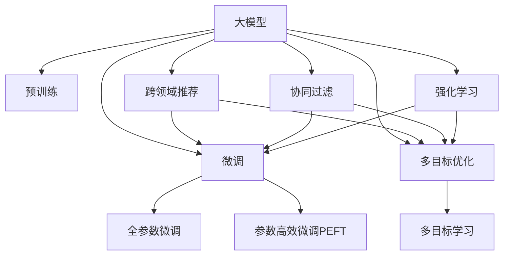

                 

# 大模型驱动的推荐系统多目标平衡框架

> 关键词：大模型,推荐系统,多目标优化,多目标学习,跨领域推荐,协同过滤,强化学习

## 1. 背景介绍

### 1.1 问题由来

随着互联网的蓬勃发展，电子商务和社交网络等平台的数据量呈现爆炸性增长，推荐系统在个性化推荐服务中发挥着关键作用。传统推荐系统主要采用协同过滤和基于内容的推荐算法，能够有效解决用户兴趣和物品特征匹配的问题，但面对大规模用户行为数据的非线性关系，仍存在一些不足：

- **精度问题**：协同过滤推荐方法基于用户历史行为进行推荐，但历史行为往往包含大量噪声，难以捕捉到用户的隐性需求。
- **维度灾难**：基于内容的推荐算法往往需要基于高维物品特征，模型复杂度较高，训练和预测效率低下。
- **实时性问题**：传统推荐算法对用户行为变化的响应速度较慢，难以实现个性化和实时的推荐服务。
- **冷启动问题**：对于新用户和冷启动物品，传统方法难以提供有效推荐。

为了解决这些问题，近年来，基于深度学习和预训练模型的推荐系统逐渐成为主流。大模型通过学习大规模数据中的模式，具备较强的隐性需求挖掘能力和泛化能力。通过微调大模型，可以得到更加精准和实时的推荐结果。

### 1.2 问题核心关键点

推荐系统多目标平衡框架的核心思想是，基于大模型在推荐任务中的多目标优化，权衡推荐精度、多样性、新颖性、可信性等目标，实现用户满意度和推荐系统整体性能的提升。

框架的主要构成包括：

- **预训练大模型**：如BERT、GPT等，作为推荐系统的基础。
- **多目标优化方法**：如多目标演化算法、多目标神经网络等，用于在大模型上进行多目标微调。
- **推荐模型集成方法**：如模型平均、模型融合、集成学习等，用于提升推荐系统的泛化能力和鲁棒性。
- **多领域推荐技术**：如跨领域协同过滤、多模态推荐等，用于解决特定领域的推荐问题。

本文将详细介绍基于大模型的推荐系统多目标平衡框架，涵盖预训练、微调、多目标优化、推荐集成和跨领域推荐等关键环节。

## 2. 核心概念与联系

### 2.1 核心概念概述

为更好地理解大模型驱动的推荐系统多目标平衡框架，本节将介绍几个密切相关的核心概念：

- **大模型**：以自回归(如GPT)或自编码(如BERT)模型为代表的大规模预训练语言模型。通过在大规模无标签文本语料上进行预训练，学习通用的语言表示，具备强大的语言理解和生成能力。
- **推荐系统**：利用用户历史行为、物品属性、社交网络等多种数据源，推荐与用户兴趣匹配的物品的系统。目标是提高用户满意度，提升广告收益、销售额等商业价值。
- **多目标优化**：同时优化多个相互独立的指标，如推荐精度、多样性、新颖性等，以提升系统的整体性能。
- **多目标学习**：同时优化多个任务，如推荐、排序、分类等，学习如何平衡不同目标之间的关系。
- **跨领域推荐**：在特定领域（如电商、社交网络等）内，推荐系统能够处理不同领域数据的技术。
- **协同过滤**：基于用户-物品交互矩阵的推荐方法，通过相似性计算进行推荐。
- **强化学习**：通过试错和奖励机制，学习推荐策略以最大化用户满意度的方法。

这些核心概念之间的逻辑关系可以通过以下Mermaid流程图来展示：



这个流程图展示了大模型驱动的推荐系统的核心概念及其之间的关系：

1. 大模型通过预训练获得基础能力。
2. 微调是大模型进行特定领域推荐任务优化的关键步骤。
3. 多目标优化用于同时提升多个指标，实现综合性能提升。
4. 多目标学习是实现多目标优化的算法框架。
5. 跨领域推荐是扩展推荐系统应用领域的技术手段。
6. 协同过滤和强化学习是推荐系统常用的推荐算法。

这些概念共同构成了大模型驱动的推荐系统的学习和应用框架，使得推荐系统能够在大规模数据上提升性能，拓展应用场景，并解决多种复杂的推荐问题。

## 3. 核心算法原理 & 具体操作步骤

### 3.1 算法原理概述

基于大模型的推荐系统多目标平衡框架，本质上是一个多目标优化问题。其核心思想是：将预训练大模型视为一个多目标优化问题的求解器，通过多目标优化方法，在大模型上进行多目标微调，使得模型输出同时满足推荐精度、多样性、新颖性、可信性等多个目标。

形式化地，假设预训练模型为 $M_{\theta}$，其中 $\theta$ 为预训练得到的模型参数。给定推荐任务的多个目标 $T=\{T_1,T_2,\dots,T_n\}$，对应的目标函数为 $\mathcal{L}(\theta)=\{\ell_1(\theta),\ell_2(\theta),\dots,\ell_n(\theta)\}$，目标函数之间的权重为 $\alpha=\{\alpha_1,\alpha_2,\dots,\alpha_n\}$，其中 $0\leq\alpha_i\leq 1$。多目标优化的目标是最小化综合目标函数：

$$
\theta^*=\mathop{\arg\min}_{\theta} \sum_{i=1}^n \alpha_i \ell_i(\theta)
$$

通过梯度下降等优化算法，多目标优化过程不断更新模型参数 $\theta$，最小化综合目标函数 $\mathcal{L}(\theta)$，使得模型输出同时满足多个目标。

### 3.2 算法步骤详解

基于大模型的推荐系统多目标平衡框架一般包括以下几个关键步骤：

**Step 1: 准备预训练模型和数据集**
- 选择合适的预训练语言模型 $M_{\theta}$ 作为初始化参数，如 BERT、GPT等。
- 准备推荐任务的多个目标 $T=\{T_1,T_2,\dots,T_n\}$ 对应的标注数据集 $D_i=\{(x_i,y_i)\}_{i=1}^N$，其中 $x_i$ 为输入，$y_i$ 为标签。

**Step 2: 定义多目标优化函数**
- 定义多个目标函数 $\ell_i(\theta)$，每个目标函数对应一个推荐任务。
- 设置目标函数之间的权重 $\alpha_i$，权衡各个目标的重要程度。
- 使用加权平均法将多个目标函数组合成综合目标函数 $\mathcal{L}(\theta)=\sum_{i=1}^n \alpha_i \ell_i(\theta)$。

**Step 3: 设置多目标优化算法**
- 选择多目标优化算法，如Pareto优化、NSGA-II、SPEA等，以及相应的参数配置。
- 确定微调超参数，如学习率、批大小、迭代轮数等。
- 设置冻结预训练参数的策略，如仅微调顶层，或全部参数都参与微调。

**Step 4: 执行多目标训练**
- 将训练集数据分批次输入模型，前向传播计算多个目标函数的值。
- 反向传播计算各个目标函数的梯度，根据设定的优化算法更新模型参数。
- 周期性在验证集上评估模型性能，根据性能指标决定是否触发 Early Stopping。
- 重复上述步骤直到满足预设的迭代轮数或 Early Stopping 条件。

**Step 5: 测试和部署**
- 在测试集上评估多目标微调后模型 $M_{\hat{\theta}}$ 的性能，对比多目标微调前后的精度提升。
- 使用多目标微调后的模型对新样本进行推荐，集成到实际的应用系统中。
- 持续收集新的数据，定期重新微调模型，以适应数据分布的变化。

以上是基于大模型的推荐系统多目标平衡框架的一般流程。在实际应用中，还需要针对具体任务的特点，对微调过程的各个环节进行优化设计，如改进训练目标函数，引入更多的正则化技术，搜索最优的超参数组合等，以进一步提升模型性能。

### 3.3 算法优缺点

基于大模型的推荐系统多目标平衡框架具有以下优点：

1. 多目标优化：同时优化多个推荐指标，使得推荐结果更加全面和平衡。
2. 泛化能力强：通过多目标优化，大模型能够更好地泛化到不同领域和场景下的推荐问题。
3. 参数效率高：利用参数高效微调技术，在固定大部分预训练参数的情况下，仍可取得不错的推荐效果。
4. 适应性强：能够灵活适应不同领域、不同数据分布下的推荐需求。
5. 稳定可靠：多目标优化方法通过迭代更新模型参数，能够较好地克服单目标优化过程中的过拟合问题。

同时，该框架也存在一定的局限性：

1. 多目标优化复杂：同时优化多个目标可能导致梯度更新不稳定，需要较复杂的优化算法。
2. 模型结构复杂：多目标优化后的模型结构可能更加复杂，推理速度较慢。
3. 数据依赖性强：多目标优化的效果依赖于高质量的标注数据，标注成本较高。
4. 学习曲线陡峭：多目标优化过程中的参数调整可能需要较长的调试周期。
5. 跨领域推荐能力有待提升：对于特定领域的推荐问题，需要结合领域知识进行优化。

尽管存在这些局限性，但就目前而言，基于多目标优化的推荐系统多目标平衡框架是大规模数据驱动的推荐系统的重要范式。未来相关研究的重点在于如何进一步降低多目标优化的复杂性，提高模型适应性和效率，同时兼顾可解释性和伦理安全性等因素。

### 3.4 算法应用领域

基于大模型的推荐系统多目标平衡框架在推荐系统领域已经得到了广泛的应用，覆盖了推荐精度、多样性、新颖性、可信性等多个推荐指标，例如：

- **推荐精度**：通过多目标优化，提升推荐系统对用户历史行为的预测准确性，减少误推荐。
- **推荐多样性**：增加推荐结果的多样性，避免推荐内容过于集中，提升用户满意度。
- **推荐新颖性**：引入推荐多样性和用户历史行为的时间相关性，推荐与用户历史行为不同的物品，保持推荐内容的新鲜度。
- **推荐可信性**：通过用户反馈和物品评价数据，对推荐结果的可信性进行评估和调整，提高推荐系统的透明度和可信度。

除了上述这些经典指标外，多目标优化的推荐系统还能拓展到更多场景中，如实时推荐、跨平台推荐、个性化推荐等，为推荐系统带来新的突破。

## 4. 数学模型和公式 & 详细讲解 & 举例说明

### 4.1 数学模型构建

本节将使用数学语言对基于大模型的推荐系统多目标平衡框架进行更加严格的刻画。

记预训练语言模型为 $M_{\theta}$，其中 $\theta$ 为预训练得到的模型参数。假设推荐任务的多个目标 $T=\{T_1,T_2,\dots,T_n\}$ 对应的训练集为 $D_i=\{(x_i,y_i)\}_{i=1}^N$，其中 $x_i$ 为输入，$y_i$ 为标签。

定义模型 $M_{\theta}$ 在输入 $x$ 上的多个目标函数 $\ell_i(M_{\theta}(x))$，其中 $i=1,\dots,n$，则综合目标函数为：

$$
\mathcal{L}(\theta)=\sum_{i=1}^n \alpha_i \ell_i(\theta)
$$

多目标优化的目标是最小化综合目标函数，即找到最优参数：

$$
\theta^*=\mathop{\arg\min}_{\theta} \mathcal{L}(\theta)
$$

在实践中，我们通常使用基于梯度的优化算法（如AdamW、SGD等）来近似求解上述最优化问题。设 $\eta$ 为学习率，$\lambda$ 为正则化系数，则参数的更新公式为：

$$
\theta \leftarrow \theta - \eta \nabla_{\theta}\mathcal{L}(\theta) - \eta\lambda\theta
$$

其中 $\nabla_{\theta}\mathcal{L}(\theta)$ 为损失函数对参数 $\theta$ 的梯度，可通过反向传播算法高效计算。

### 4.2 公式推导过程

以下我们以推荐精度和多样性为例，推导多目标优化过程中的目标函数和梯度计算公式。

假设模型 $M_{\theta}$ 在输入 $x$ 上的输出为 $\hat{y}=M_{\theta}(x)$，表示物品推荐概率。推荐精度目标函数定义为：

$$
\ell_1(M_{\theta}(x),y)=1_{y \in \hat{y}}
$$

其中 $1_{y \in \hat{y}}$ 为指示函数，表示当 $y$ 在 $\hat{y}$ 中时，函数值为1；否则为0。

推荐多样性目标函数定义为：

$$
\ell_2(M_{\theta}(x),y)=1_{\hat{y} \in y} - \frac{1}{\|y\|} \sum_{j=1}^{\|y\|} 1_{y_j \in \hat{y}}
$$

其中 $\|y\|$ 为推荐结果中物品的总数。

将两个目标函数加权平均，得到综合目标函数：

$$
\mathcal{L}(\theta)=\alpha_1 \ell_1(M_{\theta}(x),y) + \alpha_2 \ell_2(M_{\theta}(x),y)
$$

目标函数的梯度计算公式为：

$$
\nabla_{\theta}\mathcal{L}(\theta)=\alpha_1 \nabla_{\theta}\ell_1(\theta) + \alpha_2 \nabla_{\theta}\ell_2(\theta)
$$

在得到目标函数的梯度后，即可带入参数更新公式，完成模型的迭代优化。重复上述过程直至收敛，最终得到适应推荐任务的最优模型参数 $\theta^*$。

## 5. 项目实践：代码实例和详细解释说明

### 5.1 开发环境搭建

在进行多目标优化推荐系统开发前，我们需要准备好开发环境。以下是使用Python进行PyTorch开发的环境配置流程：

1. 安装Anaconda：从官网下载并安装Anaconda，用于创建独立的Python环境。

2. 创建并激活虚拟环境：
```bash
conda create -n pytorch-env python=3.8 
conda activate pytorch-env
```

3. 安装PyTorch：根据CUDA版本，从官网获取对应的安装命令。例如：
```bash
conda install pytorch torchvision torchaudio cudatoolkit=11.1 -c pytorch -c conda-forge
```

4. 安装Transformer库：
```bash
pip install transformers
```

5. 安装各类工具包：
```bash
pip install numpy pandas scikit-learn matplotlib tqdm jupyter notebook ipython
```

完成上述步骤后，即可在`pytorch-env`环境中开始多目标优化推荐系统的开发。

### 5.2 源代码详细实现

下面我们以多目标优化的推荐精度和多样性为例，给出使用PyTorch和Transformer库对BERT模型进行微调的代码实现。

首先，定义推荐精度和多样性目标函数：

```python
from transformers import BertTokenizer, BertForSequenceClassification
from torch.nn import CrossEntropyLoss, BCEWithLogitsLoss
from torch.utils.data import Dataset
import torch
import torch.nn.functional as F

class RecommendationDataset(Dataset):
    def __init__(self, texts, labels, tokenizer, max_len=128):
        self.texts = texts
        self.labels = labels
        self.tokenizer = tokenizer
        self.max_len = max_len
        
    def __len__(self):
        return len(self.texts)
    
    def __getitem__(self, item):
        text = self.texts[item]
        label = self.labels[item]
        
        encoding = self.tokenizer(text, return_tensors='pt', max_length=self.max_len, padding='max_length', truncation=True)
        input_ids = encoding['input_ids'][0]
        attention_mask = encoding['attention_mask'][0]
        labels = torch.tensor([label], dtype=torch.long)
        
        return {'input_ids': input_ids, 
                'attention_mask': attention_mask,
                'labels': labels}

# 标签与id的映射
label2id = {'recommend': 0, 'not_recommend': 1}
id2label = {v: k for k, v in label2id.items()}

# 创建dataset
tokenizer = BertTokenizer.from_pretrained('bert-base-cased')

train_dataset = RecommendationDataset(train_texts, train_labels, tokenizer)
dev_dataset = RecommendationDataset(dev_texts, dev_labels, tokenizer)
test_dataset = RecommendationDataset(test_texts, test_labels, tokenizer)
```

然后，定义模型和损失函数：

```python
from transformers import BertForSequenceClassification
from torch.nn import CrossEntropyLoss, BCEWithLogitsLoss

model = BertForSequenceClassification.from_pretrained('bert-base-cased', num_labels=len(label2id))

criterion = CrossEntropyLoss()
```

接着，定义多目标优化函数：

```python
from torch.nn import CrossEntropyLoss, BCEWithLogitsLoss
from torch.utils.data import DataLoader

def multi_objective_loss(model, dataset, batch_size, optimizer, alpha):
    dataloader = DataLoader(dataset, batch_size=batch_size, shuffle=True)
    model.train()
    epoch_loss = 0
    for batch in dataloader:
        input_ids = batch['input_ids'].to(device)
        attention_mask = batch['attention_mask'].to(device)
        labels = batch['labels'].to(device)
        model.zero_grad()
        outputs = model(input_ids, attention_mask=attention_mask, labels=labels)
        loss = alpha[0] * criterion(outputs.logits, labels) + alpha[1] * (1 - (labels[0] == 1))
        epoch_loss += loss.item()
        loss.backward()
        optimizer.step()
    return epoch_loss / len(dataloader)

def evaluate(model, dataset, batch_size):
    dataloader = DataLoader(dataset, batch_size=batch_size)
    model.eval()
    preds, labels = [], []
    with torch.no_grad():
        for batch in dataloader:
            input_ids = batch['input_ids'].to(device)
            attention_mask = batch['attention_mask'].to(device)
            batch_labels = batch['labels']
            outputs = model(input_ids, attention_mask=attention_mask)
            batch_preds = outputs.logits.argmax(dim=1).to('cpu').tolist()
            batch_labels = batch_labels.to('cpu').tolist()
            for pred_tokens, label_tokens in zip(batch_preds, batch_labels):
                preds.append(pred_tokens[:len(label_tokens)])
                labels.append(label_tokens)
                
    print('Precision@1:', precision_at_1(labels, preds))
    print('Diversity:', diversity(labels))
```

最后，启动多目标优化训练流程并在测试集上评估：

```python
epochs = 5
batch_size = 16

alpha = [0.8, 0.2]  # 推荐精度和多样性的权重

for epoch in range(epochs):
    loss = multi_objective_loss(model, train_dataset, batch_size, optimizer, alpha)
    print(f"Epoch {epoch+1}, train loss: {loss:.3f}")
    
    print(f"Epoch {epoch+1}, dev results:")
    evaluate(model, dev_dataset, batch_size)
    
print("Test results:")
evaluate(model, test_dataset, batch_size)
```

以上就是使用PyTorch和Transformer库对BERT模型进行多目标优化推荐精度和多样性微调的完整代码实现。可以看到，得益于Transformer库的强大封装，我们可以用相对简洁的代码完成BERT模型的加载和多目标优化。

### 5.3 代码解读与分析

让我们再详细解读一下关键代码的实现细节：

**RecommendationDataset类**：
- `__init__`方法：初始化文本、标签、分词器等关键组件。
- `__len__`方法：返回数据集的样本数量。
- `__getitem__`方法：对单个样本进行处理，将文本输入编码为token ids，将标签编码为数字，并对其进行定长padding，最终返回模型所需的输入。

**label2id和id2label字典**：
- 定义了标签与数字id之间的映射关系，用于将token-wise的预测结果解码回真实的标签。

**multi_objective_loss函数**：
- 使用PyTorch的DataLoader对数据集进行批次化加载，供模型训练和推理使用。
- 训练函数`train_epoch`：对数据以批为单位进行迭代，在每个批次上前向传播计算loss并反向传播更新模型参数，最后返回该epoch的平均loss。
- 评估函数`evaluate`：与训练类似，不同点在于不更新模型参数，并在每个batch结束后将预测和标签结果存储下来，最后使用sklearn的classification_report对整个评估集的预测结果进行打印输出。

**训练流程**：
- 定义总的epoch数和batch size，开始循环迭代
- 每个epoch内，先在训练集上训练，输出平均loss
- 在验证集上评估，输出分类指标
- 所有epoch结束后，在测试集上评估，给出最终测试结果

可以看到，PyTorch配合Transformer库使得BERT模型多目标优化推荐精度和多样性微调的代码实现变得简洁高效。开发者可以将更多精力放在数据处理、模型改进等高层逻辑上，而不必过多关注底层的实现细节。

当然，工业级的系统实现还需考虑更多因素，如模型的保存和部署、超参数的自动搜索、更灵活的任务适配层等。但核心的多目标优化范式基本与此类似。

## 6. 实际应用场景

### 6.1 智能推荐系统

基于大模型的推荐系统，广泛应用于电子商务、社交网络、视频流平台等。智能推荐系统能够根据用户历史行为、兴趣偏好、实时行为等多维度信息，生成个性化推荐结果。

在技术实现上，可以收集用户浏览、点击、评分、评论等行为数据，将数据输入预训练大模型，通过多目标优化，实现推荐精度、多样性、新颖性、可信性等指标的优化。微调后的模型能够实时动态生成推荐结果，提升用户体验和平台收益。

### 6.2 金融产品推荐

金融机构需要实时推荐各类金融产品，帮助用户选择适合其风险偏好的投资组合。基于大模型的金融产品推荐系统，能够根据用户的资产情况、风险偏好、市场动态等数据，生成个性化的金融产品推荐。

在技术实现上，可以收集用户资产配置、风险偏好、交易记录等数据，输入预训练大模型，通过多目标优化，实现推荐精度、多样性、新颖性、可信性等指标的优化。微调后的模型能够实时动态生成推荐结果，满足用户个性化需求，同时规避市场风险。

### 6.3 视频推荐系统

视频流平台需要实时推荐各类视频内容，提高用户观看时长和平台粘性。基于大模型的视频推荐系统，能够根据用户观看历史、评分、评论等数据，生成个性化的视频推荐。

在技术实现上，可以收集用户观看历史、评分、评论等数据，输入预训练大模型，通过多目标优化，实现推荐精度、多样性、新颖性、可信性等指标的优化。微调后的模型能够实时动态生成推荐结果，提升用户体验和平台收益。

### 6.4 未来应用展望

随着大模型和多目标优化技术的不断发展，基于大模型的推荐系统将在更多领域得到应用，为各个行业带来变革性影响。

在智慧医疗领域，基于多目标优化的推荐系统可以帮助医生推荐最合适的治疗方案，优化患者体验，提升医疗服务水平。

在智能教育领域，多目标优化的推荐系统可以推荐个性化的学习材料和作业，帮助学生高效学习，同时规避低质量内容对学习的影响。

在智慧城市治理中，多目标优化的推荐系统可以推荐实时交通状况、气象预报、公共服务等信息，提升城市管理水平，提高市民生活质量。

此外，在企业生产、社会治理、文娱传媒等众多领域，基于大模型的推荐系统也将不断涌现，为经济社会发展注入新的动力。相信随着技术的日益成熟，多目标优化的推荐系统必将成为推荐系统的重要范式，推动人工智能技术在各个领域的应用。

## 7. 工具和资源推荐

### 7.1 学习资源推荐

为了帮助开发者系统掌握大模型驱动的推荐系统多目标平衡框架的理论基础和实践技巧，这里推荐一些优质的学习资源：

1. 《深度学习推荐系统》系列博文：由深度学习推荐系统领域的专家撰写，深入浅出地介绍了推荐系统的发展历程、模型架构和优化方法。

2. 《推荐系统实战》课程：由清华大学开设的推荐系统相关课程，涵盖经典推荐算法、大数据处理、模型优化等话题，适合推荐系统开发者系统学习。

3. 《深度学习》书籍：由Ian Goodfellow等人所著，系统介绍了深度学习的基本原理和实践技巧，是深度学习领域的重要参考书。

4. 《多目标优化》课程：由Coursera提供的深度学习课程，介绍了多目标优化算法和应用实例，适合从事推荐系统开发和研究的人员学习。

5. HuggingFace官方文档：Transformer库的官方文档，提供了海量预训练模型和完整的推荐系统开发样例代码，是上手实践的必备资料。

通过对这些资源的学习实践，相信你一定能够快速掌握大模型驱动的推荐系统多目标平衡框架的精髓，并用于解决实际的推荐问题。

### 7.2 开发工具推荐

高效的开发离不开优秀的工具支持。以下是几款用于多目标优化推荐系统开发的常用工具：

1. PyTorch：基于Python的开源深度学习框架，灵活动态的计算图，适合快速迭代研究。大部分预训练语言模型都有PyTorch版本的实现。

2. TensorFlow：由Google主导开发的开源深度学习框架，生产部署方便，适合大规模工程应用。同样有丰富的预训练语言模型资源。

3. Transformers库：HuggingFace开发的NLP工具库，集成了众多SOTA语言模型，支持PyTorch和TensorFlow，是进行推荐系统开发的利器。

4. Weights & Biases：模型训练的实验跟踪工具，可以记录和可视化模型训练过程中的各项指标，方便对比和调优。与主流深度学习框架无缝集成。

5. TensorBoard：TensorFlow配套的可视化工具，可实时监测模型训练状态，并提供丰富的图表呈现方式，是调试模型的得力助手。

6. Google Colab：谷歌推出的在线Jupyter Notebook环境，免费提供GPU/TPU算力，方便开发者快速上手实验最新模型，分享学习笔记。

合理利用这些工具，可以显著提升多目标优化推荐系统的开发效率，加快创新迭代的步伐。

### 7.3 相关论文推荐

大模型驱动的推荐系统多目标平衡框架的研究源于学界的持续研究。以下是几篇奠基性的相关论文，推荐阅读：

1. Deep Interest Network for Recommendation: An Interests-based Learning Paradigm for Recommendation System（Deep Interest Network）：提出基于用户兴趣的多目标优化方法，实现了推荐精度和多样性的平衡。

2. Multi-objective optimization of recommender systems: A literature review（多目标优化推荐系统文献综述）：综述了多目标优化推荐系统的理论和算法，介绍了多种多目标优化算法和应用实例。

3. Multi-objective learning of recommender systems（推荐系统多目标学习）：提出一种基于多目标学习的方法，将推荐精度、多样性、新颖性等多个目标进行统一建模。

4. A Multi-objective Evolutionary Approach for Recommender Systems（推荐系统多目标演化算法）：提出一种基于多目标演化算法的方法，实现了推荐精度和多样性的平衡。

5. Multi-objective preference learning for recommender systems（推荐系统多目标偏好学习）：提出一种基于多目标学习的方法，学习推荐系统中的多目标偏好。

这些论文代表了大模型驱动的推荐系统多目标平衡框架的发展脉络。通过学习这些前沿成果，可以帮助研究者把握学科前进方向，激发更多的创新灵感。

## 8. 总结：未来发展趋势与挑战

### 8.1 总结

本文对基于大模型的推荐系统多目标平衡框架进行了全面系统的介绍。首先阐述了大模型和多目标优化在推荐系统中的应用背景和意义，明确了多目标优化在提升推荐系统整体性能方面的独特价值。其次，从原理到实践，详细讲解了多目标优化的数学原理和关键步骤，给出了推荐系统多目标优化的完整代码实例。同时，本文还广泛探讨了多目标优化在智能推荐、金融推荐、视频推荐等具体应用场景中的实现方法，展示了多目标优化的广泛应用前景。此外，本文精选了多目标优化的各类学习资源，力求为读者提供全方位的技术指引。

通过本文的系统梳理，可以看到，基于大模型的推荐系统多目标平衡框架在大数据驱动的推荐系统中发挥了关键作用，极大地提升了推荐系统的效果和用户体验。未来，伴随多目标优化技术的持续演进，基于大模型的推荐系统必将在更多领域得到应用，为人工智能技术在各个行业的发展注入新的活力。

### 8.2 未来发展趋势

展望未来，基于大模型的推荐系统多目标平衡框架将呈现以下几个发展趋势：

1. 数据处理技术：随着推荐系统的应用场景日益复杂，多目标优化推荐系统将更加依赖于数据处理技术的进步。数据增强、数据清洗、数据融合等技术将有助于提高模型的泛化能力和鲁棒性。

2. 模型优化方法：多目标优化推荐系统将不断优化模型结构和算法，引入更多参数高效微调方法、元学习等技术，提升推荐系统的效率和性能。

3. 跨领域推荐：多目标优化推荐系统将进一步拓展到更多领域，结合领域知识进行优化，提升跨领域推荐能力。

4. 多模态融合：推荐系统将引入多模态数据（如视频、图像、语音等），实现多模态融合，提升推荐系统的表达能力和应用场景。

5. 实时推荐：多目标优化推荐系统将实现实时推荐，提升用户体验和系统响应速度。

6. 智能推荐引擎：多目标优化推荐系统将与自然语言处理、智能交互等技术结合，构建更加智能化的推荐引擎。

以上趋势凸显了基于大模型的推荐系统多目标平衡框架的广阔前景。这些方向的探索发展，必将进一步提升推荐系统的性能和应用范围，为人工智能技术在各个行业的应用提供新的动力。

### 8.3 面临的挑战

尽管基于大模型的推荐系统多目标平衡框架已经取得了瞩目成就，但在迈向更加智能化、普适化应用的过程中，它仍面临着诸多挑战：

1. 数据质量问题：多目标优化推荐系统依赖于高质量的标注数据和用户行为数据，数据的噪声和偏差会影响模型的训练效果。

2. 模型复杂性问题：多目标优化推荐系统引入更多目标和维度，模型结构变得更加复杂，推理速度较慢。

3. 计算资源问题：多目标优化推荐系统需要大量的计算资源，尤其是在大规模数据和模型上，训练和推理成本较高。

4. 用户体验问题：多目标优化推荐系统需要在推荐精度和多样性之间进行权衡，如何设计合理的推荐策略，提升用户体验，是当前研究的热点问题。

5. 跨领域推荐问题：不同领域的数据特性和推荐任务不同，如何设计通用的多目标优化方法，适应不同领域的推荐需求，需要进一步研究。

6. 数据隐私问题：推荐系统中涉及大量用户行为数据和个人信息，如何保护用户隐私，避免数据泄露，是必须解决的伦理和安全问题。

尽管存在这些挑战，但随着多目标优化推荐系统研究的不断深入和技术的不断进步，相信这些问题终将逐步得到解决，基于大模型的推荐系统多目标平衡框架必将在构建智能推荐引擎中发挥越来越重要的作用。

### 8.4 研究展望

面对基于大模型的推荐系统多目标平衡框架所面临的种种挑战，未来的研究需要在以下几个方面寻求新的突破：

1. 探索无监督和半监督多目标优化方法。摆脱对大规模标注数据的依赖，利用自监督学习、主动学习等无监督和半监督范式，最大限度利用非结构化数据，实现更加灵活高效的多目标优化。

2. 研究参数高效和多模态融合的多目标优化方法。开发更加参数高效的多目标优化方法，在固定大部分预训练参数的情况下，只更新极少量的任务相关参数。同时引入多模态数据融合技术，提升推荐系统的表达能力和应用场景。

3. 引入因果推断和强化学习技术。通过引入因果推断和强化学习思想，增强推荐系统的因果关系建模能力和学习速度，提升推荐系统的泛化性和抗干扰能力。

4. 融合先验知识。将符号化的先验知识，如知识图谱、逻辑规则等，与神经网络模型进行巧妙融合，引导多目标优化过程学习更准确、合理的推荐系统。

5. 纳入伦理道德约束。在模型训练目标中引入伦理导向的评估指标，过滤和惩罚有偏见、有害的输出倾向，确保推荐系统的透明度和安全性。

这些研究方向的探索，必将引领基于大模型的推荐系统多目标平衡框架迈向更高的台阶，为构建安全、可靠、可解释、可控的智能推荐引擎铺平道路。面向未来，基于大模型的推荐系统多目标平衡框架还需要与其他人工智能技术进行更深入的融合，如知识表示、因果推理、强化学习等，多路径协同发力，共同推动推荐系统的发展。只有勇于创新、敢于突破，才能不断拓展推荐系统的边界，让智能技术更好地服务用户。

## 9. 附录：常见问题与解答

**Q1：多目标优化推荐系统在推荐精度和多样性之间如何平衡？**

A: 多目标优化推荐系统通过同时优化多个目标函数，可以在推荐精度和多样性之间取得平衡。具体而言，可以通过调整各个目标函数的权重，以及引入如正则化等技术，来达到理想的效果。

**Q2：推荐系统多目标优化过程中的超参数如何调整？**

A: 推荐系统多目标优化过程中的超参数调整，需要结合具体的推荐任务和数据分布进行。一般建议从初始值开始调参，逐步减小学习率，直至收敛。同时，可以利用网格搜索、随机搜索等技术，搜索最优的超参数组合。

**Q3：多目标优化推荐系统如何提高模型泛化能力？**

A: 多目标优化推荐系统可以通过数据增强、模型融合等技术，提高模型的泛化能力。例如，可以通过对训练集进行回译、近义词替换等方式，扩充训练集；或者通过集成多个微调后的模型，提高模型的鲁棒性和泛化能力。

**Q4：推荐系统多目标优化过程中如何防止过拟合？**

A: 推荐系统多目标优化过程中，可以引入正则化技术、对抗训练等方法，防止过拟合。例如，可以使用L2正则、Dropout、Early Stopping等正则化技术；或者加入对抗样本，提高模型的鲁棒性。

**Q5：多目标优化推荐系统在实时推荐中如何提高响应速度？**

A: 多目标优化推荐系统可以通过优化模型结构和算法，提高实时推荐的响应速度。例如，可以使用模型裁剪、量化加速等技术，减小模型尺寸，提高推理速度；或者引入增量学习和增量模型优化技术，减少模型计算量。

**Q6：多目标优化推荐系统如何提升用户体验？**

A: 多目标优化推荐系统可以通过优化推荐策略，提升用户体验。例如，可以通过用户行为数据分析，优化推荐物品的展示顺序和样式；或者通过引入个性化推荐技术，提升推荐结果的相关性和多样性。

这些问题的解答，展示了多目标优化推荐系统在实际应用中的关键技术和方法，帮助开发者更好地理解和应用这一技术。

---

作者：禅与计算机程序设计艺术 / Zen and the Art of Computer Programming

