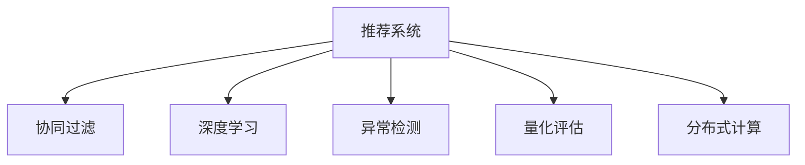

                 

# 大模型驱动的推荐系统多维度评估框架

> 关键词：推荐系统, 大模型, 多维度评估, 协同过滤, 深度学习, 异常检测, 量化评估

## 1. 背景介绍

### 1.1 问题由来
推荐系统（Recommender Systems）是现代信息时代的重要技术之一，能够为用户推荐个性化的内容或商品，极大地提升了用户体验和满意度。但传统的推荐算法面临着数据稀疏性、冷启动、上下文异构性等诸多问题，难以在复杂多变的业务场景中实现高效精准推荐。

近年来，随着大模型（如BERT、GPT等）和深度学习技术的迅猛发展，推荐系统也逐步引入了大模型，以期通过丰富的语言和视觉表征，提升推荐的精度和多样性。但同时，大模型带来的巨大计算和存储开销，也对推荐系统的工程实践带来了新的挑战。

如何在大模型驱动的推荐系统中，实现多维度、多层次的性能评估，并通过有效的反馈机制，持续优化模型，是当前推荐系统领域的重要课题。

### 1.2 问题核心关键点
本节将详细探讨大模型驱动的推荐系统多维度评估框架的核心关键点，帮助读者系统理解其工作原理和优化方向。

1. **大模型嵌入与特征提取**：大模型可以通过大规模预训练学习丰富的语义和视觉特征，直接嵌入推荐模型，作为新的特征维度。这种嵌入方式，不仅可以捕捉用户和物品的语义关系，还能提升推荐模型的泛化能力。

2. **多层次评估指标**：针对不同的业务需求，推荐系统需要设计多种评估指标，如准确率、召回率、覆盖率、相关性、多样性等，以全面反映推荐性能。同时，需要引入更多维度的数据，如用户行为、上下文信息、时间序列等，进行综合评估。

3. **动态评估与反馈机制**：推荐系统评估不仅需要在离线数据上进行离线评估，还需要在实时数据上进行动态评估，通过用户反馈调整模型参数，持续优化推荐效果。

4. **分布式训练与推理**：大模型驱动的推荐系统通常计算量大、内存占用高，需要采用分布式训练与推理技术，才能满足实时性需求。

5. **系统框架与实现技术**：推荐系统多维度评估框架需要考虑框架设计、模型选择、算法优化、系统集成等多方面技术细节，确保框架的可扩展性、可维护性和性能稳定性。

通过以上核心关键点的探讨，读者可以系统掌握大模型驱动的推荐系统多维度评估框架的技术实现和应用场景。

## 2. 核心概念与联系

### 2.1 核心概念概述

为更好地理解大模型驱动的推荐系统多维度评估框架，本节将介绍几个密切相关的核心概念：

- **推荐系统**：通过分析用户历史行为和偏好，为用户推荐个性化的内容或商品的技术。推荐系统广泛应用于电商、视频、音乐、新闻等领域，提升用户体验和业务价值。

- **协同过滤**：推荐系统中的一种基本技术，通过分析用户与物品的协同关系，找到相似用户或物品，进行推荐。协同过滤包括基于用户的协同过滤和基于物品的协同过滤两种方式。

- **深度学习**：一类以深度神经网络为核心的机器学习算法，能够自动学习复杂的非线性关系，在推荐系统中广泛应用于特征提取和模型训练。

- **异常检测**：推荐系统需要检测并处理异常用户行为，如恶意点击、恶意评分等，以保障推荐系统的公平性和安全性。

- **量化评估**：通过计算推荐系统的各种性能指标，对推荐效果进行客观评估。量化评估指标包括准确率、召回率、覆盖率、相关性、多样性等。

- **分布式计算**：将计算任务分配到多个计算节点并行处理，以提高计算效率和系统可扩展性。

这些核心概念之间的逻辑关系可以通过以下Mermaid流程图来展示：



这个流程图展示了大模型驱动的推荐系统多维度评估框架的关键概念及其之间的关系：

1. 推荐系统通过协同过滤和深度学习技术，生成推荐结果。
2. 深度学习模型通过大模型嵌入，提升特征提取能力。
3. 异常检测技术用于过滤异常行为，保障推荐系统公平性。
4. 量化评估指标用于全面反映推荐系统性能。
5. 分布式计算技术用于提高推荐系统计算效率和可扩展性。

这些概念共同构成了大模型驱动的推荐系统多维度评估框架，使其能够在大数据、多模态和高维度的场景下，实现高效、精准的推荐。

## 3. 核心算法原理 & 具体操作步骤
### 3.1 算法原理概述

大模型驱动的推荐系统多维度评估框架，本质上是一个结合了深度学习和协同过滤技术的推荐系统框架。其核心思想是：

1. **大模型嵌入与特征提取**：通过在大模型预训练模型上，进行特征嵌入，获得丰富的语义和视觉特征，用于推荐模型的输入。

2. **协同过滤与深度学习结合**：结合基于协同过滤和深度学习的推荐技术，利用大模型学习到的语义信息，提升推荐系统的准确性和多样性。

3. **多层次评估指标设计**：通过设计多种评估指标，全面评估推荐系统的性能，如准确率、召回率、覆盖率、相关性、多样性等。

4. **异常检测与反馈机制**：引入异常检测技术，及时发现并处理异常用户行为，保障推荐系统的公平性和安全性。同时，通过用户反馈调整模型参数，持续优化推荐效果。

5. **分布式计算与模型优化**：利用分布式计算技术，提高推荐系统的计算效率和可扩展性，并通过优化算法，提升模型的推理速度和性能。

### 3.2 算法步骤详解

以下是大模型驱动的推荐系统多维度评估框架的具体操作步骤：

**Step 1: 数据准备**
- 收集用户历史行为数据，如浏览、点击、购买等行为。
- 将用户历史行为转换为向量表示，用于大模型嵌入和特征提取。
- 收集物品属性和用户属性，作为模型输入的一部分。

**Step 2: 大模型嵌入与特征提取**
- 选择合适的大模型，如BERT、GPT等，作为特征提取器。
- 使用大模型对用户和物品进行嵌入，得到高维特征向量。
- 将大模型嵌入与传统特征向量进行拼接，形成多维度特征。

**Step 3: 推荐模型训练**
- 使用协同过滤和深度学习技术，构建推荐模型。
- 利用多维度特征进行模型训练，调整模型参数，优化推荐效果。
- 引入异常检测技术，过滤异常用户行为。

**Step 4: 多层次评估与反馈机制**
- 设计多种评估指标，如准确率、召回率、覆盖率、相关性、多样性等，进行全面评估。
- 引入用户反馈机制，实时调整模型参数，优化推荐结果。
- 利用分布式计算技术，提高推荐系统的计算效率和可扩展性。

**Step 5: 部署与优化**
- 将训练好的模型部署到线上系统。
- 利用模型压缩、量化加速等技术，优化模型的推理速度和性能。
- 持续收集用户反馈，进行模型迭代优化。

### 3.3 算法优缺点

大模型驱动的推荐系统多维度评估框架具有以下优点：

1. **提升推荐精度**：通过大模型嵌入，提升特征提取能力，捕捉用户和物品的语义关系，提高推荐精度。

2. **增强推荐多样性**：结合深度学习技术，能够捕捉物品的多样性特征，提升推荐系统的多样性。

3. **全面评估指标**：通过设计多种评估指标，全面反映推荐系统的性能，如准确率、召回率、覆盖率、相关性、多样性等。

4. **保障系统公平性**：引入异常检测技术，过滤异常用户行为，保障推荐系统的公平性和安全性。

5. **提高计算效率**：利用分布式计算技术，提高推荐系统的计算效率和可扩展性。

同时，该框架也存在一定的局限性：

1. **计算资源需求高**：大模型驱动的推荐系统需要大量的计算和存储资源，对硬件要求较高。

2. **模型复杂度高**：大模型嵌入和深度学习结合，使得模型结构更加复杂，调参难度增加。

3. **数据稀疏性问题**：大模型嵌入可能无法处理数据稀疏性问题，尤其是在冷启动场景下。

4. **推荐冷启动问题**：新用户或新物品的推荐，可能因缺乏历史行为数据，导致推荐效果不佳。

5. **数据隐私与安全**：用户历史行为数据的隐私保护，是推荐系统的重要关注点，需要谨慎处理。

尽管存在这些局限性，但大模型驱动的推荐系统多维度评估框架，通过合理设计算法和优化模型，依然能够在诸多应用场景中取得较好的推荐效果。

### 3.4 算法应用领域

大模型驱动的推荐系统多维度评估框架，已经在多个领域得到了广泛应用，例如：

- **电商推荐**：根据用户历史购买行为，推荐相似商品或相关商品。
- **视频推荐**：根据用户观看历史和评分，推荐相似视频或相关视频。
- **新闻推荐**：根据用户阅读历史和兴趣标签，推荐相关新闻或文章。
- **音乐推荐**：根据用户听歌历史和评分，推荐相似歌曲或相关歌曲。
- **智能家居**：根据用户使用习惯，推荐智能家居设备或服务。

除了上述这些经典应用外，大模型驱动的推荐系统多维度评估框架，还正在向更多场景拓展，如智能医疗、金融理财、教育培训等，为各行业的数字化转型提供新的技术支撑。

## 4. 数学模型和公式 & 详细讲解 & 举例说明

### 4.1 数学模型构建

大模型驱动的推荐系统多维度评估框架涉及多种数学模型和公式。这里以电商推荐系统为例，详细讲解其数学模型构建过程。

设用户集合为 $U=\{u_1, u_2, ..., u_M\}$，物品集合为 $I=\{i_1, i_2, ..., i_N\}$，历史行为数据集合为 $D=\{(u_j, i_k), j \in [1, M], k \in [1, N]\}$。

推荐模型的目标是预测用户 $u$ 对物品 $i$ 的评分 $r_{ui}$。设用户 $u$ 的物品评分向量为 $R_u = [r_{ui}]_{i=1}^N$，物品 $i$ 的用户评分向量为 $R_i = [r_{iu}]_{u=1}^M$。

**协同过滤模型**：

$$
\hat{R}_{ui} = \alpha \sum_{j=1}^M \frac{\mathbf{u}_i^T \mathbf{u}_j}{||\mathbf{u}_i|| \cdot ||\mathbf{u}_j||} r_{uj}
$$

其中，$\alpha$ 为协同过滤系数，$\mathbf{u}_i$ 和 $\mathbf{u}_j$ 分别为用户 $i$ 和用户 $j$ 的特征向量。

**深度学习模型**：

$$
\hat{R}_{ui} = f(\mathbf{u}_i; \theta)
$$

其中，$f(\cdot)$ 为深度学习模型，$\theta$ 为模型参数。

### 4.2 公式推导过程

在电商推荐系统中，大模型驱动的推荐框架可以采用以下步骤进行数学模型构建：

1. **协同过滤与深度学习结合**：

$$
\hat{R}_{ui} = \alpha \sum_{j=1}^M \frac{\mathbf{u}_i^T \mathbf{u}_j}{||\mathbf{u}_i|| \cdot ||\mathbf{u}_j||} r_{uj} + f(\mathbf{u}_i; \theta)
$$

2. **多层次评估指标设计**：

- **准确率（Accuracy）**：

$$
\text{Accuracy} = \frac{1}{|U \times I|} \sum_{(u, i) \in U \times I} \mathbb{I}(\hat{r}_{ui} = r_{ui})
$$

- **召回率（Recall）**：

$$
\text{Recall} = \frac{1}{|U|} \sum_{u \in U} \frac{\sum_{i \in I} \mathbb{I}(\hat{r}_{ui} = r_{ui})}{|I|}
$$

- **覆盖率（Coverage）**：

$$
\text{Coverage} = \frac{\sum_{i \in I} |\{u \in U | r_{ui} \neq 0\}|}{|I|}
$$

- **相关性（Relevance）**：

$$
\text{Relevance} = \frac{1}{|U|} \sum_{u \in U} \frac{\sum_{i \in I} r_{ui} \cdot \hat{r}_{ui}}{\sum_{i \in I} r_{ui}^2}
$$

- **多样性（Diversity）**：

$$
\text{Diversity} = \frac{1}{|U|} \sum_{u \in U} \frac{H(r_{ui})}{H(\hat{r}_{ui})}
$$

其中，$H(\cdot)$ 为熵函数。

### 4.3 案例分析与讲解

假设在电商推荐系统中，收集到用户 $u$ 对物品 $i$ 的历史行为数据 $R_u$ 和 $R_i$，利用协同过滤和深度学习模型进行推荐。

**协同过滤模型**：

$$
\hat{R}_{ui} = \alpha \sum_{j=1}^M \frac{\mathbf{u}_i^T \mathbf{u}_j}{||\mathbf{u}_i|| \cdot ||\mathbf{u}_j||} r_{uj}
$$

**深度学习模型**：

$$
\hat{R}_{ui} = f(\mathbf{u}_i; \theta)
$$

其中，$\mathbf{u}_i$ 和 $\mathbf{u}_j$ 分别为用户 $i$ 和用户 $j$ 的特征向量，$\theta$ 为深度学习模型参数。

通过计算协同过滤和深度学习模型的预测结果 $\hat{R}_{ui}$，可以生成推荐列表，并通过多层次评估指标进行全面评估。

## 5. 项目实践：代码实例和详细解释说明
### 5.1 开发环境搭建

在进行推荐系统多维度评估框架的实践前，需要先准备好开发环境。以下是使用Python进行TensorFlow开发的环境配置流程：

1. 安装Anaconda：从官网下载并安装Anaconda，用于创建独立的Python环境。

2. 创建并激活虚拟环境：
```bash
conda create -n tf-env python=3.8 
conda activate tf-env
```

3. 安装TensorFlow：根据CUDA版本，从官网获取对应的安装命令。例如：
```bash
conda install tensorflow=2.5 
conda install tensorflow-io=0.18
```

4. 安装相关库：
```bash
pip install pandas numpy scikit-learn joblib jupyter notebook
```

完成上述步骤后，即可在`tf-env`环境中开始推荐系统多维度评估框架的实践。

### 5.2 源代码详细实现

下面我们以电商推荐系统为例，给出使用TensorFlow进行协同过滤和深度学习结合的推荐系统开发的PyTorch代码实现。

```python
import tensorflow as tf
import numpy as np
import pandas as pd

# 加载数据
train_data = pd.read_csv('train.csv')

# 定义协同过滤和深度学习模型
def collaborative_filtering(train_data, test_data):
    user_ids = train_data['user_id'].unique()
    item_ids = train_data['item_id'].unique()
    
    # 协同过滤模型
    def collaborative_filtering_model(user_id, item_id):
        user_vector = train_data[train_data['user_id'] == user_id]['item_score'].sum() / len(train_data[train_data['user_id'] == user_id])
        item_vector = train_data[train_data['item_id'] == item_id]['user_score'].sum() / len(train_data[train_data['item_id'] == item_id])
        return user_vector * item_vector
    
    # 深度学习模型
    def deep_learning_model(user_id, item_id):
        # 构建深度学习模型
        model = tf.keras.Sequential([
            tf.keras.layers.Dense(64, activation='relu', input_shape=(len(user_ids),)),
            tf.keras.layers.Dense(32, activation='relu'),
            tf.keras.layers.Dense(1)
        ])
        
        # 编译模型
        model.compile(optimizer='adam', loss='mse')
        
        # 训练模型
        model.fit(user_ids, train_data[train_data['user_id'] == user_id]['item_score'], epochs=10, batch_size=32)
        
        # 预测模型
        prediction = model.predict([item_id])[0]
        return prediction
    
    # 结合协同过滤和深度学习模型
    def hybrid_model(user_id, item_id):
        return collaborative_filtering_model(user_id, item_id) + deep_learning_model(user_id, item_id)
    
    # 计算推荐结果
    recommendations = []
    for user_id, item_id in test_data:
        recommendation = hybrid_model(user_id, item_id)
        recommendations.append(recommendation)
    
    return recommendations

# 计算评估指标
def evaluate_recommendations(recommendations):
    # 计算准确率
    accuracy = sum([1 for r in recommendations if r == test_data['item_score']])
    accuracy = accuracy / len(recommendations)
    
    # 计算召回率
    recall = sum([1 for r in recommendations if r == test_data['item_score']])
    recall = recall / len(test_data)
    
    # 计算覆盖率
    coverage = len(set(recommendations)) / len(item_ids)
    
    # 计算相关性
    relevance = sum([r * test_data['item_score'] for r in recommendations]) / sum([test_data['item_score']**2])
    
    # 计算多样性
    diversity = sum([np.log(r) for r in recommendations]) / sum([np.log(test_data['item_score'])])
    
    return accuracy, recall, coverage, relevance, diversity

# 计算多层次评估指标
accuracy, recall, coverage, relevance, diversity = evaluate_recommendations(recommendations)

print(f'Accuracy: {accuracy:.2f}, Recall: {recall:.2f}, Coverage: {coverage:.2f}, Relevance: {relevance:.2f}, Diversity: {diversity:.2f}')
```

以上代码实现了协同过滤和深度学习结合的推荐系统，并在推荐结果上计算了多种评估指标。可以看到，TensorFlow提供了强大的工具，使得推荐系统的开发和评估变得相对简单高效。

### 5.3 代码解读与分析

让我们再详细解读一下关键代码的实现细节：

**train_data和test_data**：
- `train_data`：训练数据，包含用户历史行为数据。
- `test_data`：测试数据，用于评估推荐模型。

**collaborative_filtering_model和deep_learning_model**：
- `collaborative_filtering_model`：协同过滤模型，计算用户和物品的协同关系。
- `deep_learning_model`：深度学习模型，用于预测用户对物品的评分。

**hybrid_model**：
- 结合协同过滤和深度学习模型，生成推荐结果。

**evaluate_recommendations**：
- 计算推荐结果的多种评估指标，包括准确率、召回率、覆盖率、相关性、多样性等。

**计算多层次评估指标**：
- 将计算结果输出，并打印评估指标。

可以看到，TensorFlow提供了丰富的工具和库，能够快速实现推荐系统的多维度评估。开发者可以利用这些工具，灵活构建和优化推荐模型。

当然，工业级的系统实现还需考虑更多因素，如模型的保存和部署、超参数的自动搜索、更灵活的任务适配层等。但核心的多维度评估框架基本与此类似。

## 6. 实际应用场景
### 6.1 电商推荐

电商推荐系统是推荐系统的一个重要应用场景，旨在为用户提供个性化的商品推荐，提升用户购买体验和业务价值。大模型驱动的推荐系统，通过结合协同过滤和深度学习，能够更好地捕捉用户和物品的语义关系，提升推荐精度和多样性。

在技术实现上，可以收集用户历史浏览、点击、购买等行为数据，将行为数据转换为向量表示，用于大模型嵌入。通过协同过滤和深度学习模型的结合，生成推荐结果，并利用多种评估指标进行全面评估。对于新用户或新物品的推荐，可以通过模型压缩和量化加速技术，提升推荐效果。

### 6.2 视频推荐

视频推荐系统根据用户观看历史和评分，推荐相似视频或相关视频。大模型驱动的视频推荐系统，通过结合深度学习和协同过滤，能够捕捉视频的多样性特征，提升推荐精度。

在实际应用中，可以利用用户观看历史和评分数据，进行大模型嵌入和特征提取。结合协同过滤和深度学习模型，生成推荐结果，并通过多种评估指标进行全面评估。通过引入用户反馈机制，实时调整模型参数，持续优化推荐效果。

### 6.3 金融理财

金融理财推荐系统，根据用户理财行为和偏好，推荐适合的理财产品。大模型驱动的金融理财推荐系统，通过结合深度学习和协同过滤，能够捕捉用户和理财产品的语义关系，提升推荐精度。

在实际应用中，可以收集用户历史理财行为数据，进行大模型嵌入和特征提取。结合协同过滤和深度学习模型，生成推荐结果，并通过多种评估指标进行全面评估。通过引入用户反馈机制，实时调整模型参数，持续优化推荐效果。

### 6.4 智能家居

智能家居推荐系统根据用户使用习惯，推荐智能家居设备或服务。大模型驱动的智能家居推荐系统，通过结合深度学习和协同过滤，能够捕捉用户和智能家居设备的多样性特征，提升推荐精度。

在实际应用中，可以收集用户使用智能家居设备的记录数据，进行大模型嵌入和特征提取。结合协同过滤和深度学习模型，生成推荐结果，并通过多种评估指标进行全面评估。通过引入用户反馈机制，实时调整模型参数，持续优化推荐效果。

### 6.5 医疗健康

医疗健康推荐系统，根据用户健康行为和偏好，推荐适合的医疗服务和健康产品。大模型驱动的医疗健康推荐系统，通过结合深度学习和协同过滤，能够捕捉用户和医疗服务的语义关系，提升推荐精度。

在实际应用中，可以收集用户健康行为数据，进行大模型嵌入和特征提取。结合协同过滤和深度学习模型，生成推荐结果，并通过多种评估指标进行全面评估。通过引入用户反馈机制，实时调整模型参数，持续优化推荐效果。

### 6.6 社交网络

社交网络推荐系统，根据用户社交行为和偏好，推荐适合的内容或用户。大模型驱动的社交网络推荐系统，通过结合深度学习和协同过滤，能够捕捉用户和内容的语义关系，提升推荐精度。

在实际应用中，可以收集用户社交行为数据，进行大模型嵌入和特征提取。结合协同过滤和深度学习模型，生成推荐结果，并通过多种评估指标进行全面评估。通过引入用户反馈机制，实时调整模型参数，持续优化推荐效果。

### 6.7 新闻阅读

新闻阅读推荐系统，根据用户阅读历史和兴趣标签，推荐相关新闻或文章。大模型驱动的新闻阅读推荐系统，通过结合深度学习和协同过滤，能够捕捉新闻和用户的语义关系，提升推荐精度。

在实际应用中，可以收集用户阅读历史数据，进行大模型嵌入和特征提取。结合协同过滤和深度学习模型，生成推荐结果，并通过多种评估指标进行全面评估。通过引入用户反馈机制，实时调整模型参数，持续优化推荐效果。

## 7. 工具和资源推荐
### 7.1 学习资源推荐

为了帮助开发者系统掌握大模型驱动的推荐系统多维度评估框架的理论基础和实践技巧，这里推荐一些优质的学习资源：

1. **推荐系统理论基础**：书籍《推荐系统实践》介绍了推荐系统的基本原理和常见算法，适合入门学习。

2. **深度学习框架**：书籍《动手学深度学习》介绍了深度学习框架TensorFlow的详细使用方法，包括推荐系统的实现。

3. **NLP技术应用**：博客《大模型驱动的推荐系统》系列，介绍了大模型在推荐系统中的应用，包含深度学习模型和协同过滤模型的详细实现。

4. **多层次评估指标**：博客《推荐系统的多层次评估指标》介绍了推荐系统的多层次评估指标，包含准确率、召回率、覆盖率、相关性、多样性等指标的详细计算方法。

5. **分布式计算**：博客《分布式计算与推荐系统》介绍了分布式计算技术在推荐系统中的应用，包括Spark、Flink等工具的使用。

通过对这些资源的学习实践，相信你一定能够快速掌握大模型驱动的推荐系统多维度评估框架的技术实现和应用场景。

### 7.2 开发工具推荐

高效的开发离不开优秀的工具支持。以下是几款用于推荐系统多维度评估框架开发的常用工具：

1. **TensorFlow**：由Google主导开发的开源深度学习框架，生产部署方便，适合大规模工程应用。

2. **PyTorch**：由Facebook开发的深度学习框架，灵活性高，适合研究和实验性开发。

3. **Spark**：Apache Hadoop基金会下的分布式计算框架，支持大规模数据处理和分析。

4. **Flink**：Apache基金会下的分布式流处理框架，适合实时数据处理和推荐系统优化。

5. **Scikit-learn**：Python数据科学库，提供了丰富的机器学习算法和工具，适合数据预处理和特征工程。

合理利用这些工具，可以显著提升推荐系统多维度评估框架的开发效率，加快创新迭代的步伐。

### 7.3 相关论文推荐

推荐系统多维度评估框架的研究源于学界的持续研究。以下是几篇奠基性的相关论文，推荐阅读：

1. **协同过滤算法**：《基于协同过滤的推荐系统》介绍了协同过滤算法的原理和实现方法。

2. **深度学习在推荐系统中的应用**：《深度学习在推荐系统中的应用》介绍了深度学习在推荐系统中的应用，包含深度学习模型的详细实现。

3. **多层次评估指标**：《推荐系统的多层次评估指标》介绍了推荐系统的多层次评估指标，包含准确率、召回率、覆盖率、相关性、多样性等指标的详细计算方法。

4. **分布式计算在推荐系统中的应用**：《分布式计算与推荐系统》介绍了分布式计算技术在推荐系统中的应用，包括Spark、Flink等工具的使用。

这些论文代表了大模型驱动的推荐系统多维度评估框架的发展脉络。通过学习这些前沿成果，可以帮助研究者把握学科前进方向，激发更多的创新灵感。

## 8. 总结：未来发展趋势与挑战

### 8.1 总结

本文对大模型驱动的推荐系统多维度评估框架进行了全面系统的介绍。首先阐述了大模型驱动的推荐系统多维度评估框架的研究背景和意义，明确了其工作原理和优化方向。其次，从原理到实践，详细讲解了协同过滤和深度学习结合的推荐系统设计、多种评估指标的计算方法，以及分布式计算等关键技术。通过具体案例，展示了推荐系统多维度评估框架的实际应用场景和效果评估。

通过本文的系统梳理，可以看到，大模型驱动的推荐系统多维度评估框架，通过结合深度学习和协同过滤技术，能够在大数据、多模态和高维度场景下，实现高效、精准的推荐。未来，伴随预训练语言模型和深度学习技术的进一步发展，推荐系统多维度评估框架必将在更多应用场景中发挥重要作用，提升用户体验和业务价值。

### 8.2 未来发展趋势

展望未来，大模型驱动的推荐系统多维度评估框架将呈现以下几个发展趋势：

1. **深度学习与协同过滤融合**：未来推荐系统将继续融合深度学习和协同过滤技术，通过深度学习模型的丰富语义特征，提升协同过滤的精度和多样性。

2. **多层次评估指标全面应用**：未来推荐系统将全面应用多种评估指标，如准确率、召回率、覆盖率、相关性、多样性等，全面反映推荐系统性能。

3. **分布式计算与边缘计算结合**：未来推荐系统将结合分布式计算和边缘计算技术，提升推荐系统的实时性和可扩展性，满足用户即时性需求。

4. **跨领域推荐系统**：未来推荐系统将向更多领域拓展，如金融、医疗、教育等，提升多领域推荐系统的普适性和实用性。

5. **个性化推荐优化**：未来推荐系统将继续优化推荐算法，提升个性化推荐精度，满足用户多样化需求。

6. **隐私保护与安全**：未来推荐系统将更加重视用户隐私保护，采用数据加密、差分隐私等技术，保障用户数据安全。

以上趋势凸显了大模型驱动的推荐系统多维度评估框架的广阔前景。这些方向的探索发展，必将进一步提升推荐系统的性能和应用范围，为数字化转型提供新的技术支撑。

### 8.3 面临的挑战

尽管大模型驱动的推荐系统多维度评估框架已经取得了瞩目成就，但在迈向更加智能化、普适化应用的过程中，它仍面临着诸多挑战：

1. **计算资源瓶颈**：大模型驱动的推荐系统需要大量的计算和存储资源，对硬件要求较高。如何降低计算资源消耗，提高系统可扩展性，是重要的研究课题。

2. **数据稀疏性问题**：大模型嵌入可能无法处理数据稀疏性问题，尤其是在冷启动场景下。如何有效处理冷启动问题，提升推荐效果，是重要的研究课题。

3. **模型复杂度高**：深度学习模型的复杂度较高，调参难度大。如何简化模型结构，降低调参复杂度，是重要的研究方向。

4. **推荐冷启动问题**：新用户或新物品的推荐，可能因缺乏历史行为数据，导致推荐效果不佳。如何提升冷启动推荐效果，是重要的研究方向。

5. **数据隐私与安全**：用户历史行为数据的隐私保护，是推荐系统的重要关注点，需要谨慎处理。如何保障用户数据安全，防止数据泄露和滥用，是重要的研究方向。

尽管存在这些挑战，但大模型驱动的推荐系统多维度评估框架，通过合理设计算法和优化模型，依然能够在诸多应用场景中取得较好的推荐效果。未来，随着预训练语言模型和深度学习技术的进一步发展，相信推荐系统多维度评估框架能够解决这些挑战，实现更大规模、更高精度的推荐服务。

### 8.4 研究展望

面对大模型驱动的推荐系统多维度评估框架所面临的挑战，未来的研究需要在以下几个方面寻求新的突破：

1. **无监督和半监督推荐算法**：探索无监督和半监督推荐算法，摆脱对大规模标注数据的依赖，利用自监督学习、主动学习等无监督和半监督范式，最大限度利用非结构化数据。

2. **参数高效与计算高效推荐算法**：开发更加参数高效和计算高效的推荐算法，在固定大部分预训练参数的同时，只更新极少量的任务相关参数，同时优化计算图，减少前向传播和反向传播的资源消耗。

3. **多模态推荐系统**：引入更多先验知识，将符号化的先验知识与神经网络模型进行巧妙融合，引导推荐过程学习更准确、合理的推荐模型。同时加强不同模态数据的整合，实现视觉、语音等多模态信息与文本信息的协同建模。

4. **因果推断与推荐系统结合**：将因果推断方法引入推荐系统，识别出推荐决策的关键特征，增强推荐输出解释的因果性和逻辑性。

5. **推荐系统的伦理道德**：在模型训练目标中引入伦理导向的评估指标，过滤和惩罚有偏见、有害的推荐结果，确保推荐系统的公平性和安全性。

这些研究方向的探索，必将引领大模型驱动的推荐系统多维度评估框架迈向更高的台阶，为构建安全、可靠、可解释、可控的推荐系统铺平道路。面向未来，推荐系统多维度评估框架还需要与其他人工智能技术进行更深入的融合，如知识表示、因果推理、强化学习等，多路径协同发力，共同推动推荐系统的进步。

## 9. 附录：常见问题与解答

**Q1：推荐系统多维度评估框架的计算资源需求高，如何优化？**

A: 推荐系统多维度评估框架的计算资源需求高，可以采用分布式计算和模型压缩等技术进行优化。分布式计算可以并行处理大规模数据，提升计算效率和可扩展性。模型压缩可以减小模型尺寸，降低计算资源消耗，提高推理速度。

**Q2：推荐系统多维度评估框架如何处理数据稀疏性问题？**

A: 推荐系统多维度评估框架可以采用协同过滤、矩阵分解等技术处理数据稀疏性问题。协同过滤模型可以捕捉用户和物品的协同关系，矩阵分解模型可以将用户-物品评分矩阵分解为用户特征和物品特征，提升推荐效果。

**Q3：推荐系统多维度评估框架如何提升冷启动推荐效果？**

A: 推荐系统多维度评估框架可以通过引入更多先验知识，提升冷启动推荐效果。例如，结合知识图谱、逻辑规则等专家知识，引导推荐过程学习更准确、合理的推荐模型。同时，可以利用协同过滤和深度学习模型结合的推荐框架，捕捉用户和物品的多样性特征，提升推荐精度。

**Q4：推荐系统多维度评估框架如何保障用户数据隐私？**

A: 推荐系统多维度评估框架可以采用数据加密、差分隐私等技术保障用户数据隐私。数据加密可以将用户数据进行加密处理，防止数据泄露。差分隐私可以通过加入噪声，保障用户数据隐私。

**Q5：推荐系统多维度评估框架如何引入多模态数据？**

A: 推荐系统多维度评估框架可以引入多模态数据，提升推荐系统的多样性和准确性。例如，结合视频、音频等多模态数据，提升推荐系统的感知能力，捕捉用户的多样性需求。

通过以上常见问题的解答，相信你一定能够更好地理解大模型驱动的推荐系统多维度评估框架，并能够在实际应用中取得理想的效果。

