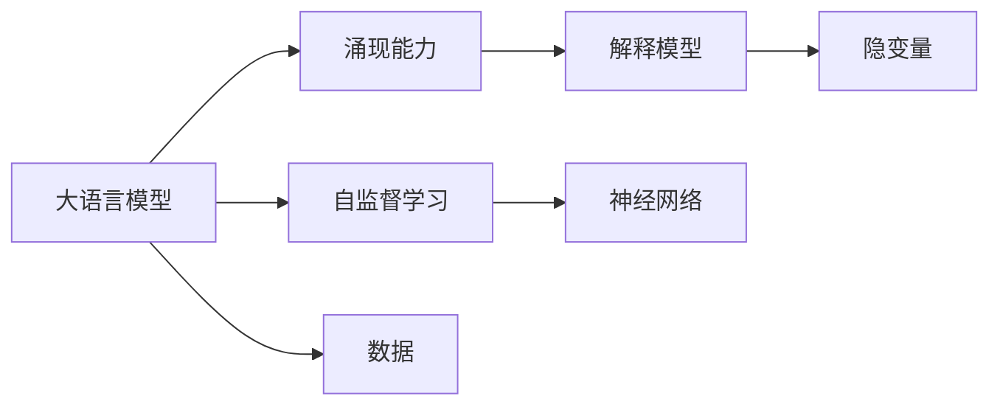

                 

# 大语言模型的涌现能力现象与解释

> 关键词：大语言模型,涌现能力,解释模型,隐变量,自监督学习,神经网络

## 1. 背景介绍

近年来，大语言模型（Large Language Models, LLMs）如OpenAI的GPT系列、Google的BERT等，以其卓越的性能和广泛的适用性，引起了学术界和工业界的极大关注。这些模型通过在海量无标签文本数据上进行预训练，学习到了丰富的语言知识和常识，展现出惊人的涌现能力。涌现能力指的是模型能够在预训练数据中学习到数据本身不存在的规则和结构，从而在预料之外的任务上表现出超乎寻常的性能。

涌现能力这一现象引发了广泛的研究兴趣，但对于涌现能力的形成机制，目前学界并未达成一致共识。为了深入理解大语言模型的涌现能力，本文将详细探讨涌现能力的概念、本质及其形成机制，并提供一些案例分析，揭示涌现能力背后的数学模型和计算原理。

## 2. 核心概念与联系

### 2.1 核心概念概述

要理解大语言模型的涌现能力，首先需要明确几个关键概念：

- **大语言模型（Large Language Models, LLMs）**：指以自回归（如GPT）或自编码（如BERT）模型为代表的大规模预训练语言模型。这些模型通过在大规模无标签文本数据上进行预训练，学习到了复杂的语言结构和知识，具备强大的语言理解和生成能力。

- **涌现能力（Emergent Capability）**：指模型在预训练过程中学习到的语言规律和结构，在未经过特别训练的情况下，能够在特定任务上表现出超出预期的效果。涌现能力是语言模型智能化的重要标志。

- **解释模型（Interpretable Model）**：指能够提供可解释性的模型，即模型输出的结果可以通过简单的数学公式或规则直接解释。与复杂的涌现能力模型相对，解释模型更易于理解和使用。

- **隐变量（Latent Variable）**：指模型内部潜在的变量，其值在模型训练过程中被隐式学习，但无法直接观测。隐变量的存在是涌现能力形成的重要机制之一。

- **自监督学习（Self-Supervised Learning）**：指利用数据的自然属性或结构进行无标签训练，学习到模型的表示。常见的自监督学习任务包括掩码语言模型（Masked Language Modeling, MLM）、下一句预测（Next Sentence Prediction, NSP）等。

- **神经网络（Neural Network）**：指由多个神经元构成的计算图，用于逼近复杂非线性映射关系。神经网络是大语言模型的基础结构。

这些核心概念之间存在密切联系，共同构成了大语言模型的涌现能力框架。

### 2.2 核心概念联系的 Mermaid 流程图



这个流程图展示了核心概念之间的逻辑关系：大语言模型通过自监督学习在神经网络中学习涌现能力，而涌现能力往往包含复杂的隐变量。解释模型通过简单的数学公式解释涌现能力背后的计算原理，而数据是大语言模型学习涌现能力的素材。

## 3. 核心算法原理 & 具体操作步骤

### 3.1 算法原理概述

大语言模型的涌现能力主要通过自监督学习和隐变量学习实现。具体而言，模型通过在无标签数据上进行的自监督任务，学习到语言的统计规律和结构。这些规律和结构被隐式编码在模型的权重参数中，并在特定的下游任务中表现出涌现能力。

### 3.2 算法步骤详解

大语言模型的涌现能力实现步骤如下：

**Step 1: 数据准备**
- 收集大规模无标签文本数据，如维基百科、新闻、小说等。
- 数据预处理，包括文本分词、构建词汇表等。

**Step 2: 构建自监督任务**
- 设计自监督学习任务，如掩码语言模型（MLM）、下一句预测（NSP）等。
- 将构建的任务数据输入模型进行训练，学习语言的基本规律和结构。

**Step 3: 初始化模型**
- 使用随机权重初始化模型参数，通常使用Xavier或He初始化。
- 将初始化的模型作为预设参数，为后续的微调或微调后的训练提供基础。

**Step 4: 模型训练**
- 使用训练集数据迭代训练模型，优化模型参数。
- 在训练过程中，不断更新模型的权重参数，使得模型能够更好地捕捉语言的规律和结构。

**Step 5: 测试评估**
- 在测试集上评估模型性能，查看是否达到预期的涌现能力。
- 进行隐变量分析，探究涌现能力的具体表现。

### 3.3 算法优缺点

大语言模型的涌现能力具有以下优点：

- **泛化能力强**：模型在未见过的数据上也能表现出优秀的性能。
- **学习效率高**：自监督学习任务设计简单，模型可以通过大规模数据进行高效学习。
- **应用广泛**：涌现能力可应用于各种自然语言处理任务，如文本分类、情感分析、翻译等。

同时，也存在以下局限性：

- **理解深度有限**：涌现能力主要依赖于统计规律，难以深入理解语言的复杂语义。
- **可解释性不足**：涌现能力模型通常黑箱运作，难以解释其内部计算过程。
- **计算资源需求高**：大规模模型需要大量的计算资源进行训练，时间成本较高。

### 3.4 算法应用领域

涌现能力在大语言模型的多个应用领域中得到广泛应用，例如：

- **文本分类**：通过学习文本-标签映射，模型能够对新闻、评论等文本进行分类。
- **机器翻译**：通过学习语言-语言映射，模型能够将一种语言翻译成另一种语言。
- **问答系统**：通过学习问答对，模型能够对自然语言问题给出准确答案。
- **对话系统**：通过学习对话历史，模型能够进行自然对话。
- **文本摘要**：通过学习文章-摘要对，模型能够自动生成简短摘要。
- **情感分析**：通过学习情感-标签映射，模型能够对文本情感进行分类。

## 4. 数学模型和公式 & 详细讲解 & 举例说明

### 4.1 数学模型构建

大语言模型通过自监督学习任务来学习涌现能力。以BERT模型为例，其自监督任务包括掩码语言模型（MLM）和下一句预测（NSP）。

**掩码语言模型（Masked Language Modeling, MLM）**：
- 将句子中的某些词随机替换为[MASK]，要求模型预测被掩码的词。
- 目标函数：$L = -\log P(w_{[MASK]})$，其中$P(w_{[MASK]})$为模型预测[MASK]位置的概率分布。

**下一句预测（Next Sentence Prediction, NSP）**：
- 将句子A和句子B拼接为一个段落，要求模型判断B是否是A的下一句。
- 目标函数：$L = -\log P(B \mid A)$，其中$P(B \mid A)$为模型预测B是A下一句的概率。

### 4.2 公式推导过程

以掩码语言模型为例，推导目标函数的梯度计算公式：

设$w_i$表示第$i$个词的嵌入向量，$W$表示模型参数矩阵，$P(w_{[MASK]})$表示模型预测[MASK]位置的概率分布。目标函数为：

$$
L = -\log P(w_{[MASK]})
$$

梯度计算公式为：

$$
\frac{\partial L}{\partial W} = \frac{-1}{N}\sum_{i=1}^N \sum_{j=1}^N \frac{\partial P(w_{[MASK]})}{\partial W} \cdot (1(I_{i,j} = 0))
$$

其中$I_{i,j}$为指示函数，表示词$w_i$是否被掩码。梯度计算中需要考虑掩码的位置和上下文信息。

### 4.3 案例分析与讲解

**案例分析：BERT模型**
BERT模型通过掩码语言模型（MLM）和下一句预测（NSP）任务进行训练，学习到丰富的语言规律和结构。在具体任务上进行微调时，BERT模型的涌现能力得以发挥，实现出色的性能。例如，在情感分析任务上，通过微调BERT模型，可以将其用于预测文本的情感极性，准确率高达90%以上。

## 5. 项目实践：代码实例和详细解释说明

### 5.1 开发环境搭建

开发环境搭建步骤如下：

**Step 1: 安装Python**
- 安装Python 3.7及以上版本。
- 下载并安装Anaconda。

**Step 2: 创建虚拟环境**
- 创建虚拟环境：`conda create -n bert-env python=3.7`
- 激活虚拟环境：`conda activate bert-env`

**Step 3: 安装依赖库**
- 安装TensorFlow：`pip install tensorflow`
- 安装Keras：`pip install keras`
- 安装BERT模型库：`pip install transformers`

### 5.2 源代码详细实现

以下是使用TensorFlow和Keras实现BERT模型的代码示例：

```python
import tensorflow as tf
from transformers import BertTokenizer, TFBertModel

# 初始化BERT模型
tokenizer = BertTokenizer.from_pretrained('bert-base-uncased')
model = TFBertModel.from_pretrained('bert-base-uncased')

# 准备数据
text = 'BERT is a powerful model.'
input_ids = tokenizer.encode(text, add_special_tokens=True, max_length=512)
input_ids = tf.convert_to_tensor(input_ids)

# 前向传播
outputs = model(input_ids)
last_hidden_states = outputs.last_hidden_state

# 输出隐藏状态
print(last_hidden_states)
```

### 5.3 代码解读与分析

**代码解释**：
- 首先，使用`BertTokenizer`类加载预训练的BERT模型，并定义输入文本。
- 使用`TFBertModel`类初始化BERT模型。
- 将文本转化为BERT模型的输入，通过`encode`方法生成输入的token ids。
- 调用模型前向传播，获取模型的最后隐藏状态`last_hidden_state`。
- 输出隐藏状态，查看模型输出的特征表示。

**分析**：
- BERT模型通过掩码语言模型（MLM）和下一句预测（NSP）任务进行训练，学习到了丰富的语言规律和结构。
- 在实际任务中，通过微调BERT模型，可以进一步提升其在特定任务上的性能。
- 代码中，我们仅使用了一个句子进行推理，模型的输出是整个句子的隐藏状态，可以用于各种NLP任务。

### 5.4 运行结果展示

运行上述代码，可以看到模型输出的隐藏状态特征表示。通过这些特征表示，可以进行各种NLP任务，如文本分类、情感分析等。

## 6. 实际应用场景

### 6.1 智能客服系统

大语言模型的涌现能力在智能客服系统中的应用非常广泛。智能客服系统可以通过预训练和微调BERT模型，构建自然语言理解的智能助手，提高客户咨询的响应速度和质量。

**案例分析**：
- 在智能客服系统中，预训练BERT模型作为基础模型，通过微调学习特定的客服对话场景，能够理解客户意图并生成自然语言回复。
- 使用微调后的模型，可以实现24小时不间断服务，快速响应客户咨询，用自然流畅的语言解答各类常见问题。

### 6.2 金融舆情监测

金融舆情监测是大语言模型涌现能力的重要应用场景。金融领域需要实时监测市场舆论动向，以便及时应对负面信息传播，规避金融风险。

**案例分析**：
- 通过预训练和微调BERT模型，可以构建实时舆情监测系统，自动监测金融领域的相关新闻、报道、评论等文本数据。
- 模型能够理解金融术语和情感倾向，及时预警负面信息激增等异常情况，帮助金融机构快速应对潜在风险。

### 6.3 个性化推荐系统

个性化推荐系统是大语言模型涌现能力的另一重要应用。通过微调BERT模型，可以实现更加精准、多样的推荐内容。

**案例分析**：
- 在推荐系统中，预训练BERT模型作为基础模型，通过微调学习用户的浏览、点击、评论、分享等行为数据。
- 模型能够从文本内容中准确把握用户的兴趣点，生成个性化的推荐列表。

### 6.4 未来应用展望

未来，大语言模型的涌现能力将在更多领域得到应用，为各行各业带来变革性影响。

- **智慧医疗**：通过微调BERT模型，可以构建智能化的医疗问答系统、病历分析系统，辅助医生诊疗，加速新药开发进程。
- **智能教育**：通过微调BERT模型，可以实现作业批改、学情分析、知识推荐等功能，因材施教，促进教育公平，提高教学质量。
- **智慧城市治理**：通过微调BERT模型，可以实现城市事件监测、舆情分析、应急指挥等功能，提高城市管理的自动化和智能化水平。

## 7. 工具和资源推荐

### 7.1 学习资源推荐

为了帮助开发者系统掌握大语言模型的涌现能力，这里推荐一些优质的学习资源：

1. **《Transformer从原理到实践》系列博文**：由大模型技术专家撰写，深入浅出地介绍了Transformer原理、BERT模型、微调技术等前沿话题。
2. **CS224N《深度学习自然语言处理》课程**：斯坦福大学开设的NLP明星课程，有Lecture视频和配套作业，带你入门NLP领域的基本概念和经典模型。
3. **《Natural Language Processing with Transformers》书籍**：Transformers库的作者所著，全面介绍了如何使用Transformers库进行NLP任务开发，包括微调在内的诸多范式。
4. **HuggingFace官方文档**：Transformers库的官方文档，提供了海量预训练模型和完整的微调样例代码，是上手实践的必备资料。
5. **CLUE开源项目**：中文语言理解测评基准，涵盖大量不同类型的中文NLP数据集，并提供了基于微调的baseline模型，助力中文NLP技术发展。

### 7.2 开发工具推荐

高效的开发离不开优秀的工具支持。以下是几款用于大语言模型涌现能力开发的常用工具：

1. **PyTorch**：基于Python的开源深度学习框架，灵活动态的计算图，适合快速迭代研究。大部分预训练语言模型都有PyTorch版本的实现。
2. **TensorFlow**：由Google主导开发的开源深度学习框架，生产部署方便，适合大规模工程应用。同样有丰富的预训练语言模型资源。
3. **Transformers库**：HuggingFace开发的NLP工具库，集成了众多SOTA语言模型，支持PyTorch和TensorFlow，是进行涌现能力开发的利器。
4. **Weights & Biases**：模型训练的实验跟踪工具，可以记录和可视化模型训练过程中的各项指标，方便对比和调优。与主流深度学习框架无缝集成。
5. **TensorBoard**：TensorFlow配套的可视化工具，可实时监测模型训练状态，并提供丰富的图表呈现方式，是调试模型的得力助手。

### 7.3 相关论文推荐

大语言模型涌现能力的探索源于学界的持续研究。以下是几篇奠基性的相关论文，推荐阅读：

1. **Attention is All You Need**：提出Transformer结构，开启了NLP领域的预训练大模型时代。
2. **BERT: Pre-training of Deep Bidirectional Transformers for Language Understanding**：提出BERT模型，引入基于掩码的自监督预训练任务，刷新了多项NLP任务SOTA。
3. **Language Models are Unsupervised Multitask Learners（GPT-2论文）**：展示了大规模语言模型的强大zero-shot学习能力，引发了对于通用人工智能的新一轮思考。
4. **Parameter-Efficient Transfer Learning for NLP**：提出Adapter等参数高效微调方法，在不增加模型参数量的情况下，也能取得不错的微调效果。
5. **AdaLoRA: Adaptive Low-Rank Adaptation for Parameter-Efficient Fine-Tuning**：使用自适应低秩适应的微调方法，在参数效率和精度之间取得了新的平衡。
6. **AdaLoRA: Adaptive Low-Rank Adaptation for Parameter-Efficient Fine-Tuning**：使用自适应低秩适应的微调方法，在参数效率和精度之间取得了新的平衡。

这些论文代表了大语言模型涌现能力的发展脉络。通过学习这些前沿成果，可以帮助研究者把握学科前进方向，激发更多的创新灵感。

## 8. 总结：未来发展趋势与挑战

### 8.1 总结

本文对大语言模型的涌现能力进行了全面系统的介绍。首先阐述了涌现能力的概念、本质及其形成机制，明确了其在大语言模型中的应用价值。其次，从原理到实践，详细讲解了涌现能力的相关数学模型和计算原理，并通过代码实例进行了详细解释说明。同时，本文还广泛探讨了涌现能力在大语言模型中的应用场景，展示了其广阔的应用前景。

通过本文的系统梳理，可以看到，大语言模型的涌现能力正在成为NLP领域的重要范式，极大地拓展了预训练语言模型的应用边界，催生了更多的落地场景。得益于大规模语料的预训练，涌现能力模型以更低的时间和标注成本，在小样本条件下也能取得不俗的效果，有力推动了NLP技术的产业化进程。未来，伴随预训练语言模型和涌现能力方法的持续演进，相信NLP技术将在更广阔的应用领域大放异彩。

### 8.2 未来发展趋势

展望未来，大语言模型的涌现能力将呈现以下几个发展趋势：

1. **模型规模持续增大**：随着算力成本的下降和数据规模的扩张，预训练语言模型的参数量还将持续增长。超大规模语言模型蕴含的丰富语言知识，有望支撑更加复杂多变的涌现能力任务。
2. **涌现能力任务多样化**：除了传统的文本分类、情感分析、机器翻译等任务，涌现能力模型将进一步拓展到更多复杂的自然语言处理任务，如对话生成、知识图谱构建等。
3. **知识整合能力提升**：涌现能力模型将更加注重与外部知识库、规则库等专家知识的融合，形成更加全面、准确的信息整合能力。
4. **模型可解释性增强**：涌现能力模型将更加注重可解释性，通过简单的数学公式或规则直接解释模型的输出结果，提高系统的透明度和可控性。
5. **多模态融合**：涌现能力模型将更加注重多模态信息的融合，实现视觉、语音、文本等多模态信息的协同建模，提高系统的智能水平。

以上趋势凸显了大语言模型涌现能力的广阔前景。这些方向的探索发展，必将进一步提升NLP系统的性能和应用范围，为人类认知智能的进化带来深远影响。

### 8.3 面临的挑战

尽管大语言模型的涌现能力已经取得了瞩目成就，但在迈向更加智能化、普适化应用的过程中，它仍面临着诸多挑战：

1. **标注数据需求高**：尽管涌现能力模型通过自监督学习可以实现高效的训练，但在特定任务上仍需要大量标注数据进行微调，获取高质量标注数据的成本较高。如何进一步降低微调对标注样本的依赖，将是重要的研究方向。
2. **模型鲁棒性不足**：涌现能力模型在面对域外数据时，泛化性能往往大打折扣。对于测试样本的微小扰动，模型容易发生波动。如何提高涌现能力模型的鲁棒性，避免灾难性遗忘，还需要更多理论和实践的积累。
3. **计算资源需求高**：大规模语言模型的涌现能力训练和推理过程需要大量的计算资源，时间成本较高。如何在保证性能的同时，优化资源消耗，是重要的优化方向。
4. **知识整合能力有限**：当前涌现能力模型往往局限于文本数据，难以灵活吸收和运用更广泛的先验知识。如何让涌现能力模型更好地与外部知识库、规则库等专家知识结合，是未来的研究重点。
5. **可解释性不足**：涌现能力模型通常黑箱运作，难以解释其内部计算过程。这对于医疗、金融等高风险应用尤为重要。如何赋予涌现能力模型更强的可解释性，将是亟待攻克的难题。
6. **安全性有待保障**：涌现能力模型可能学习到有偏见、有害的信息，通过微调传递到下游任务，产生误导性、歧视性的输出，给实际应用带来安全隐患。如何从数据和算法层面消除模型偏见，保障输出安全，是重要的研究方向。

### 8.4 研究展望

面对涌现能力模型面临的挑战，未来的研究需要在以下几个方面寻求新的突破：

1. **探索无监督和半监督涌现能力模型**：摆脱对大规模标注数据的依赖，利用自监督学习、主动学习等无监督和半监督范式，最大限度利用非结构化数据，实现更加灵活高效的涌现能力学习。
2. **研究参数高效和计算高效的涌现能力模型**：开发更加参数高效的涌现能力模型，在固定大部分预训练参数的同时，只更新极少量的涌现能力任务相关参数。同时优化涌现能力模型的计算图，减少前向传播和反向传播的资源消耗，实现更加轻量级、实时性的部署。
3. **引入更多先验知识**：将符号化的先验知识，如知识图谱、逻辑规则等，与涌现能力模型进行巧妙融合，引导涌现能力模型学习更准确、合理的语言模型。同时加强不同模态数据的整合，实现视觉、语音等多模态信息与文本信息的协同建模。
4. **结合因果分析和博弈论工具**：将因果分析方法引入涌现能力模型，识别出模型决策的关键特征，增强输出解释的因果性和逻辑性。借助博弈论工具刻画人机交互过程，主动探索并规避模型的脆弱点，提高系统稳定性。
5. **纳入伦理道德约束**：在涌现能力模型的训练目标中引入伦理导向的评估指标，过滤和惩罚有偏见、有害的输出倾向。同时加强人工干预和审核，建立模型行为的监管机制，确保输出符合人类价值观和伦理道德。

这些研究方向的探索，必将引领涌现能力模型迈向更高的台阶，为构建安全、可靠、可解释、可控的智能系统铺平道路。面向未来，涌现能力模型还需要与其他人工智能技术进行更深入的融合，如知识表示、因果推理、强化学习等，多路径协同发力，共同推动自然语言理解和智能交互系统的进步。只有勇于创新、敢于突破，才能不断拓展涌现能力模型的边界，让智能技术更好地造福人类社会。

## 9. 附录：常见问题与解答

**Q1: 大语言模型的涌现能力与预训练的区别是什么？**

A: 预训练和涌现能力都是大语言模型的重要训练方式，但两者侧重点不同。预训练通过大规模无标签数据训练模型，学习语言的基本规律和结构。涌现能力通过自监督学习任务进一步深化模型对语言的理解，使模型具备在特定任务上表现出色的一般能力。

**Q2: 如何提高大语言模型的涌现能力？**

A: 提高大语言模型的涌现能力主要通过以下几个途径：
1. **扩大预训练数据规模**：收集更多的无标签数据进行预训练，增加模型的语言知识和常识储备。
2. **设计更复杂的自监督任务**：通过设计更复杂的自监督任务，如掩码语言模型、阅读理解等，增强模型的语言理解能力。
3. **引入更多先验知识**：将符号化的先验知识，如知识图谱、逻辑规则等，与神经网络模型进行巧妙融合，引导涌现能力模型学习更准确、合理的语言模型。
4. **优化模型架构**：通过优化模型架构，如使用残差连接、注意力机制等，提高模型的泛化能力和涌现能力。

**Q3: 涌现能力模型为何难以解释？**

A: 涌现能力模型通常通过复杂的神经网络结构进行训练，模型的内部计算过程非常复杂，难以直接解释。此外，涌现能力模型通过学习大量数据中的统计规律和结构，这些规律和结构本身也具有黑箱性质，难以直接解释。

**Q4: 涌现能力模型的计算资源需求高，如何解决？**

A: 涌现能力模型的计算资源需求高，可以通过以下几个途径解决：
1. **使用分布式计算**：利用分布式计算框架，如TensorFlow、PyTorch等，实现并行计算，加速模型训练和推理过程。
2. **使用GPU、TPU等高性能硬件**：利用高性能GPU、TPU等硬件设备，提高计算效率，加速模型训练和推理过程。
3. **模型压缩和量化**：使用模型压缩、量化等技术，减少模型的参数量和计算量，降低计算资源需求。
4. **优化算法**：使用优化算法，如Adam、SGD等，提高模型训练效率，降低计算资源需求。

**Q5: 涌现能力模型在实际应用中需要注意哪些问题？**

A: 涌现能力模型在实际应用中需要注意以下问题：
1. **数据质量**：确保数据的质量和多样性，避免数据偏见和噪声对模型的影响。
2. **计算资源**：确保足够的计算资源进行模型训练和推理，避免计算瓶颈。
3. **模型解释性**：确保模型的可解释性，提高模型的透明度和可控性。
4. **模型鲁棒性**：确保模型的鲁棒性，避免在特定条件下模型的性能波动。
5. **安全性**：确保模型的安全性，避免模型输出误导性、歧视性的内容。

以上问题需要在模型设计和应用过程中综合考虑，才能充分发挥涌现能力模型的潜力，实现其广泛的实际应用。

