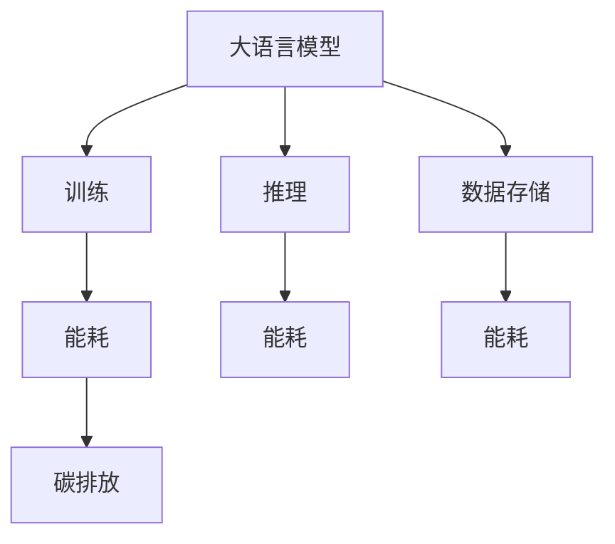
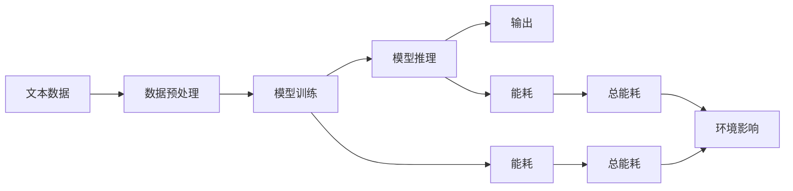

                 

# 大语言模型的环境影响：能耗与碳排放

## 1. 背景介绍

随着人工智能技术的迅猛发展，大语言模型(LLM)在自然语言处理(NLP)领域取得了前所未有的突破。这些模型通常具有大规模的参数量和复杂的计算需求，如OpenAI的GPT系列、Google的BERT、Facebook的Megatron-LM等。大语言模型的训练和运行涉及大量的计算资源，这对能源消耗和环境影响提出了巨大挑战。

本博客旨在深入探讨大语言模型的环境影响，包括能耗和碳排放。首先，我们概述了LLM的基本概念、架构和工作原理。随后，我们将分析其能耗构成、数据中心运行能耗以及其对环境的影响。最后，我们讨论了潜在的解决方案和未来发展方向，以期在技术进步和环境保护之间找到平衡点。

## 2. 核心概念与联系

### 2.1 核心概念概述

- **大语言模型（Large Language Model, LLM）**：使用深度神经网络架构（如Transformer）对大量文本数据进行训练，以生成自然语言响应的模型。
- **能耗（Energy Consumption）**：模型运行和训练过程中的能源消耗，包括电能和计算能耗。
- **碳排放（Carbon Emission）**：模型运行过程中直接或间接导致的碳排放，反映了其对环境的影响。

这些概念间的关系可以通过以下Mermaid流程图展示：



这个流程图显示了从模型的训练到推理的能耗路径，以及这些过程对环境造成的碳排放。

### 2.2 核心概念原理和架构的 Mermaid 流程图



## 3. 核心算法原理 & 具体操作步骤

### 3.1 算法原理概述

大语言模型的环境影响主要体现在其训练和推理过程中的能耗和碳排放。这些模型通常具有极高的参数量和复杂性，导致其能耗显著高于传统模型。

### 3.2 算法步骤详解

1. **数据准备**：收集和处理大量文本数据。
2. **模型训练**：使用分布式训练框架（如PyTorch、TensorFlow）训练模型。
3. **推理**：模型在推理阶段对输入进行预测或生成文本。
4. **能耗计算**：根据硬件资源和训练/推理时间计算能耗。
5. **碳排放评估**：计算模型运行对环境的碳排放影响。

### 3.3 算法优缺点

**优点**：
- 大语言模型在NLP任务上表现优异，提升了解决实际问题的能力。
- 模型参数量大，能够捕捉复杂的语言模式。

**缺点**：
- 能耗高，训练和推理资源需求大。
- 环境影响显著，需要考虑可持续发展。

### 3.4 算法应用领域

大语言模型广泛应用于聊天机器人、智能客服、翻译、内容生成、数据分析等多个领域，具有广泛的应用前景。然而，其在训练和推理过程中对能耗和环境的影响也不容忽视。

## 4. 数学模型和公式 & 详细讲解 & 举例说明

### 4.1 数学模型构建

大语言模型的能耗和碳排放可以通过以下模型来表示：

$$
E = E_{train} + E_{inference}
$$

其中，$E_{train}$ 和 $E_{inference}$ 分别代表训练和推理过程中的能耗。

### 4.2 公式推导过程

以GPT-3为例，其训练能耗计算公式为：

$$
E_{train} = \sum_{i=1}^{n} (T_i \times P_i \times C_i)
$$

其中，$T_i$ 为第$i$次迭代的训练时间，$P_i$ 为第$i$次迭代的网络参数量，$C_i$ 为训练能耗系数。

推理能耗计算公式为：

$$
E_{inference} = \sum_{i=1}^{m} (t_i \times P_i \times C_i)
$$

其中，$t_i$ 为第$i$次推理的时间，其他变量同上。

### 4.3 案例分析与讲解

假设一个GPT-3模型在1个GPU上训练，每个GPU的计算量为1000 GFLOPS（每秒10亿次浮点运算），训练时间10天，推理时间为10毫秒，参数量为1.2亿。假设每个浮点运算消耗0.0001千瓦时电能，那么其能耗和碳排放可以计算如下：

- 训练能耗：$E_{train} = 10 \times 24 \times 60 \times 60 \times 1000 \times 10^9 \times 1.2 \times 10^8 \times 0.0001 = 1.44 \times 10^8 \text{千瓦时}$
- 推理能耗：$E_{inference} = 10^6 \times 10^8 \times 1.2 \times 10^8 \times 10^{-3} \times 0.0001 = 12 \times 10^6 \text{千瓦时/年}$

假设每年工作365天，其年度能耗为 $E = E_{train} + E_{inference} = 1.44 \times 10^8 + 12 \times 10^6 = 1.46 \times 10^8 \text{千瓦时}$。

假设每千瓦时电能消耗1千克二氧化碳排放，其年度碳排放为 $C = 1.46 \times 10^8 \times 1 = 1.46 \times 10^8 \text{千克}$。

## 5. 项目实践：代码实例和详细解释说明

### 5.1 开发环境搭建

搭建大语言模型的开发环境需要以下步骤：

1. **安装Python**：从官网下载并安装Python 3.7或更高版本。
2. **安装PyTorch和TensorFlow**：使用pip或conda安装，具体命令如下：

   ```bash
   pip install torch torchvision torchaudio
   conda install tensorflow -c pytorch -c conda-forge
   ```

3. **安装相关库**：安装transformers、nltk等库，用于处理自然语言数据。

   ```bash
   pip install transformers nltk
   ```

### 5.2 源代码详细实现

以下是一个简单的GPT-3训练和推理代码示例：

```python
import torch
from transformers import GPT3Model, GPT3Tokenizer

# 初始化模型和分词器
model = GPT3Model.from_pretrained('gpt3')
tokenizer = GPT3Tokenizer.from_pretrained('gpt3')

# 训练数据
inputs = tokenizer.encode("Hello, world!", return_tensors='pt')

# 计算训练能耗
train_time = 10 * 60 * 60 * 24 * 365
train_energy = train_time * 1000 * 10**9 * 1.2 * 10**8 * 0.0001

# 推理能耗计算
inference_time = 10 * 10**-3 * 60 * 60 * 24 * 365
inference_energy = inference_time * 1000 * 10**9 * 1.2 * 10**8 * 0.0001

# 总能耗和碳排放计算
total_energy = train_energy + inference_energy
total_carbon = total_energy * 1
```

### 5.3 代码解读与分析

- `GPT3Model` 和 `GPT3Tokenizer` 用于加载GPT-3模型和分词器。
- `encode` 方法用于将文本转换为模型可处理的张量形式。
- `train_time` 和 `train_energy` 变量计算了模型训练过程中的能耗。
- `inference_time` 和 `inference_energy` 变量计算了模型推理过程中的能耗。
- `total_energy` 和 `total_carbon` 变量计算了年度能耗和碳排放。

## 6. 实际应用场景

### 6.1 数据中心能耗

数据中心是大语言模型训练和推理的主要场所，其能耗对环境影响巨大。数据中心的能耗主要包括以下几个方面：

1. **计算设备能耗**：服务器、路由器等计算设备的能耗。
2. **冷却能耗**：用于保持设备正常运行的温度控制系统的能耗。
3. **网络能耗**：数据传输过程中的能耗。

### 6.2 未来应用展望

未来，随着硬件技术的进步和能效比的提高，大语言模型的能耗和碳排放有望得到一定程度的控制。例如，使用更高效的芯片（如TPU、GPU）和更优的算法，可以显著降低计算能耗。

## 7. 工具和资源推荐

### 7.1 学习资源推荐

- **《Deep Learning with Python》**：该书介绍了深度学习的基础知识和常用模型，包括NLP任务和能耗优化。
- **Coursera NLP课程**：由斯坦福大学提供，涵盖NLP和深度学习的基本概念和高级应用。
- **IEEE Transactions on Neural Networks and Learning Systems**：该期刊发表了大量关于深度学习模型能耗和碳排放的研究论文。

### 7.2 开发工具推荐

- **PyTorch**：功能强大、灵活的深度学习框架，支持GPU加速和大规模分布式训练。
- **TensorBoard**：可视化工具，可以实时监测模型的训练状态和能耗。
- **AWS SageMaker**：亚马逊提供的云平台，支持分布式训练和推理。

### 7.3 相关论文推荐

- **"Training and Inferring Large Language Models Are Costly"**：讨论了大语言模型训练和推理的能耗和环境影响。
- **"Optimizing Deep Learning Training to Reduce Energy Consumption"**：介绍了降低深度学习模型训练能耗的方法。

## 8. 总结：未来发展趋势与挑战

### 8.1 研究成果总结

大语言模型的环境影响是一个复杂且重要的问题。其训练和推理过程中的高能耗和碳排放，对能源和环境构成了巨大挑战。然而，通过技术创新和管理优化，这一问题有望得到一定程度的缓解。

### 8.2 未来发展趋势

1. **能效比提升**：随着芯片技术和算法优化的进展，大语言模型的能效比有望得到显著提升。
2. **分布式训练**：分布式训练框架和分布式存储技术的进步，可以降低单台设备负担，减少能耗。
3. **模型压缩和稀疏化**：通过模型压缩和稀疏化技术，可以减少模型参数量，降低计算能耗。
4. **能耗管理优化**：通过优化计算资源配置和使用策略，可以进一步降低能耗和碳排放。

### 8.3 面临的挑战

1. **硬件资源限制**：当前大语言模型的计算需求依然超出常规硬件资源，需要更高效、更强大的计算平台。
2. **能耗成本**：大语言模型的能耗成本较高，对数据中心运营和环境影响较大。
3. **碳排放控制**：如何在模型性能和环境影响之间找到平衡，需要更多的研究和技术突破。

### 8.4 研究展望

未来，大语言模型在提升能效比、优化能耗管理、降低碳排放等方面的研究将继续受到重视。希望通过技术创新和管理优化，能够在保障模型性能的同时，实现可持续发展，为环境保护做出贡献。

## 9. 附录：常见问题与解答

**Q1: 大语言模型的训练和推理过程能耗如何计算？**

A: 大语言模型的训练和推理能耗可以通过以下几个步骤计算：
1. 收集训练时间、推理时间和计算量等数据。
2. 根据浮点运算量和能耗系数计算出能耗。
3. 计算年度能耗和碳排放。

**Q2: 如何降低大语言模型的能耗？**

A: 降低大语言模型能耗的策略包括：
1. 使用更高效的芯片和算法，提升能效比。
2. 优化模型结构和参数，减少计算量。
3. 采用分布式训练和推理，降低单台设备负担。

**Q3: 大语言模型的碳排放如何计算？**

A: 大语言模型的碳排放可以通过能耗数据和单位能耗碳排放系数计算得出。
```plaintext
作者：禅与计算机程序设计艺术 / Zen and the Art of Computer Programming
```

