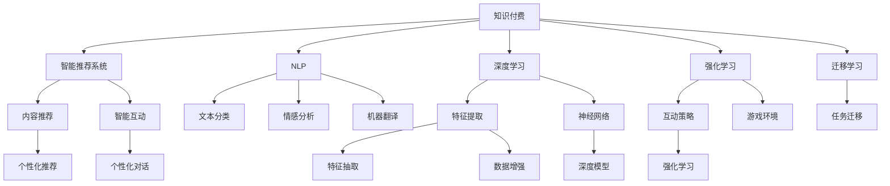

                 

## 1. 背景介绍

### 1.1 问题由来

在知识付费时代，内容生产者通过高质量课程、文章、讲座等方式向用户传递知识，而用户则通过订阅、购买等形式支付费用以获得知识服务。尽管知识付费市场发展迅速，但用户流失率仍然居高不下，用户体验和知识付费效率有待进一步提升。因此，如何利用AI技术优化内容推荐、智能互动、用户画像分析等环节，以提升知识付费的效率和效果，成为当前亟待解决的问题。

### 1.2 问题核心关键点

- 内容推荐：如何根据用户兴趣和行为，推荐高质量、相关性强的内容，提高用户满意度和黏性。
- 智能互动：如何利用AI技术，实现智能问答、个性化对话等互动功能，提升用户学习体验。
- 用户画像分析：如何通过AI技术，挖掘用户特征和需求，进行精准营销和个性化服务。
- 学习效果评估：如何构建学习效果评估模型，量化用户学习效果，优化课程设计和教学方法。

### 1.3 问题研究意义

通过AI技术提升知识付费效率，不仅能降低内容生产者的成本，提高其收益，还能提升用户的学习体验和满意度，扩大知识付费市场规模，推动教育行业的数字化转型。此外，AI技术还可以帮助内容生产者更好地把握用户需求，实现内容优化和个性化推荐，为内容生产者提供数据驱动的决策支持。

## 2. 核心概念与联系

### 2.1 核心概念概述

为更好地理解AI技术在知识付费中的应用，本节将介绍几个密切相关的核心概念：

- 知识付费：通过付费机制获取高价值知识内容的服务方式，广泛应用于在线教育、专业培训等领域。
- 智能推荐系统：通过AI算法，根据用户兴趣和行为，推荐个性化内容，提升用户体验和内容满意度。
- 自然语言处理(NLP)：利用AI技术，实现文本的自动化处理和理解，如文本分类、情感分析、机器翻译等。
- 深度学习：基于神经网络的机器学习技术，通过数据驱动的方法，提升算法模型的表达能力和泛化能力。
- 强化学习(RL)：通过与环境的交互，学习最优策略以最大化长期收益，广泛应用于智能推荐和个性化服务。
- 迁移学习：将在一个任务中学到的知识，迁移到另一个相关任务上，以降低训练成本和提升性能。

这些核心概念之间的逻辑关系可以通过以下Mermaid流程图来展示：



这个流程图展示了知识付费与各个AI技术之间的联系：

1. 知识付费通过智能推荐系统和自然语言处理技术，实现个性化内容推荐和互动。
2. 深度学习用于特征提取和模型训练，提升推荐的准确性和互动的智能性。
3. 强化学习用于优化互动策略，提高用户体验。
4. 迁移学习用于任务间的知识迁移，降低新任务训练成本。

这些概念共同构成了知识付费中AI技术的应用框架，使其能够通过技术手段提升用户效率和满意度。

## 3. 核心算法原理 & 具体操作步骤
### 3.1 算法原理概述

AI技术在知识付费中的应用，主要集中在以下几个方面：

- **智能推荐系统**：通过分析用户的历史行为和兴趣，推荐相关内容，提升用户体验。
- **智能互动**：利用NLP技术，实现智能问答、个性化对话等功能，增强用户互动性。
- **用户画像分析**：通过构建用户画像，实现精准营销和个性化服务。
- **学习效果评估**：构建学习效果评估模型，量化用户学习效果，优化课程设计。

这些应用范式通常基于数据驱动的AI算法，以提升知识付费的效率和效果。

### 3.2 算法步骤详解

基于AI的知识付费系统构建一般包括以下几个关键步骤：

**Step 1: 数据采集与预处理**
- 收集用户历史行为数据，如浏览记录、购买记录、评分反馈等。
- 对数据进行清洗和预处理，包括缺失值填补、异常值处理、特征提取等。

**Step 2: 用户画像构建**
- 利用聚类、降维等技术，对用户进行分类，构建用户画像。
- 分析用户画像，提取用户特征和兴趣偏好。

**Step 3: 内容推荐模型训练**
- 根据用户画像和内容特征，选择合适的推荐算法，如协同过滤、基于内容的推荐、深度学习等。
- 使用历史交互数据进行模型训练，优化推荐效果。

**Step 4: 智能互动功能开发**
- 构建智能问答系统，利用NLP技术解析用户问题，并提供准确的回答。
- 开发个性化对话系统，根据用户历史行为和兴趣，生成个性化的互动内容。

**Step 5: 学习效果评估模型建立**
- 设计评估指标，如学习进度、考试成绩、知识掌握度等。
- 构建评估模型，量化用户学习效果，反馈给用户和内容生产者。

**Step 6: 系统集成与部署**
- 将推荐、互动、评估等功能集成到知识付费平台上。
- 部署系统到生产环境，监控系统性能，不断优化和迭代。

### 3.3 算法优缺点

基于AI的知识付费系统具有以下优点：
1. 提升用户体验：通过个性化推荐和互动，提升用户满意度和学习效果。
2. 降低运营成本：通过智能推荐和内容优化，减少用户流失率，降低运营成本。
3. 精准营销：通过用户画像分析，实现精准营销和个性化服务。
4. 优化课程设计：通过学习效果评估，量化用户学习效果，优化课程设计。

同时，该系统也存在一些局限性：
1. 数据依赖性强：依赖高质量用户数据，数据采集和预处理成本高。
2. 推荐算法复杂：推荐算法模型复杂，需要大量的训练数据和计算资源。
3. 动态性不足：推荐和互动系统依赖历史数据，无法实时响应用户行为变化。
4. 隐私问题：用户行为数据涉及隐私保护，需要严格遵守相关法律法规。
5. 算法透明性差：推荐算法和互动系统的逻辑复杂，难以解释其决策过程。

尽管存在这些局限性，基于AI的知识付费系统仍然是提升知识付费效率的重要手段。未来研究应聚焦于如何降低数据依赖性、提高算法透明性和动态性，同时兼顾隐私保护和法规合规。

### 3.4 算法应用领域

基于AI的知识付费系统在多个领域得到了应用，例如：

- 在线教育平台：如Coursera、Udacity等，通过推荐系统推荐课程和内容，提升用户学习体验。
- 专业培训课程：如技能培训、语言学习等，利用智能问答和个性化对话，增强用户互动性。
- 知识社区：如知乎、豆瓣等，通过用户画像分析，推荐相关话题和内容，提升社区活跃度。
- 智能咨询平台：如智能客服、智能诊断等，利用NLP技术解析用户问题，提供高效服务。
- 个性化阅读平台：如Kindle、多看等，通过推荐算法，为用户推荐相关书籍和文章。

## 4. 数学模型和公式 & 详细讲解 & 举例说明

### 4.1 数学模型构建

本节将使用数学语言对AI技术在知识付费中的应用进行更加严格的刻画。

假设用户历史行为数据为 $\{(x_i, y_i)\}_{i=1}^N$，其中 $x_i$ 为行为特征，如浏览时间、点击次数等，$y_i$ 为行为标签，如是否购买、是否点赞等。

定义用户画像为 $U$，内容特征为 $C$，推荐模型为 $M$。用户画像 $U$ 和内容特征 $C$ 在特征空间中的表示分别为 $u$ 和 $c$。

推荐模型的目标是找到最优的推荐策略 $f(u, c)$，使得推荐系统输出的内容 $f(u, c)$ 与用户兴趣 $y$ 最大化相关性。

### 4.2 公式推导过程

推荐系统的目标函数可以表示为：

$$
\max_{f} \mathbb{E}_{(x,y)}[\log P(y|f(x))]
$$

其中 $P(y|f(x))$ 为模型输出的概率分布，$\mathbb{E}_{(x,y)}[\log P(y|f(x))]$ 为期望值，表示推荐系统输出的内容与用户兴趣的相关性。

常用的推荐算法包括：

- 协同过滤：通过用户间的相似度，推荐用户感兴趣的内容。
- 基于内容的推荐：根据内容的特征，推荐与用户兴趣匹配度高的内容。
- 深度学习推荐：利用神经网络模型，学习用户和内容之间的隐式关联。

以深度学习推荐为例，推荐模型的构建过程可以表示为：

1. 特征提取：通过神经网络模型 $f$ 将用户画像 $u$ 和内容特征 $c$ 映射到隐层表示 $z$。

$$
z = f(u, c)
$$

2. 隐层表示的拼接：将用户画像 $u$ 和内容特征 $c$ 的隐层表示 $z_u$ 和 $z_c$ 拼接，得到综合表示 $z_{u,c}$。

$$
z_{u,c} = \text{Concat}(z_u, z_c)
$$

3. 输出层计算：通过全连接层将综合表示 $z_{u,c}$ 映射到内容特征 $c$ 的表示 $z_c'$，计算推荐内容的概率分布 $P(c|z_{u,c})$。

$$
z_c' = \text{FC}(z_{u,c})
$$

$$
P(c|z_{u,c}) = \text{Softmax}(z_c')
$$

4. 推荐内容：根据概率分布 $P(c|z_{u,c})$，选择概率最大的内容进行推荐。

$$
\hat{c} = \arg\max_{c} P(c|z_{u,c})
$$

通过上述过程，推荐模型可以根据用户画像和内容特征，输出相关性高的内容，实现个性化推荐。

### 4.3 案例分析与讲解

以推荐系统中的协同过滤算法为例，说明其原理和实现。

协同过滤算法通过分析用户之间的相似度，推荐用户感兴趣的内容。其核心思想是：与用户 $u$ 兴趣相似的用户 $v$ 喜欢的内容，用户 $u$ 也很可能喜欢。

具体实现步骤如下：

1. 计算用户 $u$ 和用户 $v$ 的相似度：

$$
\text{similarity}(u, v) = \cos(\theta) = \frac{u \cdot v}{\|u\|\|v\|}
$$

其中 $\theta$ 为余弦相似度，$u$ 和 $v$ 为用户行为向量。

2. 根据相似度计算用户 $u$ 的邻居用户 $v$：

$$
v_{near} = \{v | \text{similarity}(u, v) > \epsilon\}
$$

其中 $\epsilon$ 为相似度阈值，用于过滤噪声用户。

3. 计算邻居用户 $v$ 喜欢的内容，作为用户 $u$ 的候选推荐内容：

$$
C_{u} = \{c | v_{near} \rightarrow c\}
$$

4. 根据用户 $u$ 的历史行为，计算候选内容的相关性，选择相关性高的内容进行推荐。

$$
R_u = \arg\max_{c} (\sum_{v_{near} \in V_u} P(c|v_{near}))
$$

其中 $V_u$ 为用户 $u$ 的邻居用户集合。

通过上述过程，协同过滤算法可以根据用户行为数据，实现个性化推荐。

## 5. 项目实践：代码实例和详细解释说明

### 5.1 开发环境搭建

在进行AI技术在知识付费中的应用实践前，我们需要准备好开发环境。以下是使用Python进行PyTorch开发的环境配置流程：

1. 安装Anaconda：从官网下载并安装Anaconda，用于创建独立的Python环境。

2. 创建并激活虚拟环境：
```bash
conda create -n ai-env python=3.8 
conda activate ai-env
```

3. 安装PyTorch：根据CUDA版本，从官网获取对应的安装命令。例如：
```bash
conda install pytorch torchvision torchaudio cudatoolkit=11.1 -c pytorch -c conda-forge
```

4. 安装相关库：
```bash
pip install pandas numpy scikit-learn joblib tqdm
```

5. 安装PyTorch-lightning：
```bash
pip install pytorch-lightning
```

6. 安装NLP库：
```bash
pip install spacy transformers sentence-transformers
```

完成上述步骤后，即可在`ai-env`环境中开始项目开发。

### 5.2 源代码详细实现

下面我们以推荐系统中的协同过滤算法为例，给出使用PyTorch实现协同过滤算法的代码。

```python
import torch
import torch.nn as nn
from torch.utils.data import Dataset, DataLoader
from torch.nn.functional import cosine_similarity

class UserBehaviorDataset(Dataset):
    def __init__(self, user behaviors, user similarities):
        self.user_behaviors = user behaviors
        self.user_similarities = user similarities

    def __len__(self):
        return len(self.user_behaviors)

    def __getitem__(self, idx):
        user_behavior = self.user_behaviors[idx]
        user_similarity = self.user_similarities[idx]
        return user_behavior, user_similarity

class CollaborativeFiltering(nn.Module):
    def __init__(self, user_num, feature_dim):
        super(CollaborativeFiltering, self).__init__()
        self.user_embeddings = nn.Embedding(user_num, feature_dim)
        self.item_embeddings = nn.Embedding(item_num, feature_dim)

    def forward(self, user_behaviors, user_similarities):
        user_embeddings = self.user_embeddings(user_behaviors)
        item_embeddings = self.item_embeddings(item_ids)
        user_item_similarities = cosine_similarity(user_embeddings, item_embeddings)
        recommender_scores = user_item_similarities @ user_similarities
        return recommender_scores
```

在上述代码中，我们首先定义了`UserBehaviorDataset`类，用于存储用户行为数据和相似度数据。然后，定义了`CollaborativeFiltering`类，实现协同过滤算法。

在`CollaborativeFiltering`类中，我们首先定义了用户嵌入和物品嵌入，用于将用户行为和物品表示为向量。然后，通过计算余弦相似度，得到用户-物品相似度矩阵。最后，通过相似度矩阵和用户相似度矩阵的矩阵乘法，得到每个物品对每个用户的推荐得分。

### 5.3 代码解读与分析

让我们再详细解读一下关键代码的实现细节：

**UserBehaviorDataset类**：
- `__init__`方法：初始化用户行为数据和相似度数据。
- `__len__`方法：返回数据集长度。
- `__getitem__`方法：返回指定索引的用户行为和相似度数据。

**CollaborativeFiltering类**：
- `__init__`方法：初始化用户嵌入和物品嵌入。
- `forward`方法：前向传播计算推荐得分。

**推荐算法**：
- 通过用户嵌入和物品嵌入，将用户行为和物品表示为向量。
- 计算用户-物品余弦相似度矩阵。
- 计算每个物品对每个用户的推荐得分，得到推荐结果。

## 6. 实际应用场景

### 6.1 智能教育平台

智能教育平台通过推荐系统，向用户推荐适合的学习内容和课程，提升学习效果。智能教育平台通常会收集用户的学习记录、考试成绩、互动数据等，构建用户画像，利用推荐系统为用户推荐个性化课程和学习资源。

以Coursera为例，通过推荐系统，Coursera可以根据用户的学习历史和兴趣，推荐相关课程和资源，提升用户的学习体验和满意度。同时，Coursera还利用智能问答系统，帮助用户解答学习中的疑问，提升学习效果。

### 6.2 专业培训平台

专业培训平台通过智能推荐和互动功能，提升培训效果。专业培训平台通常会收集用户的培训记录、测评成绩、反馈数据等，构建用户画像，利用推荐系统为用户推荐相关培训课程和资源。同时，平台还利用智能问答和个性化对话，增强培训互动性，提升培训效果。

以Udacity为例，通过推荐系统，Udacity可以根据用户的培训记录和兴趣，推荐相关课程和资源，提升培训效果。同时，Udacity还利用智能问答和个性化对话，帮助用户解答培训中的疑问，提升培训体验。

### 6.3 知识社区平台

知识社区平台通过推荐系统，提升社区活跃度。知识社区平台通常会收集用户的浏览记录、点赞数据、评论数据等，构建用户画像，利用推荐系统为用户推荐相关话题和内容，提升社区活跃度。

以知乎为例，通过推荐系统，知乎可以根据用户的浏览记录和兴趣，推荐相关话题和内容，提升社区活跃度。同时，知乎还利用智能问答和个性化对话，增强社区互动性，提升社区体验。

### 6.4 未来应用展望

随着AI技术的不断进步，基于AI的知识付费系统将在更多领域得到应用，为内容生产者和用户提供更高效、更个性化的服务。

在智慧医疗领域，基于AI的知识付费系统可以帮助医生推荐相关医学文献和课程，提升医生学习效果。在智能家居领域，基于AI的知识付费系统可以帮助用户推荐智能家居产品和技术，提升用户生活体验。在智慧旅游领域，基于AI的知识付费系统可以帮助用户推荐旅游目的地和行程，提升用户旅游体验。

未来，基于AI的知识付费系统还将与其他AI技术进行更深入的融合，如因果推理、强化学习等，推动NLP技术在垂直行业的落地应用。同时，AI技术也将不断优化推荐系统、互动系统和学习效果评估模型，为内容生产者和用户提供更精准、更智能的知识付费体验。

## 7. 工具和资源推荐

### 7.1 学习资源推荐

为了帮助开发者系统掌握AI技术在知识付费中的应用，这里推荐一些优质的学习资源：

1. 《推荐系统实战》系列博文：由AI专家撰写，深入浅出地介绍了推荐系统的原理和实现。

2. 《深度学习》课程：斯坦福大学开设的深度学习课程，有Lecture视频和配套作业，带你入门深度学习的基本概念和经典模型。

3. 《自然语言处理与深度学习》书籍：结合NLP和深度学习的理论，详细介绍了NLP和深度学习在推荐系统中的应用。

4. Coursera和edX的在线课程：提供丰富的深度学习、推荐系统、NLP等课程资源，涵盖从入门到进阶的内容。

5. Kaggle竞赛：参加推荐系统、NLP等领域的Kaggle竞赛，积累实践经验和提高算法水平。

通过对这些资源的学习实践，相信你一定能够快速掌握AI技术在知识付费中的应用，并用于解决实际的NLP问题。

### 7.2 开发工具推荐

高效的开发离不开优秀的工具支持。以下是几款用于AI技术在知识付费中应用开发的常用工具：

1. PyTorch：基于Python的开源深度学习框架，灵活动态的计算图，适合快速迭代研究。

2. TensorFlow：由Google主导开发的开源深度学习框架，生产部署方便，适合大规模工程应用。

3. PyTorch-lightning：基于PyTorch的深度学习框架，提供便捷的模型训练和评估工具，适合快速开发和迭代。

4. Weights & Biases：模型训练的实验跟踪工具，可以记录和可视化模型训练过程中的各项指标，方便对比和调优。

5. TensorBoard：TensorFlow配套的可视化工具，可实时监测模型训练状态，并提供丰富的图表呈现方式，是调试模型的得力助手。

6. HuggingFace Transformers库：提供了大量的预训练语言模型，支持深度学习推荐、智能问答等任务。

合理利用这些工具，可以显著提升AI技术在知识付费中应用的开发效率，加快创新迭代的步伐。

### 7.3 相关论文推荐

AI技术在知识付费中的应用源于学界的持续研究。以下是几篇奠基性的相关论文，推荐阅读：

1. Matrix Factorization Techniques for Recommender Systems：介绍了矩阵分解方法在推荐系统中的应用。

2. CNN-Based Recommender Systems：介绍了卷积神经网络在推荐系统中的应用。

3. Attention-Based Recommender Systems：介绍了注意力机制在推荐系统中的应用。

4. SVM-based Recommender Systems：介绍了支持向量机在推荐系统中的应用。

5. Deep Learning for Recommender Systems：介绍了深度学习在推荐系统中的应用。

这些论文代表了大规模语言模型微调技术的发展脉络。通过学习这些前沿成果，可以帮助研究者把握学科前进方向，激发更多的创新灵感。

## 8. 总结：未来发展趋势与挑战

### 8.1 总结

本文对AI技术在知识付费中的应用进行了全面系统的介绍。首先阐述了知识付费的现状和问题，明确了AI技术在知识付费中的应用潜力。其次，从原理到实践，详细讲解了智能推荐系统、智能互动、用户画像分析等核心算法，给出了AI技术在知识付费中的实际应用代码实现。同时，本文还探讨了AI技术在知识付费中应用的实际应用场景和未来发展趋势。

通过本文的系统梳理，可以看到，AI技术在知识付费中的应用有着广阔的前景，能够显著提升用户的学习效果和体验。未来，随着AI技术的不断进步，基于AI的知识付费系统将在更多领域得到应用，为内容生产者和用户提供更高效、更个性化的服务。

### 8.2 未来发展趋势

展望未来，AI技术在知识付费中的应用将呈现以下几个发展趋势：

1. 推荐系统更加智能化：基于深度学习、强化学习等技术，推荐系统将更加智能，能够实时响应用户行为变化，提供个性化推荐。

2. 智能互动更加自然：利用NLP技术，智能问答和个性化对话将更加自然，提升用户互动体验。

3. 用户画像更加精准：通过多模态数据融合和因果推理，用户画像将更加全面和精准，提升推荐和互动的个性化水平。

4. 学习效果更加量化：构建更加科学的评估模型，量化用户学习效果，优化课程设计和教学方法。

5. 跨领域融合更加深入：将AI技术与更多领域进行融合，如医疗、金融、旅游等，拓展知识付费系统的应用范围。

6. 数据驱动更加广泛：构建更广泛的数据采集和处理体系，提升数据质量和多样性，提升AI技术的应用效果。

以上趋势凸显了AI技术在知识付费中的强大潜力和广阔前景。这些方向的探索发展，必将进一步提升知识付费系统的性能和效果，推动教育行业的数字化转型。

### 8.3 面临的挑战

尽管AI技术在知识付费中的应用取得了一定的成效，但在迈向更加智能化、普适化应用的过程中，仍面临诸多挑战：

1. 数据隐私保护：用户数据涉及隐私保护，需要严格遵守相关法律法规。如何在保护用户隐私的同时，充分利用数据进行推荐和互动，是一个重要的研究方向。

2. 算法透明性和可解释性：推荐和互动系统的逻辑复杂，难以解释其决策过程。如何提高算法的透明性和可解释性，是提升用户信任度的关键。

3. 冷启动问题：对于新用户和新内容，推荐系统难以快速找到相关匹配。如何解决冷启动问题，是提升推荐系统效率和效果的难题。

4. 动态性不足：推荐和互动系统依赖历史数据，无法实时响应用户行为变化。如何在数据动态变化的情况下，保持系统的性能和效果，是一个重要挑战。

5. 效果评估：如何构建科学的评估模型，量化用户学习效果，优化课程设计和教学方法，是一个亟待解决的问题。

6. 跨平台集成：知识付费平台通常涉及多个平台和系统，如何实现跨平台的数据和功能集成，是一个复杂的技术挑战。

正视AI技术在知识付费中面临的这些挑战，积极应对并寻求突破，将是大规模语言模型微调技术走向成熟的必由之路。相信随着学界和产业界的共同努力，这些挑战终将一一被克服，基于AI的知识付费系统必将在构建人机协同的智能时代中扮演越来越重要的角色。

### 8.4 未来突破

面对AI技术在知识付费中面临的挑战，未来的研究需要在以下几个方面寻求新的突破：

1. 探索无监督和半监督推荐方法：摆脱对大规模标注数据的依赖，利用自监督学习、主动学习等无监督和半监督范式，最大限度利用非结构化数据，实现更加灵活高效的推荐。

2. 研究参数高效和计算高效的推荐算法：开发更加参数高效的推荐算法，在固定大部分预训练参数的同时，只更新极少量的任务相关参数。同时优化推荐系统的计算图，减少前向传播和反向传播的资源消耗，实现更加轻量级、实时性的部署。

3. 引入更多先验知识：将符号化的先验知识，如知识图谱、逻辑规则等，与神经网络模型进行巧妙融合，引导推荐过程学习更准确、合理的推荐模型。同时加强不同模态数据的整合，实现视觉、语音等多模态信息与文本信息的协同建模。

4. 结合因果分析和博弈论工具：将因果分析方法引入推荐模型，识别出模型决策的关键特征，增强推荐系统的因果性和逻辑性。借助博弈论工具刻画人机交互过程，主动探索并规避推荐模型的脆弱点，提高系统稳定性。

5. 纳入伦理道德约束：在推荐模型训练目标中引入伦理导向的评估指标，过滤和惩罚有偏见、有害的输出倾向。同时加强人工干预和审核，建立推荐模型的监管机制，确保输出的安全性。

这些研究方向的探索，必将引领AI技术在知识付费中应用的不断进步，为内容生产者和用户提供更精准、更智能的知识付费体验。面向未来，AI技术还需要与其他人工智能技术进行更深入的融合，如知识表示、因果推理、强化学习等，多路径协同发力，共同推动NLP技术在垂直行业的落地应用。只有勇于创新、敢于突破，才能不断拓展语言模型的边界，让智能技术更好地造福人类社会。

## 9. 附录：常见问题与解答

**Q1：如何构建用户画像？**

A: 构建用户画像通常包括以下步骤：
1. 收集用户历史行为数据，如浏览记录、购买记录、评分反馈等。
2. 对数据进行清洗和预处理，包括缺失值填补、异常值处理、特征提取等。
3. 通过聚类、降维等技术，对用户进行分类，构建用户画像。
4. 分析用户画像，提取用户特征和兴趣偏好。

**Q2：如何优化推荐系统的性能？**

A: 优化推荐系统通常需要从以下几个方面入手：
1. 数据采集和预处理：保证数据的质量和多样性，提升推荐效果。
2. 特征工程：提取和构建有意义的特征，提升模型表达能力。
3. 算法选择和优化：选择合适的推荐算法，优化算法参数，提升推荐效果。
4. 模型评估和调优：构建科学的评估模型，量化用户学习效果，优化推荐策略。

**Q3：如何提高推荐系统的动态性？**

A: 提高推荐系统的动态性通常需要从以下几个方面入手：
1. 实时数据更新：构建实时数据采集和更新机制，保证推荐系统能够实时响应用户行为变化。
2. 在线学习：利用在线学习算法，实时更新模型参数，保持推荐系统的高效性。
3. 分布式计算：构建分布式计算框架，实现并行计算，提升推荐系统的计算能力。

**Q4：如何保障用户隐私？**

A: 保障用户隐私通常需要从以下几个方面入手：
1. 数据匿名化：对用户数据进行匿名化处理，保护用户隐私。
2. 数据加密：对用户数据进行加密处理，防止数据泄露。
3. 数据访问控制：对用户数据进行访问控制，防止未经授权的数据访问。
4. 法规合规：遵守相关法律法规，保护用户隐私权益。

**Q5：如何构建学习效果评估模型？**

A: 构建学习效果评估模型通常需要从以下几个方面入手：
1. 定义评估指标：如学习进度、考试成绩、知识掌握度等。
2. 数据采集和处理：收集用户学习数据，进行处理和分析。
3. 模型构建和训练：构建评估模型，利用用户学习数据进行训练。
4. 模型评估和优化：评估模型性能，优化模型参数，提升评估效果。

通过对这些问题的解答，相信你一定能够更好地理解AI技术在知识付费中的应用，并用于解决实际的NLP问题。

---

作者：禅与计算机程序设计艺术 / Zen and the Art of Computer Programming

