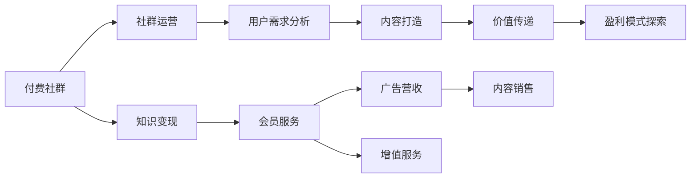

                 

# 如何利用付费社群模式进行知识变现

> 关键词：付费社群,知识变现,社区建设,运营策略,盈利模式,用户需求,内容打造,价值传递

## 1. 背景介绍

### 1.1 问题由来
随着互联网的普及和数字化的深入，知识分享和获取的门槛显著降低。各种形式的知识付费平台、在线课程、博客、论坛等，如雨后春笋般涌现，吸引了大量知识工作者和学者的参与。然而，知识变现不仅是一个技术问题，更是一个复杂的商业模式问题。如何高效、可持续地将知识转化为经济效益，成为广大知识创作者和平台运营商亟需解决的问题。

### 1.2 问题核心关键点
本文聚焦于如何利用付费社群模式进行知识变现，主要考虑以下几个关键点：
1. 社群建设：建立高效、活跃的付费社群，吸引用户加入并长期互动。
2. 运营策略：制定科学、合理的社群运营策略，提升用户满意度和留存率。
3. 盈利模式：探索多样化的盈利模式，最大化知识变现潜力。
4. 用户需求：深入理解用户需求，提供符合预期的知识服务。
5. 内容打造：持续打造高质量、有价值的内容，增强用户黏性。
6. 价值传递：有效传递知识价值，让用户感到物有所值。

## 2. 核心概念与联系

### 2.1 核心概念概述

为更好地理解付费社群模式，本节将介绍几个关键概念：

- **付费社群(Paid Community)**：以付费会员制为核心的知识社区，用户需支付一定费用才能进入并享受社群服务。
- **知识变现(Knowledge Monetization)**：通过知识内容创造和传播，实现商业价值的转化，提升创作者的收入。
- **社群运营(Community Management)**：包括用户招募、活跃维护、内容管理、关系维护等环节，确保社群长期稳定发展。
- **盈利模式(Revenue Model)**：如广告收入、会员订阅费、增值服务费、内容销售等，提供社群持续发展的经济保障。
- **用户需求(User Demand)**：社群用户对知识、技能、娱乐、社交等多方面需求的综合体现。
- **内容打造(Content Creation)**：持续创造有深度、有广度、有温度的内容，满足用户的多样化需求。
- **价值传递(Value Communication)**：将社群中的知识、经验、见解有效传递给用户，提升其满意度和忠诚度。

这些概念之间的联系紧密，共同构成了一个高效的知识变现生态系统。理解这些核心概念及其相互关系，有助于构建一个成功的付费社群，实现知识变现。

### 2.2 核心概念原理和架构的 Mermaid 流程图(Mermaid 流程节点中不要有括号、逗号等特殊字符)



## 3. 核心算法原理 & 具体操作步骤
### 3.1 算法原理概述

利用付费社群模式进行知识变现，本质上是一个以用户为中心的社群运营与内容营销过程。其核心思想是：通过高质量的内容吸引用户，借助会员制度和盈利模式，实现知识变现。

形式化地，假设社群中每个用户 $U_i$ 对知识 $K_j$ 的需求度为 $D_{i,j}$，社群运营策略为 $S$，内容打造策略为 $C$，则知识变现的目标可以表示为最大化总价值 $V$：

$$
V = \sum_{i,j} D_{i,j} \cdot (C \cdot S)
$$

其中 $C \cdot S$ 为社群运营策略 $S$ 和内容打造策略 $C$ 的综合效果。

### 3.2 算法步骤详解

基于上述理论框架，以下是构建付费社群进行知识变现的具体操作步骤：

**Step 1: 用户需求分析**
- 通过问卷调查、用户反馈、社交网络分析等方式，了解目标用户群体的兴趣、需求、痛点等。
- 利用数据挖掘和聚类技术，划分不同用户群体，并制定针对性的社群运营策略。

**Step 2: 内容策略设计**
- 根据用户需求分析结果，设计社群内容主题、形式、频次等策略。
- 确定内容创作的团队、资源、工具等，建立内容管理体系。

**Step 3: 社群搭建与运营**
- 设计付费模式，包括会员费、课程订阅、内容付费等，制定价格策略。
- 构建社群平台，整合用户管理、内容发布、互动交流等功能。
- 制定社群规则，包括内容审核、用户行为规范等，营造良好的社区氛围。

**Step 4: 内容发布与推广**
- 根据内容策略，发布高质量、有深度的文章、视频、音频、直播等。
- 利用社交媒体、搜索引擎优化、广告投放等手段，扩大社群内容的传播范围。
- 定期举办线上线下活动，增强用户参与感和社区凝聚力。

**Step 5: 用户反馈与迭代优化**
- 收集用户反馈，评估内容效果和社群运营效果。
- 根据用户需求和反馈，调整和优化内容策略和社群运营策略。
- 持续改进社群产品和服务，提升用户体验和满意度。

**Step 6: 盈利模式探索与实施**
- 根据社群发展情况，探索多样化的盈利模式，如广告收入、内容销售、会员增值服务等。
- 制定具体的盈利策略，确保社群的可持续发展。

### 3.3 算法优缺点

利用付费社群模式进行知识变现具有以下优点：
1. 精准定位用户需求：通过用户需求分析，精准吸引和满足用户需求。
2. 高效内容传播：借助社群平台的传播效果，有效扩大知识影响力。
3. 持续盈利能力：多样的盈利模式，确保社群经济可持续。
4. 品牌效应提升：知名社群品牌，吸引更多高质量用户加入。

同时，该方法也存在一些局限性：
1. 需要持续投入：内容创作、社群运营需要大量资源和时间投入。
2. 用户留存率不稳定：用户流失率高，需持续提升用户黏性。
3. 内容质量影响盈利：内容质量不高，难以吸引更多用户和付费。
4. 运营成本高：平台搭建、用户管理、活动策划等成本较高。
5. 平台竞争激烈：面对众多同类社群平台的竞争，需要制定差异化策略。

尽管存在这些局限性，但付费社群模式在知识变现方面展示了巨大的潜力，为知识创作者和平台运营商提供了有效的商业路径。

### 3.4 算法应用领域

基于付费社群的知识变现方法，已经在教育培训、心理咨询、健康咨询、科技资讯等多个领域得到了广泛应用，并取得了显著的经济效益和社会价值。

- **教育培训**：如Coursera、Udemy等在线教育平台，通过高质量的课程和社群服务，吸引了大量用户付费学习。
- **心理咨询**：如BetterHelp、Talkspace等平台，为用户提供线上咨询和社群支持，解决了心理疾病患者的困境。
- **健康咨询**：如Koach、Fuel Health等，为用户提供健康管理和营养咨询，增强其健康水平和生活质量。
- **科技资讯**：如IEEE Spectrum、Gizmodo等，通过深度报道和互动交流，聚集了大量科技爱好者和从业者。

这些案例展示了付费社群模式在各个垂直领域的成功应用，充分证明了其有效的知识变现潜力。

## 4. 数学模型和公式 & 详细讲解 & 举例说明

### 4.1 数学模型构建

为更准确地量化付费社群的知识变现效果，我们构建如下数学模型：

假设社群中有 $N$ 个用户，每个用户支付的会员费用为 $P_i$，订阅的课程或购买的内容费用为 $C_i$，则社群的总收益 $R$ 可以表示为：

$$
R = \sum_{i=1}^N P_i + \sum_{i=1}^N C_i
$$

社群总价值 $V$ 为：

$$
V = \sum_{i=1}^N U_i \cdot (P_i + C_i)
$$

其中 $U_i$ 为用户对社群的满意度，可通过问卷调查、互动频率等方式量化。

### 4.2 公式推导过程

假设用户的满意度 $U_i$ 与订阅费用 $P_i$、课程费用 $C_i$ 之间存在线性关系，即：

$$
U_i = aP_i + bC_i
$$

其中 $a$ 和 $b$ 为模型参数，通过回归分析等方法估计。则社群总价值 $V$ 可以表示为：

$$
V = \sum_{i=1}^N (aP_i + bC_i) \cdot (P_i + C_i)
$$

### 4.3 案例分析与讲解

以Coursera为例，其知识变现过程可以按照上述模型进行量化：

- **用户需求分析**：通过问卷调查，了解用户对在线课程的需求，确定热门课程主题。
- **内容策略设计**：根据需求分析，设计高质量的课程内容，邀请知名教授和行业专家参与制作。
- **社群搭建与运营**：设计按月付费的会员制度，建立在线课程平台和社群交流系统，制定严格的课程审核和用户行为规范。
- **内容发布与推广**：发布优质课程内容，通过社交媒体、SEO优化等手段广泛传播。
- **用户反馈与迭代优化**：收集用户反馈，改进课程内容和社群运营策略。
- **盈利模式探索与实施**：探索广告收入、课程销售等盈利模式，确保平台的持续发展。

通过上述过程，Coursera实现了以知识变现为核心目标的社群运营，吸引了大量用户付费订阅，取得了显著的经济效益。

## 5. 项目实践：代码实例和详细解释说明
### 5.1 开发环境搭建

进行付费社群项目实践前，我们需要准备好开发环境。以下是使用Python进行Django开发的部署流程：

1. 安装Python：从官网下载并安装Python，确保版本稳定。
2. 安装Django：通过pip安装Django，确保版本为最新版本。
3. 安装相关库：安装Django相关的第三方库，如django-templates、django-generic-views等。
4. 设置开发服务器：通过命令`python manage.py runserver`启动开发服务器，用于调试和测试。

### 5.2 源代码详细实现

下面是使用Django进行付费社群项目开发的代码示例，包括用户管理、内容发布、会员管理、订单处理等功能模块。

**用户管理模块**
```python
from django.contrib.auth.models import User
from django.contrib.auth.forms import UserCreationForm

class UserRegistrationForm(UserCreationForm):
    email = forms.EmailField()

    def save(self, commit=True):
        user = super(UserRegistrationForm, self).save(commit=False)
        user.email = self.cleaned_data['email']
        if commit:
            user.save()
        return user

    def __init__(self, *args, **kwargs):
        super(UserRegistrationForm, self).__init__(*args, **kwargs)
        self.fields['password'].help_text = None
```

**内容发布模块**
```python
from django.contrib.contenttypes.models import ContentType
from django.db import models
from django.contrib.auth.models import User
from django.urls import reverse

class Post(models.Model):
    title = models.CharField(max_length=255)
    content = models.TextField()
    user = models.ForeignKey(User, on_delete=models.CASCADE)
    published_at = models.DateTimeField(auto_now_add=True)

    def __str__(self):
        return self.title

    def get_absolute_url(self):
        return reverse('post_detail', kwargs={'pk': self.pk})
```

**会员管理模块**
```python
class Membership(models.Model):
    user = models.ForeignKey(User, on_delete=models.CASCADE)
    plan = models.CharField(max_length=50)
    subscription_date = models.DateTimeField(auto_now_add=True)
    expiration_date = models.DateTimeField()

    def __str__(self):
        return f"{self.user.username} - {self.plan}"
```

**订单处理模块**
```python
class Order(models.Model):
    user = models.ForeignKey(User, on_delete=models.CASCADE)
    membership = models.ForeignKey(Membership, on_delete=models.CASCADE)
    order_date = models.DateTimeField(auto_now_add=True)
    amount = models.DecimalField(max_digits=10, decimal_places=2)

    def __str__(self):
        return f"{self.user.username} - {self.order_date} - ${self.amount}"
```

**会员支付模块**
```python
def pay_membership(request):
    if request.method == 'POST':
        user = request.user
        plan = request.POST['plan']
        payment = charge_user(user, plan)
        if payment:
            membership = Membership.objects.create(user=user, plan=plan, subscription_date=datetime.datetime.now())
            return redirect(reverse('post_list'))
        else:
            messages.error(request, 'Payment failed.')
            return redirect(reverse('payment失败'))

def charge_user(user, plan):
    # 实现支付功能，返回支付结果
    pass
```

**运行结果展示**

在开发完成后，我们可以通过访问管理后台查看用户信息、内容列表、订单信息等。同时，用户也可以登录系统，浏览并发表文章、订阅课程、支付费用等。

### 5.3 代码解读与分析

在上述代码中，我们使用了Django框架的模型、表单、视图等组件，实现了用户管理、内容发布、会员管理、订单处理等核心功能。以下是对关键代码的解读：

- **用户管理模块**：使用Django自带的User模型，并通过自定义的UserRegistrationForm表单，实现用户注册和登录功能。
- **内容发布模块**：定义Post模型，包含标题、内容、发布时间等属性，以及get_absolute_url方法，方便生成文章的URL。
- **会员管理模块**：定义Membership模型，记录用户会员信息，包括用户、会员计划、订阅和到期日期。
- **订单处理模块**：定义Order模型，记录用户的支付订单信息，包括用户、会员信息、订单时间和金额。
- **会员支付模块**：定义pay_membership视图，处理用户支付功能，调用charge_user函数实现支付逻辑。

这些代码展示了Django开发社区类应用的基本流程，通过自定义模型、视图、表单等组件，实现了核心功能模块。

## 6. 实际应用场景
### 6.1 教育培训

基于付费社群模式的教育培训平台，如Coursera、Udemy、edX等，通过聚集全球知名的学者和专家，提供高质量的在线课程和互动学习体验。这些平台通过精准的用户需求分析、高效的内容创作和传播策略，吸引了大量学生和专业人士付费学习，取得了巨大的市场成功。

### 6.2 心理咨询

心理咨询社群平台，如BetterHelp、Talkspace等，通过提供专业的心理健康服务和互动交流，解决了用户的心理问题。这些平台通过精准的用户需求分析和个性化的内容打造，提升了用户的满意度和忠诚度，成功实现了知识变现。

### 6.3 健康咨询

健康咨询社群平台，如Koach、Fuel Health等，通过提供健康管理和营养咨询，帮助用户改善生活质量。这些平台通过精准的用户需求分析和高质量的内容创作，满足了用户的健康需求，成功实现了知识变现。

### 6.4 科技资讯

科技资讯社群平台，如IEEE Spectrum、Gizmodo等，通过提供深度报道和互动交流，吸引了大量科技爱好者和从业者。这些平台通过精准的用户需求分析和高效的内容传播策略，提升了用户的参与度和满意度，成功实现了知识变现。

## 7. 工具和资源推荐
### 7.1 学习资源推荐

为了帮助开发者系统掌握付费社群模式的知识变现技术，这里推荐一些优质的学习资源：

1. **Django官方文档**：Django的官方文档详细介绍了框架的安装、配置、开发流程等，是入门Django开发的最佳资源。
2. **Django-Course**：Khaled Assadi编写的Django课程，通过实战项目，系统讲解了Django开发的各种技巧和方法。
3. **Django-Paypal**：Django Paypal的官方文档，详细介绍了在Django应用中集成Paypal支付功能的实现过程。
4. **Django-Graphic-Art**：Django Graphics的艺术项目，提供了丰富的Django开发教程和示例，涵盖多个技术栈。
5. **Django-Web-Guide**：Django Web Development Guide，通过实例教学，详细讲解了Django开发的各个环节。

通过对这些资源的学习实践，相信你一定能够快速掌握Django开发的基本流程和技能，并应用于付费社群模式的实际开发中。

### 7.2 开发工具推荐

高效的开发离不开优秀的工具支持。以下是几款用于Django开发社区类应用的常用工具：

1. **PyCharm**：一款功能强大的Python IDE，支持Django开发，提供了丰富的开发工具和插件。
2. **Git**：版本控制系统，帮助开发者进行代码管理、协作开发等。
3. **Docker**：容器化技术，帮助开发者构建、部署和管理Django应用。
4. **Django-Spectacular**：生成API文档的工具，帮助开发者快速构建API接口。
5. **Django-GIS**：地理信息系统，帮助开发者实现地理位置的分析和可视化。

合理利用这些工具，可以显著提升Django社区类应用的开发效率，加快创新迭代的步伐。

### 7.3 相关论文推荐

付费社群模式的知识变现技术的发展源于学界的持续研究。以下是几篇奠基性的相关论文，推荐阅读：

1. **Community-based E-learning: Designing Learning Environments for Technology Enhanced Learning**：Bajracharya和Holmberg的研究，介绍了社区式在线学习的关键因素和设计原则。
2. **Social Media and Online Communities in Education: The Case of Edmodo**：Vogts和Coupland的研究，探讨了社交媒体和在线社区在教育中的应用。
3. **Gamification in Learning Communities: Impacts of Social Rewards and Online Peer Group Learning**：Leardi和Wu的研究，探讨了游戏化在在线学习社群中的影响。
4. **Community Engagement in Open Online Courses: A Longitudinal Study**：Sahand、Kamprani和Urban的研究，分析了参与在线课程社群的用户行为和影响因素。
5. **Community Building and Support Systems in Educational Social Network Environments**：Viar等的研究，介绍了教育社交网络中社群构建和支持的实践和挑战。

这些论文代表了付费社群模式知识变现技术的最新研究成果，通过学习这些前沿成果，可以帮助研究者把握学科前进方向，激发更多的创新灵感。

## 8. 总结：未来发展趋势与挑战
### 8.1 研究成果总结

本文对付费社群模式的知识变现技术进行了全面系统的介绍，主要包括以下几个方面：
1. 社群建设：通过用户需求分析，精准吸引和满足用户需求。
2. 运营策略：制定科学、合理的社群运营策略，提升用户满意度和留存率。
3. 盈利模式：探索多样化的盈利模式，最大化知识变现潜力。
4. 用户需求：深入理解用户需求，提供符合预期的知识服务。
5. 内容打造：持续打造高质量、有价值的内容，增强用户黏性。
6. 价值传递：有效传递知识价值，让用户感到物有所值。

通过本文的系统梳理，可以看到，付费社群模式在知识变现方面展示了巨大的潜力，为知识创作者和平台运营商提供了有效的商业路径。

### 8.2 未来发展趋势

展望未来，付费社群模式的知识变现技术将呈现以下几个发展趋势：

1. **个性化服务**：通过精准的用户需求分析，提供定制化的服务，满足用户多样化需求。
2. **技术创新**：引入AI和大数据等技术，提升内容推荐和社群运营的效率和效果。
3. **跨平台协作**：打破不同平台的壁垒，实现社群之间的联动和协作，扩大知识覆盖范围。
4. **虚拟现实**：通过虚拟现实技术，提供沉浸式学习体验，增强用户的参与感和互动性。
5. **多模态交互**：结合文字、语音、图像等多种形式，提供多模态的知识传播和交流方式。
6. **知识图谱**：利用知识图谱技术，构建知识网络，提升社群的知识深度和广度。

这些趋势将进一步拓展付费社群模式的应用边界，推动知识变现的创新和升级。

### 8.3 面临的挑战

尽管付费社群模式在知识变现方面展示了巨大的潜力，但在迈向更加智能化、普适化应用的过程中，它仍面临着诸多挑战：

1. **用户多样性**：不同用户的需求差异较大，需要制定个性化的服务策略，提高覆盖率。
2. **内容质量**：内容创作和维护需要大量时间和资源投入，需要建立高效的内容管理体系。
3. **运营成本**：社群平台的搭建、运营、推广等需要大量成本投入，需持续优化运营效率。
4. **用户留存**：用户流失率高，需不断提升用户体验和社群粘性。
5. **技术壁垒**：技术门槛较高，需持续投入研发资源，提升技术水平。
6. **市场竞争**：面临众多同类社群平台的竞争，需制定差异化策略，提升竞争力。

尽管存在这些挑战，付费社群模式的知识变现技术仍在不断进步，通过持续优化和创新，将能够实现更高效、更可持续的知识变现，为知识创作者和平台运营商提供更多的商业机会。

### 8.4 研究展望

面向未来，付费社群模式的知识变现技术需要在以下几个方面进行深入探索：

1. **机器学习**：引入机器学习技术，提升内容推荐和社群运营的智能化水平。
2. **区块链**：利用区块链技术，提升知识版权的保护和交易效率。
3. **人工智能**：结合人工智能技术，实现自动化内容生成和社群运营，降低人工成本。
4. **大数据**：通过大数据分析，提升用户行为分析和个性化服务的精准度。
5. **虚拟现实**：利用虚拟现实技术，提供沉浸式学习体验，增强用户参与感。
6. **知识图谱**：利用知识图谱技术，构建知识网络，提升社群的知识深度和广度。

这些研究方向的探索，将引领付费社群模式知识变现技术迈向更高的台阶，为知识创作者和平台运营商提供更多的商业机会。

## 9. 附录：常见问题与解答

**Q1: 如何平衡付费社群中的商业价值和用户体验？**

A: 平衡商业价值和用户体验的关键在于，以用户为中心，持续优化社群运营策略和内容打造。通过精准的用户需求分析，提供符合预期的知识服务，满足用户的多样化需求。同时，采用科学的盈利模式，如按需付费、增值服务等，确保社群的经济可持续性。只有在这两者之间找到平衡点，才能实现用户满意度和商业价值的最大化。

**Q2: 在付费社群中如何实现高效的互动和交流？**

A: 实现高效的互动和交流，需要建立良好的社群文化和管理机制。通过设置明确的社群规则和行为准则，营造友好的交流氛围。利用在线讨论、主题活动等方式，鼓励用户积极参与互动。同时，利用社交网络和数据分析技术，提升互动的精准度和效率，增强用户粘性。

**Q3: 如何确保付费社群内容的权威性和专业性？**

A: 确保内容权威性和专业性，需要建立严格的内容审核机制。邀请行业专家、学者等权威人士参与内容审核，提升内容的可信度。利用AI和大数据技术，进行内容质量评估和推荐，确保用户获取的信息具有高度的专业性和权威性。同时，持续优化内容管理体系，提升内容创作的效率和质量。

**Q4: 如何提升付费社群用户的留存率？**

A: 提升用户留存率，需要持续优化用户体验和社群粘性。通过精准的用户需求分析，提供符合预期的知识服务。利用数据分析技术，持续改进社群运营策略和内容策略，提升用户的满意度和忠诚度。同时，通过多样化互动方式、定期举办活动等方式，增强用户参与感和归属感，提升留存率。

**Q5: 如何设计科学合理的盈利模式？**

A: 设计科学合理的盈利模式，需要综合考虑社群特点和用户需求。可以采用按需付费、增值服务、内容销售等多种盈利模式，确保社群的经济可持续性。通过科学的定价策略和优惠政策，提升用户参与度和付费意愿。同时，持续优化盈利模式，提升收益水平和覆盖面。

---

作者：禅与计算机程序设计艺术 / Zen and the Art of Computer Programming

