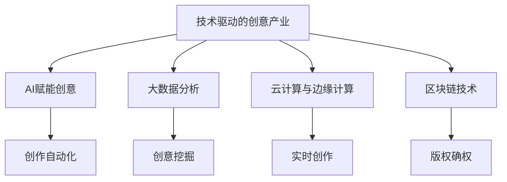

                 

## 1. 背景介绍

### 1.1 问题由来
当前，创意产业正面临前所未有的挑战和机遇。数字化、网络化、智能化浪潮的席卷，使得传统的创意产业格局正在被重新定义。如何利用技术能力进行产业革新，提升创意产品的质量与效率，是摆在所有创作者和产业从业者面前的重要课题。

### 1.2 问题核心关键点
基于此，本文将探讨利用技术能力对创意产业进行革新的方法和策略。主要聚焦于以下几个核心问题：

- 创意产业的技术驱动机制是什么？
- 如何利用AI、大数据等技术提升创意产品的创作效率和质量？
- 创意产业的技术实现流程是怎样的？
- 技术革新对创意产业有哪些深远影响？

### 1.3 问题研究意义
探讨技术驱动的创意产业革新，对于推动产业转型升级、提升全球竞争力具有重要意义：

- 促进跨界融合：将技术与创意相结合，催生出许多新兴行业和业态，推动创意产业的跨界融合。
- 提升产品价值：技术的应用可以大大提高创意产品的创新性和市场竞争力，满足消费者更高层次的需求。
- 提升产业效率：技术的应用可以减少中间环节，提高创意产业的运营效率和响应速度。
- 增强市场竞争力：技术革新可以打造出更具差异化竞争力的产品，增强企业在市场的竞争地位。

## 2. 核心概念与联系

### 2.1 核心概念概述

为更好地理解技术对创意产业革新的过程，本节将介绍几个密切相关的核心概念：

- **技术驱动的创意产业**：指以技术创新为核心驱动力的创意产业模式，通过引入信息技术、大数据分析、人工智能等技术手段，优化创意产品的创作、传播和市场化过程。
- **AI赋能创意**：指利用人工智能技术，提升创意产品的创作、编辑、分析等环节的自动化水平，加快创意成果的产出速度。
- **大数据分析**：指通过收集和分析创意相关的海量数据，挖掘潜在的创意机会，提供创意创作的灵感来源。
- **云计算与边缘计算**：指通过云计算和边缘计算技术，提供弹性可伸缩的计算资源和低延迟的实时处理能力，满足创意创作和传播的需求。
- **区块链技术**：指利用区块链技术，提供透明、安全的版权确权和交易平台，保护创意作品的知识产权。

这些核心概念之间的逻辑关系可以通过以下Mermaid流程图来展示：



这个流程图展示了一体化的技术框架，说明了技术如何在创意产业各个环节中发挥作用。

## 3. 核心算法原理 & 具体操作步骤
### 3.1 算法原理概述

技术驱动的创意产业革新，本质上是一个利用信息技术提升创意作品创作与传播效率的过程。其核心思想是：通过引入数据、算法、计算资源等技术手段，对创意产业的创作、编辑、分析、传播等环节进行优化和自动化，提高创意产业的整体效能。

形式化地，设创意产业中的创作任务为 $C$，其中 $C$ 包括创作流程、创作工具、创作内容等。设 $T$ 为可用的技术手段，包括AI、大数据、云计算、区块链等。技术革新过程即为通过 $T$ 对 $C$ 进行优化，使得创作效率和作品质量得到提升。具体来说，优化过程包含以下几个步骤：

1. **数据收集与处理**：收集与创意创作相关的数据，包括用户行为数据、市场反馈数据、创意内容数据等。
2. **模型训练与优化**：通过机器学习等技术手段，构建优化模型，对创意创作进行自动化。
3. **技术集成与部署**：将构建好的技术模型集成到创意创作工具和平台上，提升创作效率。
4. **版权确权与交易**：利用区块链技术确权与交易，保障创意作品的安全与合法性。

### 3.2 算法步骤详解

技术革新创意产业的具体操作流程包括以下几个关键步骤：

**Step 1: 数据收集与处理**
- 收集与创意创作相关的数据，包括用户行为数据、市场反馈数据、创意内容数据等。
- 清洗和处理数据，去除噪声和不相关数据，确保数据质量。
- 利用大数据分析技术，挖掘创意创作相关的趋势和模式。

**Step 2: 模型训练与优化**
- 构建优化模型，包括创作自动化模型、创意挖掘模型、版权确权模型等。
- 使用机器学习、深度学习等技术，对模型进行训练与优化。
- 模型训练过程中，采用迁移学习、自监督学习等策略，提高模型泛化能力。

**Step 3: 技术集成与部署**
- 将训练好的模型集成到创意创作工具和平台上。
- 使用云计算和边缘计算技术，提供弹性可伸缩的计算资源和低延迟的实时处理能力。
- 部署区块链平台，确权与交易创意作品，保护版权。

**Step 4: 应用与评估**
- 利用集成好的技术系统进行创意创作和传播。
- 实时监控和评估系统性能，根据反馈不断优化技术模型。
- 定期收集用户反馈，改进产品功能与用户体验。

### 3.3 算法优缺点

技术驱动的创意产业革新具有以下优点：
1. **创作效率提升**：通过自动化工具，大大提升创意创作和编辑的速度。
2. **创作质量提升**：借助大数据分析和AI技术，提供更加精准的创意灵感和创作建议。
3. **运营效率提升**：利用云计算和边缘计算，提升创意作品传播和市场化的效率。
4. **版权保护增强**：通过区块链技术，保障创意作品的知识产权，避免盗版。

同时，该方法也存在一定的局限性：
1. **技术依赖性强**：技术驱动的模式需要大量的技术投入和专业人才支持。
2. **成本较高**：技术基础设施的建设与维护需要较高的投入。
3. **数据隐私问题**：创意创作涉及大量的个人数据，需要严格的数据隐私保护措施。
4. **用户接受度**：部分用户对技术驱动的创作模式可能存在抵触情绪，需要一定的市场教育。

尽管存在这些局限性，但就目前而言，技术驱动的创意产业革新是提升创意产品质量和效率的重要手段。未来相关研究的重点在于如何进一步降低技术成本，提高技术的可操作性，同时兼顾用户体验和数据隐私。

### 3.4 算法应用领域

技术革新对创意产业的影响广泛且深远，主要体现在以下几个领域：

- **影视与动画**：利用AI技术进行特效渲染、角色动作生成、剧本创作等，提升作品的制作效率和质量。
- **广告创意**：通过大数据分析，挖掘受众的兴趣点，设计更具吸引力的广告创意。
- **音乐与演出**：利用AI技术进行音乐创作、编曲、节奏分析等，提升音乐作品的艺术性和商业价值。
- **出版与传媒**：通过AI和大数据技术，进行智能推荐、内容生成、版权确权等，提升出版和传媒产业的智能化水平。
- **游戏与虚拟现实**：利用AI和增强现实技术，提升游戏的互动性和沉浸感。
- **时尚与设计**：通过AI和大数据分析，提供个性化的设计建议，提升设计作品的市场竞争力。

## 4. 数学模型和公式 & 详细讲解 & 举例说明
### 4.1 数学模型构建

本节将使用数学语言对技术驱动的创意产业革新过程进行更加严格的刻画。

设创意产业中的创作任务为 $C$，创作过程分为若干步骤 $S=\{s_1, s_2, ..., s_n\}$。设可用的技术手段为 $T=\{t_1, t_2, ..., t_m\}$，其中 $t_i$ 为第 $i$ 种技术手段。

定义创意创作的质量函数 $Q(C)$，表示创意创作的质量。创作效率函数 $E(C)$，表示创意创作的效率。技术优化函数 $O(T)$，表示通过技术手段提升创意创作的质量和效率。

则技术驱动的创意产业革新过程可以表示为：

$$
Q(C) = f_1(Q_{s_1}, Q_{s_2}, ..., Q_{s_n})
$$

$$
E(C) = f_2(E_{s_1}, E_{s_2}, ..., E_{s_n})
$$

$$
O(T) = f_3(Q_{t_1}, Q_{t_2}, ..., Q_{t_m})
$$

其中 $Q_{s_i}$ 为第 $s_i$ 步骤的创作质量，$E_{s_i}$ 为第 $s_i$ 步骤的创作效率，$Q_{t_i}$ 为第 $t_i$ 技术手段对创意创作质量的影响。

### 4.2 公式推导过程

以下我们以影视特效渲染为例，推导AI技术提升创作效率和质量的数学模型。

设影视特效渲染的步骤为 $s_1, s_2, ..., s_n$，其中 $s_1$ 为模型训练，$s_2$ 为特效渲染，$s_3$ 为渲染后处理。

设模型训练的质量函数为 $Q_{s_1}$，特效渲染的质量函数为 $Q_{s_2}$，渲染后处理的质量函数为 $Q_{s_3}$。设AI技术对模型训练的质量提升为 $Q_{t_1}$，对特效渲染的质量提升为 $Q_{t_2}$，对渲染后处理的质量提升为 $Q_{t_3}$。

根据公式推导，AI技术对影视特效渲染的整体质量提升可以表示为：

$$
Q(C) = Q_{s_1} + Q_{s_2} + Q_{s_3} + Q_{t_1} + Q_{t_2} + Q_{t_3}
$$

其中 $Q_{s_1} = f_1(Q_{s_1}, Q_{s_2}, Q_{s_3})$，$Q_{s_2} = f_2(Q_{s_1}, Q_{s_3})$，$Q_{s_3} = f_3(Q_{s_1}, Q_{s_2})$。

### 4.3 案例分析与讲解

在实际应用中，AI技术对影视特效渲染的具体提升可以通过以下案例进行分析：

**案例分析**：某影视公司使用AI技术对特效渲染过程进行优化，提高了渲染效率和效果。

**具体实现**：
1. **模型训练优化**：利用AI技术自动学习特效渲染的模型参数，减少人工调参工作量。
2. **特效渲染加速**：引入GPU并行计算技术，大幅提升渲染速度。
3. **后处理自动化**：利用深度学习技术自动生成高质量的特效后期处理效果，减少人工干预。

**评估指标**：
- **质量指标**：渲染后的特效效果、颜色校正、光线效果等。
- **效率指标**：渲染时间、渲染速度、人工干预次数等。

**效果分析**：
- 渲染质量提升：AI技术自动调整模型参数，提升渲染效果。
- 渲染效率提升：并行计算和自动化后处理技术，提高渲染速度。
- 人工干预减少：减少人工调参和后期处理工作量，提高渲染效率。

## 5. 项目实践：代码实例和详细解释说明
### 5.1 开发环境搭建

在进行技术驱动的创意产业革新实践前，我们需要准备好开发环境。以下是使用Python进行PyTorch开发的环境配置流程：

1. 安装Anaconda：从官网下载并安装Anaconda，用于创建独立的Python环境。

2. 创建并激活虚拟环境：
```bash
conda create -n pytorch-env python=3.8 
conda activate pytorch-env
```

3. 安装PyTorch：根据CUDA版本，从官网获取对应的安装命令。例如：
```bash
conda install pytorch torchvision torchaudio cudatoolkit=11.1 -c pytorch -c conda-forge
```

4. 安装各类工具包：
```bash
pip install numpy pandas scikit-learn matplotlib tqdm jupyter notebook ipython
```

完成上述步骤后，即可在`pytorch-env`环境中开始项目实践。

### 5.2 源代码详细实现

下面我们以影视特效渲染的AI技术应用为例，给出使用PyTorch进行深度学习的代码实现。

首先，定义影视特效渲染的模型：

```python
from torch import nn
from torch.nn import functional as F

class EffectRenderingModel(nn.Module):
    def __init__(self):
        super(EffectRenderingModel, self).__init__()
        self.conv1 = nn.Conv2d(3, 64, kernel_size=3, padding=1)
        self.conv2 = nn.Conv2d(64, 128, kernel_size=3, padding=1)
        self.conv3 = nn.Conv2d(128, 256, kernel_size=3, padding=1)
        self.fc1 = nn.Linear(256*8*8, 1024)
        self.fc2 = nn.Linear(1024, 256)
        self.fc3 = nn.Linear(256, 3)

    def forward(self, x):
        x = F.relu(self.conv1(x))
        x = F.relu(self.conv2(x))
        x = F.relu(self.conv3(x))
        x = x.view(x.size(0), -1)
        x = F.relu(self.fc1(x))
        x = F.relu(self.fc2(x))
        x = self.fc3(x)
        return x
```

然后，定义损失函数和优化器：

```python
from torch import optim

criterion = nn.MSELoss()
optimizer = optim.Adam(model.parameters(), lr=0.001)
```

接着，定义训练和评估函数：

```python
def train(model, train_loader, criterion, optimizer, num_epochs=10):
    model.train()
    for epoch in range(num_epochs):
        running_loss = 0.0
        for i, data in enumerate(train_loader, 0):
            inputs, labels = data
            optimizer.zero_grad()
            outputs = model(inputs)
            loss = criterion(outputs, labels)
            loss.backward()
            optimizer.step()
            running_loss += loss.item()
            if i % 1000 == 999:
                print(f"Epoch {epoch+1}, loss: {running_loss/1000:.4f}")
                running_loss = 0.0

def evaluate(model, test_loader):
    model.eval()
    correct = 0
    total = 0
    with torch.no_grad():
        for data in test_loader:
            inputs, labels = data
            outputs = model(inputs)
            _, predicted = torch.max(outputs.data, 1)
            total += labels.size(0)
            correct += (predicted == labels).sum().item()
    print(f"Accuracy: {(100 * correct / total):.2f}%")
```

最后，启动训练流程并在测试集上评估：

```python
train_loader = ...
test_loader = ...

train(EffectRenderingModel(), train_loader, criterion, optimizer)
evaluate(EffectRenderingModel(), test_loader)
```

以上就是使用PyTorch进行影视特效渲染的深度学习模型训练的完整代码实现。可以看到，得益于深度学习框架的封装，我们可以用相对简洁的代码完成模型训练和评估。

### 5.3 代码解读与分析

让我们再详细解读一下关键代码的实现细节：

**EffectRenderingModel类**：
- `__init__`方法：初始化卷积层、全连接层等关键组件。
- `forward`方法：定义前向传播过程，依次进行卷积、激活、全连接等操作，最终输出结果。

**损失函数与优化器**：
- `criterion`变量：定义均方误差损失函数。
- `optimizer`变量：定义Adam优化器。

**训练和评估函数**：
- `train`函数：遍历训练集数据，前向传播计算损失函数并反向传播更新模型参数，输出每个epoch的平均损失。
- `evaluate`函数：遍历测试集数据，计算模型的准确率，输出最终评估结果。

**训练流程**：
- 定义总的epoch数，开始循环迭代
- 每个epoch内，在训练集上训练，输出平均损失
- 在测试集上评估，输出模型准确率

可以看到，PyTorch框架使得深度学习模型的训练过程变得简洁高效。开发者可以将更多精力放在模型设计和优化上，而不必过多关注底层的实现细节。

当然，工业级的系统实现还需考虑更多因素，如模型的保存和部署、超参数的自动搜索、更灵活的任务适配层等。但核心的深度学习流程基本与此类似。

## 6. 实际应用场景
### 6.1 智能创作平台

智能创作平台是技术驱动的创意产业革新的重要应用场景之一。智能创作平台通过引入AI、大数据等技术手段，为用户提供创意创作的工具和灵感，大幅提升创作效率和质量。

例如，某音乐创作平台利用AI技术进行音乐创作辅助，通过分析用户的历史听歌数据，生成个性化的创作建议。同时，利用大数据分析技术，识别用户喜欢的音乐风格和元素，提供创意灵感。在音乐创作完成后，平台还能自动进行编曲、音效处理等工作，提供高品质的音乐作品。

### 6.2 影视制作与后期

影视制作与后期是技术驱动的创意产业革新的另一重要领域。通过引入AI技术，影视制作公司可以大幅提升制作效率和作品质量。

例如，某影视制作公司利用AI技术进行特效渲染和后期处理。通过模型训练和优化，提升渲染速度和效果。同时，利用深度学习技术进行后期效果处理，自动化生成高质量的特效和过渡效果，减少人工干预。

### 6.3 广告创意制作

广告创意制作是创意产业的重要组成部分。通过引入AI技术，广告创意制作过程可以更加高效和精确。

例如，某广告公司利用AI技术进行创意挖掘和设计。通过大数据分析，挖掘受众的兴趣点和行为特征，生成创意灵感。同时，利用AI技术进行创意设计，自动化生成创意模板和元素，提升设计效率和质量。

### 6.4 未来应用展望

随着技术手段的不断进步，技术驱动的创意产业革新将呈现以下几个发展趋势：

1. **AI技术融合深度**：AI技术将与更多创意领域进行深度融合，形成跨界创新的新动力。
2. **数据驱动创意**：通过大数据分析，挖掘创意创作的潜在机会，提供更加精准的创作建议。
3. **区块链技术应用**：利用区块链技术确权与交易创意作品，保障知识产权。
4. **云计算与边缘计算**：通过云计算和边缘计算技术，提供弹性可伸缩的计算资源和低延迟的实时处理能力。
5. **创意作品的社交化**：利用社交媒体平台，增加创意作品的传播和互动，提升作品的曝光度和影响力。

## 7. 工具和资源推荐
### 7.1 学习资源推荐

为了帮助开发者系统掌握技术驱动的创意产业革新的理论基础和实践技巧，这里推荐一些优质的学习资源：

1. 《深度学习与人工智能：理论与实践》系列博文：由大模型技术专家撰写，深入浅出地介绍了深度学习与人工智能的基本原理和前沿技术。
2. CS231n《深度学习与计算机视觉》课程：斯坦福大学开设的计算机视觉明星课程，有Lecture视频和配套作业，带你入门计算机视觉的基本概念和经典模型。
3. 《Python机器学习》书籍：一个全面介绍机器学习的书，涵盖多种机器学习算法和技术，适合初学者入门。
4. TensorFlow官方文档：TensorFlow的官方文档，提供了海量预训练模型和完整的深度学习样例代码，是上手实践的必备资料。
5. Kaggle竞赛平台：一个数据科学竞赛平台，提供了丰富的数据集和模型竞赛，适合实践和应用。

通过对这些资源的学习实践，相信你一定能够快速掌握技术驱动的创意产业革新的精髓，并用于解决实际的创意问题。

### 7.2 开发工具推荐

高效的开发离不开优秀的工具支持。以下是几款用于技术驱动的创意产业革新的常用工具：

1. PyTorch：基于Python的开源深度学习框架，灵活动态的计算图，适合快速迭代研究。大部分预训练语言模型都有PyTorch版本的实现。
2. TensorFlow：由Google主导开发的开源深度学习框架，生产部署方便，适合大规模工程应用。同样有丰富的预训练语言模型资源。
3. Transformers库：HuggingFace开发的NLP工具库，集成了众多SOTA语言模型，支持PyTorch和TensorFlow，是进行创意产品开发的利器。
4. Weights & Biases：模型训练的实验跟踪工具，可以记录和可视化模型训练过程中的各项指标，方便对比和调优。与主流深度学习框架无缝集成。
5. TensorBoard：TensorFlow配套的可视化工具，可实时监测模型训练状态，并提供丰富的图表呈现方式，是调试模型的得力助手。
6. Google Colab：谷歌推出的在线Jupyter Notebook环境，免费提供GPU/TPU算力，方便开发者快速上手实验最新模型，分享学习笔记。

合理利用这些工具，可以显著提升技术驱动的创意产业革新的开发效率，加快创新迭代的步伐。

### 7.3 相关论文推荐

技术驱动的创意产业革新的发展源于学界的持续研究。以下是几篇奠基性的相关论文，推荐阅读：

1. Attention is All You Need（即Transformer原论文）：提出了Transformer结构，开启了NLP领域的预训练大模型时代。
2. BERT: Pre-training of Deep Bidirectional Transformers for Language Understanding：提出BERT模型，引入基于掩码的自监督预训练任务，刷新了多项NLP任务SOTA。
3. Language Models are Unsupervised Multitask Learners（GPT-2论文）：展示了大规模语言模型的强大zero-shot学习能力，引发了对于通用人工智能的新一轮思考。
4. Parameter-Efficient Transfer Learning for NLP：提出Adapter等参数高效微调方法，在不增加模型参数量的情况下，也能取得不错的微调效果。
5. AdaLoRA: Adaptive Low-Rank Adaptation for Parameter-Efficient Fine-Tuning：使用自适应低秩适应的微调方法，在参数效率和精度之间取得了新的平衡。
6. PLATO: A Planetary-Scale Language Model for Natural Language Processing：介绍了一种在大规模数据上训练的通用语言模型，展示了其强大的应用潜力。

这些论文代表了大语言模型微调技术的发展脉络。通过学习这些前沿成果，可以帮助研究者把握学科前进方向，激发更多的创新灵感。

## 8. 总结：未来发展趋势与挑战
### 8.1 总结

本文对技术驱动的创意产业革新方法进行了全面系统的介绍。首先阐述了技术驱动的创意产业革新的背景和意义，明确了AI、大数据、云计算等技术手段在提升创意产品创作与传播效率方面的独特价值。其次，从原理到实践，详细讲解了技术革新创意产业的理论基础和操作流程，给出了技术驱动的创意产业革新的代码实现。同时，本文还广泛探讨了技术革新在影视制作、音乐创作、广告创意等多个行业领域的应用前景，展示了技术革新范式的巨大潜力。此外，本文精选了技术驱动的创意产业革新的各类学习资源，力求为读者提供全方位的技术指引。

通过本文的系统梳理，可以看到，技术驱动的创意产业革新是提升创意产品创作与传播效率的重要手段。得益于AI、大数据、云计算等技术的不断进步，未来创意产业将迎来更广阔的发展空间。然而，技术驱动的创意产业革新也面临着诸多挑战，如技术成本、数据隐私、用户接受度等问题，需要多方共同努力才能克服。相信随着技术手段的不断进步和创新应用，技术驱动的创意产业革新必将在构建智能化、高效化、个性化的创意产业中扮演越来越重要的角色。

### 8.2 未来发展趋势

展望未来，技术驱动的创意产业革新将呈现以下几个发展趋势：

1. **AI技术融合深度**：AI技术将与更多创意领域进行深度融合，形成跨界创新的新动力。
2. **数据驱动创意**：通过大数据分析，挖掘创意创作的潜在机会，提供更加精准的创作建议。
3. **区块链技术应用**：利用区块链技术确权与交易创意作品，保障知识产权。
4. **云计算与边缘计算**：通过云计算和边缘计算技术，提供弹性可伸缩的计算资源和低延迟的实时处理能力。
5. **创意作品的社交化**：利用社交媒体平台，增加创意作品的传播和互动，提升作品的曝光度和影响力。

### 8.3 面临的挑战

尽管技术驱动的创意产业革新取得了显著进展，但在迈向更加智能化、普适化应用的过程中，它仍面临着诸多挑战：

1. **技术依赖性强**：技术驱动的模式需要大量的技术投入和专业人才支持。
2. **成本较高**：技术基础设施的建设与维护需要较高的投入。
3. **数据隐私问题**：创意创作涉及大量的个人数据，需要严格的数据隐私保护措施。
4. **用户接受度**：部分用户对技术驱动的创作模式可能存在抵触情绪，需要一定的市场教育。

尽管存在这些局限性，但就目前而言，技术驱动的创意产业革新是提升创意产品创作与传播效率的重要手段。未来相关研究的重点在于如何进一步降低技术成本，提高技术的可操作性，同时兼顾用户体验和数据隐私。

### 8.4 研究展望

面向未来，技术驱动的创意产业革新需要以下几个方面的突破：

1. **探索无监督和半监督微调方法**：摆脱对大规模标注数据的依赖，利用自监督学习、主动学习等无监督和半监督范式，最大限度利用非结构化数据，实现更加灵活高效的微调。
2. **研究参数高效和计算高效的微调范式**：开发更加参数高效的微调方法，在固定大部分预训练参数的同时，只更新极少量的任务相关参数。同时优化微调模型的计算图，减少前向传播和反向传播的资源消耗，实现更加轻量级、实时性的部署。
3. **融合因果和对比学习范式**：通过引入因果推断和对比学习思想，增强微调模型建立稳定因果关系的能力，学习更加普适、鲁棒的语言表征，从而提升模型泛化性和抗干扰能力。
4. **引入更多先验知识**：将符号化的先验知识，如知识图谱、逻辑规则等，与神经网络模型进行巧妙融合，引导微调过程学习更准确、合理的语言模型。同时加强不同模态数据的整合，实现视觉、语音等多模态信息与文本信息的协同建模。
5. **结合因果分析和博弈论工具**：将因果分析方法引入微调模型，识别出模型决策的关键特征，增强输出解释的因果性和逻辑性。借助博弈论工具刻画人机交互过程，主动探索并规避模型的脆弱点，提高系统稳定性。
6. **纳入伦理道德约束**：在模型训练目标中引入伦理导向的评估指标，过滤和惩罚有偏见、有害的输出倾向。同时加强人工干预和审核，建立模型行为的监管机制，确保输出符合人类价值观和伦理道德。

这些研究方向的探索，必将引领技术驱动的创意产业革新技术迈向更高的台阶，为构建安全、可靠、可解释、可控的创意产业系统铺平道路。面向未来，技术驱动的创意产业革新还需要与其他人工智能技术进行更深入的融合，如知识表示、因果推理、强化学习等，多路径协同发力，共同推动创意产业的数字化、智能化转型。

## 9. 附录：常见问题与解答

**Q1：技术驱动的创意产业革新是否适用于所有创意领域？**

A: 技术驱动的创意产业革新在大多数创意领域都能取得不错的效果，特别是对于数据量较大的领域，如影视、音乐、广告等。但对于一些需要高水平手工技艺和创意灵感的部分领域，如绘画、雕塑等，技术手段的辅助作用可能有限。

**Q2：如何选择合适的技术手段？**

A: 选择技术手段时，应考虑创意产品的特性和目标用户的需求。例如，对于音乐创作，可以选择AI辅助编曲、节奏分析等技术手段。对于影视特效，可以选择AI辅助特效渲染、后期处理等技术手段。

**Q3：技术驱动的创意产业革新的资源需求有哪些？**

A: 技术驱动的创意产业革新需要大量的计算资源和专业人才支持。通常需要高性能的计算设备和稳定的网络环境。同时，技术开发和部署也需要一定的资金投入。

**Q4：如何保障技术驱动的创意产业革新的数据隐私？**

A: 技术驱动的创意产业革新需要大量的创意数据支持。为了保障数据隐私，可以采用数据匿名化、加密存储等措施，确保用户数据的安全。同时，应遵守相关法律法规，保护用户的隐私权益。

**Q5：技术驱动的创意产业革新的用户接受度如何？**

A: 技术驱动的创意产业革新需要用户接受新技术的应用。为了提升用户接受度，可以通过市场教育、用户反馈等方式，提高用户对新技术的认知和信任。同时，应设计简单易用的技术接口，降低用户的使用门槛。

综上所述，技术驱动的创意产业革新具有广阔的应用前景，但也面临着诸多挑战和困难。只有在多方共同努力下，才能实现技术手段与创意创作的深度融合，推动创意产业的持续创新和发展。

---

作者：禅与计算机程序设计艺术 / Zen and the Art of Computer Programming

