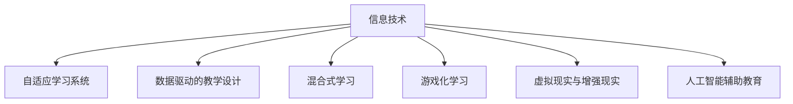

                 

# 如何利用技术能力进行教育创新

## 1. 背景介绍

### 1.1 问题由来

在当今这个信息爆炸的时代，传统的教育模式面临着巨大的挑战。学生的学习需求日益多样化和个性化，教师的工作压力也随之增大。同时，教育资源的不均衡分配问题也愈发突出。在这样的背景下，利用技术能力进行教育创新显得尤为重要。通过引入先进的信息技术，我们可以创建更加互动、高效、个性化的教育环境，使教育资源的分配更加公平，进而提升整体的教育质量。

### 1.2 问题核心关键点

教育创新的核心在于如何有效地结合技术手段和教育需求，以提升教学效果和学生的学习体验。具体来说，可以从以下几个方面入手：

- **个性化学习**：根据学生的个体差异和学习进度，提供个性化的学习路径和资源。
- **互动式教学**：通过增强现实(AR)、虚拟现实(VR)、游戏化学习等技术，提升学生的参与度和兴趣。
- **数据驱动的教学**：通过分析学习数据，实时调整教学策略和内容，优化学习效果。
- **自适应学习系统**：使用智能算法根据学生的反馈和表现，动态调整学习难度和进度。
- **远程教育**：通过互联网技术，打破地域限制，使优质教育资源得以广泛传播。

### 1.3 问题研究意义

教育技术的引入不仅能够提升教学效率和质量，还能够推动教育公平，缩小城乡和地区之间的教育差距。此外，随着技术的不断发展，教育创新的可能性也在不断拓展。通过技术手段，我们可以创造更加灵活、高效和互动的教育环境，激发学生的学习兴趣，培养其创新思维和解决问题的能力。

## 2. 核心概念与联系

### 2.1 核心概念概述

要实现教育创新，首先需要理解几个关键概念：

- **信息技术在教育中的应用**：包括电子白板、在线课堂、智能辅导系统等。
- **自适应学习系统**：根据学生的学习情况和反馈，动态调整教学内容和难度。
- **数据驱动的教学设计**：利用大数据和机器学习技术，分析学生的学习数据，优化教学策略。
- **混合式学习**：结合线上和线下教学模式，提供多样化的学习体验。
- **游戏化学习**：通过游戏化的设计，激发学生的学习动机和兴趣。
- **虚拟现实与增强现实**：利用VR和AR技术，提供沉浸式学习体验。
- **人工智能辅助教育**：包括智能辅导、自动批改作业、语音识别等应用。

这些概念之间的联系可以通过以下Mermaid流程图来展示：



这个流程图展示了一些核心概念及其之间的联系：

- 信息技术是教育创新的基础，通过各种技术手段，提升教学效果。
- 自适应学习系统、数据驱动的教学设计、混合式学习等，都是信息技术在教育中的应用。
- 游戏化学习、虚拟现实与增强现实、人工智能辅助教育等，则是信息技术在教学内容设计中的具体应用。

## 3. 核心算法原理 & 具体操作步骤

### 3.1 算法原理概述

教育创新的技术手段主要涉及信息技术和人工智能两大领域。以下是一些核心算法原理的概述：

- **自适应学习系统**：基于学生的学习历史和表现，利用机器学习算法（如协同过滤、推荐系统等），动态调整教学内容和难度。
- **数据驱动的教学设计**：通过学习数据分析，识别学生的学习瓶颈和薄弱环节，优化教学策略。
- **混合式学习**：将线上资源与线下课堂结合，形成灵活多样的学习方式。
- **游戏化学习**：利用游戏机制，如积分、关卡、奖励等，增强学生的学习动力和参与感。
- **虚拟现实与增强现实**：通过VR和AR技术，提供沉浸式的学习体验，增强学习的趣味性和互动性。

### 3.2 算法步骤详解

以下详细介绍几种常见的算法步骤：

#### 自适应学习系统

1. **数据采集**：收集学生的学习行为数据，如学习时长、完成作业情况、考试成绩等。
2. **模型训练**：使用协同过滤、推荐系统等算法，建立学生与学习资源之间的关联模型。
3. **动态调整**：根据学生的学习表现和反馈，动态调整学习内容和难度，推荐合适的资源和任务。

#### 数据驱动的教学设计

1. **数据收集**：收集学生的学习数据，如笔记、测试成绩、课堂互动情况等。
2. **数据分析**：利用机器学习算法（如分类、聚类、回归等），分析学生的学习情况和瓶颈。
3. **教学优化**：根据分析结果，优化教学内容和策略，如调整教学方法、补充学习资源等。

#### 混合式学习

1. **资源整合**：将线上资源（如在线课程、电子教材）与线下课堂相结合，形成完整的学习体系。
2. **学习路径规划**：根据学生的学习进度和兴趣，设计个性化的学习路径。
3. **反馈机制**：建立线上线下互动的反馈机制，实时调整教学策略。

#### 游戏化学习

1. **游戏设计**：设计具有挑战性和趣味性的学习游戏，如积分系统、关卡设置、奖励机制等。
2. **互动体验**：通过游戏化的教学设计，增强学生的参与感和互动性。
3. **数据反馈**：利用游戏数据，实时调整游戏难度和内容，优化学习体验。

#### 虚拟现实与增强现实

1. **场景设计**：利用VR和AR技术，设计丰富的学习场景和实验环境。
2. **互动体验**：通过沉浸式的学习体验，增强学生的理解和记忆。
3. **实验操作**：在虚拟环境中进行实验操作，如化学实验、生物实验等，增强学习的实践性。

### 3.3 算法优缺点

#### 自适应学习系统

**优点**：

- 能够根据学生的个体差异，提供个性化的学习路径和资源。
- 实时调整教学内容和难度，提高学习效果。

**缺点**：

- 需要大量的学习数据和计算资源，初期投入较大。
- 算法复杂，实现难度较高。

#### 数据驱动的教学设计

**优点**：

- 利用大数据和机器学习技术，优化教学策略，提高教学效果。
- 能够实时调整教学内容，适应学生的学习需求。

**缺点**：

- 数据隐私和安全问题需要关注。
- 算法模型的准确性对结果影响较大。

#### 混合式学习

**优点**：

- 结合线上和线下教学模式，提供多样化的学习体验。
- 利用线上资源，打破地域限制，扩大教育覆盖面。

**缺点**：

- 需要平衡线上线下资源的整合，协调难度较大。
- 需要学生具备良好的自学习能力和自我管理能力。

#### 游戏化学习

**优点**：

- 增强学生的参与感和兴趣，提高学习动力。
- 利用游戏机制，提供互动性强的学习体验。

**缺点**：

- 需要精心设计游戏内容，防止过度娱乐化。
- 对学生的自我管理能力要求较高。

#### 虚拟现实与增强现实

**优点**：

- 提供沉浸式的学习体验，增强学习的趣味性和互动性。
- 在虚拟环境中进行实验操作，增强学习的实践性。

**缺点**：

- 设备成本较高，技术门槛较高。
- 需要设计合适的虚拟场景和实验内容。

## 4. 数学模型和公式 & 详细讲解 & 举例说明

### 4.1 数学模型构建

为了更好地理解教育创新的算法原理，我们将介绍几个关键的数学模型：

- **协同过滤算法**：用于自适应学习系统中的推荐系统，通过分析用户历史行为数据，预测用户对新资源的偏好。
- **机器学习分类模型**：用于数据驱动的教学设计中的学生表现分析，通过分类算法（如KNN、决策树、SVM等），识别学生的学习瓶颈和薄弱环节。
- **游戏化学习中的积分系统**：用于激励学生的学习行为，通过积分和奖励机制，增强学生的学习动力。
- **虚拟现实中的空间映射算法**：用于将现实世界中的环境映射到虚拟空间中，提供沉浸式的学习体验。

### 4.2 公式推导过程

以下分别介绍这些数学模型的公式推导过程：

#### 协同过滤算法

协同过滤算法的基本思想是通过分析用户的历史行为数据，预测用户对新资源的偏好。假设有一个用户-项目评分矩阵 $R$，其中 $R_{ui}$ 表示用户 $u$ 对项目 $i$ 的评分，记 $U$ 为用户集合，$I$ 为项目集合。

协同过滤算法可以分为基于用户的协同过滤和基于项目的协同过滤两种方法。

**基于用户的协同过滤**：

$$
\hat{R}_{ui} = \sum_{v \in V} \alpha_u \frac{R_{vi} - \bar{R}_v}{\sqrt{\sum_{v \in V} (R_{vi} - \bar{R}_v)^2}} \cdot \frac{R_{vu} - \bar{R}_u}{\sqrt{\sum_{v \in V} (R_{vu} - \bar{R}_u)^2}}
$$

其中 $\alpha_u$ 和 $\alpha_v$ 分别为用户 $u$ 和项目 $v$ 的权重，$\bar{R}_u$ 和 $\bar{R}_v$ 分别为用户 $u$ 和项目 $v$ 的平均评分。

**基于项目的协同过滤**：

$$
\hat{R}_{ui} = \sum_{v \in V} \alpha_i \frac{R_{vi} - \bar{R}_i}{\sqrt{\sum_{v \in V} (R_{vi} - \bar{R}_i)^2}} \cdot \frac{R_{uv} - \bar{R}_u}{\sqrt{\sum_{u \in U} (R_{uv} - \bar{R}_u)^2}}
$$

其中 $\alpha_i$ 和 $\alpha_u$ 分别为项目 $i$ 和用户 $u$ 的权重，$\bar{R}_i$ 和 $\bar{R}_u$ 分别为项目 $i$ 和用户 $u$ 的平均评分。

#### 机器学习分类模型

以KNN分类模型为例，其基本思想是通过计算待分类样本与已知样本的距离，找到最近的K个邻居，利用多数投票原则确定分类结果。假设有一个样本集合 $D$，每个样本 $x_i$ 有 $d$ 个特征，$y_i$ 表示标签。

KNN模型的公式为：

$$
y_k = \text{argmax}_{k=1,...,K} \sum_{i=1}^K \alpha_i \cdot \delta(x_i, x_k)
$$

其中 $\alpha_i$ 为权重，$\delta(x_i, x_k)$ 为距离度量函数，如欧氏距离、曼哈顿距离等。

#### 游戏化学习中的积分系统

假设有一个游戏系统，有一个用户 $u$，其当前积分 $s_u$，每次完成任务 $t$ 获得积分 $c_t$。记 $U$ 为用户集合，$T$ 为任务集合。

积分系统可以表示为：

$$
s_u \leftarrow s_u + c_t \cdot \delta(t_u, t)
$$

其中 $\delta(t_u, t)$ 表示任务 $t$ 是否为完成的任务集合 $t_u$。

#### 虚拟现实中的空间映射算法

虚拟现实中的空间映射算法将现实世界中的环境映射到虚拟空间中，提供沉浸式的学习体验。假设有一个现实空间点 $p$ 和虚拟空间点 $q$，需要将其映射到虚拟空间中。

空间映射算法可以表示为：

$$
q = f(p) = R \cdot p + t
$$

其中 $R$ 为旋转矩阵，$t$ 为平移向量，$f$ 为映射函数。

### 4.3 案例分析与讲解

#### 案例分析

假设我们有一所学校，希望利用技术手段进行教育创新。学校开设了一门新的编程课程，希望通过自适应学习系统提高学生的编程能力。

**步骤1**：数据采集

首先，学校收集了学生的学习行为数据，包括编程作业完成情况、编程测试成绩、课堂互动情况等。

**步骤2**：模型训练

使用协同过滤算法，建立学生与编程资源之间的关联模型，预测学生对新资源的偏好。

**步骤3**：动态调整

根据学生的学习表现和反馈，动态调整学习内容和难度，推荐合适的编程资源和任务。

**案例讲解**

假设有一个学生在编程测试中得分较低，自适应学习系统通过协同过滤算法，发现该学生对某位老师的讲解视频资源兴趣较低，推荐了另一位老师的讲解视频资源。同时，系统还根据学生的学习历史，推荐了一些难度适中的编程练习题目。学生在学习过程中，系统不断收集反馈数据，根据学生的表现和反馈，实时调整教学内容和难度，提供个性化的学习体验。

## 5. 项目实践：代码实例和详细解释说明

### 5.1 开发环境搭建

在进行教育创新项目实践前，我们需要准备好开发环境。以下是使用Python进行Flask框架开发的环境配置流程：

1. 安装Anaconda：从官网下载并安装Anaconda，用于创建独立的Python环境。

2. 创建并激活虚拟环境：
```bash
conda create -n edutech-env python=3.8 
conda activate edutech-env
```

3. 安装Flask：
```bash
pip install Flask
```

4. 安装其他必需的库：
```bash
pip install pandas numpy sklearn requests
```

5. 安装虚拟现实VR库和增强现实AR库（如OpenVR、ARKit等），具体安装步骤需根据不同的平台和设备选择相应的库。

完成上述步骤后，即可在`edutech-env`环境中开始教育创新项目的开发。

### 5.2 源代码详细实现

下面我们以一个简单的自适应学习系统为例，给出使用Flask框架对学习资源进行推荐实践的Python代码实现。

首先，定义学习资源的推荐算法：

```python
from sklearn.neighbors import KNeighborsClassifier
from sklearn.metrics.pairwise import cosine_similarity
import pandas as pd

# 定义学习资源推荐算法
def recommend_resources(user_id, n_recommendations):
    # 读取用户历史评分数据
    data = pd.read_csv('user_ratings.csv')
    user_ratings = data[data['user_id'] == user_id]['rating'].values
    user_ratings = [i for i in user_ratings if i != 0]  # 移除缺失数据
    
    # 计算用户对学习资源的评分向量
    user_vector = pd.DataFrame({'item_id': data['item_id'].values, 'rating': user_ratings})
    user_vector = user_vector.pivot_table(index='item_id', columns='rating', aggfunc='count')
    
    # 计算用户与学习资源的评分相似度
    user_similarity = cosine_similarity(user_vector)
    
    # 获取用户评分较高的学习资源列表
    similar_learning_resources = pd.DataFrame({'item_id': data['item_id'].values, 'rating': user_ratings})
    similar_learning_resources = similar_learning_resources.sort_values(by='rating', ascending=False)
    similar_learning_resources = similar_learning_resources['item_id'].values
    
    # 获取评分相似度最高的学习资源
    similar_learning_resources = list(similar_learning_resources)
    
    # 返回推荐的学习资源
    return similar_learning_resources[:n_recommendations]
```

然后，定义Flask应用，实现学习资源的推荐：

```python
from flask import Flask, jsonify

app = Flask(__name__)

@app.route('/recommend', methods=['GET'])
def recommend():
    user_id = request.args.get('user_id')
    n_recommendations = int(request.args.get('n_recommendations'))
    recommendations = recommend_resources(user_id, n_recommendations)
    return jsonify({'recommendations': recommendations})

if __name__ == '__main__':
    app.run()
```

最后，在终端运行Flask应用：

```bash
python app.py
```

启动应用后，可以通过访问 `http://localhost:5000/recommend?user_id=123&n_recommendations=5` 获取用户ID为123的前5个推荐学习资源。

### 5.3 代码解读与分析

让我们再详细解读一下关键代码的实现细节：

**recommend_resources函数**：
- 读取用户历史评分数据，计算用户对学习资源的评分向量。
- 计算用户与学习资源的评分相似度。
- 获取用户评分较高的学习资源列表。
- 根据评分相似度，返回推荐的学习资源列表。

**Flask应用**：
- 定义路由 `/recommend`，接收用户ID和推荐数量。
- 调用 `recommend_resources` 函数获取推荐资源列表。
- 将推荐结果以JSON格式返回。

**运行Flask应用**：
- 在终端运行 `python app.py` 启动Flask应用。
- 访问 `http://localhost:5000/recommend`，获取推荐资源列表。

通过上述代码实现，我们能够快速构建一个简单的自适应学习系统，为学生提供个性化的学习资源推荐。

## 6. 实际应用场景

### 6.1 智能课堂系统

智能课堂系统是教育创新的一个典型应用场景。通过引入智能技术和AI算法，智能课堂能够实现以下功能：

- **自动测评**：实时采集学生的学习行为数据，自动测评学生的学习效果，并提供反馈。
- **智能辅导**：根据学生的学习进度和表现，自动调整教学内容和难度，提供个性化的辅导。
- **互动学习**：通过互动式学习工具，如AR互动实验、游戏化学习等，增强学生的学习体验。

**案例分析**：

某学校引入了一个智能课堂系统，该系统能够实时采集学生的学习行为数据，如笔记、作业、课堂互动等，通过机器学习算法分析学生的学习效果，并自动生成学习报告。系统还可以根据学生的学习进度和表现，动态调整教学内容和难度，推荐适合的学习资源。此外，系统还集成了虚拟现实技术，提供沉浸式的学习体验，如AR互动实验，增强学生的学习兴趣和互动性。

### 6.2 远程教育平台

远程教育平台是教育创新的另一个重要应用场景。通过互联网技术，远程教育平台能够实现以下功能：

- **实时互动**：通过视频会议、实时聊天等工具，实现教师与学生、学生与学生之间的实时互动。
- **资源共享**：提供丰富的在线课程、电子教材、视频讲座等学习资源，供学生自主学习。
- **个性化学习**：根据学生的学习进度和反馈，提供个性化的学习路径和资源。

**案例分析**：

某远程教育平台采用先进的技术手段，通过实时互动工具，如视频会议、实时聊天等，实现教师与学生、学生与学生之间的实时互动。平台提供丰富的在线课程、电子教材、视频讲座等学习资源，供学生自主学习。平台还通过机器学习算法分析学生的学习效果，根据学生的学习进度和反馈，提供个性化的学习路径和资源。此外，平台还集成了虚拟现实技术，提供沉浸式的学习体验，如AR互动实验，增强学生的学习兴趣和互动性。

### 6.3 混合式学习平台

混合式学习平台是教育创新的重要方向。通过结合线上和线下教学模式，混合式学习平台能够实现以下功能：

- **线上资源**：提供丰富的在线课程、电子教材、视频讲座等学习资源，供学生自主学习。
- **线下课堂**：通过智能课堂系统，实时采集学生的学习行为数据，自动测评学生的学习效果，并提供反馈。
- **互动学习**：通过互动式学习工具，如AR互动实验、游戏化学习等，增强学生的学习体验。

**案例分析**：

某学校引入了一个混合式学习平台，该平台通过结合线上和线下教学模式，提供丰富的在线课程、电子教材、视频讲座等学习资源，供学生自主学习。平台还通过智能课堂系统，实时采集学生的学习行为数据，自动测评学生的学习效果，并提供反馈。此外，平台还集成了虚拟现实技术，提供沉浸式的学习体验，如AR互动实验，增强学生的学习兴趣和互动性。

## 7. 工具和资源推荐

### 7.1 学习资源推荐

为了帮助开发者系统掌握教育创新的理论基础和实践技巧，这里推荐一些优质的学习资源：

1. **Coursera《教育技术》课程**：由斯坦福大学开设的在线课程，介绍教育技术的基本概念和应用方法。

2. **edX《教育数据分析》课程**：由哈佛大学开设的在线课程，通过机器学习算法分析教育数据，优化教学策略。

3. **Khan Academy《自适应学习系统》教程**：介绍自适应学习系统的基本原理和实现方法。

4. **IBM Watson Education**：提供一系列基于人工智能的教育应用，包括自适应学习、虚拟现实等。

5. **Google Classroom**：谷歌提供的教育平台，支持在线课程、互动学习等功能。

6. **EdTechXSummit**：教育技术领域的年度峰会，汇集全球教育创新领袖，分享最新研究成果和实践经验。

通过学习这些资源，相信你一定能够快速掌握教育创新的理论基础和实践技巧。

### 7.2 开发工具推荐

高效的开发离不开优秀的工具支持。以下是几款用于教育创新开发的常用工具：

1. **Flask**：基于Python的轻量级Web框架，适合快速开发教育应用。
2. **TensorFlow**：谷歌开发的深度学习框架，支持复杂的人工智能模型。
3. **PyTorch**：Facebook开发的深度学习框架，易于使用，适合学术研究和原型开发。
4. **Keras**：基于TensorFlow和PyTorch的高级API，支持快速搭建深度学习模型。
5. **OpenVR**：虚拟现实开源工具包，提供丰富的虚拟现实开发资源。
6. **ARKit**：苹果提供的增强现实开发框架，支持iOS平台上的增强现实应用。

合理利用这些工具，可以显著提升教育创新的开发效率，加快创新迭代的步伐。

### 7.3 相关论文推荐

教育创新的研究源于学界的持续探索。以下是几篇奠基性的相关论文，推荐阅读：

1. **A Survey of Adaptive Learning**：介绍了自适应学习系统的基本原理和应用案例，提供了详细的系统架构和实现方法。

2. **Data Mining and Statistical Learning in Education**：探讨了教育数据分析的基本方法，利用机器学习算法优化教学策略。

3. **Game-based Learning and Gamification**：研究了游戏化学习的基本原理和设计方法，通过游戏机制增强学生的学习动力和兴趣。

4. **Virtual Reality in Education**：介绍了虚拟现实技术在教育中的应用，提供了丰富的案例和应用场景。

5. **Artificial Intelligence in Education**：探讨了人工智能技术在教育中的基本应用，提供了实用的开发框架和方法。

这些论文代表了大教育创新技术的发展脉络。通过学习这些前沿成果，可以帮助研究者把握学科前进方向，激发更多的创新灵感。

## 8. 总结：未来发展趋势与挑战

### 8.1 总结

本文对教育创新的技术能力进行了全面系统的介绍。首先阐述了教育创新在当前教育环境中的重要性和紧迫性，明确了教育技术在提升教学效果和学生学习体验中的核心价值。其次，从原理到实践，详细讲解了教育创新的核心算法和操作步骤，给出了教育创新项目开发的完整代码实例。同时，本文还探讨了教育创新在智能课堂、远程教育、混合式学习等实际应用场景中的应用，展示了教育创新技术的广阔前景。此外，本文还精选了教育创新技术的各类学习资源，力求为读者提供全方位的技术指引。

通过本文的系统梳理，可以看到，教育创新的技术手段在提升教学效果和学生学习体验方面具有重要价值。通过技术手段，我们能够实现个性化学习、互动式教学、数据驱动的教学设计等功能，极大地提升了教育资源的质量和效率。未来，随着技术的不断发展，教育创新将迎来更多的可能性，为教育领域带来深刻变革。

### 8.2 未来发展趋势

展望未来，教育创新的技术手段将呈现以下几个发展趋势：

1. **数据驱动的教育**：利用大数据和机器学习技术，实时分析学生的学习数据，优化教学策略，提供个性化的学习体验。
2. **混合式学习模式**：结合线上和线下教学模式，提供灵活多样的学习方式，增强学生的学习动力。
3. **虚拟现实与增强现实**：通过VR和AR技术，提供沉浸式的学习体验，增强学习的趣味性和互动性。
4. **游戏化学习**：利用游戏机制，增强学生的学习动力和参与感，提高学习效果。
5. **自适应学习系统**：根据学生的学习进度和反馈，动态调整教学内容和难度，提供个性化的学习资源。
6. **人工智能辅助教育**：利用AI技术，实现自动测评、智能辅导等功能，提高教学效率和质量。

以上趋势凸显了教育创新技术的广阔前景。这些方向的探索发展，必将进一步提升教育资源的质量和效率，为学生提供更加优质的学习体验。

### 8.3 面临的挑战

尽管教育创新技术已经取得了显著成果，但在迈向更加智能化、普适化应用的过程中，它仍面临着诸多挑战：

1. **数据隐私和安全**：在收集和分析学生数据时，如何保护学生的隐私，防止数据泄露和滥用。
2. **技术普及和接受度**：教育技术的应用需要得到师生的广泛接受和支持，如何推广和普及教育技术，减少抵触情绪。
3. **资源不均衡**：教育资源的分配不均衡问题依然存在，如何确保所有学生都能受益于教育技术。
4. **教育技术系统的稳定性**：教育技术系统的稳定性和可靠性需要保证，防止系统故障影响教学效果。
5. **教育技术系统的可扩展性**：教育技术系统的可扩展性需要增强，以满足不断增长的教育需求。

正视教育创新面临的这些挑战，积极应对并寻求突破，将是大教育创新技术走向成熟的关键。相信随着学界和产业界的共同努力，这些挑战终将一一被克服，教育创新技术必将在构建人机协同的智能教育中扮演越来越重要的角色。

### 8.4 研究展望

未来的教育创新研究需要在以下几个方面寻求新的突破：

1. **教育数据治理**：建立健全的教育数据治理机制，保护学生数据隐私，防止数据滥用。
2. **技术普惠性**：开发低成本、易操作的教辅工具，推广和普及教育技术，减少教育资源的分配不均衡。
3. **教育技术系统的可扩展性**：提升教育技术系统的可扩展性，满足不断增长的教育需求。
4. **多模态学习模式**：结合图像、视频、语音等多模态数据，提供更加全面的学习体验。
5. **智能教育辅助工具**：开发智能教育辅助工具，如智能辅导系统、虚拟实验等，提高教学效率和效果。
6. **教育技术的伦理和安全**：研究教育技术的伦理和安全问题，确保教育技术的应用符合人类价值观和伦理道德。

这些研究方向的研究和突破，必将推动教育创新技术的进一步发展，为构建更加公平、高效、智能的教育环境奠定坚实基础。

## 9. 附录：常见问题与解答

**Q1：教育技术对教学效果和学生学习体验的影响有多大？**

A: 教育技术能够显著提升教学效果和学生学习体验。通过数据驱动的教育、自适应学习系统、虚拟现实与增强现实等技术手段，能够实现个性化学习、互动式教学、实时测评等功能，极大地提升了教学质量和学生的学习兴趣。

**Q2：如何选择合适的教育技术平台？**

A: 选择合适的教育技术平台需要考虑以下几个方面：
1. 功能是否满足需求，能否提供所需的核心功能。
2. 平台的技术架构和性能是否稳定，能否满足大规模应用。
3. 平台的用户界面是否友好，是否易于使用和维护。
4. 平台的可扩展性和可定制性如何，能否满足未来的需求。

**Q3：教育技术在推广和普及过程中面临哪些挑战？**

A: 教育技术在推广和普及过程中面临以下挑战：
1. 教师和学生对新技术的抵触情绪，需要加强培训和宣传。
2. 教育资源的分配不均衡，需要关注弱势群体的需求。
3. 教育技术系统的稳定性问题，需要确保系统的可靠性和鲁棒性。
4. 教育技术系统的可扩展性问题，需要关注系统的可扩展性和兼容性。

**Q4：如何确保教育技术系统的数据隐私和安全？**

A: 确保教育技术系统的数据隐私和安全，需要采取以下措施：
1. 严格的数据隐私保护政策，确保学生数据的安全。
2. 采用加密技术，防止数据泄露和滥用。
3. 定期进行安全审计，发现和修复潜在的安全漏洞。
4. 建立数据使用和共享的透明机制，确保数据的合理使用。

**Q5：教育技术系统的应用效果如何评价？**

A: 教育技术系统的应用效果可以从以下几个方面进行评价：
1. 教学效果的提升，如学生的学习成绩、理解能力等。
2. 学生的学习体验，如学习动机、参与度、满意度等。
3. 教育资源的质量和覆盖面，如资源的丰富程度、使用的便捷性等。
4. 系统的稳定性和可靠性，如系统的可用性、故障率等。
5. 系统的可扩展性和可定制性，如系统的可扩展性、可定制性等。

通过以上评价指标，可以全面评估教育技术系统的应用效果，确保系统的实际价值和可行性。

---

作者：禅与计算机程序设计艺术 / Zen and the Art of Computer Programming

