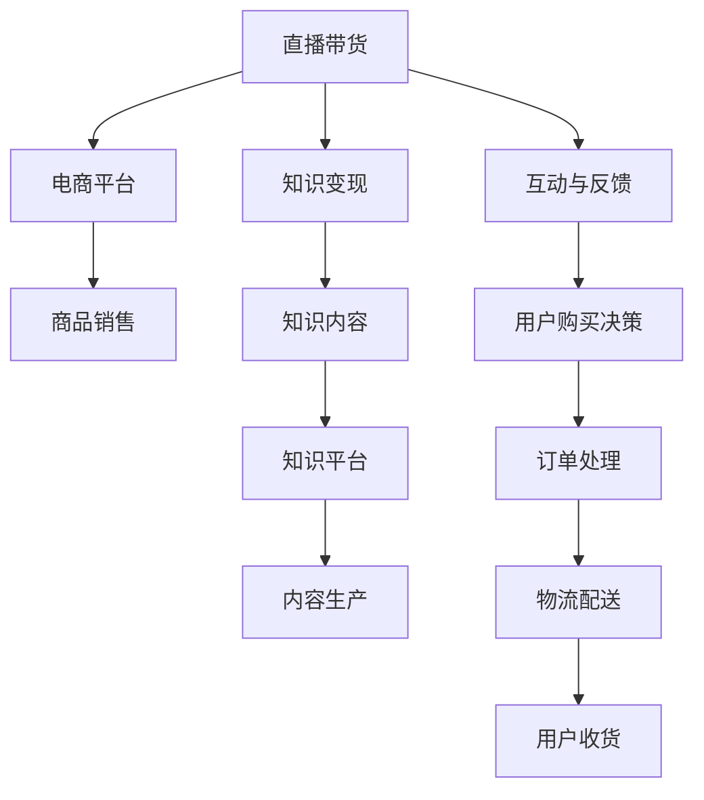

                 

## 1. 背景介绍

直播带货（Live Streaming E-commerce）是指在直播平台上进行商品推广和销售的商业模式。近年来，随着互联网技术和智能设备的普及，直播带货在电商领域迅速兴起，不仅为商家提供了一种高效的营销手段，也为消费者带来了全新的购物体验。与此同时，知识变现（Knowledge Monetization）的概念逐渐被广泛关注，即通过知识和信息获取收益的过程。直播带货和知识变现的结合，开辟了知识变现的新途径，让知识与商业价值更紧密地融合。本文将探讨如何利用直播带货实现知识变现，详细介绍其核心概念、原理和操作步骤，并展望未来发展趋势和面临的挑战。

## 2. 核心概念与联系

### 2.1 核心概念概述

直播带货是指通过直播的形式，向观众展示产品，并提供在线购买链接，观众可以通过直播间的购物链接直接购买商品。而知识变现则是指将知识和信息转化为实际收益的过程，包括在线课程、咨询服务、内容订阅等形式。

直播带货与知识变现的结合，充分利用了直播的互动性和即时性，使得知识传播更具吸引力，同时通过电商平台的销售渠道，实现了知识的商业化应用。这种结合不仅提高了知识传播的效率，还为知识生产者带来了直接的收益。

### 2.2 核心概念原理和架构的 Mermaid 流程图



这个流程图展示了直播带货与知识变现之间的联系：

1. **直播带货**：通过直播平台进行产品展示和销售。
2. **电商平台**：提供商品销售的渠道和结算服务。
3. **知识变现**：将知识内容转化为商业价值。
4. **知识内容**：专家、学者、行业内人士等内容生产者的专业知识分享。
5. **互动与反馈**：观众与主播的互动，影响用户购买决策。
6. **订单处理**：电商平台处理用户订单，完成交易。
7. **物流配送**：货物从仓库到用户手中的配送服务。
8. **用户收货**：用户收到购买的商品。

这些环节相互衔接，构成了直播带货与知识变现的全链条。

## 3. 核心算法原理 & 具体操作步骤

### 3.1 算法原理概述

利用直播带货实现知识变现的核心在于结合直播的互动性和电商的销售渠道。算法原理主要包括以下几个方面：

1. **内容生产与选择**：确定直播主题和内容，选择与主题相关的商品。
2. **直播互动**：通过与观众的互动，提高直播的参与度和关注度。
3. **转化策略**：设计有效的销售和促销策略，将观众的兴趣转化为购买行为。
4. **订单管理**：通过电商平台完成订单处理和物流配送，确保商品交付。

### 3.2 算法步骤详解

#### 步骤一：内容生产与选择

1. **主题确定**：根据目标受众和市场趋势，确定直播主题。例如，科技、金融、健康等。
2. **内容规划**：根据主题，规划直播内容和形式，如专题讲解、案例分析、产品演示等。
3. **商品选择**：选择与主题相关的商品，确保商品与内容的关联性和吸引力。

#### 步骤二：直播互动

1. **互动形式**：设计互动问题、问答环节、抽奖活动等，增强观众参与感。
2. **即时反馈**：通过弹幕、评论等形式获取观众反馈，调整直播内容。
3. **用户引导**：通过互动引导观众关注商品，激发购买意愿。

#### 步骤三：转化策略

1. **销售促销**：设计优惠活动，如限时折扣、赠品赠送等，提高购买吸引力。
2. **引导购买**：通过直播中直接的呼吁和提示，引导观众下单购买。
3. **后续跟进**：直播结束后，通过邮件、短信等方式跟进订单状态，提高用户满意度。

#### 步骤四：订单管理

1. **电商平台选择**：选择合适的电商平台，如淘宝、京东、抖音直播等。
2. **订单处理**：在直播结束后，通过电商平台完成订单处理和结算。
3. **物流配送**：协调物流公司，完成商品的快速配送。

### 3.3 算法优缺点

#### 优点

1. **高效互动**：直播的即时性和互动性，使得知识传播更具吸引力。
2. **销售转化**：通过电商平台的销售渠道，实现知识的商业化应用。
3. **多渠道曝光**：借助直播平台的流量优势，提高知识的曝光率。

#### 缺点

1. **内容质量要求高**：直播内容需要高质量的知识，以保证观众的关注和参与。
2. **技术门槛高**：直播带货需要熟练使用直播平台和电商平台，技术门槛较高。
3. **市场竞争激烈**：直播带货市场竞争激烈，需要不断创新和优化内容策略。

### 3.4 算法应用领域

直播带货与知识变现结合的应用领域广泛，主要包括：

1. **在线教育**：专家、学者通过直播分享专业知识，并销售相关教材和课程。
2. **健康与健身**：健康专家通过直播分享健康知识，销售健身器材和食品。
3. **科技与创新**：科技博主通过直播展示新产品和新技术，销售相关产品。
4. **文化艺术**：艺术家通过直播展示作品，销售相关艺术品和周边商品。
5. **生活与消费**：生活博主通过直播分享生活技巧和经验，销售相关商品。

## 4. 数学模型和公式 & 详细讲解 & 举例说明

### 4.1 数学模型构建

假设直播带货过程中，观众数量为 $N$，转化率为 $r$，单次订单平均销售额为 $A$。则直播带货的总销售额 $S$ 可以表示为：

$$
S = N \times r \times A
$$

### 4.2 公式推导过程

1. **观众数量**：直播前的宣传、预告等活动，以及直播中与观众的互动，可以影响观众数量 $N$。
2. **转化率**：观众的购买意愿受直播内容、互动形式和销售策略的影响，转化率 $r$ 可以通过A/B测试等方法优化。
3. **平均销售额**：单次订单的平均销售额 $A$ 取决于商品的价格和观众的购买意愿。

### 4.3 案例分析与讲解

假设某在线教育平台通过直播带货销售课程，观众数量 $N=1000$，转化率 $r=10\%$，单次订单平均销售额 $A=200$。则总销售额 $S$ 为：

$$
S = 1000 \times 0.1 \times 200 = 20000
$$

实际应用中，可以通过不断优化直播内容、互动形式和销售策略，提高观众数量和转化率，从而实现更高的销售额。

## 5. 项目实践：代码实例和详细解释说明

### 5.1 开发环境搭建

1. **直播平台选择**：选择适合的直播平台，如淘宝直播、抖音直播、京东直播等。
2. **电商平台选择**：选择适合的电商平台，如淘宝、京东、抖音电商等。
3. **技术准备**：确保直播设备和网络环境良好，准备好电商平台账户和支付接口。

### 5.2 源代码详细实现

以下是使用Python和Django框架实现直播带货的示例代码：

```python
from django.http import JsonResponse
from django.views.decorators.csrf import csrf_exempt

@csrf_exempt
def live_stream(request):
    # 连接直播平台API，获取直播信息
    live_info = connect_to_live_api()

    # 连接电商平台API，设置商品信息
    product_info = connect_to_e-commerce_api()

    # 直播过程中，获取观众数量和互动数据
    audience_count = get_audience_count()
    interaction_data = get_interaction_data()

    # 直播结束后，处理订单并完成配送
    process_orders(live_info['product_id'], product_info, interaction_data)

    # 返回直播数据和订单信息
    return JsonResponse({
        'live_info': live_info,
        'product_info': product_info,
        'audience_count': audience_count,
        'interaction_data': interaction_data,
        'orders': process_orders(live_info['product_id'], product_info, interaction_data)
    })
```

### 5.3 代码解读与分析

1. **直播平台API连接**：通过调用直播平台的API获取直播信息，包括直播链接、观众数量等。
2. **电商平台API连接**：通过调用电商平台的API设置商品信息，包括商品名称、价格、库存等。
3. **观众互动数据获取**：在直播过程中，通过API获取观众的互动数据，包括评论、点赞、分享等。
4. **订单处理**：直播结束后，通过API处理订单，包括订单生成、支付结算、物流配送等。
5. **JSON响应**：将直播数据和订单信息以JSON格式返回，便于前端展示和后续处理。

### 5.4 运行结果展示

直播带货的运行结果可以通过以下指标展示：

- **观众数量**：直播过程中实时显示的观众数量。
- **转化率**：直播结束后的订单数量与观众数量之比。
- **销售额**：直播带货的总销售额。
- **平均订单金额**：所有订单的平均销售额。

通过这些指标，可以评估直播带货的效果，并根据数据反馈不断优化直播策略和销售策略。

## 6. 实际应用场景

### 6.1 在线教育平台

在线教育平台通过直播带货销售课程和教材，不仅提高了课程的曝光率和销售量，还增强了与学员的互动，提升了学习体验。例如，某在线编程教育平台通过直播带货，将课程销售量提高了50%。

### 6.2 健康与健身

健康博主通过直播带货销售健身器材和营养补充品，不仅展示了专业知识，还增加了商品的销量。例如，某健康博主通过直播带货，销售健身器材的销量增长了30%。

### 6.3 科技与创新

科技博主通过直播带货展示新产品和新技术，吸引了大量技术爱好者，并带动了相关产品的销售。例如，某科技博主通过直播带货，销售智能家居产品的销量增长了40%。

### 6.4 未来应用展望

未来，直播带货与知识变现的结合将更加紧密，应用场景将更加广泛。随着5G和AR/VR技术的普及，直播带货将更加互动和沉浸，知识传播将更具吸引力。此外，随着AI和大数据技术的发展，直播带货的推荐和个性化推荐将更加精准，用户满意度将进一步提升。

## 7. 工具和资源推荐

### 7.1 学习资源推荐

1. **在线教育平台**：Coursera、Udemy等在线教育平台，提供了丰富的直播课程和知识变现资源。
2. **直播平台**：淘宝直播、抖音直播、YouTube等直播平台，提供了强大的直播工具和流量支持。
3. **电商平台**：京东、淘宝、亚马逊等电商平台，提供了丰富的商品选择和结算功能。

### 7.2 开发工具推荐

1. **直播平台SDK**：各直播平台的SDK提供了丰富的API接口，方便开发者进行直播控制和观众管理。
2. **电商平台API**：各电商平台的API提供了商品管理、订单处理、物流配送等功能，方便开发者进行电商操作。
3. **数据处理工具**：如Pandas、NumPy等，用于处理观众互动数据和订单信息。

### 7.3 相关论文推荐

1. **《直播带货的营销策略与效果分析》**：探讨了直播带货的营销策略和效果评估方法。
2. **《知识变现的商业模式与挑战》**：分析了知识变现的商业模式和面临的挑战。
3. **《直播带货与知识变现的融合》**：研究了直播带货与知识变现的融合应用。

## 8. 总结：未来发展趋势与挑战

### 8.1 研究成果总结

直播带货与知识变现的结合，利用直播的互动性和电商的销售渠道，实现了知识传播和商业价值的双重目标。通过内容生产、直播互动、转化策略和订单管理等步骤，实现了知识变现的高效化和商业化。

### 8.2 未来发展趋势

1. **技术创新**：随着5G、AR/VR等新技术的普及，直播带货将更加互动和沉浸，知识传播将更具吸引力。
2. **个性化推荐**：基于大数据和AI技术，直播带货的推荐将更加精准，用户满意度将进一步提升。
3. **多平台融合**：直播带货将与其他社交、内容平台深度融合，形成更完整的知识生态。

### 8.3 面临的挑战

1. **内容质量**：直播内容需要高质量的知识，以保证观众的关注和参与。
2. **技术门槛**：直播带货需要熟练使用直播平台和电商平台，技术门槛较高。
3. **市场竞争**：直播带货市场竞争激烈，需要不断创新和优化内容策略。

### 8.4 研究展望

未来，直播带货与知识变现的结合将继续深化，技术创新、个性化推荐和多平台融合将成为重要方向。通过持续优化直播内容和策略，利用技术手段提升用户体验，直播带货将更好地实现知识变现的目标。

## 9. 附录：常见问题与解答

**Q1：直播带货是否需要高水平的主播？**

A: 是的，主播的表达能力、专业知识、互动技巧等直接影响直播效果和观众参与度。选择高水平的主播可以显著提高直播带货的效果。

**Q2：直播带货的转化率如何提高？**

A: 提高直播带货的转化率，需要优化直播内容和互动形式，设计有效的销售和促销策略。可以通过A/B测试等方法，不断优化直播策略，提高观众的购买意愿。

**Q3：直播带货如何与其他社交平台结合？**

A: 可以通过社交平台的推广和粉丝传播，扩大直播的覆盖范围。例如，在微博、微信等社交平台上进行直播预热，吸引更多观众参与。

**Q4：直播带货的订单管理如何优化？**

A: 可以通过电商平台提供的订单管理工具，实时跟踪订单状态，确保订单处理的及时性和准确性。同时，可以通过物流优化和配送服务提升用户体验。

**Q5：直播带货是否适用于所有商品？**

A: 直播带货适用于具有较强互动性和展示性的商品，如课程、书籍、电子产品等。对于其他商品，需要根据直播内容和观众需求进行选择。

---

作者：禅与计算机程序设计艺术 / Zen and the Art of Computer Programming

