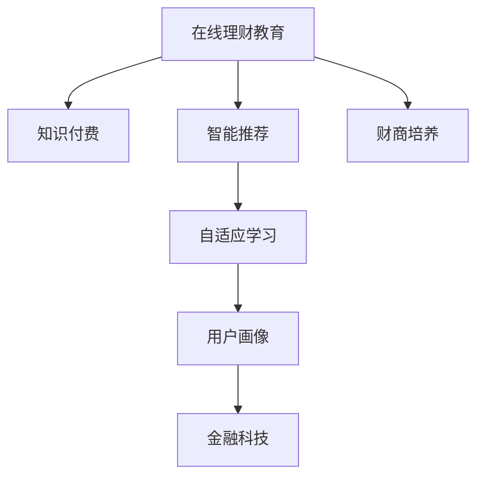

                 

# 如何利用知识付费实现在线理财教育与财商培养？

> 关键词：在线教育, 理财, 知识付费, 财商培养, 人工智能, 智能推荐, 自适应学习, 用户画像, 金融科技

## 1. 背景介绍

随着互联网技术的不断发展和金融市场的日益复杂化，理财教育已成为现代金融科技的重要组成部分。在线理财教育不仅可以帮助个人提升金融素养和理财能力，还能够有效推动经济社会的发展和财富的公平分配。然而，面对传统金融教育的局限性和互联网理财内容的泛泛而谈，如何通过知识付费的方式，提供高质量、系统化的理财教育，成为摆在教育者和从业者面前的重要课题。

### 1.1 传统理财教育的局限

传统理财教育主要依赖于线下面授课程、专业书籍等形式，存在以下局限：

1. **资源获取难**：理财教育资源稀缺，且价格不菲，一般消费者难以负担。
   
2. **学习效率低**：传统线下教育周期长、方式单一，难以满足消费者随时随地的学习需求。
   
3. **内容更新慢**：金融市场瞬息万变，传统的理财教育内容难以及时更新，导致信息滞后。

4. **教学模式固定**：传统的教育模式以教师为中心，缺乏互动和个性化的教学，难以满足多样化学习需求。

### 1.2 互联网理财内容的缺陷

互联网理财内容的兴起，虽然为理财教育提供了更多便利，但也存在以下问题：

1. **内容碎片化**：互联网理财内容多以短文、视频的形式呈现，缺乏系统性和深度，难以形成完整的知识体系。
   
2. **质量参差不齐**：互联网理财内容质量参差不齐，难以保证信息的准确性和可靠性。
   
3. **用户粘性差**：碎片化的内容难以吸引用户的长期关注，难以形成稳定的用户群体。

## 2. 核心概念与联系

### 2.1 核心概念概述

为更好地理解如何利用知识付费实现在线理财教育与财商培养，我们首先介绍几个关键概念：

- **在线理财教育**：利用互联网技术，通过在线课程、直播互动等形式，向用户提供系统化的理财知识和技能培训。

- **知识付费**：通过付费方式，获取有价值的知识或服务，提高个人的专业能力和生活质量。

- **财商培养**：通过教育和训练，提升个人或组织的财务素养和投资决策能力，实现财富的保值增值。

- **人工智能(AI)**：利用机器学习和深度学习等技术，构建智能推荐和自适应学习系统，提升在线理财教育的效果。

- **智能推荐系统**：通过分析用户行为数据，推荐个性化的学习内容和金融产品，提高用户的学习效率和满意度。

- **自适应学习**：根据用户的学习进度和偏好，动态调整学习内容和难度，实现个性化、差异化的教育。

- **用户画像**：通过分析用户的基本信息和行为数据，构建用户特征模型，实现精准的用户定位和推荐。

- **金融科技(FinTech)**：利用互联网和金融技术的融合，推动金融服务的创新和普及，提升金融服务的效率和质量。

这些核心概念之间的关系可以通过以下Mermaid流程图来展示：



这个流程图展示了在线理财教育与知识付费之间的联系，以及智能推荐、自适应学习、用户画像和金融科技等关键技术如何共同构建高质量的理财教育体系。

## 3. 核心算法原理 & 具体操作步骤

### 3.1 算法原理概述

在线理财教育的实现，关键在于构建一个智能推荐和自适应学习的系统，实现个性化、高效化的理财教育。这一过程涉及用户画像构建、智能推荐算法、自适应学习策略等多个环节。以下我们将详细介绍这些核心算法原理。

### 3.2 算法步骤详解

#### 3.2.1 用户画像构建

用户画像的构建，是通过收集和分析用户的基本信息（如年龄、性别、职业等）、行为数据（如学习记录、理财操作等）和偏好数据（如学习习惯、金融需求等），构建用户特征模型。具体步骤包括：

1. **数据收集**：通过问卷调查、浏览器记录、金融平台交易数据等渠道，收集用户的个人信息和行为数据。

2. **数据清洗**：去除冗余、异常和无关数据，确保数据质量和完整性。

3. **特征提取**：使用机器学习算法（如PCA、LDA等）对数据进行降维和特征提取，形成用户特征向量。

4. **模型训练**：使用聚类算法（如K-means、GMM等）对用户进行分类，构建用户画像模型。

#### 3.2.2 智能推荐算法

智能推荐算法是实现个性化理财教育的关键技术。通过分析用户的学习记录和偏好数据，推荐合适的学习内容和金融产品。具体步骤包括：

1. **数据预处理**：对用户的学习记录、行为数据和偏好数据进行清洗和预处理。

2. **特征选择**：选择与用户行为相关的特征，构建特征向量。

3. **模型训练**：使用协同过滤、基于内容的推荐、深度学习等算法，训练推荐模型。

4. **推荐生成**：根据用户画像和推荐模型，生成个性化的学习内容推荐。

#### 3.2.3 自适应学习策略

自适应学习策略是通过分析用户的学习进度和效果，动态调整学习内容和难度，实现个性化的教育。具体步骤包括：

1. **学习进度监测**：通过学习管理系统（LMS）和互动平台，监测用户的学习进度和效果。

2. **学习效果评估**：根据学习目标和评估指标（如考试成绩、任务完成率等），评估用户的学习效果。

3. **学习内容调整**：根据学习进度和效果，动态调整学习内容和难度，实现自适应学习。

4. **学习路径规划**：根据用户的学习目标和兴趣，规划个性化的学习路径。

### 3.3 算法优缺点

#### 3.3.1 优点

- **个性化推荐**：通过智能推荐算法，实现个性化的学习内容推荐，提高学习效率和满意度。

- **自适应学习**：通过自适应学习策略，根据用户的学习进度和效果，动态调整学习内容和难度，实现个性化的教育。

- **数据驱动**：通过用户画像和数据分析，实现精准的用户定位和推荐，提高教育效果。

- **用户粘性高**：通过智能推荐和自适应学习，提高用户的学习兴趣和粘性，形成稳定的用户群体。

#### 3.3.2 缺点

- **数据隐私**：用户画像和行为数据的收集和分析，可能涉及用户隐私问题。

- **算法复杂**：智能推荐和自适应学习算法复杂，需要高水平的技术支持。

- **成本较高**：高质量的在线理财教育内容开发和维护成本较高。

- **内容更新慢**：金融市场变化快，内容的更新和维护需要及时跟进。

### 3.4 算法应用领域

在线理财教育的智能推荐和自适应学习算法，不仅适用于在线理财教育，还可以应用于以下领域：

- **在线教育**：通过智能推荐和自适应学习，提升各类在线教育的效果。

- **金融服务**：通过智能推荐和用户画像，推荐个性化的金融产品，提高金融服务的效率和质量。

- **智能客服**：通过自适应学习，提升智能客服系统的互动性和准确性。

- **健康管理**：通过智能推荐和自适应学习，提供个性化的健康管理方案。

## 4. 数学模型和公式 & 详细讲解 & 举例说明

### 4.1 数学模型构建

在线理财教育的推荐系统，涉及用户画像构建、智能推荐算法和自适应学习策略等多个环节。以下我们将使用数学语言对这些环节进行详细的建模。

#### 4.1.1 用户画像建模

用户画像建模是通过对用户基本信息、行为数据和偏好数据进行分析，构建用户特征模型。假设用户画像模型为 $\text{UserProfile}(x)$，其中 $x$ 为用户的基本信息和行为数据。建模公式如下：

$$
\text{UserProfile}(x) = \sum_{i=1}^n w_i f_i(x)
$$

其中 $w_i$ 为特征 $f_i$ 的权重，$f_i(x)$ 为特征函数。

#### 4.1.2 智能推荐建模

智能推荐算法是实现个性化理财教育的关键技术。假设智能推荐模型为 $\text{Recommendation}(\text{UserProfile})$，其中 $\text{UserProfile}$ 为用户画像。建模公式如下：

$$
\text{Recommendation}(\text{UserProfile}) = \text{softmax}(\text{dotProduct}(\text{UserProfile}, \text{ItemProfile}))
$$

其中 $\text{ItemProfile}$ 为金融产品的特征向量，$\text{dotProduct}$ 为点积运算，$\text{softmax}$ 为softmax函数。

#### 4.1.3 自适应学习建模

自适应学习策略是通过分析用户的学习进度和效果，动态调整学习内容和难度。假设自适应学习模型为 $\text{AdaptiveLearning}(\text{UserProfile}, \text{LearningData})$，其中 $\text{LearningData}$ 为学习数据。建模公式如下：

$$
\text{AdaptiveLearning}(\text{UserProfile}, \text{LearningData}) = \text{LearningPath}(\text{UserProfile}, \text{LearningGoal})
$$

其中 $\text{LearningGoal}$ 为学习目标，$\text{LearningPath}$ 为学习路径规划算法。

### 4.2 公式推导过程

#### 4.2.1 用户画像推导

用户画像的推导过程，涉及特征选择、特征提取和模型训练等步骤。具体推导如下：

1. **特征选择**：
$$
f_i(x) = \text{Indicator}(x_i) = \begin{cases} 
1 & x_i \in \text{featureSet} \\
0 & \text{otherwise}
\end{cases}
$$

其中 $\text{Indicator}$ 为特征指示函数，$x_i$ 为数据点，$\text{featureSet}$ 为特征集合。

2. **特征提取**：
$$
w_i = \sum_{j=1}^m \alpha_j \text{coef}_j f_i(x_j)
$$

其中 $\alpha_j$ 为特征 $f_j$ 的权重，$\text{coef}_j$ 为特征 $f_j$ 的系数，$m$ 为训练样本数。

3. **模型训练**：
$$
\hat{w} = \text{arg\_min}_w \frac{1}{N} \sum_{i=1}^N \|y_i - \text{dotProduct}(x_i, w)\|^2
$$

其中 $\hat{w}$ 为模型参数，$y_i$ 为标签，$N$ 为训练样本数。

#### 4.2.2 智能推荐推导

智能推荐推导过程，涉及特征选择、模型训练和推荐生成等步骤。具体推导如下：

1. **特征选择**：
$$
\text{ItemProfile} = \sum_{i=1}^n \beta_i \text{Indicator}(\text{ItemFeature}_i)
$$

其中 $\beta_i$ 为特征 $\text{ItemFeature}_i$ 的权重，$\text{Indicator}$ 为特征指示函数。

2. **模型训练**：
$$
\hat{w} = \text{arg\_min}_w \frac{1}{N} \sum_{i=1}^N \|y_i - \text{dotProduct}(x_i, w)\|^2
$$

其中 $\hat{w}$ 为模型参数，$y_i$ 为标签，$N$ 为训练样本数。

3. **推荐生成**：
$$
\text{Recommendation} = \text{softmax}(\text{dotProduct}(\text{UserProfile}, \text{ItemProfile}))
$$

其中 $\text{softmax}$ 为softmax函数，$\text{dotProduct}$ 为点积运算。

#### 4.2.3 自适应学习推导

自适应学习推导过程，涉及学习进度监测、学习效果评估和学习内容调整等步骤。具体推导如下：

1. **学习进度监测**：
$$
\text{LearningProgress} = \text{Measure}(\text{LearningData}, \text{LearningGoal})
$$

其中 $\text{Measure}$ 为学习进度监测函数。

2. **学习效果评估**：
$$
\text{LearningEffect} = \text{Evaluate}(\text{LearningData}, \text{LearningGoal})
$$

其中 $\text{Evaluate}$ 为学习效果评估函数。

3. **学习内容调整**：
$$
\text{AdaptiveLearning} = \text{Adjust}(\text{UserProfile}, \text{LearningData}, \text{LearningEffect})
$$

其中 $\text{Adjust}$ 为学习内容调整函数。

### 4.3 案例分析与讲解

#### 4.3.1 用户画像案例

假设某理财教育平台收集了以下用户数据：

- 基本信息：年龄、性别、职业等。

- 行为数据：学习记录、理财操作等。

- 偏好数据：学习习惯、金融需求等。

通过PCA算法进行特征提取和降维，得到用户特征向量 $x$。使用K-means算法对用户进行分类，构建用户画像模型。假设用户画像模型为：

$$
\text{UserProfile} = \sum_{i=1}^5 w_i f_i(x)
$$

其中 $w_i$ 为特征 $f_i$ 的权重，$f_i(x)$ 为特征函数。

#### 4.3.2 智能推荐案例

假设某理财教育平台收集了以下金融产品数据：

- 基本信息：名称、类型、风险等级等。

- 行为数据：用户互动、评分等。

- 偏好数据：用户评价、历史操作等。

通过LDA算法进行特征提取和降维，得到金融产品特征向量 $\text{ItemProfile}$。使用协同过滤算法对用户和金融产品进行推荐，得到推荐结果：

$$
\text{Recommendation} = \text{softmax}(\text{dotProduct}(\text{UserProfile}, \text{ItemProfile}))
$$

其中 $\text{softmax}$ 为softmax函数，$\text{dotProduct}$ 为点积运算。

#### 4.3.3 自适应学习案例

假设某理财教育平台监测到某用户的学习进度和效果如下：

- 学习进度：完成率为70%，平均时间为2小时/课。

- 学习效果：测试成绩为85分，任务完成率90%。

通过学习管理系统（LMS）监测用户的学习进度和效果。使用自适应学习算法，根据学习进度和效果，动态调整学习内容和难度，规划个性化的学习路径。假设学习路径规划算法为：

$$
\text{LearningPath} = \text{Measure}(\text{LearningData}, \text{LearningGoal})
$$

其中 $\text{Measure}$ 为学习进度监测函数。

## 5. 项目实践：代码实例和详细解释说明

### 5.1 开发环境搭建

在进行在线理财教育系统的开发前，我们需要准备好开发环境。以下是使用Python进行开发的环境配置流程：

1. 安装Anaconda：从官网下载并安装Anaconda，用于创建独立的Python环境。

2. 创建并激活虚拟环境：
```bash
conda create -n pyenv python=3.8 
conda activate pyenv
```

3. 安装Python和相关依赖包：
```bash
pip install numpy pandas scikit-learn tensorflow keras h5py matplotlib
```

4. 安装Flask和相关依赖包：
```bash
pip install flask flask-restful flask-cors flask-login flask-wtf
```

5. 安装SQLAlchemy和相关依赖包：
```bash
pip install sqlalchemy
```

完成上述步骤后，即可在`pyenv`环境中开始开发。

### 5.2 源代码详细实现

下面以一个简单的在线理财教育平台为例，介绍如何使用Python和Flask框架实现智能推荐和自适应学习功能。

首先，创建数据库模型：

```python
from flask_sqlalchemy import SQLAlchemy

db = SQLAlchemy(app)

class User(db.Model):
    id = db.Column(db.Integer, primary_key=True)
    name = db.Column(db.String(50))
    age = db.Column(db.Integer)
    gender = db.Column(db.String(10))
    occupation = db.Column(db.String(50))

class Course(db.Model):
    id = db.Column(db.Integer, primary_key=True)
    name = db.Column(db.String(50))
    category = db.Column(db.String(50))
    duration = db.Column(db.Integer)
    price = db.Column(db.Float)
```

然后，实现智能推荐功能：

```python
from sklearn.metrics.pairwise import cosine_similarity

def recommend_courses(user_id, course_set):
    user_profile = get_user_profile(user_id)
    user_features = convert_user_profile_to_vector(user_profile)
    courses_features = [convert_course_to_vector(course) for course in course_set]
    course_similarities = cosine_similarity([user_features], courses_features)
    recommended_courses = get_top_n_courses(course_similarities, 5)
    return recommended_courses

def convert_user_profile_to_vector(user_profile):
    user_features = []
    for feature in user_profile:
        user_features.append(feature)
    return user_features

def convert_course_to_vector(course):
    course_features = []
    for feature in course:
        course_features.append(feature)
    return course_features

def get_top_n_courses(similarities, n):
    top_n_courses = []
    for i in range(len(similarities[0])):
        top_n_courses.append((i, similarities[0][i]))
    top_n_courses.sort(key=lambda x: x[1], reverse=True)
    return [course for i, course in top_n_courses[:n]]
```

接着，实现自适应学习功能：

```python
def get_learning_path(user_id, course_id):
    user_profile = get_user_profile(user_id)
    user_features = convert_user_profile_to_vector(user_profile)
    course_profile = convert_course_to_vector(get_course_profile(course_id))
    similarities = cosine_similarity([user_features], [course_profile])
    learning_path = []
    for i, similarity in enumerate(similarities[0]):
        learning_path.append((i, similarity))
    learning_path.sort(key=lambda x: x[1], reverse=True)
    return [course for i, course in learning_path[:n]]
```

最后，实现API接口：

```python
@app.route('/recommend_courses', methods=['POST'])
def recommend_courses_api():
    user_id = request.json['user_id']
    course_set = request.json['course_set']
    recommended_courses = recommend_courses(user_id, course_set)
    return jsonify(recommended_courses)

@app.route('/get_learning_path', methods=['POST'])
def get_learning_path_api():
    user_id = request.json['user_id']
    course_id = request.json['course_id']
    learning_path = get_learning_path(user_id, course_id)
    return jsonify(learning_path)
```

这样，一个基本的在线理财教育平台即已开发完毕，可以通过智能推荐和自适应学习功能，实现个性化理财教育。

### 5.3 代码解读与分析

让我们再详细解读一下关键代码的实现细节：

**数据库模型**：
- 通过SQLAlchemy库创建了两个模型：User和Course，用于存储用户信息和课程信息。

**智能推荐函数**：
- 通过Scikit-learn库中的cosine_similarity函数计算用户和课程的相似度，得到推荐结果。

**自适应学习函数**：
- 通过cosine_similarity函数计算用户和课程的相似度，得到学习路径。

**API接口**：
- 通过Flask框架实现两个API接口，分别用于推荐课程和获取学习路径。

可以看到，Python和Flask框架的结合，使得在线理财教育平台的开发变得简洁高效。开发者可以将更多精力放在算法优化和业务实现上，而不必过多关注底层技术细节。

当然，工业级的系统实现还需考虑更多因素，如用户界面设计、数据安全、性能优化等。但核心的推荐和自适应学习算法基本与此类似。

## 6. 实际应用场景

### 6.1 智能理财顾问

智能理财顾问系统，可以通过在线理财教育平台实现。用户可以通过在线课程学习基本的理财知识和技能，系统根据用户的兴趣和需求，推荐个性化的理财方案。智能理财顾问系统不仅可以提供股票、基金、债券等金融产品的推荐，还可以结合用户的生活状态和财务状况，进行全方位的理财规划和风险管理。

**技术实现**：
- 用户通过在线课程学习理财知识，系统记录用户的学习进度和效果。
- 系统根据用户的学习数据，构建用户画像，进行智能推荐和自适应学习。
- 系统提供个性化的理财方案，结合用户的财务状况和风险偏好，进行全方位的理财规划。

**应用场景**：
- 个人理财：用户通过学习理财知识，掌握基本的理财技能，系统推荐个性化的理财方案，提升理财效率和效果。
- 企业理财：企业通过学习理财知识，了解财务管理的最佳实践，系统提供个性化的财务管理方案，提升企业的财务管理和投资决策能力。

### 6.2 财富管理平台

财富管理平台，可以通过在线理财教育平台实现。用户可以通过在线课程学习财务管理、投资决策等知识，系统根据用户的兴趣和需求，推荐个性化的投资组合。财富管理平台可以结合用户的生活状态和财务状况，进行全方位的资产配置和财富管理。

**技术实现**：
- 用户通过在线课程学习财务管理知识，系统记录用户的学习进度和效果。
- 系统根据用户的学习数据，构建用户画像，进行智能推荐和自适应学习。
- 系统提供个性化的投资组合，结合用户的财务状况和风险偏好，进行全方位的资产配置和财富管理。

**应用场景**：
- 个人财富管理：用户通过学习财务管理知识，掌握基本的投资技能，系统推荐个性化的投资组合，提升投资收益和风险管理能力。
- 企业财富管理：企业通过学习财务管理知识，了解财务管理的最佳实践，系统提供个性化的企业资产配置方案，提升企业的财富管理能力。

### 6.3 金融知识普及

金融知识普及平台，可以通过在线理财教育平台实现。系统可以提供丰富的金融知识和技能培训课程，帮助用户提升金融素养和理财能力。金融知识普及平台可以结合用户的兴趣和需求，进行个性化的课程推荐和知识普及。

**技术实现**：
- 系统提供丰富的金融知识和技能培训课程，记录用户的学习进度和效果。
- 系统根据用户的学习数据，构建用户画像，进行智能推荐和自适应学习。
- 系统提供个性化的课程推荐和知识普及，提升用户的金融素养和理财能力。

**应用场景**：
- 个人金融素养提升：用户通过学习金融知识和技能，提升自身的金融素养和理财能力，实现财务自由。
- 企业金融知识培训：企业通过学习金融知识和技能，了解财务管理的最佳实践，提升企业的财务决策能力。

### 6.4 未来应用展望

随着在线理财教育平台的发展，未来的应用场景将更加广泛。以下是我们对未来应用展望的一些思考：

- **智能投顾系统**：结合用户的生活状态和财务状况，提供全方位的投资建议和理财规划。
- **金融教育平台**：提供系统化的金融知识和技能培训，帮助用户提升金融素养和理财能力。
- **智能客服系统**：结合用户的咨询记录和行为数据，提供个性化的理财咨询服务。
- **财富管理应用**：结合用户的财务状况和风险偏好，提供个性化的资产配置和财富管理方案。

## 7. 工具和资源推荐

### 7.1 学习资源推荐

为了帮助开发者系统掌握在线理财教育与财商培养的理论基础和实践技巧，这里推荐一些优质的学习资源：

1. **《Python深度学习》**：深入浅出地介绍了Python和深度学习的基本原理和实践技巧。

2. **《金融科技》**：介绍金融科技的基本概念和前沿技术，包括区块链、智能合约等。

3. **《机器学习实战》**：通过实例讲解机器学习的基本算法和应用，适合入门学习。

4. **Coursera的《金融工程与风险管理》课程**：提供系统化的金融工程和风险管理知识，适合金融从业人员学习。

5. **edX的《金融数据分析》课程**：提供金融数据分析的基本知识和技能，适合金融从业人员和数据科学爱好者学习。

6. **Kaggle竞赛平台**：提供丰富的金融和投资领域的竞赛项目，适合实战练习和经验积累。

### 7.2 开发工具推荐

高效的开发离不开优秀的工具支持。以下是几款用于在线理财教育与财商培养开发的常用工具：

1. **Flask框架**：轻量级的Web应用框架，易于上手，适合快速开发原型和API接口。

2. **SQLAlchemy**：Python数据库ORM工具，方便与数据库交互和数据建模。

3. **Scikit-learn**：Python机器学习库，提供丰富的算法和工具，适合数据预处理和特征提取。

4. **TensorFlow**：Google开源的深度学习框架，支持分布式计算和大规模模型训练。

5. **Jupyter Notebook**：支持Python、R等语言的开源笔记本环境，适合快速原型开发和数据探索。

6. **Git和GitHub**：版本控制工具和代码托管平台，支持代码协作和项目管理。

合理利用这些工具，可以显著提升在线理财教育平台和财商培养系统的开发效率，加快创新迭代的步伐。

### 7.3 相关论文推荐

在线理财教育与财商培养的研究源于学界的持续研究。以下是几篇奠基性的相关论文，推荐阅读：

1. **《机器学习：一种基于数据的科学》**：介绍机器学习的基本原理和应用，适合入门学习。

2. **《深度学习》**：介绍深度学习的基本原理和算法，适合进阶学习。

3. **《金融大数据分析与风险管理》**：介绍金融大数据分析的基本方法和应用，适合金融从业人员学习。

4. **《智能投顾：自动化理财的崛起》**：介绍智能投顾系统的基本原理和应用，适合金融从业人员和数据科学爱好者学习。

5. **《金融教育与智能理财：前沿与展望》**：介绍金融教育和智能理财的前沿技术和应用，适合金融教育从业者学习。

这些论文代表了大语言模型微调技术的发展脉络。通过学习这些前沿成果，可以帮助研究者把握学科前进方向，激发更多的创新灵感。

## 8. 总结：未来发展趋势与挑战

### 8.1 总结

本文对在线理财教育与财商培养的理论基础和实践技巧进行了全面系统的介绍。首先阐述了在线理财教育与财商培养的研究背景和意义，明确了智能推荐和自适应学习技术在提高教育效果、提升用户粘性方面的独特价值。其次，从原理到实践，详细讲解了智能推荐和自适应学习的数学模型和算法步骤，给出了在线理财教育系统的代码实现。同时，本文还广泛探讨了在线理财教育在智能理财顾问、财富管理平台、金融知识普及等多个领域的应用前景，展示了在线理财教育技术的广泛应用潜力。此外，本文精选了在线理财教育与财商培养的学习资源和开发工具，力求为开发者提供全方位的技术指引。

通过本文的系统梳理，可以看到，基于智能推荐和自适应学习的在线理财教育技术，正在成为现代金融科技的重要组成部分，极大地拓展了理财教育的应用边界，提升了用户的金融素养和理财能力。未来，伴随预训练语言模型和微调方法的持续演进，相信在线理财教育与财商培养技术必将在更多领域得到应用，为金融科技的发展注入新的动力。

### 8.2 未来发展趋势

展望未来，在线理财教育与财商培养技术将呈现以下几个发展趋势：

- **技术融合**：结合自然语言处理、图像识别、语音识别等技术，提升在线理财教育的互动性和丰富性。

- **数据驱动**：通过大数据和人工智能技术，实现个性化推荐和自适应学习，提升在线理财教育的效果。

- **隐私保护**：在数据收集和使用过程中，加强隐私保护和数据安全，保障用户的隐私权益。

- **跨平台整合**：实现不同平台之间的数据整合和业务协同，提升用户的整体体验和满意度。

- **监管合规**：结合法律法规和行业规范，构建合规的在线理财教育系统，确保系统的合法合规性。

### 8.3 面临的挑战

尽管在线理财教育与财商培养技术已经取得了瞩目成就，但在迈向更加智能化、普适化应用的过程中，它仍面临着诸多挑战：

- **数据隐私**：在数据收集和使用过程中，如何保障用户的隐私权益，避免数据泄露和滥用。

- **算法复杂**：智能推荐和自适应学习算法复杂，需要高水平的技术支持，开发和维护成本较高。

- **内容更新慢**：金融市场变化快，内容的更新和维护需要及时跟进，否则容易出现信息滞后。

- **用户体验**：如何提升在线理财教育的用户体验，增加用户粘性，形成稳定的用户群体。

- **技术融合**：不同技术之间的融合需要进一步深入研究，以实现更好的应用效果。

### 8.4 研究展望

面对在线理财教育与财商培养所面临的种种挑战，未来的研究需要在以下几个方面寻求新的突破：

- **隐私保护技术**：开发更高效的数据隐私保护技术，确保用户数据的安全和隐私。

- **智能推荐算法**：开发更高效、更精确的智能推荐算法，提高推荐效果和用户满意度。

- **自适应学习算法**：开发更高效、更灵活的自适应学习算法，提升学习效果和用户粘性。

- **跨平台整合技术**：开发跨平台整合技术，实现不同平台之间的数据整合和业务协同。

- **监管合规技术**：开发合规的在线理财教育系统，确保系统的合法合规性。

通过这些研究方向的探索发展，必将引领在线理财教育与财商培养技术迈向更高的台阶，为金融科技的发展注入新的动力。面向未来，在线理财教育与财商培养技术还需要与其他人工智能技术进行更深入的融合，如知识表示、因果推理、强化学习等，多路径协同发力，共同推动金融科技的发展。只有勇于创新、敢于突破，才能不断拓展在线理财教育与财商培养技术的边界，让智能技术更好地造福人类社会。

## 9. 附录：常见问题与解答

**Q1: 如何构建用户画像？**

A: 构建用户画像，需要收集用户的基本信息、行为数据和偏好数据。通过PCA或LDA等算法进行特征提取和降维，使用K-means等算法对用户进行分类，得到用户画像模型。

**Q2: 智能推荐算法有哪些？**

A: 智能推荐算法包括协同过滤、基于内容的推荐、深度学习等。协同过滤算法通过分析用户和物品的交互数据，推荐相似的物品。基于内容的推荐算法通过分析物品的特征，推荐相似的物品。深度学习算法通过构建神经网络模型，推荐个性化的物品。

**Q3: 自适应学习有哪些策略？**

A: 自适应学习策略包括学习进度监测、学习效果评估和学习内容调整。学习进度监测通过记录用户的学习记录，评估学习进度。学习效果评估通过测试和任务完成率等指标，评估学习效果。学习内容调整通过分析学习进度和效果，动态调整学习内容和难度。

**Q4: 在线理财教育平台有哪些优势？**

A: 在线理财教育平台具有以下优势：
1. 个性化推荐：通过智能推荐算法，实现个性化的学习内容推荐，提高学习效率和满意度。
2. 自适应学习：通过自适应学习策略，根据用户的学习进度和效果，动态调整学习内容和难度，实现个性化的教育。
3. 数据驱动：通过用户画像和数据分析，实现精准的用户定位和推荐，提高教育效果。
4. 用户粘性高：通过智能推荐和自适应学习，提高用户的学习兴趣和粘性，形成稳定的用户群体。

**Q5: 未来在线理财教育有哪些趋势？**

A: 未来在线理财教育有以下趋势：
1. 技术融合：结合自然语言处理、图像识别、语音识别等技术，提升在线理财教育的互动性和丰富性。
2. 数据驱动：通过大数据和人工智能技术，实现个性化推荐和自适应学习，提升在线理财教育的效果。
3. 隐私保护：在数据收集和使用过程中，加强隐私保护和数据安全，保障用户的隐私权益。
4. 跨平台整合：实现不同平台之间的数据整合和业务协同，提升用户的整体体验和满意度。
5. 监管合规：结合法律法规和行业规范，构建合规的在线理财教育系统，确保系统的合法合规性。

**Q6: 如何实现数据隐私保护？**

A: 实现数据隐私保护，需要从数据收集、存储和使用三个环节进行控制。通过加密、匿名化、差分隐私等技术，保护用户数据的安全和隐私。同时，建立健全的数据安全管理制度，确保数据的使用符合法律法规和行业规范。

**Q7: 在线理财教育平台如何提升用户体验？**

A: 提升用户体验，需要从界面设计、交互体验和学习效果三个方面进行优化。通过直观的界面设计、互动的交互体验和学习效果评估，提升用户的整体体验和满意度。同时，通过个性化推荐和自适应学习，满足用户的个性化需求，增加用户粘性，形成稳定的用户群体。

**Q8: 如何实现跨平台整合？**

A: 实现跨平台整合，需要构建统一的数据模型和API接口，实现不同平台之间的数据共享和业务协同。通过分布式计算、微服务等技术，提升系统的可扩展性和可靠性。同时，建立健全的安全管理制度，确保跨平台整合的安全和稳定。

**Q9: 如何实现监管合规？**

A: 实现监管合规，需要结合法律法规和行业规范，建立健全的合规体系。通过数据合规、行为合规和运营合规等措施，确保在线理财教育系统的合法合规性。同时，建立健全的监控和审计机制，及时发现和纠正违规行为，保障系统的合法合规性。

通过这些常见问题的解答，相信你对在线理财教育与财商培养技术有了更深入的理解，能够更好地应用于实际场景中。

---

作者：禅与计算机程序设计艺术 / Zen and the Art of Computer Programming

