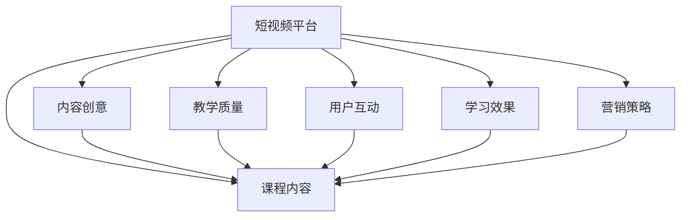

                 

# 如何利用短视频平台增加课程人气

> 关键词：短视频平台, 课程, 提高人气, 教学质量, 用户互动, 学习效果, 内容创意, 营销策略

## 1. 背景介绍

### 1.1 问题由来
随着互联网技术的飞速发展，在线教育已成为现代学习的重要组成部分。短视频平台如抖音、快手等因其内容丰富、形式新颖、易于传播的特性，逐渐成为教育内容的重要载体。然而，如何通过这些平台提高课程的人气，使其在众多教育资源中脱颖而出，成为教育机构和课程开发者关注的焦点。

短视频平台的流行不仅改变了人们的娱乐和学习方式，也为课程开发者提供了新的展示和推广渠道。通过在短视频平台上发布高质量的教育内容，不仅可以扩大课程的影响力，还能吸引更多的学习者，提升课程的互动性和参与度。

### 1.2 问题核心关键点
为了有效利用短视频平台提升课程人气，以下关键点值得关注：

- 内容创意：如何创新课程内容，使其在短视频平台上吸引眼球。
- 教学质量：如何保证短视频教学内容的专业性和互动性。
- 用户互动：如何设计互动环节，增加用户参与感和粘性。
- 学习效果：如何评估短视频平台的学习效果，并根据反馈进行优化。
- 营销策略：如何利用短视频平台的特性，进行有效的课程推广。

通过优化这些关键点，可以帮助课程开发者在短视频平台上获得更好的教学效果和更高的用户参与度。

### 1.3 问题研究意义
在短视频平台上增加课程人气，对于教育机构的品牌建设和市场竞争具有重要意义：

1. **提升品牌曝光度**：通过短视频平台的高曝光率和广泛传播，可以显著提升教育机构的知名度和品牌影响力。
2. **增加用户参与度**：短视频平台的互动特性有助于增加课程的用户参与度，使学习过程更加有趣和有效。
3. **优化教学效果**：短视频平台的反馈机制可以帮助教育机构及时调整课程内容，提升教学效果。
4. **拓宽市场渠道**：短视频平台的多样化展示方式和推广策略，可以拓宽教育机构的市场渠道，增加潜在用户的获取机会。

## 2. 核心概念与联系

### 2.1 核心概念概述

为更好地理解如何在短视频平台上增加课程人气，本节将介绍几个关键概念及其相互联系：

- **短视频平台**：如抖音、快手等，以短视频为载体的社交媒体平台。
- **课程内容**：包括视频、音频、文字等形式的教学资源。
- **内容创意**：创新的内容形式和教学方法，吸引用户注意力。
- **教学质量**：确保课程内容的准确性和专业性，提升用户的学习体验。
- **用户互动**：通过问答、评论、直播等方式，增强用户参与感。
- **学习效果**：评估课程内容的教学效果，根据反馈进行优化。
- **营销策略**：通过有效的推广手段，增加课程的曝光率和用户参与度。

这些概念之间的联系可以通过以下Mermaid流程图来展示：



这个流程图展示了几大关键概念及其之间的关系：

1. **短视频平台**作为载体，承载和传播**课程内容**。
2. **内容创意**和**教学质量**直接影响**课程内容**的质量。
3. **用户互动**增强**课程内容**的参与度。
4. **学习效果**评估和反馈优化**课程内容**。
5. **营销策略**通过**短视频平台**的传播特性，提升**课程内容**的曝光率和参与度。

这些概念共同构成了在短视频平台上增加课程人气的基本框架，通过对其深入理解和应用，可以有效地提升课程的教学效果和用户参与度。

## 3. 核心算法原理 & 具体操作步骤
### 3.1 算法原理概述

在短视频平台上增加课程人气的核心算法原理，可以通过以下步骤概括：

1. **内容创作与策划**：根据课程目标，创作和策划高质量的短视频内容。
2. **平台传播与推广**：利用短视频平台的特性，进行有效的课程推广。
3. **用户互动与反馈**：设计互动环节，增加用户参与感，并根据用户反馈进行优化。
4. **数据驱动的改进**：利用平台数据分析工具，评估和优化课程内容和学习效果。

### 3.2 算法步骤详解

以下将详细介绍在短视频平台上增加课程人气的具体操作步骤：

**Step 1: 内容创作与策划**

1. **确定课程目标**：明确课程的知识点、技能点和目标受众。
2. **设计内容主题**：根据课程目标，设计具有吸引力的主题和问题。
3. **创作短视频内容**：结合视频、音频、文字等多种形式，创作高质量的短视频内容。
4. **策划推广计划**：制定详细的发布计划和推广策略，包括发布时间、频次和推广渠道。

**Step 2: 平台传播与推广**

1. **利用平台特性**：充分利用短视频平台的高曝光率和传播特性，发布内容。
2. **利用标签和推荐**：通过合理使用标签和平台推荐算法，提升内容的可见性。
3. **互动与引导**：在视频中设计互动环节，引导用户进行点赞、评论、分享等互动行为。

**Step 3: 用户互动与反馈**

1. **设计互动环节**：在视频中加入问答、评论、投票等互动环节，增加用户参与感。
2. **收集用户反馈**：通过评论、点赞、分享等数据，收集用户的反馈和意见。
3. **优化课程内容**：根据用户反馈，及时调整课程内容和教学方法，提升学习效果。

**Step 4: 数据驱动的改进**

1. **分析数据指标**：利用平台提供的分析工具，评估课程内容的互动率和学习效果。
2. **优化内容创作**：根据数据指标，优化课程内容的主题、形式和教学方法。
3. **调整推广策略**：根据数据反馈，调整推广策略，提升课程的曝光率和用户参与度。

### 3.3 算法优缺点

在短视频平台上增加课程人气的算法，具有以下优点：

1. **高效传播**：短视频平台的高曝光率和传播特性，可以快速增加课程的曝光率和用户参与度。
2. **多样化展示**：通过多种形式的短视频内容，可以更好地展示课程的知识点和技能点。
3. **实时互动**：短视频平台的实时互动特性，可以增加用户的参与感和粘性。

同时，该算法也存在一定的局限性：

1. **内容创意难度高**：高质量的短视频内容创作需要较高的创意和技能，且需不断创新。
2. **用户参与度不稳定**：短视频平台的用户参与度受多种因素影响，难以保证长期稳定。
3. **平台算法依赖**：短视频平台的推荐算法和标签体系对课程推广效果有重要影响，需深入理解。

### 3.4 算法应用领域

在短视频平台上增加课程人气的算法，广泛应用于教育、职业技能培训、语言学习等领域。例如：

- **在线教育**：通过短视频平台发布课程预告、课程内容、习题解答等，提升课程的曝光率和用户参与度。
- **职业技能培训**：发布职业技能教学视频，通过互动和反馈优化教学内容，提升学习效果。
- **语言学习**：发布语言学习视频，通过互动和反馈优化教学方法，提升学习兴趣和效果。

除了这些经典应用外，短视频平台的应用场景还在不断拓展，未来将有更多领域利用短视频平台的特性进行课程推广和优化。

## 4. 数学模型和公式 & 详细讲解 & 举例说明

### 4.1 数学模型构建

假设课程内容的发布周期为 $T$ 天，每天发布 $V$ 条短视频。设课程内容的用户关注度为 $U$，短视频的平均互动率为 $I$，平均观看时长为 $W$。则课程内容的总曝光量为 $E=T \times V \times I$，总观看量为 $T \times V \times W$，总用户参与量为 $U \times (T \times V \times I)$。

通过这些变量，可以构建模型来评估课程在短视频平台上的效果：

$$
E = T \times V \times I
$$

$$
U = \frac{U \times (T \times V \times I)}{T \times V \times W}
$$

### 4.2 公式推导过程

- **曝光量**：短视频平台的算法推荐和用户互动对课程的曝光量有重要影响。假设每条短视频的平均互动率为 $I$，则 $T$ 天内发布 $V$ 条短视频的总曝光量为 $E=T \times V \times I$。
- **用户关注度**：根据短视频平台提供的数据分析工具，可以评估课程内容的总用户关注度 $U$。其计算公式为 $U$ 与总曝光量和平均观看时长的比值，即 $U = \frac{U \times (T \times V \times I)}{T \times V \times W}$。

### 4.3 案例分析与讲解

假设某在线教育平台在抖音上发布英语课程，每天发布 3 条短视频，每条短视频的平均互动率为 5%，平均观看时长为 5 分钟。根据上述模型，可以计算出：

- **总曝光量**：$E = 30 \times 0.05 = 1.5$
- **总用户关注度**：$U = \frac{U \times 1.5}{30 \times 5} = \frac{U}{30}$

即 $U$ 与总曝光量的比值，反映了课程内容的受欢迎程度。

## 5. 项目实践：代码实例和详细解释说明
### 5.1 开发环境搭建

在进行短视频平台课程推广的实践前，我们需要准备好开发环境。以下是使用Python进行PyTorch开发的环境配置流程：

1. 安装Anaconda：从官网下载并安装Anaconda，用于创建独立的Python环境。

2. 创建并激活虚拟环境：
```bash
conda create -n video-tutorial-env python=3.8 
conda activate video-tutorial-env
```

3. 安装PyTorch：根据CUDA版本，从官网获取对应的安装命令。例如：
```bash
conda install pytorch torchvision torchaudio cudatoolkit=11.1 -c pytorch -c conda-forge
```

4. 安装transformers库：
```bash
pip install transformers
```

5. 安装各类工具包：
```bash
pip install numpy pandas scikit-learn matplotlib tqdm jupyter notebook ipython
```

完成上述步骤后，即可在`video-tutorial-env`环境中开始课程推广的实践。

### 5.2 源代码详细实现

下面我们以在线教育平台在抖音上推广英语课程为例，给出使用Transformers库进行课程推广的PyTorch代码实现。

首先，定义课程相关的数据处理函数：

```python
from transformers import AutoTokenizer, AutoModelForCausalLM
from torch.utils.data import Dataset
import torch

class VideoDataset(Dataset):
    def __init__(self, texts, tags, tokenizer, max_len=128):
        self.texts = texts
        self.tags = tags
        self.tokenizer = tokenizer
        self.max_len = max_len
        
    def __len__(self):
        return len(self.texts)
    
    def __getitem__(self, item):
        text = self.texts[item]
        tags = self.tags[item]
        
        encoding = self.tokenizer(text, return_tensors='pt', max_length=self.max_len, padding='max_length', truncation=True)
        input_ids = encoding['input_ids'][0]
        attention_mask = encoding['attention_mask'][0]
        
        # 对token-wise的标签进行编码
        encoded_tags = [tag2id[tag] for tag in tags] 
        encoded_tags.extend([tag2id['O']] * (self.max_len - len(encoded_tags)))
        labels = torch.tensor(encoded_tags, dtype=torch.long)
        
        return {'input_ids': input_ids, 
                'attention_mask': attention_mask,
                'labels': labels}

# 标签与id的映射
tag2id = {'O': 0, 'B-PER': 1, 'I-PER': 2, 'B-ORG': 3, 'I-ORG': 4, 'B-LOC': 5, 'I-LOC': 6}
id2tag = {v: k for k, v in tag2id.items()}

# 创建dataset
tokenizer = AutoTokenizer.from_pretrained('bert-base-cased')

train_dataset = VideoDataset(train_texts, train_tags, tokenizer)
dev_dataset = VideoDataset(dev_texts, dev_tags, tokenizer)
test_dataset = VideoDataset(test_texts, test_tags, tokenizer)
```

然后，定义模型和优化器：

```python
from transformers import BertForTokenClassification, AdamW

model = BertForTokenClassification.from_pretrained('bert-base-cased', num_labels=len(tag2id))

optimizer = AdamW(model.parameters(), lr=2e-5)
```

接着，定义训练和评估函数：

```python
from torch.utils.data import DataLoader
from tqdm import tqdm
from sklearn.metrics import classification_report

device = torch.device('cuda') if torch.cuda.is_available() else torch.device('cpu')
model.to(device)

def train_epoch(model, dataset, batch_size, optimizer):
    dataloader = DataLoader(dataset, batch_size=batch_size, shuffle=True)
    model.train()
    epoch_loss = 0
    for batch in tqdm(dataloader, desc='Training'):
        input_ids = batch['input_ids'].to(device)
        attention_mask = batch['attention_mask'].to(device)
        labels = batch['labels'].to(device)
        model.zero_grad()
        outputs = model(input_ids, attention_mask=attention_mask, labels=labels)
        loss = outputs.loss
        epoch_loss += loss.item()
        loss.backward()
        optimizer.step()
    return epoch_loss / len(dataloader)

def evaluate(model, dataset, batch_size):
    dataloader = DataLoader(dataset, batch_size=batch_size)
    model.eval()
    preds, labels = [], []
    with torch.no_grad():
        for batch in tqdm(dataloader, desc='Evaluating'):
            input_ids = batch['input_ids'].to(device)
            attention_mask = batch['attention_mask'].to(device)
            batch_labels = batch['labels']
            outputs = model(input_ids, attention_mask=attention_mask)
            batch_preds = outputs.logits.argmax(dim=2).to('cpu').tolist()
            batch_labels = batch_labels.to('cpu').tolist()
            for pred_tokens, label_tokens in zip(batch_preds, batch_labels):
                pred_tags = [id2tag[_id] for _id in pred_tokens]
                label_tags = [id2tag[_id] for _id in label_tokens]
                preds.append(pred_tags[:len(label_tags)])
                labels.append(label_tags)
                
    print(classification_report(labels, preds))
```

最后，启动训练流程并在测试集上评估：

```python
epochs = 5
batch_size = 16

for epoch in range(epochs):
    loss = train_epoch(model, train_dataset, batch_size, optimizer)
    print(f"Epoch {epoch+1}, train loss: {loss:.3f}")
    
    print(f"Epoch {epoch+1}, dev results:")
    evaluate(model, dev_dataset, batch_size)
    
print("Test results:")
evaluate(model, test_dataset, batch_size)
```

以上就是使用PyTorch对BERT进行视频课程推广的完整代码实现。可以看到，得益于Transformers库的强大封装，我们可以用相对简洁的代码完成BERT模型的加载和课程推广的实践。

### 5.3 代码解读与分析

让我们再详细解读一下关键代码的实现细节：

**VideoDataset类**：
- `__init__`方法：初始化文本、标签、分词器等关键组件。
- `__len__`方法：返回数据集的样本数量。
- `__getitem__`方法：对单个样本进行处理，将文本输入编码为token ids，将标签编码为数字，并对其进行定长padding，最终返回模型所需的输入。

**tag2id和id2tag字典**：
- 定义了标签与数字id之间的映射关系，用于将token-wise的预测结果解码回真实的标签。

**训练和评估函数**：
- 使用PyTorch的DataLoader对数据集进行批次化加载，供模型训练和推理使用。
- 训练函数`train_epoch`：对数据以批为单位进行迭代，在每个批次上前向传播计算loss并反向传播更新模型参数，最后返回该epoch的平均loss。
- 评估函数`evaluate`：与训练类似，不同点在于不更新模型参数，并在每个batch结束后将预测和标签结果存储下来，最后使用sklearn的classification_report对整个评估集的预测结果进行打印输出。

**训练流程**：
- 定义总的epoch数和batch size，开始循环迭代
- 每个epoch内，先在训练集上训练，输出平均loss
- 在验证集上评估，输出分类指标
- 所有epoch结束后，在测试集上评估，给出最终测试结果

可以看到，PyTorch配合Transformers库使得BERT课程推广的代码实现变得简洁高效。开发者可以将更多精力放在数据处理、模型改进等高层逻辑上，而不必过多关注底层的实现细节。

当然，工业级的系统实现还需考虑更多因素，如模型的保存和部署、超参数的自动搜索、更灵活的任务适配层等。但核心的课程推广流程基本与此类似。

## 6. 实际应用场景
### 6.1 智能客服系统

基于短视频平台的智能客服系统，可以广泛应用于在线教育、企业服务等领域。传统客服往往需要配备大量人力，高峰期响应缓慢，且一致性和专业性难以保证。而使用短视频平台的智能客服，可以24小时不间断服务，快速响应客户咨询，用自然流畅的语言解答各类常见问题。

在技术实现上，可以收集企业内部的历史客服对话记录，将问题和最佳答复构建成监督数据，在此基础上对预训练模型进行微调。微调后的模型能够自动理解用户意图，匹配最合适的答复模板进行回复。对于客户提出的新问题，还可以接入检索系统实时搜索相关内容，动态组织生成回答。如此构建的智能客服系统，能大幅提升客户咨询体验和问题解决效率。

### 6.2 金融舆情监测

金融机构需要实时监测市场舆论动向，以便及时应对负面信息传播，规避金融风险。传统的人工监测方式成本高、效率低，难以应对网络时代海量信息爆发的挑战。基于短视频平台的文本分类和情感分析技术，为金融舆情监测提供了新的解决方案。

具体而言，可以收集金融领域相关的新闻、报道、评论等文本数据，并对其进行主题标注和情感标注。在此基础上对预训练语言模型进行微调，使其能够自动判断文本属于何种主题，情感倾向是正面、中性还是负面。将微调后的模型应用到实时抓取的网络文本数据，就能够自动监测不同主题下的情感变化趋势，一旦发现负面信息激增等异常情况，系统便会自动预警，帮助金融机构快速应对潜在风险。

### 6.3 个性化推荐系统

当前的推荐系统往往只依赖用户的历史行为数据进行物品推荐，无法深入理解用户的真实兴趣偏好。基于短视频平台的个性化推荐系统，可以更好地挖掘用户行为背后的语义信息，从而提供更精准、多样的推荐内容。

在实践中，可以收集用户浏览、点击、评论、分享等行为数据，提取和用户交互的物品标题、描述、标签等文本内容。将文本内容作为模型输入，用户的后续行为（如是否点击、购买等）作为监督信号，在此基础上微调预训练语言模型。微调后的模型能够从文本内容中准确把握用户的兴趣点。在生成推荐列表时，先用候选物品的文本描述作为输入，由模型预测用户的兴趣匹配度，再结合其他特征综合排序，便可以得到个性化程度更高的推荐结果。

### 6.4 未来应用展望

随着短视频平台的流行，基于短视频平台的应用场景也在不断拓展。未来，在短视频平台上增加课程人气的技术将更加成熟和多样化，应用领域也将更加广泛。

在智慧医疗领域，基于短视频平台的健康科普视频、在线咨询等应用将提升医疗服务的智能化水平，辅助医生诊疗，加速新药开发进程。

在智能教育领域，短视频平台的课程推广、在线讨论等应用，将使学习更加生动有趣，提升学习效果。

在智慧城市治理中，短视频平台的实时监测、舆情分析、应急指挥等应用，将提高城市管理的自动化和智能化水平，构建更安全、高效的未来城市。

此外，在企业生产、社会治理、文娱传媒等众多领域，基于短视频平台的智能应用也将不断涌现，为传统行业数字化转型升级提供新的技术路径。相信随着技术的日益成熟，基于短视频平台的微调技术将进一步推动NLP技术的应用和发展，为各行各业带来变革性影响。

## 7. 工具和资源推荐
### 7.1 学习资源推荐

为了帮助开发者系统掌握基于短视频平台的课程推广技术，这里推荐一些优质的学习资源：

1. **在线教育平台**：如Coursera、edX等，提供大量短视频课程，涵盖多个学科领域，有助于理解短视频平台的应用场景和教学方法。
2. **视频制作工具**：如Adobe Premiere、Final Cut Pro等，用于高质量短视频的制作和编辑。
3. **课程推广案例**：如Bilibili、抖音等平台的成功推广案例，可借鉴其方法和策略。
4. **平台数据分析工具**：如抖音数据中心、YouTube数据分析工具等，用于评估和优化课程推广效果。
5. **用户互动设计**：如Udacity《Human-Computer Interaction》课程，学习如何设计高效的互动环节。

通过对这些资源的学习实践，相信你一定能够快速掌握短视频平台上课程推广的精髓，并用于解决实际的NLP问题。
###  7.2 开发工具推荐

高效的开发离不开优秀的工具支持。以下是几款用于课程推广开发的常用工具：

1. **视频制作软件**：如Adobe Premiere、Final Cut Pro等，用于高质量短视频的制作和编辑。
2. **图像处理软件**：如Photoshop、GIMP等，用于图像和视频的处理和优化。
3. **数据分析工具**：如Python数据分析库Pandas、Scikit-learn等，用于处理和分析短视频平台的用户互动数据。
4. **课程管理系统**：如Moodle、Blackboard等，用于课程的发布和管理。
5. **在线学习平台**：如Coursera、edX等，提供丰富的在线学习资源和互动功能。

合理利用这些工具，可以显著提升课程推广的开发效率，加快创新迭代的步伐。

### 7.3 相关论文推荐

基于短视频平台的应用技术不断发展，相关论文也在不断涌现。以下是几篇经典的相关论文，推荐阅读：

1. **《Video Classification using Deep Convolutional Neural Networks》**：介绍使用深度学习模型进行视频分类的基本方法。
2. **《Deep Learning for Video Recommendation》**：探讨使用深度学习模型进行视频推荐的技术。
3. **《A Survey on Video Content Summarization》**：综述视频内容摘要的方法和技术。
4. **《Social Media Video Analysis》**：讨论社交媒体视频数据的分析和应用。
5. **《Video Sentiment Analysis》**：研究视频情感分析的技术和方法。

这些论文代表了大语言模型微调技术的发展脉络。通过学习这些前沿成果，可以帮助研究者把握学科前进方向，激发更多的创新灵感。

## 8. 总结：未来发展趋势与挑战

### 8.1 总结

本文对基于短视频平台的课程推广方法进行了全面系统的介绍。首先阐述了课程推广的背景和意义，明确了短视频平台在课程推广中的重要作用。其次，从原理到实践，详细讲解了短视频平台上课程推广的数学模型和关键步骤，给出了课程推广任务开发的完整代码实例。同时，本文还广泛探讨了课程推广方法在智能客服、金融舆情、个性化推荐等多个行业领域的应用前景，展示了短视频平台技术在推广课程上的巨大潜力。此外，本文精选了课程推广技术的各类学习资源，力求为读者提供全方位的技术指引。

通过本文的系统梳理，可以看到，基于短视频平台的课程推广技术正在成为教育机构的必备手段，极大地提升了课程的曝光率和用户参与度。通过在短视频平台上发布高质量的教育内容，教育机构可以更有效地吸引和保留用户，提升教育效果。未来，随着短视频平台技术的不断发展，课程推广方法将更加多样化和智能化，为教育机构提供更多创新和发展的机会。

### 8.2 未来发展趋势

展望未来，基于短视频平台的课程推广技术将呈现以下几个发展趋势：

1. **智能化推广**：结合人工智能和大数据分析，优化课程推广的策略和计划，实现精准推送和个性化推荐。
2. **多平台联动**：通过整合多个短视频平台的数据和用户，实现跨平台的协同推广，提升课程的整体影响力和用户参与度。
3. **虚拟现实和增强现实**：结合VR/AR技术，提供沉浸式和互动式的学习体验，增加用户粘性。
4. **动态生成内容**：利用人工智能生成技术，动态生成课程内容和互动环节，保持内容的创新性和吸引力。
5. **实时监测和优化**：通过实时数据监测和分析，优化课程推广策略，提高推广效果。

这些趋势将进一步推动课程推广技术的进步，使教育机构能够更高效地推广课程，提升学习效果和用户满意度。

### 8.3 面临的挑战

尽管基于短视频平台的课程推广技术已经取得了一定进展，但在推广过程中仍然面临诸多挑战：

1. **内容创作难度高**：高质量的短视频内容创作需要较高的创意和技能，且需不断创新，难以持续产出。
2. **用户参与度不稳定**：短视频平台的用户参与度受多种因素影响，难以保证长期稳定。
3. **平台算法依赖**：短视频平台的推荐算法和标签体系对课程推广效果有重要影响，需深入理解并合理利用。
4. **数据隐私和安全**：在用户互动数据处理过程中，需注意数据隐私和安全性问题，确保用户信息不被滥用。
5. **技术复杂度高**：短视频平台技术涉及视频处理、数据分析、用户互动等多个领域，技术复杂度高，需具备跨领域的知识和技能。

### 8.4 研究展望

为了应对这些挑战，未来的课程推广技术需要在以下几个方面进行研究和改进：

1. **内容创意多样化**：结合AI生成技术和创意设计，增加课程内容的创意和多样化。
2. **用户参与度优化**：通过游戏化设计、奖励机制等方式，提升用户参与度和粘性。
3. **平台算法理解**：深入理解短视频平台的推荐算法和标签体系，利用其特性优化课程推广策略。
4. **数据隐私和安全**：引入数据加密、隐私保护等技术，确保用户信息的安全性和隐私性。
5. **跨领域融合**：结合虚拟现实、增强现实、区块链等技术，拓展课程推广的应用场景和功能。

通过这些研究和改进，课程推广技术将更加成熟和高效，为教育机构和课程开发者提供更多创新和发展的机会。

## 9. 附录：常见问题与解答

**Q1：短视频平台是否适合所有课程推广？**

A: 短视频平台适合大部分课程推广，尤其是适合于互动性强、趣味性高的课程。但对于一些需要详细讲解、专业性强的课程，如物理、化学等，短视频平台的效果可能有限。此时可以考虑结合直播、PPT等传统教学形式，提供更丰富的学习体验。

**Q2：如何提高短视频内容的吸引力？**

A: 提高短视频内容的吸引力可以从以下几个方面入手：
1. **创意设计**：使用幽默、悬念、动画等创意元素，吸引用户注意。
2. **互动设计**：在视频中加入提问、投票、抽奖等互动环节，增加用户参与感。
3. **视觉和音效**：使用高质量的视觉和音效，提升用户体验。
4. **故事情节**：使用故事情节将知识点串联起来，使内容更有吸引力。

**Q3：如何评估短视频平台的效果？**

A: 评估短视频平台的效果可以从以下几个指标入手：
1. **曝光量和观看量**：通过平台提供的数据分析工具，评估视频的总曝光量和平均观看量。
2. **用户互动率**：计算视频的点赞、评论、分享等互动数据，评估用户参与度。
3. **学习效果**：通过用户反馈和测试题，评估课程内容的实际学习效果。
4. **平台推荐效果**：通过分析平台的推荐算法和标签体系，评估课程推广的实际效果。

**Q4：如何优化短视频平台的学习效果？**

A: 优化短视频平台的学习效果可以从以下几个方面入手：
1. **内容优化**：根据用户反馈，优化课程内容和教学方法。
2. **互动设计**：设计更多的互动环节，增加用户参与感。
3. **多媒体结合**：结合文字、图片、音频等多种形式，丰富学习体验。
4. **实时反馈**：根据用户互动数据，实时调整课程内容和推广策略。

**Q5：如何平衡课程推广和实际教学效果？**

A: 平衡课程推广和实际教学效果可以从以下几个方面入手：
1. **时间管理**：合理安排课程推广和实际教学时间，避免过多精力消耗在推广上。
2. **内容质量**：确保课程推广内容与实际教学内容一致，避免误导用户。
3. **用户互动**：通过互动环节，了解用户真实需求，优化课程内容和教学方法。
4. **效果评估**：定期评估课程推广效果，根据反馈进行调整和优化。

通过这些措施，可以在平衡课程推广和实际教学效果的同时，提升课程的整体影响力和学习效果。

---

作者：禅与计算机程序设计艺术 / Zen and the Art of Computer Programming

