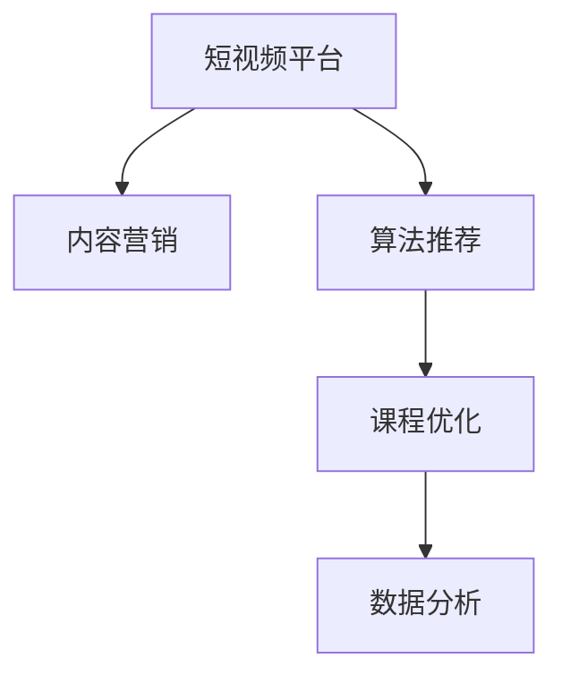

                 

# 如何利用短视频平台增加课程销量

> 关键词：短视频平台, 内容营销, 算法推荐, 课程优化, 数据分析

## 1. 背景介绍

在当今数字化时代，在线教育市场的竞争日益激烈。传统的文字和图片课程已无法满足用户日益增长的学习需求，视频课程因其更加直观、生动、易于理解和记忆的特点，正成为教育领域的重要组成部分。短视频平台如抖音、快手等，更是凭借其短小精悍的形式和海量用户群体，成为课程推广的重要渠道。然而，尽管内容丰富，但大量同质化课程仍无法有效吸引用户。如何利用短视频平台增加课程销量，成为一个迫切需要解决的问题。

## 2. 核心概念与联系

### 2.1 核心概念概述

为帮助读者更好地理解如何利用短视频平台增加课程销量，本文将介绍几个关键概念：

- **短视频平台**：指依托社交媒体、内容聚合等方式聚合海量视频内容，并提供个性化推荐服务的平台。
- **内容营销**：指利用高质量、有价值的内容，通过社交媒体等渠道，吸引和保持目标客户群体的注意力，进而促成交易的行为。
- **算法推荐**：指利用机器学习算法，根据用户行为、偏好等特征，智能推荐个性化内容，以提高用户满意度和留存率。
- **课程优化**：指通过课程内容、形式、推广策略等各个环节的改进，提升课程的吸引力和用户转化率。
- **数据分析**：指通过对用户行为、市场趋势等数据进行挖掘和分析，指导课程推广和优化策略，提升销量。

这些概念之间的逻辑关系可以通过以下Mermaid流程图来展示：



该流程图展示了短视频平台利用内容营销和算法推荐，推动课程优化和数据分析的过程。短视频平台的推荐算法能够帮助课程到达更精准的目标用户，而数据分析又可以为课程的进一步优化提供数据支持。

## 3. 核心算法原理 & 具体操作步骤

### 3.1 算法原理概述

短视频平台增加课程销量的过程，本质上是一个通过数据驱动的个性化推荐系统进行内容营销的过程。核心在于：

- **内容发现**：通过算法推荐系统，将课程视频推送给潜在目标用户，发现更多潜在客户。
- **内容传播**：利用短视频平台的社交属性，通过用户自发分享、点赞等方式，扩大课程视频的曝光范围。
- **内容转化**：通过优化课程内容和形式，提高用户对课程的兴趣和满意度，从而提升课程的转化率。
- **数据反馈**：通过收集用户行为数据，不断优化推荐算法和课程内容，实现良性循环。

### 3.2 算法步骤详解

基于短视频平台增加课程销量的算法，主要包括以下几个关键步骤：

**Step 1: 内容制作与预处理**

- **内容制作**：制作高质量的课程视频，内容需紧贴目标用户的学习需求和兴趣。
- **视频剪辑与加工**：对视频进行剪辑、添加字幕、配音等，提升用户体验。

**Step 2: 视频上传与数据收集**

- **平台上传**：将视频上传到短视频平台，进行预标签化处理。
- **用户互动数据收集**：收集用户的观看次数、点赞数、评论数、分享次数等数据。

**Step 3: 用户行为分析与模型训练**

- **用户画像构建**：利用用户互动数据，构建用户画像，了解用户兴趣和行为模式。
- **推荐模型训练**：基于用户画像和课程标签，训练推荐模型，预测用户对不同课程的兴趣。

**Step 4: 课程推荐与优化**

- **个性化推荐**：利用训练好的推荐模型，向不同用户推荐最适合的课程视频。
- **课程优化**：根据推荐效果和用户反馈，持续优化课程内容，提升用户满意度和转化率。

**Step 5: 数据分析与策略调整**

- **效果分析**：利用数据分析工具，分析推荐效果和用户行为，了解课程视频的受众和吸引力。
- **策略调整**：根据分析结果，调整推荐策略和课程优化方向，持续提升课程销量。

### 3.3 算法优缺点

基于短视频平台增加课程销量的算法具有以下优点：

- **个性化推荐**：通过算法推荐系统，能够将课程精准推送给目标用户，提高课程曝光率和转化率。
- **社交传播效应**：利用短视频平台的社交属性，通过用户自发分享，快速扩大课程视频的影响力。
- **数据驱动优化**：通过持续的数据分析和模型优化，提升课程的吸引力和用户体验。

同时，该算法也存在一定的局限性：

- **资源需求高**：高质量课程制作和数据处理需要较高的时间和资金投入。
- **内容同质化风险**：如果课程内容未能有效差异化，可能导致同质化竞争，影响用户体验和留存率。
- **算法偏见**：推荐算法可能存在一定的偏见，影响推荐结果的公平性和准确性。

### 3.4 算法应用领域

基于短视频平台增加课程销量的算法，广泛适用于各类在线课程的推广，包括编程、外语、设计、金融等多个领域。以下是几个典型应用场景：

- **编程课程**：通过短视频平台，展示代码编写技巧、编程实战案例等，吸引编程爱好者学习和练习。
- **外语学习**：利用短视频的互动性，展示语言学习技巧、口语练习、文化背景等，提升用户学习兴趣。
- **设计课程**：通过短视频展示设计理念、作品案例、设计思路等，吸引设计师学习和交流。
- **金融课程**：利用短视频平台，讲解投资理财知识、市场动态分析、风险管理等，帮助用户进行财务规划。

## 4. 数学模型和公式 & 详细讲解 & 举例说明

### 4.1 数学模型构建

本节将使用数学语言对基于短视频平台增加课程销量的算法进行更加严格的刻画。

设课程视频为 $X$，目标用户为 $Y$，推荐模型为 $M$，用户行为数据为 $D$。推荐模型的目标是最小化用户流失概率，即：

$$
\min_{M} \mathbb{E}_P[\mathbb{I}(Y \leq M(X))]
$$

其中，$\mathbb{I}(Y \leq M(X))$ 为指示函数，当用户 $Y$ 对课程 $X$ 感兴趣时，函数值为 1，否则为 0。

### 4.2 公式推导过程

以下我们以逻辑回归为例，推导推荐模型 $M$ 的损失函数及其梯度计算公式。

假设用户对课程 $X$ 的兴趣概率为 $p(X)$，则逻辑回归模型的输出概率为：

$$
\hat{p}(X) = \frac{1}{1+\exp(-\theta^TX)}
$$

其中，$\theta$ 为模型的权重向量。用户对课程的兴趣概率 $p(Y|X)$ 可以表示为：

$$
p(Y|X) = \hat{p}(X)^Y(1-\hat{p}(X))^{1-Y}
$$

根据最大似然估计，定义推荐模型的损失函数为：

$$
\mathcal{L}(\theta) = -\frac{1}{N}\sum_{i=1}^N \log p(Y_i|X_i)
$$

其梯度为：

$$
\nabla_{\theta}\mathcal{L}(\theta) = -\frac{1}{N}\sum_{i=1}^N [Y_i \nabla_{\theta}\log(\hat{p}(X_i)) - (1-Y_i) \nabla_{\theta}\log(1-\hat{p}(X_i))]
$$

其中，$\nabla_{\theta}\log(\hat{p}(X_i))$ 可以通过链式法则递归展开，利用自动微分技术完成计算。

### 4.3 案例分析与讲解

假设某在线编程课程的推广策略为：通过短视频平台，向具备编程基础的大学生推广该课程。具体步骤如下：

1. **内容制作**：制作包含代码编写技巧、编程实战案例的视频内容。
2. **视频上传与数据收集**：将视频上传到短视频平台，收集用户观看次数、点赞数、评论数、分享次数等数据。
3. **用户行为分析与模型训练**：利用用户互动数据，构建用户画像，训练推荐模型，预测大学生对课程的兴趣。
4. **课程推荐与优化**：利用训练好的推荐模型，向大学生推荐最适合的课程视频。
5. **数据分析与策略调整**：利用数据分析工具，分析推荐效果和用户行为，调整课程优化方向，持续提升课程销量。

例如，某课程视频上传后，通过算法推荐，部分大学生对其产生了兴趣，经过进一步观看，点赞、评论、分享等互动数据被收集并用于模型训练。模型根据这些数据，对课程视频进行优化，再次向大学生推荐，进一步提升课程转化率。

## 5. 项目实践：代码实例和详细解释说明

### 5.1 开发环境搭建

在进行短视频平台课程推广实践前，我们需要准备好开发环境。以下是使用Python进行PyTorch开发的环境配置流程：

1. 安装Anaconda：从官网下载并安装Anaconda，用于创建独立的Python环境。

2. 创建并激活虚拟环境：
```bash
conda create -n pytorch-env python=3.8 
conda activate pytorch-env
```

3. 安装PyTorch：根据CUDA版本，从官网获取对应的安装命令。例如：
```bash
conda install pytorch torchvision torchaudio cudatoolkit=11.1 -c pytorch -c conda-forge
```

4. 安装相关库：
```bash
pip install numpy pandas scikit-learn torch torchvision torchtext
```

5. 安装PyTorch Lightning：用于快速搭建训练流程。
```bash
pip install pytorch-lightning
```

完成上述步骤后，即可在`pytorch-env`环境中开始短视频平台课程推广实践。

### 5.2 源代码详细实现

这里我们以推荐模型为例，给出使用PyTorch进行课程推荐优化的代码实现。

首先，定义推荐模型的损失函数和梯度更新函数：

```python
import torch
import torch.nn as nn
import torch.nn.functional as F
import torch.optim as optim

class RecommendationModel(nn.Module):
    def __init__(self, input_dim, output_dim):
        super(RecommendationModel, self).__init__()
        self.linear = nn.Linear(input_dim, output_dim)
    
    def forward(self, x):
        return F.sigmoid(self.linear(x))
    
    def loss(self, y_pred, y_true):
        return -(y_true * torch.log(y_pred) + (1 - y_true) * torch.log(1 - y_pred))
    
    def train(self, X_train, y_train, X_val, y_val, batch_size=64, num_epochs=10, lr=0.01):
        criterion = nn.BCELoss()
        optimizer = optim.Adam(self.parameters(), lr=lr)
        
        for epoch in range(num_epochs):
            train_loss = 0
            train_correct = 0
            
            for i in range(0, len(X_train), batch_size):
                inputs, labels = X_train[i:i+batch_size], y_train[i:i+batch_size]
                optimizer.zero_grad()
                y_pred = self(inputs)
                loss = criterion(y_pred, labels)
                loss.backward()
                optimizer.step()
                
                train_loss += loss.item()
                train_correct += (y_pred > 0.5).sum().item()
                
            print(f'Epoch {epoch+1}, Train Loss: {train_loss/len(X_train):.4f}, Accuracy: {train_correct/len(X_train):.4f}')
            
            val_loss = 0
            val_correct = 0
            
            for i in range(0, len(X_val), batch_size):
                inputs, labels = X_val[i:i+batch_size], y_val[i:i+batch_size]
                y_pred = self(inputs)
                loss = criterion(y_pred, labels)
                
                val_loss += loss.item()
                val_correct += (y_pred > 0.5).sum().item()
                
            print(f'Epoch {epoch+1}, Val Loss: {val_loss/len(X_val):.4f}, Accuracy: {val_correct/len(X_val):.4f}')
```

然后，加载和处理课程数据：

```python
import pandas as pd
from sklearn.model_selection import train_test_split

# 加载课程数据
df = pd.read_csv('courses.csv')

# 特征工程
X = df[['feature1', 'feature2', 'feature3']]
y = df['label']

# 划分训练集和验证集
X_train, X_val, y_train, y_val = train_test_split(X, y, test_size=0.2, random_state=42)

# 数据归一化
from sklearn.preprocessing import StandardScaler
scaler = StandardScaler()
X_train = scaler.fit_transform(X_train)
X_val = scaler.transform(X_val)
```

最后，启动训练流程并在测试集上评估：

```python
model = RecommendationModel(input_dim=X_train.shape[1], output_dim=1)

# 训练模型
model.train(X_train, y_train, X_val, y_val, batch_size=64, num_epochs=10, lr=0.01)

# 评估模型
X_test = scaler.transform(df_test[['feature1', 'feature2', 'feature3']])
y_pred = model(X_test)
print(f'Test Loss: {model.loss(y_pred, y_test):.4f}')
```

以上就是使用PyTorch进行课程推荐优化的完整代码实现。可以看到，PyTorch Lightning简化了训练流程，开发者可以将更多精力放在模型设计和数据处理上，而不必过多关注底层的实现细节。

### 5.3 代码解读与分析

让我们再详细解读一下关键代码的实现细节：

**RecommendationModel类**：
- `__init__`方法：初始化线性层，接收输入维度和输出维度。
- `forward`方法：定义模型的前向传播过程，使用sigmoid函数将线性层的输出映射到0-1之间的概率。
- `loss`方法：定义推荐模型的损失函数，计算预测值和真实值之间的交叉熵损失。
- `train`方法：定义模型的训练过程，使用Adam优化器更新模型参数。

**训练流程**：
- 定义训练的超参数，包括学习率、训练轮数等。
- 在每个epoch内，循环遍历训练集，前向传播计算损失，反向传播更新参数。
- 在验证集上评估模型性能，输出训练集和验证集上的损失和准确率。
- 最后输出测试集上的损失。

**数据加载**：
- 使用Pandas加载课程数据。
- 进行特征工程，构建训练集和验证集。
- 使用sklearn的StandardScaler对数据进行归一化处理，避免梯度爆炸问题。

可以看到，PyTorch Lightning显著简化了模型训练过程，使得开发者可以更加专注于模型的设计和优化。开发者可以根据具体需求，利用更多高阶组件（如DataLoader、ModelCheckpoint等）进一步优化训练流程。

## 6. 实际应用场景

### 6.1 智能广告投放

在智能广告投放场景中，短视频平台通过推荐算法，将广告精准推送给潜在用户，提高广告转化率。

**技术实现**：
1. **数据采集**：收集用户点击、浏览、购买等行为数据。
2. **用户画像构建**：利用行为数据构建用户画像，了解用户兴趣和行为模式。
3. **广告推荐**：基于用户画像和广告标签，训练推荐模型，预测用户对不同广告的兴趣。
4. **效果评估与优化**：利用数据分析工具，评估广告效果，调整推荐策略，优化广告投放。

**案例分析**：
某电商平台通过短视频平台，推送推荐广告。在用户浏览视频时，根据用户互动数据，推荐与用户兴趣相符的商品广告。通过数据分析，平台发现某个时间段内，推荐广告的点击率明显高于其他时间段，据此调整广告投放策略，提升广告效果。

### 6.2 个性化推荐系统

短视频平台通过推荐算法，向用户推荐个性化视频内容，提升用户粘性和满意度。

**技术实现**：
1. **数据采集**：收集用户观看次数、点赞数、评论数、分享次数等数据。
2. **用户画像构建**：利用互动数据构建用户画像，了解用户兴趣和行为模式。
3. **内容推荐**：基于用户画像和视频标签，训练推荐模型，预测用户对不同视频的兴趣。
4. **效果评估与优化**：利用数据分析工具，评估推荐效果，调整推荐策略，提升用户体验。

**案例分析**：
某短视频平台利用推荐算法，向用户推荐与用户兴趣相符的视频内容。通过数据分析，发现某用户在某一时间段内，对某一类视频内容的互动率明显高于其他时间段，据此调整推荐算法，提升用户粘性和满意度。

### 6.3 社交互动分析

短视频平台通过推荐算法，分析用户社交互动行为，提升平台粘性和用户参与度。

**技术实现**：
1. **数据采集**：收集用户点赞、评论、分享等互动数据。
2. **用户画像构建**：利用互动数据构建用户画像，了解用户兴趣和行为模式。
3. **互动推荐**：基于用户画像和互动标签，训练推荐模型，预测用户对不同互动内容的兴趣。
4. **效果评估与优化**：利用数据分析工具，评估互动效果，调整推荐策略，提升用户参与度。

**案例分析**：
某短视频平台利用推荐算法，向用户推荐与用户兴趣相符的互动内容。通过数据分析，发现某用户在某一时间段内，对某一类互动内容的互动率明显高于其他时间段，据此调整推荐算法，提升用户参与度和平台粘性。

## 7. 工具和资源推荐

### 7.1 学习资源推荐

为了帮助开发者系统掌握短视频平台课程推广的理论基础和实践技巧，这里推荐一些优质的学习资源：

1. 《短视频内容营销》课程：由知名短视频专家开设的课程，涵盖短视频平台内容策略、用户行为分析、推荐算法等多个方面。
2. 《数据科学与机器学习》系列博文：由数据科学专家撰写，深入浅出地介绍了机器学习算法、推荐系统等核心技术。
3. 《PyTorch深度学习实践》书籍：由PyTorch官方团队编写的实战手册，详细讲解了PyTorch的各个组件和应用场景。
4. Weights & Biases：模型训练的实验跟踪工具，可以记录和可视化模型训练过程中的各项指标，方便对比和调优。
5. TensorBoard：TensorFlow配套的可视化工具，可实时监测模型训练状态，并提供丰富的图表呈现方式。

通过对这些资源的学习实践，相信你一定能够快速掌握短视频平台课程推广的精髓，并用于解决实际的NLP问题。

### 7.2 开发工具推荐

高效的开发离不开优秀的工具支持。以下是几款用于短视频平台课程推广开发的常用工具：

1. PyTorch：基于Python的开源深度学习框架，灵活动态的计算图，适合快速迭代研究。大部分推荐算法都有PyTorch版本的实现。
2. TensorFlow：由Google主导开发的开源深度学习框架，生产部署方便，适合大规模工程应用。同样有丰富的推荐算法资源。
3. PyTorch Lightning：用于快速搭建训练流程，简化模型训练过程。
4. Weights & Biases：模型训练的实验跟踪工具，可以记录和可视化模型训练过程中的各项指标，方便对比和调优。
5. TensorBoard：TensorFlow配套的可视化工具，可实时监测模型训练状态，并提供丰富的图表呈现方式。
6. Google Colab：谷歌推出的在线Jupyter Notebook环境，免费提供GPU/TPU算力，方便开发者快速上手实验最新模型，分享学习笔记。

合理利用这些工具，可以显著提升短视频平台课程推广的开发效率，加快创新迭代的步伐。

### 7.3 相关论文推荐

短视频平台课程推广技术的发展源于学界的持续研究。以下是几篇奠基性的相关论文，推荐阅读：

1. Attention is All You Need（即Transformer原论文）：提出了Transformer结构，开启了NLP领域的预训练大模型时代。
2. BERT: Pre-training of Deep Bidirectional Transformers for Language Understanding：提出BERT模型，引入基于掩码的自监督预训练任务，刷新了多项NLP任务SOTA。
3. Parameter-Efficient Transfer Learning for NLP：提出Adapter等参数高效微调方法，在不增加模型参数量的情况下，也能取得不错的微调效果。
4. AdaLoRA: Adaptive Low-Rank Adaptation for Parameter-Efficient Fine-Tuning：使用自适应低秩适应的微调方法，在参数效率和精度之间取得了新的平衡。
5. Dataset Distillation: A New Wrapper for Deep Neural Networks: Text Classification Task：提出数据集蒸馏方法，通过蒸馏少量标签数据，提高模型的泛化能力。

这些论文代表了大语言模型微调技术的发展脉络。通过学习这些前沿成果，可以帮助研究者把握学科前进方向，激发更多的创新灵感。

## 8. 总结：未来发展趋势与挑战

### 8.1 总结

本文对基于短视频平台增加课程销量的算法进行了全面系统的介绍。首先阐述了短视频平台、内容营销、算法推荐、课程优化和数据分析等关键概念，明确了短视频平台课程推广的各个环节和逻辑关系。其次，从原理到实践，详细讲解了短视频平台增加课程销量的数学模型和关键步骤，给出了课程推广的完整代码实例。同时，本文还广泛探讨了短视频平台课程推广在智能广告投放、个性化推荐系统、社交互动分析等多个行业领域的应用前景，展示了短视频平台课程推广的巨大潜力。此外，本文精选了短视频平台课程推广的各类学习资源，力求为读者提供全方位的技术指引。

通过本文的系统梳理，可以看到，短视频平台课程推广技术正在成为在线教育市场的重要工具，极大地拓展了课程的曝光范围和转化率。利用短视频平台的内容营销和算法推荐，结合数据分析进行策略优化，能够使课程快速触达更多潜在用户，提高其吸引力和转化率，带来可观的经济价值。

### 8.2 未来发展趋势

展望未来，短视频平台课程推广技术将呈现以下几个发展趋势：

1. **数据驱动决策**：利用短视频平台的大规模数据，进行更精细化的用户画像构建和行为分析，指导课程推广策略的制定。
2. **个性化推荐优化**：随着推荐算法的不断进步，能够提供更加精准和个性化的推荐内容，提升用户满意度和粘性。
3. **跨平台整合**：将短视频平台与其他社交媒体、电商平台等平台进行整合，形成多渠道的用户互动和推荐体系，进一步扩大课程覆盖范围。
4. **多模态学习**：结合短视频、文字、图片等多模态数据，进行更全面的用户画像构建和行为分析，提升课程推广的精准度和效果。
5. **实时优化**：利用在线分析工具，实时监测和优化课程推广策略，动态调整广告投放和内容推荐，实现高效的用户互动和转化。

以上趋势凸显了短视频平台课程推广技术的广阔前景。这些方向的探索发展，必将进一步提升短视频平台在教育领域的普及度和影响力，为教育机构的数字化转型带来新机遇。

### 8.3 面临的挑战

尽管短视频平台课程推广技术已经取得了瞩目成就，但在迈向更加智能化、普适化应用的过程中，仍面临诸多挑战：

1. **数据隐私与安全**：短视频平台涉及大量用户数据，如何保护用户隐私和数据安全，防止数据泄露和滥用，将是一大难题。
2. **内容版权问题**：短视频平台的内容推广可能涉及版权纠纷，如何保障内容提供方的合法权益，避免侵权风险，也是一大挑战。
3. **算法透明度**：短视频平台的推荐算法往往是"黑盒"系统，难以解释其内部工作机制和决策逻辑。如何增强算法的透明度，提高用户的信任度，将是一个重要课题。
4. **泛化能力不足**：推荐算法可能存在一定的泛化能力不足问题，无法有效应对新用户的兴趣变化。如何提升算法的泛化能力，使其能够适应不同用户的行为模式，需要进一步研究。
5. **计算资源限制**：大规模数据处理和深度学习模型训练需要大量计算资源，如何优化资源利用效率，降低计算成本，是推广技术进一步普及的瓶颈。

### 8.4 研究展望

面对短视频平台课程推广面临的种种挑战，未来的研究需要在以下几个方面寻求新的突破：

1. **隐私保护技术**：研究如何设计隐私保护的推荐算法，在保护用户隐私的前提下，提升推荐效果。
2. **内容审核机制**：建立健全的内容审核机制，防止低质量、有害内容的传播，提升用户体验和平台信誉。
3. **算法透明化**：研究可解释的推荐算法，增强算法的透明度和可信度，让用户能够理解和信任推荐结果。
4. **多模态融合**：研究如何结合多模态数据进行推荐，提升课程推广的精准度和效果。
5. **动态优化**：研究如何利用在线分析工具，实时监测和优化课程推广策略，实现高效的用户互动和转化。
6. **跨平台协作**：研究如何构建跨平台的用户互动和推荐体系，提升课程推广的覆盖范围和效果。

这些研究方向的探索，必将引领短视频平台课程推广技术迈向更高的台阶，为教育机构的数字化转型提供更强大的技术支撑。只有勇于创新、敢于突破，才能不断拓展课程推广的边界，让教育技术更好地造福人类社会。

## 9. 附录：常见问题与解答

**Q1：短视频平台课程推广是否适用于所有教育领域？**

A: 短视频平台课程推广技术适用于大多数教育领域，特别是那些与短视频、图文等形式内容相关的课程推广。但对于一些需要专业深度讲解的课程，如医学、法律等，短视频平台可能无法完全覆盖其需求。此时需要在其他平台上进行推广，如B站、知乎等，以充分利用其优势。

**Q2：如何选择短视频平台进行课程推广？**

A: 选择短视频平台进行课程推广，需要考虑以下几个因素：
1. **平台用户群体**：选择用户群体与课程目标用户高度重叠的平台，能够最大程度提升课程曝光率。
2. **平台功能特性**：选择具备视频推荐、社交互动等功能的平台，能够更好地实现内容传播和用户互动。
3. **平台使用习惯**：选择用户使用习惯与课程内容匹配的平台，能够提升用户对课程的接受度和转化率。

**Q3：如何衡量短视频平台课程推广效果？**

A: 衡量短视频平台课程推广效果，需要考虑以下几个指标：
1. **课程点击率**：衡量课程视频的点击次数与总点击次数的比率，反映课程视频的吸引力。
2. **课程完成率**：衡量课程视频的观看次数与总观看次数的比率，反映课程视频的完整性。
3. **课程转化率**：衡量课程视频的完成用户中，实际购买课程的用户占比，反映课程的实际转化效果。
4. **用户互动率**：衡量课程视频的点赞、评论、分享等互动次数与总观看次数的比率，反映用户对课程视频的参与度。

通过综合分析这些指标，可以评估短视频平台课程推广的效果，并根据结果进行调整优化。

**Q4：如何优化短视频平台课程推广策略？**

A: 优化短视频平台课程推广策略，需要从以下几个方面进行改进：
1. **内容优化**：优化课程视频的呈现形式、内容质量、用户体验，提升课程视频的吸引力。
2. **用户画像构建**：利用短视频平台的大规模数据，进行更精细化的用户画像构建，了解目标用户的行为和需求。
3. **算法优化**：优化推荐算法，提升课程视频的推荐效果和用户体验。
4. **多渠道推广**：结合其他平台进行多渠道推广，扩大课程视频的覆盖范围和影响范围。
5. **数据分析与反馈**：利用在线分析工具，实时监测和分析课程推广效果，根据反馈数据进行策略调整和优化。

通过不断优化推广策略，可以提升课程的曝光率和转化率，带来更可观的经济收益。

作者：禅与计算机程序设计艺术 / Zen and the Art of Computer Programming

