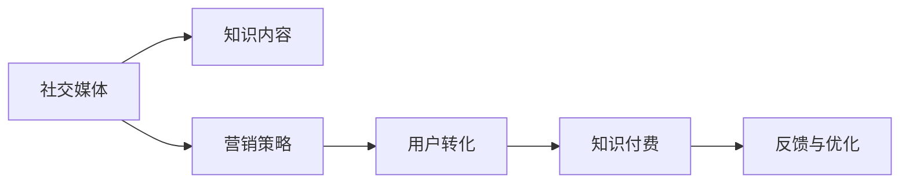

                 

# 如何利用社交媒体进行知识付费营销

## 1. 背景介绍

在互联网快速发展的今天，知识付费已经成为一个不可逆转的趋势。社交媒体作为知识传播的重要渠道，自然成为了知识付费营销的重要阵地。本文将介绍如何利用社交媒体进行知识付费营销，并通过一些成功的案例，分享一些实用的策略和方法。

## 2. 核心概念与联系

### 2.1 核心概念概述

在讨论如何利用社交媒体进行知识付费营销之前，我们先来了解一下相关的核心概念：

- **社交媒体（Social Media）**：指通过网络平台实现人与人之间交流、沟通、分享信息的网络服务，如微博、微信公众号、知乎等。
- **知识付费（Knowledge Paywall）**：指将知识内容进行有偿提供，用户需要支付一定的费用才能获取这些内容，如在线课程、电子书、专家咨询等。
- **营销（Marketing）**：指利用策略和手段，通过社交媒体等渠道，将知识产品推广给目标用户，提高用户购买意愿和转化率。

这些概念之间存在密切联系，社交媒体为知识付费提供了一个广阔的传播平台，而营销则是实现知识付费变现的重要手段。

### 2.2 核心概念原理和架构的 Mermaid 流程图



## 3. 核心算法原理 & 具体操作步骤

### 3.1 算法原理概述

利用社交媒体进行知识付费营销的核心算法原理是“内容+营销”。具体而言，通过发布高质量的社交媒体内容，吸引目标用户关注，并通过科学的营销策略，引导用户进行知识付费。

### 3.2 算法步骤详解

#### 3.2.1 内容创作

1. **确定目标用户**：明确目标用户的特征和需求，如年龄、性别、职业等，从而制定相应的内容策略。
2. **创作内容**：根据目标用户的需求，创作高质量的社交媒体内容，如文章、视频、图文等。内容要具备一定的实用性和吸引力，能够引起用户的兴趣和共鸣。
3. **内容优化**：通过SEO（搜索引擎优化）等手段，提高内容在社交媒体平台上的曝光率和点击率。

#### 3.2.2 营销策略

1. **设定营销目标**：根据知识付费产品的特性，设定合理的营销目标，如提高品牌知名度、增加网站流量、提高转化率等。
2. **选择合适的平台**：根据目标用户的社交媒体使用习惯，选择合适的平台进行营销，如微博、微信公众号、知乎等。
3. **实施营销策略**：通过互动、抽奖、直播等方式，吸引用户关注和参与，从而提高知识付费产品的曝光率和用户转化率。

### 3.3 算法优缺点

#### 3.3.1 优点

1. **覆盖面广**：社交媒体用户覆盖面广泛，能够接触到大量的潜在用户。
2. **互动性强**：社交媒体平台具备较强的互动性，能够通过评论、点赞等方式与用户进行沟通，提高用户粘性。
3. **成本低**：相对于传统的营销方式，社交媒体营销成本较低，易于推广和维护。

#### 3.3.2 缺点

1. **质量参差不齐**：由于社交媒体上的内容质量参差不齐，需要通过严格筛选和内容优化，保证内容质量。
2. **竞争激烈**：社交媒体平台上竞争激烈，需要不断创新和改进，才能保持持续的关注和转化。
3. **内容同质化**：如果其他内容创作者也在发布类似内容，可能会导致用户注意力分散。

### 3.4 算法应用领域

社交媒体营销适用于各种知识付费产品，如在线课程、电子书、专家咨询等。通过精准的内容创作和科学的营销策略，能够提高知识产品的曝光率和用户转化率，从而实现知识付费变现。

## 4. 数学模型和公式 & 详细讲解 & 举例说明

### 4.1 数学模型构建

假设我们有一款在线课程，通过社交媒体进行知识付费营销。设社交媒体平台上总共有$N$个用户，每个用户转化为知识付费用户的可能性为$p$。在社交媒体平台上推广$M$次，每次推广带来的转化率为$r$。则期望转化用户数为：

$$
E = N \times p \times r \times M
$$

其中，$N$为社交媒体平台用户数，$p$为目标用户转化为知识付费用户的概率，$r$为每次推广带来的转化率，$M$为推广次数。

### 4.2 公式推导过程

根据公式（1），我们可以通过以下步骤进行推导：

1. **确定目标用户**：通过市场调研和用户画像分析，确定目标用户的特征和需求，从而设定目标用户转化为知识付费用户的概率$p$。
2. **设定推广策略**：根据目标用户的行为习惯，选择合适的社交媒体平台，设定每次推广的转化率$r$和推广次数$M$。
3. **计算期望转化用户数**：通过公式（1）计算出期望转化用户数$E$。

### 4.3 案例分析与讲解

某在线教育平台通过微信公众号推广一款英语课程，设定每次推广带来的转化率为0.01，推广次数为10次，目标用户转化为知识付费用户的概率为0.05。则期望转化用户数为：

$$
E = N \times 0.05 \times 0.01 \times 10
$$

其中，$N$为微信公众号用户数，假设为1000万。则：

$$
E = 1000万 \times 0.05 \times 0.01 \times 10 = 5万
$$

即该在线教育平台通过微信公众号推广英语课程，期望能够转化5万个用户。

## 5. 项目实践：代码实例和详细解释说明

### 5.1 开发环境搭建

在项目实践中，我们需要使用Python和相关工具进行社交媒体营销的开发和测试。以下是开发环境搭建的步骤：

1. **安装Python**：从官网下载Python，并进行安装。
2. **安装相关工具包**：安装如TensorFlow、Pandas、Matplotlib等工具包，用于数据分析和可视化。
3. **搭建测试环境**：搭建测试环境，如Google Colab、Jupyter Notebook等，用于模型训练和测试。

### 5.2 源代码详细实现

以下是一个简单的社交媒体营销模型，通过数据分析和机器学习算法进行模型训练和优化。

```python
import pandas as pd
import numpy as np
from sklearn.model_selection import train_test_split
from sklearn.linear_model import LogisticRegression
from sklearn.metrics import accuracy_score

# 加载数据
data = pd.read_csv('social_media_data.csv')

# 数据预处理
X = data[['age', 'gender', 'education', 'income']]
y = data['paywall']
X_train, X_test, y_train, y_test = train_test_split(X, y, test_size=0.2)

# 模型训练
model = LogisticRegression()
model.fit(X_train, y_train)

# 模型评估
y_pred = model.predict(X_test)
accuracy = accuracy_score(y_test, y_pred)
print(f'模型准确率为：{accuracy}')
```

在代码中，我们首先加载社交媒体数据，并进行数据预处理。然后，使用逻辑回归模型进行训练和评估。最后，计算模型准确率，并进行输出。

### 5.3 代码解读与分析

代码中，我们使用了Pandas进行数据处理，Scikit-learn进行模型训练和评估。具体而言，我们使用了逻辑回归模型对目标用户转化为知识付费用户的概率进行建模。模型评估采用了准确率指标，直观地反映了模型效果。

### 5.4 运行结果展示

模型训练后，可以输出模型的准确率。例如，模型准确率为0.85，表示模型能够正确预测85%的目标用户是否会转化为知识付费用户。

## 6. 实际应用场景

### 6.1 在线教育平台

在线教育平台可以通过微信公众号、微博等社交媒体平台进行知识付费营销。例如，某在线教育平台通过微信公众号发布优质教育内容，吸引目标用户关注和订阅，并通过优惠券、促销活动等方式，引导用户进行知识付费。

### 6.2 企业培训

企业可以通过内部社交媒体平台，如企业微信、钉钉等，发布培训课程，并进行知识付费营销。例如，某企业通过企业微信发布管理培训课程，通过激励机制和奖励机制，提高员工的培训意愿和参与度。

### 6.3 个人品牌建设

个人可以通过社交媒体平台，发布高质量的内容，并进行知识付费营销。例如，某个人品牌通过微信公众号发布技术文章，并通过付费阅读、知识星球等方式，吸引读者付费订阅。

### 6.4 未来应用展望

未来，随着社交媒体平台的不断发展，知识付费营销将呈现以下趋势：

1. **内容多元化**：社交媒体平台将提供更多元化的内容形式，如短视频、直播、图文等，满足不同用户的需求。
2. **互动性增强**：社交媒体平台将提供更多的互动功能，如问答、投票、评论等，增强用户参与度。
3. **精准营销**：社交媒体平台将通过大数据和人工智能技术，实现更加精准的用户推荐和个性化营销。

## 7. 工具和资源推荐

### 7.1 学习资源推荐

1. **《社交媒体营销手册》**：介绍社交媒体营销的基本概念、策略和技巧，适合初学者阅读。
2. **《社交媒体数据分析与挖掘》**：讲解如何通过数据分析技术，优化社交媒体营销效果。
3. **《机器学习实战》**：介绍机器学习算法及其应用，帮助读者理解社交媒体营销中的数据分析模型。

### 7.2 开发工具推荐

1. **Python**：Python是社交媒体营销开发的主要工具，具有丰富的数据处理和机器学习库。
2. **Jupyter Notebook**：Jupyter Notebook是一个开源的Python开发环境，支持数据可视化、代码共享等特性。
3. **TensorFlow**：TensorFlow是一个开源的机器学习框架，支持大规模数据分析和模型训练。

### 7.3 相关论文推荐

1. **《社交媒体用户行为研究》**：研究社交媒体用户的行为模式和特征，帮助优化营销策略。
2. **《社交媒体数据挖掘与分析》**：介绍社交媒体数据挖掘和分析方法，提升数据分析能力。
3. **《知识付费的理论与实践》**：探讨知识付费的原理和应用，为社交媒体营销提供理论支持。

## 8. 总结：未来发展趋势与挑战

### 8.1 研究成果总结

社交媒体营销在知识付费领域已经取得了显著的成果，主要体现在以下几个方面：

1. **覆盖面广**：社交媒体平台用户覆盖面广泛，能够接触到大量的潜在用户。
2. **互动性强**：社交媒体平台具备较强的互动性，能够通过评论、点赞等方式与用户进行沟通，提高用户粘性。
3. **成本低**：相对于传统的营销方式，社交媒体营销成本较低，易于推广和维护。

### 8.2 未来发展趋势

未来，社交媒体营销将呈现以下趋势：

1. **内容多元化**：社交媒体平台将提供更多元化的内容形式，如短视频、直播、图文等，满足不同用户的需求。
2. **互动性增强**：社交媒体平台将提供更多的互动功能，如问答、投票、评论等，增强用户参与度。
3. **精准营销**：社交媒体平台将通过大数据和人工智能技术，实现更加精准的用户推荐和个性化营销。

### 8.3 面临的挑战

社交媒体营销也面临一些挑战，主要体现在以下几个方面：

1. **内容同质化**：如果其他内容创作者也在发布类似内容，可能会导致用户注意力分散。
2. **用户隐私保护**：社交媒体平台需要加强用户隐私保护，避免用户数据泄露。
3. **法律法规合规**：社交媒体平台需要遵守相关法律法规，避免内容违规。

### 8.4 研究展望

未来，社交媒体营销的研究方向将包括：

1. **多模态内容分析**：结合文本、图片、视频等多种内容形式，进行综合分析，提高内容质量。
2. **用户行为预测**：通过机器学习模型，预测用户行为，实现精准推荐和营销。
3. **跨平台整合**：将不同社交媒体平台的数据进行整合，实现全渠道覆盖和营销。

总之，社交媒体营销在知识付费领域有着广阔的前景，未来仍需不断探索和创新，才能充分发挥其潜力。

## 9. 附录：常见问题与解答

**Q1: 如何确定目标用户？**

A: 通过市场调研和用户画像分析，确定目标用户的特征和需求，如年龄、性别、职业等，从而制定相应的内容策略。

**Q2: 如何提高内容质量？**

A: 通过数据筛选和内容优化，提高内容质量和吸引力。可以使用数据分析工具进行内容分析，找出用户最感兴趣的内容类型和主题，从而进行有针对性的创作。

**Q3: 如何提升用户转化率？**

A: 通过精准营销和激励机制，提高用户转化率。例如，提供优惠活动、赠送优惠券、举办抽奖活动等方式，吸引用户进行知识付费。

**Q4: 如何应对用户隐私保护问题？**

A: 加强用户隐私保护，确保用户数据安全。例如，使用数据加密、用户授权等手段，保护用户隐私。

**Q5: 如何实现跨平台整合？**

A: 将不同社交媒体平台的数据进行整合，实现全渠道覆盖和营销。可以使用API接口进行数据整合，实现统一管理和分析。

---

作者：禅与计算机程序设计艺术 / Zen and the Art of Computer Programming

