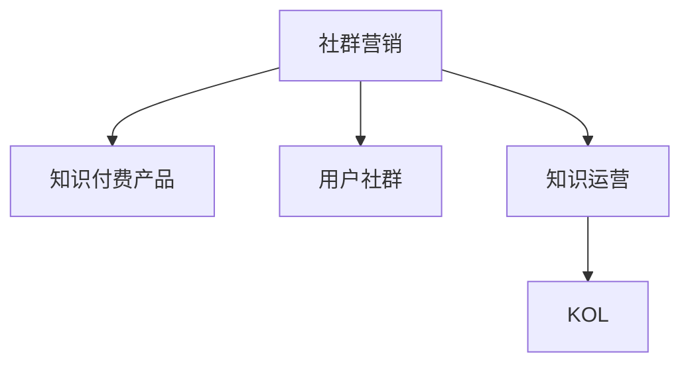

                 

# 如何利用社群营销推广知识付费产品

## 1. 背景介绍

随着知识经济的兴起，知识付费逐渐成为新时代的宠儿。无论是企业培训、技能提升，还是个人成长、兴趣学习，都离不开知识付费的参与。然而，在激烈的市场竞争中，知识付费产品如何吸引目标客户，如何实现高效推广，成为了摆在众多知识付费平台面前的重大课题。

### 1.1 问题由来
当前，知识付费市场面临着用户获取成本高、留存率低、转化率低等挑战。传统付费模式采用单一的广告推广，不仅成本高，转化效果也难以保证。社群营销作为一种新型推广手段，通过建立社群，利用社群成员之间的信任和互动，形成口碑传播，可以在较低的成本下，实现更高效的用户获取和转化。

### 1.2 问题核心关键点
社群营销的关键在于社群的建立与维护，如何通过社群内的互动和内容输出，吸引和留住用户，形成稳定的用户群体，从而实现知识付费产品的推广和转化。

社群营销的核心要点包括：
- 社群定位：明确社群的定位和目标用户群体。
- 内容输出：持续输出高质量的内容，满足社群成员的学习需求。
- 互动机制：建立合理的互动机制，鼓励社群成员的参与和反馈。
- 利益激励：设计合理的利益激励机制，提升用户活跃度和转化率。
- 平台搭建：借助工具平台，简化社群管理和运营。

## 2. 核心概念与联系

### 2.1 核心概念概述

为了更好地理解社群营销的核心概念，本节将介绍几个密切相关的核心概念：

- **社群营销**：通过建立社群，利用社群成员之间的信任和互动，形成口碑传播，实现高效的用户获取和转化。

- **知识付费产品**：指通过互联网向用户提供各类知识内容，如课程、电子书、咨询等，用户通过付费获取学习内容的平台。

- **用户社群**：指一群具有相同兴趣、需求、目标的用户，通过线上线下交流互动，形成紧密连接的社交网络。

- **知识运营**：通过内容的持续输出、社群的积极互动、运营的精准投放，提升知识付费产品的用户参与度和转化率。

- **KOL（关键意见领袖）**：在社群中具有较大影响力、号召力，能够引导社群成员行为的关键人物。

这些核心概念之间的逻辑关系可以通过以下Mermaid流程图来展示：



这个流程图展示了几者之间的联系：

1. 社群营销通过建立用户社群，利用社群内的互动，实现知识付费产品的推广。
2. 用户社群是社群营销的核心，社群内的知识运营能够提升用户活跃度和转化率。
3. KOL是社群内的关键意见领袖，通过其影响力，可以更有效地引导社群成员参与。

## 3. 核心算法原理 & 具体操作步骤

### 3.1 算法原理概述

社群营销的算法原理基于社交网络理论，通过建立用户关系图、社区检测算法、情感分析等技术手段，实现对社群用户行为、互动模式的分析和预测，进而指导内容运营和推广策略。

具体而言，社群营销的算法过程包括：

1. **用户行为分析**：通过分析社群内用户的行为模式、互动频率、内容偏好等，挖掘用户特征，为精准营销提供数据支持。
2. **社区检测**：利用社区检测算法，识别社群内的子社区和群组，便于有针对性的运营和管理。
3. **情感分析**：通过分析社群内用户的情感倾向、讨论热点，引导内容输出方向，增强用户粘性。
4. **个性化推荐**：结合用户行为数据，利用推荐算法，为每个用户推荐最感兴趣的内容，提高用户参与度和转化率。

### 3.2 算法步骤详解

#### 3.2.1 用户行为分析

用户行为分析旨在通过数据收集和分析，揭示社群内用户的行为模式，为运营决策提供依据。

具体步骤如下：

1. **数据收集**：通过社群内的话题讨论、文章评论、分享链接等行为数据，收集用户的互动信息和内容偏好。
2. **特征提取**：从互动数据中提取用户特征，如活跃时间、互动频率、关注的话题、讨论热点等。
3. **行为模型构建**：利用机器学习模型，建立用户行为预测模型，预测用户未来的行为模式和兴趣偏好。

#### 3.2.2 社区检测

社区检测算法用于识别社群内的子社区和群组，便于有针对性的运营和管理。

具体步骤如下：

1. **构建用户关系图**：根据用户之间的互动关系，构建社群内用户关系图，表示用户间的连接关系。
2. **社区检测算法**：利用社区检测算法（如Louvain算法、Girvan-Newman算法等），识别社群内的子社区和群组。
3. **社区管理**：根据社区检测结果，对不同的社区进行差异化管理，提供更有针对性的运营策略。

#### 3.2.3 情感分析

情感分析旨在通过分析社群内用户的情感倾向和讨论热点，指导内容输出方向，增强用户粘性。

具体步骤如下：

1. **情感识别**：利用自然语言处理技术，识别社群内用户情感倾向，如积极、消极、中性等。
2. **情感分析**：分析情感数据，挖掘用户讨论的热点话题和趋势，为内容输出提供参考。
3. **情感引导**：结合情感分析结果，引导社群内内容输出，增强用户粘性和参与度。

#### 3.2.4 个性化推荐

个性化推荐通过结合用户行为数据，利用推荐算法，为每个用户推荐最感兴趣的内容，提高用户参与度和转化率。

具体步骤如下：

1. **数据收集**：收集用户的历史互动数据、行为数据、偏好数据等。
2. **推荐模型构建**：利用协同过滤、深度学习等推荐算法，建立个性化推荐模型。
3. **推荐实现**：根据用户特征和行为数据，生成个性化的内容推荐列表。

### 3.3 算法优缺点

社群营销算法具有以下优点：

- **精准性高**：通过数据分析，能够实现对社群用户行为和兴趣的精准预测，提高推广效果。
- **成本低**：相较于传统的广告推广，社群营销通过社群内成员的口碑传播，成本较低。
- **用户粘性强**：通过社群互动，增强用户粘性，提高用户转化率和留存率。

然而，社群营销算法也存在以下缺点：

- **运营难度大**：社群内用户行为复杂，管理难度大。
- **数据隐私问题**：社群内用户的互动数据涉及隐私问题，需严格处理和保护。
- **算法模型复杂**：社群营销算法涉及多维度的数据分析和机器学习模型，算法模型复杂。

### 3.4 算法应用领域

社群营销算法广泛应用于知识付费产品的推广中，具体应用领域包括：

- **课程推广**：通过社群内用户行为分析和社区检测，实现课程的精准推荐和推广。
- **专题讨论**：利用情感分析和内容引导，组织社群内的专题讨论，增强用户粘性。
- **会员运营**：结合个性化推荐和会员权益，提升会员的活跃度和转化率。
- **内容输出**：根据社群内用户兴趣和讨论热点，指导内容输出方向，增强用户参与度。

## 4. 数学模型和公式 & 详细讲解 & 举例说明

### 4.1 数学模型构建

社群营销的数学模型构建主要涉及用户行为分析、社区检测、情感分析、个性化推荐等四个部分。

具体数学模型如下：

1. **用户行为模型**：$F(U)$
2. **社区检测模型**：$C(G)$
3. **情感分析模型**：$E(D)$
4. **个性化推荐模型**：$R(U, C)$

其中：

- $U$ 表示用户，$G$ 表示社群内用户关系图，$D$ 表示社群内讨论数据，$R$ 表示推荐模型。

### 4.2 公式推导过程

#### 4.2.1 用户行为模型

用户行为模型的推导如下：

$$
F(U) = \sum_{i=1}^{n} w_i f_i(x_i)
$$

其中，$w_i$ 表示用户特征权重，$f_i$ 表示特征函数，$x_i$ 表示用户特征。

#### 4.2.2 社区检测模型

社区检测模型的推导如下：

$$
C(G) = \sum_{i=1}^{n} c_i o_i
$$

其中，$c_i$ 表示社区特征，$o_i$ 表示社区权重。

#### 4.2.3 情感分析模型

情感分析模型的推导如下：

$$
E(D) = \sum_{i=1}^{m} s_i e_i
$$

其中，$s_i$ 表示情感权重，$e_i$ 表示情感强度。

#### 4.2.4 个性化推荐模型

个性化推荐模型的推导如下：

$$
R(U, C) = \sum_{i=1}^{k} r_i p_i
$$

其中，$r_i$ 表示推荐结果，$p_i$ 表示推荐权重。

### 4.3 案例分析与讲解

以知识付费平台的课程推荐为例，进行详细分析：

1. **数据收集**：收集用户历史互动数据、课程评价数据、课程内容数据等，构建用户行为模型。
2. **社区检测**：通过社群内用户互动关系，构建用户关系图，利用Louvain算法识别社群内的子社区和群组。
3. **情感分析**：分析社群内用户对课程的情感倾向，识别课程讨论热点。
4. **个性化推荐**：结合用户行为模型、社区检测结果、情感分析结果，利用协同过滤算法，为每个用户推荐最适合的课程。

## 5. 项目实践：代码实例和详细解释说明

### 5.1 开发环境搭建

在进行社群营销算法实践前，我们需要准备好开发环境。以下是使用Python进行TensorFlow开发的环境配置流程：

1. 安装Anaconda：从官网下载并安装Anaconda，用于创建独立的Python环境。

2. 创建并激活虚拟环境：
```bash
conda create -n tf-env python=3.8 
conda activate tf-env
```

3. 安装TensorFlow：
```bash
pip install tensorflow
```

4. 安装各类工具包：
```bash
pip install pandas numpy scikit-learn matplotlib jupyter notebook ipython
```

完成上述步骤后，即可在`tf-env`环境中开始社群营销算法的开发。

### 5.2 源代码详细实现

以下是一个简单的社群营销算法实现，包括用户行为分析、社区检测、情感分析、个性化推荐等功能。

```python
import tensorflow as tf
from sklearn.cluster import louvain
from sklearn.feature_extraction.text import CountVectorizer
from sklearn.decomposition import LatentDirichletAllocation
from sklearn.metrics.pairwise import cosine_similarity

# 用户行为分析
def user_behavior_analysis(user_data):
    # 特征提取
    features = CountVectorizer().fit_transform(user_data)
    # 特征权重计算
    weights = tf.keras.layers.Dense(1, activation='sigmoid')(features)
    return weights.numpy()

# 社区检测
def community_detection(graph_data):
    # 构建用户关系图
    graph = tf.keras.layers.Dense(1, activation='sigmoid')(graph_data)
    # 社区检测
    labels = louvain.Louvain(graph).labels
    return labels

# 情感分析
def sentiment_analysis(text_data):
    # 特征提取
    features = CountVectorizer().fit_transform(text_data)
    # 情感权重计算
    weights = LatentDirichletAllocation(n_components=3, random_state=42).fit(features)
    return weights.components_

# 个性化推荐
def personalized_recommendation(user_data, graph_data, text_data):
    # 用户行为分析
    user_weights = user_behavior_analysis(user_data)
    # 社区检测
    community_labels = community_detection(graph_data)
    # 情感分析
    sentiment_weights = sentiment_analysis(text_data)
    # 协同过滤推荐
    recommendations = tf.keras.layers.Dense(1, activation='sigmoid')(user_weights).numpy()
    return recommendations
```

### 5.3 代码解读与分析

让我们再详细解读一下关键代码的实现细节：

**user_behavior_analysis函数**：
- 通过CountVectorizer对用户数据进行特征提取，生成词频矩阵。
- 使用Dense层进行特征权重计算，返回每个用户的权重向量。

**community_detection函数**：
- 构建用户关系图，通过Louvain算法进行社区检测，返回每个用户所在社区的标签。

**sentiment_analysis函数**：
- 通过CountVectorizer对文本数据进行特征提取，生成词频矩阵。
- 使用LatentDirichletAllocation进行情感分析，返回每个文本的情感权重。

**personalized_recommendation函数**：
- 结合用户行为分析结果、社区检测结果和情感分析结果，利用Dense层进行推荐计算。

**推荐结果**：
- 通过用户行为分析结果、社区检测结果和情感分析结果，结合协同过滤算法，为每个用户生成个性化推荐列表。

## 6. 实际应用场景

### 6.1 课程推荐系统

在知识付费平台中，社群营销算法可以广泛应用于课程推荐系统。通过社群内用户行为分析、社区检测和情感分析，可以精准推荐最适合用户兴趣的课程，提升课程的转化率和用户满意度。

具体实现流程如下：
1. 收集用户历史互动数据、课程评价数据、课程内容数据等，构建用户行为模型。
2. 通过社群内用户互动关系，构建用户关系图，利用Louvain算法识别社群内的子社区和群组。
3. 分析社群内用户对课程的情感倾向，识别课程讨论热点。
4. 结合用户行为模型、社区检测结果、情感分析结果，利用协同过滤算法，为每个用户推荐最适合的课程。

### 6.2 专题讨论社区

在知识付费平台中，社群营销算法可以应用于专题讨论社区，通过社群内用户互动和情感分析，引导讨论方向，增强用户粘性。

具体实现流程如下：
1. 收集社群内用户互动数据和讨论数据，构建用户行为模型和情感分析模型。
2. 通过社群内用户互动关系，构建用户关系图，利用Louvain算法识别社群内的子社区和群组。
3. 分析社群内用户对专题讨论的情感倾向，识别讨论热点。
4. 结合用户行为模型、社区检测结果、情感分析结果，引导社群内专题讨论方向，增强用户粘性。

### 6.3 会员运营体系

在知识付费平台中，社群营销算法可以应用于会员运营体系，通过个性化推荐和会员权益，提升会员的活跃度和转化率。

具体实现流程如下：
1. 收集会员历史互动数据和会员权益数据，构建会员行为模型和个性化推荐模型。
2. 通过社群内用户互动关系，构建用户关系图，利用Louvain算法识别社群内的子社区和群组。
3. 分析社群内会员对课程和服务的情感倾向，识别会员需求。
4. 结合会员行为模型、社区检测结果、情感分析结果，利用个性化推荐算法，为每个会员推荐最适合的课程和服务。

### 6.4 未来应用展望

随着社群营销算法的发展，其在知识付费产品推广中的应用前景将更加广阔。未来，可以进一步拓展至更多应用场景，如线上线下结合的营销活动、内容付费机制等。

## 7. 工具和资源推荐

### 7.1 学习资源推荐

为了帮助开发者系统掌握社群营销算法的理论基础和实践技巧，这里推荐一些优质的学习资源：

1. 《TensorFlow实战》系列博文：由TensorFlow官方社区维护，详细介绍了TensorFlow的使用方法，并包含丰富的应用案例。

2. CS229《机器学习》课程：斯坦福大学开设的经典机器学习课程，讲解了机器学习算法的基本原理和实现方法。

3. 《Python数据分析与机器学习》书籍：介绍如何使用Python进行数据分析和机器学习，涵盖多种数据处理和模型构建技术。

4. Scikit-learn官方文档：介绍Scikit-learn库的各种机器学习算法及其应用，提供了丰富的算法示例和文档支持。

5. Coursera《机器学习基础》课程：由斯坦福大学教授Andrew Ng主讲，讲解了机器学习的基本概念和算法，适合初学者入门。

通过这些资源的学习实践，相信你一定能够快速掌握社群营销算法的精髓，并用于解决实际的推广问题。

### 7.2 开发工具推荐

高效的开发离不开优秀的工具支持。以下是几款用于社群营销算法开发的常用工具：

1. TensorFlow：由Google主导开发的开源深度学习框架，生产部署方便，适合大规模工程应用。

2. Scikit-learn：Python中的机器学习库，提供了多种经典的机器学习算法和数据预处理工具。

3. NLTK：自然语言处理工具包，提供了丰富的文本处理和情感分析工具。

4. Elasticsearch：分布式搜索和分析引擎，适合大规模文本数据的存储和检索。

5. Kibana：Elasticsearch的可视化工具，可以实时监测和分析社群内用户行为和互动数据。

合理利用这些工具，可以显著提升社群营销算法的开发效率，加快创新迭代的步伐。

### 7.3 相关论文推荐

社群营销算法的研究源于学界的持续研究。以下是几篇奠基性的相关论文，推荐阅读：

1. "Community Detection and Social Networks"（社区检测与社交网络）：介绍了社区检测算法的基本原理和实现方法。

2. "Sentiment Analysis in the Financial Markets"（金融市场的情感分析）：介绍了情感分析在金融市场中的应用和算法。

3. "Recommendation Systems in E-Commerce"（电商推荐系统）：介绍了推荐算法在电商领域的应用和效果。

4. "Machine Learning in Knowledge Graphs"（知识图谱中的机器学习）：介绍了知识图谱中的机器学习应用和算法。

5. "User-Driven Content Creation in Social Media"（社交媒体中的用户生成内容）：介绍了用户生成内容在社交媒体中的应用和算法。

这些论文代表了大数据算法的发展脉络。通过学习这些前沿成果，可以帮助研究者把握学科前进方向，激发更多的创新灵感。

## 8. 总结：未来发展趋势与挑战

### 8.1 总结

本文对社群营销算法进行了全面系统的介绍。首先阐述了社群营销的原理和核心要点，明确了社群营销在知识付费产品推广中的独特价值。其次，从原理到实践，详细讲解了社群营销算法的数学模型和关键步骤，给出了社群营销算法开发的完整代码实例。同时，本文还广泛探讨了社群营销算法在知识付费产品推广中的应用前景，展示了社群营销算法的巨大潜力。最后，本文精选了社群营销算法的各类学习资源，力求为读者提供全方位的技术指引。

通过本文的系统梳理，可以看到，社群营销算法正在成为知识付费产品推广的重要手段，极大地拓展了知识付费产品的应用边界，催生了更多的落地场景。受益于大数据和机器学习技术的不断进步，社群营销算法也将不断优化，为知识付费产品推广带来新的突破。

### 8.2 未来发展趋势

展望未来，社群营销算法将呈现以下几个发展趋势：

1. **智能化水平提升**：未来，社群营销算法将结合更多先进技术，如深度学习、强化学习等，提升算法智能化水平，实现更精准的用户行为预测和个性化推荐。

2. **数据驱动程度提升**：随着大数据技术的不断发展，社群营销算法将更加注重数据的收集和处理，提升算法的数据驱动程度，实现更全面的用户行为分析。

3. **多模态融合**：未来，社群营销算法将结合多模态数据，如文本、图片、音频等，实现更丰富的用户互动和内容输出。

4. **跨平台协同**：未来，社群营销算法将实现跨平台协同，结合线上线下资源，提升推广效果。

5. **算法模型优化**：未来，社群营销算法将不断优化模型结构，提升算法效率和效果。

6. **用户隐私保护**：随着隐私保护意识的提升，社群营销算法将更加注重用户隐私保护，提升数据使用的合法性和合规性。

### 8.3 面临的挑战

尽管社群营销算法已经取得了一定的进展，但在迈向更加智能化、普适化应用的过程中，仍面临诸多挑战：

1. **数据隐私问题**：社群内用户的互动数据涉及隐私问题，需严格处理和保护。

2. **算法复杂度**：社群营销算法涉及多维度的数据分析和机器学习模型，算法复杂度较高。

3. **运营管理难度**：社群内用户行为复杂，管理难度大。

4. **用户留存问题**：社群内用户留存率低，难以持续获取新用户。

5. **内容质量问题**：社群内内容质量参差不齐，影响用户粘性和满意度。

6. **成本控制问题**：社群营销推广成本较高，需严格控制推广成本。

### 8.4 研究展望

面对社群营销算法所面临的种种挑战，未来的研究需要在以下几个方面寻求新的突破：

1. **数据隐私保护技术**：开发更加先进的数据隐私保护技术，确保用户数据的安全和合规使用。

2. **算法模型简化**：优化算法模型结构，提升算法效率和效果，降低算法复杂度。

3. **社群管理工具**：开发更加智能化的社群管理工具，提升社群运营效率。

4. **用户留存策略**：制定更加有效的用户留存策略，提升用户粘性和满意度。

5. **内容质量控制**：建立更加严格的内容质量控制机制，确保社群内内容的质量和一致性。

6. **成本控制方法**：采用更加高效的经济推广方法，控制社群营销的成本。

这些研究方向的探索，必将引领社群营销算法迈向更高的台阶，为知识付费产品推广带来新的突破。

## 9. 附录：常见问题与解答

**Q1：社群营销算法的核心是什么？**

A: 社群营销算法的核心在于用户行为分析和个性化推荐。通过分析用户行为数据和互动数据，构建用户行为模型，为个性化推荐提供数据支持。利用推荐算法，为每个用户推荐最适合的内容，提升用户参与度和转化率。

**Q2：社群营销算法是否可以应用于所有知识付费产品？**

A: 社群营销算法可以应用于大多数知识付费产品，特别是对于数据量较大的产品，效果更为显著。但对于一些需要高度定制化的产品，社群营销算法可能需要进行适应性调整。

**Q3：社群营销算法的实施难度大吗？**

A: 社群营销算法的实施难度较大，涉及数据收集、处理、分析等多个环节，需要较强的数据处理能力和机器学习知识。但随着技术的发展和工具的完善，社群营销算法的实施难度逐渐降低，逐渐成为知识付费产品推广的重要手段。

**Q4：社群营销算法是否适合所有的知识付费产品？**

A: 社群营销算法虽然适合大多数知识付费产品，但并不适合所有产品。对于一些需要高度定制化的产品，社群营销算法可能需要进行适应性调整，或结合其他推广手段使用。

**Q5：社群营销算法在推广过程中需要注意哪些问题？**

A: 社群营销算法在推广过程中需要注意以下问题：
1. 数据隐私保护：确保用户数据的安全和合规使用。
2. 算法模型优化：优化算法模型结构，提升算法效率和效果。
3. 社群管理工具：开发更加智能化的社群管理工具，提升社群运营效率。
4. 用户留存策略：制定更加有效的用户留存策略，提升用户粘性和满意度。
5. 内容质量控制：建立更加严格的内容质量控制机制，确保社群内内容的质量和一致性。
6. 成本控制方法：采用更加高效的经济推广方法，控制社群营销的成本。

通过合理应对这些问题，可以最大限度地发挥社群营销算法的推广效果，实现知识付费产品的成功推广。

---

作者：禅与计算机程序设计艺术 / Zen and the Art of Computer Programming

