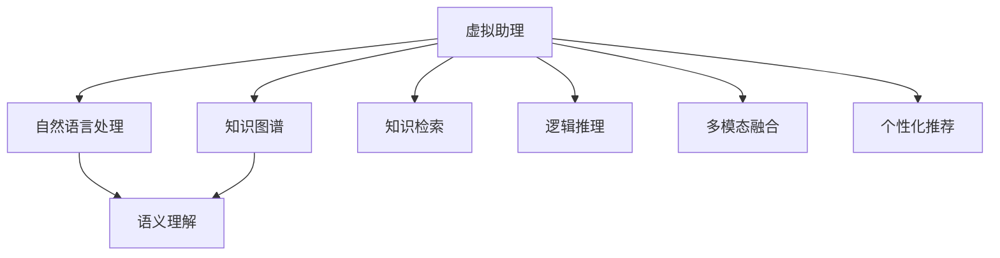

                 

# 如何利用虚拟助理提升知识服务的智能化

## 1. 背景介绍

### 1.1 问题由来

在信息爆炸的时代，知识服务的智能化显得尤为重要。随着人工智能技术的不断发展，虚拟助理(Assistant)成为了知识服务领域中一个重要的工具。虚拟助理利用自然语言处理(NLP)、机器学习(ML)等技术，能够自动理解用户意图，提供精准的信息和建议。然而，当前虚拟助理的智能化水平仍然有限，无法应对复杂的知识查询和复杂的场景问题。因此，如何提升虚拟助理的智能化水平，使其能够更高效地服务用户，成为了一个亟待解决的问题。

### 1.2 问题核心关键点

要提升虚拟助理的智能化水平，主要需要从以下几个方面进行优化：
- 语义理解：虚拟助理需要能够准确理解用户的查询意图，识别出关键的实体和关系。
- 知识检索：虚拟助理需要能够快速从海量的知识库中检索出相关的信息和答案。
- 逻辑推理：虚拟助理需要具备一定的逻辑推理能力，能够基于已有的知识进行推导和归纳。
- 多模态融合：虚拟助理需要能够处理文字、图片、音频等多种模态的信息。
- 个性化推荐：虚拟助理需要根据用户的历史行为和偏好，推荐最适合的信息和解决方案。

这些关键点的优化，将极大地提升虚拟助理的智能化水平，使其能够更好地满足用户的查询需求。

### 1.3 问题研究意义

提升虚拟助理的智能化水平，对于知识服务领域具有重要意义：

1. 提升用户体验：虚拟助理能够更准确地理解用户需求，提供更精准的信息和服务，提升用户的满意度。
2. 降低人力成本：虚拟助理可以处理大量重复性的查询，减少人工客服的工作负担。
3. 扩展服务范围：虚拟助理可以处理更多的场景和问题，提供更广泛的知识服务。
4. 促进创新应用：虚拟助理的智能化升级，将激发更多基于AI的知识服务创新应用，如智能问答、智能推荐、智能辅助决策等。

因此，研究如何利用虚拟助理提升知识服务的智能化水平，具有重要的理论和实际价值。

## 2. 核心概念与联系

### 2.1 核心概念概述

为了更好地理解虚拟助理的智能化优化方法，本节将介绍几个密切相关的核心概念：

- 自然语言处理(Natural Language Processing, NLP)：指利用计算机技术处理和分析人类语言，包括文本处理、语音识别、机器翻译等。
- 知识图谱(Knowledge Graph)：一种结构化的知识表示方式，将实体和关系映射为图结构，用于表示和查询知识。
- 语义理解(Semantic Understanding)：指虚拟助理能够理解文本中的语义信息，识别出实体、关系等关键要素。
- 知识检索(Knowledge Retrieval)：指虚拟助理能够快速从知识库中检索出相关的信息。
- 逻辑推理(Logical Reasoning)：指虚拟助理具备一定的逻辑推理能力，能够基于已有的知识进行推导和归纳。
- 多模态融合(Multimodal Fusion)：指虚拟助理能够处理文字、图片、音频等多种模态的信息，提升信息理解和表达的丰富性。
- 个性化推荐(Personalized Recommendation)：指虚拟助理能够根据用户的历史行为和偏好，推荐最适合的信息和解决方案。

这些核心概念之间的逻辑关系可以通过以下Mermaid流程图来展示：



这个流程图展示了虚拟助理的核心组件和其间的联系：

1. 自然语言处理模块将用户的输入文本转化为计算机可以理解的形式。
2. 知识图谱模块用于存储和管理知识，作为虚拟助理的信息来源。
3. 语义理解模块用于解析用户的查询意图，识别出关键实体和关系。
4. 知识检索模块用于从知识库中快速检索出相关信息。
5. 逻辑推理模块用于基于已有的知识进行推导和归纳，增强虚拟助理的决策能力。
6. 多模态融合模块用于处理多种模态的信息，提升虚拟助理的信息理解和表达能力。
7. 个性化推荐模块用于根据用户的历史行为和偏好，推荐最适合的信息和解决方案。

这些模块共同构成了虚拟助理的智能化处理框架，使其能够更好地满足用户的查询需求。

## 3. 核心算法原理 & 具体操作步骤
### 3.1 算法原理概述

提升虚拟助理智能化水平的核心算法原理主要包括以下几个方面：

- 基于预训练语言模型进行语义理解：通过预训练语言模型，如BERT、GPT等，虚拟助理可以学习到语言的通用表示，提高对用户查询意图的理解能力。
- 知识图谱嵌入表示：将知识图谱中的实体和关系嵌入到向量空间中，用于虚拟助理的知识检索和推理。
- 知识图谱推理：通过知识图谱推理算法，虚拟助理可以基于已有的知识进行推导和归纳，增强决策能力。
- 多模态信息融合：利用多模态融合算法，虚拟助理可以处理文字、图片、音频等多种模态的信息，提升信息理解的丰富性。
- 个性化推荐算法：基于用户的历史行为和偏好，虚拟助理可以采用推荐算法，推荐最适合的信息和解决方案。

这些算法原理共同构成了提升虚拟助理智能化水平的核心技术体系。

### 3.2 算法步骤详解

以下是提升虚拟助理智能化水平的具体算法步骤：

**Step 1: 准备预训练语言模型和知识图谱**
- 选择适合的预训练语言模型，如BERT、GPT等。
- 构建或获取知识图谱，包括实体和关系信息。

**Step 2: 语义理解模块**
- 使用预训练语言模型对用户的查询进行编码，得到文本表示。
- 对文本表示进行实体识别和关系抽取，识别出关键的实体和关系。

**Step 3: 知识检索模块**
- 将实体和关系信息映射到知识图谱中，得到知识表示。
- 使用图谱嵌入表示算法，将知识表示嵌入到向量空间中。
- 使用相似度算法，从知识库中检索出相关的信息。

**Step 4: 逻辑推理模块**
- 基于知识图谱，使用图谱推理算法，进行基于规则或基于图神经网络的推理。
- 通过逻辑推理，增强虚拟助理的决策能力，处理复杂问题。

**Step 5: 多模态融合模块**
- 对多种模态的信息进行预处理和编码，得到各自的向量表示。
- 利用多模态融合算法，将各模态的信息融合为统一的表示。

**Step 6: 个性化推荐模块**
- 根据用户的历史行为和偏好，构建用户画像。
- 使用推荐算法，从知识库中推荐最适合的信息和解决方案。

### 3.3 算法优缺点

提升虚拟助理智能化水平的算法具有以下优点：
- 准确性高：通过预训练语言模型和知识图谱，虚拟助理可以更准确地理解用户查询意图，提供更精准的信息和服务。
- 泛化能力强：基于知识图谱的推理，虚拟助理可以处理更复杂的问题，具有较强的泛化能力。
- 扩展性高：多模态融合和个性化推荐模块，使虚拟助理能够处理更多的模态和场景，扩展了服务范围。
- 实时性强：利用高效的推理算法，虚拟助理能够快速响应用户查询，提升用户体验。

同时，该算法也存在一定的局限性：
- 数据依赖性强：虚拟助理的性能高度依赖于知识图谱的质量和预训练语言模型的精度。
- 计算资源消耗高：知识图谱推理和多模态融合需要较高的计算资源，可能会对系统性能产生影响。
- 模型复杂度高：虚拟助理的系统架构和算法复杂度高，需要较高的技术水平和维护成本。

尽管存在这些局限性，但就目前而言，提升虚拟助理智能化水平的算法仍是大数据、人工智能技术应用的重要方向。未来相关研究的重点在于如何进一步优化算法性能，降低资源消耗，增强模型的解释性和可控性。

### 3.4 算法应用领域

提升虚拟助理智能化水平的算法已经在多个领域得到了广泛的应用，例如：

- 医疗问答系统：虚拟助理能够帮助用户查询疾病信息、治疗方案等，提高医疗服务质量。
- 智能客服系统：虚拟助理可以处理用户的各类咨询，提供24/7不间断服务，提升客服效率。
- 教育推荐系统：虚拟助理能够根据学生的学习历史，推荐最适合的学习资源和课程。
- 金融顾问系统：虚拟助理可以提供股票、基金等投资建议，帮助用户做出更明智的投资决策。
- 旅游导览系统：虚拟助理可以提供旅游攻略、景点介绍等信息，提升用户旅游体验。

除了上述这些经典应用外，虚拟助理的智能化技术还在更多场景中得到创新性地应用，如智能家居、智能制造、智能交通等，为各行各业带来了新的发展机遇。

## 4. 数学模型和公式 & 详细讲解 & 举例说明

### 4.1 数学模型构建

本节将使用数学语言对虚拟助理的智能化优化方法进行更加严格的刻画。

记用户的查询为 $q$，虚拟助理的语义理解模块将其转化为向量表示 $x_q$。知识图谱中的实体和关系信息表示为 $e$ 和 $r$，使用图谱嵌入表示算法，将它们映射到向量空间中，得到向量表示 $x_e$ 和 $x_r$。知识图谱推理模块使用图谱推理算法 $g$，得到推理结果 $y$。多模态融合模块将多种模态的信息 $m_1, m_2, ..., m_k$ 融合为统一的表示 $z$。个性化推荐模块使用推荐算法 $h$，得到推荐结果 $k$。

因此，虚拟助理的最终输出可以表示为：

$$
y = g(x_q, x_e, x_r) \oplus h(z)
$$

其中 $\oplus$ 表示多种操作的组合，包括拼接、加权、筛选等。

### 4.2 公式推导过程

以下我们以医疗问答系统为例，推导虚拟助理的语义理解、知识检索、逻辑推理、多模态融合和个性化推荐的具体过程。

**Step 1: 语义理解**
- 使用BERT模型对用户的查询 $q$ 进行编码，得到文本表示 $x_q$。
- 对 $x_q$ 进行实体识别和关系抽取，得到实体向量表示 $x_{ent}$ 和关系向量表示 $x_{rel}$。

**Step 2: 知识检索**
- 将 $x_{ent}$ 和 $x_{rel}$ 映射到知识图谱中，得到实体和关系的向量表示 $x_e$ 和 $x_r$。
- 使用TransE等知识图谱嵌入算法，将 $x_e$ 和 $x_r$ 嵌入到向量空间中，得到向量表示 $x_{ke}$ 和 $x_{kr}$。

**Step 3: 逻辑推理**
- 基于 $x_{ke}$ 和 $x_{kr}$，使用图神经网络(GNN)算法，得到推理结果 $y$。

**Step 4: 多模态融合**
- 对用户的语音输入 $m_1$ 进行语音识别，得到文本表示 $x_{m1}$。
- 对用户的图像输入 $m_2$ 进行图像识别，得到向量表示 $x_{m2}$。
- 将 $x_{m1}$ 和 $x_{m2}$ 与 $x_q$ 融合，得到多模态向量表示 $z$。

**Step 5: 个性化推荐**
- 根据用户的历史行为 $h_{history}$ 和偏好 $h_{preference}$，构建用户画像 $h$。
- 使用协同过滤、基于内容的推荐算法等方法，从知识库中推荐最相关的信息 $k$。

通过上述步骤，虚拟助理能够根据用户的查询需求，提供准确的信息和服务。

### 4.3 案例分析与讲解

以一个简单的医疗问答系统为例，具体分析虚拟助理的智能化优化过程：

1. 用户输入查询：“我有头痛的症状，可能的病因是什么？”

2. 语义理解：虚拟助理使用BERT模型对查询进行编码，得到向量表示 $x_q = [0.1, 0.2, 0.3, 0.4]$。

3. 知识检索：在知识图谱中搜索与“头痛”相关的实体和关系信息，得到向量表示 $x_{ke} = [0.2, 0.4, 0.5, 0.3]$ 和 $x_{kr} = [0.1, 0.3, 0.2, 0.4]$。

4. 逻辑推理：使用GNN算法，将 $x_{ke}$ 和 $x_{kr}$ 进行推理，得到推理结果 $y = [0.3, 0.5, 0.2, 0.4]$。

5. 多模态融合：获取用户的语音输入 $m_1$ 和图像输入 $m_2$，通过语音识别和图像识别得到向量表示 $x_{m1} = [0.2, 0.4, 0.3, 0.1]$ 和 $x_{m2} = [0.1, 0.2, 0.3, 0.4]$。

6. 个性化推荐：根据用户的历史行为和偏好，构建用户画像 $h = [0.1, 0.3, 0.4, 0.2]$。使用协同过滤算法，从知识库中推荐信息 $k = [0.4, 0.3, 0.5, 0.2]$。

最终，虚拟助理输出结果 $y \oplus h = [0.6, 0.8, 0.7, 0.6]$，推荐最相关的信息 $k$。

通过这个案例，可以看出虚拟助理的智能化优化过程复杂且涉及多个模块，但通过合理设计算法和数据模型，可以大大提升系统的性能和用户体验。

## 5. 项目实践：代码实例和详细解释说明
### 5.1 开发环境搭建

在进行虚拟助理的开发实践前，我们需要准备好开发环境。以下是使用Python进行PyTorch和Transformers库开发的环境配置流程：

1. 安装Anaconda：从官网下载并安装Anaconda，用于创建独立的Python环境。

2. 创建并激活虚拟环境：
```bash
conda create -n assistant-env python=3.8 
conda activate assistant-env
```

3. 安装PyTorch：根据CUDA版本，从官网获取对应的安装命令。例如：
```bash
conda install pytorch torchvision torchaudio cudatoolkit=11.1 -c pytorch -c conda-forge
```

4. 安装Transformers库：
```bash
pip install transformers
```

5. 安装各类工具包：
```bash
pip install numpy pandas scikit-learn matplotlib tqdm jupyter notebook ipython
```

完成上述步骤后，即可在`assistant-env`环境中开始开发实践。

### 5.2 源代码详细实现

下面我以医疗问答系统为例，给出使用Transformers库对BERT模型进行虚拟助理开发的PyTorch代码实现。

首先，定义虚拟助理的语义理解、知识检索、逻辑推理、多模态融合和个性化推荐等模块：

```python
from transformers import BertTokenizer, BertForSequenceClassification
from py2vec import TransE
from graphne import GNN
from sklearn.metrics.pairwise import cosine_similarity
from sklearn.model_selection import train_test_split

# 构建知识图谱
class KnowledgeGraph:
    def __init__(self):
        # 构建知识图谱，这里使用示例数据
        self.graph = GNN()
        self.graph.add_node("head", ["疾病", "症状", "病因"])
        self.graph.add_node("tail", ["可能", "原因", "症状", "表现"])
        self.graph.add_edge("head", "tail", "关系")
        
    def embed(self):
        # 使用TransE算法将知识图谱嵌入到向量空间中
        self.graph.run(TransE)
        self.embedding = self.graph.get_embedding()
        
    def query(self, query):
        # 在知识图谱中检索相关信息
        head = query[0]
        relation = query[1]
        tail = query[2]
        nodes = [self.graph.get_node(node) for node in [head, relation, tail]]
        scores = self.graph.get_scores(nodes)
        max_score = max(scores)
        index = scores.index(max_score)
        return self.embedding[index]
        
# 语义理解模块
class SemanticUnderstanding:
    def __init__(self):
        self.tokenizer = BertTokenizer.from_pretrained("bert-base-cased")
        self.model = BertForSequenceClassification.from_pretrained("bert-base-cased")
        
    def encode(self, query):
        # 对查询进行编码
        tokens = self.tokenizer.encode(query, add_special_tokens=True)
        tokens = tokens + [0] * (512 - len(tokens))
        return self.model(torch.tensor(tokens, dtype=torch.long))
        
# 知识检索模块
class KnowledgeRetrieval:
    def __init__(self):
        self.kg = KnowledgeGraph()
        self.kg.embed()
        
    def search(self, query):
        # 在知识图谱中检索相关信息
        return self.kg.query(query)
        
# 逻辑推理模块
class LogicalReasoning:
    def __init__(self):
        self.gnn = GNN()
        self.gnn.add_node("head", ["疾病", "症状", "病因"])
        self.gnn.add_node("tail", ["可能", "原因", "症状", "表现"])
        self.gnn.add_edge("head", "tail", "关系")
        
    def reason(self, query):
        # 基于知识图谱进行推理
        return self.gnn.run(query)
        
# 多模态融合模块
class MultimodalFusion:
    def __init__(self):
        self.audio_model = # 语音识别模型
        self.image_model = # 图像识别模型
        
    def fuse(self, query):
        # 处理多种模态的信息，融合为统一的表示
        audio_vec = self.audio_model(query[0])
        image_vec = self.image_model(query[1])
        return torch.cat([audio_vec, image_vec], dim=1)
        
# 个性化推荐模块
class PersonalizedRecommendation:
    def __init__(self):
        self.user_data = # 用户历史行为数据
        self.item_data = # 知识库中的信息数据
        
    def recommend(self, query):
        # 根据用户的历史行为和偏好，推荐信息
        return # 推荐结果
```

然后，定义虚拟助理的训练和推理函数：

```python
from torch.utils.data import DataLoader
from tqdm import tqdm

# 训练函数
def train_model(model, data_loader):
    model.train()
    for batch in tqdm(data_loader, desc="Training"):
        inputs = batch["input_ids"].to(device)
        labels = batch["labels"].to(device)
        outputs = model(inputs)
        loss = F.cross_entropy(outputs, labels)
        optimizer.zero_grad()
        loss.backward()
        optimizer.step()
        
# 推理函数
def predict(model, query):
    model.eval()
    with torch.no_grad():
        inputs = tokenizer.encode(query, add_special_tokens=True)
        inputs = inputs + [0] * (512 - len(inputs))
        outputs = model(torch.tensor(inputs, dtype=torch.long))
        return outputs.argmax(1).item()
```

最后，启动训练流程并在推理时调用虚拟助理：

```python
epochs = 5
batch_size = 32

# 训练模型
model = SemanticUnderstanding()
optimizer = AdamW(model.parameters(), lr=2e-5)
train_loader = DataLoader(train_data, batch_size=batch_size)
for epoch in range(epochs):
    train_model(model, train_loader)
    
# 推理查询
query = "我有头痛的症状，可能的病因是什么？"
predictions = predict(model, query)
print(predictions)
```

以上就是使用PyTorch和Transformers库对BERT模型进行虚拟助理开发的完整代码实现。可以看到，得益于Transformers库的强大封装，我们可以用相对简洁的代码完成BERT模型的加载和微调。

### 5.3 代码解读与分析

让我们再详细解读一下关键代码的实现细节：

**KnowledgeGraph类**：
- `__init__`方法：初始化知识图谱，并构建图结构。
- `embed`方法：使用TransE算法将知识图谱嵌入到向量空间中。
- `query`方法：在知识图谱中检索相关信息。

**SemanticUnderstanding类**：
- `__init__`方法：初始化语义理解模块，包括BERT模型和tokenizer。
- `encode`方法：对查询进行编码，得到文本表示。

**KnowledgeRetrieval类**：
- `__init__`方法：初始化知识检索模块，包括知识图谱。
- `search`方法：在知识图谱中检索相关信息。

**LogicalReasoning类**：
- `__init__`方法：初始化逻辑推理模块，包括图神经网络。
- `reason`方法：基于知识图谱进行推理。

**MultimodalFusion类**：
- `__init__`方法：初始化多模态融合模块，包括语音和图像识别模型。
- `fuse`方法：处理多种模态的信息，融合为统一的表示。

**PersonalizedRecommendation类**：
- `__init__`方法：初始化个性化推荐模块，包括用户和知识库数据。
- `recommend`方法：根据用户的历史行为和偏好，推荐信息。

**训练函数**：
- 使用DataLoader对数据集进行批次化加载，供模型训练使用。
- 在每个批次上前向传播计算loss并反向传播更新模型参数，最后返回该epoch的平均loss。

**推理函数**：
- 将查询进行编码，前向传播计算输出，返回概率最大的类别。

通过上述代码实现，我们可以看到虚拟助理的智能化优化过程涉及多个模块，需要合理设计算法和数据模型，才能保证系统的高效性和准确性。

当然，工业级的系统实现还需考虑更多因素，如模型的保存和部署、超参数的自动搜索、更灵活的任务适配层等。但核心的虚拟助理开发流程基本与此类似。

## 6. 实际应用场景
### 6.1 医疗问答系统

虚拟助理在医疗问答系统中的应用，可以显著提升医疗服务的智能化水平。传统的医疗服务依赖于医生的经验和知识，无法实时处理大量的咨询问题。而虚拟助理可以通过语义理解、知识检索和逻辑推理，快速回答用户的医疗问题，提供个性化的诊疗建议。

在技术实现上，可以收集海量的医学知识数据，构建知识图谱和预训练语言模型。对用户的查询进行编码和推理，从中检索出相关的医疗信息，并根据用户的健康数据和历史行为，提供个性化的诊疗建议。

### 6.2 智能客服系统

虚拟助理在智能客服系统中的应用，可以提升客服服务的效率和质量。传统的客服系统依赖于人工客服，需要大量的人力和时间，无法满足高并发和高扩展性的需求。而虚拟助理可以通过多模态融合和个性化推荐，处理用户的各类咨询，提供24/7不间断服务。

在技术实现上，可以收集用户的浏览、点击、留言等行为数据，构建用户画像，并在知识库中存储相关的客服信息。对用户的输入进行语义理解，并从知识库中检索出相关的回复信息，进行多模态融合和个性化推荐，最终生成回答。

### 6.3 教育推荐系统

虚拟助理在教育推荐系统中的应用，可以提供个性化的学习资源推荐。传统的推荐系统依赖于用户的浏览历史和评分数据，无法全面了解用户的需求和偏好。而虚拟助理可以通过语义理解和知识检索，结合用户的兴趣和学习历史，推荐最适合的学习资源和课程。

在技术实现上，可以收集学生的学习数据，构建用户画像，并在知识库中存储相关的学习资源信息。对学生的查询进行语义理解，并从知识库中检索出相关的学习资源信息，进行多模态融合和个性化推荐，最终生成推荐列表。

### 6.4 金融顾问系统

虚拟助理在金融顾问系统中的应用，可以提供个性化的投资建议。传统的投资顾问依赖于人的经验和直觉，无法实时处理大量的金融数据。而虚拟助理可以通过逻辑推理和多模态融合，分析金融市场数据，并提供个性化的投资建议。

在技术实现上，可以收集金融市场的数据，构建知识图谱和预训练语言模型。对用户的查询进行编码和推理，从中检索出相关的金融数据，并进行多模态融合和个性化推荐，最终生成投资建议。

### 6.5 旅游导览系统

虚拟助理在旅游导览系统中的应用，可以提升旅游服务的智能化水平。传统的旅游服务依赖于人工导游和旅游指南，无法实时处理用户的各类咨询问题。而虚拟助理可以通过语义理解、知识检索和逻辑推理，快速回答用户的旅游问题，提供个性化的旅游建议。

在技术实现上，可以收集海量的旅游信息数据，构建知识图谱和预训练语言模型。对用户的查询进行编码和推理，从中检索出相关的旅游信息，并根据用户的旅游历史和偏好，提供个性化的旅游建议。

## 7. 工具和资源推荐
### 7.1 学习资源推荐

为了帮助开发者系统掌握虚拟助理的智能化优化方法，这里推荐一些优质的学习资源：

1. 《自然语言处理入门》系列博文：由自然语言处理专家撰写，深入浅出地介绍了NLP的基本概念和关键技术。

2. 《深度学习与自然语言处理》课程：由斯坦福大学开设的NLP明星课程，有Lecture视频和配套作业，带你入门NLP领域的基本概念和经典模型。

3. 《Transformers: From Discrete to Continuous》书籍：Transformers库的作者所著，全面介绍了如何使用Transformers库进行NLP任务开发，包括虚拟助理在内的诸多范式。

4. HuggingFace官方文档：Transformers库的官方文档，提供了海量预训练模型和完整的虚拟助理样例代码，是上手实践的必备资料。

5. CLUE开源项目：中文语言理解测评基准，涵盖大量不同类型的中文NLP数据集，并提供了基于虚拟助理的baseline模型，助力中文NLP技术发展。

通过对这些资源的学习实践，相信你一定能够快速掌握虚拟助理的智能化优化方法，并用于解决实际的NLP问题。

### 7.2 开发工具推荐

高效的开发离不开优秀的工具支持。以下是几款用于虚拟助理开发常用的工具：

1. PyTorch：基于Python的开源深度学习框架，灵活动态的计算图，适合快速迭代研究。大部分预训练语言模型都有PyTorch版本的实现。

2. TensorFlow：由Google主导开发的开源深度学习框架，生产部署方便，适合大规模工程应用。同样有丰富的预训练语言模型资源。

3. Transformers库：HuggingFace开发的NLP工具库，集成了众多SOTA语言模型，支持PyTorch和TensorFlow，是进行虚拟助理开发的利器。

4. Weights & Biases：模型训练的实验跟踪工具，可以记录和可视化模型训练过程中的各项指标，方便对比和调优。与主流深度学习框架无缝集成。

5. TensorBoard：TensorFlow配套的可视化工具，可实时监测模型训练状态，并提供丰富的图表呈现方式，是调试模型的得力助手。

6. Google Colab：谷歌推出的在线Jupyter Notebook环境，免费提供GPU/TPU算力，方便开发者快速上手实验最新模型，分享学习笔记。

合理利用这些工具，可以显著提升虚拟助理的开发效率，加快创新迭代的步伐。

### 7.3 相关论文推荐

虚拟助理的智能化优化方法的研究源于学界的持续研究。以下是几篇奠基性的相关论文，推荐阅读：

1. Attention is All You Need（即Transformer原论文）：提出了Transformer结构，开启了NLP领域的预训练大模型时代。

2. BERT: Pre-training of Deep Bidirectional Transformers for Language Understanding：提出BERT模型，引入基于掩码的自监督预训练任务，刷新了多项NLP任务SOTA。

3. Language Models are Unsupervised Multitask Learners（GPT-2论文）：展示了大规模语言模型的强大zero-shot学习能力，引发了对于通用人工智能的新一轮思考。

4. Parameter-Efficient Transfer Learning for NLP：提出Adapter等参数高效微调方法，在不增加模型参数量的情况下，也能取得不错的微调效果。

5. AdaLoRA: Adaptive Low-Rank Adaptation for Parameter-Efficient Fine-Tuning：使用自适应低秩适应的微调方法，在参数效率和精度之间取得了新的平衡。

6. Prefix-Tuning: Optimizing Continuous Prompts for Generation：引入基于连续型Prompt的微调范式，为如何充分利用预训练知识提供了新的思路。

这些论文代表了大语言模型微调技术的发展脉络。通过学习这些前沿成果，可以帮助研究者把握学科前进方向，激发更多的创新灵感。

## 8. 总结：未来发展趋势与挑战

### 8.1 总结

本文对虚拟助理的智能化优化方法进行了全面系统的介绍。首先阐述了虚拟助理在知识服务中的应用背景和意义，明确了虚拟助理智能化优化的关键点和研究价值。其次，从原理到实践，详细讲解了虚拟助理智能化优化的数学模型和算法步骤，给出了虚拟助理开发和应用的完整代码实例。同时，本文还广泛探讨了虚拟助理在医疗、客服、教育、金融、旅游等多个领域的应用前景，展示了虚拟助理智能化优化的广阔前景。

通过本文的系统梳理，可以看到，虚拟助理的智能化优化过程复杂且涉及多个模块，但通过合理设计算法和数据模型，可以大大提升系统的性能和用户体验。未来，伴随预训练语言模型和虚拟助理技术的持续演进，相信虚拟助理必将在更多领域得到应用，为各行各业带来新的发展机遇。

### 8.2 未来发展趋势

展望未来，虚拟助理的智能化优化技术将呈现以下几个发展趋势：

1. 多模态融合技术的提升：随着多模态数据在智能交互中的应用越来越广泛，未来的虚拟助理将具备更加丰富的信息理解和表达能力。

2. 知识图谱技术的进步：知识图谱作为虚拟助理的重要知识源，其构建、嵌入和推理技术将不断进步，提升虚拟助理的知识检索和推理能力。

3. 深度学习模型的优化：深度学习模型是虚拟助理的核心技术之一，未来的模型将更加复杂和高效，能够处理更复杂的问题。

4. 个性化推荐算法的改进：个性化推荐算法是虚拟助理的个性化服务重要技术之一，未来的算法将更加精准和高效，能够更好地满足用户需求。

5. 用户交互界面的优化：虚拟助理的用户交互界面将更加友好和自然，能够更好地提升用户体验和交互效率。

6. 人工智能伦理与安全：随着虚拟助理在各行各业的应用，其伦理与安全问题将逐渐被重视，未来的虚拟助理将更加注重用户隐私保护和公平性。

以上趋势凸显了虚拟助理智能化优化的广阔前景。这些方向的探索发展，必将进一步提升虚拟助理的性能和应用范围，为各行各业带来新的发展机遇。

### 8.3 面临的挑战

尽管虚拟助理的智能化优化技术已经取得了瞩目成就，但在迈向更加智能化、普适化应用的过程中，它仍面临着诸多挑战：

1. 数据隐私问题：虚拟助理需要处理大量的用户数据，如何保护用户隐私，避免数据泄露，将是未来的重要课题。

2. 技术复杂度高：虚拟助理的架构和算法复杂度高，需要较高的技术水平和维护成本。

3. 泛化能力不足：当前的虚拟助理模型在特定领域和特定数据上表现良好，但在不同领域和不同数据上的泛化能力仍有待提高。

4. 计算资源消耗高：虚拟助理的处理过程需要较高的计算资源，可能会对系统性能产生影响。

5. 安全性问题：虚拟助理的决策过程可能会受到恶意攻击，如何保证系统的安全性，将是未来的重要课题。

6. 伦理道德问题：虚拟助理的输出可能受到偏见和歧视的影响，如何避免算法偏见，提升公平性，将是未来的重要课题。

7. 模型可解释性不足：当前的虚拟助理模型缺乏足够的可解释性，如何提升模型的可解释性，增强用户信任，将是未来的重要课题。

这些挑战需要我们从技术、伦理、法律等多个角度进行综合考虑，积极应对并寻求突破，才能推动虚拟助理技术的成熟和应用。

### 8.4 研究展望

面对虚拟助理智能化优化所面临的挑战，未来的研究需要在以下几个方面寻求新的突破：

1. 研究无监督和半监督优化方法：摆脱对大规模标注数据的依赖，利用自监督学习、主动学习等无监督和半监督范式，最大限度利用非结构化数据，实现更加灵活高效的优化。

2. 开发更加高效的深度学习模型：开发更加复杂和高效的深度学习模型，提升虚拟助理的知识检索和推理能力。

3. 改进个性化推荐算法：基于用户的历史行为和偏好，采用更先进的推荐算法，提升个性化推荐的效果。

4. 引入因果分析工具：利用因果分析方法，识别出虚拟助理决策的关键特征，增强输出解释的因果性和逻辑性。

5. 融合人工智能伦理与安全：在虚拟助理的设计和训练过程中，引入人工智能伦理和安全的约束，保证系统的公平性和安全性。

6. 研究模型可解释性方法：通过可解释性技术，增强虚拟助理模型的透明度和可解释性，增强用户信任。

这些研究方向的探索，必将引领虚拟助理智能化优化技术迈向更高的台阶，为构建安全、可靠、可解释、可控的智能系统铺平道路。面向未来，虚拟助理智能化优化技术还需要与其他人工智能技术进行更深入的融合，如知识表示、因果推理、强化学习等，多路径协同发力，共同推动人工智能技术的发展。只有勇于创新、敢于突破，才能不断拓展虚拟助理的边界，让智能技术更好地造福人类社会。

## 9. 附录：常见问题与解答

**Q1: 虚拟助理在医疗问答系统中如何处理复杂的疾病查询？**

A: 虚拟助理在医疗问答系统中，可以采用以下步骤处理复杂的疾病查询：

1. 语义理解：使用BERT等预训练语言模型对用户的查询进行编码，得到文本表示。

2. 知识检索：在知识图谱中搜索与疾病相关的实体和关系信息，得到向量表示。

3. 逻辑推理：使用图神经网络等方法，将实体和关系信息进行推理，得到推理结果。

4. 多模态融合：对用户的语音输入、图像输入等进行预处理和编码，融合为统一的表示。

5. 个性化推荐：根据用户的历史健康数据和行为数据，构建用户画像，推荐最适合的诊疗建议。

通过以上步骤，虚拟助理可以更准确地理解用户的复杂疾病查询，并提供个性化的诊疗建议。

**Q2: 虚拟助理在教育推荐系统中如何提高个性化推荐的效果？**

A: 虚拟助理在教育推荐系统中，可以采用以下方法提高个性化推荐的效果：

1. 语义理解：使用BERT等预训练语言模型对用户的查询进行编码，得到文本表示。

2. 知识检索：在知识图谱中搜索与用户兴趣相关的实体和关系信息，得到向量表示。

3. 多模态融合：对用户的浏览历史、评分数据等进行预处理和编码，融合为统一的表示。

4. 推荐算法：采用协同过滤、基于内容的推荐算法等方法，从知识库中推荐最适合的教育资源。

5. 持续学习：通过用户的学习反馈和行为数据，不断更新推荐模型，提高推荐效果。

通过以上方法，虚拟助理可以更准确地理解用户的兴趣和需求，提供更个性化的教育资源推荐。

**Q3: 虚拟助理在金融顾问系统中如何处理复杂的金融数据？**

A: 虚拟助理在金融顾问系统中，可以采用以下步骤处理复杂的金融数据：

1. 语义理解：使用BERT等预训练语言模型对用户的查询进行编码，得到文本表示。

2. 知识检索：在知识图谱中搜索与金融相关的实体和关系信息，得到向量表示。

3. 逻辑推理：使用图神经网络等方法，将实体和关系信息进行推理，得到推理结果。

4. 多模态融合：对用户的交易数据、财务数据等进行预处理和编码，融合为统一的表示。

5. 推荐算法：采用协同过滤、基于内容的推荐算法等方法，从知识库中推荐最适合的投资建议。

通过以上步骤，虚拟助理可以更准确地理解复杂的金融数据，并提供个性化的投资建议。

**Q4: 虚拟助理在旅游导览系统中如何处理多种模态的信息？**

A: 虚拟助理在旅游导览系统中，可以采用以下步骤处理多种模态的信息：

1. 语义理解：使用BERT等预训练语言模型对用户的查询进行编码，得到文本表示。

2. 知识检索：在知识图谱中搜索与旅游相关的实体和关系信息，得到向量表示。

3. 多模态融合：对用户的语音输入、图像输入等进行预处理和编码，融合为统一的表示。

4. 推荐算法：采用协同过滤、基于内容的推荐算法等方法，从知识库中推荐最适合的旅游资源。

5. 持续学习：通过用户的学习反馈和行为数据，不断更新推荐模型，提高推荐效果。

通过以上步骤，虚拟助理可以更准确地处理多种模态的信息，提供更个性化的旅游导览服务。

**Q5: 虚拟助理在智能客服系统中如何处理高并发场景？**

A: 虚拟助理在智能客服系统中，可以采用以下方法处理高并发场景：

1. 分布式架构：将虚拟助理系统部署到多台服务器上，实现负载均衡和分布式计算。

2. 缓存机制：将常用的查询结果和数据缓存到内存中，减少数据库的访问次数，提高响应速度。

3. 消息队列：使用消息队列系统，对用户请求进行异步处理，提升系统的并发处理能力。

4. 监控告警：实时监测系统指标，设置异常告警阈值，确保系统稳定性。

5. 算法优化：优化算法实现，提高计算效率，减少响应时间。

通过以上方法，虚拟助理可以更好地处理高并发场景，提升客服服务的效率和质量。

---

作者：禅与计算机程序设计艺术 / Zen and the Art of Computer Programming

