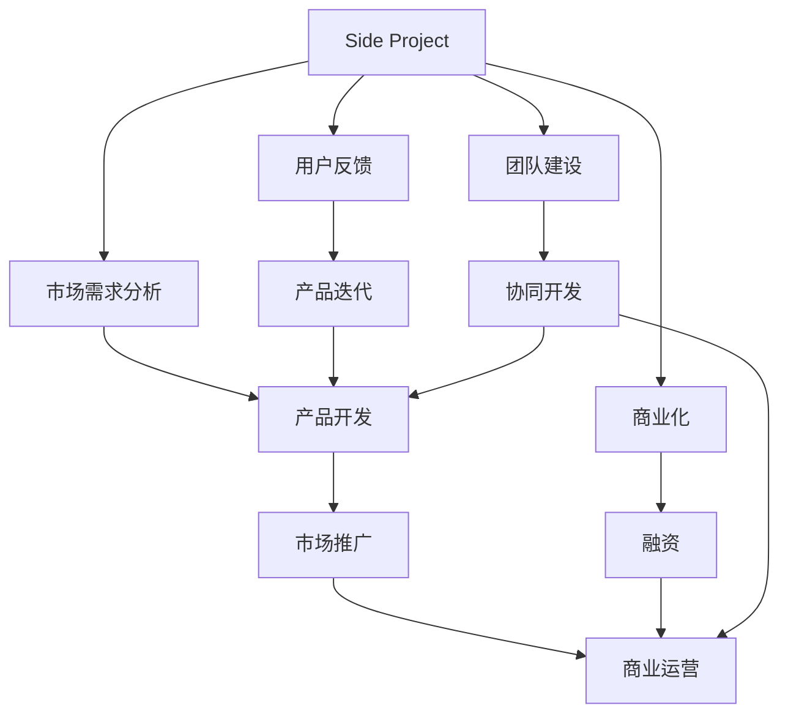

                 

# 如何将Side Project转化为主业

---

## 1. 背景介绍

在当前的科技创业环境中，许多开发者和团队拥有或曾经拥有过Side Project，即那些在主业之外的个人兴趣项目或业余开发。Side Project通常是在开发者业余时间自主开发的，旨在解决特定的技术问题或提升个人技能。然而，这些Side Project有时会展现出超出预期的潜力，促使开发者考虑将其转化为主业。

### 1.1 Side Project的优势与挑战

Side Project的优势包括：

1. **创新和自主性**：Side Project通常基于个人的兴趣和热情，能够激发更多的创新和创造力。
2. **学习和成长**：通过Side Project，开发者可以学习新技术、新框架，提升个人技能。
3. **多样化经验**：Side Project提供了多样化的项目经验，有助于增强综合竞争力。

然而，Side Project也面临一些挑战：

1. **时间和资源限制**：开发者通常需要在繁忙的主业之余进行Side Project开发，时间和资源都可能有限。
2. **不稳定性和风险**：Side Project的成功往往存在不确定性，可能会导致时间和资源投入的浪费。
3. **商业化困难**：尽管Side Project可能具备商业潜力，但将其转化为主业前，需考虑市场需求和商业模式。

### 1.2 成功案例

成功将Side Project转化为主业的典型案例包括：

1. **GitHub**：创始人Andrew Mason在大学期间开发了GitHub的雏形，后来将其作为全职项目并逐步发展成为全球领先的代码托管平台。
2. **Slack**：创始人Calendula和Stuart Weiss在创业初期开发了Slack的早期版本，最终将该产品推向市场，成为企业通信工具的标杆。
3. **Instagram**：联合创始人Mike Krieger在主业之外开发了Instagram应用，将其成功商业化，现已成为Facebook旗下重要的社交平台。

这些案例展示了将Side Project转化为主业的潜力和可能带来的成功。

---

## 2. 核心概念与联系

### 2.1 核心概念概述

为了更好地理解如何将Side Project转化为主业，本节将介绍几个关键概念：

1. **Side Project**：开发者在主业之外自主开发的个人兴趣项目或业余开发项目。
2. **商业化**：将Side Project转化为盈利模式，实现产品化和市场化。
3. **创业过程**：包括市场需求分析、产品开发、市场推广和商业运营等环节。
4. **融资**：通过股权、债权等方式获取资金支持，确保商业化顺利进行。
5. **用户反馈**：收集用户反馈，指导产品迭代和优化。
6. **团队建设**：组建高效团队，协同开发和运营。

这些概念之间的逻辑关系可以通过以下Mermaid流程图来展示：



这个流程图展示了一个Side Project转化为商业化的基本过程：

1. 识别市场需求，开发出有价值的产品。
2. 通过市场推广吸引用户，并进行商业运营。
3. 利用融资手段获取资金支持，确保商业化顺利进行。
4. 通过用户反馈不断优化产品，推动市场增长。
5. 组建高效团队，协同开发和运营，提升产品竞争力。

### 2.2 核心概念原理和架构

Side Project转化为商业化主要涉及以下几个关键步骤：

1. **市场分析**：分析潜在市场需求，判断产品的可行性。
2. **产品规划**：确定产品的核心功能、用户界面和用户体验。
3. **技术选型**：选择合适的技术栈和开发工具。
4. **开发和测试**：进行产品开发和功能测试。
5. **市场推广**：通过各种渠道进行产品推广。
6. **运营维护**：持续优化产品，提供客户支持。
7. **商业模式**：选择适合的盈利模式，如广告、订阅、交易等。
8. **融资**：获取外部资金支持，确保商业化顺利进行。
9. **团队建设**：组建高效团队，协同开发和运营。

以上步骤构成了Side Project转化为主业的完整流程，每个步骤都需要系统性的规划和执行。

---

## 3. 核心算法原理 & 具体操作步骤

### 3.1 算法原理概述

将Side Project转化为主业的算法原理可以简要描述为：通过市场分析确定产品方向，根据用户需求进行产品设计和开发，并利用市场推广手段吸引用户，最终实现商业化。

1. **市场分析**：使用市场调研、用户访谈等方法收集市场需求，分析目标用户群体、市场规模和竞争环境。
2. **产品规划**：根据市场需求确定产品功能和界面设计，制定详细的开发计划和里程碑。
3. **技术选型**：选择合适的开发工具和框架，保证开发效率和产品质量。
4. **开发和测试**：开发产品并持续进行功能测试和性能优化。
5. **市场推广**：利用社交媒体、搜索引擎优化（SEO）、内容营销等手段吸引用户。
6. **运营维护**：持续收集用户反馈，进行产品迭代和优化。
7. **商业模式**：选择适合的盈利模式，如广告收入、订阅服务、交易手续费等。
8. **融资**：通过天使投资、风投等融资手段获取资金支持。
9. **团队建设**：组建跨职能团队，包括产品、设计、开发、市场、运营等角色。

### 3.2 算法步骤详解

下面详细介绍Side Project转化为主业的详细步骤：

**Step 1: 市场分析**

1. **调研**：通过网络调查、问卷、访谈等方式了解市场需求和用户痛点。
2. **竞争分析**：分析同类产品，找出市场机会和差异化优势。
3. **用户画像**：定义目标用户群体的特征和需求。

**Step 2: 产品规划**

1. **功能设计**：根据市场分析结果，确定产品核心功能和主要特性。
2. **UI/UX设计**：设计直观易用的用户界面和用户体验。
3. **技术选型**：选择适合的编程语言、框架和工具。

**Step 3: 开发和测试**

1. **开发流程**：遵循敏捷开发流程，进行迭代开发和测试。
2. **版本控制**：使用Git等版本控制工具，管理代码变更。
3. **功能测试**：进行单元测试、集成测试和用户测试。

**Step 4: 市场推广**

1. **渠道选择**：选择适合的产品推广渠道，如社交媒体、博客、论坛等。
2. **内容营销**：通过撰写博客、制作视频、发布案例等方式吸引用户。
3. **SEO优化**：优化网站和内容，提高搜索引擎排名。

**Step 5: 运营维护**

1. **用户反馈**：收集用户反馈，分析问题和需求。
2. **产品迭代**：根据用户反馈进行产品优化和功能升级。
3. **客户支持**：提供技术支持和客户服务。

**Step 6: 商业模式**

1. **盈利模式**：选择适合的市场盈利模式，如广告、订阅、交易手续费等。
2. **定价策略**：制定合理的定价策略，吸引用户并最大化收入。
3. **市场推广**：利用新盈利模式进行市场推广，吸引更多用户。

**Step 7: 融资**

1. **融资渠道**：选择合适的融资渠道，如天使投资、风险投资等。
2. **融资方案**：制定详细的融资方案和计划。
3. **投资者对接**：与潜在投资者进行谈判，达成融资协议。

**Step 8: 团队建设**

1. **招聘**：根据项目需求招聘合适的团队成员。
2. **角色分配**：根据成员能力和背景分配开发、设计、市场、运营等角色。
3. **团队协作**：建立高效的团队协作机制，确保项目顺利推进。

---

## 4. 数学模型和公式 & 详细讲解 & 举例说明

### 4.1 数学模型构建

为了更好地量化Side Project转化为主业的过程，我们可以构建如下数学模型：

设 $P$ 为Side Project转化为主业的概率，$R$ 为市场推广的ROI（投资回报率），$C$ 为商业化成本，$F$ 为功能开发成本，$M$ 为市场推广成本，$O$ 为运营维护成本，则有：

$$
P = f(R, C, F, M, O)
$$

其中 $f$ 表示函数关系，具体形式取决于市场推广的ROI和其他成本。

### 4.2 公式推导过程

根据上述模型，我们推导 $P$ 的计算公式：

1. **市场分析**：设市场分析的成本为 $C_{\text{analysis}}$，概率为 $P_{\text{analysis}}$，则有：

$$
C_{\text{analysis}} = \int_{0}^{t_{\text{analysis}}} c_{\text{analysis}}(t) dt
$$

$$
P_{\text{analysis}} = \frac{R_{\text{analysis}}}{R_{\text{analysis}} + C_{\text{analysis}}}
$$

其中 $R_{\text{analysis}}$ 表示市场分析带来的收益，$c_{\text{analysis}}(t)$ 表示市场分析的边际成本。

2. **产品规划**：设产品规划的成本为 $C_{\text{planning}}$，概率为 $P_{\text{planning}}$，则有：

$$
C_{\text{planning}} = \int_{0}^{t_{\text{planning}}} c_{\text{planning}}(t) dt
$$

$$
P_{\text{planning}} = \frac{R_{\text{planning}}}{R_{\text{planning}} + C_{\text{planning}}}
$$

其中 $R_{\text{planning}}$ 表示产品规划带来的收益，$c_{\text{planning}}(t)$ 表示产品规划的边际成本。

3. **开发和测试**：设开发和测试的成本为 $C_{\text{develop}}$，概率为 $P_{\text{develop}}$，则有：

$$
C_{\text{develop}} = \int_{0}^{t_{\text{develop}}} c_{\text{develop}}(t) dt
$$

$$
P_{\text{develop}} = \frac{R_{\text{develop}}}{R_{\text{develop}} + C_{\text{develop}}}
$$

其中 $R_{\text{develop}}$ 表示开发和测试带来的收益，$c_{\text{develop}}(t)$ 表示开发和测试的边际成本。

4. **市场推广**：设市场推广的成本为 $C_{\text{market}}$，概率为 $P_{\text{market}}$，则有：

$$
C_{\text{market}} = \int_{0}^{t_{\text{market}}} c_{\text{market}}(t) dt
$$

$$
P_{\text{market}} = \frac{R_{\text{market}}}{R_{\text{market}} + C_{\text{market}}}
$$

其中 $R_{\text{market}}$ 表示市场推广带来的收益，$c_{\text{market}}(t)$ 表示市场推广的边际成本。

5. **运营维护**：设运营维护的成本为 $C_{\text{operate}}$，概率为 $P_{\text{operate}}$，则有：

$$
C_{\text{operate}} = \int_{0}^{t_{\text{operate}}} c_{\text{operate}}(t) dt
$$

$$
P_{\text{operate}} = \frac{R_{\text{operate}}}{R_{\text{operate}} + C_{\text{operate}}}
$$

其中 $R_{\text{operate}}$ 表示运营维护带来的收益，$c_{\text{operate}}(t)$ 表示运营维护的边际成本。

6. **商业模式**：设商业模式的成本为 $C_{\text{business}}$，概率为 $P_{\text{business}}$，则有：

$$
C_{\text{business}} = \int_{0}^{t_{\text{business}}} c_{\text{business}}(t) dt
$$

$$
P_{\text{business}} = \frac{R_{\text{business}}}{R_{\text{business}} + C_{\text{business}}}
$$

其中 $R_{\text{business}}$ 表示商业模式带来的收益，$c_{\text{business}}(t)$ 表示商业模式的边际成本。

7. **融资**：设融资的成本为 $C_{\text{funding}}$，概率为 $P_{\text{funding}}$，则有：

$$
C_{\text{funding}} = \int_{0}^{t_{\text{funding}}} c_{\text{funding}}(t) dt
$$

$$
P_{\text{funding}} = \frac{R_{\text{funding}}}{R_{\text{funding}} + C_{\text{funding}}}
$$

其中 $R_{\text{funding}}$ 表示融资带来的收益，$c_{\text{funding}}(t)$ 表示融资的边际成本。

8. **团队建设**：设团队建设的成本为 $C_{\text{team}}$，概率为 $P_{\text{team}}$，则有：

$$
C_{\text{team}} = \int_{0}^{t_{\text{team}}} c_{\text{team}}(t) dt
$$

$$
P_{\text{team}} = \frac{R_{\text{team}}}{R_{\text{team}} + C_{\text{team}}}
$$

其中 $R_{\text{team}}$ 表示团队建设带来的收益，$c_{\text{team}}(t)$ 表示团队建设的边际成本。

### 4.3 案例分析与讲解

以一个开源项目转换为商业产品的例子来说明上述模型：

1. **项目背景**：开发者A开发了一个开源项目，用于自动化处理PDF文件。
2. **市场分析**：通过对市场的调研，发现自动化处理PDF的需求旺盛，但市场上缺乏高效、易用的工具。
3. **产品规划**：根据调研结果，决定开发一个基于Web的PDF处理平台，提供多种功能如表格提取、文本搜索等。
4. **开发和测试**：开发者A和他的团队在1年内完成了初步开发和测试，用户反馈良好。
5. **市场推广**：通过SEO和社交媒体推广，吸引了大量用户注册和使用。
6. **运营维护**：持续收集用户反馈，进行功能优化和扩展。
7. **商业模式**：推出订阅服务，提供高级功能如批量处理、API接口等。
8. **融资**：获得天使投资，获得资金支持。
9. **团队建设**：招聘更多开发、设计和市场人员，组建跨职能团队。

---

## 5. 项目实践：代码实例和详细解释说明

### 5.1 开发环境搭建

假设开发者A使用Python和Flask框架开发Side Project。具体步骤如下：

1. **安装Python和Flask**：确保Python 3.x和Flask安装到位。
2. **创建虚拟环境**：使用virtualenv或conda创建虚拟环境。
3. **安装依赖包**：使用pip或conda安装Flask及其他依赖包，如Jinja、SQLAlchemy等。
4. **配置开发环境**：配置应用名称、调试模式、数据库连接等环境变量。

### 5.2 源代码详细实现

假设Side Project为PDF处理平台，以下是一个基本的功能模块：

```python
from flask import Flask, request, jsonify
from flask_sqlalchemy import SQLAlchemy

app = Flask(__name__)
app.config['SQLALCHEMY_DATABASE_URI'] = 'sqlite:////tmp/test.db'
db = SQLAlchemy(app)

class PdfDocument(db.Model):
    id = db.Column(db.Integer, primary_key=True)
    filename = db.Column(db.String(255), nullable=False)
    content = db.Column(db.Text, nullable=False)

@app.route('/process', methods=['POST'])
def process_pdf():
    filename = request.form['filename']
    # 处理PDF文件，如提取表格、搜索文本等
    result = {'status': 'success', 'data': 'processed'}
    return jsonify(result)

if __name__ == '__main__':
    db.create_all()
    app.run(debug=True)
```

### 5.3 代码解读与分析

上述代码实现了PDF处理平台的基本功能：

1. **Flask应用**：使用Flask创建Web应用，配置数据库连接。
2. **数据模型**：定义PDF文档的SQLAlchemy模型，用于数据库存储和查询。
3. **路由处理**：定义处理PDF文件的路由，接收POST请求并返回处理结果。
4. **数据库操作**：使用SQLAlchemy进行数据库操作，如创建表格、查询数据等。

---

## 6. 实际应用场景

### 6.1 开源项目

一个开源项目通过市场推广和商业化实现的成功案例是Adobe Acrobat：

1. **项目背景**：Adobe最初开发的Acrobat Reader是一个开源项目，用于阅读和编辑PDF文件。
2. **市场推广**：通过商业化，Adobe将Acrobat Reader发展为Adobe Acrobat，包含更多高级功能如PDF编辑、表单填写等。
3. **商业化**：推出付费订阅服务，提供附加功能如PDF合成、OCR识别等。
4. **市场成功**：Adobe Acrobat成为市场上领先的PDF处理工具，占据了大部分市场份额。

### 6.2 创业公司

一个创业公司通过将Side Project商业化实现成功的案例是Slack：

1. **项目背景**：Slack的创始人开发了一个Side Project，用于团队内部沟通。
2. **市场推广**：通过向企业用户推广，Slack逐渐成为市场上的主流协作工具。
3. **商业化**：推出付费订阅服务，提供高级功能如集成其他应用程序等。
4. **市场成功**：Slack成为全球最大的团队协作工具，被广泛用于企业内部沟通和项目管理。

---

## 7. 工具和资源推荐

### 7.1 学习资源推荐

1. **Coursera**：提供多门关于创业和产品开发的课程，如《产品设计思维》、《创业融资》等。
2. **Udemy**：提供丰富的创业和软件开发课程，如《JavaScript实战》、《Python数据科学》等。
3. **Google Developers**：提供大量技术资源和工具，如Android开发者指南、Google Cloud等。
4. **LeetCode**：提供算法和数据结构练习，帮助提升编程技能。
5. **Hacker News**：社区讨论技术、创业和产品开发等话题，获取最新资讯。

### 7.2 开发工具推荐

1. **Git**：版本控制系统，用于代码管理。
2. **JIRA**：项目管理工具，用于任务追踪和团队协作。
3. **Trello**：看板管理工具，用于任务安排和进度跟踪。
4. **Heroku**：云平台，用于快速部署Web应用。
5. **Google Colab**：免费提供GPU算力的在线Jupyter Notebook环境。

### 7.3 相关论文推荐

1. **《The Lean Startup》**：埃里克·莱斯（Eric Ries）的著作，介绍了精益创业的实践方法。
2. **《Zero to One》**：彼得·蒂尔（Peter Thiel）的著作，探讨如何打造垄断性的创新产品。
3. **《Value Innovation》**：斯特勒·阿尔巴（Stuart Amos）的著作，强调价值创新的重要性。

---

## 8. 总结：未来发展趋势与挑战

### 8.1 研究成果总结

通过将Side Project转化为主业，开发者可以释放更大的创新潜力，实现商业成功。本文从市场分析、产品规划、开发和测试、市场推广、运营维护、商业模式、融资和团队建设等环节，详细讲解了Side Project转化为主业的全过程。这些步骤和建议对于技术创业者具有参考价值。

### 8.2 未来发展趋势

未来Side Project转化为主业的发展趋势包括：

1. **技术融合**：更多新兴技术如区块链、AI、IoT等将融合到Side Project中，提升产品竞争力。
2. **全球化**：Side Project将更易于跨地域扩展，实现全球市场布局。
3. **自动化**：利用自动化工具和平台，提升开发和运营效率。
4. **用户个性化**：根据用户行为和偏好，提供个性化服务和定制化产品。

### 8.3 面临的挑战

将Side Project转化为主业仍面临以下挑战：

1. **市场需求变化**：市场环境快速变化，Side Project需快速适应。
2. **资源限制**：Side Project在转化为主业时，需大量资源支持，包括资金、技术、人力等。
3. **竞争压力**：市场竞争激烈，需保持产品和服务的持续创新。
4. **技术风险**：新技术的引入可能带来不确定性，需评估风险。
5. **商业模式创新**：需探索新的盈利模式和市场策略。

### 8.4 研究展望

未来Side Project转化为主业的研究方向包括：

1. **大数据分析**：利用大数据分析市场趋势和用户需求，指导产品迭代。
2. **机器学习**：引入机器学习算法，提升产品推荐和预测准确度。
3. **智能自动化**：利用智能自动化技术，提升运营效率和用户体验。
4. **区块链技术**：利用区块链技术，实现更安全、透明的产品运营。

---

## 9. 附录：常见问题与解答

**Q1：Side Project如何评估市场潜力？**

A: 评估市场潜力通常需要市场调研和用户访谈。通过问卷、社交媒体、行业报告等方式，了解目标市场的规模、增长率和用户需求。同时，分析竞争对手的优劣势，找到市场机会和差异化优势。

**Q2：Side Project如何获取融资？**

A: Side Project获取融资的渠道包括天使投资、风投、众筹等。需制定详细的融资方案和计划，展示产品的商业潜力、市场前景和团队实力。通过投资者对接会、路演等方式，吸引潜在投资者的关注。

**Q3：Side Project如何应对市场竞争？**

A: 应对市场竞争需要不断创新，提供更优质的产品和服务。同时，需分析竞争对手的优劣势，找到差异化竞争策略。通过定价策略、市场推广和客户服务等方式，提升产品的市场份额。

**Q4：Side Project如何优化用户体验？**

A: 优化用户体验需要收集用户反馈，进行产品迭代和优化。需持续收集用户需求和建议，快速响应并解决用户问题。同时，需关注用户界面设计和交互流程，提升产品的易用性和满意度。

**Q5：Side Project如何确保商业化顺利进行？**

A: 确保商业化顺利进行需制定详细的商业计划和运营策略。需明确商业模式的盈利点、定价策略和市场推广手段。同时，需建立高效的团队协作机制，确保项目在资金、技术、人力等方面的支持。

---

作者：禅与计算机程序设计艺术 / Zen and the Art of Computer Programming

