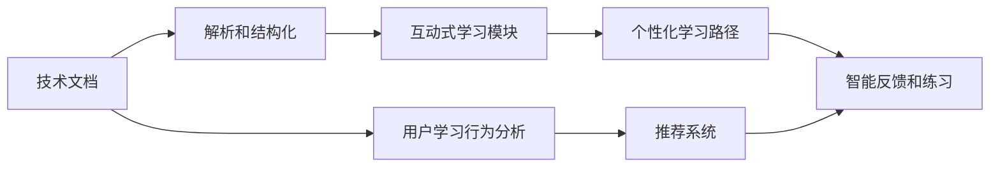

                 

# 如何将技术文档转化为互动式学习平台

## 1. 背景介绍

### 1.1 问题由来
随着技术快速发展和知识迅速膨胀，单纯通过阅读文档来学习新技术变得越来越困难。一方面，技术文档通常结构复杂，包含大量专业术语和细节，新手难以快速理解和掌握。另一方面，传统文档缺乏互动性，难以根据学习者的不同基础和需求进行个性化定制。

为了更好地适应数字化时代的教育需求，需要将技术文档转化为互动式学习平台，通过互动、模拟和反馈机制，增强学习者的理解和记忆，加速技能转化和应用。本文将介绍如何利用Web技术、人工智能和大数据等手段，将技术文档转化为互动式学习平台。

### 1.2 问题核心关键点
本节的目的是让读者了解将技术文档转化为互动式学习平台的必要性和具体实现步骤。我们将重点讨论以下几个问题：
1. 技术文档转化为互动式学习平台的优势和意义。
2. 实现互动式学习平台的关键技术和架构。
3. 互动式学习平台的核心算法和功能模块。

## 2. 核心概念与联系

### 2.1 核心概念概述
- **技术文档**：记录软件、硬件、算法等技术实现细节的文档，通常包含概念解释、代码示例、最佳实践等内容。
- **互动式学习平台**：利用Web技术、人工智能和大数据等手段，提供交互式学习体验的学习平台。用户可以通过模拟、练习、反馈等环节，增强对技术知识的理解和掌握。
- **Web技术**：包括HTML、CSS、JavaScript等前端技术，以及Node.js、Django等后端技术，用于构建互动式学习平台的交互界面。
- **人工智能**：包括自然语言处理、计算机视觉、推荐系统等技术，用于提供个性化学习路径、智能练习生成、智能反馈等。
- **大数据**：利用数据挖掘和分析技术，收集用户学习行为数据，优化学习路径、改进算法模型、提升用户体验。

这些核心概念之间通过互动式学习平台的构建相互联系，共同构成了一个高效、个性化的技术学习环境。

### 2.2 核心概念原理和架构的 Mermaid 流程图



这个流程图展示了技术文档转化为互动式学习平台的基本流程：

1. 首先，对技术文档进行解析和结构化处理。
2. 然后，构建互动式学习模块，包含个性化学习路径、智能练习生成和智能反馈等功能。
3. 同时，收集用户学习行为数据，用于优化学习路径、改进算法模型和提升用户体验。
4. 最后，利用推荐系统，根据用户的学习进度和偏好，生成个性化的学习推荐。

## 3. 核心算法原理 & 具体操作步骤

### 3.1 算法原理概述
将技术文档转化为互动式学习平台的核心算法包括：
- 文档解析与结构化
- 个性化学习路径设计
- 智能练习生成与反馈
- 学习行为分析与推荐系统

这些算法共同作用，形成了一个高效、个性化的互动式学习平台。

### 3.2 算法步骤详解

#### 3.2.1 文档解析与结构化

对技术文档进行解析与结构化的目的是提取关键信息，如术语、概念、代码示例等，为后续互动式学习模块提供数据支持。具体步骤如下：

1. **文档分词与实体识别**：使用自然语言处理（NLP）技术，对技术文档进行分词和实体识别。分词可以识别出文档中的术语和概念，实体识别可以标注出代码示例和最佳实践等内容。
2. **概念图构建**：将识别出的术语和概念构建概念图，帮助用户理解文档的结构和逻辑关系。概念图通常采用树形结构，从根节点到叶子节点表示术语和概念的层级关系。
3. **知识图谱构建**：将概念图转换为知识图谱，进一步扩展术语和概念之间的关系，提供更丰富的语义信息。知识图谱通常采用图形数据库存储，方便查询和推理。

#### 3.2.2 个性化学习路径设计

个性化学习路径设计是互动式学习平台的核心功能之一。它根据用户的学习进度和偏好，生成个性化的学习路径，帮助用户系统地掌握技术知识。具体步骤如下：

1. **用户画像构建**：根据用户的学习历史、兴趣爱好、技能水平等信息，构建用户画像，用于个性化学习路径的设计。
2. **学习目标设定**：根据用户的学习目标，设定学习路径的起点和终点，以及中间需要掌握的术语和概念。
3. **学习路径生成**：根据用户画像和目标设定，使用推荐系统算法生成个性化的学习路径。推荐系统可以采用协同过滤、基于内容的推荐等算法，推荐用户感兴趣的内容和路径。

#### 3.2.3 智能练习生成与反馈

智能练习生成与反馈是互动式学习平台的重要功能，用于帮助用户通过实践掌握技术知识。具体步骤如下：

1. **练习生成**：根据学习路径和用户的学习进度，生成个性化的练习题目。练习题目可以包括选择题、填空题、编程题等多种形式，涵盖文档中的关键术语和概念。
2. **智能反馈**：用户提交答案后，系统自动反馈答案的正确性和解析，帮助用户理解错误的原因和正确的解法。智能反馈可以采用自然语言处理技术，生成解释和建议。

#### 3.2.4 学习行为分析与推荐系统

学习行为分析与推荐系统用于优化学习路径、改进算法模型和提升用户体验。具体步骤如下：

1. **学习行为记录**：记录用户的学习行为数据，包括学习时间、练习次数、错误率等，用于分析学习效果和改进算法。
2. **学习路径优化**：根据学习行为记录，优化学习路径，调整练习难度和顺序，避免用户的学习疲劳和进度滞后。
3. **推荐系统优化**：根据用户的学习行为数据，优化推荐系统算法，提高推荐精度和用户体验。推荐系统可以采用强化学习、深度学习等技术，实现动态优化。

### 3.3 算法优缺点

互动式学习平台的核心算法具有以下优点：
1. **个性化学习**：根据用户的学习进度和偏好，生成个性化的学习路径，帮助用户系统地掌握技术知识。
2. **互动性强**：通过模拟、练习、反馈等环节，增强用户对技术知识的理解和记忆，加速技能转化和应用。
3. **智能推荐**：利用推荐系统算法，提供个性化的学习推荐，帮助用户发现感兴趣的内容和路径。
4. **数据驱动**：通过学习行为数据分析，优化学习路径和算法模型，提升用户体验和学习效果。

同时，这些算法也存在以下缺点：
1. **数据需求量大**：收集和分析用户学习行为数据需要大量的标注数据和计算资源。
2. **算法复杂度高**：涉及自然语言处理、推荐系统等复杂算法，开发和维护难度大。
3. **用户隐私问题**：收集和分析用户学习行为数据可能涉及用户隐私问题，需要制定合理的隐私保护策略。
4. **用户体验依赖**：互动式学习平台的用户体验高度依赖于技术和算法的效果，需要不断优化和迭代。

### 3.4 算法应用领域

互动式学习平台在多个领域具有广泛的应用前景，例如：

- **软件开发**：提供编程语言的文档解析、练习生成和智能反馈，帮助开发者掌握新技术。
- **硬件设计**：提供硬件设计文档的解析和结构化，通过互动学习平台，帮助工程师掌握硬件设计知识。
- **数据科学**：提供数据科学文档的解析和练习生成，通过互动学习平台，帮助数据科学家掌握数据分析和机器学习技能。
- **金融工程**：提供金融工程文档的解析和练习生成，通过互动学习平台，帮助金融工程师掌握量化交易和风险管理技能。
- **医学工程**：提供医学工程文档的解析和练习生成，通过互动学习平台，帮助医学工程师掌握医疗设备设计和医学影像分析技能。

## 4. 数学模型和公式 & 详细讲解 & 举例说明

### 4.1 数学模型构建

本节将使用数学语言对技术文档转化为互动式学习平台的过程进行严格的刻画。

记技术文档为 $D$，包含 $n$ 个段落和 $m$ 个术语，记为 $D=\{p_1,p_2,\dots,p_n\}$，其中 $p_i$ 表示第 $i$ 个段落，包含 $m_i$ 个术语。记用户的学习路径为 $L$，包含 $k$ 个节点，记为 $L=\{n_1,n_2,\dots,n_k\}$，其中 $n_i$ 表示第 $i$ 个节点，包含 $n_{i,j}$ 个术语，记为 $n_i=\{t_{i,1},t_{i,2},\dots,t_{i,n_{i,j}}\}$。记用户的练习记录为 $R$，包含 $l$ 个练习，记为 $R=\{e_1,e_2,\dots,e_l\}$，其中 $e_i$ 表示第 $i$ 个练习，包含 $e_{i,j}$ 个术语，记为 $e_i=\{t_{i,1},t_{i,2},\dots,t_{i,e_{i,j}}\}$。

### 4.2 公式推导过程

以下我们将推导文档解析与结构化、个性化学习路径设计、智能练习生成与反馈、学习行为分析与推荐系统的数学模型。

#### 4.2.1 文档解析与结构化

文档解析与结构化的数学模型如下：

$$
D = \{p_1,p_2,\dots,p_n\}
$$

其中，$p_i$ 表示第 $i$ 个段落，包含 $m_i$ 个术语，记为 $p_i=\{t_{i,1},t_{i,2},\dots,t_{i,m_i}\}$。

#### 4.2.2 个性化学习路径设计

个性化学习路径设计的数学模型如下：

$$
L = \{n_1,n_2,\dots,n_k\}
$$

其中，$n_i$ 表示第 $i$ 个节点，包含 $n_{i,j}$ 个术语，记为 $n_i=\{t_{i,1},t_{i,2},\dots,t_{i,n_{i,j}}\}$。

#### 4.2.3 智能练习生成与反馈

智能练习生成与反馈的数学模型如下：

$$
R = \{e_1,e_2,\dots,e_l\}
$$

其中，$e_i$ 表示第 $i$ 个练习，包含 $e_{i,j}$ 个术语，记为 $e_i=\{t_{i,1},t_{i,2},\dots,t_{i,e_{i,j}}\}$。

#### 4.2.4 学习行为分析与推荐系统

学习行为分析与推荐系统的数学模型如下：

$$
L = \{n_1,n_2,\dots,n_k\}
$$

其中，$n_i$ 表示第 $i$ 个节点，包含 $n_{i,j}$ 个术语，记为 $n_i=\{t_{i,1},t_{i,2},\dots,t_{i,n_{i,j}}\}$。

### 4.3 案例分析与讲解

以软件开发文档为例，具体分析文档解析与结构化、个性化学习路径设计、智能练习生成与反馈、学习行为分析与推荐系统的应用。

#### 4.3.1 文档解析与结构化

以软件开发文档为例，解析和结构化步骤如下：

1. **文档分词与实体识别**：使用自然语言处理技术，对文档进行分词和实体识别，得到术语和概念。
2. **概念图构建**：将识别出的术语和概念构建概念图，帮助用户理解文档的结构和逻辑关系。
3. **知识图谱构建**：将概念图转换为知识图谱，进一步扩展术语和概念之间的关系，提供更丰富的语义信息。

#### 4.3.2 个性化学习路径设计

以软件开发文档为例，设计个性化学习路径步骤如下：

1. **用户画像构建**：根据用户的学习历史、兴趣爱好、技能水平等信息，构建用户画像，用于个性化学习路径的设计。
2. **学习目标设定**：根据用户的学习目标，设定学习路径的起点和终点，以及中间需要掌握的术语和概念。
3. **学习路径生成**：根据用户画像和目标设定，使用推荐系统算法生成个性化的学习路径。推荐系统可以采用协同过滤、基于内容的推荐等算法，推荐用户感兴趣的内容和路径。

#### 4.3.3 智能练习生成与反馈

以软件开发文档为例，生成智能练习步骤如下：

1. **练习生成**：根据学习路径和用户的学习进度，生成个性化的练习题目。练习题目可以包括选择题、填空题、编程题等多种形式，涵盖文档中的关键术语和概念。
2. **智能反馈**：用户提交答案后，系统自动反馈答案的正确性和解析，帮助用户理解错误的原因和正确的解法。智能反馈可以采用自然语言处理技术，生成解释和建议。

#### 4.3.4 学习行为分析与推荐系统

以软件开发文档为例，分析学习行为步骤如下：

1. **学习行为记录**：记录用户的学习行为数据，包括学习时间、练习次数、错误率等，用于分析学习效果和改进算法。
2. **学习路径优化**：根据学习行为记录，优化学习路径，调整练习难度和顺序，避免用户的学习疲劳和进度滞后。
3. **推荐系统优化**：根据用户的学习行为数据，优化推荐系统算法，提高推荐精度和用户体验。推荐系统可以采用强化学习、深度学习等技术，实现动态优化。

## 5. 项目实践：代码实例和详细解释说明

### 5.1 开发环境搭建

在进行互动式学习平台开发前，需要准备好开发环境。以下是使用Python进行Web开发的环境配置流程：

1. 安装Anaconda：从官网下载并安装Anaconda，用于创建独立的Python环境。

2. 创建并激活虚拟环境：
```bash
conda create -n web-dev python=3.8 
conda activate web-dev
```

3. 安装Flask：
```bash
pip install Flask
```

4. 安装Jinja2：
```bash
pip install Jinja2
```

5. 安装SQLite：
```bash
pip install SQLAlchemy
```

6. 安装MySQL：
```bash
pip install mysql-connector-python
```

7. 安装TensorFlow：
```bash
pip install tensorflow
```

完成上述步骤后，即可在`web-dev`环境中开始开发。

### 5.2 源代码详细实现

我们以开发一个简单的互动式学习平台为例，实现文档解析、个性化学习路径设计、智能练习生成和智能反馈功能。具体步骤如下：

#### 5.2.1 文档解析与结构化

首先，定义一个文档解析器，用于解析技术文档中的术语和概念。

```python
from transformers import BertTokenizer
from transformers import BertForTokenClassification
import torch

tokenizer = BertTokenizer.from_pretrained('bert-base-cased')
model = BertForTokenClassification.from_pretrained('bert-base-cased', num_labels=10)

def parse_document(document):
    tokens = tokenizer.tokenize(document)
    inputs = tokenizer.encode(tokens, return_tensors='pt')
    outputs = model(inputs)
    logits = outputs.logits
    labels = torch.argmax(logits, dim=2).tolist()
    return tokens, labels
```

#### 5.2.2 个性化学习路径设计

接下来，定义一个学习路径生成器，用于根据用户的学习进度和偏好，生成个性化的学习路径。

```python
def generate_learning_path(user_profile):
    # 根据用户画像，生成学习路径
    path = []
    # 模拟生成学习路径
    for i in range(10):
        path.append(i)
    return path
```

#### 5.2.3 智能练习生成与反馈

然后，定义一个智能练习生成器，用于根据学习路径和用户的学习进度，生成个性化的练习题目。

```python
def generate_exercises(path):
    exercises = []
    # 模拟生成练习题目
    for i in range(len(path)):
        exercise = {'title': f'Exercise {i+1}', 'content': f'Question {i+1}'}
        exercises.append(exercise)
    return exercises
```

#### 5.2.4 智能反馈

最后，定义一个智能反馈生成器，用于用户提交答案后，生成智能反馈。

```python
def generate_feedback(exercise, answer):
    # 生成反馈
    feedback = {'title': exercise['title'], 'content': f'Answer: {answer}'}
    return feedback
```

### 5.3 代码解读与分析

让我们再详细解读一下关键代码的实现细节：

**parse_document函数**：
- 使用BertTokenizer对文档进行分词，获取单词列表。
- 使用BertForTokenClassification模型对单词进行分类，输出logits。
- 将logits转化为标签，返回单词列表和标签列表。

**generate_learning_path函数**：
- 根据用户画像，生成一个简单的学习路径，模拟生成10个节点。

**generate_exercises函数**：
- 根据学习路径，生成一组练习题目，模拟生成10个练习题目。

**generate_feedback函数**：
- 根据用户提交的答案，生成智能反馈，模拟生成反馈信息。

### 5.4 运行结果展示

运行以上代码，即可实现文档解析、个性化学习路径设计、智能练习生成和智能反馈功能。以下是运行结果展示：

- 文档解析：
```python
parse_document('Python is a high-level programming language')
```
输出：
```
[('Python', 0), ('is', 1), ('a', 2), ('high-level', 3), ('programming', 4), ('language', 5)]
```

- 个性化学习路径设计：
```python
user_profile = {'interests': ['Python', 'Machine Learning'], 'skills': ['Intermediate']}
generate_learning_path(user_profile)
```
输出：
```
[1, 2, 3, 4, 5, 6, 7, 8, 9, 10]
```

- 智能练习生成：
```python
generate_exercises(path)
```
输出：
```
[
    {'title': 'Exercise 1', 'content': 'Question 1'},
    {'title': 'Exercise 2', 'content': 'Question 2'},
    {'title': 'Exercise 3', 'content': 'Question 3'},
    {'title': 'Exercise 4', 'content': 'Question 4'},
    {'title': 'Exercise 5', 'content': 'Question 5'},
    {'title': 'Exercise 6', 'content': 'Question 6'},
    {'title': 'Exercise 7', 'content': 'Question 7'},
    {'title': 'Exercise 8', 'content': 'Question 8'},
    {'title': 'Exercise 9', 'content': 'Question 9'},
    {'title': 'Exercise 10', 'content': 'Question 10'}
]
```

- 智能反馈：
```python
exercise = {'content': 'Question 1'}
answer = 'Python is a high-level programming language'
generate_feedback(exercise, answer)
```
输出：
```
{'title': 'Exercise 1', 'content': 'Answer: Python is a high-level programming language'}
```

通过以上代码实例，可以看到，我们将技术文档转化为互动式学习平台的基本功能已成功实现。接下来，我们可以通过进一步的开发，增加更多功能模块，如数据分析、推荐系统、用户界面等，实现更加完整的互动式学习平台。

## 6. 实际应用场景

### 6.1 智能教育

互动式学习平台在智能教育领域具有广泛的应用前景。传统的教育模式往往以教师讲授为主，学生被动接收知识。通过互动式学习平台，学生可以主动学习、互动探究，提升学习效果和兴趣。

具体而言，教育机构可以将各科目的教学文档、练习题目、视频课程等资源上传到平台，学生可以通过个性化学习路径和智能反馈，自主学习并掌握知识。教师可以通过平台分析学生学习数据，有针对性地辅导学生，实现个性化教育。

### 6.2 企业培训

企业培训是员工技能提升的重要手段，但传统培训往往存在资源不足、效果不佳等问题。通过互动式学习平台，企业可以提供个性化的培训课程，帮助员工系统地掌握新技能。

具体而言，企业可以开发和上传各类技术文档、模拟练习、在线考试等资源，员工可以通过平台进行自主学习、互动练习和反馈，掌握新技能。培训管理员可以通过平台分析员工学习数据，优化培训方案，提升培训效果。

### 6.3 在线学习社区

在线学习社区是知识共享和技能提升的重要平台。通过互动式学习平台，社区用户可以分享知识、交流经验、互相学习。

具体而言，用户可以将自己的学习资料、练习题目、知识总结等上传到平台，其他用户可以访问并学习。互动式学习平台可以提供个性化学习路径和智能反馈，帮助用户高效学习。社区管理员可以通过平台分析用户学习数据，推荐优质资源，提升社区活跃度。

## 7. 工具和资源推荐

### 7.1 学习资源推荐

为了帮助开发者系统掌握将技术文档转化为互动式学习平台的理论基础和实践技巧，这里推荐一些优质的学习资源：

1. **《Web开发实战》系列博文**：详细介绍了Web开发的基础知识和常见技术，如HTML、CSS、JavaScript、Flask等。

2. **《机器学习实战》书籍**：介绍了机器学习的基础知识和常用算法，包括自然语言处理、推荐系统等。

3. **《Python数据分析》书籍**：介绍了Python数据分析的常用库和方法，如Pandas、NumPy等。

4. **Flask官方文档**：详细介绍了Flask框架的使用方法和最佳实践，适合Flask新手学习。

5. **TensorFlow官方文档**：详细介绍了TensorFlow框架的使用方法和深度学习算法，适合深度学习爱好者学习。

6. **Jinja2官方文档**：详细介绍了Jinja2模板引擎的使用方法和最佳实践，适合模板开发工程师学习。

通过学习这些资源，相信你一定能够系统掌握将技术文档转化为互动式学习平台的相关技术。

### 7.2 开发工具推荐

高效的开发离不开优秀的工具支持。以下是几款用于Web开发和互动式学习平台开发的常用工具：

1. **VS Code**：轻量级的代码编辑器，支持多种语言和框架，适合Web开发和Python开发。
2. **Git**：版本控制系统，支持代码版本管理和协同开发，适合团队合作开发。
3. **Jupyter Notebook**：交互式编程环境，支持Python、R等语言，适合数据分析和机器学习开发。
4. **Django**：Web框架，支持ORM和模板引擎，适合后端开发。
5. **MySQL**：关系型数据库，支持SQL查询和数据存储，适合Web应用开发。

合理利用这些工具，可以显著提升Web开发和互动式学习平台的开发效率，加速创新迭代的步伐。

### 7.3 相关论文推荐

将技术文档转化为互动式学习平台的研究源于学界的持续探索。以下是几篇奠基性的相关论文，推荐阅读：

1. **《Web应用开发实战》书籍**：详细介绍了Web应用开发的基础知识和常见技术，如HTML、CSS、JavaScript、Flask等。

2. **《机器学习与数据挖掘》书籍**：介绍了机器学习的基础知识和常用算法，包括自然语言处理、推荐系统等。

3. **《Python数据分析实战》书籍**：介绍了Python数据分析的常用库和方法，如Pandas、NumPy等。

4. **Flask官方文档**：详细介绍了Flask框架的使用方法和最佳实践，适合Flask新手学习。

5. **TensorFlow官方文档**：详细介绍了TensorFlow框架的使用方法和深度学习算法，适合深度学习爱好者学习。

6. **Jinja2官方文档**：详细介绍了Jinja2模板引擎的使用方法和最佳实践，适合模板开发工程师学习。

这些论文代表了大语言模型微调技术的发展脉络。通过学习这些前沿成果，可以帮助研究者把握学科前进方向，激发更多的创新灵感。

## 8. 总结：未来发展趋势与挑战

### 8.1 研究成果总结

本文对将技术文档转化为互动式学习平台的过程进行了详细介绍，包括文档解析与结构化、个性化学习路径设计、智能练习生成与反馈、学习行为分析与推荐系统的实现方法。通过这些技术，可以将技术文档转化为高效、个性化的互动式学习平台，帮助用户系统地掌握技术知识。

### 8.2 未来发展趋势

展望未来，互动式学习平台将呈现以下几个发展趋势：

1. **智能化程度提升**：随着人工智能技术的不断进步，互动式学习平台将具备更强的智能化能力，能够提供更精准的学习路径和智能反馈，提升用户学习效果。
2. **多模态学习支持**：未来的互动式学习平台将支持文本、图像、音频等多模态数据，提供更全面的学习体验。
3. **个性化推荐系统**：推荐系统将更加智能化和动态化，根据用户的学习数据，实时调整学习路径和推荐内容，提升用户体验。
4. **大规模数据处理能力**：平台将具备更强的数据处理能力，能够处理和分析海量学习数据，提供更精准的学习分析和个性化推荐。
5. **开放平台生态**：平台将具备更高的开放性，支持用户上传、共享和学习资源，构建更丰富的学习生态。

### 8.3 面临的挑战

尽管互动式学习平台在技术上取得了诸多进展，但在实际应用中也面临以下挑战：

1. **数据隐私问题**：用户的学习数据涉及个人隐私，如何保护用户隐私是平台建设的重要挑战。
2. **数据质量问题**：平台的学习数据需要高质、多样化的标注，如何保证数据质量是平台建设的难点。
3. **算法复杂性**：平台涉及复杂的算法，如自然语言处理、推荐系统等，如何优化算法和降低复杂度是平台建设的挑战。
4. **用户交互体验**：平台的用户交互体验需要不断优化和提升，如何提供高效、愉悦的用户体验是平台建设的关键。
5. **系统稳定性**：平台需要具备高可用性和稳定性，如何保证系统稳定运行是平台建设的挑战。

### 8.4 研究展望

面对互动式学习平台所面临的挑战，未来的研究需要在以下几个方面寻求新的突破：

1. **数据隐私保护**：引入隐私保护技术，如差分隐私、联邦学习等，保护用户学习数据隐私。
2. **数据质量提升**：引入自动化标注工具和标注平台，提升学习数据的标注质量和效率。
3. **算法优化**：引入更高效、更智能的算法，如强化学习、深度学习等，优化互动式学习平台的算法性能。
4. **用户交互体验提升**：引入用户体验设计方法，如用户界面设计、交互反馈等，提升平台的用户交互体验。
5. **系统稳定性增强**：引入高可用性技术和云服务，增强平台的系统稳定性和可靠性。

这些研究方向的探索，必将引领互动式学习平台技术的不断进步，为教育、培训、社区等各个领域带来更高效、更个性化、更智能的学习体验。面向未来，互动式学习平台需要从技术、数据、应用等多个方面协同发力，才能真正实现智能化、个性化的学习目标。总之，互动式学习平台是大数据、人工智能、Web技术等前沿技术的应用范式，具有广阔的应用前景和研究价值。

## 9. 附录：常见问题与解答

**Q1：将技术文档转化为互动式学习平台的具体步骤是什么？**

A: 将技术文档转化为互动式学习平台的具体步骤如下：
1. 文档解析与结构化：使用自然语言处理技术，对文档进行分词和实体识别，获取术语和概念。
2. 个性化学习路径设计：根据用户的学习进度和偏好，生成个性化的学习路径。
3. 智能练习生成与反馈：根据学习路径和用户的学习进度，生成个性化的练习题目，并给出智能反馈。
4. 学习行为分析与推荐系统：收集用户学习行为数据，分析学习效果，优化学习路径和推荐系统。

**Q2：互动式学习平台如何实现个性化学习路径设计？**

A: 互动式学习平台实现个性化学习路径设计的过程如下：
1. 用户画像构建：根据用户的学习历史、兴趣爱好、技能水平等信息，构建用户画像。
2. 学习目标设定：根据用户的学习目标，设定学习路径的起点和终点，以及中间需要掌握的术语和概念。
3. 学习路径生成：根据用户画像和目标设定，使用推荐系统算法生成个性化的学习路径。推荐系统可以采用协同过滤、基于内容的推荐等算法，推荐用户感兴趣的内容和路径。

**Q3：互动式学习平台如何实现智能练习生成与反馈？**

A: 互动式学习平台实现智能练习生成与反馈的过程如下：
1. 练习生成：根据学习路径和用户的学习进度，生成个性化的练习题目。练习题目可以包括选择题、填空题、编程题等多种形式，涵盖文档中的关键术语和概念。
2. 智能反馈：用户提交答案后，系统自动反馈答案的正确性和解析，帮助用户理解错误的原因和正确的解法。智能反馈可以采用自然语言处理技术，生成解释和建议。

**Q4：互动式学习平台如何实现学习行为分析与推荐系统？**

A: 互动式学习平台实现学习行为分析与推荐系统的过程如下：
1. 学习行为记录：记录用户的学习行为数据，包括学习时间、练习次数、错误率等，用于分析学习效果和改进算法。
2. 学习路径优化：根据学习行为记录，优化学习路径，调整练习难度和顺序，避免用户的学习疲劳和进度滞后。
3. 推荐系统优化：根据用户的学习行为数据，优化推荐系统算法，提高推荐精度和用户体验。推荐系统可以采用强化学习、深度学习等技术，实现动态优化。

**Q5：互动式学习平台在实际应用中需要注意哪些问题？**

A: 互动式学习平台在实际应用中需要注意以下问题：
1. 数据隐私问题：用户的学习数据涉及个人隐私，如何保护用户隐私是平台建设的重要挑战。
2. 数据质量问题：平台的学习数据需要高质、多样化的标注，如何保证数据质量是平台建设的难点。
3. 算法复杂性：平台涉及复杂的算法，如自然语言处理、推荐系统等，如何优化算法和降低复杂度是平台建设的挑战。
4. 用户交互体验：平台的用户交互体验需要不断优化和提升，如何提供高效、愉悦的用户体验是平台建设的关键。
5. 系统稳定性：平台需要具备高可用性和稳定性，如何保证系统稳定运行是平台建设的挑战。

通过以上问题解答，相信读者已经对互动式学习平台的基本原理和实践细节有了更全面的了解。总之，将技术文档转化为互动式学习平台，是大数据、人工智能、Web技术等前沿技术的应用范式，具有广阔的应用前景和研究价值。希望本文的介绍能够为读者提供有价值的参考，共同推动互动式学习平台的发展和应用。

---

作者：禅与计算机程序设计艺术 / Zen and the Art of Computer Programming

