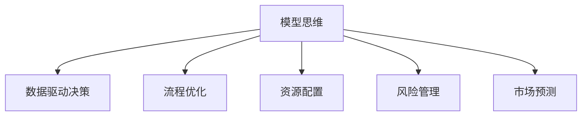

                 

## 1. 背景介绍

### 1.1 问题由来

随着信息技术和数据科学的迅猛发展，模型思维已经在各个领域取得了广泛应用。无论是金融、医疗、交通、教育，还是工业、农业、服务业，模型已经成为解决问题的重要工具。然而，模型思维在实际管理中的应用仍处于起步阶段，许多管理者尚未认识到模型思维的价值，也缺乏使用模型思维的能力。因此，如何将模型思维应用于实际管理，提升管理效率和决策质量，成为了当前管理领域的重要课题。

### 1.2 问题核心关键点

模型思维在管理中的应用主要体现在以下几个方面：

- **数据驱动决策**：通过收集和分析数据，建立模型来辅助决策，从而提高决策的科学性和准确性。
- **流程优化**：利用模型对业务流程进行分析，识别瓶颈和优化点，提升流程效率。
- **资源配置**：通过模型对资源进行优化配置，如人力资源、物资资源、财务资源等，最大化资源利用效率。
- **风险管理**：利用模型对风险进行量化评估，制定有效的风险控制策略。
- **市场预测**：通过建立预测模型，对市场趋势进行预测，辅助战略规划和市场定位。

模型思维的应用，能够帮助管理者更科学、更全面地理解业务问题，提高决策效率和质量，推动组织持续创新和优化。

## 2. 核心概念与联系

### 2.1 核心概念概述

为了更好地理解模型思维在实际管理中的应用，本节将介绍几个密切相关的核心概念：

- **模型思维**：基于数据和理论模型进行决策和优化的方法。通过建立和应用模型，对现实问题进行量化分析，提供科学合理的解决方案。

- **数据驱动决策**：利用数据和模型来辅助决策，避免主观判断带来的偏差和误差。

- **流程优化**：通过模型分析业务流程，识别瓶颈和改进点，提升流程效率和质量。

- **资源配置**：利用模型对各类资源进行优化配置，最大化资源利用效率。

- **风险管理**：通过模型量化评估和管理风险，制定有效的风险控制策略。

- **市场预测**：建立预测模型，对市场趋势进行预测，辅助战略规划和市场定位。

这些核心概念之间的逻辑关系可以通过以下Mermaid流程图来展示：



这个流程图展示了一些关键概念之间的联系：

1. 模型思维是核心，数据驱动决策、流程优化、资源配置、风险管理和市场预测都是模型思维的具体应用。
2. 数据驱动决策和流程优化是模型思维在业务管理中的应用，通过量化分析，提高决策和流程的科学性和效率。
3. 资源配置和风险管理是模型思维在资源管理和风险控制中的应用，通过优化和量化分析，最大化资源利用效率和风险控制能力。
4. 市场预测是模型思维在市场分析中的应用，通过预测模型，辅助企业制定战略和市场定位。

## 3. 核心算法原理 & 具体操作步骤
### 3.1 算法原理概述

模型思维在实际管理中的应用，主要依赖于数据和模型。通过收集和分析数据，建立合适的模型，对业务问题进行量化分析，从而提供科学合理的解决方案。

模型思维的核心算法原理包括以下几个方面：

1. **数据采集**：通过各种手段收集业务数据，如客户数据、销售数据、市场数据、财务数据等。
2. **数据清洗**：对采集的数据进行清洗和预处理，去除噪声和异常值，确保数据质量和一致性。
3. **模型选择**：根据业务问题的特点，选择合适的模型进行量化分析，如回归模型、分类模型、聚类模型、预测模型等。
4. **模型训练**：利用历史数据对模型进行训练，优化模型参数，提高模型的预测能力。
5. **模型验证**：通过验证数据集评估模型性能，确保模型的泛化能力。
6. **模型应用**：将训练好的模型应用于实际业务场景，提供决策支持和优化建议。

### 3.2 算法步骤详解

以下是一个典型的模型思维在实际管理中的应用步骤：

**Step 1: 数据收集和清洗**

- **数据收集**：使用各种方式（如数据库、API接口、爬虫等）收集业务数据。
- **数据清洗**：去除缺失值、重复值和异常值，确保数据的一致性和完整性。

**Step 2: 模型选择和构建**

- **模型选择**：根据业务问题的特点和目标，选择合适的模型类型。
- **模型构建**：使用Python、R等语言和TensorFlow、PyTorch等框架构建模型，并进行参数调整和优化。

**Step 3: 模型训练和验证**

- **模型训练**：使用历史数据对模型进行训练，优化模型参数。
- **模型验证**：在验证集上评估模型性能，确保模型泛化能力。

**Step 4: 模型应用和优化**

- **模型应用**：将训练好的模型应用于实际业务场景，提供决策支持和优化建议。
- **模型优化**：根据反馈结果，对模型进行迭代优化，提高模型性能。

### 3.3 算法优缺点

模型思维在实际管理中的应用具有以下优点：

1. **数据驱动决策**：通过量化分析和数据驱动，减少主观判断带来的误差，提高决策的科学性和准确性。
2. **流程优化**：通过模型分析业务流程，识别瓶颈和改进点，提升流程效率和质量。
3. **资源配置**：通过模型优化资源配置，最大化资源利用效率。
4. **风险管理**：通过模型量化评估和管理风险，制定有效的风险控制策略。
5. **市场预测**：通过预测模型，辅助战略规划和市场定位，提升市场竞争力。

同时，模型思维也存在一些缺点：

1. **数据质量依赖**：模型的预测结果依赖于数据的质量，数据质量不高会导致模型性能下降。
2. **模型复杂度高**：复杂的模型需要更多的计算资源和时间，对技术人员和计算资源要求较高。
3. **模型可解释性不足**：一些复杂的模型如深度学习模型，其预测过程难以解释，管理者难以理解和接受。
4. **模型泛化能力有限**：模型可能存在过拟合问题，对新数据的泛化能力不足。
5. **业务理解不足**：模型只是工具，最终的决策还需要结合业务理解和经验。

尽管存在这些缺点，但模型思维在实际管理中的应用已经显现出巨大的价值，特别是在数据驱动和决策支持方面。

### 3.4 算法应用领域

模型思维在实际管理中的应用已经广泛涉及各个领域：

- **金融行业**：利用模型进行风险评估、投资预测、信用评分等。
- **医疗行业**：利用模型进行疾病预测、治疗方案优化、病人分流等。
- **零售行业**：利用模型进行销售预测、库存管理、客户行为分析等。
- **制造行业**：利用模型进行生产流程优化、设备维护预测、质量控制等。
- **物流行业**：利用模型进行路线优化、货物分配、运输时间预测等。

## 4. 数学模型和公式 & 详细讲解 & 举例说明
### 4.1 数学模型构建

模型思维在实际管理中的应用，往往需要建立数学模型来量化和优化业务问题。以下是一个典型的数学模型构建过程：

1. **问题描述**：明确业务问题，如销售预测、客户流失预测、客户满意度评估等。
2. **变量定义**：定义问题中的关键变量，如时间、客户、产品等。
3. **建立模型**：选择合适的数学模型，如线性回归、逻辑回归、决策树、随机森林等。
4. **模型训练**：利用历史数据对模型进行训练，优化模型参数。
5. **模型验证**：在验证集上评估模型性能，确保模型泛化能力。

### 4.2 公式推导过程

以销售预测为例，我们可以使用时间序列模型进行预测。假设销售量 $y_t$ 与时间 $t$ 之间的关系为线性回归模型：

$$
y_t = \beta_0 + \beta_1 t + \epsilon_t
$$

其中 $\beta_0$ 和 $\beta_1$ 为回归系数，$\epsilon_t$ 为误差项。我们可以通过最小二乘法（OLS）来求解 $\beta_0$ 和 $\beta_1$：

$$
\hat{\beta}_0 = \frac{\sum_{t=1}^{n} (y_t - \hat{y}_t)}{\sum_{t=1}^{n} (t-1)^2}
$$

$$
\hat{\beta}_1 = \frac{\sum_{t=1}^{n} (t-1)(y_t - \hat{y}_t)}{\sum_{t=1}^{n} (t-1)^2}
$$

其中 $\hat{y}_t = \hat{\beta}_0 + \hat{\beta}_1 t$。

### 4.3 案例分析与讲解

假设我们有一个电子商务平台，想要预测未来一个月的销售量。以下是模型构建和使用的步骤：

1. **数据收集**：从平台数据库中收集过去一年每天的销售量数据。
2. **数据清洗**：去除缺失值和异常值，确保数据质量。
3. **模型选择**：选择时间序列模型进行销售预测。
4. **模型训练**：使用历史数据对模型进行训练，求解 $\hat{\beta}_0$ 和 $\hat{\beta}_1$。
5. **模型验证**：在验证集上评估模型性能，如使用均方误差（MSE）作为评价指标。
6. **模型应用**：将训练好的模型应用于实际业务场景，预测未来一个月的销售量。
7. **模型优化**：根据预测结果和反馈，对模型进行迭代优化，提高预测精度。

## 5. 项目实践：代码实例和详细解释说明
### 5.1 开发环境搭建

在进行模型思维在实际管理中的应用实践前，我们需要准备好开发环境。以下是使用Python进行数据驱动决策的开发环境配置流程：

1. 安装Anaconda：从官网下载并安装Anaconda，用于创建独立的Python环境。
2. 创建并激活虚拟环境：
```bash
conda create -n data-driver-env python=3.8 
conda activate data-driver-env
```

3. 安装必要的Python库：
```bash
conda install pandas numpy matplotlib scikit-learn statsmodels
```

4. 安装数据处理和分析工具：
```bash
pip install xlrd xlwt pandas_datareader
```

完成上述步骤后，即可在`data-driver-env`环境中开始开发。

### 5.2 源代码详细实现

以下是一个典型的数据驱动决策代码实例，用于预测电商平台的日销售量：

```python
import pandas as pd
import numpy as np
import statsmodels.api as sm

# 数据读取
df = pd.read_excel('sales_data.xlsx', sheet_name='Sheet1')

# 数据清洗
df.dropna(inplace=True)

# 模型构建
X = df['date'].astype('datetime64[D]') - df['date'].shift(1)
y = df['sales']

# 数据拆分
train_X = X.iloc[:-30]
train_y = y.iloc[:-30]
test_X = X.iloc[-30:]
test_y = y.iloc[-30:]

# 模型训练
X_train = sm.add_constant(train_X)
model = sm.OLS(train_y, X_train).fit()

# 模型验证
test_X = sm.add_constant(test_X)
predictions = model.predict(test_X)
mse = np.mean((predictions - test_y)**2)

# 模型应用
future_X = pd.date_range(start=df['date'].max(), periods=30, freq='D').astype('datetime64[D]') - df['date'].shift(1)
future_X = sm.add_constant(future_X)
future_y = model.predict(future_X)
```

### 5.3 代码解读与分析

让我们再详细解读一下关键代码的实现细节：

**数据读取和清洗**：
- `pd.read_excel`：使用pandas库读取Excel文件。
- `df.dropna(inplace=True)`：去除缺失值。

**模型构建**：
- `X = df['date'].astype('datetime64[D]') - df['date'].shift(1)`：构建时间序列数据。
- `y = df['sales']`：获取销售量数据。
- `train_X = X.iloc[:-30]`：分割训练集和测试集。

**模型训练**：
- `sm.add_constant(train_X)`：添加常数项。
- `model = sm.OLS(train_y, X_train).fit()`：使用statsmodels库的OLS模型进行训练。

**模型验证**：
- `test_X = sm.add_constant(test_X)`：添加常数项。
- `predictions = model.predict(test_X)`：预测测试集数据。
- `mse = np.mean((predictions - test_y)**2)`：计算均方误差。

**模型应用**：
- `future_X = pd.date_range(start=df['date'].max(), periods=30, freq='D').astype('datetime64[D]') - df['date'].shift(1)`：生成未来30天的预测数据。
- `future_X = sm.add_constant(future_X)`：添加常数项。
- `future_y = model.predict(future_X)`：预测未来数据。

可以看到，通过Python的pandas、statsmodels等库，可以方便地进行数据处理、模型训练和应用，实现了数据驱动决策的自动化和高效化。

## 6. 实际应用场景
### 6.1 企业绩效分析

企业绩效分析是管理中的重要环节，通过对关键绩效指标（KPI）的监控和分析，能够及时发现问题和改进点，提升企业运营效率和盈利能力。模型思维在企业绩效分析中的应用主要体现在以下几个方面：

- **销售预测**：利用时间序列模型或回归模型，预测未来销售趋势，辅助库存管理和销售策略制定。
- **成本控制**：利用回归模型或决策树模型，分析成本与生产量、销售量之间的关系，优化成本结构。
- **市场份额分析**：利用回归模型或聚类模型，分析不同市场的份额变化，制定市场扩展策略。

### 6.2 供应链优化

供应链优化是企业管理的核心环节之一，通过模型思维可以对供应链进行科学分析和优化，提升供应链效率和响应能力。模型思维在供应链优化中的应用主要体现在以下几个方面：

- **需求预测**：利用时间序列模型或回归模型，预测市场需求变化，优化库存水平和供应链响应。
- **运输优化**：利用线性规划或网络优化模型，优化运输路线和运输成本，提高运输效率。
- **生产调度**：利用调度模型或模拟模型，优化生产计划和生产资源分配，提升生产效率。

### 6.3 人力资源管理

人力资源管理是企业管理的另一重要环节，通过模型思维可以对人力资源进行科学管理和优化，提升人力资源利用效率和员工满意度。模型思维在人力资源管理中的应用主要体现在以下几个方面：

- **员工流失预测**：利用分类模型或回归模型，预测员工流失率，制定有效的留人策略。
- **绩效评估**：利用回归模型或聚类模型，分析员工绩效与工作投入、工作环境之间的关系，优化绩效评估标准。
- **人才招聘**：利用回归模型或聚类模型，分析人才需求与行业趋势之间的关系，制定有效的人才招聘策略。

### 6.4 未来应用展望

随着模型思维的不断发展和应用，其在实际管理中的应用前景将更加广阔：

- **智能化决策支持**：通过建立智能化的决策支持系统，利用模型思维辅助高层管理者进行决策，提升决策的科学性和效率。
- **跨部门协同**：通过模型思维将各部门的业务数据进行整合，实现跨部门协同管理，提升整体运营效率。
- **个性化服务**：利用模型思维提供个性化的客户服务和员工管理，提升客户满意度和员工满意度。
- **自动化流程**：通过模型思维实现自动化流程管理和优化，提升流程效率和质量。
- **实时监控**：利用实时数据流和模型思维进行实时监控和预警，提升企业应对突发事件的能力。

## 7. 工具和资源推荐
### 7.1 学习资源推荐

为了帮助开发者系统掌握模型思维在实际管理中的应用，这里推荐一些优质的学习资源：

1. **《数据科学与机器学习》系列课程**：由斯坦福大学和Coursera联合推出，涵盖了数据科学和机器学习的基础知识和实践技巧，适合初学者和进阶者。
2. **《Python数据科学手册》**：由Jake VanderPlas撰写，全面介绍了Python在数据科学和机器学习中的应用，适合数据驱动决策的实践者。
3. **《机器学习实战》**：由Peter Harrington撰写，通过实际案例和代码实现，帮助读者掌握机器学习模型的构建和应用。
4. **Kaggle竞赛**：Kaggle是全球最大的数据科学竞赛平台，提供了丰富的数据集和挑战赛，是提升模型思维实践能力的最佳场所。

通过对这些资源的学习实践，相信你一定能够快速掌握模型思维在实际管理中的应用，并用于解决实际的业务问题。

### 7.2 开发工具推荐

高效的开发离不开优秀的工具支持。以下是几款用于模型思维开发和应用的工具：

1. **Jupyter Notebook**：开源的交互式编程环境，支持Python等语言，方便代码的编写和运行。
2. **PyCharm**：专业的Python IDE，提供了丰富的功能和工具，支持数据驱动决策的开发和调试。
3. **RStudio**：开源的数据分析和可视化工具，支持R语言，适合数据驱动决策的分析和报告生成。
4. **Tableau**：强大的数据可视化工具，支持多种数据源，适合将模型思维的结果进行可视化和展示。
5. **Power BI**：微软推出的数据可视化工具，支持多种数据源和分析模型，适合将模型思维的结果进行可视化和共享。

合理利用这些工具，可以显著提升模型思维在实际管理中的应用效率，加快创新迭代的步伐。

### 7.3 相关论文推荐

模型思维的发展源于学界的持续研究。以下是几篇奠基性的相关论文，推荐阅读：

1. **《机器学习实战》**：Peter Harrington著，介绍了机器学习模型的基本原理和实践技巧，适合模型思维的入门者。
2. **《数据科学导论》**：Jake VanderPlas著，全面介绍了数据科学和机器学习的方法和工具，适合数据驱动决策的深入学习。
3. **《统计学习方法》**：李航著，介绍了统计学习的基本理论和算法，适合模型思维的进阶学习。

这些论文代表了大数据和模型思维的发展脉络。通过学习这些前沿成果，可以帮助研究者把握学科前进方向，激发更多的创新灵感。

## 8. 总结：未来发展趋势与挑战
### 8.1 总结

本文对模型思维在实际管理中的应用进行了全面系统的介绍。首先阐述了模型思维的研究背景和意义，明确了模型思维在数据驱动决策、流程优化、资源配置、风险管理、市场预测等方面的独特价值。其次，从原理到实践，详细讲解了模型思维的数学模型构建和具体实现步骤，给出了模型思维任务开发的完整代码实例。同时，本文还广泛探讨了模型思维在企业绩效分析、供应链优化、人力资源管理等多个领域的应用前景，展示了模型思维的巨大潜力。此外，本文精选了模型思维的各类学习资源，力求为读者提供全方位的技术指引。

通过本文的系统梳理，可以看到，模型思维在实际管理中的应用已经展现出巨大的价值，特别是在数据驱动和决策支持方面。未来，随着大数据和人工智能技术的进一步发展，模型思维的应用场景将更加广阔，为管理决策提供更加科学和高效的支持。

### 8.2 未来发展趋势

展望未来，模型思维在实际管理中的应用将呈现以下几个发展趋势：

1. **智能化决策支持**：通过建立智能化的决策支持系统，利用模型思维辅助高层管理者进行决策，提升决策的科学性和效率。
2. **跨部门协同**：通过模型思维将各部门的业务数据进行整合，实现跨部门协同管理，提升整体运营效率。
3. **个性化服务**：利用模型思维提供个性化的客户服务和员工管理，提升客户满意度和员工满意度。
4. **自动化流程**：通过模型思维实现自动化流程管理和优化，提升流程效率和质量。
5. **实时监控**：利用实时数据流和模型思维进行实时监控和预警，提升企业应对突发事件的能力。

这些趋势凸显了模型思维在实际管理中的广阔前景。随着技术的不断发展，模型思维将与更多的业务场景相结合，为组织带来更大的价值。

### 8.3 面临的挑战

尽管模型思维在实际管理中的应用已经取得了显著成果，但在迈向更加智能化、普适化应用的过程中，它仍面临诸多挑战：

1. **数据质量问题**：数据质量不高会导致模型性能下降，影响决策的科学性和准确性。
2. **模型复杂性**：复杂的模型需要更多的计算资源和时间，对技术人员和计算资源要求较高。
3. **模型可解释性**：一些复杂的模型如深度学习模型，其预测过程难以解释，管理者难以理解和接受。
4. **业务理解不足**：模型只是工具，最终的决策还需要结合业务理解和经验。
5. **模型泛化能力**：模型可能存在过拟合问题，对新数据的泛化能力不足。

尽管存在这些挑战，但随着技术的不断进步和业务的深入融合，模型思维在实际管理中的应用前景将更加广阔。未来，模型思维将与更多的业务场景相结合，为组织带来更大的价值。

### 8.4 研究展望

面对模型思维面临的挑战，未来的研究需要在以下几个方面寻求新的突破：

1. **数据治理和质量提升**：通过建立数据治理机制，确保数据质量，提升模型的预测能力。
2. **模型可解释性**：开发更加可解释的模型，如LIME、SHAP等，提高模型决策的透明性和可接受性。
3. **业务理解和融合**：结合业务理解和经验，优化模型设计和应用，提高模型的实用性和可靠性。
4. **模型优化和迭代**：通过不断的模型优化和迭代，提升模型的泛化能力和预测精度。
5. **模型整合和集成**：将多种模型进行整合和集成，构建更加全面的决策支持系统。

这些研究方向的探索，必将引领模型思维在实际管理中的应用进入新的高度，为组织带来更大的价值。面向未来，模型思维需要与其他技术和方法进行更深入的融合，共同推动业务决策的科学化和智能化。

## 9. 附录：常见问题与解答

**Q1：模型思维在实际管理中如何应用？**

A: 模型思维在实际管理中的应用主要体现在以下几个方面：

1. **数据驱动决策**：通过收集和分析数据，建立模型来辅助决策，从而提高决策的科学性和准确性。
2. **流程优化**：通过模型分析业务流程，识别瓶颈和改进点，提升流程效率。
3. **资源配置**：通过模型对各类资源进行优化配置，最大化资源利用效率。
4. **风险管理**：通过模型量化评估和管理风险，制定有效的风险控制策略。
5. **市场预测**：通过预测模型，辅助战略规划和市场定位，提升市场竞争力。

**Q2：模型思维的应用过程中需要注意哪些问题？**

A: 模型思维的应用过程中需要注意以下问题：

1. **数据质量**：数据质量不高会导致模型性能下降，影响决策的科学性和准确性。
2. **模型复杂性**：复杂的模型需要更多的计算资源和时间，对技术人员和计算资源要求较高。
3. **模型可解释性**：一些复杂的模型如深度学习模型，其预测过程难以解释，管理者难以理解和接受。
4. **业务理解不足**：模型只是工具，最终的决策还需要结合业务理解和经验。
5. **模型泛化能力**：模型可能存在过拟合问题，对新数据的泛化能力不足。

**Q3：模型思维在实际管理中的效果如何？**

A: 模型思维在实际管理中具有显著的效果：

1. **数据驱动决策**：通过量化分析和数据驱动，减少主观判断带来的误差，提高决策的科学性和准确性。
2. **流程优化**：通过模型分析业务流程，识别瓶颈和改进点，提升流程效率和质量。
3. **资源配置**：通过模型优化资源配置，最大化资源利用效率。
4. **风险管理**：通过模型量化评估和管理风险，制定有效的风险控制策略。
5. **市场预测**：通过预测模型，辅助战略规划和市场定位，提升市场竞争力。

**Q4：如何选择合适的模型思维方法？**

A: 选择合适的模型思维方法需要考虑以下几个方面：

1. **问题类型**：根据业务问题的特点，选择合适的模型类型。
2. **数据规模**：根据数据规模，选择合适的模型复杂度和参数数量。
3. **计算资源**：根据计算资源，选择合适的模型复杂度和训练时间。
4. **业务理解**：结合业务理解和经验，优化模型设计和应用，提高模型的实用性和可靠性。

**Q5：模型思维在实际管理中的未来发展趋势是什么？**

A: 模型思维在实际管理中的未来发展趋势包括：

1. **智能化决策支持**：通过建立智能化的决策支持系统，利用模型思维辅助高层管理者进行决策，提升决策的科学性和效率。
2. **跨部门协同**：通过模型思维将各部门的业务数据进行整合，实现跨部门协同管理，提升整体运营效率。
3. **个性化服务**：利用模型思维提供个性化的客户服务和员工管理，提升客户满意度和员工满意度。
4. **自动化流程**：通过模型思维实现自动化流程管理和优化，提升流程效率和质量。
5. **实时监控**：利用实时数据流和模型思维进行实时监控和预警，提升企业应对突发事件的能力。

这些趋势凸显了模型思维在实际管理中的广阔前景。随着技术的不断发展，模型思维将与更多的业务场景相结合，为组织带来更大的价值。

---

作者：禅与计算机程序设计艺术 / Zen and the Art of Computer Programming

