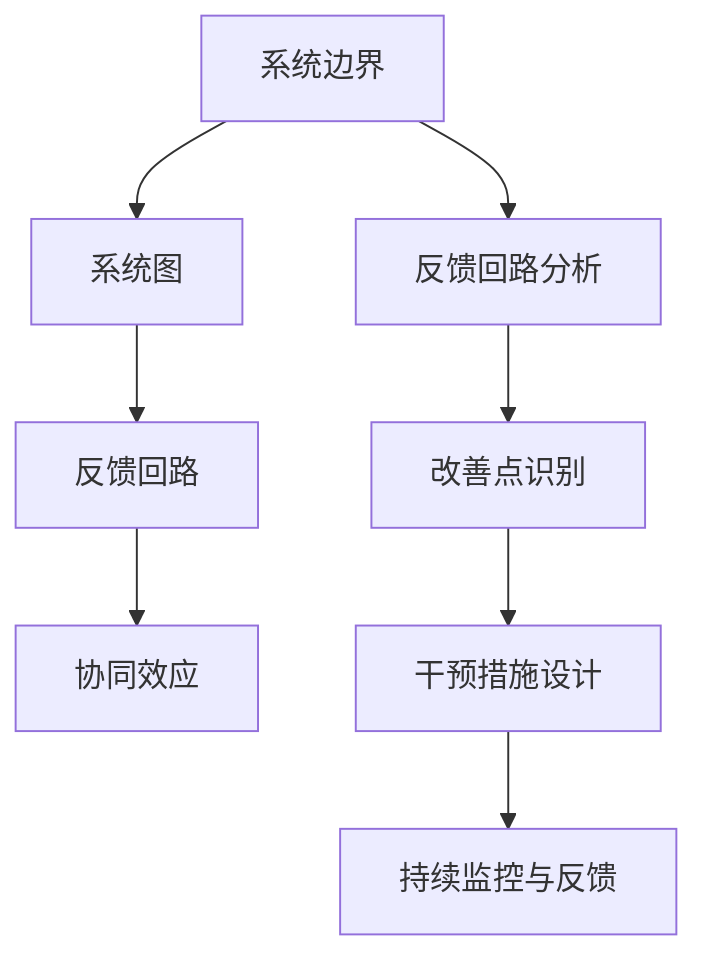

                 

# 如何将系统思考应用于团队管理

> 关键词：系统思考, 团队管理, 协同效应, 反馈机制, 持续改进, 敏捷方法

## 1. 背景介绍

### 1.1 问题由来

现代组织运作越发复杂，规模越来越大，跨部门、跨地域的协作变得愈加频繁。在面对复杂多变的外部环境与内部挑战时，如何协调好各部门的工作，提升团队的协作效率和创新能力，成为企业面临的重要课题。

随着系统科学和组织理论的演进，系统思考(System Thinking)的概念被引入管理领域。它强调通过全局视角来理解组织系统内部的相互关系和运行机制，从而寻找有效的解决方案，确保组织目标的实现。

### 1.2 问题核心关键点

系统思考的核心是“反馈回路”（Feedback Loop）。它描述系统内部各元素之间的相互作用，揭示组织的运作规律和潜在的改进空间。主要包含以下步骤：

1. **识别系统边界**：明确系统所包括的元素，以及系统与外部环境的互动关系。
2. **绘制系统图**：用结构化图表展示系统各元素之间的连接和信息流动。
3. **分析反馈回路**：识别系统中的正反馈和负反馈回路，理解系统的动态变化和行为模式。
4. **寻找改善点**：基于系统图和反馈回路分析，发现可以优化和改进的部分。
5. **设计干预措施**：提出切实可行的措施，调整系统结构或参数，以期提升系统性能。
6. **持续监控与反馈**：定期评估干预措施的效果，确保系统稳定运行和持续改进。

系统思考的应用可以拓展到各个组织层级，从个体工作到团队管理，乃至企业战略决策，均有广泛的应用价值。

### 1.3 问题研究意义

系统思考有助于管理者以更为全局和动态的视角审视团队运作，通过识别和调整系统中的关键反馈回路，实现以下目标：

1. **提升协作效率**：打破部门间的信息孤岛，优化信息流动，促进跨部门协作。
2. **增强团队凝聚力**：通过共同理解组织目标和系统运行规律，提升团队成员的责任感和协作意愿。
3. **促进持续改进**：通过定期反馈和调整，确保组织系统不断适应环境变化，提升整体绩效。
4. **优化决策质量**：通过系统视角，减少决策过程中的片面性和短期行为，提升决策质量。
5. **实现战略对齐**：确保团队行为与组织战略保持一致，提高战略执行力。

## 2. 核心概念与联系

### 2.1 核心概念概述

系统思考的核心概念主要包括系统边界、系统图、反馈回路、协同效应等。

- **系统边界**：系统所包含的元素以及与外部环境的互动关系。明确边界有助于理解系统的输入输出和内部结构。
- **系统图**：通过结构化图表展示系统元素间的连接和信息流动，可视化系统运作方式。
- **反馈回路**：系统内部各元素间的相互作用关系，正反馈和负反馈回路分别表示系统在稳定和动态变化中的行为模式。
- **协同效应**：通过优化系统结构，实现系统内元素间的相互协作和放大效应，提升整体系统性能。

这些概念通过合作用于团队管理，帮助管理者识别团队运作中的关键问题，并制定相应的改进策略。

### 2.2 核心概念原理和架构的 Mermaid 流程图

这个流程图展示了系统思考在团队管理中的应用路径：从明确系统边界到绘制系统图，再到分析反馈回路和协同效应，最终设计干预措施并进行持续监控。

## 3. 核心算法原理 & 具体操作步骤

### 3.1 算法原理概述

系统思考的应用核心在于通过系统图和反馈回路分析，理解团队运作的动态变化和行为模式，识别改进点并设计干预措施，进而实现团队的协同效应和持续改进。

### 3.2 算法步骤详解

#### 3.2.1 识别系统边界

1. **确定团队目标**：明确团队的共同目标和任务，以及关键绩效指标。
2. **识别关键要素**：列出参与团队管理的各个成员、角色和部门，以及他们在团队中的主要职责和活动。
3. **绘制系统边界图**：使用UML图或系统图的方式，绘制团队系统的边界，展示团队内外部的互动关系。

#### 3.2.2 绘制系统图

1. **选择绘图工具**：如Lucidchart、Draw.io等，选择合适的工具绘制系统图。
2. **确定元素和连接**：将团队成员、角色、任务、工具和沟通方式作为系统图中的元素，用箭头表示元素之间的信息流动和相互作用。
3. **添加注释和反馈回路**：对系统图进行详细注释，标记关键反馈回路和影响因素。

#### 3.2.3 分析反馈回路

1. **识别正反馈和负反馈**：在系统图中识别正反馈回路（增强性回路）和负反馈回路（平衡性回路）。
   - 正反馈回路：系统中的正反馈通常导致系统的不稳定和动态变化。
   - 负反馈回路：系统中的负反馈则有助于系统达到稳态和平衡。
2. **绘制反馈回路图**：用箭头标出正负反馈回路，并标记关键控制点。

#### 3.2.4 寻找改善点

1. **识别系统瓶颈**：通过系统图和反馈回路图，找到系统中影响效率和协作的瓶颈和问题点。
2. **设计改善策略**：根据瓶颈和问题点，提出切实可行的改进措施。例如，改进沟通机制、优化流程设计、增强团队协作等。

#### 3.2.5 设计干预措施

1. **实施改善措施**：根据设计好的改善策略，制定具体的实施计划和步骤，并进行资源配置。
2. **评估干预效果**：通过关键绩效指标（KPI）和反馈回路，评估改善措施的效果，检查是否达到了预期目标。

#### 3.2.6 持续监控与反馈

1. **定期评估**：定期收集数据和反馈，评估团队和系统的运行状态。
2. **调整改进措施**：根据评估结果，不断调整和优化改善措施，确保系统稳定运行。

### 3.3 算法优缺点

#### 3.3.1 优点

- **全局视角**：系统思考帮助管理者从全局角度理解团队运作，避免局部视角导致的片面决策。
- **动态理解**：通过反馈回路分析，管理者可以动态跟踪团队运作的变化，及时调整策略。
- **协同效应**：识别并优化系统中的协同效应，提升团队整体绩效。
- **持续改进**：定期监控和评估，确保团队不断适应变化，提升长期竞争力。

#### 3.3.2 缺点

- **复杂性高**：系统思考要求管理者具有全局视角和系统思维，可能对某些管理者的思维模式和经验要求较高。
- **需要时间和精力**：绘制系统图和分析反馈回路需要时间和精力投入，可能不适合快速变化的环境。
- **数据需求大**：系统思考需要大量的数据支持，收集和分析数据可能成为系统实施的瓶颈。
- **依赖于工具和技术**：系统图的绘制和分析需要借助专业的工具和技术，可能需要额外的培训和资源。

### 3.4 算法应用领域

系统思考在团队管理中的应用领域包括但不限于以下方面：

- **跨部门协作**：识别和优化跨部门之间的反馈回路，提升信息共享和协作效率。
- **团队沟通**：分析团队沟通机制，优化信息流动路径，减少信息传递中的损耗和误解。
- **绩效管理**：通过系统图和反馈回路，识别影响绩效的关键因素，优化绩效评估和激励机制。
- **创新管理**：识别团队创新的反馈回路，优化创新流程，提升创新能力和效率。
- **知识管理**：分析团队知识流动和共享机制，优化知识管理流程，提升团队知识水平和应用能力。
- **风险管理**：通过系统图和反馈回路，识别和管理团队运作中的潜在风险和瓶颈，确保团队运作稳定。

## 4. 数学模型和公式 & 详细讲解 & 举例说明

### 4.1 数学模型构建

系统思考的应用主要依赖于系统图和反馈回路的建模和分析。以下是系统图的数学模型构建：

假设团队系统由n个元素组成，元素之间的关系可以用有向图G表示：

- 元素集：$V=\{v_1, v_2, ..., v_n\}$
- 边集：$E=\{e_{i,j}\}$，其中$e_{i,j}$表示元素$i$与元素$j$之间的信息流动关系。

系统图的数学模型可以表示为：

$$
G(V, E) = (V, \{e_{i,j}\}_{i,j \in V})
$$

其中$V$为顶点集合，$E$为边集合。

### 4.2 公式推导过程

通过系统图，我们可以分析团队运作中的反馈回路。假设系统图中有$m$个正反馈回路和$n$个负反馈回路，它们分别对系统行为有增强和平衡作用。

正反馈回路公式：

$$
\text{Positive Feedback Loop} = \sum_{i=1}^m \sum_{j=1}^{m_i} e_{v_i, v_{i,j}}
$$

负反馈回路公式：

$$
\text{Negative Feedback Loop} = \sum_{i=1}^n \sum_{j=1}^{n_i} e_{v_i, v_{i,j}}
$$

其中$m_i$和$n_i$表示第$i$个正负反馈回路包含的元素数量。

### 4.3 案例分析与讲解

假设一个软件开发团队由项目经理、产品经理、开发工程师、测试工程师和运维工程师组成。

1. **识别系统边界**：团队的目标是按时交付高质量的软件产品，关键绩效指标包括按时交付率、代码质量、用户满意度等。
2. **绘制系统图**：通过UML图绘制团队系统图，标明各个成员的职责和信息流动路径。
3. **分析反馈回路**：识别出开发过程中的正反馈和负反馈回路，如开发进度加快会提高用户满意度，但同时也会增加测试压力。
4. **寻找改善点**：通过系统图和反馈回路分析，识别出项目延期和代码质量问题的瓶颈。
5. **设计干预措施**：提出并实施改善措施，如优化测试流程、改进沟通机制等。
6. **持续监控与反馈**：定期评估改善措施的效果，并根据反馈进行持续调整。

## 5. 项目实践：代码实例和详细解释说明

### 5.1 开发环境搭建

在系统思考的应用中，开发环境搭建主要依赖于工具和平台的选择。以下是推荐使用的工具：

1. **Lucidchart**：在线绘图工具，适合绘制系统图和反馈回路图。
2. **UML设计工具**：如Visio、OMG等，适合绘制系统边界图和流程图。
3. **数据分析工具**：如Excel、R等，适合数据收集和分析。
4. **项目管理工具**：如JIRA、Trello等，适合跟踪和监控系统改善措施的实施效果。

### 5.2 源代码详细实现

由于系统思考的应用主要依赖于定性和定量分析，并不涉及复杂的算法实现，因此在这里主要介绍系统图的绘制和反馈回路的分析。

1. **系统图绘制**：
   - 使用Lucidchart在线创建系统图，包含各个元素和信息流动的连接线。
   - 在图中标注关键反馈回路和控制点。

2. **反馈回路分析**：
   - 统计系统图中的正反馈和负反馈回路数量。
   - 使用图表展示正负反馈回路的分布和关系。

### 5.3 代码解读与分析

由于系统思考的实现主要依赖于可视化工具和数据统计，并不涉及复杂的代码实现，因此在这里主要介绍系统图的绘制和反馈回路的分析。

**系统图绘制**：
- 在Lucidchart上，选择适当的模板，添加各个元素，并用箭头表示信息流动。
- 在图中添加反馈回路和控制点，使用注释说明各元素和回路的作用。

**反馈回路分析**：
- 统计系统图中的正反馈和负反馈回路数量。
- 使用图表展示正负反馈回路的分布和关系，如柱状图、散点图等。

### 5.4 运行结果展示

运行结果主要是通过可视化工具展示的系统图和反馈回路图。例如，可以使用Lucidchart展示团队系统图，使用Excel展示正负反馈回路数量和分布。

## 6. 实际应用场景

### 6.1 敏捷项目管理

在敏捷开发中，系统思考的应用有助于团队理解项目进度和质量的关系，通过优化正负反馈回路，提升团队协作效率和项目成功率。

通过系统图绘制和反馈回路分析，敏捷团队可以识别出项目进度和质量控制的关键点，优化沟通机制和流程设计，提升团队协同效应。例如，通过系统图发现开发进度加快导致测试压力增大，团队可以优化测试流程和资源分配，确保项目按时交付。

### 6.2 知识共享与创新

在系统思考的应用中，通过识别和优化知识共享和创新的反馈回路，促进团队的知识积累和应用。

例如，某科技公司通过系统图分析，发现知识共享机制不完善导致信息孤岛和重复工作，团队通过优化知识共享流程，建立了知识共享平台，提升了知识应用效率和团队创新能力。

### 6.3 风险管理与决策支持

在系统思考的应用中，通过识别和管理团队运作中的潜在风险，提升决策质量，增强团队对外部环境变化的适应能力。

某银行通过系统图分析，识别出客户投诉处理过程中的瓶颈和风险点，优化投诉处理流程，建立风险预警机制，提高了客户满意度和风险控制能力。

### 6.4 未来应用展望

随着系统思考的应用逐渐深入，其将在以下领域发挥更大的作用：

1. **智能化决策支持**：通过系统图和反馈回路分析，优化决策过程，提升决策质量和效率。
2. **多部门协同管理**：在跨部门协作中，系统思考帮助识别和优化协作瓶颈，提升信息流动和协同效应。
3. **动态环境适应**：在系统图中引入外部环境和变化因素，优化系统结构，增强团队对变化环境的适应能力。
4. **个性化管理**：通过系统图和反馈回路分析，识别和优化个性化的管理需求，提升团队成员的工作满意度和效率。
5. **数据驱动管理**：在系统图和反馈回路分析中引入大数据和人工智能技术，提升数据分析和管理能力。

## 7. 工具和资源推荐

### 7.1 学习资源推荐

1. **系统思考经典著作**：如《第五项修炼》、《系统思考：如何有效管理复杂性》等，帮助理解系统思考的基本概念和原理。
2. **组织理论与管理实践**：如《组织理论与组织设计》、《管理学》等，帮助理解组织运作规律和管理实践。
3. **系统图绘制工具**：如Lucidchart、Draw.io等，提供系统图的绘制和分析工具。
4. **数据分析工具**：如Excel、R、Python等，提供数据收集和分析工具。
5. **敏捷项目管理方法**：如Scrum、Kanban等，提供敏捷项目管理的实践和方法。

### 7.2 开发工具推荐

1. **系统图绘制工具**：如Lucidchart、Draw.io等，提供系统图的绘制和分析功能。
2. **数据分析工具**：如Excel、R、Python等，提供数据收集和分析功能。
3. **项目管理工具**：如JIRA、Trello等，提供项目跟踪和管理功能。

### 7.3 相关论文推荐

1. **系统思考与管理**：如《System Thinking: A Practical Guide》、《Understanding System Thinking: A Practical Guide》等，提供系统思考的深入研究和应用案例。
2. **复杂系统与组织**：如《Complex Systems: An Introduction》、《Organization Theory》等，提供复杂系统与组织管理的理论基础。
3. **数据分析与决策支持**：如《Data Analysis for Decision Making》、《Decision Support Systems》等，提供数据分析和决策支持的技术和方法。

## 8. 总结：未来发展趋势与挑战

### 8.1 研究成果总结

系统思考作为团队管理的重要工具，帮助管理者以全局视角理解团队运作，识别和优化反馈回路，实现团队的协同效应和持续改进。

1. **全局视角**：通过系统图和反馈回路分析，管理者可以全面理解团队运作，避免局部视角导致的片面决策。
2. **动态理解**：通过反馈回路分析，管理者可以动态跟踪团队运作的变化，及时调整策略。
3. **协同效应**：识别并优化系统中的协同效应，提升团队整体绩效。
4. **持续改进**：定期监控和评估，确保团队不断适应变化，提升长期竞争力。

### 8.2 未来发展趋势

1. **智能化决策支持**：通过系统图和反馈回路分析，优化决策过程，提升决策质量和效率。
2. **多部门协同管理**：在跨部门协作中，系统思考帮助识别和优化协作瓶颈，提升信息流动和协同效应。
3. **动态环境适应**：在系统图中引入外部环境和变化因素，优化系统结构，增强团队对变化环境的适应能力。
4. **个性化管理**：通过系统图和反馈回路分析，识别和优化个性化的管理需求，提升团队成员的工作满意度和效率。
5. **数据驱动管理**：在系统图和反馈回路分析中引入大数据和人工智能技术，提升数据分析和管理能力。

### 8.3 面临的挑战

1. **复杂性高**：系统思考要求管理者具有全局视角和系统思维，可能对某些管理者的思维模式和经验要求较高。
2. **需要时间和精力**：绘制系统图和分析反馈回路需要时间和精力投入，可能不适合快速变化的环境。
3. **数据需求大**：系统思考需要大量的数据支持，收集和分析数据可能成为系统实施的瓶颈。
4. **依赖于工具和技术**：系统图的绘制和分析需要借助专业的工具和技术，可能需要额外的培训和资源。

### 8.4 研究展望

1. **智能化系统思考**：结合人工智能和大数据技术，提升系统思考的智能化水平，增强其在动态环境中的适应能力。
2. **交互式系统图**：开发交互式系统图工具，提供实时的数据输入和分析功能，提升系统思考的应用便捷性。
3. **个性化反馈回路**：通过机器学习算法，识别团队成员的个性化反馈回路，提供个性化的管理建议。
4. **多模态反馈回路**：结合视觉、听觉等多模态数据，优化团队运作中的反馈回路，提升协作效果。
5. **开放性系统思考**：引入外部环境变化和反馈，构建开放性系统思考模型，增强团队对外部环境的适应能力。

## 9. 附录：常见问题与解答

**Q1: 系统思考在团队管理中有哪些具体应用场景？**

A: 系统思考在团队管理中的应用场景包括但不限于以下方面：

1. **跨部门协作**：识别和优化跨部门之间的反馈回路，提升信息共享和协作效率。
2. **团队沟通**：分析团队沟通机制，优化信息流动路径，减少信息传递中的损耗和误解。
3. **绩效管理**：通过系统图和反馈回路分析，识别影响绩效的关键因素，优化绩效评估和激励机制。
4. **创新管理**：识别团队创新的反馈回路，优化创新流程，提升创新能力和效率。
5. **知识管理**：分析团队知识流动和共享机制，优化知识管理流程，提升团队知识水平和应用能力。
6. **风险管理**：通过系统图和反馈回路分析，识别和管理团队运作中的潜在风险和瓶颈，确保团队运作稳定。

**Q2: 系统思考的实施过程有哪些关键步骤？**

A: 系统思考的实施过程主要包括以下关键步骤：

1. **识别系统边界**：明确团队目标和关键元素，绘制系统边界图。
2. **绘制系统图**：使用绘图工具，标明元素和信息流动，添加反馈回路和控制点。
3. **分析反馈回路**：识别正负反馈回路，分析系统运作中的动态变化。
4. **寻找改善点**：通过系统图和反馈回路分析，识别和优化系统中的瓶颈和问题点。
5. **设计干预措施**：提出并实施改善措施，优化系统结构和信息流动。
6. **持续监控与反馈**：定期评估改善措施的效果，根据反馈进行持续调整。

**Q3: 系统思考的优点和缺点有哪些？**

A: 系统思考的优点和缺点如下：

**优点**：

- **全局视角**：帮助管理者从全局角度理解团队运作，避免局部视角导致的片面决策。
- **动态理解**：通过反馈回路分析，管理者可以动态跟踪团队运作的变化，及时调整策略。
- **协同效应**：识别并优化系统中的协同效应，提升团队整体绩效。
- **持续改进**：定期监控和评估，确保团队不断适应变化，提升长期竞争力。

**缺点**：

- **复杂性高**：系统思考要求管理者具有全局视角和系统思维，可能对某些管理者的思维模式和经验要求较高。
- **需要时间和精力**：绘制系统图和分析反馈回路需要时间和精力投入，可能不适合快速变化的环境。
- **数据需求大**：系统思考需要大量的数据支持，收集和分析数据可能成为系统实施的瓶颈。
- **依赖于工具和技术**：系统图的绘制和分析需要借助专业的工具和技术，可能需要额外的培训和资源。

**Q4: 如何应用系统思考进行风险管理？**

A: 应用系统思考进行风险管理主要包括以下步骤：

1. **识别系统边界**：明确风险管理的边界和关键元素，绘制风险管理系统的边界图。
2. **绘制系统图**：标明风险管理系统的各个元素和信息流动，识别正负反馈回路和关键控制点。
3. **分析反馈回路**：识别系统中的正反馈和负反馈回路，分析风险管理的动态变化。
4. **寻找改善点**：通过系统图和反馈回路分析，识别风险管理中的瓶颈和问题点。
5. **设计干预措施**：提出并实施风险管理的改善措施，优化风险控制流程和机制。
6. **持续监控与反馈**：定期评估风险管理的效果，根据反馈进行持续调整，确保风险管理的持续改进。

**Q5: 系统思考在系统边界识别中有哪些方法？**

A: 系统思考在系统边界识别中主要采用以下方法：

1. **利益相关者分析**：识别所有与系统相关的利益相关者，明确他们的角色和职责。
2. **功能分解**：将系统分解为各个功能模块，明确每个模块的输入输出和交互方式。
3. **流程映射**：绘制系统流程图，标明各个流程步骤和数据流动路径。
4. **数据流图**：绘制系统数据流图，标明数据的收集、处理和输出方式。
5. **组织架构图**：绘制组织架构图，明确系统的层级结构和部门职责。

通过以上方法，可以全面识别系统的边界和关键元素，为系统图绘制和反馈回路分析提供基础。

---

作者：禅与计算机程序设计艺术 / Zen and the Art of Computer Programming

