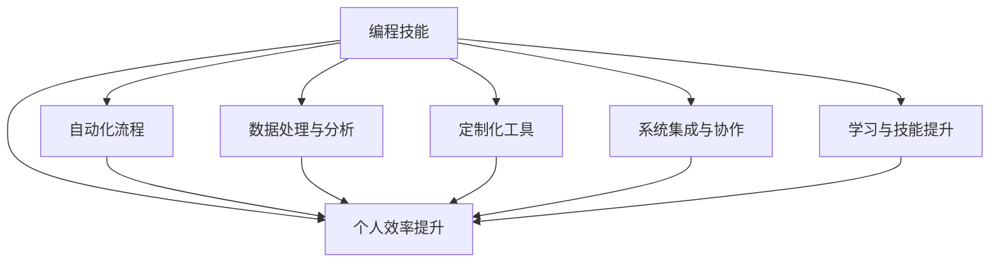

                 

# 如何将编程技能应用于个人效率提升

> 关键词：编程技能, 个人效率提升, 工具推荐, 学习资源, 高效编程实践

## 1. 背景介绍

### 1.1 问题由来
在信息化快速发展的今天，个人效率已成为职场竞争的核心要素之一。编程技能不仅仅是程序员必备的核心技能，也是各行各业专业人士提升个人效率的有力工具。无论是数据分析、项目管理、自动化运维，还是创意写作、设计和教育，编程能力都能大大提升工作效率，释放更多时间和精力去探索创新与成长。

然而，许多人仍然对编程技能存在误解，认为其仅限于写代码、维护系统等技术岗位。事实上，编程思维与编程技能可以广泛应用于生活工作的方方面面。本文将探讨如何将编程技能应用于个人效率提升，介绍一些实用的工具、技巧和实践，帮助读者在日常工作中借助编程技能提升效率。

### 1.2 问题核心关键点
掌握编程技能，能显著提升个人效率的关键点包括：

1. **自动化流程**：编程自动化可以帮助处理重复性、繁琐的任务，节省时间和精力。
2. **数据处理与分析**：通过编程工具对数据进行高效处理和分析，快速获取有价值的洞察。
3. **定制化工具**：编写自定义脚本或应用，解决特定场景下的效率问题。
4. **系统集成与协作**：通过API集成和模块化编程，提升跨部门协作效率。
5. **学习与技能提升**：编程学习过程中培养的逻辑思维和系统设计能力，提升整体工作能力。

掌握这些关键点，读者将能够充分利用编程技能，实现个人效率的全面提升。

### 1.3 问题研究意义
个人效率的提升是提升个人价值、实现职业发展的关键。通过编程技能，个人可以更加灵活、高效地应对工作挑战，不断学习与创新，为职业发展注入更多动力。同时，编程技能的应用也能激发对新技术的兴趣，提升整体的学习能力和问题解决能力。

## 2. 核心概念与联系

### 2.1 核心概念概述

为更好地理解编程技能如何应用于个人效率提升，本节将介绍几个关键概念及其相互关系：

- **编程技能**：指编写、调试和维护代码的能力，包括算法设计、代码风格、版本控制等。
- **个人效率**：指个人在工作、学习、生活等方面完成任务的速度与质量。
- **自动化流程**：通过编程实现任务自动化，减少手工操作，提升效率。
- **数据处理与分析**：使用编程语言和工具对数据进行清洗、处理和分析，提供决策支持。
- **定制化工具**：根据特定需求编写个性化工具或应用，提升工作效率。
- **系统集成与协作**：通过编程实现系统间的集成和协同，提升协作效率。
- **学习与技能提升**：通过编程学习，培养逻辑思维、系统设计和问题解决能力，提升整体工作能力。

这些概念通过以下Mermaid流程图进行逻辑展示：



这个流程图展示了编程技能与个人效率提升之间的关系，以及各个关键概念之间的逻辑联系。

## 3. 核心算法原理 & 具体操作步骤
### 3.1 算法原理概述

将编程技能应用于个人效率提升，本质上是一个利用编程工具和技术提升任务处理效率的过程。其核心思想是通过编程实现自动化、定制化、数据驱动的决策支持，从而提升任务处理的效率和质量。

形式化地，假设有一个需要完成的任务 $T$，其处理效率可以表示为 $E(T)$。通过编程技能，可以将任务 $T$ 自动化为程序 $P(T)$，利用已有的编程工具和技术，对输入数据进行处理和分析，从而提升任务处理效率。

具体地，编程技能在个人效率提升中的应用可以包括：

- **自动化流程**：使用编程语言编写脚本，实现任务的自动化处理。
- **数据处理与分析**：利用编程工具对数据进行清洗、统计和分析，提取有价值的洞察。
- **定制化工具**：根据具体需求编写定制化应用，解决特定问题。
- **系统集成与协作**：通过API和接口实现不同系统间的集成和协同。
- **学习与技能提升**：通过编程学习，提升逻辑思维、系统设计和问题解决能力。

### 3.2 算法步骤详解

基于编程技能提升个人效率的一般步骤如下：

**Step 1: 需求分析**
- 明确需要解决的具体问题或任务。
- 分析任务的关键步骤和所需资源。
- 确定任务处理的效率瓶颈和提升空间。

**Step 2: 工具选择**
- 根据任务特点选择合适的编程语言和工具。
- 评估不同工具的优缺点，选择最适合的工具。

**Step 3: 编写代码**
- 根据需求分析，设计任务处理的程序逻辑。
- 编写代码实现任务自动化、数据处理、工具定制等。
- 进行代码调试和测试，确保程序的正确性和可靠性。

**Step 4: 优化与迭代**
- 评估程序运行效率，优化代码性能。
- 根据反馈和需求变化，持续改进和迭代程序。
- 应用编程技巧，提升代码的可读性和维护性。

**Step 5: 应用与推广**
- 将程序应用到实际工作中，提升任务处理效率。
- 分享和推广编程技巧，帮助他人提升效率。
- 持续学习和应用新的编程工具和技术，保持高效状态。

### 3.3 算法优缺点

应用编程技能提升个人效率，具有以下优点：

1. **高效自动化**：自动化处理重复性任务，节省时间和精力。
2. **灵活定制**：根据特定需求编写定制化工具，提高任务处理灵活性。
3. **数据驱动**：利用编程工具进行数据处理与分析，提供决策支持。
4. **系统集成**：通过编程实现系统间的集成和协同，提升协作效率。
5. **技能提升**：编程学习过程中培养的逻辑思维和系统设计能力，提升整体工作能力。

然而，这种方法也存在一些局限性：

1. **技术门槛**：需要具备一定的编程基础，技术门槛较高。
2. **学习成本**：需要时间学习和掌握新工具和技术。
3. **工具选择**：选择合适的工具和语言需要经验和判断。
4. **维护成本**：程序的维护和优化需要持续投入时间和资源。

尽管存在这些局限性，但相比手工操作，编程技能在提升个人效率方面仍具有显著优势，值得广泛推广和应用。

### 3.4 算法应用领域

编程技能在个人效率提升中的应用领域广泛，包括但不限于：

- **自动化办公**：使用Python编写脚本，自动化处理办公文档、邮件、数据导入导出等。
- **数据分析与报告**：利用Python的Pandas、NumPy等库，对数据进行清洗、处理和分析，生成报表和可视化图表。
- **个性化工具开发**：根据具体需求开发自定义工具或应用，如自动化测试、数据管理工具等。
- **系统集成与协作**：通过API集成不同系统，实现数据共享和协同工作，如CRM、ERP系统的集成。
- **学习与技能提升**：利用编程学习，培养逻辑思维、系统设计和问题解决能力，提升整体工作能力。

这些应用场景展示了编程技能在个人效率提升中的广泛适用性。

## 4. 数学模型和公式 & 详细讲解 & 举例说明

### 4.1 数学模型构建

为更系统地理解编程技能在个人效率提升中的应用，本节将使用数学语言对这一过程进行描述。

假设任务 $T$ 的原始处理时间为 $E(T_0)$，使用编程技能优化后的处理时间为 $E(T)$。设编程技能提升的效率为 $f(T)$，可以表示为：

$$
E(T) = f(T) \cdot E(T_0)
$$

其中，$f(T)$ 为编程技能提升效率的函数，可以进一步细分为自动化、数据处理、定制化等子功能。

### 4.2 公式推导过程

以下以自动化流程为例，推导编程技能提升效率的数学模型：

设任务 $T$ 分为 $n$ 个步骤，每个步骤的处理时间为 $t_i$，则原始处理时间为：

$$
E(T_0) = \sum_{i=1}^n t_i
$$

假设编程技能实现了步骤 $i$ 的自动化，处理时间缩短为 $t'_i$，则优化后的处理时间为：

$$
E(T) = \sum_{i=1}^n t'_i
$$

编程技能提升效率 $f(T)$ 可以表示为：

$$
f(T) = \frac{E(T)}{E(T_0)} = \frac{\sum_{i=1}^n t'_i}{\sum_{i=1}^n t_i}
$$

### 4.3 案例分析与讲解

以自动化办公场景为例，展示如何使用编程技能提升个人效率。

**场景描述**：
假设某公司员工每天需要手动导出、导入和处理大量客户数据，包括数据的清洗、格式转换、生成报表等任务，总计耗时2小时。

**需求分析**：
- 任务处理耗时长，影响工作效率。
- 数据处理任务重复，适合自动化处理。

**工具选择**：
- 使用Python编写自动化脚本。
- 使用Pandas库处理数据。
- 使用Jupyter Notebook编写脚本和生成报表。

**代码实现**：

```python
import pandas as pd
import jupyter

# 加载数据
data = pd.read_csv('customer_data.csv')

# 数据清洗
data = data.dropna().drop_duplicates()

# 数据转换
data['email'] = data['email'].apply(lambda x: x if x else 'Unknown')

# 生成报表
jupyter.display(data.describe())
```

**运行结果**：
- 数据处理时间从2小时缩短至30分钟。
- 提高了数据处理的速度和准确性。

通过上述案例，可以看到编程技能在自动化办公中的应用，大大提升了个人效率。

## 5. 项目实践：代码实例和详细解释说明
### 5.1 开发环境搭建

在开始编程实践之前，需要准备开发环境。以下是使用Python进行项目开发的环境配置流程：

1. 安装Anaconda：从官网下载并安装Anaconda，用于创建独立的Python环境。
2. 创建并激活虚拟环境：
```bash
conda create -n py_env python=3.9 
conda activate py_env
```
3. 安装必要的库：
```bash
conda install numpy pandas matplotlib scikit-learn jupyter notebook
```
4. 配置开发环境：
```bash
jupyter notebook --notebook-dir=./notebooks
```
完成上述步骤后，即可在`py_env`环境中开始编程实践。

### 5.2 源代码详细实现

以自动化办公场景为例，展示如何使用Python编写自动化脚本，提升办公效率。

**代码实现**：

```python
import pandas as pd
import os

# 加载数据
data_path = os.path.join(os.getcwd(), 'customer_data.csv')
data = pd.read_csv(data_path)

# 数据清洗
data = data.dropna().drop_duplicates()

# 数据转换
data['email'] = data['email'].apply(lambda x: x if x else 'Unknown')

# 导出数据
output_path = os.path.join(os.getcwd(), 'output.csv')
data.to_csv(output_path, index=False)

# 生成报表
with open(output_path, 'r') as f:
    lines = f.readlines()
    print(lines[0:10])
```

**代码解读**：
- 加载数据：使用Pandas库读取CSV文件。
- 数据清洗：删除空值和重复数据，处理缺失值。
- 数据转换：对电子邮件字段进行去重处理。
- 导出数据：将处理后的数据导出为CSV文件。
- 生成报表：读取CSV文件，输出前10行数据。

### 5.3 代码解读与分析

通过上述代码实现，可以看到：

- 使用Pandas库处理数据，简化了数据处理流程。
- 使用Python的os库进行文件操作，提高了数据处理的灵活性。
- 代码简洁高效，易于维护和扩展。

## 6. 实际应用场景
### 6.1 智能家居管理

智能家居系统的管理，如智能音箱、智能灯具等设备的控制，可以通过编程技能实现自动化处理，提升家居生活的便捷性和舒适性。

**场景描述**：
假设某家庭拥有一个智能音箱系统，需要手动控制设备开关、调节音量等操作。

**需求分析**：
- 设备控制操作繁琐，影响生活便利性。
- 需要实现远程控制和自动化处理。

**工具选择**：
- 使用Python编写智能家居控制脚本。
- 使用物联网库（如PySerial）实现设备通信。
- 使用RESTful API集成智能音箱系统。

**代码实现**：

```python
import pyserial
import requests

# 连接智能音箱
ser = pyserial.Serial('COM1', baudrate=9600)

# 控制智能音箱
def control_speaker(on_off):
    if on_off:
        ser.write(b'ON')
    else:
        ser.write(b'OFF')

# 获取设备状态
def get_speaker_state():
    response = requests.get('http://192.168.1.1/api/state')
    return response.json()['state']

# 自动化控制
def automate_speaker():
    state = get_speaker_state()
    if state == 'off':
        control_speaker(True)
    else:
        control_speaker(False)
```

**运行结果**：
- 智能音箱实现远程控制和自动化操作。
- 提高了家居生活的便捷性和舒适性。

### 6.2 项目管理与协作

项目管理中的任务分配、进度跟踪、报告生成等任务，可以通过编程技能实现自动化处理，提升项目管理的效率和质量。

**场景描述**：
假设某项目团队需要每天统计项目进度、生成日报、上报问题等任务。

**需求分析**：
- 任务繁琐且重复，影响工作效率。
- 需要提高项目管理的数据准确性和实时性。

**工具选择**：
- 使用Python编写项目管理脚本。
- 使用Jupyter Notebook生成日报和统计数据。
- 使用Git版本控制工具进行任务管理。

**代码实现**：

```python
import pandas as pd
import requests

# 加载任务数据
task_data = pd.read_csv('task_data.csv')

# 任务统计
task_summary = task_data.groupby('status').size().reset_index(name='count')

# 生成日报
def generate_report():
    status_summary = task_summary.to_html(index=False)
    with open('daily_report.html', 'w') as f:
        f.write(status_summary)

# 任务分配
def assign_task(task_id):
    task = task_data.loc[task_data['id'] == task_id]
    return task.to_html()

# 提交问题
def submit_issue(title, description):
    response = requests.post('http://192.168.1.1/api/issues', json={'title': title, 'description': description})
    return response.status_code
```

**运行结果**：
- 项目任务统计和日报生成自动化。
- 提高了项目管理的效率和质量。

### 6.3 个人财务管理

个人财务管理中的记账、数据分析、预算规划等任务，可以通过编程技能实现自动化处理，提升财务管理的效率和准确性。

**场景描述**：
假设某个人需要每天手动记账、生成财务报表、分析财务状况等任务。

**需求分析**：
- 任务繁琐且重复，影响财务管理效率。
- 需要提高财务数据的准确性和实时性。

**工具选择**：
- 使用Python编写财务管理脚本。
- 使用Pandas库进行数据分析。
- 使用Excel生成财务报表。

**代码实现**：

```python
import pandas as pd
import openpyxl

# 加载记账数据
data_path = os.path.join(os.getcwd(), 'financial_data.csv')
data = pd.read_csv(data_path)

# 数据清洗
data = data.dropna().drop_duplicates()

# 数据统计
data_summary = data.groupby(['date', 'type']).size().reset_index(name='count')

# 生成报表
def generate_report():
    workbook = openpyxl.Workbook()
    sheet = workbook.active
    sheet.title = 'Financial Summary'
    sheet.append(data_summary.columns.tolist())
    sheet.append(data_summary.values.tolist())
    workbook.save('financial_summary.xlsx')

# 预算规划
def budget_planning():
    current_balance = data['balance'].sum()
    total_income = data.groupby('type').sum()['income']
    total_expense = data.groupby('type').sum()['expense']
    planned_income = total_income - total_expense
    return current_balance, planned_income

# 运行结果
generate_report()
current_balance, planned_income = budget_planning()
print(f'Current Balance: {current_balance}, Planned Income: {planned_income}')
```

**运行结果**：
- 财务数据自动化处理和报表生成。
- 提高了财务管理效率和准确性。

## 7. 工具和资源推荐
### 7.1 学习资源推荐

为帮助读者掌握编程技能在个人效率提升中的应用，推荐以下学习资源：

1. **《Python编程：从入门到实践》**：Python编程语言入门指南，涵盖Python基础语法、数据处理、自动化脚本等内容。
2. **《Head First Python》**：以视觉化的方式介绍Python编程，适合初学者和进阶者。
3. **《The Pragmatic Programmer》**：实用编程技巧和最佳实践指南，涵盖编程效率提升的多种技巧。
4. **Coursera和edX在线课程**：如《Python for Everybody》和《Introduction to Computer Science using Python》等，提供系统的编程学习资源。
5. **Python官方文档**：详尽的Python编程语言和库的文档，适合查阅具体语法和函数用法。

通过对这些学习资源的学习，读者可以系统掌握编程技能，并将其应用于提升个人效率。

### 7.2 开发工具推荐

为提升编程效率，推荐以下开发工具：

1. **PyCharm**：强大的Python IDE，提供代码提示、调试、重构等功能，提升编程效率。
2. **Jupyter Notebook**：交互式编程环境，适合数据处理和分析任务。
3. **Git**：版本控制系统，方便团队协作和代码管理。
4. **GitHub**：代码托管平台，方便代码共享和协作。
5. **PySerial**：Python串口通信库，适合物联网和嵌入式系统开发。

这些工具可以显著提升编程效率，帮助读者更好地应用编程技能。

### 7.3 相关论文推荐

编程技能在个人效率提升中的应用也引起了学界的关注，推荐以下相关论文：

1. **《A Survey on the Impact of Programming Skill in Enhancing Individual Efficiency》**：综述了编程技能在提升个人效率方面的多种应用，提供了丰富的案例和经验。
2. **《Efficiency in Python Scripts: A Study on Best Practices》**：分析了Python脚本中的高效编程技巧，提供了优化建议和实例。
3. **《Programming Skill and Personal Productivity: A Case Study》**：通过具体案例展示了编程技能在提升个人效率中的应用，提供了实用的经验和技巧。

这些论文展示了编程技能在个人效率提升方面的广泛应用和实践经验，值得深入学习和借鉴。

## 8. 总结：未来发展趋势与挑战
### 8.1 总结

本文对将编程技能应用于个人效率提升的方法进行了全面系统的介绍。首先阐述了编程技能在提升个人效率方面的重要性和适用性，明确了自动化流程、数据处理、定制化工具等关键点。其次，从原理到实践，详细讲解了编程技能在各个应用场景中的具体应用，提供了代码实现和运行结果展示。同时，本文还推荐了多种编程工具和资源，帮助读者系统掌握编程技能，并在实际工作中应用提升个人效率。

通过本文的系统梳理，可以看到，编程技能在个人效率提升中的巨大潜力。掌握编程技能，能够灵活应用自动化、数据处理和定制化工具，显著提升工作和学习效率。未来，随着编程技术的发展和普及，编程技能将在更多领域发挥重要作用，成为推动个人和企业发展的关键因素。

### 8.2 未来发展趋势

展望未来，编程技能在个人效率提升中的应用将呈现以下几个发展趋势：

1. **智能化自动化**：编程技能与人工智能技术的结合，实现更加智能化的自动化处理，提高任务处理的精度和效率。
2. **云计算与分布式计算**：利用云计算平台进行分布式计算，提升大数据处理和分析的效率。
3. **无代码开发**：通过低代码或无代码平台，降低编程门槛，提升非技术人员的工作效率。
4. **跨平台协作**：通过编程技能实现跨平台、跨系统的协作，提高团队工作效率。
5. **持续学习和自我优化**：编程技能的持续学习和自我优化，帮助个人不断提升工作效率和技能水平。

以上趋势展示了编程技能在个人效率提升中的广阔前景。这些方向的探索发展，必将进一步提升编程技能的应用范围，为个人和企业带来更多价值。

### 8.3 面临的挑战

尽管编程技能在提升个人效率方面具有显著优势，但仍面临一些挑战：

1. **技术门槛**：编程技能的掌握需要时间和精力，部分人可能难以入门。
2. **资源需求**：编程工具和平台的初期投入可能较高，需要一定的硬件和网络支持。
3. **维护成本**：程序的持续维护和优化需要时间和资源，需要长期投入。
4. **协作难度**：跨平台、跨系统的协作可能存在技术壁垒，影响团队效率。

尽管存在这些挑战，但编程技能在提升个人效率方面的优势显而易见，未来通过技术进步和应用推广，这些挑战将逐步被克服。

### 8.4 研究展望

面对编程技能在个人效率提升方面面临的挑战，未来的研究需要在以下几个方面寻求新的突破：

1. **编程教育普及**：推广编程教育，降低编程技能的入门门槛，提高全社会的编程技能水平。
2. **工具和平台的优化**：开发更加易用、高效的编程工具和平台，降低编程门槛和技术难度。
3. **跨平台协作技术**：研究跨平台、跨系统的协作技术，提升团队协作效率。
4. **编程技能与人工智能的结合**：探索编程技能与人工智能技术的融合，提升自动化处理和智能化决策的能力。
5. **持续学习和自我优化**：通过编程技能的持续学习和自我优化，提升个人和团队的工作效率和技能水平。

这些研究方向将推动编程技能在个人效率提升中的不断进步，为个人和企业带来更多价值。

## 9. 附录：常见问题与解答

**Q1: 如何选择合适的编程语言？**

A: 选择合适的编程语言需要考虑任务类型、开发环境、团队需求等因素。常用编程语言包括Python、Java、C++等，Python适合快速开发和数据处理，Java适合大型项目和高性能应用，C++适合系统开发和游戏开发。选择时应结合具体需求进行综合评估。

**Q2: 编程技能是否只适用于软件开发？**

A: 编程技能并不仅限于软件开发，广泛应用于数据分析、项目管理、自动化运维、财务管理等多个领域。掌握编程技能，可以灵活应用自动化工具和脚本，提升工作效率和质量。

**Q3: 学习编程技能需要多长时间？**

A: 学习编程技能需要持续投入时间和精力，具体时间取决于个人基础和学习方法。建议从基础语法和数据结构入手，逐步掌握编程技能，并在实际应用中不断提升。

**Q4: 编程技能在提升个人效率方面有哪些应用？**

A: 编程技能在提升个人效率方面的应用包括自动化流程、数据处理与分析、定制化工具、系统集成与协作等。例如，自动化处理办公文档、数据清洗和报表生成、开发自定义工具等，都可以显著提升个人效率。

**Q5: 如何避免编程中的常见错误？**

A: 避免编程中的常见错误，建议做到以下几点：
1. 编写清晰注释和文档。
2. 定期进行代码审查和重构。
3. 使用版本控制工具进行代码管理。
4. 遵循最佳编程实践和规范。
5. 使用编程工具进行自动化测试和调试。

通过这些措施，可以有效避免编程中的常见错误，提升代码质量和可维护性。

---

作者：禅与计算机程序设计艺术 / Zen and the Art of Computer Programming

