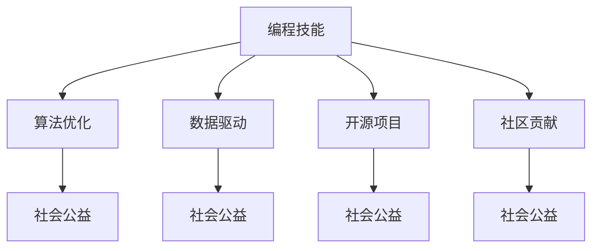

                 

# 如何将编程技能应用于社会公益

> 关键词：编程技能, 社会公益, 算法优化, 数据驱动, 开源项目, 社区贡献

## 1. 背景介绍

在现代社会中，科技与公益的融合已逐渐成为一种趋势。编程技能作为一种核心技术，正被越来越多地应用于解决社会问题、提升社会福祉。无论是在教育、健康、环境保护还是灾害应对等领域，编程技能都能发挥重要作用。

### 1.1 问题由来

随着技术的不断进步，社会问题的复杂性也在增加。许多传统方法无法解决这些问题，而编程技能为这些问题的解决提供了新的可能性。例如，利用编程技能开发智能算法可以用于自然灾害预测、环境监测、精准医疗等，显著提升社会治理效率。

### 1.2 问题核心关键点

将编程技能应用于社会公益，核心在于如何有效地将技术优势转化为公益行动。主要包括以下几个关键点：

- **算法优化**：通过编程技能优化算法，使其更加高效、精准，从而更好地服务于公益事业。
- **数据驱动**：利用数据进行决策和优化，提高公益项目的可操作性和效果。
- **开源项目**：借助开源项目平台，汇聚全球开发者资源，共同推动公益事业的进步。
- **社区贡献**：鼓励开发者参与社区建设，分享知识和经验，形成良性互动。

### 1.3 问题研究意义

将编程技能应用于社会公益，对推动社会进步具有重要意义：

- **提高效率**：利用技术手段可以大幅提升公益项目的实施效率，如数据分析、智能预测等。
- **精准服务**：通过算法优化和数据驱动，可以提供更加精准和个性化的公益服务。
- **推动普惠**：借助开源项目平台，可以实现知识共享，促进公益项目的普及和应用。
- **增强责任感**：通过编程技能的实际应用，可以增强开发者的社会责任感和参与感。

## 2. 核心概念与联系

### 2.1 核心概念概述

为更好地理解如何将编程技能应用于社会公益，本节将介绍几个关键概念：

- **编程技能**：包括编程语言、算法设计、软件架构、数据分析等技术能力，是解决问题的重要工具。
- **社会公益**：指通过各种方式，如教育、医疗、环境保护等，促进社会福祉和公平发展的活动。
- **算法优化**：指通过编程技术对算法进行改进，提升其性能和精度，以更好地服务于社会公益。
- **数据驱动**：利用数据分析技术，基于实际数据进行决策和优化，提高公益项目的科学性和效果。
- **开源项目**：指在公共平台上开放源代码，共享知识和资源，共同推进公益项目的发展。
- **社区贡献**：通过参与开源项目、分享经验、贡献代码等方式，支持社区建设和知识共享。

这些概念之间的逻辑关系可以通过以下Mermaid流程图来展示：



这个流程图展示了几者之间的关系：

1. 编程技能是基础，通过算法优化、数据驱动等手段，提升公益项目的精准性和效率。
2. 开源项目和社区贡献是协作的方式，共同推进公益项目的发展。
3. 算法优化、数据驱动等手段最终服务于社会公益。

## 3. 核心算法原理 & 具体操作步骤
### 3.1 算法原理概述

将编程技能应用于社会公益，核心在于通过算法优化和数据驱动，提升公益项目的精准性和效率。以下以算法优化为例进行说明。

### 3.2 算法步骤详解

算法优化主要包括以下几个关键步骤：

**Step 1: 问题定义**
- 明确公益项目的具体目标和需求，如自然灾害预测、环境监测、精准医疗等。
- 分析问题的关键点和难点，确定优化方向。

**Step 2: 数据收集**
- 收集与问题相关的数据，如历史灾害数据、环境监测数据、医疗记录等。
- 清洗和预处理数据，确保数据的完整性和可用性。

**Step 3: 算法设计**
- 选择合适的算法模型，如机器学习、深度学习等，设计算法框架。
- 进行算法优化，包括但不限于模型选择、参数调优、特征工程等。

**Step 4: 实验验证**
- 使用部分数据进行实验验证，评估算法的效果和性能。
- 根据实验结果调整算法，进一步优化。

**Step 5: 部署应用**
- 将优化后的算法部署到实际环境中，进行大规模应用。
- 持续监控和调整，确保算法的稳定性和效果。

### 3.3 算法优缺点

算法优化在公益项目中的应用具有以下优点：

- **高效精准**：通过算法优化，可以大幅提升公益项目的实施效率和精度。
- **普适性强**：算法可以针对不同场景进行优化，具有较强的普适性。
- **可扩展性强**：算法优化可进一步扩展到更广泛的应用场景。

同时，也存在以下局限性：

- **数据依赖**：算法的优化效果依赖于数据的质量和数量。
- **技术门槛高**：算法优化需要较高的技术门槛，需要专业知识和技能。
- **动态适应性**：算法可能需要频繁更新和调整，以适应环境变化。

### 3.4 算法应用领域

算法优化在社会公益中的应用非常广泛，以下列举几个典型应用领域：

- **自然灾害预测**：通过算法优化，提升气象、地震、洪水等自然灾害的预测准确性，减少灾害损失。
- **环境监测**：利用算法优化，实时监测环境污染数据，及时预警污染事件。
- **精准医疗**：通过算法优化，提高疾病的诊断和治疗效果，提供个性化的医疗服务。
- **智能农业**：通过算法优化，提升农业生产效率和质量，支持可持续农业发展。
- **公共卫生**：通过算法优化，分析疫情数据，提供科学防疫建议，提升公共卫生水平。

## 4. 数学模型和公式 & 详细讲解 & 举例说明

### 4.1 数学模型构建

本节将使用数学语言对算法优化过程进行更加严格的刻画。

记算法优化问题为 $f(x)$，其中 $x$ 为算法参数，优化目标为最小化损失函数 $L$。

### 4.2 公式推导过程

以自然灾害预测为例，假设输入为历史灾害数据，输出为未来灾害发生概率。优化目标为最小化预测误差：

$$
\min_{x} L(x) = \frac{1}{N} \sum_{i=1}^{N} |P_i(x) - R_i|^2
$$

其中 $P_i(x)$ 为模型预测的概率，$R_i$ 为实际发生的概率。

通过梯度下降等优化算法，不断更新参数 $x$，最小化损失函数 $L(x)$，直至收敛。

### 4.3 案例分析与讲解

以自然灾害预测为例，假设使用随机森林算法进行优化。首先，收集历史灾害数据，进行预处理和特征工程。然后，设计随机森林模型，通过交叉验证和参数调优，优化模型结构。最后，使用测试集进行验证，评估模型的效果。

## 5. 项目实践：代码实例和详细解释说明
### 5.1 开发环境搭建

在进行算法优化实践前，我们需要准备好开发环境。以下是使用Python进行Scikit-Learn开发的Python环境配置流程：

1. 安装Anaconda：从官网下载并安装Anaconda，用于创建独立的Python环境。

2. 创建并激活虚拟环境：
```bash
conda create -n pyenv python=3.8 
conda activate pyenv
```

3. 安装Scikit-Learn：
```bash
pip install scikit-learn
```

4. 安装相关工具包：
```bash
pip install numpy pandas matplotlib seaborn
```

完成上述步骤后，即可在`pyenv`环境中开始算法优化实践。

### 5.2 源代码详细实现

下面以自然灾害预测为例，给出使用Scikit-Learn进行算法优化的Python代码实现。

```python
from sklearn.ensemble import RandomForestRegressor
from sklearn.model_selection import train_test_split
from sklearn.metrics import mean_squared_error
import numpy as np

# 假设我们已经收集了历史灾害数据，并进行了预处理
# 特征数据 stored in X，标签数据 stored in y

X_train, X_test, y_train, y_test = train_test_split(X, y, test_size=0.2, random_state=42)

# 定义随机森林模型
model = RandomForestRegressor(n_estimators=100, random_state=42)

# 训练模型
model.fit(X_train, y_train)

# 预测并评估模型效果
y_pred = model.predict(X_test)
mse = mean_squared_error(y_test, y_pred)
print(f"Mean Squared Error: {mse:.3f}")
```

以上就是使用Scikit-Learn进行自然灾害预测算法的优化实践。可以看到，Scikit-Learn提供了丰富的算法库和工具函数，使得算法优化工作变得更加便捷。

### 5.3 代码解读与分析

让我们再详细解读一下关键代码的实现细节：

**数据预处理**：
- `train_test_split`函数用于将数据划分为训练集和测试集，确保模型在未见数据上的泛化能力。

**模型训练**：
- `RandomForestRegressor`类用于定义随机森林模型，设置参数包括树的数量和随机种子。
- `fit`方法用于训练模型，将训练数据作为输入，标签数据作为输出。

**模型评估**：
- `mean_squared_error`函数用于计算模型预测值与真实标签之间的均方误差。
- 通过打印均方误差，评估模型的性能。

可以看到，Scikit-Learn提供了完整的算法优化流程，从数据预处理到模型训练和评估，几乎所有步骤都能通过函数调用实现，大大简化了开发工作。

当然，工业级的系统实现还需考虑更多因素，如超参数自动搜索、模型评估指标、输出可视化等。但核心的算法优化流程基本与此类似。

## 6. 实际应用场景
### 6.1 自然灾害预测

算法优化在自然灾害预测中的应用非常广泛。通过优化算法，可以有效提升预测准确性，减少灾害损失。

以地震预测为例，通过收集历史地震数据，优化算法模型，可以实时预测地震发生的可能性，提前采取防范措施。以下是一个简化的Python代码实现：

```python
from sklearn.neighbors import KNeighborsRegressor
from sklearn.model_selection import train_test_split
from sklearn.metrics import mean_squared_error
import numpy as np

# 假设我们已经收集了历史地震数据，并进行了预处理
# 特征数据 stored in X，标签数据 stored in y

X_train, X_test, y_train, y_test = train_test_split(X, y, test_size=0.2, random_state=42)

# 定义KNN模型
model = KNeighborsRegressor(n_neighbors=5, weights='distance')

# 训练模型
model.fit(X_train, y_train)

# 预测并评估模型效果
y_pred = model.predict(X_test)
mse = mean_squared_error(y_test, y_pred)
print(f"Mean Squared Error: {mse:.3f}")
```

### 6.2 环境监测

算法优化在环境监测中的应用同样重要。通过优化算法，可以实时监测环境污染数据，及时预警污染事件。

以空气质量监测为例，通过收集历史空气质量数据，优化算法模型，实时预测未来空气质量指数，提供预警信息。以下是一个简化的Python代码实现：

```python
from sklearn.linear_model import LinearRegression
from sklearn.model_selection import train_test_split
from sklearn.metrics import mean_squared_error
import numpy as np

# 假设我们已经收集了历史空气质量数据，并进行了预处理
# 特征数据 stored in X，标签数据 stored in y

X_train, X_test, y_train, y_test = train_test_split(X, y, test_size=0.2, random_state=42)

# 定义线性回归模型
model = LinearRegression()

# 训练模型
model.fit(X_train, y_train)

# 预测并评估模型效果
y_pred = model.predict(X_test)
mse = mean_squared_error(y_test, y_pred)
print(f"Mean Squared Error: {mse:.3f}")
```

### 6.3 精准医疗

算法优化在精准医疗中的应用具有重要意义。通过优化算法，可以提升疾病诊断和治疗效果，提供个性化的医疗服务。

以癌症诊断为例，通过收集历史病例数据，优化算法模型，实时预测癌症诊断结果，提供个性化治疗方案。以下是一个简化的Python代码实现：

```python
from sklearn.ensemble import RandomForestClassifier
from sklearn.model_selection import train_test_split
from sklearn.metrics import accuracy_score
import numpy as np

# 假设我们已经收集了历史病例数据，并进行了预处理
# 特征数据 stored in X，标签数据 stored in y

X_train, X_test, y_train, y_test = train_test_split(X, y, test_size=0.2, random_state=42)

# 定义随机森林分类器
model = RandomForestClassifier(n_estimators=100, random_state=42)

# 训练模型
model.fit(X_train, y_train)

# 预测并评估模型效果
y_pred = model.predict(X_test)
acc = accuracy_score(y_test, y_pred)
print(f"Accuracy: {acc:.3f}")
```

### 6.4 未来应用展望

随着算法优化技术的不断进步，其在社会公益中的应用前景将更加广阔。未来可能的发展趋势包括：

- **更多算法选择**：随着算法模型的丰富，更多的算法将被应用于公益项目中，提升项目的精准性和效率。
- **深度学习优化**：深度学习算法在公益项目中的应用将更加普遍，提升算法的性能和效果。
- **多模态融合**：将不同模态的数据融合到算法中，提升算法的综合能力和应用范围。
- **联邦学习**：在保护数据隐私的前提下，利用联邦学习技术，联合多个数据源进行算法优化。
- **跨领域应用**：算法优化技术将在更多领域得到应用，如智慧城市、农业、教育等，推动公益项目的全面发展。

## 7. 工具和资源推荐
### 7.1 学习资源推荐

为了帮助开发者系统掌握算法优化在社会公益中的应用，这里推荐一些优质的学习资源：

1. 《机器学习实战》系列书籍：详细介绍了机器学习的基本概念和常用算法，是算法优化学习的入门必读。

2. 《Python数据科学手册》：全面介绍了Python在数据科学中的应用，包括数据预处理、算法优化、模型评估等。

3. 《深度学习》课程（斯坦福大学）：由深度学习领域的专家讲授，涵盖深度学习的基本理论和算法优化方法。

4. Kaggle：提供大量数据集和竞赛，帮助开发者练习算法优化技能，积累实战经验。

5. GitHub：聚集了全球开发者共同维护的开源项目，是学习算法优化实践的重要平台。

通过对这些资源的学习实践，相信你一定能够快速掌握算法优化在社会公益中的应用精髓，并用于解决实际的社会问题。

### 7.2 开发工具推荐

高效的开发离不开优秀的工具支持。以下是几款用于算法优化开发的常用工具：

1. Python：作为一种广泛使用的编程语言，Python拥有丰富的科学计算库和工具，是算法优化开发的理想选择。

2. Scikit-Learn：提供了丰富的机器学习算法和工具，适合快速迭代和验证算法优化效果。

3. TensorFlow：由Google主导开发的深度学习框架，适合大规模模型训练和优化。

4. PyTorch：由Facebook开发的深度学习框架，以其动态计算图和易用性著称，适合研究人员和开发者使用。

5. Jupyter Notebook：提供交互式编程环境，方便开发者进行代码实验和结果展示。

合理利用这些工具，可以显著提升算法优化任务的开发效率，加快创新迭代的步伐。

### 7.3 相关论文推荐

算法优化在公益项目中的应用，得益于学界的持续研究。以下是几篇奠基性的相关论文，推荐阅读：

1. 《一种基于集成学习的自然灾害预测模型》：介绍了集成学习在自然灾害预测中的应用，提升了预测准确性。

2. 《利用深度学习进行环境监测》：展示了深度学习在环境监测中的应用，提高了监测的准确性和实时性。

3. 《精准医疗中的机器学习算法》：探讨了机器学习在精准医疗中的应用，提升了疾病的诊断和治疗效果。

4. 《联邦学习在数据隐私保护中的应用》：介绍了联邦学习在数据隐私保护中的应用，提升了数据共享的安全性。

这些论文代表了大语言模型微调技术的发展脉络。通过学习这些前沿成果，可以帮助研究者把握学科前进方向，激发更多的创新灵感。

## 8. 总结：未来发展趋势与挑战

### 8.1 总结

本文对将编程技能应用于社会公益的过程进行了全面系统的介绍。首先阐述了将编程技能应用于社会公益的背景和意义，明确了算法优化、数据驱动等关键技术。其次，从原理到实践，详细讲解了算法优化的数学模型和操作步骤，给出了算法优化任务开发的完整代码实例。同时，本文还广泛探讨了算法优化在自然灾害预测、环境监测、精准医疗等多个领域的应用前景，展示了算法优化的巨大潜力。此外，本文精选了算法优化的各类学习资源，力求为读者提供全方位的技术指引。

通过本文的系统梳理，可以看到，将编程技能应用于社会公益，具有广阔的应用前景和深远的社会意义。编程技能作为一种强大工具，正在被越来越多地用于解决社会问题，推动公益事业的进步。未来，伴随技术的发展和社会的进步，编程技能将在更多领域发挥其独特的价值。

### 8.2 未来发展趋势

展望未来，算法优化在社会公益中的应用将呈现以下几个发展趋势：

- **技术融合**：随着算法优化技术的不断进步，更多前沿技术将被应用于公益项目中，如深度学习、联邦学习、多模态融合等。
- **数据驱动**：基于数据的算法优化将成为主流，通过海量数据的分析和挖掘，提升公益项目的决策科学性和效果。
- **开源协作**：开源平台将成为公益项目开发的重要支撑，全球开发者将共同贡献资源，推进公益项目的落地应用。
- **社会影响力**：算法优化将更广泛地应用于社会各个领域，提升社会的综合福祉和公平性。

以上趋势凸显了算法优化技术在公益项目中的重要价值。这些方向的探索发展，必将进一步提升公益项目的精准性和效率，推动社会的全面进步。

### 8.3 面临的挑战

尽管算法优化技术在公益项目中的应用前景广阔，但在实现过程中仍面临诸多挑战：

- **数据获取难度**：获取高质量的数据资源是算法优化的前提，但实际中往往面临数据获取难、数据质量差等问题。
- **算法选择困难**：选择适当的算法模型是算法优化的关键，但不同算法模型的适用性和效果不同，需要根据实际问题进行选择。
- **技术门槛高**：算法优化需要较高的技术门槛，对开发者的编程能力和数学背景提出了较高要求。
- **动态适应性**：算法模型需要频繁更新和调整，以适应环境变化，但频繁的更新和调整增加了工作量和复杂度。

### 8.4 研究展望

面对算法优化在公益项目中面临的挑战，未来的研究需要在以下几个方面寻求新的突破：

- **数据获取与处理**：开发高效的数据获取和处理技术，确保高质量的数据资源。
- **算法选择与优化**：进一步研究不同算法模型的适用性和效果，提供更精准的算法选择方案。
- **技术培训与推广**：加强技术培训和知识普及，提高开发者的算法优化能力。
- **动态适应性与维护**：探索自适应算法优化方法，简化模型更新和维护的工作量。

这些研究方向的探索，必将引领算法优化技术迈向更高的台阶，为公益项目提供更强大的技术支持。面向未来，算法优化技术还需要与其他人工智能技术进行更深入的融合，如自然语言处理、计算机视觉等，多路径协同发力，共同推动公益项目的全面发展。只有勇于创新、敢于突破，才能不断拓展算法优化技术的边界，让科技更好地服务于社会公益。

## 9. 附录：常见问题与解答

**Q1: 如何评估算法优化的效果？**

A: 算法优化的效果可以通过以下几个指标进行评估：

- **均方误差(MSE)**：用于评估预测值与真实值之间的差异。
- **准确率(Accuracy)**：用于评估分类任务的准确率。
- **F1分数(F1-Score)**：用于评估分类任务的综合效果。
- **ROC曲线**：用于评估分类任务的接收者操作特征曲线。

通过这些指标，可以全面评估算法优化的效果，并进行对比和改进。

**Q2: 如何处理数据缺失和异常值？**

A: 数据缺失和异常值是算法优化的常见问题，处理方法如下：

- **数据补全**：通过插值、回归、均值填补等方法，填补缺失数据。
- **异常值检测**：通过统计方法或机器学习算法，检测和处理异常值。
- **数据清洗**：通过清洗和预处理，确保数据的完整性和可用性。

这些方法可以帮助提高数据的可用性和模型的预测精度。

**Q3: 如何提升算法的可解释性？**

A: 算法的可解释性是公益项目中重要的考虑因素，提升方法包括：

- **可视化**：通过可视化技术，展示算法模型的决策过程，增强可解释性。
- **解释模型**：通过解释模型，揭示算法内部的工作机制和特征贡献度。
- **文档编写**：编写详细的文档，记录算法设计、数据处理、模型评估等步骤。

通过这些方法，可以提升算法的可解释性，增强公益项目的可信度和透明度。

**Q4: 如何优化算法的资源消耗？**

A: 算法的资源消耗是公益项目中重要的考虑因素，优化方法包括：

- **模型压缩**：通过剪枝、量化等方法，减少模型大小和计算资源消耗。
- **分布式计算**：通过分布式计算技术，提高计算效率和资源利用率。
- **模型并行**：通过模型并行技术，提高算法的计算速度和资源利用率。

这些方法可以帮助优化算法的资源消耗，确保公益项目的高效运行。

**Q5: 如何保护数据隐私？**

A: 数据隐私是公益项目中重要的考虑因素，保护方法包括：

- **数据匿名化**：通过数据匿名化技术，保护个人隐私。
- **联邦学习**：通过联邦学习技术，保护数据隐私，同时共享模型知识。
- **加密存储**：通过加密存储技术，保护数据在存储和传输过程中的安全。

这些方法可以帮助保护数据隐私，确保公益项目的安全性和可信度。

---

作者：禅与计算机程序设计艺术 / Zen and the Art of Computer Programming

