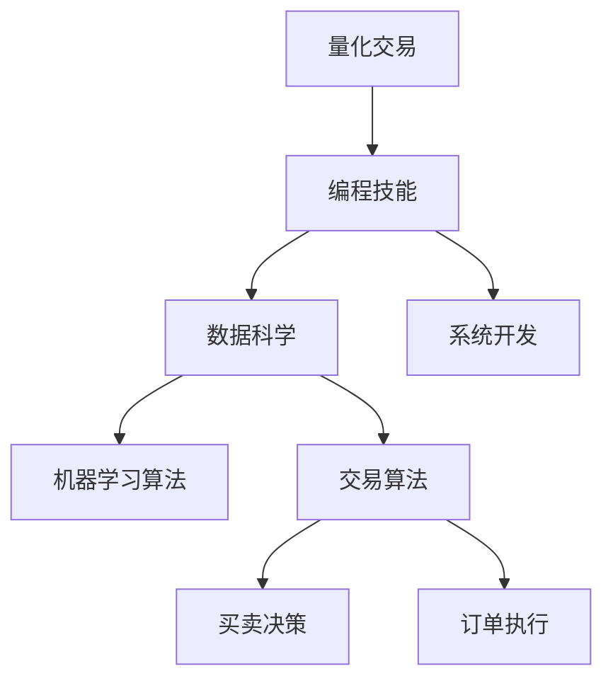

                 

# 如何将编程技能应用于量化交易

## 1. 背景介绍

### 1.1 问题由来
量化交易(Qualitative Trading)，又称算法交易，是一种利用计算机算法执行买卖操作以获取利润的金融交易方式。其核心在于通过数学模型和计算机编程，结合历史数据和实时市场行情，自动进行买卖决策。

量化交易兴起于20世纪80年代，得益于计算机技术和大数据的发展。近年来，随着人工智能和深度学习的普及，量化交易模型逐渐向智能化的方向演进，从而诞生了一系列基于机器学习的量化策略。

尽管如此，量化交易仍以编程技能为基础。编程语言不仅用于编写交易算法，还涉及数据处理、模型训练、结果可视化等多个环节。因此，掌握编程技能是量化交易从业者的基础要求之一。

### 1.2 问题核心关键点
量化交易的核心在于通过数学模型对市场数据进行分析，提取其中的规律和模式，生成买卖信号，并利用编程语言实现自动执行。常用的编程语言包括Python、R、C++等，其中Python尤为流行。

编程技能的应用包括但不限于以下方面：
1. **数据处理**：收集、清洗、转换和存储市场数据。
2. **模型训练**：利用机器学习算法训练预测模型。
3. **结果可视化**：将模型结果可视化展示，辅助决策。
4. **系统开发**：开发自动执行交易的算法系统。
5. **性能优化**：对算法进行优化，提升执行效率和系统稳定性。

这些环节都需要扎实的编程技能作为支撑，因此掌握编程语言和算法是量化交易从业者必备的技能。

### 1.3 问题研究意义
掌握编程技能，不仅能提升量化交易模型的效果，还能推动整个行业的发展和创新。编程技能的应用，使得量化交易更加精确、高效，同时也为量化交易师提供了更多的创新可能，推动行业向智能化、自动化方向发展。

掌握编程技能，有助于量化交易师快速迭代模型，应对市场变化。在数据量不断增加的今天，高效、准确的编程技能是快速验证和调整模型策略的保障。

## 2. 核心概念与联系

### 2.1 核心概念概述

为更好地理解量化交易中的编程技能应用，本节将介绍几个关键概念：

- 量化交易(Quantitative Trading)：利用计算机算法执行交易决策的金融交易方式。
- 编程技能(Programming Skill)：包括编程语言、算法、数据处理、系统开发等技能。
- 机器学习算法(Machine Learning Algorithm)：如回归分析、分类、聚类等，用于构建量化交易模型。
- 交易算法(Trading Algorithm)：具体实现交易策略的算法，通常包含买卖决策、订单执行等步骤。
- 数据科学(Data Science)：包括数据收集、清洗、分析、可视化等多个环节，是量化交易中的重要基础。

这些核心概念之间的联系可以通过以下Mermaid流程图来展示：



这个流程图展示了量化交易、编程技能、数据科学、机器学习算法和交易算法之间的联系：

1. 量化交易的实现依赖于编程技能，通过算法实现买卖决策。
2. 数据科学为量化交易提供数据支持，是交易模型训练的基础。
3. 机器学习算法用于训练模型，提取市场规律。
4. 交易算法将模型应用于实际交易，执行买卖决策。

## 3. 核心算法原理 & 具体操作步骤
### 3.1 算法原理概述

量化交易中常用的算法包括回归分析、随机森林、梯度提升树等，用于构建预测模型。这些算法通常基于历史数据进行训练，并根据实时市场行情生成买卖信号。

以回归分析为例，假设要构建一个基于历史交易数据的回归模型，预测未来价格趋势，算法步骤包括：

1. 数据收集：获取历史交易价格和市场行情数据。
2. 特征工程：将原始数据转化为模型可处理的特征。
3. 模型训练：使用历史数据训练回归模型，得到模型参数。
4. 信号生成：将模型应用于实时市场数据，生成买卖信号。

### 3.2 算法步骤详解

以下是基于回归分析的量化交易算法的详细步骤：

**Step 1: 数据收集与清洗**
- 收集历史交易数据，包括价格、交易量、市场指标等。
- 清洗数据，去除异常值、缺失值和噪声。

**Step 2: 特征工程**
- 构建特征集，将原始数据转化为模型可处理的数值特征。
- 进行特征选择，筛选对模型效果有影响的特征。

**Step 3: 模型训练**
- 划分训练集和测试集，使用训练集训练回归模型。
- 使用测试集评估模型效果，调整模型参数。

**Step 4: 信号生成**
- 将模型应用于实时市场数据，生成买卖信号。
- 结合市场条件，进行买卖决策。

**Step 5: 回测与优化**
- 在历史数据上进行回测，评估模型效果。
- 根据回测结果，优化模型参数和策略。

### 3.3 算法优缺点

基于回归分析的量化交易算法具有以下优点：
1. 可解释性强：回归模型的预测结果和决策过程清晰，易于理解。
2. 适用于多种数据类型：不仅适用于数值型数据，也适用于文本、时间序列等数据。
3. 适用于多市场数据：可以同时处理多个市场的交易数据，提高模型泛化能力。

但同时也存在一些缺点：
1. 模型过于简单：回归模型基于历史数据训练，可能无法捕捉市场复杂的动态变化。
2. 过拟合风险：使用过多特征或复杂模型，可能导致过拟合，影响模型泛化能力。
3. 需要大量数据：模型训练需要大量历史数据，数据不足时效果不佳。

### 3.4 算法应用领域

量化交易算法在金融市场中广泛应用，涵盖股票、期货、外汇等多个市场。此外，量化交易算法还被应用于高频交易、算法套利等复杂场景中。

在股票市场中，量化交易算法可以用于交易策略的构建，如趋势跟踪、均值回归、动量交易等。在期货市场中，量化交易算法可以用于套利策略的构建，如跨市场套利、跨品种套利等。

## 4. 数学模型和公式 & 详细讲解 & 举例说明

### 4.1 数学模型构建

以下是基于线性回归的量化交易模型的数学模型构建：

假设市场价格 $p$ 与时间 $t$ 的关系可以表示为：

$$ p_t = \beta_0 + \beta_1 p_{t-1} + \epsilon_t $$

其中 $\beta_0, \beta_1$ 为模型参数，$\epsilon_t$ 为随机误差项。

### 4.2 公式推导过程

线性回归模型的最小二乘估计公式为：

$$ \hat{\beta} = (X^T X)^{-1} X^T Y $$

其中 $X$ 为自变量矩阵，$Y$ 为因变量向量，$\hat{\beta}$ 为模型参数的估计值。

将上式应用到市场价格预测中，可以表示为：

$$ \hat{p}_t = \hat{\beta}_0 + \hat{\beta}_1 p_{t-1} $$

### 4.3 案例分析与讲解

以预测某股票未来价格为例，假设收集了该股票过去10年的历史价格数据，可以将其表示为自变量矩阵 $X$ 和因变量向量 $Y$：

$$ X = \begin{bmatrix} 
1 & p_{t-1} \\
1 & p_{t-1} \\
1 & p_{t-1} \\
\vdots \\
1 & p_{t-1} 
\end{bmatrix}, 
Y = \begin{bmatrix} 
p_1 \\
p_2 \\
p_3 \\
\vdots \\
p_{10} 
\end{bmatrix} $$

根据最小二乘估计公式，可以求得模型参数 $\hat{\beta}_0$ 和 $\hat{\beta}_1$：

$$ \hat{\beta} = \begin{bmatrix} 
\hat{\beta}_0 \\
\hat{\beta}_1 
\end{bmatrix} = (X^T X)^{-1} X^T Y $$

使用 $\hat{\beta}_0$ 和 $\hat{\beta}_1$，可以构建预测模型，对未来价格进行预测。

## 5. 项目实践：代码实例和详细解释说明
### 5.1 开发环境搭建

在进行量化交易编程实践前，我们需要准备好开发环境。以下是使用Python进行开发的环境配置流程：

1. 安装Anaconda：从官网下载并安装Anaconda，用于创建独立的Python环境。

2. 创建并激活虚拟环境：
```bash
conda create -n quant-env python=3.8 
conda activate quant-env
```

3. 安装必要的Python包：
```bash
conda install pandas numpy matplotlib scikit-learn
```

4. 安装用于量化交易开发的专用工具：
```bash
pip install TA-Lib pyfolio backtrader quantlib
```

完成上述步骤后，即可在`quant-env`环境中开始量化交易的编程实践。

### 5.2 源代码详细实现

下面以线性回归模型为例，给出使用Python实现量化交易模型的代码：

```python
import pandas as pd
from sklearn.linear_model import LinearRegression
from TA.Lib import CandlestickData

# 加载历史交易数据
df = pd.read_csv('historical_prices.csv')
df['Date'] = pd.to_datetime(df['Date'])

# 构建自变量和因变量矩阵
X = df[['Open', 'High', 'Low', 'Close']].values
Y = df['Close'].values

# 分割数据集
train_size = int(len(X) * 0.8)
X_train, X_test = X[:train_size], X[train_size:]
Y_train, Y_test = Y[:train_size], Y[train_size:]

# 训练回归模型
model = LinearRegression()
model.fit(X_train, Y_train)

# 在测试集上进行预测
Y_pred = model.predict(X_test)

# 计算预测误差
mse = np.mean((Y_pred - Y_test) ** 2)
print(f"MSE: {mse:.2f}")
```

以上代码展示了使用线性回归模型对历史交易价格进行预测的过程，具体步骤如下：

1. 加载历史交易数据。
2. 构建自变量和因变量矩阵，分割数据集。
3. 训练线性回归模型。
4. 在测试集上进行预测，并计算预测误差。

### 5.3 代码解读与分析

让我们再详细解读一下关键代码的实现细节：

**数据加载与处理**：
- `pandas`库用于加载和处理历史交易数据。
- `TA.Lib.CandlestickData`库用于获取技术指标数据，如开盘价、收盘价等。

**模型训练**：
- `sklearn.linear_model.LinearRegression`库用于构建线性回归模型，并使用训练集进行拟合。

**结果评估**：
- 计算预测误差的均方根误差(MSE)，用于评估模型效果。

通过这个代码实例，可以看到量化交易编程中的一些关键步骤：数据加载、模型训练、结果评估等。这些步骤都需要扎实的编程技能作为支撑，因此掌握编程语言和算法是量化交易编程的基础。

## 6. 实际应用场景
### 6.1 高频交易

高频交易(High Frequency Trading, HFT)是一种以高频买卖操作为目标的量化交易方式，旨在利用市场微小价格波动获取利润。高频交易对算法执行速度和低延迟要求极高，需要高效的编程实现。

在实际应用中，可以使用量化交易算法，结合高频数据处理和交易执行引擎，实现实时高频交易策略。常见的策略包括统计套利、动量交易、高频形态分析等。

### 6.2 跨市场套利

跨市场套利(Cross-Market Arbitrage)是一种基于市场定价差异的量化交易策略，通过在不同市场间同时买入和卖出相关资产，获取无风险收益。跨市场套利需要处理多市场数据，并且需要快速响应市场变化，因此编程技能的应用尤为重要。

在实际应用中，可以使用量化交易算法，结合跨市场数据同步和交易执行引擎，实现跨市场套利策略。常见的策略包括跨市场价差套利、交叉货币套利等。

### 6.3 算法套利

算法套利(Algorithmic Arbitrage)是一种利用市场定价差异的量化交易策略，通过算法执行高频买卖操作，获取无风险收益。算法套利对算法执行速度和准确性要求极高，需要高效的编程实现。

在实际应用中，可以使用量化交易算法，结合算法执行引擎和市场数据处理，实现算法套利策略。常见的策略包括统计套利、高频形态分析、市场分割套利等。

### 6.4 未来应用展望

随着量化交易的不断发展，编程技能的应用将更加广泛和深入。未来的发展趋势包括：

1. 大数据处理：数据量的增加将推动大数据处理技术的发展，编程技能需要能够高效处理海量数据。
2. 多市场融合：跨市场套利和算法套利策略的发展将推动多市场数据的整合和处理，编程技能需要支持多市场数据同步。
3. 算法优化：高频交易和算法套利对算法执行速度和准确性要求极高，编程技能需要支持高效的算法优化。
4. 实时计算：高频交易和算法套利对算法实时计算能力要求极高，编程技能需要支持高效的实时计算。
5. 人工智能：结合机器学习和深度学习技术，编程技能需要支持复杂的模型构建和训练。

## 7. 工具和资源推荐
### 7.1 学习资源推荐

为了帮助开发者系统掌握量化交易中的编程技能，这里推荐一些优质的学习资源：

1. 《量化交易编程实战》书籍：详细介绍了量化交易算法和编程实践，适合初学者入门。
2. Kaggle量化交易竞赛：参与实战竞赛，可以积累实践经验和提升编程技能。
3. Coursera量化交易课程：提供系统化学习量化交易理论和编程实践的机会。
4. QuantConnect平台：提供在线编程环境和实时交易模拟，便于开发者实践和调试量化交易策略。

通过对这些资源的学习实践，相信你一定能够快速掌握量化交易中的编程技能，并用于解决实际的量化交易问题。

### 7.2 开发工具推荐

高效的开发离不开优秀的工具支持。以下是几款用于量化交易开发的常用工具：

1. Jupyter Notebook：提供交互式编程环境，便于实验和调试。
2. IDEA IntelliJ：支持Python开发，提供丰富的插件和工具支持。
3. Visual Studio Code：轻量级代码编辑器，支持多种编程语言和调试功能。
4. PyCharm：商业化的Python IDE，提供强大的代码编辑和调试功能。
5. IPython：提供交互式命令行环境，便于快速编写和调试Python代码。

合理利用这些工具，可以显著提升量化交易的编程效率，加快创新迭代的步伐。

### 7.3 相关论文推荐

量化交易技术的发展源于学界的持续研究。以下是几篇奠基性的相关论文，推荐阅读：

1. "High-Frequency Trading: A Practitioner's Guide to Algorithmic Strategies and Trading Systems"：介绍高频交易策略和算法。
2. "Algorithmic Trading: Winning Strategies and Their Rationale"：全面介绍算法交易策略和理论基础。
3. "Quantitative Trading: How to Build Your Own Algorithmic Trading Business"：介绍量化交易策略的构建和实施。

这些论文代表了大量化交易技术的发展脉络。通过学习这些前沿成果，可以帮助研究者把握学科前进方向，激发更多的创新灵感。

## 8. 总结：未来发展趋势与挑战

### 8.1 总结

本文对量化交易中的编程技能应用进行了全面系统的介绍。首先阐述了量化交易和编程技能的背景和意义，明确了编程技能在量化交易中的重要地位。其次，从原理到实践，详细讲解了量化交易算法的构建和应用，给出了具体的代码实例。同时，本文还广泛探讨了编程技能在量化交易中的实际应用场景，展示了编程技能应用的广泛性。

通过本文的系统梳理，可以看到，编程技能在量化交易中发挥着至关重要的作用，是量化交易师必备的基础技能之一。编程技能的应用，不仅有助于提高量化交易模型的效果，还推动了量化交易技术的持续发展和创新。

### 8.2 未来发展趋势

展望未来，量化交易中的编程技能将呈现以下几个发展趋势：

1. 大数据处理技术的发展：随着数据量的增加，大数据处理技术的应用将更加广泛，编程技能需要支持高效的数据处理和分析。
2. 多市场数据融合：跨市场套利和算法套利策略的发展将推动多市场数据的整合和处理，编程技能需要支持复杂的多市场数据同步。
3. 算法优化和实时计算：高频交易和算法套利对算法执行速度和准确性要求极高，编程技能需要支持高效的算法优化和实时计算。
4. 人工智能和深度学习：结合机器学习和深度学习技术，编程技能需要支持复杂的模型构建和训练。
5. 可扩展性和稳定性：高效的量化交易系统需要支持大规模并发和高稳定性，编程技能需要支持可扩展性和稳定性优化。

以上趋势凸显了编程技能在量化交易中的重要性。这些方向的探索发展，必将进一步提升量化交易系统的性能和应用范围，为量化交易的持续创新和应用提供技术保障。

### 8.3 面临的挑战

尽管量化交易中的编程技能应用已经取得了显著成就，但在迈向更加智能化、普适化应用的过程中，它仍面临诸多挑战：

1. 算法复杂度增加：随着算法复杂度的增加，编程技能需要能够处理更复杂的数据模型和算法逻辑。
2. 数据处理量和速度的要求提升：数据量增加的同时，需要高效的数据处理和实时计算能力。
3. 系统稳定性和可扩展性的挑战：大规模交易系统对稳定性和可扩展性的要求极高，编程技能需要支持高效的分布式和并行计算。
4. 法律法规的限制：量化交易涉及到金融市场，需要符合相关法律法规要求，编程技能需要考虑合规性问题。
5. 量化交易算法的透明度和可解释性：量化交易算法往往作为黑盒系统存在，编程技能需要考虑算法的透明度和可解释性。

正视量化交易中编程技能面临的这些挑战，积极应对并寻求突破，将是大量化交易技术迈向成熟的必由之路。

### 8.4 未来突破

面对量化交易中编程技能所面临的挑战，未来的研究需要在以下几个方面寻求新的突破：

1. 开发更高效的数据处理算法：利用大数据处理技术，提高数据处理和分析的效率。
2. 结合多市场数据构建复杂的量化交易策略：结合跨市场数据，构建复杂的跨市场套利和算法套利策略。
3. 引入人工智能和深度学习技术：结合机器学习和深度学习技术，提高算法的预测能力和泛化能力。
4. 提升系统稳定性和可扩展性：优化系统架构和算法设计，提升系统稳定性和可扩展性。
5. 考虑算法透明度和可解释性：引入可解释性技术，提高算法的透明度和可解释性。

这些研究方向的探索，必将引领量化交易中的编程技能走向新的高度，为构建安全、可靠、可解释、可控的量化交易系统铺平道路。

## 9. 附录：常见问题与解答

**Q1：编程技能在量化交易中扮演什么角色？**

A: 编程技能在量化交易中扮演基础和关键的角色。编程技能不仅用于开发交易算法，还涉及数据处理、模型训练、结果可视化等多个环节。掌握编程技能，可以更好地构建和优化量化交易模型，提高交易效果。

**Q2：如何评估量化交易算法的性能？**

A: 量化交易算法的性能评估通常包括回测、实盘测试和风险管理。回测是在历史数据上进行模拟交易，评估算法的预期收益和风险。实盘测试是在真实市场环境下进行交易，评估算法的实际效果。风险管理是通过模型对市场风险进行预测和控制，确保交易的稳定性和安全性。

**Q3：量化交易中常见的编程语言有哪些？**

A: 量化交易中常用的编程语言包括Python、R、C++等。Python由于其丰富的库和工具支持，成为量化交易的主流语言。R适用于统计分析和可视化，C++则适用于高性能计算和系统开发。

**Q4：量化交易中的数据处理包括哪些步骤？**

A: 量化交易中的数据处理包括数据收集、清洗、转换、存储等多个步骤。数据处理的目标是构建可供算法使用的数据集，确保数据的准确性和可用性。数据处理需要高效的数据处理算法和工具支持，例如Pandas、NumPy等。

**Q5：量化交易中的算法优化有哪些方法？**

A: 量化交易中的算法优化包括算法改进、参数调优、算法并行化等方法。算法改进包括引入新的算法模型和优化算法逻辑；参数调优包括调整模型参数和算法超参数，以提高算法效果；算法并行化包括利用多核CPU和GPU进行并行计算，提高算法执行效率。

通过这些问答，可以看出编程技能在量化交易中的重要性，以及掌握编程技能的具体应用场景。

---

作者：禅与计算机程序设计艺术 / Zen and the Art of Computer Programming

