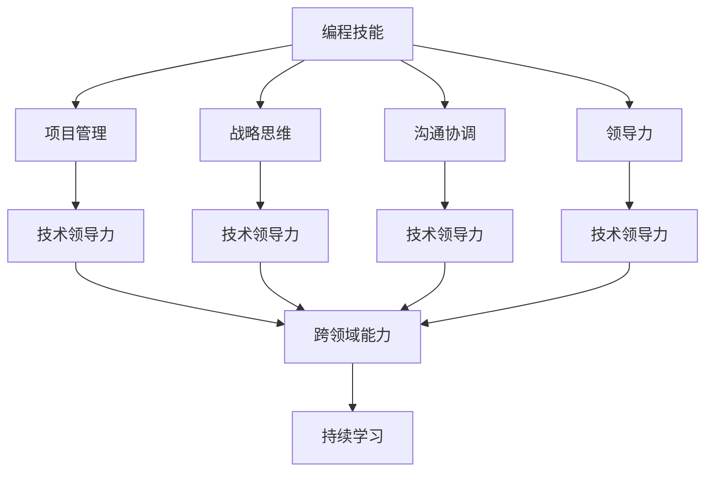

                 

# 如何将编程技能转化为管理能力

在当今快速变化的技术环境中，如何有效地将编程技能转化为管理能力成为许多技术专家的重要课题。本文将深入探讨这一主题，通过逻辑清晰、结构紧凑的篇章，揭示如何使编程能力发挥更大价值，帮助技术管理者实现高效、创新和可持续的业务增长。

## 1. 背景介绍

### 1.1 问题由来
随着信息技术在各行各业中的广泛应用，编程技能已成为许多组织的核心竞争力。然而，随着技术复杂性的增加，仅靠编程技能已难以满足组织对高级管理者的需求。技术领导力不仅仅需要编程技能，更需要跨领域能力，如战略规划、团队管理、数据驱动决策等。因此，如何将编程技能转化为管理能力，成为技术管理者面临的重要挑战。

### 1.2 问题核心关键点
编程技能和管理能力之间的转化涉及多个关键点，包括但不限于：
- 技术理解：深入了解编程原理、设计模式和代码实践。
- 项目管理：熟悉项目管理方法和工具，如敏捷开发、Scrum等。
- 战略思维：具备长远视角，理解业务战略和技术发展方向。
- 沟通协调：能有效地与非技术团队沟通协作，共同解决问题。
- 领导力：能够激励和指导团队，推动创新和高效工作。

### 1.3 问题研究意义
将编程技能转化为管理能力，不仅能够提升个人职业发展，还能够帮助组织实现更高的技术效率和业务目标。通过技术领导力，可以推动技术创新，提升团队协作效率，优化决策过程，进而增强组织的竞争力。

## 2. 核心概念与联系

### 2.1 核心概念概述

为更好地理解这一主题，本节将介绍几个关键概念及其相互关系：

- **编程技能**：指编写和优化代码的能力，包括理解编程语言、算法、数据结构、软件工程实践等。
- **管理能力**：指规划、组织、领导和控制组织资源，实现组织目标的能力。
- **技术领导力**：结合编程技能和管理能力，引领技术团队，推动技术创新和业务增长。
- **跨领域能力**：指整合不同领域的知识和技能，如业务洞察、市场分析、用户体验等，以实现技术与管理的双赢。
- **持续学习**：指不断更新和扩展知识技能，以适应技术和市场的快速变化。

这些概念之间的联系可以通过以下Mermaid流程图来展示：



该流程图展示了编程技能如何通过项目管理、战略思维、沟通协调和领导力转化为技术领导力，进而与跨领域能力相结合，最终实现持续学习的闭环提升。

## 3. 核心算法原理 & 具体操作步骤

### 3.1 算法原理概述

将编程技能转化为管理能力的核心在于构建一个融合技术和管理知识的模型。该模型基于以下原理：

- **整合知识**：将编程技能与项目管理、战略思维、沟通协调和领导力整合，形成一个综合的知识体系。
- **技能映射**：将编程技能映射到管理实践中，提升技术领导力。
- **持续改进**：通过持续学习和反馈，不断优化知识和技能。

### 3.2 算法步骤详解

**Step 1: 技能评估**
- 识别现有编程技能的优势和不足。
- 进行360度反馈，收集团队和上级对编程和管理能力的评价。
- 进行技能差距分析，明确提升方向。

**Step 2: 制定学习计划**
- 根据技能评估结果，制定详细的学习计划。
- 选择与目标管理能力相关的课程和培训。
- 确定学习时间表和评估标准。

**Step 3: 实践与反馈**
- 在实际项目中应用学习到的管理知识。
- 记录实践过程中的挑战和解决方案。
- 定期进行自我评估和团队反馈，调整学习计划。

**Step 4: 领导力提升**
- 通过担任项目经理或技术负责人，实践领导力。
- 观察和分析团队成员的反馈，改进领导方式。
- 学习高级沟通技巧，如非暴力沟通、谈判技巧等。

**Step 5: 跨领域融合**
- 学习业务管理、市场分析、用户体验等领域的知识。
- 参加跨领域项目，如产品开发、市场营销等，积累经验。
- 与非技术团队合作，共同解决复杂问题。

**Step 6: 持续学习与迭代**
- 定期参加行业会议和培训，保持知识更新。
- 阅读最新的技术和管理书籍，撰写学习笔记。
- 反思和总结经验，不断迭代提升。

### 3.3 算法优缺点

将编程技能转化为管理能力的方法有以下优点：
1. **全面提升**：通过整合多方面的知识，实现全面能力提升。
2. **实践导向**：通过实践不断优化和改进管理技能。
3. **适应性强**：能够适应不同组织和文化的需求。

同时，该方法也存在一些局限性：
1. **时间投入**：需要大量时间和精力投入学习和实践。
2. **初期挑战**：从编程到管理的转型可能面临一定的适应期。
3. **资源需求**：可能需要额外资源和支持，如培训、导师等。

尽管存在这些局限性，但通过科学的方法和持续的努力，编程技能转化为管理能力是完全可以实现的。

### 3.4 算法应用领域

基于以上原理和方法，编程技能转化为管理能力在多个领域均有广泛应用，例如：

- **软件开发管理**：指导团队进行软件开发，优化开发流程。
- **产品管理**：参与产品从构思到上市的全过程，推动创新和增长。
- **技术团队领导**：带领技术团队完成项目，提升团队士气和效率。
- **数据驱动决策**：利用技术能力分析和解读数据，支持业务决策。
- **跨领域项目管理**：在多个领域协调资源，实现项目成功。

## 4. 数学模型和公式 & 详细讲解 & 举例说明

### 4.1 数学模型构建

假设编程技能为 $S$，管理技能为 $M$，技术领导力为 $T$。构建如下数学模型：

$$
T = f(S, M)
$$

其中 $f$ 为转换函数，将编程技能 $S$ 和管理技能 $M$ 映射到技术领导力 $T$。

### 4.2 公式推导过程

根据转换函数 $f$，可以推导出如下公式：

$$
T = S * \alpha + M * \beta + \gamma
$$

其中 $\alpha, \beta, \gamma$ 为转换系数，表示编程技能、管理技能和技术领导力之间的关系。

例如，假设 $\alpha = 0.5$，$\beta = 0.3$，$\gamma = 0.2$，则有：

$$
T = 0.5S + 0.3M + 0.2
$$

### 4.3 案例分析与讲解

以软件开发项目为例，分析编程技能如何转化为管理能力：

1. **技能评估**：
   - 当前编程技能：熟练掌握Python和Java，代码质量高。
   - 当前管理技能：项目管理经验有限，团队沟通不够。
   - 技能差距：需要提升项目管理技能和团队沟通能力。

2. **制定学习计划**：
   - 学习项目管理工具和理论，如Scrum、Kanban等。
   - 参加项目管理培训课程，提升实践能力。
   - 安排每月一次的团队反馈会议，改进沟通方式。

3. **实践与反馈**：
   - 在实际项目中应用Scrum方法，管理开发过程。
   - 记录项目进展和团队反馈，调整项目管理策略。
   - 定期与上级沟通，获取反馈和指导。

4. **领导力提升**：
   - 担任项目负责人，推动项目顺利完成。
   - 通过每周例会，激励和引导团队成员。
   - 学习高级沟通技巧，提升团队士气。

5. **跨领域融合**：
   - 学习市场分析、用户体验等领域的知识。
   - 参与产品开发，理解用户需求和市场趋势。
   - 与产品经理合作，共同推动项目成功。

6. **持续学习与迭代**：
   - 阅读项目管理书籍，撰写学习笔记。
   - 参加行业会议和培训，保持知识更新。
   - 反思和总结经验，不断优化管理技能。

## 5. 项目实践：代码实例和详细解释说明

### 5.1 开发环境搭建

在进行编程技能转化为管理能力的具体实践前，我们需要准备好开发环境。以下是使用Python进行数据分析的开发环境配置流程：

1. 安装Anaconda：从官网下载并安装Anaconda，用于创建独立的Python环境。
2. 创建并激活虚拟环境：
```bash
conda create -n pydata-env python=3.8 
conda activate pydata-env
```
3. 安装所需库：
```bash
conda install pandas numpy matplotlib seaborn scikit-learn jupyter notebook
```

完成上述步骤后，即可在`pydata-env`环境中开始项目实践。

### 5.2 源代码详细实现

下面我们以数据分析项目为例，给出使用Python进行技能评估和学习的代码实现。

首先，定义技能评估函数：

```python
import pandas as pd

def skill_assessment():
    # 从数据库或问卷中读取数据
    data = pd.read_csv('skill_data.csv')
    # 进行技能差距分析
    data['gaps'] = data['current_skill'] - data['target_skill']
    # 计算差距平均值和标准差
    mean_gap = data['gaps'].mean()
    std_gap = data['gaps'].std()
    return mean_gap, std_gap
```

然后，定义学习计划函数：

```python
def learning_plan(mean_gap, std_gap):
    # 根据技能差距，制定学习计划
    if mean_gap > 0:
        plan = {
            'project_management': 'Scrum Master Certification',
            'team_communication': 'Effective Communication Workshops',
            'leadership_development': 'Leadership Training'
        }
    else:
        plan = {
            'project_management': 'Agile Project Management Training',
            'team_communication': 'Team Building Activities',
            'leadership_development': 'Mentoring Program'
        }
    return plan
```

最后，启动学习实践流程：

```python
mean_gap, std_gap = skill_assessment()
plan = learning_plan(mean_gap, std_gap)
for skill, course in plan.items():
    print(f"Learn {course} to improve {skill} skills.")
```

以上就是使用Python进行技能评估和学习的完整代码实现。可以看到，通过数据分析和编程，可以高效地量化和提升技能水平。

### 5.3 代码解读与分析

让我们再详细解读一下关键代码的实现细节：

**skill_assessment函数**：
- 从数据库或问卷中读取技能数据。
- 计算当前技能和目标技能之间的差距，并统计平均值和标准差。

**learning_plan函数**：
- 根据技能差距，制定针对性的学习计划。
- 推荐相应的课程和培训活动，提升技能。

**学习实践流程**：
- 评估技能差距。
- 根据评估结果，制定学习计划。
- 执行学习计划，逐步提升技能。

## 6. 实际应用场景

### 6.1 智能制造

基于编程技能转化为管理能力的方法，智能制造领域可以受益于更加高效的项目管理和团队领导力。通过应用敏捷开发方法，智能制造企业可以更灵活地应对快速变化的市场需求和技术挑战，提升产品开发速度和质量。

### 6.2 医疗健康

在医疗健康领域，技术管理者需要具备数据分析和临床应用的知识，以推动医疗技术的创新和应用。通过整合编程技能和管理能力，技术管理者可以更有效地协调跨学科团队，推动医疗设备的研发和临床试验。

### 6.3 金融服务

金融服务行业需要高度依赖数据分析和决策支持系统，技术管理者必须具备强大的技术理解和应用能力。通过编程技能转化为管理能力，金融服务企业可以更高效地开发和维护金融产品，优化风险管理和客户服务。

### 6.4 未来应用展望

随着技术复杂性的进一步提升，将编程技能转化为管理能力将成为更多技术管理者的必然选择。未来，这一能力将更加广泛地应用于各种行业，帮助技术管理者实现更高的价值。

## 7. 工具和资源推荐

### 7.1 学习资源推荐

为了帮助开发者系统掌握编程技能转化为管理能力的技术基础和实践技巧，这里推荐一些优质的学习资源：

1. Coursera《数据科学和机器学习》系列课程：由斯坦福大学等知名高校开设，涵盖数据科学、机器学习、编程技能等领域的核心知识。
2. edX《Leadership and Management》课程：由哈佛大学等高校提供的领导力与管理课程，提供实用的管理技能培训。
3. Udacity《Python for Data Science and Machine Learning Bootcamp》课程：由知名数据科学专家主讲，涵盖Python编程、数据分析、机器学习等技能。
4. 《管理信息系统》书籍：了解信息系统的管理原理和应用，提升技术管理能力。
5. 《领导力》书籍：学习领导力的基本理论和实践技巧，推动团队创新和成长。

通过对这些资源的学习实践，相信你一定能够系统掌握将编程技能转化为管理能力的方法，并在实际工作中取得显著成效。

### 7.2 开发工具推荐

高效的开发离不开优秀的工具支持。以下是几款用于编程技能转化为管理能力开发的常用工具：

1. Jupyter Notebook：基于Python的数据分析平台，支持代码编写、数据处理、可视化等，适合进行技能评估和数据分析。
2. Git：版本控制系统，支持团队协作，便于版本管理和代码共享。
3. Microsoft Project：项目管理工具，提供甘特图、资源分配等功能，适合进行项目管理。
4. Slack：团队沟通工具，支持即时消息、频道、文件共享等功能，适合团队协作和反馈。
5. Zoom：视频会议工具，支持多平台接入、屏幕共享、录制等功能，适合远程沟通和培训。

合理利用这些工具，可以显著提升编程技能转化为管理能力的开发效率，加快创新迭代的步伐。

### 7.3 相关论文推荐

编程技能转化为管理能力的研究源于学界的持续探索。以下是几篇奠基性的相关论文，推荐阅读：

1. "Towards a Model of Technical Leadership" by Keller and Jäckel (2013)：探讨技术领导的理论基础和实践模型，分析技术领导力的多维度特性。
2. "A Study of Leadership Characteristics in IT Professionals" by Kaye and Green (2002)：研究IT专业人士的领导能力特质，提出模型和建议。
3. "The Role of Technologists in Organizations" by Gibbs and Selwood (2007)：分析技术管理者在组织中的角色和挑战，提供战略建议。
4. "Bridging the Gap: A Framework for Technical Managers" by Meyerson et al. (2006)：提出技术管理者转型的框架，帮助技术管理者实现从技术到管理的角色转变。
5. "Leading People in Information Technology: A Development Framework" by Eidam and Yen (2016)：提出技术领导力发展框架，涵盖技术和管理技能的双重提升。

这些论文代表了编程技能转化为管理能力研究的发展脉络。通过学习这些前沿成果，可以帮助研究者把握学科前进方向，激发更多的创新灵感。

## 8. 总结：未来发展趋势与挑战

### 8.1 总结

本文对将编程技能转化为管理能力进行了全面系统的介绍。首先阐述了这一主题的研究背景和意义，明确了编程技能和管理能力之间的转化路径。其次，从原理到实践，详细讲解了技能转化的方法和步骤，给出了具体的应用示例。同时，本文还探讨了该方法在智能制造、医疗健康、金融服务等多个行业领域的应用前景，展示了其广阔的应用潜力。最后，本文精选了相关的学习资源和工具，力求为读者提供全方位的技术指引。

通过本文的系统梳理，可以看到，将编程技能转化为管理能力已经成为技术管理者的重要课题。这一能力的提升，不仅能够提升个人职业发展，还能够帮助组织实现更高的技术效率和业务目标。未来，随着技术复杂性的进一步提升，将编程技能转化为管理能力将成为更多技术管理者的必然选择。

### 8.2 未来发展趋势

展望未来，编程技能转化为管理能力将呈现以下几个发展趋势：

1. **数据驱动管理**：通过数据分析和机器学习，实现更科学、高效的管理决策。
2. **跨领域融合**：技术管理者的跨领域能力将更加重要，促进技术与业务的双赢。
3. **敏捷方法论**：敏捷开发、Scrum等方法论将更广泛地应用于技术管理中，提升组织灵活性和响应速度。
4. **云计算和AI**：云计算和AI技术将进一步推动技术管理的自动化和智能化。
5. **人工智能**：AI技术将助力技术管理者进行更深入的数据分析和决策支持。
6. **领导力发展**：技术管理者将更多地关注领导力发展，提升团队协作和创新能力。

以上趋势凸显了编程技能转化为管理能力的应用前景。这些方向的探索发展，必将进一步提升技术管理的效率和效果，推动技术在更多行业中的应用。

### 8.3 面临的挑战

尽管将编程技能转化为管理能力具有广阔的发展前景，但在实施过程中仍面临诸多挑战：

1. **时间投入**：需要大量时间和精力投入学习和实践。
2. **技能差距**：技能转化过程中可能面临技能不匹配的问题。
3. **资源需求**：可能需要额外资源和支持，如培训、导师等。
4. **文化差异**：不同组织文化和价值观的差异可能影响技能转化的效果。
5. **绩效评估**：如何量化和管理技能转化的效果，是一个重要挑战。

尽管存在这些挑战，但通过科学的方法和持续的努力，编程技能转化为管理能力是完全可以实现的。未来需要更多的研究和实践，不断优化和改进这一转化过程。

### 8.4 研究展望

面向未来，编程技能转化为管理能力的研究需要在以下几个方面寻求新的突破：

1. **多维度能力模型**：开发更加全面的技术领导力模型，涵盖技术、管理、沟通等多个维度。
2. **量化评估工具**：开发能够量化评估技术管理者能力的工具，支持持续改进。
3. **跨学科融合**：促进技术与业务、心理学、社会学等多学科的融合，提升技术管理者的跨领域能力。
4. **持续学习机制**：建立持续学习的机制，帮助技术管理者不断更新知识和技能。
5. **全球视野**：培养具备全球视野的技术管理者，推动技术管理在全球范围内的普及和应用。

这些研究方向的探索，必将引领编程技能转化为管理能力的研究迈向更高的台阶，为构建安全、可靠、可解释、可控的智能系统铺平道路。面向未来，编程技能转化为管理能力还需要与其他人工智能技术进行更深入的融合，如知识表示、因果推理、强化学习等，多路径协同发力，共同推动自然语言理解和智能交互系统的进步。只有勇于创新、敢于突破，才能不断拓展语言模型的边界，让智能技术更好地造福人类社会。

## 9. 附录：常见问题与解答

**Q1：编程技能与领导力之间是否存在天然的矛盾？**

A: 编程技能和领导力之间并不存在天然的矛盾，而是可以通过系统的培训和学习实现相互转化。技术管理者需要理解编程技能的管理应用，同时掌握领导力技巧，从而在技术和管理中找到平衡点。

**Q2：如何平衡编程技能和管理技能的学习时间？**

A: 可以通过优先级排序和计划管理，合理安排编程技能和管理技能的学习时间。建议先从编程技能入手，逐步提升管理能力。利用碎片化时间进行短期学习，如在线课程、微课等。

**Q3：如何评估编程技能转化为管理能力的效果？**

A: 可以通过360度反馈、团队绩效评估和自我反思等方法，评估编程技能转化为管理能力的效果。定期进行自我评估和团队反馈，调整学习计划和实践策略。

**Q4：如何选择合适的培训课程？**

A: 根据个人职业目标和发展需求，选择与目标管理能力相关的培训课程。可以参考行业认证、知名课程、导师推荐等多种渠道进行选择。

**Q5：编程技能转化为管理能力需要多久才能见效？**

A: 见效时间因个人基础、学习策略和实践机会而异。一般来说，通过系统学习和实践，可在半年至一年内看到明显成效。持续学习和改进，将进一步提升效果。

---

作者：禅与计算机程序设计艺术 / Zen and the Art of Computer Programming

