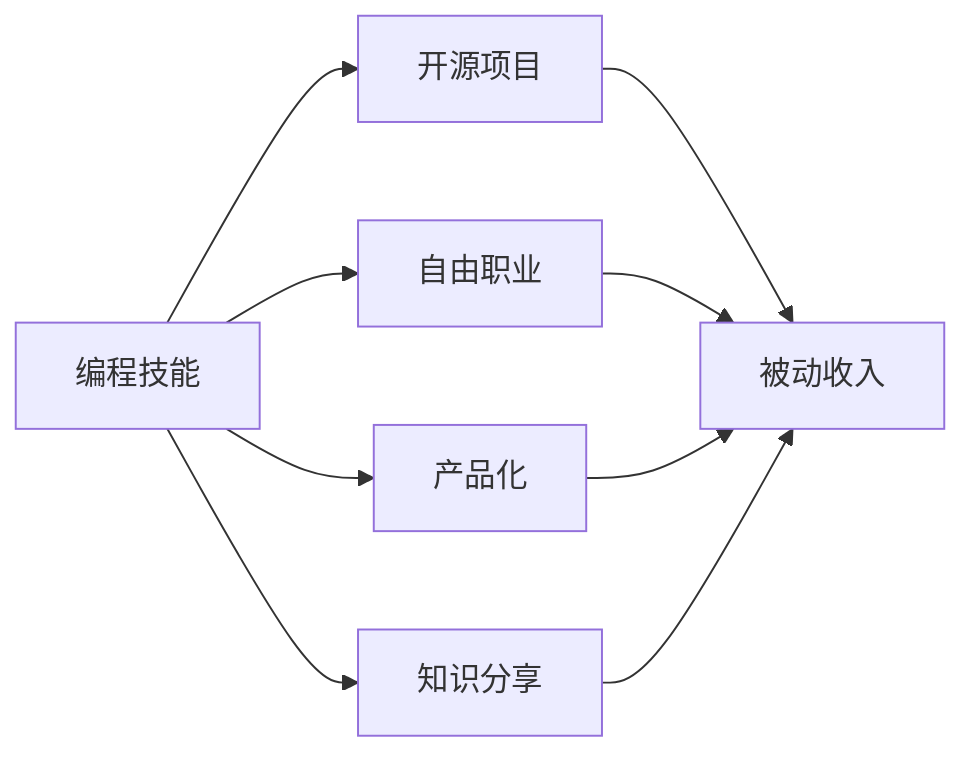

                 

## 1. 背景介绍

在这个快速变化的时代，程序员们面临着前所未有的机遇和挑战。技术的不断进步和需求的多样化，使得编程技能不再仅仅是一份职业，更成为一种能够带来持续收入的资产。然而，如何将这些技能转化为被动收入，仍然是一个值得深入探讨的问题。本文将深入分析如何将编程技能转化为被动收入的策略、方法和工具，帮助读者更好地理解和实现这一目标。

### 1.1 背景的现实意义

在当前的数字化转型浪潮中，软件开发和编程技能正变得日益重要。从技术到业务，从Web开发到移动应用，编程技能的应用场景越来越广泛。但是，由于技术更新迅速，许多程序员发现自己在不断的学习和适应中，很难找到稳定而可持续的收入来源。因此，如何将编程技能转化为被动收入，成为了众多编程爱好者和从业者的共同追求。

## 2. 核心概念与联系

### 2.1 核心概念概述

为了更好地理解如何将编程技能转化为被动收入，我们需要先掌握一些关键概念：

- **编程技能**：指编写、调试和维护代码的能力。
- **被动收入**：通过投资、知识产权、产品化等方式，无需直接参与日常工作而获得的收入。
- **开源项目**：程序员可以通过贡献代码、维护项目来获取社区认可和贡献积分，最终通过广告、赞助或捐赠获得收入。
- **自由职业**：独立编程或为多个客户提供编程服务，根据工作量和时间获得报酬。
- **产品化**：将编程技能应用到产品开发中，通过销售产品或提供服务获得收入。
- **知识分享**：通过编写书籍、博客、视频教程等形式，分享编程知识，通过付费阅读、广告等获得收入。

这些概念之间有着密切的联系，通过开源、自由职业、产品化和知识分享等多种方式，程序员可以将其编程技能转化为被动收入。

### 2.2 核心概念原理和架构的 Mermaid 流程图



这个流程图展示了编程技能转化为被动收入的几种主要途径：开源项目、自由职业、产品化和知识分享。每种途径都有其特定的实现方式和收益模型，但最终的目标都是通过技术手段获取稳定的被动收入。

## 3. 核心算法原理 & 具体操作步骤

### 3.1 算法原理概述

将编程技能转化为被动收入，本质上是一个多目标优化问题。目标是在不直接投入时间的情况下，最大化收入来源的多样性和稳定性。这涉及到了编程技能的应用、项目选择、市场定位和收益模型等诸多因素。

### 3.2 算法步骤详解

将编程技能转化为被动收入的步骤如下：

1. **技能评估**：评估自身编程技能和兴趣领域，确定擅长和感兴趣的技术栈。
2. **项目选择**：根据技能评估结果选择合适的项目，如开源、商业、个人项目等。
3. **市场定位**：明确目标受众和市场定位，确定盈利模式和营销策略。
4. **收益优化**：通过多样化收入来源和持续学习，优化收益结构，提高收入稳定性。

### 3.3 算法优缺点

**优点**：
- **多样化收入**：通过多种方式获取收入，降低单一收入来源的风险。
- **持续学习**：保持技术领先和市场竞争力，适应技术变化。
- **灵活性强**：根据市场需求和个人兴趣，自由选择项目和方向。

**缺点**：
- **初期投入高**：需要时间建立个人品牌和市场影响力。
- **技术要求高**：需要具备较强的编程能力和问题解决能力。
- **市场竞争激烈**：特别是在开源和自由职业领域，需要不断创新和优化。

### 3.4 算法应用领域

将编程技能转化为被动收入的应用领域非常广泛，包括但不限于：

- **开源社区**：贡献代码、维护项目、参与社区活动。
- **自由职业平台**：通过Upwork、Freelancer等平台提供编程服务。
- **产品化开发**：开发自己的应用程序，通过App Store、Google Play等平台销售。
- **知识分享平台**：在Medium、Coursera、Udemy等平台分享编程知识和经验。

## 4. 数学模型和公式 & 详细讲解 & 举例说明

### 4.1 数学模型构建

为了更系统地分析如何将编程技能转化为被动收入，我们可以建立一个数学模型。假设程序员在某一技能栈上的熟练度为 $S$，市场对该技能的需求为 $D$，其市场定位和营销策略为 $M$，则被动收入 $I$ 可以表示为：

$$ I = f(S, D, M) $$

其中 $f$ 是一个复杂的非线性函数，表示技能、需求和营销策略对收入的影响。

### 4.2 公式推导过程

为了简化问题，我们可以假设 $f$ 函数为线性函数，即：

$$ I = aS + bD + cM $$

其中 $a$、$b$、$c$ 是模型的参数，分别表示技能、需求和营销策略对收入的直接影响。

### 4.3 案例分析与讲解

以自由职业平台为例，我们可以分析如下：

- **技能 $S$**：程序员的编程能力和经验。
- **需求 $D$**：市场上对编程服务的需求，包括项目类型、工作量、技术难度等。
- **营销 $M$**：程序员的营销策略，包括在线简历、社交媒体、个人网站等。

通过调整 $S$、$D$、$M$ 的值，可以最大化 $I$ 的值。例如，程序员可以通过提升技能水平、选择高需求项目和积极推广自己，最大化被动收入。

## 5. 项目实践：代码实例和详细解释说明

### 5.1 开发环境搭建

为了更好地实践编程技能转化为被动收入，我们需要搭建一个开发环境。以下是一个基本的配置方案：

- **操作系统**：Ubuntu 20.04
- **开发工具**：VSCode、Git、Jekyll、GitHub Pages
- **编程语言**：Python、JavaScript、Java
- **开源社区**：GitHub

### 5.2 源代码详细实现

这里以一个简单的开源项目为例，展示如何将编程技能转化为被动收入：

```python
# 示例代码：一个简单的Python开源项目
# 项目名称：my_lib
# 项目简介：提供基本的Python库函数

import time

def my_function():
    time.sleep(2)
    print("Hello, World!")

# 项目上传至GitHub
# git init
# git add .
# git commit -m "Initial commit"
# git remote add origin https://github.com/username/my_lib.git
# git push -u origin master
```

### 5.3 代码解读与分析

上述代码是一个简单的Python开源项目，用于提供一个基本的函数 `my_function`。通过将该项目上传到GitHub，程序员可以获得被动收入。

- **代码上传**：将项目代码上传到GitHub仓库，设置适当的开源协议（如MIT、Apache等）。
- **贡献代码**：定期更新代码，提交PR，吸引其他开发者贡献代码。
- **广告和赞助**：通过GitHub Pages发布项目的演示版本，使用广告和赞助获得收入。

### 5.4 运行结果展示

在GitHub上，可以看到项目的贡献者、pull request、fork等数据，通过这些数据可以评估项目的活跃度和影响力。

## 6. 实际应用场景

### 6.1 开源社区

开源社区是程序员获取被动收入的重要途径之一。通过贡献代码、维护项目和参与社区活动，程序员可以获得社区认可和贡献积分，最终通过广告、赞助或捐赠获得收入。

### 6.2 自由职业平台

自由职业平台如Upwork、Freelancer等，为程序员提供了大量的项目机会。通过在这些平台上发布简历和报价，程序员可以根据工作量和时间获得报酬。

### 6.3 产品化开发

产品化开发是将编程技能应用到产品开发中的方式。通过开发自己的应用程序，并通过App Store、Google Play等平台销售，程序员可以获得稳定的被动收入。

### 6.4 知识分享平台

知识分享平台如Medium、Coursera、Udemy等，为程序员提供了一个展示编程知识和经验的机会。通过编写书籍、博客、视频教程等形式，程序员可以通过付费阅读、广告等获得收入。

## 7. 工具和资源推荐

### 7.1 学习资源推荐

为了帮助程序员更好地掌握如何将编程技能转化为被动收入，以下是一些推荐的学习资源：

- **《开源社区的力量》**：介绍了开源社区的运作方式和贡献方式，如何通过开源项目获得被动收入。
- **《自由职业指南》**：提供了自由职业平台的详细使用指南，如何高效利用这些平台。
- **《编程产品化》**：介绍了将编程技能应用到产品开发中的策略和技巧。
- **《知识分享的艺术》**：提供了在知识分享平台上的内容创作和收益优化的技巧。

### 7.2 开发工具推荐

- **VSCode**：一个功能强大的编程编辑器，支持多种编程语言和扩展插件。
- **Git**：版本控制系统，便于协作和版本管理。
- **GitHub Pages**：用于托管静态网站和文档，方便知识分享和展示。
- **Upwork**、**Freelancer**：自由职业平台，提供丰富的项目机会和合作机会。

### 7.3 相关论文推荐

- **《开源社区中的贡献和收益》**：研究了开源社区中贡献者如何通过代码贡献和社区互动获得收益。
- **《自由职业的市场分析》**：分析了自由职业平台上的市场供需关系和收入模式。
- **《产品化开发的策略》**：提供了将编程技能应用到产品开发中的具体策略和案例。
- **《知识分享的效果评估》**：研究了知识分享平台上的内容效果和收益模型。

## 8. 总结：未来发展趋势与挑战

### 8.1 研究成果总结

本文系统介绍了如何将编程技能转化为被动收入的策略、方法和工具。通过开源、自由职业、产品化和知识分享等多种方式，程序员可以将其编程技能转化为稳定的被动收入。

### 8.2 未来发展趋势

未来的发展趋势包括：

- **技术生态完善**：随着技术生态的不断完善，更多平台和工具将支持编程技能转化为被动收入。
- **市场需求的增长**：随着数字化转型的加速，对编程技能的需求将持续增长，为程序员提供更多机会。
- **教育培训的提升**：更多教育培训机构将提供相关课程，帮助程序员提升技能和市场竞争力。

### 8.3 面临的挑战

尽管技术生态和市场需求正在不断增长，但将编程技能转化为被动收入仍然面临诸多挑战：

- **技术更新快**：需要持续学习和更新技能，以适应技术变化。
- **市场竞争激烈**：特别是在开源和自由职业领域，需要不断创新和优化。
- **收入稳定性**：需要多样化收入来源，降低单一收入来源的风险。

### 8.4 研究展望

未来的研究应在以下几个方面进行探索：

- **技术生态的深化**：进一步研究技术生态中的关键因素和成功案例，指导程序员更好地利用技术资源。
- **市场需求的挖掘**：深入挖掘市场需求和趋势，为程序员提供更多机会和方向。
- **教育培训的创新**：开发更多教育培训课程和资源，帮助程序员提升技能和市场竞争力。
- **被动收入的优化**：研究被动收入的优化策略，提升程序员的收入稳定性和收益效率。

总之，将编程技能转化为被动收入是一个复杂而多层次的课题。通过深入理解核心概念和操作步骤，利用各种工具和资源，程序员可以更好地实现这一目标，为自己创造更多的收入来源和发展机会。

## 9. 附录：常见问题与解答

**Q1: 如何将编程技能转化为被动收入？**

A: 将编程技能转化为被动收入有多种途径，包括开源、自由职业、产品化和知识分享等。需要评估自身技能和兴趣，选择合适的方向，并根据市场需求进行策略调整。

**Q2: 如何优化被动收入结构？**

A: 通过多样化收入来源、持续学习提升技能、积极参与社区活动等方式，优化被动收入结构，提高收入的稳定性和可持续性。

**Q3: 如何克服编程技能转化的初期投入？**

A: 初期投入可以通过积极学习和参与社区活动、建立个人品牌和市场影响力等方式，逐步降低。同时，选择合适的项目和方向，也可以加快收益的实现。

**Q4: 如何应对市场竞争激烈的问题？**

A: 不断创新和优化，保持技术领先和市场竞争力。积极参与社区活动和市场分析，了解市场需求和趋势，快速响应和调整。

**Q5: 如何提升被动收入的稳定性？**

A: 多样化收入来源、持续学习提升技能、建立个人品牌和市场影响力，积极参与社区活动和市场分析，了解市场需求和趋势，快速响应和调整。

---

作者：禅与计算机程序设计艺术 / Zen and the Art of Computer Programming

