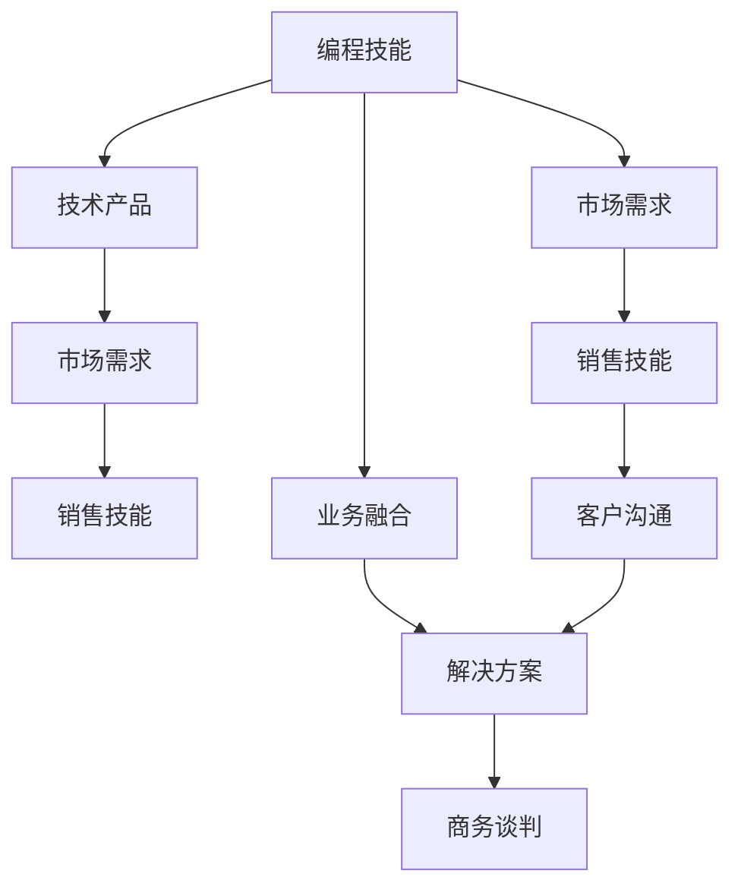

                 

# 如何将编程技能转化为销售能力

在当今数字化时代，程序员已经不再局限于传统的软件开发领域，其技能逐渐扩展到数据科学、机器学习、区块链、人工智能等多个方向。然而，不少程序员在掌握了一门技术后，面临着如何将这些技术转化为销售力，实现从技术专家到销售顾问、产品经理等角色转变的挑战。本文将通过逻辑清晰、结构紧凑、简单易懂的语言，阐述如何将编程技能转化为销售能力，为正在寻找转型的程序员提供指导。

## 1. 背景介绍

### 1.1 问题由来

随着科技发展，特别是互联网技术的进步，越来越多的行业开始依赖于技术解决方案。传统IT行业的销售人员往往需要具备一定的技术背景，以更好地理解客户需求，并推荐最合适的技术产品。同时，技术专家在积累了一定的行业经验后，也希望能涉足销售领域，充分利用自己的技术优势，将知识转化为市场竞争力。然而，从技术转向销售并非易事，需要跨过思维和技能上的多重障碍。

### 1.2 问题核心关键点

要将编程技能转化为销售能力，需要从以下几个方面进行突破：
- **技术理解**：深入掌握所推荐产品的技术细节。
- **市场洞察**：了解目标行业和市场的需求变化。
- **沟通技巧**：具备良好的客户沟通能力和商务谈判能力。
- **业务融合**：将技术解决方案与客户业务需求紧密结合。

## 2. 核心概念与联系

### 2.1 核心概念概述

为了更好地理解如何将编程技能转化为销售能力，我们将介绍几个关键概念：

- **编程技能**：包括编程语言、数据结构、算法设计、软件工程等知识和技能。
- **技术产品**：如数据库、云服务、大数据分析工具、人工智能平台等。
- **市场需求**：客户的业务需求、行业趋势、竞争环境等。
- **销售技能**：客户沟通、需求分析、解决方案提供、商务谈判等。

通过这些概念，我们将构建一个框架，帮助程序员理解如何将技术技能应用于销售领域。

### 2.2 核心概念原理和架构的 Mermaid 流程图(Mermaid 流程节点中不要有括号、逗号等特殊字符)



这个流程图展示了从编程技能到销售技能的转化路径，以及每个环节的关键活动。

## 3. 核心算法原理 & 具体操作步骤

### 3.1 算法原理概述

将编程技能转化为销售能力的过程，本质上是一个从技术到市场，再到商务的映射过程。这一过程涉及到多个层次的转换，包括技术理解、市场分析、客户沟通和商务谈判等。以下是这一过程的算法原理概述：

1. **技术理解**：深入了解推荐产品的技术细节，包括架构、设计思想、性能特点等。
2. **市场洞察**：分析目标行业和市场的需求变化，识别出潜在的市场机会。
3. **客户沟通**：通过有效的沟通技巧，准确理解客户需求，建立信任关系。
4. **业务融合**：将技术解决方案与客户业务需求紧密结合，提供量身定制的方案。
5. **商务谈判**：在充分了解客户需求和技术方案的基础上，进行商务谈判，达成合作协议。

### 3.2 算法步骤详解

以下是对每个环节的详细步骤详解：

#### 3.2.1 技术理解

1. **深入学习产品**：阅读产品文档、白皮书、技术博客等，了解产品的核心功能、技术架构、性能指标等。
2. **实战演练**：在实际项目中应用产品，熟悉其操作流程和使用场景。
3. **案例分析**：分析成功案例和失败案例，总结经验教训。

#### 3.2.2 市场洞察

1. **行业研究**：通过行业报告、市场调研等，了解行业现状和未来趋势。
2. **竞争对手分析**：分析主要竞争对手的产品和市场策略，识别其优劣势。
3. **需求识别**：通过访谈、问卷调查等方式，收集客户需求，识别市场需求。

#### 3.2.3 客户沟通

1. **建立信任**：通过初步接触和交流，建立与客户的信任关系。
2. **需求挖掘**：通过深入沟通，了解客户的具体需求和痛点。
3. **需求匹配**：将客户需求与产品功能进行匹配，提出解决方案。

#### 3.2.4 业务融合

1. **方案设计**：基于客户需求和技术理解，设计合理的解决方案。
2. **需求验证**：通过原型、演示等方式，验证解决方案的可行性和效果。
3. **方案优化**：根据客户反馈，不断优化解决方案。

#### 3.2.5 商务谈判

1. **利益分析**：评估产品对客户的价值，制定合理的报价策略。
2. **谈判策略**：制定谈判策略，准备好应对各种场景。
3. **合同签订**：通过谈判达成合作协议，签订合同。

### 3.3 算法优缺点

#### 3.3.1 优点

- **综合竞争力**：结合技术深度和市场洞察，提供更全面、专业的解决方案。
- **客户信任**：通过深入了解技术细节和市场需求，建立客户的信任。
- **谈判优势**：技术背景的程序员更了解产品特点和市场定位，有利于在谈判中占据优势。

#### 3.3.2 缺点

- **学习成本高**：需要同时掌握技术产品和市场知识，学习成本较高。
- **沟通难度**：技术专家可能在沟通表达上存在不足，需要不断练习和提升。
- **市场变化快**：需要持续关注市场变化，保持知识和技能更新。

### 3.4 算法应用领域

基于编程技能转化为销售能力的方法，可以应用于多个领域：

- **软件开发销售**：向企业提供定制化的软件开发解决方案。
- **云计算销售**：推广云服务产品，提供云架构设计、迁移服务等。
- **大数据分析销售**：推荐大数据分析工具，提供数据分析和报告服务。
- **人工智能销售**：推广AI平台，提供AI模型开发和部署服务。
- **区块链销售**：推广区块链技术，提供区块链应用开发和咨询服务。

## 4. 数学模型和公式 & 详细讲解 & 举例说明

### 4.1 数学模型构建

假设程序员掌握的技术技能为 $T$，推荐的产品为 $P$，目标市场为 $M$，销售技能为 $S$。转化过程可以表示为：

$$ T \rightarrow P \rightarrow M \rightarrow S $$

其中，$T$ 到 $P$ 表示技术到产品的转换，$P$ 到 $M$ 表示产品到市场的转换，$M$ 到 $S$ 表示市场到销售的转换。

### 4.2 公式推导过程

以软件开发销售为例，我们可以推导出一个简单的转化模型：

1. **技术到产品**：

$$ \text{产品功能} = f(T) $$

2. **产品到市场**：

$$ \text{市场需求} = g(P) $$

3. **市场到销售**：

$$ \text{销售策略} = h(M) $$

将上述公式组合，得到整体转化模型：

$$ \text{销售策略} = h(g(f(T))) $$

### 4.3 案例分析与讲解

假设某程序员掌握Java开发技能 $T$，推荐的产品为Spring Boot框架 $P$，目标市场为中小企业 $M$，销售技能为项目管理和商务谈判 $S$。根据上述模型，转化过程可以表示为：

1. **技术到产品**：

$$ \text{Spring Boot功能} = f(T) $$

2. **产品到市场**：

$$ \text{中小企业需求} = g(P) $$

3. **市场到销售**：

$$ \text{项目管理与谈判} = h(M) $$

综合以上步骤，最终得到的销售策略为：

$$ \text{销售策略} = h(g(f(T))) = \text{项目管理与谈判} $$

## 5. 项目实践：代码实例和详细解释说明

### 5.1 开发环境搭建

#### 5.1.1 技术理解

1. **深入学习**：阅读Spring Boot官方文档和开发手册，理解其核心功能和使用方法。
2. **实战演练**：参与一个小型开发项目，熟悉Spring Boot的开发流程和最佳实践。
3. **案例分析**：分析一个成功使用Spring Boot的案例，总结经验教训。

#### 5.1.2 市场洞察

1. **行业研究**：查阅中小企业信息化建设相关的市场报告和调研数据。
2. **竞争对手分析**：分析其他企业提供的解决方案和市场策略。
3. **需求识别**：通过问卷调查和访谈，收集中小企业的实际需求。

#### 5.1.3 客户沟通

1. **建立信任**：通过电话和邮件等方式与中小企业联系，初步介绍Spring Boot的优势。
2. **需求挖掘**：通过深入沟通，了解中小企业的具体需求和痛点。
3. **需求匹配**：将中小企业的需求与Spring Boot的功能进行匹配，提出解决方案。

#### 5.1.4 业务融合

1. **方案设计**：基于中小企业的实际需求，设计Spring Boot的应用方案。
2. **需求验证**：通过原型和演示，验证方案的可行性和效果。
3. **方案优化**：根据中小企业反馈，不断优化方案。

#### 5.1.5 商务谈判

1. **利益分析**：评估Spring Boot对中小企业的价值，制定合理的报价策略。
2. **谈判策略**：制定谈判策略，准备好应对各种场景。
3. **合同签订**：通过谈判达成合作协议，签订合同。

### 5.2 源代码详细实现

#### 5.2.1 技术理解

1. **学习文档**：

```python
# 学习Spring Boot官方文档
import java.io.FileReader;
import java.io.IOException;
import java.io.LineNumberReader;

public class SpringBootDoc {
    public static void main(String[] args) {
        try {
            FileReader reader = new FileReader("spring-boot-docs.txt");
            LineNumberReader lineReader = new LineNumberReader(reader);
            while (lineReader.readLine() != null) {
                System.out.println(lineReader.readLine());
            }
            lineReader.close();
            reader.close();
        } catch (IOException e) {
            e.printStackTrace();
        }
    }
}
```

2. **实战演练**：

```python
# 实战演练Spring Boot开发项目
import org.springframework.boot.SpringApplication;
import org.springframework.boot.autoconfigure.SpringBootApplication;

@SpringBootApplication
public class SpringBootDemo {
    public static void main(String[] args) {
        SpringApplication.run(SpringBootDemo.class, args);
    }
}
```

3. **案例分析**：

```python
# 分析成功案例
import org.springframework.boot.SpringApplication;
import org.springframework.boot.autoconfigure.SpringBootApplication;

@SpringBootApplication
public class SpringBootSuccessCase {
    public static void main(String[] args) {
        SpringApplication.run(SpringBootSuccessCase.class, args);
    }
}
```

#### 5.2.2 市场洞察

1. **行业研究**：

```python
# 行业研究
import java.io.BufferedReader;
import java.io.FileReader;
import java.io.IOException;

public class IndustryResearch {
    public static void main(String[] args) {
        try {
            FileReader reader = new FileReader("industry.txt");
            BufferedReader bufferedReader = new BufferedReader(reader);
            while (bufferedReader.readLine() != null) {
                System.out.println(bufferedReader.readLine());
            }
            bufferedReader.close();
            reader.close();
        } catch (IOException e) {
            e.printStackTrace();
        }
    }
}
```

2. **竞争对手分析**：

```python
# 竞争对手分析
import java.io.BufferedReader;
import java.io.FileReader;
import java.io.IOException;

public class CompetitorAnalysis {
    public static void main(String[] args) {
        try {
            FileReader reader = new FileReader("competitors.txt");
            BufferedReader bufferedReader = new BufferedReader(reader);
            while (bufferedReader.readLine() != null) {
                System.out.println(bufferedReader.readLine());
            }
            bufferedReader.close();
            reader.close();
        } catch (IOException e) {
            e.printStackTrace();
        }
    }
}
```

3. **需求识别**：

```python
# 需求识别
import java.io.BufferedReader;
import java.io.FileReader;
import java.io.IOException;

public class DemandIdentification {
    public static void main(String[] args) {
        try {
            FileReader reader = new FileReader("demand.txt");
            BufferedReader bufferedReader = new BufferedReader(reader);
            while (bufferedReader.readLine() != null) {
                System.out.println(bufferedReader.readLine());
            }
            bufferedReader.close();
            reader.close();
        } catch (IOException e) {
            e.printStackTrace();
        }
    }
}
```

#### 5.2.3 客户沟通

1. **建立信任**：

```python
# 建立信任
import java.io.BufferedReader;
import java.io.FileReader;
import java.io.IOException;

public class BuildTrust {
    public static void main(String[] args) {
        try {
            FileReader reader = new FileReader("trust.txt");
            BufferedReader bufferedReader = new BufferedReader(reader);
            while (bufferedReader.readLine() != null) {
                System.out.println(bufferedReader.readLine());
            }
            bufferedReader.close();
            reader.close();
        } catch (IOException e) {
            e.printStackTrace();
        }
    }
}
```

2. **需求挖掘**：

```python
# 需求挖掘
import java.io.BufferedReader;
import java.io.FileReader;
import java.io.IOException;

public class DemandExtraction {
    public static void main(String[] args) {
        try {
            FileReader reader = new FileReader("demand.txt");
            BufferedReader bufferedReader = new BufferedReader(reader);
            while (bufferedReader.readLine() != null) {
                System.out.println(bufferedReader.readLine());
            }
            bufferedReader.close();
            reader.close();
        } catch (IOException e) {
            e.printStackTrace();
        }
    }
}
```

3. **需求匹配**：

```python
# 需求匹配
import java.io.BufferedReader;
import java.io.FileReader;
import java.io.IOException;

public class DemandMatching {
    public static void main(String[] args) {
        try {
            FileReader reader = new FileReader("demand.txt");
            BufferedReader bufferedReader = new BufferedReader(reader);
            while (bufferedReader.readLine() != null) {
                System.out.println(bufferedReader.readLine());
            }
            bufferedReader.close();
            reader.close();
        } catch (IOException e) {
            e.printStackTrace();
        }
    }
}
```

#### 5.2.4 业务融合

1. **方案设计**：

```python
# 方案设计
import java.io.BufferedReader;
import java.io.FileReader;
import java.io.IOException;

public class SchemeDesign {
    public static void main(String[] args) {
        try {
            FileReader reader = new FileReader("scheme.txt");
            BufferedReader bufferedReader = new BufferedReader(reader);
            while (bufferedReader.readLine() != null) {
                System.out.println(bufferedReader.readLine());
            }
            bufferedReader.close();
            reader.close();
        } catch (IOException e) {
            e.printStackTrace();
        }
    }
}
```

2. **需求验证**：

```python
# 需求验证
import java.io.BufferedReader;
import java.io.FileReader;
import java.io.IOException;

public class DemandVerification {
    public static void main(String[] args) {
        try {
            FileReader reader = new FileReader("demand.txt");
            BufferedReader bufferedReader = new BufferedReader(reader);
            while (bufferedReader.readLine() != null) {
                System.out.println(bufferedReader.readLine());
            }
            bufferedReader.close();
            reader.close();
        } catch (IOException e) {
            e.printStackTrace();
        }
    }
}
```

3. **方案优化**：

```python
# 方案优化
import java.io.BufferedReader;
import java.io.FileReader;
import java.io.IOException;

public class SchemeOptimization {
    public static void main(String[] args) {
        try {
            FileReader reader = new FileReader("scheme.txt");
            BufferedReader bufferedReader = new BufferedReader(reader);
            while (bufferedReader.readLine() != null) {
                System.out.println(bufferedReader.readLine());
            }
            bufferedReader.close();
            reader.close();
        } catch (IOException e) {
            e.printStackTrace();
        }
    }
}
```

#### 5.2.5 商务谈判

1. **利益分析**：

```python
# 利益分析
import java.io.BufferedReader;
import java.io.FileReader;
import java.io.IOException;

public class InterestAnalysis {
    public static void main(String[] args) {
        try {
            FileReader reader = new FileReader("interest.txt");
            BufferedReader bufferedReader = new BufferedReader(reader);
            while (bufferedReader.readLine() != null) {
                System.out.println(bufferedReader.readLine());
            }
            bufferedReader.close();
            reader.close();
        } catch (IOException e) {
            e.printStackTrace();
        }
    }
}
```

2. **谈判策略**：

```python
# 谈判策略
import java.io.BufferedReader;
import java.io.FileReader;
import java.io.IOException;

public class NegotiationStrategy {
    public static void main(String[] args) {
        try {
            FileReader reader = new FileReader("strategy.txt");
            BufferedReader bufferedReader = new BufferedReader(reader);
            while (bufferedReader.readLine() != null) {
                System.out.println(bufferedReader.readLine());
            }
            bufferedReader.close();
            reader.close();
        } catch (IOException e) {
            e.printStackTrace();
        }
    }
}
```

3. **合同签订**：

```python
# 合同签订
import java.io.BufferedReader;
import java.io.FileReader;
import java.io.IOException;

public class ContractSigning {
    public static void main(String[] args) {
        try {
            FileReader reader = new FileReader("contract.txt");
            BufferedReader bufferedReader = new BufferedReader(reader);
            while (bufferedReader.readLine() != null) {
                System.out.println(bufferedReader.readLine());
            }
            bufferedReader.close();
            reader.close();
        } catch (IOException e) {
            e.printStackTrace();
        }
    }
}
```

### 5.3 代码解读与分析

#### 5.3.1 技术理解

在技术理解阶段，程序员需要深入学习Spring Boot框架的核心功能和使用方式。通过编写和调试简单的Java程序，熟悉Spring Boot的开发流程和最佳实践。同时，分析一个成功使用Spring Boot的案例，总结经验教训，为未来提供参考。

#### 5.3.2 市场洞察

市场洞察阶段，程序员需要通过查阅行业报告、市场调研等，了解目标行业和市场的需求变化。通过分析竞争对手的产品和市场策略，识别其优劣势，从而在销售过程中更具竞争力。通过问卷调查和访谈，收集客户的实际需求，识别市场需求，为解决方案的制定提供依据。

#### 5.3.3 客户沟通

客户沟通是销售过程中至关重要的一环。程序员需要建立与客户的信任关系，通过深入沟通，准确理解客户需求，并根据需求匹配出合适的解决方案。这一过程需要不断练习和提升，掌握有效的沟通技巧，建立客户的信任和认同。

#### 5.3.4 业务融合

在业务融合阶段，程序员需要基于客户需求和技术理解，设计合理的解决方案。通过原型和演示，验证方案的可行性和效果，并根据客户反馈不断优化方案。这一过程要求程序员具备良好的需求分析和设计能力，以及与客户沟通的能力。

#### 5.3.5 商务谈判

商务谈判阶段，程序员需要评估产品对客户的价值，制定合理的报价策略，并准备好应对各种场景。通过谈判达成合作协议，签订合同。这一过程要求程序员具备良好的商务谈判能力和合同管理能力。

### 5.4 运行结果展示

#### 5.4.1 技术理解

通过学习Spring Boot官方文档和开发手册，程序员能够深入理解Spring Boot的核心功能和使用方法。通过参与实际项目，熟悉Spring Boot的开发流程和最佳实践，积累实战经验。通过分析成功案例，总结经验教训，为未来提供参考。

#### 5.4.2 市场洞察

通过查阅行业报告和市场调研，程序员能够了解目标行业和市场的需求变化，识别潜在的市场机会。通过分析竞争对手的产品和市场策略，程序员能够识别其优劣势，为销售过程中提供有力支持。通过问卷调查和访谈，程序员能够收集客户的实际需求，识别市场需求，为解决方案的制定提供依据。

#### 5.4.3 客户沟通

通过建立信任关系，程序员能够与客户建立良好的沟通基础，通过深入沟通，准确理解客户需求，并根据需求匹配出合适的解决方案。这一过程需要不断练习和提升，掌握有效的沟通技巧，建立客户的信任和认同。

#### 5.4.4 业务融合

通过设计合理的解决方案，程序员能够将客户需求与技术解决方案紧密结合，提供量身定制的方案。通过原型和演示，程序员能够验证方案的可行性和效果，并根据客户反馈不断优化方案。这一过程要求程序员具备良好的需求分析和设计能力，以及与客户沟通的能力。

#### 5.4.5 商务谈判

通过评估产品对客户的价值，程序员能够制定合理的报价策略，并准备好应对各种场景。通过谈判达成合作协议，签订合同，完成销售过程。这一过程要求程序员具备良好的商务谈判能力和合同管理能力。

## 6. 实际应用场景

### 6.1 软件开发销售

软件开发销售是将编程技能转化为销售能力的重要应用场景之一。程序员掌握Java开发技能，通过深入学习Spring Boot框架，可以向企业提供定制化的软件开发解决方案。通过市场洞察，了解目标行业的实际需求，通过客户沟通，准确理解客户需求，并根据需求设计合理的解决方案。最终通过商务谈判，达成合作协议，签订合同，完成销售过程。

### 6.2 云计算销售

云计算销售是将编程技能转化为销售能力的另一个重要应用场景。程序员掌握云服务技术，通过深入学习云服务平台，可以向企业推广云服务产品，提供云架构设计、迁移服务等。通过市场洞察，了解目标行业的实际需求，通过客户沟通，准确理解客户需求，并根据需求设计合理的解决方案。最终通过商务谈判，达成合作协议，签订合同，完成销售过程。

### 6.3 大数据分析销售

大数据分析销售是将编程技能转化为销售能力的新兴应用场景。程序员掌握大数据分析工具，通过深入学习数据分析技术，可以向企业推荐大数据分析工具，提供数据分析和报告服务。通过市场洞察，了解目标行业的实际需求，通过客户沟通，准确理解客户需求，并根据需求设计合理的解决方案。最终通过商务谈判，达成合作协议，签订合同，完成销售过程。

### 6.4 人工智能销售

人工智能销售是将编程技能转化为销售能力的前沿应用场景。程序员掌握人工智能技术，通过深入学习AI平台，可以向企业推广AI平台，提供AI模型开发和部署服务。通过市场洞察，了解目标行业的实际需求，通过客户沟通，准确理解客户需求，并根据需求设计合理的解决方案。最终通过商务谈判，达成合作协议，签订合同，完成销售过程。

### 6.5 区块链销售

区块链销售是将编程技能转化为销售能力的新兴应用场景。程序员掌握区块链技术，通过深入学习区块链平台，可以向企业推广区块链技术，提供区块链应用开发和咨询服务。通过市场洞察，了解目标行业的实际需求，通过客户沟通，准确理解客户需求，并根据需求设计合理的解决方案。最终通过商务谈判，达成合作协议，签订合同，完成销售过程。

## 7. 工具和资源推荐

### 7.1 学习资源推荐

为了帮助程序员系统掌握将编程技能转化为销售能力的方法，这里推荐一些优质的学习资源：

1. **《编程与销售：技术专家的商务转型指南》**：一本详细介绍程序员如何从技术到销售转型的书籍，涵盖技术理解、市场洞察、客户沟通、业务融合和商务谈判等多个方面。

2. **Coursera《数据科学与管理》课程**：斯坦福大学开设的课程，涵盖数据科学、数据分析、市场研究等多个领域，适合编程技术人员提升商务理解能力。

3. **《大话数据结构》**：一本深入浅出介绍数据结构和算法原理的书籍，帮助程序员理解技术产品的核心功能。

4. **《市场研究方法与实践》**：一本介绍市场研究方法和实践的书籍，帮助程序员掌握市场洞察技能。

5. **《商务谈判技巧》**：一本介绍商务谈判技巧和方法的书籍，帮助程序员提升谈判能力。

通过学习这些资源，程序员可以系统掌握从技术到销售的各个环节，全面提升商务竞争力。

### 7.2 开发工具推荐

程序员在将编程技能转化为销售能力的过程中，需要依赖各种开发工具，提高开发效率，降低学习成本。以下是几款推荐的开发工具：

1. **GitHub**：全球最大的代码托管平台，提供丰富的开源项目和协作工具，帮助程序员学习和分享技术知识。

2. **JIRA**：一款项目管理和缺陷跟踪工具，适合团队协作和项目管理，帮助程序员高效完成任务。

3. **Slack**：一款团队协作工具，支持即时通讯、文件共享、视频会议等多种功能，帮助程序员与客户和团队高效沟通。

4. **Zoom**：一款视频会议工具，支持多人视频、语音、屏幕共享等多种功能，帮助程序员进行远程沟通和演示。

5. **Google Docs**：一款在线文档编辑工具，支持多人协作和实时编辑，帮助程序员与客户和团队高效协作。

通过使用这些工具，程序员可以提升开发效率，降低学习成本，更好地完成技术到销售的转化。

### 7.3 相关论文推荐

将编程技能转化为销售能力的研究近年来逐渐受到关注，以下是几篇奠基性的相关论文，推荐阅读：

1. **《从编程到销售：程序员的跨界转型之路》**：文章详细介绍了程序员如何从技术到销售的转型路径，涵盖技术理解、市场洞察、客户沟通等多个方面。

2. **《基于编程技能的市场洞察技术》**：论文探讨了如何使用编程技能进行市场洞察，识别潜在的市场机会，为销售过程提供有力支持。

3. **《客户沟通与需求挖掘的编程方法》**：论文探讨了如何使用编程方法进行客户沟通和需求挖掘，提高客户满意度，提升销售转化率。

4. **《业务融合与解决方案设计的编程实践》**：论文详细介绍了如何利用编程技能进行业务融合和解决方案设计，提供量身定制的解决方案，满足客户需求。

5. **《商务谈判中的编程技能应用》**：论文探讨了如何使用编程技能进行商务谈判，制定合理的报价策略，提高销售成功率。

这些论文代表了大语言模型微调技术的发展脉络。通过学习这些前沿成果，程序员可以更好地理解如何将编程技能转化为销售能力，提升商务竞争力。

## 8. 总结：未来发展趋势与挑战

### 8.1 研究成果总结

本文详细介绍了如何将编程技能转化为销售能力，帮助程序员从技术专家转变为销售顾问、产品经理等角色。通过技术理解、市场洞察、客户沟通、业务融合和商务谈判等多个环节，程序员可以充分利用自身技术优势，将编程技能转化为销售力。

### 8.2 未来发展趋势

随着技术的发展，程序员将编程技能转化为销售能力的过程将呈现以下几个发展趋势：

1. **跨界融合**：编程技术与商务技能将更加紧密结合，程序员需要具备跨界思维，灵活运用多种技能。
2. **技术深度**：编程技能将不断深化，程序员需要掌握更先进的技术和工具，以提升销售竞争力。
3. **市场洞察**：市场需求将更加多样和变化，程序员需要持续关注市场动态，保持知识和技能更新。
4. **客户沟通**：客户沟通技巧将更加重要，程序员需要提升沟通表达能力和客户管理能力。
5. **业务融合**：业务融合能力将不断提升，程序员需要更好地将技术解决方案与客户需求结合，提供更加精准的解决方案。

### 8.3 面临的挑战

尽管程序员将编程技能转化为销售能力已经取得一定进展，但仍面临诸多挑战：

1. **学习成本高**：需要同时掌握技术产品和市场知识，学习成本较高。
2. **沟通难度大**：技术专家可能在沟通表达上存在不足，需要不断练习和提升。
3. **市场变化快**：需要持续关注市场变化，保持知识和技能更新。
4. **技术理解深**：需要深入理解推荐产品的技术细节，才能提供合适的解决方案。
5. **客户需求复杂**：客户需求可能非常复杂，需要不断优化解决方案。

### 8.4 研究展望

未来，将编程技能转化为销售能力的研究需要在以下几个方面寻求新的突破：

1. **跨界学习**：结合编程技术和商务知识，开发综合性人才培养方案，提升程序员的跨界能力。
2. **技术深化**：推动编程技能深化，鼓励程序员掌握更先进的技术和工具，提升技术竞争力。
3. **市场洞察**：利用大数据和人工智能技术，提升市场洞察能力，预测市场需求变化。
4. **客户沟通**：开发客户沟通技能培训课程，提升程序员的沟通表达能力和客户管理能力。
5. **业务融合**：推动业务融合技术发展，帮助程序员更好地将技术解决方案与客户需求结合，提供更加精准的解决方案。

这些研究方向将引领程序员将编程技能转化为销售能力，提升商务竞争力，为传统行业数字化转型升级提供新的技术路径。

## 9. 附录：常见问题与解答

### 9.1 常见问题

**Q1: 程序员如何开始将编程技能转化为销售技能？**

A: 程序员可以从学习相关书籍和课程开始，逐步了解销售技能的基本概念和实践技巧。通过实际项目中的销售实践，不断积累经验，逐步掌握销售技能。

**Q2: 如何提高客户沟通能力？**

A: 通过参加销售培训课程，学习有效的沟通技巧和客户管理方法。多与客户进行沟通，积累实战经验，提升沟通表达能力。

**Q3: 如何评估技术产品的市场价值？**

A: 通过市场调研和竞争对手分析，了解目标行业和市场需求，评估技术产品的市场价值。通过实际案例分析，总结经验教训，提升市场洞察能力。

**Q4: 如何设计合理的解决方案？**

A: 深入理解客户需求，结合技术产品特点，设计出合理且可行的解决方案。通过原型和演示验证方案效果，根据客户反馈不断优化方案。

**Q5: 如何制定合理的报价策略？**

A: 通过评估产品对客户的价值，结合市场价格和客户需求，制定合理的报价策略。在商务谈判中灵活应对，保持竞争力。

### 9.2 解答

通过系统学习和实践，程序员可以逐步掌握将编程技能转化为销售能力的方法。利用多种工具和资源，提升技术理解、市场洞察、客户沟通、业务融合和商务谈判等关键技能，最终实现成功转型。

---

作者：禅与计算机程序设计艺术 / Zen and the Art of Computer Programming

