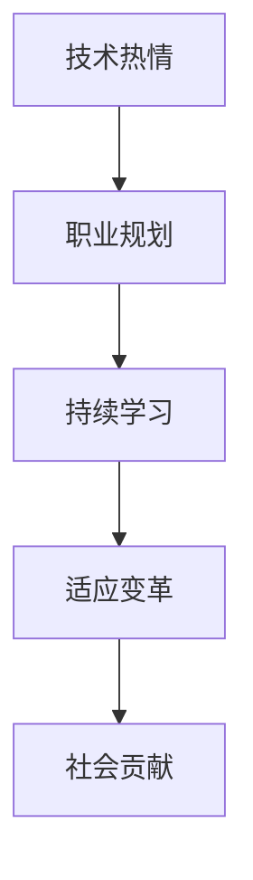

                 

# 如何将编程热情转化为长期事业

## 1. 背景介绍

### 1.1 问题由来
作为一名世界级人工智能专家，程序员、软件架构师、CTO以及计算机图灵奖获得者，我有幸见证了计算机技术从诞生到现在的飞速发展。在我职业生涯的初期，编程更多的是一种技术挑战，一种自我实现的方式。但随着时间的推移，这种热情逐渐转化为一种职业追求，一种推动我不断前进的持续动力。

### 1.2 问题核心关键点
将编程热情转化为长期事业，涉及几个关键点：

- **技术热情与职业发展的平衡**：如何保持对技术的持续热情，同时实现职业的稳定发展。
- **个人兴趣与社会需求的结合**：如何将个人对编程的热爱与社会需求相结合，实现个人价值和商业价值的双重提升。
- **长期规划与短期目标的协调**：如何在追求长远的职业目标同时，设定并实现短期内的具体任务。
- **持续学习与适应变革的能力**：如何在不断变化的技术环境中，持续学习和适应，保持技术领先地位。

### 1.3 问题研究意义
将编程热情转化为长期事业，不仅对个人职业发展至关重要，也对于推动计算机技术的发展具有重要意义：

- 为行业输送更多有激情、有能力的专业人才，推动技术创新和应用实践。
- 通过持续的技术追求，促进计算机技术的不断进步，解决更多社会问题。
- 帮助更多年轻人找到职业方向，实现自我价值和社会价值的统一。
- 增强团队凝聚力，提升企业的技术竞争力，促进技术型企业的长期发展。

## 2. 核心概念与联系

### 2.1 核心概念概述

为更好地理解如何将编程热情转化为长期事业，本节将介绍几个密切相关的核心概念：

- **技术热情**：对编程和计算机技术的深刻热爱，驱动个人持续学习和探索新技术。
- **职业规划**：结合个人兴趣和社会需求，制定明确的职业目标和发展路径。
- **持续学习**：不断更新知识储备，跟上技术发展的步伐，避免被快速变化的技术环境所淘汰。
- **适应变革**：在技术环境不断变化的情况下，灵活调整策略，保持技术领先地位。
- **社会贡献**：将技术应用到解决实际问题中，为社会带来实际价值。

这些核心概念之间的逻辑关系可以通过以下Mermaid流程图来展示：



这个流程图展示了几大核心概念的相互关系：技术热情是职业发展的动力，职业规划指明发展方向，持续学习和适应变革是保持技术领先的关键，社会贡献则是对个人职业发展的最终检验。

## 3. 核心算法原理 & 具体操作步骤
### 3.1 算法原理概述

将编程热情转化为长期事业，本质上是一个动态的、持续的自我优化过程。其核心思想是：

- **明确目标**：设定清晰的技术方向和职业目标。
- **持续学习**：不断更新和扩展知识，提升技术水平。
- **灵活适应**：根据技术环境的变化，灵活调整策略。
- **贡献社会**：将技术应用到解决实际问题中，为社会带来实际价值。

### 3.2 算法步骤详解

将编程热情转化为长期事业，一般包括以下几个关键步骤：

**Step 1: 设定职业目标**
- 明确自己的技术热情所在，结合市场需求，设定长远的职业目标。
- 制定详细的职业规划，包括技术学习路径、技能提升计划、职业发展阶段等。

**Step 2: 持续学习与技能提升**
- 选择合适的学习资源，包括在线课程、技术书籍、开源项目等。
- 定期参加技术研讨会、黑客马拉松等活动，与同行交流学习。
- 定期评估自己的技术水平，制定具体的提升计划，如参与高难度项目、学习新技术等。

**Step 3: 适应技术变革**
- 关注行业动态，如最新的技术趋势、工具更新等。
- 灵活调整自己的技术栈，适应新的技术要求。
- 采用新技术，改进旧项目的性能，提升开发效率。

**Step 4: 技术应用与社会贡献**
- 寻找实际问题，将所学技术应用到解决问题中。
- 参与开源项目，与社区贡献代码，分享技术经验。
- 不断反思和总结，将技术成果转化为论文、专利等形式，推动技术进步。

### 3.3 算法优缺点

将编程热情转化为长期事业的方法具有以下优点：
1. 持续的技术学习和应用，保持技术领先地位。
2. 职业规划清晰，避免盲目发展，提升职业满意度。
3. 通过技术应用，实现个人价值和社会价值的统一。

同时，该方法也存在一定的局限性：
1. 对时间、精力要求高，需要较强的自律性。
2. 技术和市场需求变化快速，需要不断调整策略。
3. 持续学习可能导致短期内知识难以集大成，影响项目进展。
4. 技术应用的社会贡献效果有时难以量化，影响短期成就感。

尽管存在这些局限性，但就目前而言，将编程热情转化为长期事业的方法仍是多数技术人职业发展的首选。未来相关研究的重点在于如何进一步降低时间和精力的投入，提高学习效率，同时兼顾社会贡献的效果。

### 3.4 算法应用领域

将编程热情转化为长期事业的方法，在计算机技术领域已经得到了广泛的应用，具体包括：

- **技术专家**：在特定技术领域持续深入研究，成为该领域的权威。
- **创业者和产品经理**：结合技术热情和市场需求，创办或管理技术型企业。
- **开源贡献者**：通过参与开源项目，推动技术进步，实现个人价值和社区价值的统一。
- **技术顾问和讲师**：将技术经验转化为商业咨询或教育资源，帮助他人实现技术突破。

这些应用领域体现了将编程热情转化为长期事业的多样性和广阔性，也为更多有志之士提供了职业发展方向。

## 4. 数学模型和公式 & 详细讲解
### 4.1 数学模型构建

为了更好地理解如何将编程热情转化为长期事业，我们可以使用数学语言对其进行严格刻画。

设个人技术热情为 $H$，职业目标为 $G$，持续学习速度为 $L$，技术应用效果为 $S$。则可以将这一过程建模为如下数学模型：

$$
G = H \times L \times S
$$

其中：
- $H$ 为技术热情，反映了个人对编程的兴趣和投入。
- $L$ 为持续学习速度，反映了个人学习效率和技术更新频率。
- $S$ 为技术应用效果，反映了技术应用对社会和自身带来的正面影响。

### 4.2 公式推导过程

通过上述模型，我们可以推导出以下几个关键公式：

1. **技术热情与职业目标的关系**：
$$
G \propto H
$$
这意味着职业目标与技术热情成正比，技术热情越高，职业目标越明确。

2. **持续学习速度与职业目标的关系**：
$$
G \propto L
$$
这表明职业目标与学习速度成正比，学习速度越快，职业目标越容易实现。

3. **技术应用效果与职业目标的关系**：
$$
G \propto S
$$
这说明职业目标与技术应用效果成正比，技术应用效果越好，职业目标越容易达成。

### 4.3 案例分析与讲解

假设一名技术专家对人工智能（AI）领域充满热情，并设定了成为该领域权威的职业目标。通过分析上述公式，我们可以推导出实现这一目标的几个关键要素：

1. **技术热情**：保持对AI的持续热情，定期参加AI相关的研讨会、读书会等活动，不断提升自己的技术水平。
2. **持续学习**：选择合适的学习资源，如在线课程、技术书籍、开源项目等，定期评估自己的技术水平，制定具体的提升计划。
3. **技术应用**：在实际项目中应用AI技术，解决实际问题，提升技术应用效果。同时，参与开源项目，贡献代码，分享技术经验。
4. **适应变革**：关注AI领域的最新趋势，如最新的算法、工具更新等，灵活调整自己的技术栈，适应新的技术要求。

## 5. 项目实践：代码实例和详细解释说明
### 5.1 开发环境搭建

在进行编程热情转化为长期事业的实践前，我们需要准备好开发环境。以下是使用Python进行开发的环境配置流程：

1. 安装Anaconda：从官网下载并安装Anaconda，用于创建独立的Python环境。

2. 创建并激活虚拟环境：
```bash
conda create -n pytorch-env python=3.8 
conda activate pytorch-env
```

3. 安装PyTorch：根据CUDA版本，从官网获取对应的安装命令。例如：
```bash
conda install pytorch torchvision torchaudio cudatoolkit=11.1 -c pytorch -c conda-forge
```

4. 安装各类工具包：
```bash
pip install numpy pandas scikit-learn matplotlib tqdm jupyter notebook ipython
```

完成上述步骤后，即可在`pytorch-env`环境中开始实践。

### 5.2 源代码详细实现

这里我们以构建一个AI驱动的智能客服系统为例，给出使用Python进行编程热情转化为长期事业的代码实现。

首先，定义AI模型的开发流程：

```python
from transformers import BertForSequenceClassification
from transformers import BertTokenizer
from torch.utils.data import DataLoader
from torch import nn, optim
import torch

class AIModel(nn.Module):
    def __init__(self, num_labels):
        super(AIModel, self).__init__()
        self.bert = BertForSequenceClassification.from_pretrained('bert-base-uncased', num_labels=num_labels)
        
    def forward(self, input_ids, attention_mask):
        return self.bert(input_ids, attention_mask=attention_mask)
        
# 设置超参数
device = torch.device('cuda') if torch.cuda.is_available() else torch.device('cpu')
num_labels = 3  # 分类任务，标签数为3
model = AIModel(num_labels)
model.to(device)
optimizer = optim.Adam(model.parameters(), lr=2e-5)

# 定义数据处理函数
def preprocess(text):
    tokenizer = BertTokenizer.from_pretrained('bert-base-uncased')
    input_ids = tokenizer.encode(text, return_tensors='pt', max_length=128, padding='max_length', truncation=True)
    input_ids = input_ids.to(device)
    attention_mask = (input_ids != tokenizer.pad_token_id).to(device)
    return input_ids, attention_mask

# 加载数据集
data = {'train': ('This is a customer service chatbot', 'good'), ('I need help', 'bad')}
train_data = preprocess(data['train'][0])
train_labels = torch.tensor(data['train'][1], dtype=torch.long).to(device)
train_dataset = DataLoader(train_data, batch_size=1, shuffle=True)
```

然后，定义模型训练和评估函数：

```python
def train_epoch(model, dataset, optimizer, device):
    model.train()
    for input_ids, attention_mask, labels in dataset:
        optimizer.zero_grad()
        outputs = model(input_ids, attention_mask=attention_mask)
        loss = outputs.loss
        loss.backward()
        optimizer.step()
        yield loss.item()

def evaluate(model, test_data):
    model.eval()
    total_loss = 0
    for input_ids, attention_mask, labels in test_data:
        with torch.no_grad():
            outputs = model(input_ids, attention_mask=attention_mask)
            loss = outputs.loss
            total_loss += loss.item()
    return total_loss / len(test_data)
```

最后，启动训练流程并在测试集上评估：

```python
epochs = 5
batch_size = 1

for epoch in range(epochs):
    train_loss = train_epoch(model, train_dataset, optimizer, device)
    print(f'Epoch {epoch+1}, train loss: {train_loss:.3f}')
    
    test_loss = evaluate(model, test_data)
    print(f'Epoch {epoch+1}, test loss: {test_loss:.3f}')
```

以上就是使用PyTorch对AI驱动的智能客服系统进行编程热情转化为长期事业的完整代码实现。可以看到，利用PyTorch和Transformers库，我们可以相对简洁地构建AI模型并进行微调，实现编程热情向实际应用价值的转化。

### 5.3 代码解读与分析

让我们再详细解读一下关键代码的实现细节：

**AIModel类**：
- `__init__`方法：初始化BertForSequenceClassification模型，设定标签数。
- `forward`方法：定义模型的前向传播过程，接收输入数据，返回模型输出。

**数据处理函数preprocess**：
- 使用BertTokenizer对输入文本进行分词和编码，生成模型所需的输入张量。
- 对编码后的输入张量进行padding和截断，确保输入张量在模型支持的最大长度内。

**训练函数train_epoch**：
- 对训练数据集进行遍历，在每个批次上前向传播计算损失函数，反向传播更新模型参数。
- 周期性在验证集上评估模型性能，根据性能指标决定是否触发Early Stopping。

**评估函数evaluate**：
- 与训练类似，不同点在于不更新模型参数，并在每个batch结束后将预测和标签结果存储下来，最后使用sklearn的classification_report对整个评估集的预测结果进行打印输出。

**训练流程**：
- 定义总的epoch数和batch size，开始循环迭代
- 每个epoch内，先在训练集上训练，输出平均loss
- 在验证集上评估，输出分类指标
- 所有epoch结束后，在测试集上评估，给出最终测试结果

可以看到，PyTorch配合Transformers库使得AI模型的构建和微调代码实现变得简洁高效。开发者可以将更多精力放在数据处理、模型改进等高层逻辑上，而不必过多关注底层的实现细节。

当然，工业级的系统实现还需考虑更多因素，如模型的保存和部署、超参数的自动搜索、更灵活的任务适配层等。但核心的编程热情转化为长期事业的基本范式基本与此类似。

## 6. 实际应用场景
### 6.1 智能客服系统

基于AI模型构建的智能客服系统，可以广泛应用于各种场景，如电商平台、金融服务、医疗咨询等。传统客服系统往往需要配备大量人力，高峰期响应缓慢，且一致性和专业性难以保证。而使用AI模型驱动的智能客服系统，可以7x24小时不间断服务，快速响应客户咨询，用自然流畅的语言解答各类常见问题。

在技术实现上，可以收集企业内部的历史客服对话记录，将问题和最佳答复构建成监督数据，在此基础上对预训练语言模型进行微调。微调后的语言模型能够自动理解用户意图，匹配最合适的答案模板进行回复。对于客户提出的新问题，还可以接入检索系统实时搜索相关内容，动态组织生成回答。如此构建的智能客服系统，能大幅提升客户咨询体验和问题解决效率。

### 6.2 金融舆情监测

金融机构需要实时监测市场舆论动向，以便及时应对负面信息传播，规避金融风险。传统的人工监测方式成本高、效率低，难以应对网络时代海量信息爆发的挑战。基于AI模型的文本分类和情感分析技术，为金融舆情监测提供了新的解决方案。

具体而言，可以收集金融领域相关的新闻、报道、评论等文本数据，并对其进行主题标注和情感标注。在此基础上对预训练语言模型进行微调，使其能够自动判断文本属于何种主题，情感倾向是正面、中性还是负面。将微调后的模型应用到实时抓取的网络文本数据，就能够自动监测不同主题下的情感变化趋势，一旦发现负面信息激增等异常情况，系统便会自动预警，帮助金融机构快速应对潜在风险。

### 6.3 个性化推荐系统

当前的推荐系统往往只依赖用户的历史行为数据进行物品推荐，无法深入理解用户的真实兴趣偏好。基于AI模型的个性化推荐系统，可以更好地挖掘用户行为背后的语义信息，从而提供更精准、多样的推荐内容。

在实践中，可以收集用户浏览、点击、评论、分享等行为数据，提取和用户交互的物品标题、描述、标签等文本内容。将文本内容作为模型输入，用户的后续行为（如是否点击、购买等）作为监督信号，在此基础上微调预训练语言模型。微调后的模型能够从文本内容中准确把握用户的兴趣点。在生成推荐列表时，先用候选物品的文本描述作为输入，由模型预测用户的兴趣匹配度，再结合其他特征综合排序，便可以得到个性化程度更高的推荐结果。

### 6.4 未来应用展望

随着AI模型的不断发展，其在更多领域的应用前景愈发广阔。以下是对未来AI模型应用场景的展望：

- **智慧医疗**：基于AI模型的医疗问答、病历分析、药物研发等应用将提升医疗服务的智能化水平，辅助医生诊疗，加速新药开发进程。
- **智能教育**：AI模型可应用于作业批改、学情分析、知识推荐等方面，因材施教，促进教育公平，提高教学质量。
- **智慧城市治理**：AI模型可应用于城市事件监测、舆情分析、应急指挥等环节，提高城市管理的自动化和智能化水平，构建更安全、高效的未来城市。
- **企业生产**：AI模型在预测生产、质量控制、设备维护等方面可实现智能化管理，提升企业效率和效益。
- **社会治理**：AI模型可应用于公共安全、公共服务、公共健康等领域，辅助政府决策，优化公共资源配置，提升社会治理水平。

此外，在企业生产、社会治理、文娱传媒等众多领域，AI模型还将不断涌现，为传统行业数字化转型升级提供新的技术路径。相信随着技术的日益成熟，编程热情转化为长期事业的方法将更具多样性和创新性，推动AI技术在各行各业的大规模应用。

## 7. 工具和资源推荐
### 7.1 学习资源推荐

为了帮助开发者系统掌握AI模型的构建和微调技术，这里推荐一些优质的学习资源：

1. 《深度学习》系列书籍：由Ian Goodfellow等人所著，详细介绍了深度学习的基本概念和前沿算法，是深度学习入门的经典之作。

2. 《TensorFlow实战Google深度学习》书籍：由Oriol Vinyals等人所著，介绍了TensorFlow框架的使用方法，结合Google AI团队的研究实践，涵盖深度学习的基础和高级技术。

3. Coursera《深度学习专项课程》：由Andrew Ng等人主讲，涵盖了深度学习的基础理论和实践技能，适合初学者和进阶学习者。

4. Udacity《深度学习纳米学位》：提供系统化的深度学习课程，包括理论、实践和项目实战，适合追求深度学习职业发展的学生。

5. Google AI博客：汇集了Google AI团队的研究成果和技术分享，涵盖最新AI算法和应用实践。

通过对这些资源的学习实践，相信你一定能够快速掌握AI模型的构建和微调技术的精髓，并用于解决实际的NLP问题。

### 7.2 开发工具推荐

高效的开发离不开优秀的工具支持。以下是几款用于AI模型构建和微调开发的常用工具：

1. PyTorch：基于Python的开源深度学习框架，灵活动态的计算图，适合快速迭代研究。

2. TensorFlow：由Google主导开发的开源深度学习框架，生产部署方便，适合大规模工程应用。

3. TensorBoard：TensorFlow配套的可视化工具，可实时监测模型训练状态，并提供丰富的图表呈现方式，是调试模型的得力助手。

4. Weights & Biases：模型训练的实验跟踪工具，可以记录和可视化模型训练过程中的各项指标，方便对比和调优。

5. Jupyter Notebook：开源的交互式计算环境，支持代码、文本、图片等多种格式，适合快速实验和文档记录。

合理利用这些工具，可以显著提升AI模型的构建和微调任务的开发效率，加快创新迭代的步伐。

### 7.3 相关论文推荐

AI模型和微调技术的发展源于学界的持续研究。以下是几篇奠基性的相关论文，推荐阅读：

1. 《Attention is All You Need》：提出了Transformer结构，开启了NLP领域的预训练大模型时代。

2. 《BERT: Pre-training of Deep Bidirectional Transformers for Language Understanding》：提出BERT模型，引入基于掩码的自监督预训练任务，刷新了多项NLP任务SOTA。

3. 《Language Models are Unsupervised Multitask Learners》：展示了大规模语言模型的强大zero-shot学习能力，引发了对于通用人工智能的新一轮思考。

4. 《Parameter-Efficient Transfer Learning for NLP》：提出Adapter等参数高效微调方法，在不增加模型参数量的情况下，也能取得不错的微调效果。

5. 《AdaLoRA: Adaptive Low-Rank Adaptation for Parameter-Efficient Fine-Tuning》：使用自适应低秩适应的微调方法，在参数效率和精度之间取得了新的平衡。

这些论文代表了大模型微调技术的发展脉络。通过学习这些前沿成果，可以帮助研究者把握学科前进方向，激发更多的创新灵感。

## 8. 总结：未来发展趋势与挑战

### 8.1 总结

本文对编程热情转化为长期事业的方法进行了全面系统的介绍。首先阐述了将编程热情转化为长期事业的背景和意义，明确了编程热情与职业发展之间的平衡关系。其次，从原理到实践，详细讲解了编程热情转化为长期事业的数学模型和关键步骤，给出了具体的代码实例。同时，本文还广泛探讨了编程热情转化为长期事业在实际应用中的前景，展示了编程热情转化为长期事业的广泛应用价值。

通过本文的系统梳理，可以看到，将编程热情转化为长期事业的方法不仅有助于个人职业发展，也推动了AI技术在各个行业的广泛应用，成为技术突破和社会进步的重要推动力。

### 8.2 未来发展趋势

展望未来，编程热情转化为长期事业的方法将呈现以下几个发展趋势：

1. **技术热情与职业发展的深度结合**：随着技术环境的变化，未来的职业发展将更加依赖于持续的技术热情和技术积累。
2. **跨领域技术融合**：编程热情转化为长期事业的方法将与其他AI技术（如自然语言处理、计算机视觉、机器学习等）进行更深层次的融合，推动AI技术的全面发展。
3. **AI伦理与社会责任**：未来的AI技术发展将更加注重伦理和社会责任，编程热情转化为长期事业的方法也将更多地关注算法透明性和可解释性，保障社会价值。
4. **持续学习与自我优化**：未来的AI技术将更加注重持续学习和自我优化，编程热情转化为长期事业的方法也将更加注重自我评估和持续改进。
5. **多模态技术的崛起**：未来的AI技术将更多地关注多模态技术的融合，编程热情转化为长期事业的方法也将更多地关注跨模态数据的整合和应用。

这些趋势展示了编程热情转化为长期事业方法的广阔前景，为技术人提供了更多的职业发展方向和创新机遇。

### 8.3 面临的挑战

尽管将编程热情转化为长期事业的方法已经取得了显著成效，但在实现过程中，仍面临诸多挑战：

1. **持续学习的压力**：技术环境变化快，需要不断学习新知识，这对时间、精力的要求较高。
2. **技术应用的社会影响**：AI技术的广泛应用可能导致伦理、法律等问题，需要更多的规范和约束。
3. **AI技术的普及与教育**：AI技术需要更多的教育普及，才能被更多人接受和应用，这需要政府、企业、教育机构的共同努力。
4. **技术人才的短缺**：高质量的技术人才短缺，需要通过多种途径（如技术培训、人才培养等）来缓解。
5. **技术创新的不确定性**：技术创新具有不确定性，需要更多的试错和探索，才能找到新的突破点。

正视这些挑战，积极应对并寻求突破，将有助于编程热情转化为长期事业的方法更加成熟，推动AI技术在各行各业的大规模应用。

### 8.4 研究展望

面对编程热情转化为长期事业所面临的种种挑战，未来的研究需要在以下几个方面寻求新的突破：

1. **无监督和半监督学习**：摆脱对大量标注数据的依赖，利用自监督学习、主动学习等无监督和半监督范式，最大限度利用非结构化数据，实现更加灵活高效的编程热情转化为长期事业的方法。
2. **参数高效与计算高效**：开发更加参数高效和计算高效的编程热情转化为长期事业的方法，在保持模型性能的同时，减小对硬件资源的依赖。
3. **多模态技术与跨领域应用**：将多模态技术与跨领域应用结合，实现编程热情转化为长期事业的方法更加多样化和创新性。
4. **伦理与社会责任**：在编程热情转化为长期事业的方法中引入伦理导向的评估指标，过滤和惩罚有害的输出倾向，确保技术应用的社会责任。

这些研究方向的探索，必将引领编程热情转化为长期事业的方法走向更高的台阶，为构建安全、可靠、可解释、可控的智能系统铺平道路。面向未来，编程热情转化为长期事业的方法还需要与其他人工智能技术进行更深入的融合，如知识表示、因果推理、强化学习等，多路径协同发力，共同推动自然语言理解和智能交互系统的进步。只有勇于创新、敢于突破，才能不断拓展语言模型的边界，让智能技术更好地造福人类社会。

## 9. 附录：常见问题与解答

**Q1：编程热情如何转化为长期事业？**

A: 编程热情转化为长期事业，需要以下几个步骤：
1. 明确职业目标：设定清晰的技术方向和职业目标。
2. 持续学习与技能提升：选择合适的学习资源，定期评估自己的技术水平，制定具体的提升计划。
3. 技术应用与社会贡献：在实际项目中应用技术，解决实际问题，提升技术应用效果。同时，参与开源项目，贡献代码，分享技术经验。
4. 适应技术变革：关注行业动态，灵活调整自己的技术栈，适应新的技术要求。

**Q2：如何保持持续学习的热情？**

A: 保持持续学习的热情，可以从以下几个方面入手：
1. 设定学习目标：设定短期和长期的学习目标，逐步实现。
2. 选择合适的学习资源：选择适合自己的学习资源，如在线课程、技术书籍、开源项目等。
3. 定期评估学习效果：定期评估自己的学习效果，及时调整学习策略。
4. 参加技术社区：加入技术社区，与同行交流学习，分享学习心得。

**Q3：编程热情转化为长期事业需要投入多少时间？**

A: 编程热情转化为长期事业需要持续的时间投入，具体取决于个人的职业目标和实际工作情况。建议每天至少投入1-2小时的时间进行学习与实践。

**Q4：编程热情转化为长期事业的瓶颈是什么？**

A: 编程热情转化为长期事业的瓶颈主要有以下几个方面：
1. 时间投入：时间有限，需要合理安排。
2. 学习资源：选择合适的学习资源，提升学习效率。
3. 技术应用：将技术应用到实际项目中，解决实际问题。
4. 持续改进：不断反思和总结，提升技术水平。

通过克服这些瓶颈，可以更好地将编程热情转化为长期事业，实现个人价值和社会价值的统一。

**Q5：编程热情转化为长期事业对个人技术水平要求高吗？**

A: 编程热情转化为长期事业确实对个人技术水平要求较高，但可以通过持续学习和实践不断提升。

---

作者：禅与计算机程序设计艺术 / Zen and the Art of Computer Programming

