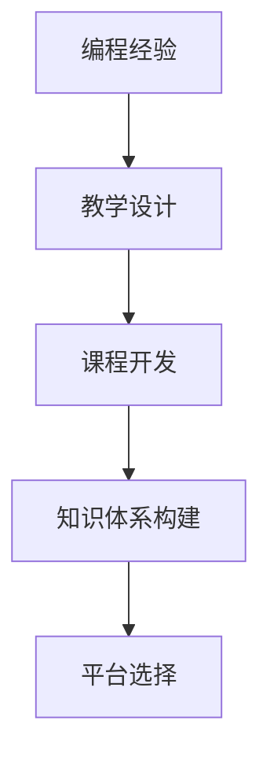

                 

# 如何将编程经验转化为付费培训课程

> 关键词：编程经验,付费培训,教学设计,课程开发,知识体系构建

## 1. 背景介绍

编程经验在软件开发领域的价值不容小觑。从入门级到高级，从前端到后端，从算法到数据结构，每一次编码实践都蕴含着丰富的知识和技能。但如何把这些经验有效地转化为有形的成果，让更多人受益，这是一个值得探讨的问题。将编程经验转化为付费培训课程，不仅能够帮助他人提升技术水平，还能为自己创造经济价值，实现双赢。本文将系统介绍如何将编程经验转化为付费培训课程，包括课程设计、教学方法、内容建设、平台选择等关键环节。

## 2. 核心概念与联系

### 2.1 核心概念概述

为更好地理解如何将编程经验转化为培训课程，本节将介绍几个密切相关的核心概念：

- 编程经验：指软件开发人员在项目实践中积累的技术知识、问题解决策略、编码习惯等。
- 培训课程：为教学目标设计的系列教学活动，通常包括理论讲授、实操练习、项目实践等环节。
- 教学设计：在培训课程开发过程中，根据学习者的需求和目标，规划课程结构、教学方法、评估方式等。
- 课程开发：根据教学设计，将知识体系转化为可教授的课程内容。
- 知识体系构建：将知识点组织成逻辑连贯、结构完整的体系，便于传授和吸收。
- 平台选择：选择适合的在线或线下平台，将课程发布和推广。

这些核心概念之间的逻辑关系可以通过以下Mermaid流程图来展示：



这个流程图展示了几项核心概念之间的联系：

1. 编程经验是课程开发的基础，为教学设计提供素材。
2. 教学设计指导课程开发，决定课程的结构和形式。
3. 知识体系构建帮助课程内容更有条理，便于学习者掌握。
4. 平台选择决定了课程的传播范围和形式。

这些概念共同构成了将编程经验转化为培训课程的全流程，使得经验可以系统化、结构化地传授给学习者。

## 3. 核心算法原理 & 具体操作步骤

### 3.1 算法原理概述

将编程经验转化为付费培训课程的核心算法原理在于如何将抽象的编程技能转化为易于理解和操作的学习内容。该过程可以概括为以下几个步骤：

1. **需求分析**：明确目标受众和教学目标。
2. **知识提炼**：从编程经验中提炼核心知识点，形成课程大纲。
3. **内容设计**：根据课程大纲设计具体教学内容，包括理论讲授、实操练习、案例分析等。
4. **平台适配**：选择适合的在线或线下平台，确保课程的传播和互动效果。
5. **评估反馈**：通过学习者反馈调整课程内容和教学方法，持续改进。

### 3.2 算法步骤详解

#### 步骤1：需求分析

**目标受众**：
- 初级开发者：对编程基础有基本了解，但缺乏实际项目经验。
- 中级开发者：有一定的项目经验，但需要提升进阶技能。
- 高级开发者：希望在特定领域（如人工智能、云计算）进行深耕。

**教学目标**：
- 基础知识入门：编程语言基础、基本数据结构、算法思想。
- 技术能力提升：特定技术栈（如Spring Boot、TensorFlow）、开发工具使用、DevOps实践。
- 项目实战能力：完成中小型项目，体验项目管理和协作。
- 高级技能深化：人工智能算法、大数据技术、云计算架构等。

#### 步骤2：知识提炼

根据需求分析，将编程经验中的核心知识点提炼出来，形成课程大纲。例如：

1. **Java基础**：面向对象编程、数据结构与算法、异常处理。
2. **Web开发**：Spring Boot、Spring MVC、数据库操作。
3. **人工智能**：机器学习基础、TensorFlow、深度学习模型训练。
4. **云计算**：AWS、Kubernetes、Docker容器化。

#### 步骤3：内容设计

根据课程大纲，设计具体的教学内容，包括理论讲授、实操练习、案例分析等。例如：

1. **Java基础**：Java基础语法、面向对象编程、数据结构与算法、异常处理等。
2. **Web开发**：Spring Boot快速搭建Web应用、Spring MVC数据绑定、数据库操作等。
3. **人工智能**：TensorFlow入门、深度学习模型训练、Kaggle实战等。
4. **云计算**：AWS基本操作、Kubernetes容器编排、Docker容器化等。

#### 步骤4：平台适配

选择适合的在线或线下平台，将课程发布和推广。例如：

1. **在线平台**：Udemy、Coursera、网易云课堂等。
2. **线下平台**：培训机构、企业内训、公开课等。

#### 步骤5：评估反馈

通过学习者反馈调整课程内容和教学方法，持续改进。例如：

1. **问卷调查**：课程结束后发送问卷，收集学习者对课程内容的满意度、存在的问题等。
2. **学习者互动**：在学习平台提供评论、讨论区，鼓励学习者交流和反馈。
3. **定期更新**：根据学习者反馈和新技术发展，定期更新课程内容。

### 3.3 算法优缺点

将编程经验转化为培训课程的优点包括：

1. **知识共享**：将自身经验分享给更多人，帮助他们提升技术水平。
2. **经济收益**：通过课程销售获取经济回报，实现知识变现。
3. **个人品牌提升**：成为知名讲师，增强职业影响力。
4. **能力验证**：通过教学验证自身技术水平，促进自我提升。

缺点包括：

1. **时间成本**：从需求分析到课程制作再到推广，需要投入大量时间和精力。
2. **内容深度**：课程内容需要深度挖掘，把握核心知识点，避免冗余。
3. **技术更新**：技术快速发展，课程内容需要不断更新，才能保持时效性。
4. **推广难度**：课程推广需要一定的市场策略和平台支持。

尽管存在这些挑战，但通过合理规划和执行，这些缺点是可以克服的。

### 3.4 算法应用领域

将编程经验转化为培训课程的应用领域非常广泛，涵盖了软件开发、人工智能、云计算、数据科学等多个领域。以下是几个典型应用场景：

1. **软件开发**：面向Java、Python、C++等主流编程语言的开发课程。
2. **数据科学**：面向数据清洗、数据可视化、机器学习等数据分析课程。
3. **人工智能**：面向深度学习、自然语言处理、计算机视觉等AI课程。
4. **云计算**：面向AWS、Azure、GCP等云平台的操作和管理课程。
5. **DevOps**：面向自动化测试、持续集成、容器编排等DevOps实践课程。

## 4. 数学模型和公式 & 详细讲解 & 举例说明

### 4.1 数学模型构建

将编程经验转化为培训课程的过程，可以用一个简单的数学模型来描述：

设编程经验总数为 $E$，目标受众数量为 $L$，课程数量为 $C$，教学目标为 $T$，则总教学时间 $T_{total}$ 可以表示为：

$$
T_{total} = f(E, L, C, T)
$$

其中，$f$ 为函数，表示将编程经验转化为课程的时间和效率。

### 4.2 公式推导过程

为了简化公式，我们假设每门课程 $i$ 的教学时间为 $t_i$，则有：

$$
T_{total} = \sum_{i=1}^C t_i
$$

其中，$t_i = f_i(E_i, L_i, T_i)$，$f_i$ 为第 $i$ 门课程的函数，表示将编程经验 $E_i$ 转化为课程 $t_i$ 的时间和效率。

### 4.3 案例分析与讲解

以Java基础课程为例，假设编程经验总量为 $E_{Java} = 100$，目标受众数量为 $L_{Java} = 500$，课程数量为 $C_{Java} = 3$，教学目标为 $T_{Java} = [基础语法、面向对象、数据结构]$，则总教学时间 $T_{Java}$ 可以计算为：

$$
T_{Java} = \sum_{i=1}^3 t_i = f_{基础语法}(E_{基础语法}, L_{基础语法}, T_{基础语法}) + f_{面向对象}(E_{面向对象}, L_{面向对象}, T_{面向对象}) + f_{数据结构}(E_{数据结构}, L_{数据结构}, T_{数据结构})
$$

根据实际经验，课程制作时间与目标受众数量和教学目标成正比，可以假设：

$$
t_i = \alpha L_i + \beta T_i
$$

其中，$\alpha$ 和 $\beta$ 为系数，表示制作时间与受众数量和目标的相对重要性。

## 5. 项目实践：代码实例和详细解释说明

### 5.1 开发环境搭建

要进行课程开发，首先需要搭建好开发环境。以下是具体的步骤：

1. **安装开发工具**：安装Python、Jupyter Notebook、Git等常用开发工具。
2. **设置代码仓库**：使用Git建立本地代码仓库，使用GitHub等云平台进行代码托管。
3. **搭建开发环境**：根据课程内容，选择适合的开发环境（如JDK、Maven等）。

### 5.2 源代码详细实现

以下是Java基础课程的详细实现：

```java
public class JavaBasics {
    public static void main(String[] args) {
        System.out.println("Java基础课程");
        System.out.println("课程1：基础语法");
        System.out.println("课程2：面向对象");
        System.out.println("课程3：数据结构");
    }
}
```

### 5.3 代码解读与分析

以上代码实现了一个简单的Java基础课程框架。在实际开发中，需要将每个课程细化为具体的知识点和实操练习，例如：

1. **基础语法**：变量、数据类型、控制结构等。
2. **面向对象**：类、接口、继承、多态等。
3. **数据结构**：数组、链表、栈、队列等。

每个课程需要编写对应的讲义、代码示例和练习题，确保学习者能够通过实践掌握知识点。

### 5.4 运行结果展示

运行上述代码，输出结果为：

```
Java基础课程
课程1：基础语法
课程2：面向对象
课程3：数据结构
```

这个结果展示了课程的基本框架，后续需要根据具体的教学目标和受众需求，进一步细化每个课程的内容和结构。

## 6. 实际应用场景

### 6.1 在线教育平台

在线教育平台如Udemy、Coursera等，为编程经验转化为培训课程提供了良好的平台。开发人员可以通过这些平台发布课程，覆盖全球范围内的学习者，从而获取更多的收益。

### 6.2 企业内训

企业内部培训也是编程经验转化为培训课程的重要场景。企业可以根据自己的业务需求，定制化开发课程，提升员工技能，同时也能增强公司内部知识共享。

### 6.3 公开课和讲座

公共讲座和公开课也是推广编程经验的好方式。可以通过线下活动或线上直播，分享自己的技术心得和经验，吸引更多的学习者。

### 6.4 未来应用展望

随着技术的发展，将编程经验转化为培训课程将更加方便和高效。未来可能出现更多智能化、互动化的平台，使得课程开发和推广更加便捷。例如：

1. **智能生成课程**：使用AI技术自动生成课程内容和结构，减少开发时间。
2. **在线互动平台**：提供即时反馈、互动讨论等功能，增强学习体验。
3. **虚拟现实教学**：通过VR/AR技术，提供沉浸式的学习环境。

## 7. 工具和资源推荐

### 7.1 学习资源推荐

为了帮助开发者系统掌握将编程经验转化为培训课程的理论基础和实践技巧，这里推荐一些优质的学习资源：

1. **Coursera编程课程**：Coursera提供的编程课程涵盖广泛的技术栈，从入门到高级都有相应的课程。
2. **Udacity纳米学位**：Udacity提供的纳米学位课程，由行业专家设计和教授，涵盖技术、商业等多个领域。
3. **Google开发者社区**：Google开发者社区提供丰富的学习资源和实践项目，适合技术进阶学习。
4. **Stack Overflow**：Stack Overflow是一个程序员问答社区，通过解决实际问题，积累编程经验。
5. **GitHub代码库**：GitHub提供了大量的开源代码库，可以通过学习和借鉴，提升自己的编程水平。

### 7.2 开发工具推荐

高效的开发离不开优秀的工具支持。以下是几款用于将编程经验转化为培训课程的常用工具：

1. **PyTorch**：用于深度学习和机器学习的开源框架，适合开发和教学。
2. **Kaggle**：数据科学竞赛平台，提供大量的数据集和实战项目，适合编程和教学。
3. **Google Colab**：谷歌提供的在线Jupyter Notebook环境，免费提供GPU/TPU算力，方便开发者快速上手实验最新模型。
4. **HackMD**：实时协作文档工具，适合多人在线编写和编辑教学内容。
5. **GitHub Pages**：GitHub提供的静态网站托管服务，适合发布和展示课程内容。

### 7.3 相关论文推荐

将编程经验转化为培训课程的研究源于学界的持续探索。以下是几篇奠基性的相关论文，推荐阅读：

1. **《将经验转化为知识：基于案例的学习理论》**：讨论了如何将实践经验转化为系统化的知识体系，适合教师和学习者参考。
2. **《软件工程学：构建可维护的软件》**：系统介绍了软件工程的基础知识和实践方法，适合开发者学习。
3. **《编程珠玑》**：汇集了经典编程问题的解决方案，适合编程经验丰富的开发者提升编程技能。
4. **《代码大全》**：提供了大量的代码示例和最佳实践，适合程序员学习编程规范和技巧。
5. **《深度学习入门》**：介绍了深度学习的基本概念和实现方法，适合对机器学习感兴趣的学习者。

这些论文代表了大语言模型微调技术的发展脉络。通过学习这些前沿成果，可以帮助研究者把握学科前进方向，激发更多的创新灵感。

## 8. 总结：未来发展趋势与挑战

### 8.1 总结

本文对将编程经验转化为培训课程的过程进行了全面系统的介绍。首先阐述了将编程经验转化为培训课程的意义和过程，明确了将编程经验转化为培训课程在教育和职业发展中的价值。其次，从原理到实践，详细讲解了将编程经验转化为培训课程的数学模型和关键步骤，给出了课程开发和教学的完整代码实例。同时，本文还广泛探讨了将编程经验转化为培训课程在在线教育、企业内训、公开课等实际应用场景中的价值，展示了将编程经验转化为培训课程的广阔前景。

通过本文的系统梳理，可以看到，将编程经验转化为培训课程将极大地提升软件开发人员的价值，为编程经验的分享和传承提供了新的平台和方式。未来，伴随编程教育市场的不断成熟，将编程经验转化为培训课程必将成为程序员的重要职业发展路径，也为软件开发社区带来了新的活力。

### 8.2 未来发展趋势

展望未来，将编程经验转化为培训课程将呈现以下几个发展趋势：

1. **个性化教学**：利用AI和大数据技术，提供个性化的学习路径和推荐，满足不同学习者的需求。
2. **持续更新**：基于最新技术和实践，定期更新课程内容，保持教学内容的先进性和时效性。
3. **全球化传播**：通过在线平台和跨国教育项目，将编程经验传播到全球范围内，推动全球技术普及。
4. **互动化学习**：使用在线互动工具和社区平台，增强学习者的互动和参与度，提升学习效果。
5. **跨学科融合**：将编程经验与多学科知识融合，提升学习者的综合素质和竞争力。

这些趋势将使将编程经验转化为培训课程的过程更加高效和智能化，为更多学习者提供优质的学习资源。

### 8.3 面临的挑战

尽管将编程经验转化为培训课程具有巨大的潜力和价值，但在实现过程中也面临着诸多挑战：

1. **时间成本高**：课程制作需要大量时间，且需要不断迭代和优化。
2. **内容深度和广度**：课程内容需要涵盖广泛的知识和技能，同时又要深入浅出，符合学习者的理解水平。
3. **技术更新快**：编程技术和工具不断更新，课程内容需要及时更新才能保持其先进性。
4. **市场竞争激烈**：在线教育市场竞争激烈，如何突出自己的特色和优势，吸引更多学习者，是重要的挑战。
5. **学习者反馈**：如何收集和分析学习者反馈，持续改进课程内容和教学方法，是关键难题。

尽管存在这些挑战，但通过不断优化和创新，这些挑战是可以克服的。

### 8.4 研究展望

未来，将编程经验转化为培训课程的研究将会在以下几个方面取得新的突破：

1. **智能化教学系统**：利用AI和大数据技术，开发智能化的教学系统，提供个性化的学习路径和推荐。
2. **互动化学习平台**：构建互动化学习平台，增强学习者的互动和参与度，提升学习效果。
3. **跨学科融合课程**：开发跨学科融合的课程，提升学习者的综合素质和竞争力。
4. **开源课程资源库**：建立开源课程资源库，提供丰富的教学资源和案例，方便更多人学习和共享。
5. **虚拟现实教学**：利用VR/AR技术，提供沉浸式的学习环境，增强学习体验。

这些方向的研究将进一步推动将编程经验转化为培训课程的发展，提升学习者的学习效果和职业发展。

## 9. 附录：常见问题与解答

**Q1：如何选择合适的平台进行课程发布？**

A: 选择合适的平台需要考虑以下几个因素：

1. **受众定位**：目标受众是全球还是特定地区，是企业内部还是公开市场。
2. **平台特性**：平台是否提供互动、评价、推荐等特性，能否提供统计和分析工具。
3. **平台费用**：平台是否有免费选项，是否有付费模式和成本收益分析。
4. **平台流量**：平台的用户量和使用频率，是否能够吸引到足够的学习者。
5. **平台支持**：平台的技术支持和用户服务是否可靠，能否提供快速的客户响应和解决方案。

常见的平台包括Udemy、Coursera、网易云课堂、慕课网等，可以根据自己的需求选择。

**Q2：课程制作过程中需要注意哪些问题？**

A: 课程制作过程中需要注意以下几个问题：

1. **内容质量**：确保课程内容准确、深入、系统，能够帮助学习者掌握核心知识点。
2. **演示效果**：通过视频、动画、代码演示等方式，提升学习者的学习兴趣和理解度。
3. **练习设计**：设计有针对性的练习和项目，帮助学习者巩固所学知识，提高实际操作能力。
4. **测试评估**：通过小测验、作业、项目评审等方式，及时评估学习者的掌握情况，发现和改进教学问题。
5. **互动交流**：提供讨论区、论坛等互动方式，鼓励学习者交流和反馈，增强学习效果。

**Q3：如何将课程内容与技术栈结合？**

A: 将课程内容与技术栈结合需要注意以下几个方面：

1. **技术栈选择**：根据课程目标和受众需求，选择合适的技术栈。例如，Java基础课程可以选择Java 8或以上版本，Python课程可以选择Python 3.x版本。
2. **技术栈设计**：将技术栈作为课程内容的有机组成部分，而非孤立的附加技能。例如，Java课程可以从基础语法、面向对象、数据结构等逐步引入Spring Boot、Spring MVC等技术栈。
3. **技术栈更新**：及时跟踪技术栈的发展，更新课程内容，确保其时效性和实用性。

**Q4：如何评估课程的效果？**

A: 评估课程的效果可以从以下几个方面进行：

1. **学习者反馈**：通过问卷调查、学习者评价等方式，收集学习者对课程内容的满意度、存在的问题等。
2. **学习效果**：通过小测验、作业、项目评审等方式，评估学习者的掌握情况和应用能力。
3. **学习进度**：统计学习者的学习进度和完成情况，分析学习者的学习效率和进度。
4. **课程迭代**：根据学习者反馈和评估结果，不断迭代和改进课程内容，提高教学效果。

**Q5：如何提高课程的吸引力？**

A: 提高课程的吸引力可以从以下几个方面进行：

1. **课程设计**：设计有吸引力的课程标题、简介、课程大纲等，吸引学习者的注意力。
2. **互动体验**：通过视频、动画、代码演示等方式，提升学习者的学习兴趣和理解度。
3. **实战项目**：设计有实用价值的实战项目，让学习者能够通过项目实践掌握技术技能。
4. **讲师品牌**：提升讲师的个人品牌和影响力，增强课程的吸引力。
5. **互动交流**：提供讨论区、论坛等互动方式，鼓励学习者交流和反馈，增强学习效果。

这些方法可以帮助课程更加吸引学习者，提升学习效果和课程的商业价值。

---

作者：禅与计算机程序设计艺术 / Zen and the Art of Computer Programming

