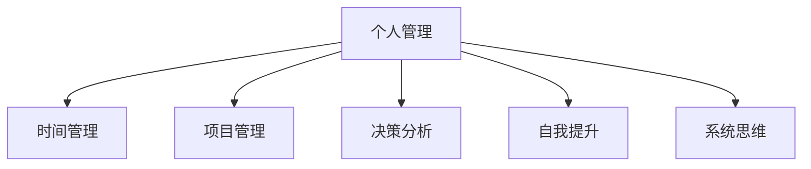

                 

# 如何建立个人的管理体系

> 关键词：个人管理, 时间管理, 项目管理, 决策分析, 自我提升, 系统思维

## 1. 背景介绍

### 1.1 问题由来
在当今快节奏的生活和工作中，个人时间管理、任务安排、目标实现等方面的问题日益凸显。人们常常感到时间不够用，工作效率低下，难以在短时间内达成既定目标。这些问题不仅仅影响到个人的生活质量和工作成果，更关系到整个组织的绩效和竞争力。因此，建立一套科学有效的个人管理体系显得尤为重要。

### 1.2 问题核心关键点
建立一个科学有效的个人管理体系，核心在于以下几个关键点：

- **目标设定**：明确具体的目标，并对其进行分解和优先级排序。
- **时间管理**：合理安排时间，提高时间利用效率。
- **任务分配**：合理分配任务，确保每个任务都有明确的责任人。
- **决策分析**：在面对复杂情况时，能够进行有效的决策分析。
- **自我提升**：持续学习和自我提升，保持竞争力和适应力。

### 1.3 问题研究意义
一个良好的个人管理体系，可以帮助个人更高效地完成任务，提升工作效率和生活质量。同时，对于组织的战略规划和运营管理，也有着重要的参考价值。通过系统的个人管理，可以更好地应对各种变化和挑战，提高整个组织的综合竞争力。

## 2. 核心概念与联系

### 2.1 核心概念概述

为更好地理解个人管理体系的建立，本节将介绍几个密切相关的核心概念：

- **个人管理（Personal Management）**：指通过系统化的方法，对个人的时间、任务、目标、资源等进行有效管理和优化，提升个人的工作和生活效率。

- **时间管理（Time Management）**：指通过合理安排和利用时间，提高个人或组织的效率和产出。

- **项目管理（Project Management）**：指通过科学的项目规划、执行、监控和收尾流程，确保项目目标的达成。

- **决策分析（Decision Analysis）**：指通过数据驱动的方法，对复杂的决策问题进行系统分析和评估，选择最优解决方案。

- **自我提升（Self-Improvement）**：指通过持续学习和自我反思，不断提升自己的知识、技能和素质。

- **系统思维（Systems Thinking）**：指从整体视角出发，考虑各部分之间的相互作用和影响，进行全面系统的思考和分析。

这些核心概念之间的逻辑关系可以通过以下Mermaid流程图来展示：



这个流程图展示了个体管理体系的几个关键组成部分及其之间的关系：

1. 个人管理作为核心，通过时间管理、项目管理、决策分析和自我提升等方法，实现系统思维的全面应用。
2. 时间管理和项目管理是个人管理的两个重要工具，用于有效分配和利用时间，确保项目目标的达成。
3. 决策分析是面对复杂问题时的核心方法，通过数据驱动的分析和评估，选择最优方案。
4. 自我提升是个人管理的动力来源，通过持续学习和提升，保持竞争力和适应力。
5. 系统思维是个人管理的指导原则，通过全面系统的视角，优化个人和组织的管理过程。

## 3. 核心算法原理 & 具体操作步骤

### 3.1 算法原理概述

一个科学有效的个人管理体系，其核心算法原理在于：通过系统化的流程和方法，对个人的时间、任务、目标等进行全面管理和优化，确保达成高效的个人和组织目标。

### 3.2 算法步骤详解

个人管理体系的建立，一般包括以下几个关键步骤：

**Step 1: 目标设定**

1. **明确目标**：设定具体、可衡量、可实现、相关性强、时限明确的目标。
2. **分解目标**：将大目标分解为可执行的小目标，确保每个小目标都有明确的行动步骤。
3. **优先级排序**：根据目标的重要性和紧急程度，对小目标进行排序，优先完成高优先级任务。

**Step 2: 时间管理**

1. **时间记录**：记录每天的时间分配情况，了解时间的实际利用情况。
2. **时间分析**：分析时间记录数据，找出时间浪费的原因和改进空间。
3. **时间规划**：根据目标和任务优先级，制定详细的时间规划，确保时间高效利用。

**Step 3: 任务分配**

1. **任务分解**：将大任务分解为可执行的小任务，确保每个小任务都有明确的责任人。
2. **任务优先级**：根据任务的重要性和紧急程度，对小任务进行排序，优先完成高优先级任务。
3. **任务监控**：定期检查任务进展情况，确保任务按时完成。

**Step 4: 决策分析**

1. **数据收集**：收集与决策相关的数据和信息，确保决策依据充分。
2. **数据分析**：使用统计学、机器学习等方法，对数据进行分析和评估，找出最优方案。
3. **决策执行**：根据决策结果，制定详细执行计划，确保决策得到有效实施。

**Step 5: 自我提升**

1. **知识学习**：通过阅读书籍、参加培训、在线课程等方式，持续学习新知识和技能。
2. **技能提升**：通过实践和反馈，不断提升自身技能，优化工作方法。
3. **反思总结**：定期进行自我反思，总结经验和教训，不断优化个人管理体系。

### 3.3 算法优缺点

个人管理体系的建立，具有以下优点：

1. **系统性**：通过系统化的流程和方法，确保个人管理的全面性和科学性。
2. **效率高**：通过明确的目标和优先级排序，提高时间利用效率和工作产出。
3. **灵活性**：系统思维和数据分析方法，使管理体系能够适应各种变化和挑战。

同时，该方法也存在一定的局限性：

1. **复杂度高**：建立和维护个人管理体系，需要花费一定的时间和精力。
2. **依赖个人执行**：管理体系的效果，高度依赖于个人的执行力和自我管理能力。
3. **灵活性不足**：对于高度变化和不确定性的环境，管理体系的灵活性可能有限。

尽管存在这些局限性，但就目前而言，科学有效的个人管理体系仍是提升个人和组织绩效的重要手段。未来相关研究的重点在于如何进一步降低管理复杂度，提高灵活性和可操作性，同时兼顾系统性和可执行性等因素。

### 3.4 算法应用领域

个人管理体系的应用，不仅局限于个人工作和生活管理，还广泛应用于各种组织管理场景中，例如：

- **项目管理**：在项目管理过程中，通过设定具体目标、时间规划和任务分配，确保项目按时完成。
- **团队协作**：在团队协作中，通过明确目标和任务优先级，协调团队成员的工作，提高团队效率。
- **战略规划**：在组织战略规划中，通过系统思维和数据分析，制定科学合理的战略目标和执行方案。
- **企业运营**：在企业运营中，通过全面管理和优化，提升企业的运营效率和竞争力。

除了上述这些经典应用外，个人管理体系还被创新性地应用到更多场景中，如智能决策支持系统、自动化任务调度系统等，为个人和组织管理提供了新的技术手段。随着个人管理体系和相关方法的不断进步，相信其在更多领域的应用前景将更加广阔。

## 4. 数学模型和公式 & 详细讲解  
### 4.1 数学模型构建

个人管理体系的建立，可以通过以下几个数学模型进行建模：

1. **目标管理模型**：通过设定具体、可衡量的目标，并进行分解和优先级排序。
2. **时间管理模型**：通过记录和分析时间使用情况，制定详细的时间规划。
3. **任务管理模型**：通过分解任务、分配责任人和优先级排序，确保任务按时完成。
4. **决策分析模型**：通过数据收集、分析和评估，选择最优决策方案。
5. **自我提升模型**：通过学习、实践和反思总结，持续提升个人能力。

### 4.2 公式推导过程

以下以目标管理模型为例，进行详细公式推导。

假设目标总数为 $N$，目标分解为 $M$ 个小目标，每个小目标的优先级为 $P_i$，完成所需时间为 $T_i$，当前已完成的小目标数为 $C$，剩余未完成的小目标数为 $R$。则目标管理模型的优化目标为：

$$
\max_{C} \sum_{i=1}^M P_i \cdot (C_i-T_i) \quad \text{subject to} \quad \sum_{i=1}^M C_i \leq N \quad \text{and} \quad 0 \leq C_i \leq T_i
$$

其中，$C_i$ 表示小目标 $i$ 的完成情况，$T_i$ 表示小目标 $i$ 所需时间。目标优化目标是最大化已完成目标的优先级乘以剩余时间。

通过对上述优化问题的求解，可以找到最优的目标分配方案，确保有限时间资源的高效利用。

### 4.3 案例分析与讲解

以下是一个简单的案例分析，展示如何通过目标管理模型进行目标优化。

假设有一个项目管理团队，总共有 10 个目标需要完成，每个目标的优先级和所需时间如下表所示：

| 目标编号 | 优先级 | 所需时间 |
|---|---|---|
| 1 | 高 | 3 |
| 2 | 中 | 4 |
| 3 | 中 | 2 |
| 4 | 低 | 1 |
| 5 | 低 | 5 |
| 6 | 低 | 3 |
| 7 | 中 | 4 |
| 8 | 高 | 2 |
| 9 | 低 | 6 |
| 10 | 高 | 7 |

设每个目标实际完成情况为 $C_i=1$ 或 $C_i=0$，则目标管理模型的优化问题可以表示为：

$$
\max_{C} 3(C_1-C_3)+4(C_2-C_4)+2(C_8-C_7)+1(C_4-C_5)+3(C_6-C_9)+5(C_5-C_{10})
$$

通过求解该优化问题，可以找到最优的目标分配方案，确保有限时间资源的高效利用。

## 5. 项目实践：代码实例和详细解释说明

### 5.1 开发环境搭建

在进行个人管理体系的开发实践前，我们需要准备好开发环境。以下是使用Python进行开发的环境配置流程：

1. 安装Anaconda：从官网下载并安装Anaconda，用于创建独立的Python环境。

2. 创建并激活虚拟环境：
```bash
conda create -n management-env python=3.8 
conda activate management-env
```

3. 安装Python的科学计算库：
```bash
pip install numpy scipy pandas matplotlib seaborn statsmodels
```

4. 安装Python的绘图库：
```bash
pip install matplotlib seaborn
```

5. 安装Python的在线学习资源：
```bash
pip install requests
```

完成上述步骤后，即可在`management-env`环境中开始开发实践。

### 5.2 源代码详细实现

下面我们以目标管理模型的开发为例，给出使用Python进行目标管理系统的代码实现。

首先，定义目标管理模型的数学模型：

```python
import numpy as np
from scipy.optimize import linprog

# 定义目标管理模型的参数
n_targets = 10
priorities = [3, 4, 2, 1, 5, 3, 4, 2, 6, 7]
times = [3, 4, 2, 1, 5, 3, 4, 2, 6, 7]
completed_targets = np.zeros(n_targets, dtype=int)

# 定义目标管理模型的优化目标
def objective_function(c):
    return sum(p * (c - t) for p, t in zip(priorities, times))

# 定义目标管理模型的约束条件
def constraint_1(c):
    return sum(c) - n_targets

def constraint_2(c):
    return c - times

# 求解目标管理模型的优化问题
result = linprog(c, A_ub=np.eye(n_targets), b_ub=n_targets, method='simplex')
completed_targets = result.x
completed_times = result.x * times
```

然后，进行目标管理模型的可视化展示：

```python
import matplotlib.pyplot as plt

# 绘制目标完成情况图
plt.bar(range(n_targets), completed_targets, color='b')
plt.xlabel('目标编号')
plt.ylabel('完成情况')
plt.title('目标完成情况')
plt.show()

# 绘制剩余时间图
remaining_times = times - completed_times
plt.bar(range(n_targets), remaining_times, color='r')
plt.xlabel('目标编号')
plt.ylabel('剩余时间')
plt.title('剩余时间')
plt.show()
```

最后，进行目标管理模型的结果分析：

```python
# 输出最优的目标分配方案
print("最优目标分配方案：")
for i, c in enumerate(completed_targets):
    if c == 1:
        print(f"目标 {i+1} 已完成")
    else:
        print(f"目标 {i+1} 未完成")

# 输出剩余时间
print("\n剩余时间：")
for i, t in enumerate(times):
    if completed_targets[i] == 1:
        print(f"目标 {i+1} 剩余时间：{t}")
```

以上就是使用Python对目标管理模型进行开发和分析的完整代码实现。可以看到，通过科学计算和可视化工具，目标管理模型可以有效地进行优化和展示。

### 5.3 代码解读与分析

让我们再详细解读一下关键代码的实现细节：

**目标管理模型的数学建模**：
- `objective_function`函数：计算目标管理模型的优化目标，即所有未完成目标的优先级乘以剩余时间之和。
- `constraint_1`函数：约束条件1，即所有目标的完成数量不能超过总目标数。
- `constraint_2`函数：约束条件2，即目标的完成时间不能超过所需时间。
- `linprog`函数：使用线性规划求解器，求解目标管理模型的优化问题。

**目标管理模型的可视化展示**：
- `bar`函数：使用柱状图展示目标的完成情况和剩余时间。
- `xlabel`和`ylabel`函数：设置x轴和y轴的标签。
- `title`函数：设置图表的标题。

**目标管理模型的结果分析**：
- 输出最优的目标分配方案，显示哪些目标已完成，哪些目标未完成。
- 输出剩余时间，显示每个目标的剩余完成时间。

可以看到，通过Python和科学计算库，目标管理模型的开发和分析变得简便高效。开发者可以根据实际需求，进一步扩展目标管理模型的功能和应用场景。

## 6. 实际应用场景

### 6.1 项目管理

个人管理体系在项目管理中的应用，可以显著提高项目管理的效率和效果。通过目标设定、时间管理和任务分配，可以确保项目按时完成，提升团队协作能力。

在技术实现上，可以使用目标管理模型进行任务优先级的排序，确保高优先级任务优先完成。同时，通过时间管理和任务监控，实时跟踪项目进展，及时调整计划和资源分配。

### 6.2 企业运营

企业运营管理中，个人管理体系的应用同样重要。通过系统化的个人和团队管理，可以确保各项业务指标的达成，提升企业的运营效率和竞争力。

在实际应用中，可以将个人管理体系与企业运营系统结合，通过数据分析和决策支持，优化资源配置和业务流程，实现全面管理。

### 6.3 智能决策支持

在复杂的决策环境中，个人管理体系可以提供数据驱动的决策支持，帮助决策者进行科学决策。通过系统思维和数据分析，找到最优的决策方案。

在技术实现上，可以将目标管理模型和决策分析模型结合，通过数据收集和分析，自动生成决策建议和方案，辅助决策者做出最优选择。

### 6.4 未来应用展望

随着个人管理体系和相关方法的不断进步，其在更多领域的应用前景将更加广阔。例如：

- **智能家庭管理**：通过智能设备和传感器，收集家庭生活数据，进行优化和自动化管理，提升家庭生活质量。
- **智能教育**：通过系统化的教学管理和学生评估，提升教学效果和学习体验，实现个性化教育。
- **智能交通**：通过智能交通管理系统，优化交通流和资源配置，提升交通效率和安全性。
- **智能医疗**：通过系统化的医疗管理和患者评估，提升医疗服务质量和效率，实现精准医疗。

未来，随着技术的不断发展，个人管理体系将更多地与智能技术结合，实现更高效、更智能的全面管理。

## 7. 工具和资源推荐
### 7.1 学习资源推荐

为了帮助开发者系统掌握个人管理体系的理论基础和实践技巧，这里推荐一些优质的学习资源：

1. **《个人时间管理》系列书籍**：涵盖个人时间管理的核心概念、方法、工具等，适合初学者和进阶者阅读。
2. **《项目管理基础》在线课程**：介绍项目管理的核心流程和方法，涵盖目标设定、时间管理、任务分配等内容。
3. **《决策分析》课程**：涵盖决策分析的核心技术和工具，通过数据驱动的方法，提升决策质量。
4. **《自我提升》系列书籍**：涵盖持续学习的核心策略和技巧，帮助个人不断提升自身素质和竞争力。
5. **《系统思维》在线课程**：介绍系统思维的核心方法和应用场景，提升全面系统思考能力。

通过对这些资源的学习实践，相信你一定能够系统掌握个人管理体系的理论和实践方法，提升个人和组织的管理效率。

### 7.2 开发工具推荐

高效的开发离不开优秀的工具支持。以下是几款用于个人管理体系开发的常用工具：

1. **Python**：常用的编程语言，具有丰富的科学计算库和可视化工具，适合进行复杂的数据分析和模型开发。
2. **Jupyter Notebook**：交互式的编程环境，适合进行科学计算和数据可视化。
3. **Tableau**：数据可视化工具，适合进行复杂数据的多维度分析和展示。
4. **Gantt Chart**：项目进度管理工具，适合进行任务管理和时间规划。
5. **Trello**：团队协作工具，适合进行任务分配和进度跟踪。

合理利用这些工具，可以显著提升个人管理体系的开发效率，加快创新迭代的步伐。

### 7.3 相关论文推荐

个人管理体系的研究始于学界的持续研究。以下是几篇奠基性的相关论文，推荐阅读：

1. **《个人时间管理与效率提升》**：介绍时间管理的基本方法和工具，帮助个人提高时间利用效率。
2. **《项目管理理论和方法》**：介绍项目管理的基本流程和方法，涵盖目标设定、时间管理、任务分配等内容。
3. **《决策分析方法》**：介绍决策分析的核心技术和方法，帮助决策者进行科学决策。
4. **《自我提升与持续学习》**：介绍持续学习的核心策略和方法，帮助个人不断提升自身素质和竞争力。
5. **《系统思维在管理中的应用》**：介绍系统思维的基本方法和应用场景，提升全面系统思考能力。

这些论文代表了个体管理体系的发展脉络。通过学习这些前沿成果，可以帮助研究者把握学科前进方向，激发更多的创新灵感。

## 8. 总结：未来发展趋势与挑战

### 8.1 总结

本文对个人管理体系的建立进行了全面系统的介绍。首先阐述了个人管理体系的研究背景和意义，明确了管理体系在提升个人和组织绩效方面的独特价值。其次，从原理到实践，详细讲解了目标设定、时间管理、任务分配、决策分析和自我提升等核心步骤，给出了个人管理体系开发的完整代码实例。同时，本文还广泛探讨了管理体系在项目管理、企业运营、智能决策等领域的应用前景，展示了管理体系的巨大潜力。此外，本文精选了管理体系的学习资源，力求为读者提供全方位的技术指引。

通过本文的系统梳理，可以看到，科学有效的个人管理体系对于提升个人和组织效率至关重要。未来的研究需要在以下几个方面寻求新的突破：

1. **自动化和智能化**：通过智能算法和工具，进一步自动化个人管理体系的建设和优化。
2. **跨领域融合**：将个人管理体系与智能技术、大数据等结合，实现更高效、更智能的全面管理。
3. **用户体验优化**：提升个人管理体系的用户体验，使其更加直观、易用，方便个人和团队使用。

总之，科学有效的个人管理体系需要在数据、算法、工具、用户等多个维度协同发力，才能真正实现全面提升个人和组织的管理效率。未来，随着技术的不断发展，个人管理体系将更多地与智能技术结合，实现更高效、更智能的全面管理。

### 8.2 未来发展趋势

展望未来，个人管理体系将呈现以下几个发展趋势：

1. **智能化**：通过智能算法和工具，进一步自动化个人管理体系的建设和优化。
2. **跨领域融合**：将个人管理体系与智能技术、大数据等结合，实现更高效、更智能的全面管理。
3. **用户体验优化**：提升个人管理体系的用户体验，使其更加直观、易用，方便个人和团队使用。

以上趋势凸显了个人管理体系的广阔前景。这些方向的探索发展，必将进一步提升个人和组织的管理效率，推动社会的全面进步。

### 8.3 面临的挑战

尽管个人管理体系已经取得了瞩目成就，但在迈向更加智能化、普适化应用的过程中，它仍面临着诸多挑战：

1. **复杂度高**：建立和维护个人管理体系，需要花费一定的时间和精力。
2. **依赖个人执行**：管理体系的效果，高度依赖于个人的执行力和自我管理能力。
3. **灵活性不足**：对于高度变化和不确定性的环境，管理体系的灵活性可能有限。

尽管存在这些挑战，但随着技术的发展和应用的深入，个人管理体系必将逐步克服这些难题，成为提升个人和组织绩效的重要手段。

### 8.4 研究展望

面对个人管理体系所面临的挑战，未来的研究需要在以下几个方面寻求新的突破：

1. **自动化和智能化**：通过智能算法和工具，进一步自动化个人管理体系的建设和优化。
2. **跨领域融合**：将个人管理体系与智能技术、大数据等结合，实现更高效、更智能的全面管理。
3. **用户体验优化**：提升个人管理体系的用户体验，使其更加直观、易用，方便个人和团队使用。

这些研究方向和创新方向，必将引领个人管理体系的不断进步，为社会的全面发展带来新的动力。

## 9. 附录：常见问题与解答

**Q1: 如何建立科学有效的个人管理体系？**

A: 建立科学有效的个人管理体系，需要遵循系统化的流程和方法，明确目标设定、时间管理、任务分配、决策分析和自我提升等核心步骤。可以通过数学建模、数据驱动等手段，实现全面优化和管理。

**Q2: 时间管理如何提升效率？**

A: 时间管理的关键在于合理安排和利用时间。可以使用时间记录和分析工具，如Gantt Chart、Trello等，进行详细的时间规划和监控，确保时间高效利用。

**Q3: 任务分配如何协调团队？**

A: 任务分配的关键在于明确责任人和优先级。可以使用项目管理工具，如Jira、Asana等，进行任务分解和分配，确保每个任务都有明确的责任人，并根据优先级排序。

**Q4: 决策分析如何科学决策？**

A: 决策分析的关键在于数据驱动的分析和评估。可以使用决策分析工具，如Tableau、Python等，进行多维数据分析，找出最优方案。

**Q5: 自我提升如何持续成长？**

A: 自我提升的关键在于持续学习和反思总结。可以定期参加培训、阅读书籍、编写技术博客等，不断提升自身素质和竞争力。

---

作者：禅与计算机程序设计艺术 / Zen and the Art of Computer Programming

