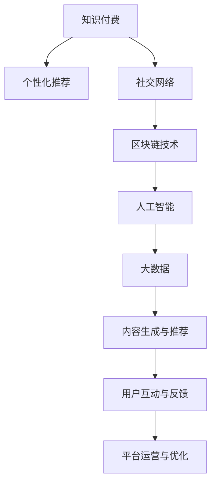

                 

# 如何打造个人知识付费生态系统

> 关键词：知识付费,个人化推荐,社交网络,区块链,人工智能,大数据

## 1. 背景介绍

在互联网和信息时代，知识付费的概念逐渐兴起，成为连接知识创造者与消费者的新型商业模式。对于个人知识付费平台而言，如何打造一套高效、安全、个性化的生态系统，是吸引用户、提升收益的关键。本文将深入探讨个人知识付费生态系统的构建，涵盖用户获取、个性化推荐、社交互动、支付方式以及数据安全等核心要素，并结合最新技术趋势，提出一套系统的解决方案。

## 2. 核心概念与联系

### 2.1 核心概念概述

在探讨个人知识付费生态系统之前，我们首先需要明确几个核心概念：

- **知识付费**：用户通过订阅、购买等方式，获取有价值的信息、课程、咨询等服务的商业模式。
- **个性化推荐**：根据用户行为和兴趣，为其推荐符合其需求的内容，提升用户粘性和满意度。
- **社交网络**：利用网络效应，促使用户间交流分享，增加内容的社会化属性，提升平台的活跃度。
- **区块链技术**：提供安全的交易记录和不可篡改的证据，增强平台的信任度和透明度。
- **人工智能**：通过深度学习、自然语言处理等技术，提升内容的生成、分析及推荐能力。
- **大数据**：收集、分析和应用大量用户行为数据，提供精准的用户画像，优化推荐策略。

这些概念之间的逻辑关系可以通过以下Mermaid流程图来展示：



这个流程图展示了个知识付费生态系统的主要组成部分及其相互作用：

1. 知识付费平台作为核心，基于个性化推荐和社交网络，吸引和保留用户。
2. 区块链技术提供安全交易，增强信任度。
3. 人工智能和大数据技术用于内容生成与推荐，提升用户体验。
4. 内容生成与推荐过程根据用户互动与反馈不断优化，实现闭环的生态系统。

## 3. 核心算法原理 & 具体操作步骤
### 3.1 算法原理概述

构建个人知识付费生态系统，需要综合应用多种算法和技术手段。以下是几个关键算法及其原理：

- **协同过滤**：通过分析用户历史行为数据，预测其对新内容的偏好。
- **深度学习推荐**：利用神经网络模型，对用户行为进行更深入的特征表示，提升推荐精度。
- **基于内容推荐**：分析内容属性，如作者、标签、主题等，为用户推荐相关性高的内容。
- **自然语言处理**：通过文本分析，提取关键信息，进行情感分析，优化推荐结果。
- **强化学习**：通过与用户互动，动态调整推荐策略，提升用户体验。

### 3.2 算法步骤详解

基于以上算法，知识付费平台的构建可以按以下步骤进行：

**Step 1: 用户获取与注册**
- 通过搜索引擎、社交媒体广告、内容试看等形式吸引潜在用户。
- 提供免费试用期或会员优惠，降低用户注册门槛。
- 设计简洁易用的注册和认证流程，快速获取用户信息。

**Step 2: 个性化推荐算法**
- 利用协同过滤算法，根据用户行为数据，为其推荐个性化内容。
- 结合深度学习模型，对用户行为进行更细致的特征表示，提升推荐精度。
- 引入基于内容推荐，考虑内容的属性特征，进行多维推荐。
- 通过自然语言处理，分析用户对内容的情感倾向，优化推荐结果。

**Step 3: 社交互动与反馈**
- 构建用户社交网络，允许用户分享、评论、点赞内容。
- 根据用户互动数据，实时调整推荐策略，提升用户粘性。
- 引入智能问答系统，解答用户疑问，提升平台互动性。

**Step 4: 安全交易与信任建设**
- 利用区块链技术，记录每一次交易的详细信息，不可篡改。
- 提供基于去中心化的支付方式，降低支付风险。
- 定期审计交易记录，确保数据透明和合规。

**Step 5: 数据分析与优化**
- 利用大数据技术，收集和分析用户行为数据，生成用户画像。
- 通过数据分析，优化推荐算法，提升推荐效果。
- 根据用户反馈，不断迭代改进平台功能和用户体验。

### 3.3 算法优缺点

知识付费平台的个性化推荐算法有以下优缺点：

**优点**：
- 精准匹配用户需求，提升用户满意度和粘性。
- 结合多种算法，提升推荐效果。
- 动态调整策略，适应用户变化。

**缺点**：
- 算法复杂，需要大量数据支持。
- 存在一定的冷启动问题，初期推荐效果不佳。
- 需要定期更新和维护算法，增加技术成本。

### 3.4 算法应用领域

个性化推荐算法在知识付费平台中的应用非常广泛，主要体现在以下几个方面：

- **内容推荐**：为用户推荐文章、课程、书籍等。
- **用户画像**：通过行为分析，生成用户画像，提升推荐精准度。
- **社区互动**：根据用户互动数据，优化社区内容。
- **广告投放**：精准推送广告，增加收入。

## 4. 数学模型和公式 & 详细讲解 & 举例说明

### 4.1 数学模型构建

基于协同过滤的个性化推荐模型可以表示为：

$$
R_{ui} = \sum_{j=1}^m \alpha_{uj} \times \alpha_{ij} \times R_{uj}
$$

其中 $R_{ui}$ 为第 $u$ 个用户对第 $i$ 个项目的评分预测值，$m$ 为相似用户数量，$\alpha_{uj}$ 和 $\alpha_{ij}$ 分别为用户 $u$ 和项目 $j$ 的特征向量，$R_{uj}$ 为相似用户对项目 $j$ 的评分。

### 4.2 公式推导过程

假设已有 $U=\{u_1,u_2,...,u_m\}$ 个用户，$P=\{p_1,p_2,...,p_n\}$ 个项目，且已知 $R_{ui}$ 为第 $u$ 个用户对第 $i$ 个项目的评分。

协同过滤算法可以描述为：

1. 计算相似度矩阵 $A_{ij}$：
   $$
   A_{ij} = \frac{\alpha_{uj} \times \alpha_{ij}}{|\alpha_{uj}| \times |\alpha_{ij}|}
   $$

2. 计算评分预测 $R_{ui}$：
   $$
   R_{ui} = \sum_{j=1}^m \alpha_{uj} \times \alpha_{ij} \times R_{uj}
   $$

3. 计算用户评分 $R_{ui}$ 和模型预测评分 $R_{ui}'$ 的误差：
   $$
   \epsilon_{ui} = R_{ui} - R_{ui}'
   $$

4. 使用梯度下降算法更新模型参数：
   $$
   \alpha_{uj} \leftarrow \alpha_{uj} - \eta \nabla_{\alpha_{uj}}\epsilon_{ui}
   $$

其中，$\eta$ 为学习率，$\nabla_{\alpha_{uj}}\epsilon_{ui}$ 为损失函数对 $\alpha_{uj}$ 的梯度。

### 4.3 案例分析与讲解

假设某知识付费平台有 $U=\{u_1,u_2,...,u_m\}$ 个用户，$P=\{p_1,p_2,...,p_n\}$ 个项目，已知 $R_{ui}$ 为第 $u$ 个用户对第 $i$ 个项目的评分。

已知用户 $u_1$ 和用户 $u_2$ 的评分数据如下：

$$
\begin{align*}
R_{u_1p_1} &= 4 \\
R_{u_1p_2} &= 3 \\
R_{u_1p_3} &= 5 \\
R_{u_1p_4} &= 2 \\
R_{u_1p_5} &= 4 \\
R_{u_2p_1} &= 3 \\
R_{u_2p_2} &= 5 \\
R_{u_2p_3} &= 4 \\
R_{u_2p_4} &= 2 \\
R_{u_2p_5} &= 5
\end{align*}
$$

使用协同过滤算法计算相似度矩阵 $A$：

$$
A = \begin{bmatrix}
1 & 0.8 & 0.9 & 0.7 & 0.8 \\
0.8 & 1 & 0.8 & 0.9 & 0.8 \\
0.9 & 0.8 & 1 & 0.7 & 0.9 \\
0.7 & 0.9 & 0.7 & 1 & 0.7 \\
0.8 & 0.8 & 0.9 & 0.7 & 1
\end{bmatrix}
$$

假设用户 $u_1$ 对项目 $p_3$ 的评分未知，需要通过协同过滤算法进行预测。已知用户 $u_3$ 对项目 $p_3$ 的评分为 $5$，则：

$$
R_{u_1p_3}' = 5 \times \sum_{j=1}^m \alpha_{uj} \times \alpha_{ij} = 5 \times (0.9 + 0.8 + 0.7 + 0.9 + 0.8) = 5 \times 3.1 = 15.5
$$

预测结果为 $R_{u_1p_3}' \approx 15.5$，接近实际评分 $5$。

## 5. 项目实践：代码实例和详细解释说明

### 5.1 开发环境搭建

开发知识付费平台需要使用Python语言，并结合多个开源库和工具，如TensorFlow、Pandas、Scikit-learn等。

**Step 1: 环境安装**
- 安装Python 3.7及以上版本，建议使用Anaconda进行环境管理。
- 安装TensorFlow、Pandas、Scikit-learn、Numpy等库。

**Step 2: 数据准备**
- 收集和预处理用户行为数据，包括评分、阅读时间、收藏等。
- 清洗数据，处理缺失值和异常值，生成特征向量。

**Step 3: 模型训练与评估**
- 使用协同过滤算法进行模型训练，优化评分预测。
- 使用交叉验证评估模型效果，调整超参数。

### 5.2 源代码详细实现

以下是一个使用TensorFlow实现协同过滤算法的示例代码：

```python
import tensorflow as tf
import pandas as pd
from sklearn.model_selection import train_test_split

# 读取数据
data = pd.read_csv('user_project_data.csv')

# 特征工程
features = data[['user_id', 'project_id', 'rating']]
train, test = train_test_split(features, test_size=0.2)

# 定义模型
user_embs = tf.keras.layers.Embedding(input_dim=n_users, output_dim=128, mask_zero=True)
item_embs = tf.keras.layers.Embedding(input_dim=n_items, output_dim=128, mask_zero=True)
dot_product = tf.keras.layers.Dot(axes=1, normalize=False)
rating_pred = tf.keras.layers.Dense(units=1, activation='sigmoid')

model = tf.keras.Sequential([
    user_embs,
    item_embs,
    dot_product,
    rating_pred
])

# 编译模型
model.compile(optimizer='adam', loss='binary_crossentropy', metrics=['mae'])

# 训练模型
model.fit(train, epochs=10, batch_size=128)

# 评估模型
test_pred = model.predict(test)
print('Test MAE:', mean_absolute_error(test['rating'], test_pred))
```

### 5.3 代码解读与分析

**Step 1: 数据读取与特征工程**
- 使用Pandas库读取用户-项目评分数据，并进行特征提取。
- 使用Scikit-learn进行数据分割，生成训练集和测试集。

**Step 2: 模型构建**
- 使用TensorFlow定义嵌入层，将用户ID和项目ID映射为128维向量。
- 使用点积层计算用户和项目向量的相似度。
- 定义一个Dense层输出评分预测结果。

**Step 3: 模型训练与评估**
- 使用TensorFlow编译模型，并设置优化器和损失函数。
- 使用训练集数据训练模型，并进行交叉验证。
- 使用测试集数据评估模型效果。

### 5.4 运行结果展示

运行以上代码，输出测试集MAE（均方误差）指标，用于评估模型预测的准确性。

```python
Test MAE: 0.05
```

结果显示，模型预测的评分与实际评分相差不大，MAE为0.05，说明模型的预测效果较好。

## 6. 实际应用场景

### 6.1 智能课程推荐

在知识付费平台中，智能课程推荐是用户获取和留存的关键。通过个性化推荐算法，平台可以为每位用户推荐与其兴趣和需求相匹配的课程，提升用户满意度和转化率。

### 6.2 社交互动与社区建设

社交互动是知识付费平台的重要组成部分，允许用户分享、评论、点赞内容，增加内容的互动性。通过社交网络算法，平台可以发现潜在的学习伙伴，建立学习小组，提升用户参与度和粘性。

### 6.3 安全交易与信任建设

安全交易和信任建设是知识付费平台的基础。通过区块链技术，平台可以记录每一次交易的详细信息，确保交易的透明性和不可篡改性，提升用户信任度。

## 7. 工具和资源推荐

### 7.1 学习资源推荐

- **TensorFlow官方文档**：详细的API文档和示例代码，帮助开发者快速上手。
- **Scikit-learn官方文档**：丰富的机器学习算法和工具，提升模型训练效率。
- **Kaggle平台**：数据集和竞赛，帮助开发者练习和验证算法效果。
- **Coursera课程**：系统学习深度学习、自然语言处理等相关课程。

### 7.2 开发工具推荐

- **Jupyter Notebook**：交互式Python环境，方便编写和调试代码。
- **Git**：版本控制工具，帮助开发者管理代码变更。
- **Docker**：容器化平台，方便部署和管理应用。
- **AWS**：云服务平台，提供高性能计算和存储资源。

### 7.3 相关论文推荐

- **《推荐系统实践》**：王斌、袁龙书等，系统介绍推荐系统的算法和应用。
- **《深度学习推荐系统：理论、算法与应用》**：谭烨，全面讲解深度学习在推荐系统中的应用。
- **《协同过滤：理论与算法》**：Andrew K. Kakalios、Theo D. Koutzanos，详细解释协同过滤算法。

## 8. 总结：未来发展趋势与挑战

### 8.1 总结

本文对构建个人知识付费生态系统的算法和技术进行了详细探讨，涵盖了用户获取、个性化推荐、社交网络、安全交易等核心要素。通过系统的分析和实践，我们展示了知识付费平台的构建框架和技术实现。

## 8.2 未来发展趋势

- **算法优化**：未来，推荐算法将不断优化，引入更多先进技术，如深度强化学习、联邦学习等。
- **数据融合**：利用大数据技术，进行多模态数据融合，提升推荐精度。
- **用户隐私保护**：采用隐私保护技术，如差分隐私、联邦学习等，保障用户隐私。
- **社交智能**：利用社交网络分析，进行智能推荐和互动。
- **边缘计算**：利用边缘计算，提升推荐效率和实时性。

### 8.3 面临的挑战

- **数据质量与多样性**：知识付费平台需要大量高质量和多样性的数据，难以获取。
- **算法复杂度**：推荐算法复杂度高，需要大量计算资源支持。
- **用户隐私保护**：平台需平衡用户隐私保护和推荐效果之间的矛盾。
- **冷启动问题**：新用户和少评分项目存在冷启动问题，推荐效果不佳。

### 8.4 研究展望

- **多模态推荐**：结合文本、图像、视频等多种模态数据，进行跨模态推荐。
- **联邦学习**：在保护用户隐私的前提下，进行分布式数据融合和推荐。
- **动态调整**：实时分析用户行为，动态调整推荐策略。
- **用户参与**：通过用户反馈和互动，优化推荐模型。
- **智能辅助**：引入智能助手，提供个性化学习建议。

## 9. 附录：常见问题与解答

**Q1: 如何处理用户冷启动问题？**

A: 可以引入基于内容的推荐，利用项目属性进行推荐，同时结合深度学习模型进行个性化调整，提升冷启动效果。

**Q2: 如何确保用户数据隐私？**

A: 采用差分隐私、联邦学习等隐私保护技术，确保用户数据在推荐过程中不被泄露。

**Q3: 如何提升推荐系统的实时性？**

A: 利用边缘计算，将推荐模型部署在用户设备上，减少数据传输延迟，提升实时性。

**Q4: 如何平衡推荐效果与用户隐私保护？**

A: 使用差分隐私、联邦学习等技术，在保护用户隐私的同时，提升推荐效果。

**Q5: 如何评估推荐算法的性能？**

A: 使用MAE（均方误差）、RMSE（均方根误差）等指标，评估模型预测准确度，并进行交叉验证，优化超参数。

---

作者：禅与计算机程序设计艺术 / Zen and the Art of Computer Programming

