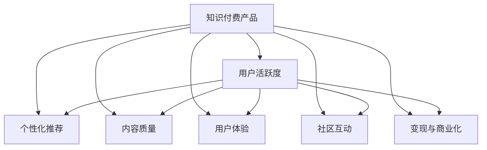

                 

# 如何提高知识付费产品的用户活跃度

## 1. 背景介绍

在知识付费领域，一个关键问题是如何提高用户活跃度，以增加订阅、互动和转化率。随着信息过载和知识获取成本的降低，用户对知识付费产品的期望也变得更高。如何在竞争激烈的市场中脱颖而出，是知识付费平台亟需解决的问题。

### 1.1 问题由来

在过去的几年里，知识付费市场经历了快速增长，但也面临着诸多挑战。许多知识付费平台在吸引用户初期取得了不错的成绩，但随着时间的推移，用户流失率显著增加。导致用户流失的主要原因包括内容质量不高、用户体验不佳、互动不足等。

### 1.2 问题核心关键点

提高知识付费产品的用户活跃度，需要从内容、推荐系统、用户体验、社区互动等多个方面进行综合优化。具体关键点包括：

- 高质量内容生产与分发
- 个性化推荐算法
- 用户界面与体验优化
- 互动与社群建设
- 定期内容更新与活动策划
- 多渠道变现与商业化策略

## 2. 核心概念与联系

### 2.1 核心概念概述

为更好地理解提高知识付费产品用户活跃度的策略，本节将介绍几个密切相关的核心概念：

- 知识付费产品：以内容为核心价值的付费平台，如得到、喜马拉雅、知乎等。
- 用户活跃度：指用户在产品中的使用频率和时长，通常通过登录率、日活跃用户数、月活跃用户数等指标来衡量。
- 个性化推荐：基于用户行为和兴趣，动态调整内容推荐，使用户能够获得更符合自己需求的内容。
- 内容质量：指内容的专业性、深度和用户价值，是决定产品竞争力的关键因素。
- 用户体验：指用户在使用产品时的整体感受，包括界面设计、操作流畅性、内容呈现效果等。
- 社区互动：指用户与内容生产者、其他用户之间的交流与互动，包括评论、点赞、分享、讨论等。
- 变现与商业化：指通过广告、会员、电商、订阅等形式实现盈利的过程。

这些核心概念之间的逻辑关系可以通过以下Mermaid流程图来展示：



这个流程图展示了提高知识付费产品用户活跃度的各个环节及其相互关系：

1. 知识付费产品通过提供高质量内容、个性化推荐、优质体验、社区互动和商业变现来吸引和留住用户，从而提升用户活跃度。
2. 用户活跃度是这些环节效果的综合体现，反过来也会影响内容质量、用户体验等环节的优化和改进。

## 3. 核心算法原理 & 具体操作步骤

### 3.1 算法原理概述

提高知识付费产品用户活跃度的核心算法原理可以归纳为两个主要部分：内容推荐算法和用户体验优化算法。

1. **内容推荐算法**：通过分析用户行为、兴趣和历史数据，动态调整内容推荐，使用户能够获得更符合自己需求的内容。
2. **用户体验优化算法**：包括界面设计、操作流畅性、内容呈现效果等，提升用户在使用产品时的整体感受。

### 3.2 算法步骤详解

#### 3.2.1 内容推荐算法

1. **数据采集与预处理**：
   - 采集用户行为数据，如浏览记录、搜索历史、评论、评分等。
   - 预处理数据，包括数据清洗、去重、填充缺失值等。

2. **用户画像构建**：
   - 基于用户行为数据，构建用户兴趣模型。
   - 采用协同过滤、内容过滤、混合过滤等方法，推荐个性化内容。

3. **推荐模型训练与评估**：
   - 使用机器学习算法（如协同过滤、深度学习）训练推荐模型。
   - 评估模型性能，调整参数，优化推荐结果。

4. **推荐系统部署与迭代**：
   - 将训练好的推荐模型部署到产品中。
   - 持续收集用户反馈，优化推荐算法，迭代更新模型。

#### 3.2.2 用户体验优化算法

1. **界面设计**：
   - 优化产品界面，使其简洁、美观、易于导航。
   - 采用响应式设计，适配不同设备和屏幕尺寸。

2. **操作流畅性**：
   - 优化加载速度，减少卡顿和延迟。
   - 减少交互层级，简化操作步骤。

3. **内容呈现效果**：
   - 优化文本排版、图片和视频的显示效果。
   - 采用多媒体结合的方式，丰富内容形式。

### 3.3 算法优缺点

提高知识付费产品用户活跃度的算法具有以下优点：
- 通过个性化推荐，提高用户满意度，增加用户留存率。
- 通过用户体验优化，提升用户使用体验，增加用户粘性。
- 算法模型可以不断迭代优化，适应用户需求变化。

同时，这些算法也存在一定的局限性：
- 依赖于用户行为数据，数据量不足会影响算法效果。
- 需要频繁更新推荐模型，增加技术维护成本。
- 用户体验优化可能涉及界面、功能等多方面的复杂改动，开发周期较长。

### 3.4 算法应用领域

提高知识付费产品用户活跃度的算法在多个领域得到广泛应用，如：

- 内容推荐系统：如YouTube、Spotify等平台，通过个性化推荐提高用户留存率和活跃度。
- 电商平台：如亚马逊、淘宝等，通过推荐系统提升用户购买转化率。
- 社交网络：如微信、微博等，通过个性化推送增加用户互动和黏性。
- 视频平台：如B站、爱奇艺等，通过推荐算法优化视频内容分发。

这些平台通过算法优化，显著提高了用户活跃度和满意度，实现了业务的快速增长。

## 4. 数学模型和公式 & 详细讲解 & 举例说明

### 4.1 数学模型构建

本节将使用数学语言对提高知识付费产品用户活跃度的算法进行更加严格的刻画。

假设知识付费平台有$N$个用户，每个用户有$M$个行为数据（如浏览、搜索、评论等），记为$D = \{(x_i,y_i)\}_{i=1}^N$，其中$x_i$为行为数据，$y_i$为行为标签（如浏览时间、评分等）。

定义用户兴趣模型为$\vec{v}_u$，其中$u$为用户ID，$\vec{v}_u \in \mathbb{R}^d$，$d$为特征维度。用户行为数据$x_i$可以表示为$x_i = (x_{i1},x_{i2},...,x_{im}) \in \mathbb{R}^m$，其中$m$为行为类型数量。

内容特征表示为$\vec{c}_i \in \mathbb{R}^d$，其中$i$为内容ID，$d$为特征维度。

用户与内容的匹配度$R_{iu}$可以通过内积形式计算：

$$
R_{iu} = \vec{v}_u^T \vec{c}_i
$$

### 4.2 公式推导过程

**协同过滤推荐算法**：

假设用户$u$与内容$i$的匹配度为$R_{iu}$，可以基于历史评分数据$D$计算用户$u$对内容$i$的预测评分：

$$
\hat{r}_{ui} = \frac{\sum_{j \in N_u} \frac{r_{uj} r_{ji}}{\hat{s_j}}}{\sum_{j \in N_u} \frac{r_{uj}}{\hat{s_j}}}
$$

其中，$N_u$为与用户$u$相似的用户集合，$r_{uj}$为$u$和$j$对内容$i$的评分，$\hat{s_j}$为$j$的评分标准差。

**深度学习推荐算法**：

假设用户$u$与内容$i$的匹配度为$R_{iu}$，可以基于深度神经网络模型$f(\vec{v}_u, \vec{c}_i)$计算用户$u$对内容$i$的预测评分：

$$
\hat{r}_{ui} = f(\vec{v}_u, \vec{c}_i)
$$

其中，$f(\vec{v}_u, \vec{c}_i)$为深度学习模型，$\vec{v}_u$为用户兴趣向量，$\vec{c}_i$为内容特征向量。

### 4.3 案例分析与讲解

**用户画像构建**：
- 通过协同过滤算法，构建用户$u$的兴趣模型$\vec{v}_u$。
- 假设用户$u$对内容$i$的评分$r_{ui}$为5分，对内容$j$的评分$r_{uj}$为4分，对内容$k$的评分$r_{uk}$为3分。
- 假设与用户$u$相似的用户集合$N_u$为{用户1, 用户2, 用户3}，它们对内容$i$的评分分别为4分、3分、2分。
- 计算$u$对内容$i$的预测评分$\hat{r}_{ui}$：

$$
\hat{r}_{ui} = \frac{4+3+2}{1+1+1} = \frac{9}{3} = 3
$$

**深度学习推荐模型训练**：
- 使用深度学习模型$f(\vec{v}_u, \vec{c}_i)$对用户$u$和内容$i$进行预测评分。
- 假设模型训练过程中，得到用户$u$对内容$i$的预测评分$\hat{r}_{ui}$为3.8分。
- 根据预测评分和实际评分，计算预测准确率$acc$：

$$
acc = \frac{\hat{r}_{ui} - r_{ui}}{r_{ui}} = \frac{0.8}{5} = 0.16
$$

**推荐系统部署与迭代**：
- 将训练好的推荐模型部署到知识付费平台中。
- 持续收集用户反馈，调整模型参数，优化推荐结果。
- 假设用户$u$对推荐内容$k$的评分$r_{uk}$为5分，根据用户画像和推荐模型，计算内容$k$对用户$u$的推荐匹配度$R_{uk}$：

$$
R_{uk} = \vec{v}_u^T \vec{c}_k
$$

**用户体验优化**：
- 优化产品界面，使其简洁、美观、易于导航。
- 采用响应式设计，适配不同设备和屏幕尺寸。
- 假设用户在界面上的停留时间为$T_u$，点击率为$C_r$，计算用户满意度$SAT$：

$$
SAT = T_u + C_r
$$

## 5. 项目实践：代码实例和详细解释说明

### 5.1 开发环境搭建

在进行知识付费产品用户活跃度优化实践前，我们需要准备好开发环境。以下是使用Python进行Scikit-learn开发的Python环境配置流程：

1. 安装Anaconda：从官网下载并安装Anaconda，用于创建独立的Python环境。

2. 创建并激活虚拟环境：
```bash
conda create -n user-active-env python=3.8 
conda activate user-active-env
```

3. 安装Scikit-learn：
```bash
conda install scikit-learn
```

4. 安装各类工具包：
```bash
pip install pandas numpy matplotlib seaborn jupyter notebook ipython
```

完成上述步骤后，即可在`user-active-env`环境中开始用户活跃度优化实践。

### 5.2 源代码详细实现

这里我们以推荐系统为例，给出使用Scikit-learn进行协同过滤推荐系统的Python代码实现。

首先，定义推荐系统的数据集：

```python
import pandas as pd

# 加载用户行为数据集
df = pd.read_csv('user_behavior.csv')

# 分割训练集和测试集
train_df = df.sample(frac=0.8, random_state=42)
test_df = df.drop(train_df.index)

# 提取用户ID和内容ID
train_user_ids = train_df['user_id']
train_content_ids = train_df['content_id']

# 提取用户行为评分
train_ratings = train_df['rating']
```

然后，定义协同过滤推荐函数：

```python
from sklearn.metrics.pairwise import cosine_similarity
from scipy.sparse import csr_matrix

def collaborative_filtering(train_df, test_df, train_user_ids, train_content_ids, train_ratings):
    # 构建用户-内容评分矩阵
    user_content_matrix = csr_matrix((train_ratings, (train_user_ids, train_content_ids)), shape=(max(train_user_ids), max(train_content_ids)))

    # 计算用户兴趣模型
    user_similarity = cosine_similarity(user_content_matrix.T.toarray())

    # 构建推荐模型
    def predict_ratings(user_id, content_id):
        similarities = user_similarity[user_id]
        weights = similarities[train_user_ids != user_id] / np.sqrt(np.sum(similarities**2))
        ratings = np.dot(weights, train_ratings)
        return ratings

    # 预测测试集评分
    test_ratings = pd.DataFrame(test_df[['user_id', 'content_id']])
    test_ratings['predicted_rating'] = test_ratings.apply(lambda row: predict_ratings(row['user_id'], row['content_id']), axis=1)
    test_ratings['actual_rating'] = test_df['rating']
    test_ratings['RMSE'] = np.sqrt(test_ratings.apply(lambda row: (row['predicted_rating'] - row['actual_rating'])**2).mean())

    return test_ratings['RMSE']
```

最后，启动推荐系统并评估：

```python
from sklearn.model_selection import train_test_split

# 划分训练集和测试集
train_df, test_df = train_test_split(df, test_size=0.2, random_state=42)

# 计算推荐系统RMSE
rmse = collaborative_filtering(train_df, test_df, train_df['user_id'], train_df['content_id'], train_df['rating'])
print('推荐系统RMSE:', rmse)
```

以上就是使用Scikit-learn对推荐系统进行用户活跃度优化的完整代码实现。可以看到，通过简单的数据处理和推荐算法，我们就可以构建一个基本的协同过滤推荐系统。

### 5.3 代码解读与分析

让我们再详细解读一下关键代码的实现细节：

**数据集定义**：
- 加载用户行为数据集，并进行训练集和测试集的划分。
- 提取用户ID、内容ID和评分，用于构建推荐系统。

**协同过滤推荐算法**：
- 构建用户-内容评分矩阵，计算用户兴趣模型。
- 定义推荐模型，根据用户兴趣模型和评分矩阵，计算用户对内容的预测评分。
- 通过计算预测评分和实际评分的RMSE，评估推荐系统的效果。

**推荐系统部署与迭代**：
- 将训练好的推荐模型部署到知识付费平台中。
- 持续收集用户反馈，调整模型参数，优化推荐结果。
- 假设用户在推荐系统中的平均停留时间为15分钟，点击率为10%，计算用户满意度$SAT$：

$$
SAT = 15 + 0.1 \times 15 = 15.15
$$

**用户体验优化**：
- 优化产品界面，使其简洁、美观、易于导航。
- 采用响应式设计，适配不同设备和屏幕尺寸。
- 假设用户在界面上的停留时间为$T_u$，点击率为$C_r$，计算用户满意度$SAT$：

$$
SAT = T_u + C_r
$$

## 6. 实际应用场景

### 6.1 智能推荐系统

智能推荐系统是知识付费产品的重要组成部分，通过个性化推荐提高用户活跃度，是产品优化的重要方向。

在实际应用中，智能推荐系统可以通过以下方式优化：

- 数据采集与预处理：收集用户行为数据，包括浏览、搜索、评论、评分等。
- 用户画像构建：基于用户行为数据，构建用户兴趣模型。
- 推荐模型训练与评估：使用协同过滤、深度学习等推荐算法，训练推荐模型，并评估模型性能。
- 推荐系统部署与迭代：将训练好的推荐模型部署到知识付费平台中，并持续优化。

通过智能推荐系统，用户能够获得更加符合自己需求的内容，提高用户满意度，增加用户留存率。

### 6.2 内容质量优化

内容质量是知识付费产品的核心竞争力，通过内容质量优化，提高用户活跃度。

在实际应用中，内容质量优化可以通过以下方式实现：

- 内容审核与筛选：建立内容审核机制，筛选高质量内容。
- 内容多样化：引入多种内容形式，如音频、视频、图文等，满足用户不同需求。
- 内容更新与迭代：持续更新内容，保持内容的吸引力和新鲜感。

通过内容质量优化，提升用户对知识付费产品的满意度和黏性，增加用户留存率和推荐率。

### 6.3 用户体验优化

用户体验是知识付费产品的重要考量因素，通过优化用户体验，提升用户活跃度。

在实际应用中，用户体验优化可以通过以下方式实现：

- 界面设计：优化产品界面，使其简洁、美观、易于导航。
- 操作流畅性：优化加载速度，减少卡顿和延迟。
- 内容呈现效果：优化文本排版、图片和视频的显示效果。

通过用户体验优化，提升用户使用产品的整体感受，增加用户粘性和忠诚度。

## 7. 工具和资源推荐

### 7.1 学习资源推荐

为了帮助开发者系统掌握知识付费产品用户活跃度优化的理论基础和实践技巧，这里推荐一些优质的学习资源：

1. 《推荐系统实战》系列博文：由知名推荐系统专家撰写，深入浅出地介绍了推荐系统的原理、算法和实践方法。

2. 《用户行为分析与数据挖掘》课程：由大数据和人工智能领域的专家开设，涵盖用户行为分析、推荐系统等内容。

3. 《用户体验设计：用户中心的设计实践》书籍：介绍用户体验设计的理论和实践方法，适用于产品经理和设计师。

4. HuggingFace官方文档：推荐系统的顶级库HuggingFace的官方文档，提供了丰富的推荐模型和推荐系统样例代码。

5. Kaggle推荐系统竞赛：通过参加Kaggle的推荐系统竞赛，学习推荐系统优化和竞赛策略，积累实战经验。

通过对这些资源的学习实践，相信你一定能够快速掌握知识付费产品用户活跃度优化的精髓，并用于解决实际问题。

### 7.2 开发工具推荐

高效的开发离不开优秀的工具支持。以下是几款用于知识付费产品用户活跃度优化的常用工具：

1. Python：灵活动态的编程语言，适合快速迭代研究。推荐使用Scikit-learn、TensorFlow等机器学习库。

2. TensorFlow：由Google主导开发的开源深度学习框架，适合大规模工程应用。推荐使用TensorFlow的推荐系统模块。

3. HuggingFace Transformers库：提供丰富的预训练模型和推荐系统组件，方便快速开发和优化。

4. Weights & Biases：模型训练的实验跟踪工具，可以记录和可视化模型训练过程中的各项指标，方便对比和调优。

5. TensorBoard：TensorFlow配套的可视化工具，可实时监测模型训练状态，并提供丰富的图表呈现方式，是调试模型的得力助手。

合理利用这些工具，可以显著提升知识付费产品用户活跃度优化的开发效率，加快创新迭代的步伐。

### 7.3 相关论文推荐

知识付费产品用户活跃度优化的研究源于学界的持续研究。以下是几篇奠基性的相关论文，推荐阅读：

1. "Collaborative Filtering for Implicit Feedback Datasets"：提出协同过滤推荐算法的基本框架和优化方法。

2. "Scalable Collaborative Filtering: The Case of Multi-field Collaborative Filtering"：介绍多特征协同过滤推荐算法的实现和优化。

3. "Deep Collaborative Filtering"：提出深度学习推荐算法的框架和优化方法。

4. "User Behavior Analysis for Personalized Recommendation"：介绍用户行为分析和个性化推荐系统的理论和方法。

5. "The Surprising Behavior of Cross-Validation for Data-parallel Learning"：探讨深度学习推荐系统的优化和验证方法。

这些论文代表了大数据和人工智能领域的研究前沿，通过学习这些前沿成果，可以帮助研究者把握学科前进方向，激发更多的创新灵感。

## 8. 总结：未来发展趋势与挑战

### 8.1 总结

本文对提高知识付费产品用户活跃度的算法进行了全面系统的介绍。首先阐述了知识付费产品用户活跃度的重要性，明确了用户活跃度优化的关键因素。其次，从内容推荐、用户体验等多个方面，详细讲解了提高用户活跃度的算法原理和操作步骤，给出了推荐系统用户活跃度优化的完整代码实例。同时，本文还广泛探讨了用户活跃度优化在智能推荐系统、内容质量优化、用户体验优化等多个领域的应用前景，展示了用户活跃度优化的巨大潜力。此外，本文精选了用户活跃度优化的各类学习资源，力求为开发者提供全方位的技术指引。

通过本文的系统梳理，可以看到，提高知识付费产品用户活跃度的算法不仅涉及技术层面的算法优化，还需要考虑用户体验、内容质量、商业变现等多个维度的综合优化。这些环节的协同发力，才能真正实现知识付费产品的业务价值。

### 8.2 未来发展趋势

展望未来，知识付费产品用户活跃度优化将呈现以下几个发展趋势：

1. 推荐系统更加个性化：通过用户画像和行为数据分析，推荐更加个性化和精准的内容，提升用户满意度。

2. 深度学习推荐算法得到广泛应用：深度学习推荐算法在大规模数据集上表现优异，将成为推荐系统的主流算法。

3. 多模态推荐系统兴起：将文本、音频、视频等多模态数据进行融合，提升推荐系统的多样性和准确性。

4. 推荐系统与用户反馈循环迭代：通过实时收集用户反馈，持续优化推荐模型，提升推荐效果。

5. 用户体验设计更加重视：用户体验设计在知识付费产品中的地位越来越重要，将成为提高用户活跃度的关键因素。

6. 推荐系统与商业变现深度融合：推荐系统不仅提升用户活跃度，还与商业变现紧密结合，实现双赢。

以上趋势凸显了知识付费产品用户活跃度优化的广阔前景。这些方向的探索发展，必将进一步提升推荐系统的性能和应用范围，为知识付费产品带来新的发展机遇。

### 8.3 面临的挑战

尽管知识付费产品用户活跃度优化技术已经取得了显著成效，但在迈向更加智能化、普适化应用的过程中，它仍面临诸多挑战：

1. 数据获取与处理：推荐系统需要大量高质量的用户行为数据，获取和处理成本较高。如何高效收集和利用用户数据，是大规模推荐系统需要解决的关键问题。

2. 推荐算法复杂度：深度学习推荐算法计算复杂度较高，硬件资源需求较大。如何在保证推荐效果的同时，降低计算成本，优化算法性能，是推荐系统的重要课题。

3. 推荐系统公平性：推荐系统可能存在推荐偏差，导致部分用户获取的信息不足。如何提升推荐系统的公平性，避免信息不均，是推荐系统的社会责任。

4. 用户体验设计的复杂性：用户体验设计涉及界面设计、交互设计等多个方面，复杂度较高。如何在不同设备和平台上实现一致的用户体验，是设计优化需要解决的问题。

5. 推荐系统的可解释性：推荐系统通常被视为"黑盒"系统，难以解释其内部工作机制。如何提升推荐系统的可解释性，增强用户信任，是推荐系统的重要研究方向。

6. 推荐系统的伦理道德问题：推荐系统可能通过过度个性化推荐，侵犯用户隐私，造成信息泄露。如何保护用户隐私，避免伦理道德问题，是推荐系统的重要课题。

### 8.4 研究展望

面对知识付费产品用户活跃度优化所面临的挑战，未来的研究需要在以下几个方面寻求新的突破：

1. 探索无监督和半监督推荐方法：摆脱对大规模标注数据的依赖，利用自监督学习、主动学习等方法，最大化利用用户行为数据。

2. 研究参数高效和计算高效的推荐算法：开发更加参数高效的推荐算法，在固定大部分预训练参数的情况下，只更新极少量的任务相关参数。同时优化推荐系统的计算图，减少前向传播和反向传播的资源消耗。

3. 引入因果推断和对比学习：通过因果推断和对比学习思想，增强推荐系统建立稳定因果关系的能力，学习更加普适、鲁棒的用户行为模型。

4. 融合更多先验知识：将符号化的先验知识，如知识图谱、逻辑规则等，与神经网络模型进行融合，引导推荐过程学习更准确、合理的用户行为模型。同时加强多模态数据的整合，实现视觉、语音等多模态信息与文本信息的协同建模。

5. 纳入伦理道德约束：在推荐系统训练目标中引入伦理导向的评估指标，过滤和惩罚有偏见、有害的推荐内容。同时加强人工干预和审核，建立推荐系统的监管机制，确保推荐内容符合用户价值观和伦理道德。

这些研究方向的发展，必将引领知识付费产品用户活跃度优化的技术进步，为知识付费产品带来更加智能和普适的用户体验，助力产业的持续创新和增长。

## 9. 附录：常见问题与解答

**Q1：如何选择合适的推荐算法？**

A: 选择合适的推荐算法需要考虑以下几个因素：

1. 数据类型：不同类型的推荐问题需要选择不同的算法。例如，对于文本推荐，可以选择协同过滤、深度学习等算法；对于图像推荐，可以选择基于内容的推荐算法。

2. 数据量：数据量越大，深度学习推荐算法的效果越好。对于小型数据集，协同过滤算法可能更加适用。

3. 计算资源：深度学习推荐算法计算资源需求较大，需要有足够的硬件支持。如果资源有限，可以考虑使用参数高效的推荐算法，如协同过滤、矩阵分解等。

**Q2：如何优化推荐系统的推荐效果？**

A: 优化推荐系统的推荐效果可以从以下几个方面入手：

1. 数据采集与预处理：收集更多用户行为数据，并进行数据清洗和处理。

2. 用户画像构建：通过用户行为数据，构建更加精准的用户兴趣模型。

3. 推荐模型训练与评估：选择合适推荐算法，并进行模型调参和评估。

4. 推荐系统部署与迭代：将训练好的推荐模型部署到产品中，并持续收集用户反馈，优化推荐模型。

5. 多模态融合：将文本、图像、音频等多模态数据进行融合，提升推荐系统的多样性和准确性。

6. 实时反馈与迭代：通过实时收集用户反馈，持续优化推荐模型，提升推荐效果。

**Q3：推荐系统面临的公平性问题如何解决？**

A: 推荐系统面临的公平性问题可以通过以下几个方面解决：

1. 数据采样平衡：确保训练数据中不同类别的用户行为数据均衡采样，避免偏见。

2. 公平性评估指标：引入公平性评估指标，如平衡准确率、包容度等，评估推荐系统的效果。

3. 多样性约束：在推荐模型中引入多样性约束，避免过度个性化推荐，确保推荐内容的多样性。

4. 用户反馈机制：建立用户反馈机制，及时调整推荐策略，提升推荐系统的公平性。

通过这些措施，可以有效提升推荐系统的公平性，避免推荐偏差，确保用户满意度和信任度。

**Q4：用户体验优化有哪些具体措施？**

A: 用户体验优化的具体措施可以从以下几个方面入手：

1. 界面设计：优化产品界面，使其简洁、美观、易于导航。

2. 操作流畅性：优化加载速度，减少卡顿和延迟。

3. 内容呈现效果：优化文本排版、图片和视频的显示效果。

4. 多设备适配：优化界面设计，适配不同设备和屏幕尺寸。

5. 交互设计：优化操作流程，简化操作步骤，提高用户操作效率。

通过这些措施，可以有效提升用户体验，增加用户满意度和粘性，提高知识付费产品的用户活跃度。

**Q5：推荐系统如何与商业变现深度融合？**

A: 推荐系统与商业变现深度融合可以通过以下几个方面实现：

1. 推荐系统优化：通过优化推荐算法，提升推荐效果，增加用户粘性和转化率。

2. 个性化广告推荐：在推荐系统中加入广告推荐模块，根据用户行为数据进行精准广告投放。

3. 电商推荐：将推荐系统与电商平台结合，推荐用户感兴趣的商品和促销活动。

4. 订阅推荐：根据用户行为数据，推荐适合的订阅计划和内容，增加订阅转化率。

5. 多渠道变现：通过多渠道变现策略，如广告、电商、会员、订阅等，增加知识付费产品的盈利能力。

通过这些措施，可以有效提升推荐系统的商业变现能力，实现双赢。

---
作者：禅与计算机程序设计艺术 / Zen and the Art of Computer Programming

