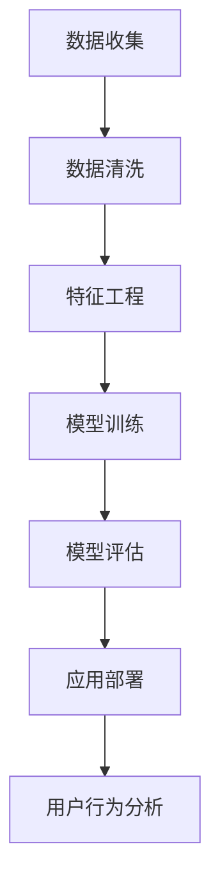

                 

# 如何进行有效的用户行为分析

## 1. 背景介绍

在当今数字化时代，用户行为分析成为了企业和组织获得竞争优势的关键。通过深入了解用户的行为模式、需求和偏好，企业可以优化产品和服务，提升用户体验，从而增强用户粘性并提升商业效益。然而，用户行为数据通常庞大且复杂，如何高效、准确地分析这些数据，是数据科学和工程领域的一大挑战。

本文旨在介绍如何通过系统化的数据工程和机器学习技术，进行有效的用户行为分析。我们将探讨核心概念，详细讲解算法原理，并介绍实际应用场景，最后给出一些学习资源和工具推荐，以帮助读者深入理解并实践用户行为分析。

## 2. 核心概念与联系

### 2.1 核心概念概述

用户行为分析（User Behavior Analysis, UBA）是指通过数据分析和机器学习技术，从用户与产品或服务的交互数据中提取有价值的信息和洞察，从而优化用户体验和提升业务绩效。其核心要素包括：

- **数据收集**：通过日志记录、点击流、交易记录等多种方式收集用户行为数据。
- **数据清洗**：对数据进行预处理，去除噪声和异常值，保证数据质量。
- **特征工程**：从原始数据中提取有用的特征，构建模型训练所需的数据集。
- **模型训练**：应用机器学习算法，对用户行为数据进行建模，预测用户行为。
- **模型评估**：通过交叉验证、混淆矩阵等方法，评估模型的性能。
- **应用部署**：将训练好的模型部署到生产环境中，实时分析用户行为。

### 2.2 核心概念原理和架构的 Mermaid 流程图



## 3. 核心算法原理 & 具体操作步骤

### 3.1 算法原理概述

用户行为分析的关键在于构建一个准确有效的模型，该模型可以从用户数据中提取有价值的信息。常用的算法包括决策树、随机森林、神经网络等，其中神经网络，尤其是深度学习模型，因其强大的表达能力和自适应性，在用户行为分析中得到了广泛应用。

### 3.2 算法步骤详解

用户行为分析的完整流程通常包括以下步骤：

**Step 1: 数据收集与预处理**
- 收集用户行为数据，包括点击流、交易记录、登录行为等。
- 对数据进行清洗，去除噪声和异常值，如重复记录、缺失值等。
- 对数据进行标准化和归一化处理，确保数据在同一尺度上。

**Step 2: 特征工程**
- 从原始数据中提取有用的特征，如用户ID、时间戳、事件类型等。
- 应用特征选择和特征工程技术，构建模型训练所需的数据集。
- 使用PCA、因子分析等方法，对高维数据进行降维处理。

**Step 3: 模型选择与训练**
- 选择合适的机器学习算法，如线性回归、决策树、随机森林、神经网络等。
- 应用交叉验证等技术，评估不同算法的性能。
- 使用优化算法，如梯度下降，最小化损失函数，训练模型。

**Step 4: 模型评估与调优**
- 使用混淆矩阵、ROC曲线、AUC等指标评估模型性能。
- 进行模型调优，调整模型参数，提升模型精度。
- 应用集成学习技术，如Bagging、Boosting，提升模型泛化能力。

**Step 5: 模型部署与监控**
- 将训练好的模型部署到生产环境中。
- 实时监控模型性能，收集反馈数据。
- 根据业务需求和用户反馈，不断优化和更新模型。

### 3.3 算法优缺点

用户行为分析的优点包括：
- **自动化分析**：能够自动处理大量数据，提取有用信息，节省人工成本。
- **实时分析**：能够实时监测用户行为，快速响应业务需求。
- **预测能力**：通过历史数据，能够预测未来用户行为，指导业务决策。

缺点包括：
- **数据质量依赖**：数据质量直接影响分析结果，需要严格的数据清洗和预处理。
- **模型复杂性**：模型构建和调优过程复杂，需要专业的知识和技能。
- **隐私和安全问题**：用户行为数据涉及隐私，需要严格的数据保护措施。

### 3.4 算法应用领域

用户行为分析广泛应用于以下领域：

- **电商推荐系统**：通过分析用户购买行为，推荐个性化商品，提升用户满意度和销售额。
- **移动应用**：通过分析用户的使用行为，优化界面设计和功能，提升用户体验。
- **社交媒体**：通过分析用户互动和内容消费行为，优化推荐算法，提升用户黏性。
- **广告投放**：通过分析用户点击和转化行为，优化广告投放策略，提升广告ROI。
- **客户支持**：通过分析用户求助和反馈行为，优化客服流程，提升客户满意度。

## 4. 数学模型和公式 & 详细讲解 & 举例说明

### 4.1 数学模型构建

用户行为分析通常使用监督学习模型，例如分类、回归等。以用户留存分析为例，我们尝试预测用户是否会在一段时间内继续使用某产品或服务。

定义模型为 $M(x, \theta)$，其中 $x$ 为输入特征，$\theta$ 为模型参数。假设已知的标注数据集为 $D=\{(x_i, y_i)\}_{i=1}^N$，其中 $y_i \in \{0, 1\}$ 表示用户是否继续使用产品。目标是最小化模型在数据集上的损失函数：

$$
\mathcal{L}(\theta) = \frac{1}{N} \sum_{i=1}^N \ell(M(x_i, \theta), y_i)
$$

常用的损失函数包括二分类交叉熵：

$$
\ell(M(x_i, \theta), y_i) = -(y_i \log M(x_i, \theta) + (1 - y_i) \log (1 - M(x_i, \theta)))
$$

### 4.2 公式推导过程

对于二分类问题，我们可以使用逻辑回归模型：

$$
M(x, \theta) = \sigma(\theta^T x)
$$

其中 $\sigma$ 为sigmoid函数，$\theta^T x$ 为线性组合。逻辑回归的损失函数为交叉熵：

$$
\mathcal{L}(\theta) = -\frac{1}{N} \sum_{i=1}^N \left(y_i \log \sigma(\theta^T x_i) + (1 - y_i) \log (1 - \sigma(\theta^T x_i))\right)
$$

我们通过梯度下降算法最小化损失函数：

$$
\theta \leftarrow \theta - \eta \nabla_{\theta} \mathcal{L}(\theta)
$$

其中 $\eta$ 为学习率，$\nabla_{\theta} \mathcal{L}(\theta)$ 为损失函数对参数的梯度。

### 4.3 案例分析与讲解

假设我们有一组用户行为数据，包含点击行为、购买行为和注册行为，我们的目标是预测用户是否会进行下一次购买。

1. **数据收集与预处理**：收集用户行为数据，清洗数据，去除重复记录和缺失值。
2. **特征工程**：提取特征如用户ID、点击次数、购买金额等，并应用PCA降维。
3. **模型选择与训练**：选择逻辑回归模型，应用梯度下降算法训练模型。
4. **模型评估与调优**：使用交叉验证评估模型性能，调整学习率和正则化参数。
5. **模型部署与监控**：将模型部署到生产环境中，实时分析用户行为。

## 5. 项目实践：代码实例和详细解释说明

### 5.1 开发环境搭建

在进行用户行为分析实践前，我们需要准备好开发环境。以下是使用Python进行Scikit-Learn开发的简单环境配置流程：

1. 安装Anaconda：从官网下载并安装Anaconda，用于创建独立的Python环境。

2. 创建并激活虚拟环境：
```bash
conda create -n user_behavior python=3.8 
conda activate user_behavior
```

3. 安装Scikit-Learn和其他必要的库：
```bash
pip install scikit-learn pandas numpy matplotlib
```

完成上述步骤后，即可在`user_behavior`环境中开始用户行为分析实践。

### 5.2 源代码详细实现

以下是一个简单的用户行为分析示例，通过逻辑回归模型预测用户是否会进行下一次购买。

```python
import pandas as pd
from sklearn.model_selection import train_test_split
from sklearn.linear_model import LogisticRegression
from sklearn.metrics import roc_auc_score

# 加载数据
data = pd.read_csv('user_behavior.csv')

# 特征工程
features = ['click_count', 'purchase_amount', 'registration_time']
target = 'is_next_purchase'
X = data[features]
y = data[target]

# 划分数据集
X_train, X_test, y_train, y_test = train_test_split(X, y, test_size=0.2, random_state=42)

# 训练模型
model = LogisticRegression()
model.fit(X_train, y_train)

# 评估模型
y_pred = model.predict_proba(X_test)[:, 1]
auc = roc_auc_score(y_test, y_pred)
print(f"AUC: {auc}")
```

### 5.3 代码解读与分析

让我们详细解读一下关键代码的实现细节：

- `pd.read_csv`：用于加载CSV格式的数据集。
- `train_test_split`：将数据集划分为训练集和测试集，用于模型训练和评估。
- `LogisticRegression`：逻辑回归模型，用于分类问题。
- `predict_proba`：模型预测概率，用于计算AUC指标。

### 5.4 运行结果展示

运行上述代码后，输出AUC指标，用于评估模型性能。AUC指标越高，表示模型的分类能力越好。

## 6. 实际应用场景

### 6.1 智能推荐系统

智能推荐系统通过分析用户的历史行为，预测用户兴趣，并推荐相关产品或内容。通过用户行为分析，推荐系统能够更好地理解用户需求，提升推荐效果。

在技术实现上，可以收集用户的浏览、购买、评分等行为数据，利用用户行为分析模型，预测用户对某项内容的兴趣概率。根据概率大小进行排序，生成个性化推荐列表，提高用户满意度和留存率。

### 6.2 客户细分

客户细分是企业的重要战略，通过分析用户行为，将客户划分为不同群体，制定有针对性的营销策略。

在实际操作中，可以收集用户在网站上的行为数据，如点击、停留时间、购买金额等，使用聚类算法将用户分为不同的群体。然后，针对不同群体制定个性化的营销活动，提升客户忠诚度和满意度。

### 6.3 用户流失预警

用户流失是企业面临的重要挑战，通过分析用户行为，及时预警可能流失的用户，可以显著提升客户留存率。

具体而言，可以收集用户在应用中的行为数据，如登录次数、活跃时间、使用频率等，构建预测模型。当模型预测某个用户有流失风险时，及时采取干预措施，如发送优惠活动、提供个性化服务，挽留用户。

### 6.4 未来应用展望

随着数据工程和机器学习技术的不断发展，用户行为分析的应用将更加广泛和深入。未来可能的应用场景包括：

- **跨平台分析**：分析用户在多个平台上的行为，进行跨平台用户画像构建。
- **多模态分析**：结合文本、语音、图像等多模态数据，全面了解用户行为。
- **实时分析**：通过实时数据流处理技术，对用户行为进行实时分析，及时响应。
- **深度学习分析**：引入深度学习技术，提升用户行为预测的精度和泛化能力。
- **隐私保护分析**：引入差分隐私、联邦学习等技术，保护用户隐私的同时进行行为分析。

## 7. 工具和资源推荐

### 7.1 学习资源推荐

为帮助读者深入理解用户行为分析，这里推荐一些优质的学习资源：

1. 《Python数据科学手册》：介绍了Python在数据科学中的应用，涵盖数据清洗、特征工程、模型构建等技术。
2. Coursera《数据科学专业证书》：由Johns Hopkins University开设的在线课程，涵盖数据处理、统计学、机器学习等核心内容。
3. Kaggle竞赛平台：提供大量数据集和竞赛，帮助学习者实践和应用数据科学技术。
4. Scikit-Learn官方文档：提供详细的使用指南和教程，适合初学者入门。
5. TensorFlow官方文档：提供深度学习框架的使用指南和示例，适合进阶学习者。

### 7.2 开发工具推荐

高效的开发离不开优秀的工具支持。以下是几款用于用户行为分析开发的常用工具：

1. Jupyter Notebook：免费的交互式编程环境，适合数据科学和机器学习项目开发。
2. Visual Studio Code：轻量级、功能强大的代码编辑器，支持多种编程语言。
3. Git：版本控制系统，用于团队协作和代码管理。
4. Docker：容器化技术，简化开发、测试、部署流程。
5. TensorFlow：深度学习框架，支持分布式计算和模型优化。
6. PyTorch：深度学习框架，提供了丰富的预训练模型和优化工具。

### 7.3 相关论文推荐

用户行为分析领域的论文层出不穷，以下是几篇具有代表性的论文，推荐阅读：

1. 《User Behavior Analysis: A Survey and Future Directions》：总结了用户行为分析的研究现状和未来方向，适合了解该领域的整体趋势。
2. 《Adaptive Multi-Channel Recommendation for E-Commerce Platforms》：介绍了一种多通道推荐系统，利用用户行为数据进行个性化推荐。
3. 《The Role of Social Media in Customer Behavior Analysis》：研究了社交媒体在用户行为分析中的应用，探讨了其对用户行为的影响。
4. 《Predicting User Churn with Machine Learning》：介绍了多种机器学习算法在用户流失预警中的应用，评估了不同算法的性能。
5. 《User Behavior Analytics and Privacy: A Balanced Approach》：探讨了用户行为分析中的隐私保护问题，提供了一些解决方案。

## 8. 总结：未来发展趋势与挑战

### 8.1 总结

本文对用户行为分析的技术和应用进行了全面系统的介绍。从核心概念到具体实现，从理论到实践，详细讲解了用户行为分析的各个环节。通过系统的梳理，相信读者能够深入理解用户行为分析的精髓，并掌握其实际应用技能。

### 8.2 未来发展趋势

展望未来，用户行为分析技术将呈现以下几个发展趋势：

1. **跨平台数据分析**：随着用户行为数据的来源越来越多元化，跨平台数据分析将成为主流。通过整合不同平台的数据，进行全局性的用户画像构建，提升分析的准确性和深度。
2. **多模态数据分析**：结合文本、语音、图像等多种数据模态，进行全面的用户行为分析。多模态数据的融合，将显著提升行为预测的精度和泛化能力。
3. **实时数据分析**：通过实时数据流处理技术，对用户行为进行实时分析，及时响应。实时分析将提升业务决策的灵活性和及时性。
4. **深度学习分析**：引入深度学习技术，提升用户行为预测的精度和泛化能力。深度学习模型在处理复杂数据结构方面具有天然优势。
5. **隐私保护分析**：引入差分隐私、联邦学习等技术，保护用户隐私的同时进行行为分析。隐私保护技术将推动用户行为分析的可持续发展。

### 8.3 面临的挑战

尽管用户行为分析技术已经取得了显著进展，但在实际应用中，仍面临以下挑战：

1. **数据隐私和安全**：用户行为数据涉及隐私，如何保护用户数据成为一大难题。需要采用差分隐私、联邦学习等技术，确保数据安全。
2. **数据质量和一致性**：不同平台和设备上的用户行为数据格式和质量差异较大，如何整合和统一数据格式和质量，是一个重要挑战。
3. **模型复杂度和解释性**：用户行为分析模型通常较为复杂，如何简化模型结构，提高模型解释性，是提升用户体验的重要方向。
4. **实时性和计算效率**：用户行为数据通常实时生成，如何在保持实时性的同时，提高计算效率，降低系统延迟，是技术实现的难点。
5. **跨领域应用**：不同领域的用户行为分析需求各异，如何构建通用的分析框架和工具，适应不同领域的需求，是技术推广的挑战。

### 8.4 研究展望

面对用户行为分析面临的挑战，未来的研究需要在以下几个方面寻求新的突破：

1. **差分隐私技术**：引入差分隐私技术，保护用户数据隐私，同时进行精准分析。
2. **联邦学习框架**：构建联邦学习框架，实现跨平台、跨设备的数据协同分析。
3. **模型简化与解释**：开发简化模型，提高模型解释性，提升用户信任度。
4. **实时计算与存储**：引入实时计算和分布式存储技术，提高系统性能，支持实时分析。
5. **跨领域应用平台**：构建通用的用户行为分析平台，支持不同领域的应用需求。

这些研究方向的探索，将推动用户行为分析技术的不断发展，为构建智能化的业务决策系统奠定基础。面向未来，用户行为分析技术将与其他人工智能技术进行更深入的融合，共同推动数据驱动的业务创新。

## 9. 附录：常见问题与解答

**Q1: 用户行为分析有哪些具体的应用场景？**

A: 用户行为分析在各个领域都有广泛的应用场景，包括但不限于以下几个方面：

1. **电商推荐系统**：通过分析用户的历史购买和浏览行为，推荐个性化的商品。
2. **客户细分**：将用户按照行为特征进行分组，制定针对性的营销策略。
3. **用户流失预警**：通过分析用户行为，及时发现潜在的流失用户，采取挽留措施。
4. **个性化内容推荐**：根据用户的浏览和互动行为，推荐个性化内容，提高用户满意度。
5. **广告投放优化**：分析用户点击和转化行为，优化广告投放策略，提升广告效果。

**Q2: 用户行为分析中的数据预处理包含哪些步骤？**

A: 数据预处理是用户行为分析的重要环节，通常包括以下步骤：

1. **数据清洗**：去除重复记录、缺失值、异常值等。
2. **数据归一化**：将数据转换为同一尺度，便于后续处理。
3. **特征工程**：提取有用的特征，如时间戳、点击次数、购买金额等。
4. **降维处理**：通过PCA、因子分析等方法，减少特征维度，提升计算效率。
5. **数据划分**：将数据划分为训练集、验证集和测试集，用于模型训练和评估。

**Q3: 用户行为分析中的模型选择和训练需要注意哪些事项？**

A: 模型选择和训练是用户行为分析的核心步骤，需要注意以下事项：

1. **选择合适的算法**：根据数据类型和业务需求，选择合适的机器学习算法。
2. **数据划分和交叉验证**：将数据划分为训练集和测试集，应用交叉验证评估模型性能。
3. **模型调优**：调整模型参数，提高模型精度和泛化能力。
4. **集成学习**：使用集成学习方法，如Bagging、Boosting，提升模型性能。
5. **超参数调优**：优化超参数，如学习率、正则化系数等，提升模型效果。

**Q4: 用户行为分析中的模型评估和调优有哪些常用方法？**

A: 模型评估和调优是提升用户行为分析精度的重要手段，常用方法包括：

1. **混淆矩阵和ROC曲线**：用于评估分类模型的性能。
2. **均方误差和R平方**：用于评估回归模型的性能。
3. **AUC指标**：用于评估分类模型的准确性和鲁棒性。
4. **网格搜索和随机搜索**：用于优化模型参数，提升模型性能。
5. **交叉验证**：用于评估模型泛化能力，选择合适的超参数。

**Q5: 用户行为分析中的实时数据分析需要考虑哪些技术？**

A: 实时数据分析是用户行为分析的重要应用场景，需要考虑以下技术：

1. **实时数据流处理**：使用Spark Streaming、Flink等技术，处理实时数据流。
2. **分布式计算**：使用Hadoop、Spark等技术，进行分布式计算，提升处理效率。
3. **流式模型训练**：使用模型训练框架，如TensorFlow Serving、Keras，支持流式模型训练。
4. **实时存储**：使用Redis、HBase等技术，进行实时存储，提高数据访问速度。
5. **实时监控和告警**：使用ELK Stack、Prometheus等技术，实时监控系统性能，设置告警阈值，确保系统稳定性。

通过合理应用这些技术和方法，可以构建高效的实时用户行为分析系统，为业务决策提供及时、准确的支撑。

---

作者：禅与计算机程序设计艺术 / Zen and the Art of Computer Programming

