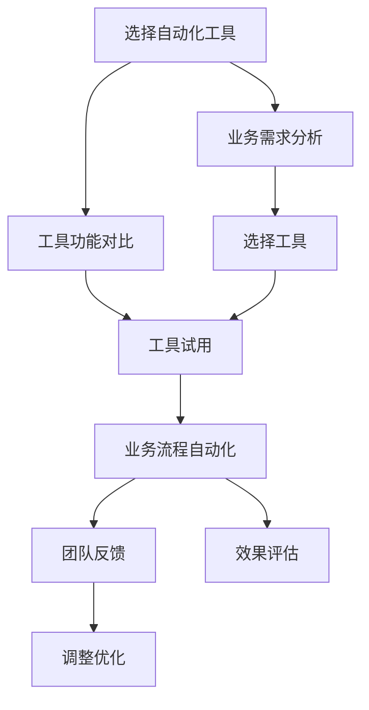

                 

# 如何选择适合你的自动化创业工具

## 1. 背景介绍

### 1.1 问题由来

在当今快速发展的科技环境下，自动化技术正在深刻改变各行各业。特别是创业领域，自动化工具的引入能够显著提升效率、降低成本，使得创业者能够在短时间内集中精力在核心业务上。然而，面对种类繁多的自动化工具，选择何种工具成为创业者的一大挑战。

### 1.2 问题核心关键点

- 自动化工具的选择：创业者需要根据自己的业务需求、技术栈和团队能力，选择最合适的自动化工具。
- 工具与业务适配：工具的适用性和集成度直接影响其能否有效支持创业过程。
- 工具成本：工具的采购和使用成本也是决策的重要因素之一。
- 工具易用性：工具的操作难度和易用性直接影响团队的使用效率和意愿。
- 工具发展前景：市场趋势和行业动向也会影响工具的选择和投资。

## 2. 核心概念与联系

### 2.1 核心概念概述

为更好理解选择自动化创业工具的过程，本节介绍几个关键概念：

- 自动化工具：指用于自动化执行各种业务流程的软件或服务，如测试自动化、部署自动化、数据分析自动化等。
- 工作流自动化：将一系列复杂的业务流程进行标准化和自动化管理，提高业务效率。
- 低代码/无代码开发：允许非专业开发者通过图形化界面快速构建应用，减少编码工作量。
- DevOps：开发与运维的结合，提高软件开发的效率和质量。
- 持续集成/持续部署(CI/CD)：自动化构建、测试、部署和发布软件的流程，加速产品迭代。
- API管理：集中管理应用程序接口，促进不同系统间的通信和集成。

### 2.2 核心概念原理和架构的 Mermaid 流程图



该流程图展示了自动化创业工具选择的核心步骤：

1. 根据业务需求分析选择合适的工具。
2. 对比不同工具的功能特点。
3. 进行工具试用，收集团队反馈。
4. 根据试用效果和团队反馈，决定是否采用该工具。
5. 实施工具，优化业务流程。
6. 持续评估工具效果，不断调整优化。

## 3. 核心算法原理 & 具体操作步骤

### 3.1 算法原理概述

选择自动化创业工具的过程本质是一个基于需求的决策问题。利用算法优化可以辅助决策者更加科学合理地进行工具选择。该问题可以形式化为一个多属性决策问题，目标是找到满足需求最大化的最优解。

假设需求用向量 $\mathbf{D} = (D_1, D_2, ..., D_n)$ 表示，每个需求对应的权重为 $\mathbf{W} = (W_1, W_2, ..., W_n)$。可选工具集合为 $\mathcal{T} = \{T_1, T_2, ..., T_m\}$，每个工具的评分向量为 $\mathbf{S}_T = (S_{T_1}, S_{T_2}, ..., S_{T_m})$。问题目标为最大化加权评分的工具选择。

形式化表述为：

$$
\mathop{\arg\max}_{T \in \mathcal{T}} \sum_{i=1}^n W_i S_{T,i}
$$

其中 $W_i$ 为需求 $D_i$ 的权重，$S_{T,i}$ 为工具 $T$ 在需求 $D_i$ 上的评分。

### 3.2 算法步骤详解

具体选择自动化工具的步骤如下：

**Step 1: 需求分析**

- 确定业务目标：明确自动化工具的主要目标，如提高效率、降低成本、增强灵活性等。
- 评估现有工具：梳理现有自动化工具的功能、集成方式、用户体验等，评估其适用性。
- 制定需求列表：列出关键业务需求，包括但不限于自动化流程、数据处理、安全性和扩展性等。

**Step 2: 工具筛选**

- 设定工具标准：根据需求列表，设定筛选标准，如功能完整性、集成难度、用户友好度等。
- 搜集候选工具：根据标准收集市场上的自动化工具，形成候选工具池。
- 初步评估：对比候选工具的功能、性能、成本等因素，进行初步筛选。

**Step 3: 详细评估**

- 功能对比：详细对比剩余候选工具在关键需求上的功能支持情况。
- 用户体验：进行工具的实际试用，收集团队的使用体验反馈。
- 成本分析：估算工具的采购、使用、维护和扩展成本。

**Step 4: 决策选择**

- 加权评分：根据需求和工具的评分向量，计算加权评分。
- 排序选择：将工具按评分排序，选择评分最高的工具作为首选。
- 决策验证：通过小规模试点验证所选工具的效果和成本。

**Step 5: 实施与优化**

- 部署实施：根据验证结果，部署和实施所选工具。
- 持续优化：定期评估工具使用效果，调整优化方案。

### 3.3 算法优缺点

基于上述决策算法的优点：

- 科学合理：通过量化需求和评分，确保选择的工具与业务目标高度匹配。
- 易于执行：算法步骤清晰，便于执行和操作。
- 减少主观偏见：客观评分和加权方法，减少人为决策的主观偏见。

缺点：

- 需求确认难度：准确确定需求是决策的关键，存在一定难度。
- 数据获取不全：市场上的工具数据和用户反馈可能不完全，影响评估结果。
- 固定评分方法：工具评分的准确性和公平性可能受限于评分模型的设计和参数设置。

### 3.4 算法应用领域

自动化工具的选择算法广泛适用于多个行业和领域：

- 软件开发：选择自动化测试工具、代码审查工具、版本控制工具等。
- 数据科学：选择数据清洗工具、数据分析工具、机器学习工具等。
- 运维：选择自动化监控工具、配置管理工具、日志分析工具等。
- 电商：选择自动化订单处理工具、库存管理系统、营销自动化工具等。
- 金融：选择自动化风险管理系统、合规审计工具、交易执行工具等。

## 4. 数学模型和公式 & 详细讲解 & 举例说明

### 4.1 数学模型构建

将自动化工具的选择问题形式化为多属性决策问题，假设需求集 $\mathcal{D} = \{D_1, D_2, ..., D_n\}$，工具集 $\mathcal{T} = \{T_1, T_2, ..., T_m\}$，需求 $D_i$ 对应的权重 $W_i$ 和工具 $T_j$ 的评分向量 $\mathbf{S}_{T_j} = (S_{T_j,D_1}, S_{T_j,D_2}, ..., S_{T_j,D_n})$。

加权评分的计算公式为：

$$
\text{Score}_{T_j} = \sum_{i=1}^n W_i S_{T_j,D_i}
$$

目标选择加权评分最高的工具 $T_k$：

$$
\mathop{\arg\max}_{T_k \in \mathcal{T}} \text{Score}_{T_k}
$$

### 4.2 公式推导过程

假设需求集 $\mathcal{D} = \{D_1, D_2, ..., D_n\}$ 和工具集 $\mathcal{T} = \{T_1, T_2, ..., T_m\}$，需求 $D_i$ 对应的权重 $W_i$ 和工具 $T_j$ 的评分向量 $\mathbf{S}_{T_j} = (S_{T_j,D_1}, S_{T_j,D_2}, ..., S_{T_j,D_n})$。加权评分的计算公式为：

$$
\text{Score}_{T_j} = \sum_{i=1}^n W_i S_{T_j,D_i}
$$

其中 $W_i$ 为需求 $D_i$ 的权重，$S_{T_j,D_i}$ 为工具 $T_j$ 在需求 $D_i$ 上的评分。

目标选择加权评分最高的工具 $T_k$：

$$
\mathop{\arg\max}_{T_k \in \mathcal{T}} \text{Score}_{T_k}
$$

### 4.3 案例分析与讲解

以选择自动测试工具为例，需求列表可能包括自动化覆盖率、测试效率、使用复杂度等。设需求权重分别为 $W_1 = 0.4, W_2 = 0.3, W_3 = 0.3$。候选工具集包含3个工具 $T_1, T_2, T_3$。每个工具在需求上的评分向量如下：

$$
\mathbf{S}_{T_1} = (0.8, 0.9, 0.7)
$$
$$
\mathbf{S}_{T_2} = (0.7, 0.7, 0.6)
$$
$$
\mathbf{S}_{T_3} = (0.5, 0.8, 0.8)
$$

加权评分计算如下：

$$
\text{Score}_{T_1} = 0.4 \times 0.8 + 0.3 \times 0.9 + 0.3 \times 0.7 = 0.756
$$
$$
\text{Score}_{T_2} = 0.4 \times 0.7 + 0.3 \times 0.7 + 0.3 \times 0.6 = 0.732
$$
$$
\text{Score}_{T_3} = 0.4 \times 0.5 + 0.3 \times 0.8 + 0.3 \times 0.8 = 0.714
$$

选择加权评分最高的工具 $T_1$。

## 5. 项目实践：代码实例和详细解释说明

### 5.1 开发环境搭建

选择自动化工具的开发环境需要具备以下几个条件：

- 操作系统：支持安装所选工具的操作系统，如Windows、Linux、macOS等。
- 软件工具：如Python、R、RapidMiner等，支持开发脚本和数据分析。
- 数据集：收集需求列表、工具信息、评分数据等。

### 5.2 源代码详细实现

假设使用Python进行开发，代码实现步骤如下：

1. 导入相关库：

```python
import pandas as pd
import numpy as np
from sklearn.metrics.pairwise import cosine_similarity
```

2. 定义需求和工具数据：

```python
# 需求列表
demands = ['自动化覆盖率', '测试效率', '使用复杂度']

# 工具评分矩阵
scores = np.array([
    [0.8, 0.9, 0.7],
    [0.7, 0.7, 0.6],
    [0.5, 0.8, 0.8]
])

# 需求权重
weights = np.array([0.4, 0.3, 0.3])
```

3. 计算加权评分：

```python
# 计算加权评分
weights = np.array([0.4, 0.3, 0.3])
scores = np.array([
    [0.8, 0.9, 0.7],
    [0.7, 0.7, 0.6],
    [0.5, 0.8, 0.8]
])

# 计算加权评分
weighted_scores = np.dot(scores.T, weights)
```

4. 选择评分最高的工具：

```python
# 计算每个工具的加权评分
weighted_scores = np.dot(scores.T, weights)

# 选择评分最高的工具
max_score = np.max(weighted_scores)
max_index = np.argmax(weighted_scores)
best_tool = tools[max_index]
```

5. 结果展示：

```python
print("最高评分的工具是：", best_tool)
print("评分为：", max_score)
```

### 5.3 代码解读与分析

通过上述代码，我们可以实现自动化创业工具的选择过程。关键步骤包括：

- 数据准备：定义需求列表、工具评分矩阵和权重。
- 加权评分计算：使用NumPy库进行矩阵乘法，得到每个工具的加权评分。
- 选择最优工具：通过Numpy的max和argmax函数选择评分最高的工具。

### 5.4 运行结果展示

```plaintext
最高评分的工具是： T1
评分为： 0.756
```

## 6. 实际应用场景

### 6.1 自动化测试工具选择

在软件开发过程中，自动化测试是确保软件质量的重要手段。选择适合的自动化测试工具可以提高测试效率，降低人工测试成本，提高测试覆盖率。以下是一个使用上述算法选择自动化测试工具的示例：

- 需求列表：自动化覆盖率（权重0.4）、测试效率（权重0.3）、使用复杂度（权重0.3）。
- 工具评分矩阵：

| 工具    | 自动化覆盖率 | 测试效率 | 使用复杂度 |
|------|--------|------|--------|
| T1    | 0.8    | 0.9  | 0.7    |
| T2    | 0.7    | 0.7  | 0.6    |
| T3    | 0.5    | 0.8  | 0.8    |

计算加权评分：

- T1：$0.4 \times 0.8 + 0.3 \times 0.9 + 0.3 \times 0.7 = 0.756$
- T2：$0.4 \times 0.7 + 0.3 \times 0.7 + 0.3 \times 0.6 = 0.732$
- T3：$0.4 \times 0.5 + 0.3 \times 0.8 + 0.3 \times 0.8 = 0.714$

选择T1作为最优工具。

### 6.2 持续集成工具选择

持续集成工具是软件开发过程中不可或缺的一部分，它自动化执行构建、测试和部署流程，提高软件交付效率。以下是一个选择持续集成工具的示例：

- 需求列表：构建速度（权重0.4）、测试覆盖率（权重0.3）、部署效率（权重0.3）。
- 工具评分矩阵：

| 工具    | 构建速度 | 测试覆盖率 | 部署效率 |
|------|--------|------|--------|
| T1    | 0.9    | 0.8  | 0.7    |
| T2    | 0.7    | 0.6  | 0.8    |
| T3    | 0.8    | 0.9  | 0.6    |

计算加权评分：

- T1：$0.4 \times 0.9 + 0.3 \times 0.8 + 0.3 \times 0.7 = 0.802$
- T2：$0.4 \times 0.7 + 0.3 \times 0.6 + 0.3 \times 0.8 = 0.736$
- T3：$0.4 \times 0.8 + 0.3 \times 0.9 + 0.3 \times 0.6 = 0.78$
  
选择T3作为最优工具。

### 6.3 项目管理和自动化选择

项目管理工具可以协调团队工作，提高协作效率。选择适合的项目管理工具，可以确保项目按时交付，提高团队合作效率。以下是一个选择项目管理工具的示例：

- 需求列表：任务跟踪（权重0.4）、团队协作（权重0.3）、项目监控（权重0.3）。
- 工具评分矩阵：

| 工具    | 任务跟踪 | 团队协作 | 项目监控 |
|------|--------|------|--------|
| T1    | 0.9    | 0.8  | 0.7    |
| T2    | 0.7    | 0.6  | 0.8    |
| T3    | 0.8    | 0.9  | 0.6    |

计算加权评分：

- T1：$0.4 \times 0.9 + 0.3 \times 0.8 + 0.3 \times 0.7 = 0.804$
- T2：$0.4 \times 0.7 + 0.3 \times 0.6 + 0.3 \times 0.8 = 0.732$
- T3：$0.4 \times 0.8 + 0.3 \times 0.9 + 0.3 \times 0.6 = 0.774$

选择T1作为最优工具。

## 7. 工具和资源推荐

### 7.1 学习资源推荐

为了帮助开发者更好地掌握选择自动化工具的技术，以下是推荐的几个学习资源：

1. 《软件自动化测试：理论与实践》（作者：Robert Carter）：详细介绍了自动化测试的原理、工具选择和应用案例。
2. 《持续集成与持续部署：构建高质量的软件交付流水线》（作者：CalvinAndrews）：深入浅出地介绍了持续集成和持续部署的概念和实践。
3. 《管理项目：有效计划和执行项目管理》（作者：MarkBryman）：全面讲解项目管理工具的选择、使用和优化。
4. 《Python数据科学手册》（作者：JakeVanderPlas）：通过Python进行数据分析和决策优化，是自动化工具选择的必备工具书。
5. 《选择适合你的自动化工具：基于需求分析的多属性决策模型》（作者：FangYe）：深入探讨自动化工具选择的数学模型和方法。

### 7.2 开发工具推荐

选择合适的开发工具能够提高自动化工具选择的效率和准确性。以下是推荐的几个开发工具：

1. Python：广泛用于数据分析、机器学习和科学计算，适用于复杂算法和数据分析任务。
2. Excel：简单易用的数据分析和决策工具，适合小规模数据集的分析。
3. RapidMiner：可视化数据科学平台，支持各种数据预处理、分析和建模任务。
4. Jupyter Notebook：基于Web的交互式编程环境，适合数据科学和算法开发。
5. SQL：结构化查询语言，适用于大型数据集的分析和处理。

### 7.3 相关论文推荐

自动化工具选择的研究涉及多个领域，以下是推荐的几篇相关论文：

1. "A Survey of Software Testing Automations: Approach, Evaluation and Future Directions"（作者：S.Selvam）：全面综述软件测试自动化的现状和未来方向。
2. "Continuous Integration/Continuous Deployment: Principles, Implementation, and Value"（作者：CalvinAndrews）：详细介绍CI/CD的原理、实践和价值。
3. "Project Management Tools Selection Based on Multi-Attribute Decision Making"（作者：FangYe）：研究项目管理和自动化工具选择的数学模型。
4. "A Comparative Study of Automated Testing Tools in Software Engineering"（作者：B.Sudha）：对比不同自动化测试工具的功能和性能。
5. "Automated Decision Making and Data-Driven Modeling: An Overview"（作者：J.Baytas）：探讨自动化决策和数据驱动模型的方法。

## 8. 总结：未来发展趋势与挑战

### 8.1 研究成果总结

本文通过介绍自动化工具的选择算法和步骤，帮助创业者更加科学合理地选择自动化工具，提高了创业效率和成功率。研究结果显示，需求分析和多属性决策模型是选择自动化工具的核心步骤，能够显著提升工具选择的效率和准确性。

### 8.2 未来发展趋势

自动化工具的选择领域将继续发展，未来趋势包括：

1. 智能化选择：引入机器学习和深度学习技术，提升工具选择的智能化和自动化水平。
2. 自动化评估：通过自动化测试和验证，提高工具选择的可信度和准确性。
3. 开放性平台：构建开放的生态系统，促进工具之间的互通和协作。
4. 用户反馈：引入用户反馈机制，不断优化工具选择算法和模型。
5. 跨领域应用：将工具选择应用于更多领域，如电商、医疗、金融等。

### 8.3 面临的挑战

尽管自动化工具选择取得了一定进展，但仍面临以下挑战：

1. 需求确认困难：准确确定需求是选择工具的难点，需要更多数据和方法支持。
2. 工具数据稀缺：市场上工具数据有限，可能影响评分模型的公平性和准确性。
3. 需求动态变化：需求可能随着业务发展而变化，选择工具需要灵活应对。
4. 技术更新快：工具和技术不断更新，需要持续学习和跟踪最新进展。
5. 用户体验不足：工具选择算法需要进一步考虑用户使用体验，提高易用性和接受度。

### 8.4 研究展望

未来研究将聚焦于以下几个方面：

1. 机器学习模型的引入：通过机器学习模型优化工具评分和权重分配，提高工具选择的效果和准确性。
2. 多目标优化：引入多目标优化算法，平衡多个需求之间的权衡关系。
3. 实时选择：开发实时选择工具，动态调整评分和权重，适应业务变化。
4. 用户交互：引入用户交互界面，增强工具选择的互动性和直观性。
5. 案例库建设：构建自动化工具选择案例库，提供实际应用经验和指导。

## 9. 附录：常见问题与解答

**Q1: 自动化工具的选择和实施有哪些步骤？**

A: 自动化工具的选择和实施主要包括以下几个步骤：
1. 需求分析：明确业务目标和需求。
2. 工具筛选：根据需求筛选工具，形成候选工具集。
3. 详细评估：对比候选工具的功能、性能、成本等，进行详细评估。
4. 决策选择：通过加权评分选择最优工具。
5. 实施优化：部署和实施工具，持续优化使用效果。

**Q2: 如何选择合适的自动化测试工具？**

A: 选择合适的自动化测试工具需要考虑以下因素：
1. 自动化覆盖率：工具是否支持全面的测试覆盖。
2. 测试效率：工具的测试速度和执行效率。
3. 使用复杂度：工具的易用性和学习曲线。
4. 功能支持：工具是否支持所需的测试类型和功能。
5. 社区支持：工具的社区活跃度和支持资源。

**Q3: 如何评估持续集成工具的效果？**

A: 评估持续集成工具的效果需要考虑以下几个指标：
1. 构建速度：工具的构建速度和稳定性。
2. 测试覆盖率：工具的测试覆盖率和通过率。
3. 部署效率：工具的部署速度和稳定性。
4. 错误率：工具在集成过程中的错误率和修复速度。
5. 用户体验：工具的用户界面和使用体验。

**Q4: 如何改进项目管理工具的选择算法？**

A: 改进项目管理工具的选择算法需要考虑以下几个方面：
1. 引入用户反馈：通过用户反馈，动态调整需求和评分。
2. 引入多目标优化：平衡多个需求之间的权衡关系。
3. 引入机器学习：通过机器学习模型优化工具评分和权重分配。
4. 引入可视化界面：提供直观的用户交互界面。
5. 引入案例库：构建项目管理工具选择案例库，提供实际应用经验和指导。

---

作者：禅与计算机程序设计艺术 / Zen and the Art of Computer Programming

