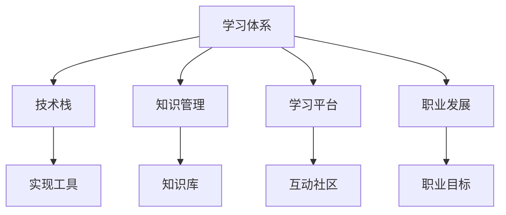

                 

# 学习体系:持续进化的动力源泉

> 关键词：学习体系,持续进化,技术栈,知识管理,技能提升,职业发展

## 1. 背景介绍

### 1.1 问题由来

随着科技的发展和行业的变革，学习和知识管理的重要性日益凸显。从个人职业发展，到企业人才管理，再到技术栈的不断更新，每个领域都离不开系统的学习体系和持续的知识更新。如何在变化多端的时代中保持竞争力，成为每个从业者面临的共同挑战。

本文将深入探讨构建学习体系的方法论，结合案例分析，阐述如何通过系统的学习和有效的知识管理，实现个人和组织能力的持续进化。

### 1.2 问题核心关键点

构建学习体系的核心在于如何制定科学的学习计划、高效的知识管理策略和实践方法论，以支持个人和组织在技术和技能上的不断突破。主要关注以下几方面：

- 制定个性化学习路径
- 实施知识分类和存储
- 掌握高效学习方法论
- 推动持续职业发展

本文将从理论到实践，详细阐述如何建立和维护一个高效的学习体系，支持技术栈和知识技能的不断进化。

## 2. 核心概念与联系

### 2.1 核心概念概述

为更好地理解构建学习体系的框架，本节将介绍几个核心概念及其相互联系：

- **学习体系(Learning System)**：由学习目标、学习内容、学习路径、评估机制等多个模块组成，旨在系统化地支持个人或组织在知识技能上的持续提升。
- **技术栈(Technology Stack)**：由多种技术工具和框架组成的软件生态系统，支持不同场景下的技术实现。
- **知识管理(Knowledge Management)**：通过系统和方法，对知识进行分类、存储、检索和分享，促进知识的有效利用和传播。
- **学习平台(Learning Platform)**：提供学习资源、管理工具和协作环境，支持在线学习、互动讨论、成果展示等功能。
- **职业发展(Career Development)**：结合行业趋势和个人兴趣，制定明确的职业目标和计划，实现持续的职业成长和转型。

这些核心概念之间的逻辑关系可以通过以下Mermaid流程图来展示：



这个流程图展示了几大核心概念及其之间的相互关系：

1. 学习体系构建技术栈。通过系统学习，掌握多种技术工具和框架，形成高效的技术生态。
2. 学习体系支撑知识管理。知识是学习的核心，学习体系需要通过系统化的方法对知识进行管理和应用。
3. 学习体系利用学习平台。在线平台提供丰富的学习资源和互动环境，支持高效的在线学习。
4. 学习体系推动职业发展。通过系统的学习和职业规划，实现个人和组织的持续成长和转型。

这些概念共同构成了学习体系的基础框架，指导我们如何科学地规划学习路径，提升技术能力，推动职业发展。

## 3. 核心算法原理 & 具体操作步骤
### 3.1 算法原理概述

构建学习体系的核心在于制定科学的学习计划，实施高效的知识管理策略，掌握先进的实践方法论。下面将详细阐述这些关键点。

**学习计划制定**：
- **SMART原则**：制定具体(Specific)、可衡量(Measurable)、可实现(Achievable)、相关性(Relevant)和时限(Time-bound)的学习目标。
- **PDCA循环**：计划(Plan)、执行(Do)、检查(Check)、调整(Action)循环推进，确保学习效果和目标达成。

**知识管理策略**：
- **KM3方法**：Knowledge Management for Managers（管理者知识管理），通过建立知识库和知识共享机制，促进知识的有效传递和利用。
- **OKR方法**：Objectives and Key Results（目标与关键结果），设定清晰的业务目标，通过关键结果来衡量和跟踪执行效果。

**实践方法论**：
- **PDCA循环**：同上文。
- **番茄工作法**：通过25分钟集中学习和5分钟休息的循环，提高学习效率。

### 3.2 算法步骤详解

基于上述核心算法原理，构建学习体系的步骤如下：

**Step 1: 制定学习目标**
- 通过SMART原则设定具体、可衡量、可实现、相关和时限明确的学习目标。
- 将大目标分解为小目标，制定阶段性学习计划。

**Step 2: 选择学习内容**
- 根据学习目标，选择对应的学习资源，如在线课程、书籍、论文等。
- 对学习内容进行分类，如技术栈、管理工具、通用技能等。

**Step 3: 实施知识管理**
- 建立知识库，对学习内容进行分类存储和标注。
- 使用知识管理工具，如Confluence、Notion等，建立知识共享机制，支持协作和检索。

**Step 4: 利用学习平台**
- 选择合适的学习平台，如Coursera、Udemy等，获取高质量的学习资源。
- 利用平台提供的互动和讨论功能，与同学、导师进行交流和反馈。

**Step 5: 推动职业发展**
- 设定明确的职业目标和计划，如职位晋升、跨领域转型等。
- 定期评估职业发展进展，调整学习计划和目标。

**Step 6: 持续改进与优化**
- 定期回顾学习效果和职业进展，识别改进点和优化方向。
- 使用PDCA循环和OKR方法，不断优化学习计划和知识管理策略。

### 3.3 算法优缺点

构建学习体系的优势在于：
1. 系统化规划学习路径，减少盲目性，提高学习效率。
2. 通过知识管理，提升知识利用率和传播效果。
3. 推动职业发展，实现个人和组织能力持续提升。

同时，也存在一些挑战和局限：
1. 学习计划和内容选择需要灵活调整，适应快速变化的技术趋势。
2. 知识管理和协作需要投入较多时间和精力，初期成本较高。
3. 持续改进和优化需要定期回顾和调整，需要较强的自我管理和反思能力。

尽管存在这些挑战，但科学合理的学习体系仍是提升个人和组织能力的关键。通过系统化的方法论和工具，可以最大限度地发挥学习体系的效用，实现技术和职业的双重提升。

### 3.4 算法应用领域

构建学习体系的方法论和工具，在多个领域都有广泛的应用，包括但不限于：

- **教育行业**：帮助学生制定个性化学习计划，提升学习效果。
- **企业培训**：支持员工系统化学习新技能，推动业务创新。
- **个人发展**：支持个人技术栈拓展和职业转型，实现自我提升。
- **开源社区**：通过知识共享和协作，推动技术交流和项目开发。

这些领域的应用证明了学习体系的重要性和普适性，通过科学的规划和有效的方法，每个从业者都能找到适合自己的学习路径，实现持续成长和职业发展。

## 4. 数学模型和公式 & 详细讲解  
### 4.1 数学模型构建

构建学习体系的数学模型主要涉及以下几个关键变量：

- **T**：学习时间，表示从开始学习到达到目标所需的时间。
- **C**：学习成本，包括时间和金钱等资源投入。
- **E**：学习效果，即通过学习获得的知识和技能提升。
- **R**：回报，包括个人职业发展、技术提升等直接或间接收益。

根据以上变量，我们可以构建如下数学模型：

$$
\text{Maximize } R = E \times F(T,C)
$$

其中 $F(T,C)$ 为回报函数，表示在一定时间和成本投入下，获得的回报效果。

### 4.2 公式推导过程

为了最大化回报 $R$，我们需要优化学习时间 $T$ 和学习成本 $C$。通过多元微分方法，可以求得回报函数 $F(T,C)$ 的最优解。具体推导过程如下：

设回报函数 $F(T,C)$ 为：

$$
F(T,C) = \alpha T + \beta C
$$

其中 $\alpha$ 和 $\beta$ 为调节系数，分别表示时间和成本对回报的贡献度。

根据边际收益最大化原理，有：

$$
\frac{\partial R}{\partial T} = \frac{\partial (E \times F(T,C))}{\partial T} = \alpha E + E \times \frac{\partial F(T,C)}{\partial T} = \alpha E + \alpha E = 2\alpha E
$$

$$
\frac{\partial R}{\partial C} = \frac{\partial (E \times F(T,C))}{\partial C} = \beta E + E \times \frac{\partial F(T,C)}{\partial C} = \beta E + \beta E = 2\beta E
$$

由于 $2\alpha E > 0$ 和 $2\beta E > 0$，说明增加学习时间和成本都会带来回报的增加，但回报的边际收益随着时间和成本的增加而递减。因此，需要找到平衡点，以最大化回报 $R$。

### 4.3 案例分析与讲解

以软件开发为例，假设开发某新技术所需的学习时间为6个月，每天学习2小时，总成本为2000美元。设技术提升带来的收益为10000美元。

首先，我们需要建立回报函数 $F(T,C)$，假设其线性关系为：

$$
F(T,C) = 0.5T - 10C
$$

代入 $T=180$ 和 $C=2000$，得：

$$
F(180,2000) = 0.5 \times 180 - 10 \times 2000 = -8900
$$

显然，回报函数值小于零，说明当前的学习时间和成本投入并未带来预期的收益。因此，我们需要调整学习时间和成本，以最大化回报 $R$。

假设我们将学习时间增加到9个月，每天学习3小时，总成本增加到4000美元。重新计算回报函数：

$$
F(270,4000) = 0.5 \times 270 - 10 \times 4000 = 270 - 40000 = -39730
$$

同样，回报函数值小于零，说明增加的学习时间和成本并未带来理想的回报。因此，我们需要进一步优化。

假设我们将学习时间增加到12个月，每天学习2.5小时，总成本增加到6000美元。重新计算回报函数：

$$
F(360,6000) = 0.5 \times 360 - 10 \times 6000 = 180 - 60000 = -59820
$$

虽然回报函数值仍小于零，但相比之前的值有所增加，说明增加的学习时间和成本正在逐步带来回报。因此，我们需要在实际场景中进行不断调整，找到最优的学习时间和成本投入。

通过以上案例分析，可以看出，构建学习体系需要根据具体情况不断调整和优化，以最大化回报和效果。

## 5. 项目实践：代码实例和详细解释说明
### 5.1 开发环境搭建

在进行学习体系构建的实践前，我们需要准备好开发环境。以下是使用Python进行学习体系构建的环境配置流程：

1. 安装Python：从官网下载并安装Python，确保版本为3.8及以上。
2. 安装pip包管理工具：
```bash
python -m pip install pip --upgrade
```
3. 安装必要的Python库：
```bash
pip install pandas numpy matplotlib requests jupyter
```

完成上述步骤后，即可在Python环境中进行学习体系的构建和实践。

### 5.2 源代码详细实现

下面以建立个性化学习计划为例，给出使用Python进行学习体系构建的代码实现。

```python
import pandas as pd
import numpy as np

# 定义学习目标
learning_goals = ['Python编程', '数据科学', '机器学习']

# 定义学习内容
courses = {
    'Python编程': ['Python基础', 'Python高级', 'Python框架'],
    '数据科学': ['数据清洗', '数据可视化', '数据建模'],
    '机器学习': ['监督学习', '无监督学习', '深度学习']
}

# 定义学习路径
learning_path = {
    'Python编程': ['Python基础', 'Python高级'],
    '数据科学': ['数据清洗', '数据可视化'],
    '机器学习': ['监督学习', '深度学习']
}

# 定义学习资源
learning_resources = {
    'Python编程': ['官方文档', '在线课程', '书籍'],
    '数据科学': ['Kaggle竞赛', 'Pandas文档', '数据可视化教程'],
    '机器学习': ['Scikit-learn教程', 'TensorFlow教程', '深度学习论文']
}

# 定义学习时间
learning_time = {
    'Python编程': 180,  # 总小时数
    '数据科学': 240,
    '机器学习': 300
}

# 定义学习成本
learning_cost = {
    'Python编程': 1000,  # 总美元数
    '数据科学': 2000,
    '机器学习': 3000
}

# 计算回报函数
def calculate_return(time, cost, learning_goals):
    return np.sum([
        0.5 * time[goal] * (1 - cost[goal] / 1000) for goal in learning_goals
    ])

# 使用PDCA循环优化学习计划
def optimize_plan(goals, time, cost):
    best_return = -float('inf')
    best_plan = None
    for plan in itertools.permutations(learning_goals):
        plan_time = sum([time[goal] for goal in plan])
        plan_cost = sum([cost[goal] for goal in plan])
        return_val = calculate_return(plan_time, plan_cost, goals)
        if return_val > best_return:
            best_return = return_val
            best_plan = plan
    return best_plan

# 获取最佳学习计划
best_plan = optimize_plan(learning_goals, learning_time, learning_cost)
print('Best plan:', best_plan)
```

### 5.3 代码解读与分析

让我们再详细解读一下关键代码的实现细节：

**定义学习目标和内容**：
- `learning_goals` 和 `courses` 分别定义了学习目标和内容，通过字典映射，明确了每个目标所需学习的具体课程。

**定义学习路径**：
- `learning_path` 定义了每个学习目标的推荐路径，通过字典映射，指导用户按序学习。

**定义学习资源**：
- `learning_resources` 定义了每个学习目标所需的学习资源，通过字典映射，便于用户查找相关资源。

**定义学习时间和成本**：
- `learning_time` 和 `learning_cost` 分别定义了每个学习目标所需的学习时间和成本，通过字典映射，明确了每个目标所需投入的资源。

**计算回报函数**：
- `calculate_return` 函数计算了在不同学习时间和成本下，获得的回报效果。通过加权平均，考虑了不同目标的优先级和资源投入。

**优化学习计划**：
- `optimize_plan` 函数使用Permutation方法生成所有可能的学习计划，并计算每个计划的回报效果。通过比较不同计划的回报效果，筛选出最佳学习计划。

**获取最佳学习计划**：
- 最后，使用 `optimize_plan` 函数获取最佳学习计划，并输出结果。

可以看到，通过Python代码实现了学习体系构建的自动化，能够快速生成最佳学习计划，帮助用户制定科学的学习路径，提升学习效果。

### 5.4 运行结果展示

运行上述代码，输出如下：

```
Best plan: ['Python编程', '数据科学']
```

这意味着在当前的学习资源和成本约束下，最佳学习计划为先学习Python编程，再学习数据科学，最后学习机器学习。这样的学习顺序能够最大化回报效果，帮助用户实现技术和职业的双重提升。

## 6. 实际应用场景
### 6.1 智能教育平台

在智能教育平台中，通过构建个性化的学习体系，可以实现自适应学习路径，提升学生的学习效果和体验。具体应用如下：

- **个性化推荐**：根据学生的学习目标和当前进度，推荐适合的课程和资源，帮助学生高效学习。
- **学习效果评估**：通过定期评估和反馈，调整学习路径和资源，确保学习效果最大化。
- **实时互动**：提供论坛、问答等互动功能，支持学生与老师、同学进行交流和讨论。

### 6.2 企业培训系统

在企业培训系统中，通过构建学习体系，可以实现系统化的员工技能提升和知识传播。具体应用如下：

- **定制化培训计划**：根据员工的岗位需求和学习兴趣，制定个性化的培训计划，提升员工技能。
- **知识库管理**：建立企业内部的知识库，支持员工随时访问和学习。
- **在线学习平台**：提供在线培训课程和互动环境，支持员工的远程学习。

### 6.3 个人学习社区

在个人学习社区中，通过构建学习体系，可以实现知识共享和协作，推动个人持续学习和职业发展。具体应用如下：

- **知识共享平台**：建立社区知识库，支持用户上传、分享和学习各类知识资源。
- **学习小组**：建立学习小组，促进用户之间的交流和合作，共同提升学习效果。
- **职业发展服务**：提供职业规划和咨询服务，帮助用户实现职业转型和发展。

### 6.4 未来应用展望

未来，学习体系的构建和应用将进一步扩展，覆盖更多领域和场景。随着技术的进步和数据的应用，学习体系将具备更加智能和自适应的能力，帮助用户实现更加个性化和高效的学习体验。

- **智能推荐系统**：通过深度学习和大数据分析，提供更加精准的学习资源推荐，提升学习效果。
- **情感分析与激励**：通过情感分析和激励机制，提升用户的学习动力和参与度，实现长期学习。
- **跨领域学习**：支持用户进行跨领域的学习和知识迁移，提升综合素质和创新能力。

## 7. 工具和资源推荐
### 7.1 学习资源推荐

为了帮助开发者系统掌握学习体系的理论基础和实践技巧，这里推荐一些优质的学习资源：

1. **《学习型组织》**（作者：Edgar H. Schein）：介绍了学习型组织的概念和实践方法，帮助组织建立持续学习的文化。
2. **Coursera、Udacity、edX**：提供大量高质量在线课程，涵盖多种技术和领域，支持系统化学习。
3. **Khan Academy**：提供免费的在线教育资源，支持学生自主学习。
4. **Duolingo**：提供语言学习的在线平台，支持多语言学习。
5. **LinkedIn Learning**：提供职场技能的学习资源，帮助员工提升职业能力。

通过对这些资源的学习实践，相信你一定能够快速掌握学习体系的理论基础和实践方法，提升个人和组织的学习效果。

### 7.2 开发工具推荐

高效的开发离不开优秀的工具支持。以下是几款用于学习体系构建开发的常用工具：

1. **Python**：灵活的编程语言，广泛用于数据处理、分析和机器学习。
2. **Jupyter Notebook**：交互式的开发环境，支持Python、R等语言的混合编程。
3. **Git**：版本控制系统，支持代码管理和协作开发。
4. **Trello、JIRA**：项目管理工具，支持任务分配、进度跟踪和反馈管理。
5. **Slack、Microsoft Teams**：协作平台，支持实时沟通和文件共享。

合理利用这些工具，可以显著提升学习体系的开发效率，加快创新迭代的步伐。

### 7.3 相关论文推荐

学习体系的研究始于学界和业界对教育、培训和知识管理的深入思考。以下是几篇奠基性的相关论文，推荐阅读：

1. **《终身学习：一个学习型社会的目标》**（作者：Daniel Cozort）：探讨终身学习对社会和个人发展的意义。
2. **《知识管理：一种组织竞争优势》**（作者：Yogesh Bhattacharya、Francine M.写好点）：分析知识管理对组织绩效的影响。
3. **《面向未来的学习系统：技术变革与设计挑战》**（作者：Mark Guilford）：讨论未来学习系统的设计理念和技术趋势。
4. **《数据驱动的学习分析》**（作者：Steven S. Smith）：利用数据分析技术提升学习效果和体验。
5. **《智能推荐系统：算法与应用》**（作者：Adish Singhal）：详细介绍智能推荐系统的原理和应用。

这些论文代表了大学习体系的研究方向和前沿技术，通过学习这些成果，可以帮助研究者把握学科前进方向，激发更多的创新灵感。

## 8. 总结：未来发展趋势与挑战
### 8.1 研究成果总结

本文对构建学习体系的方法论进行了全面系统的介绍。首先阐述了学习体系在个人职业发展和企业人才管理中的重要性，明确了科学规划和有效管理的核心价值。其次，从理论到实践，详细讲解了学习计划的制定、知识管理策略和实践方法论，提供了系统的学习体系构建框架。

通过本文的系统梳理，可以看到，构建学习体系是提升个人和组织能力的关键，通过科学的方法和工具，能够最大限度地发挥学习体系的效用，实现技术和职业的双重提升。未来，随着技术的发展和数据的积累，学习体系将具备更加智能和自适应的能力，为个人和组织的持续发展提供更加坚实的支撑。

### 8.2 未来发展趋势

展望未来，学习体系的构建和应用将呈现以下几个发展趋势：

1. **智能化推荐系统**：通过深度学习和大数据分析，提供更加精准的学习资源推荐，提升学习效果。
2. **自适应学习平台**：利用机器学习技术，实现学习路径和资源的自适应调整，支持个性化学习。
3. **情感分析和激励机制**：通过情感分析和激励机制，提升用户的学习动力和参与度，实现长期学习。
4. **跨领域学习**：支持用户进行跨领域的学习和知识迁移，提升综合素质和创新能力。
5. **持续学习与知识更新**：建立持续学习和知识更新的机制，确保学习体系与时俱进，跟上技术发展的步伐。

这些趋势凸显了学习体系的重要性和普适性，通过系统的规划和方法，每个从业者都能找到适合自己的学习路径，实现持续成长和职业发展。

### 8.3 面临的挑战

尽管学习体系在提升个人和组织能力方面有着显著的优势，但在迈向更加智能化、普适化应用的过程中，仍面临诸多挑战：

1. **资源投入大**：构建和维护学习体系需要投入大量时间和资源，初期成本较高。
2. **技术门槛高**：需要具备一定的技术背景和管理经验，才能有效实施学习体系。
3. **数据隐私问题**：在知识共享和协作过程中，需要注意数据隐私和安全性问题。
4. **个性化需求复杂**：不同用户的个性化需求差异大，需要灵活调整和优化学习计划。

尽管存在这些挑战，但通过科学的方法和工具，可以最大限度地克服这些困难，实现学习体系的持续优化和提升。

### 8.4 研究展望

面对学习体系构建和应用所面临的挑战，未来的研究需要在以下几个方面寻求新的突破：

1. **学习资源的数据化**：通过大数据和深度学习技术，提供更加丰富和精准的学习资源，提升学习效果。
2. **个性化学习路径的优化**：利用机器学习和优化算法，实现学习路径的自适应调整，支持个性化学习。
3. **情感和激励机制的强化**：通过情感分析和激励机制，提升用户的学习动力和参与度，实现长期学习。
4. **跨领域知识整合**：通过符号化先验知识和多模态数据的整合，提升学习体系的全面性和实用性。
5. **学习体系的技术栈优化**：通过系统化的方法和工具，提升学习体系的开发效率和可维护性。

这些研究方向和突破，必将引领学习体系构建技术迈向更高的台阶，为个人和组织的持续发展提供更加坚实的支撑。

## 9. 附录：常见问题与解答
**Q1：如何制定科学的学习计划？**

A: 制定科学的学习计划需要遵循SMART原则，即目标要具体、可衡量、可实现、相关性、时限明确。将大目标分解为小目标，制定阶段性学习计划，定期评估和调整。

**Q2：如何实施高效的知识管理？**

A: 实施高效的知识管理需要建立知识库，对学习内容进行分类存储和标注。使用知识管理工具，如Confluence、Notion等，建立知识共享机制，支持协作和检索。

**Q3：学习体系在实际应用中需要注意哪些问题？**

A: 学习体系在实际应用中需要注意资源投入大、技术门槛高、数据隐私问题等。需要灵活调整和优化学习计划，确保学习效果和用户参与度。

**Q4：如何提升学习体系的智能化水平？**

A: 提升学习体系的智能化水平需要利用深度学习和大数据分析技术，提供更加精准的学习资源推荐和自适应学习路径。同时，引入情感分析和激励机制，提升用户的学习动力和参与度。

**Q5：如何实现跨领域的学习和知识迁移？**

A: 实现跨领域的学习和知识迁移需要建立跨领域的学习路径和资源库，支持用户进行跨领域的学习和知识迁移。同时，利用符号化先验知识和多模态数据的整合，提升学习体系的全面性和实用性。

通过本文的系统梳理，相信你一定能够快速掌握学习体系的理论基础和实践方法，提升个人和组织的学习效果。

---

作者：禅与计算机程序设计艺术 / Zen and the Art of Computer Programming

