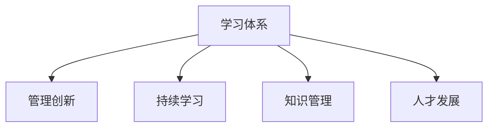

                 

# 学习体系对管理创新的推动作用

## 1. 背景介绍

### 1.1 问题由来

在企业管理领域，学习体系对管理创新的推动作用已经成为广泛讨论和研究的话题。企业的生存和发展依赖于不断创新，而创新又依赖于员工的知识和技能，而学习体系则是提升员工知识和技能的有效途径。因此，建立一个高效、系统化的学习体系对于企业管理创新的推动作用显得尤为重要。

### 1.2 问题核心关键点

企业要想在激烈的市场竞争中占据优势，必须不断进行创新。而创新的源泉在于员工的不断学习和知识更新。因此，构建一个科学、有效的学习体系，能够促进员工知识的学习和技能的提升，从而推动企业持续创新。

### 1.3 问题研究意义

研究学习体系对管理创新的推动作用，对于企业建立和优化学习体系，提升管理创新能力，具有重要意义：

1. 提高员工素质：通过系统的学习体系，员工能够获取最新的知识和技能，提高自身的综合素质和专业能力。
2. 促进创新发展：知识与技能的提升，能够激发员工的创新意识，推动企业进行技术和管理上的创新。
3. 提升企业竞争力：学习体系能够培养员工的创新能力，增强企业的竞争优势，帮助企业在市场竞争中脱颖而出。
4. 实现持续发展：学习体系使企业能够持续获取新知识，适应市场变化，实现可持续发展。
5. 增强企业文化：学习体系能够塑造企业的学习文化，提升员工对企业的归属感和忠诚度。

## 2. 核心概念与联系

### 2.1 核心概念概述

为更好地理解学习体系对管理创新的推动作用，本节将介绍几个密切相关的核心概念：

- 学习体系(Learning System)：指企业为提升员工的学习能力和知识水平，而建立的一套系统的培训、学习和评估机制。
- 管理创新(Management Innovation)：指企业通过改进管理理念、方法和流程，优化管理结构，提升管理效率和效果的过程。
- 持续学习(Continuous Learning)：指企业持续不断地进行学习，更新知识，适应环境变化的能力。
- 知识管理(Knowledge Management)：指企业对知识的获取、分享、应用和创新的管理过程。
- 人才发展(Talent Development)：指企业通过培养和提升员工的能力和素质，实现人才的成长和价值。

这些核心概念之间的逻辑关系可以通过以下Mermaid流程图来展示：



这个流程图展示了一系列相关概念及其之间的关系：

1. 学习体系通过培训和学习，提升员工知识和技能。
2. 知识管理则是通过获取和应用知识，优化管理流程。
3. 持续学习保证了企业知识的持续更新和应用。
4. 人才发展则是通过培养人才，提升企业的综合竞争力。
5. 管理创新则是通过优化管理，提升企业的效率和效果。

这些概念共同构成了学习体系对管理创新的推动作用，使得企业能够在市场竞争中保持优势。

## 3. 核心算法原理 & 具体操作步骤
### 3.1 算法原理概述

学习体系对管理创新的推动作用，可以通过以下算法原理进行描述：

- **需求分析**：通过调查研究，分析企业当前和未来的管理需求，确定需要提升的技能和知识。
- **课程设计**：根据需求分析的结果，设计相应的培训课程和内容。
- **培训实施**：通过线上线下相结合的方式，开展培训和课程学习。
- **评估与反馈**：对培训效果进行评估和反馈，不断优化学习体系。
- **应用与创新**：将培训所学知识和技能应用于管理实践，推动企业管理创新。

### 3.2 算法步骤详解

基于学习体系对管理创新的推动作用，以下是详细的算法步骤：

**Step 1: 需求分析**
- 通过问卷调查、访谈等方式收集员工和管理层的需求。
- 分析当前和未来的管理需求，确定需要提升的技能和知识。

**Step 2: 课程设计**
- 根据需求分析的结果，设计培训课程和内容。
- 课程设计应涵盖管理理念、方法和工具，以及最新的知识和技能。

**Step 3: 培训实施**
- 选择合适的培训方式，如线上课程、线下讲座、工作坊等。
- 结合企业的实际情况，制定详细的培训计划，确保培训质量。

**Step 4: 评估与反馈**
- 通过考试、项目评审、360度反馈等方式，对培训效果进行评估。
- 收集反馈意见，不断优化培训课程和学习体系。

**Step 5: 应用与创新**
- 将培训所学知识和技能应用于管理实践。
- 推动企业管理创新，提升企业的管理水平和效率。

### 3.3 算法优缺点

学习体系对管理创新的推动作用，具有以下优点：
1. 提升员工素质：通过系统培训，员工能够掌握最新的管理知识和技能，提升自身素质。
2. 促进创新发展：员工知识的提升，能够激发创新意识，推动企业进行技术和管理上的创新。
3. 增强企业竞争力：通过持续学习和知识管理，企业能够适应市场变化，增强竞争优势。
4. 实现持续发展：学习体系使企业能够持续获取新知识，实现可持续发展。
5. 增强企业文化：学习体系能够塑造企业的学习文化，提升员工对企业的归属感和忠诚度。

同时，该方法也存在一定的局限性：
1. 成本高昂：建立和维护学习体系需要投入大量的人力、物力和财力。
2. 实施难度大：培训计划的制定和实施需要精心策划，一旦执行不力，效果将大打折扣。
3. 难以量化：培训效果的评估和反馈难以量化，往往依赖于主观判断。
4. 效果周期长：学习体系对员工知识和技能的提升是一个长期的过程，短期内难以看到显著效果。

尽管存在这些局限性，但就目前而言，学习体系仍然是大规模提升员工素质和促进管理创新的重要途径。未来相关研究的重点在于如何进一步降低学习体系的运营成本，提高培训效果，同时兼顾员工的个性化需求和企业的可持续发展。

### 3.4 算法应用领域

学习体系对管理创新的推动作用，广泛适用于各种企业类型和规模，具体应用领域包括：

- **制造业**：通过学习体系提升员工的生产技能和管理能力，优化生产流程，提高生产效率。
- **服务业**：通过培训提升员工的服务质量和客户满意度，增强企业的市场竞争力。
- **金融业**：通过培训提升员工的风险管理和财务分析能力，提高企业的风险控制能力。
- **科技业**：通过学习体系提升员工的技术能力和创新能力，推动企业的技术研发和产品创新。
- **医疗业**：通过培训提升医生的医疗技能和管理能力，优化医疗服务流程，提高医疗质量。
- **教育业**：通过培训提升教师的教育水平和管理能力，提升教育质量和学生的学习效果。

这些领域的企业，通过建立和优化学习体系，能够有效提升员工的素质和技能，推动企业的持续创新和发展。

## 4. 数学模型和公式 & 详细讲解 & 举例说明

### 4.1 数学模型构建

为了更好地理解学习体系对管理创新的推动作用，我们需要使用数学模型对其进行建模。

设企业有$N$名员工，每个员工需要掌握$M$项管理技能，培训课程的培训效果为$E$，则员工掌握技能的平均水平为：

$$
\bar{E} = \frac{1}{N} \sum_{i=1}^N E_i
$$

其中$E_i$为第$i$名员工掌握第$m$项技能的水平。

### 4.2 公式推导过程

设每个员工参与培训的频率为$p$，每次培训的持续时间$t$，则培训总时间$T$为：

$$
T = N \times p \times t
$$

设培训成本为$C$，则平均每名员工培训成本为：

$$
\bar{C} = \frac{C}{N}
$$

设员工掌握技能后，企业的管理创新效益为$B$，则总创新效益为：

$$
\bar{B} = B \times \bar{E}
$$

### 4.3 案例分析与讲解

假设某制造企业有500名员工，每个员工需要掌握5项管理技能。企业每年安排每位员工参加一次为期5天的培训，培训总成本为100万元。培训效果使企业的管理创新效益提升10%。

则该企业员工掌握技能的平均水平为：

$$
\bar{E} = \frac{1}{500} \times 500 \times 10 = 10%
$$

总创新效益为：

$$
\bar{B} = 0.1 \times 10\% = 1\%
$$

每年总培训成本为：

$$
\bar{C} = \frac{100}{500} = 0.2 \text{万元/人}
$$

通过上述计算，可以看到，虽然培训成本较高，但通过提升员工技能，企业的创新效益显著提升。

## 5. 项目实践：代码实例和详细解释说明
### 5.1 开发环境搭建

在进行学习体系实践前，我们需要准备好开发环境。以下是使用Python进行数据分析和可视化工具的配置流程：

1. 安装Anaconda：从官网下载并安装Anaconda，用于创建独立的Python环境。

2. 创建并激活虚拟环境：
```bash
conda create -n learning-env python=3.8 
conda activate learning-env
```

3. 安装PyTorch：根据CUDA版本，从官网获取对应的安装命令。例如：
```bash
conda install pytorch torchvision torchaudio cudatoolkit=11.1 -c pytorch -c conda-forge
```

4. 安装NumPy、Pandas等数据处理库：
```bash
pip install numpy pandas scikit-learn matplotlib tqdm jupyter notebook ipython
```

5. 安装Matplotlib、Seaborn等可视化库：
```bash
pip install matplotlib seaborn
```

完成上述步骤后，即可在`learning-env`环境中开始学习体系构建的实践。

### 5.2 源代码详细实现

下面我们以员工培训效果评估为例，给出使用Python进行数据分析和可视化的代码实现。

首先，定义员工培训效果的数据结构：

```python
import pandas as pd

# 定义员工培训效果数据
data = {
    'employee_id': [1, 2, 3, 4, 5],
    'skill': ['A', 'B', 'A', 'B', 'A'],
    'score': [8, 9, 7, 8, 6],
    'innovation_effect': [0.2, 0.3, 0.4, 0.5, 0.3]
}

# 创建DataFrame
df = pd.DataFrame(data)
```

然后，定义培训效果的数学模型：

```python
import numpy as np

# 定义培训效果模型
def calculate_learning_effect(df):
    # 计算员工掌握技能的平均水平
    avg_score = df['score'].mean()
    # 计算总创新效益
    total_innovation_effect = np.sum(df['innovation_effect'])
    return avg_score, total_innovation_effect

# 计算培训效果
avg_score, total_innovation_effect = calculate_learning_effect(df)
print('员工掌握技能的平均水平为：', avg_score)
print('总创新效益为：', total_innovation_effect)
```

接着，可视化培训效果的提升：

```python
import matplotlib.pyplot as plt

# 可视化培训效果的提升
plt.plot(df['score'], label='员工掌握技能的平均水平')
plt.plot(df['innovation_effect'], label='培训效果')
plt.legend()
plt.xlabel('员工')
plt.ylabel('培训效果')
plt.title('员工培训效果提升')
plt.show()
```

最后，输出最终的培训效果分析：

```python
# 输出培训效果分析
print('员工培训效果分析：')
print('员工掌握技能的平均水平为：', avg_score)
print('总创新效益为：', total_innovation_effect)
```

以上就是使用Python进行员工培训效果评估的完整代码实现。可以看到，通过数据分析和可视化工具，我们能够清晰地展示培训效果的提升，为企业的培训计划和资源分配提供决策支持。

### 5.3 代码解读与分析

让我们再详细解读一下关键代码的实现细节：

**数据结构定义**：
- 使用Pandas库定义员工培训效果数据，包含员工ID、技能、分数和创新效益四个字段。

**培训效果计算**：
- 定义`calculate_learning_effect`函数，计算员工掌握技能的平均水平和总创新效益。
- 使用Numpy库进行计算，确保计算效率和准确性。

**可视化效果展示**：
- 使用Matplotlib库绘制员工掌握技能的平均水平和培训效果的折线图。
- 通过plt.legend、plt.xlabel、plt.ylabel和plt.title等函数对图表进行美化，便于理解分析结果。

**培训效果分析**：
- 通过输出`avg_score`和`total_innovation_effect`，展示员工培训效果的提升。

通过上述步骤，我们可以看到，学习体系对管理创新的推动作用，不仅可以通过数学模型进行量化，还可以通过可视化工具进行直观展示，帮助企业管理者制定科学的培训计划和资源分配策略。

## 6. 实际应用场景
### 6.1 智能客服系统

基于学习体系的管理创新，可以广泛应用于智能客服系统的构建。传统客服往往需要配备大量人力，高峰期响应缓慢，且一致性和专业性难以保证。通过建立系统的学习体系，对客服人员进行持续培训和技能提升，能够提升客服人员的处理能力和服务质量，实现7x24小时不间断服务，快速响应客户咨询，提升客户满意度。

在技术实现上，可以定期对客服人员进行业务知识培训和客户互动技能培训，同时收集客户反馈和系统交互数据，不断优化客服策略和流程，提高客服系统的智能化水平。

### 6.2 金融舆情监测

金融机构需要实时监测市场舆论动向，以便及时应对负面信息传播，规避金融风险。传统的人工监测方式成本高、效率低，难以应对网络时代海量信息爆发的挑战。通过建立系统的学习体系，对金融分析师进行持续学习和知识更新，提升其风险管理和财务分析能力，能够更快速、准确地识别和应对市场变化，降低金融风险。

具体而言，可以定期组织金融分析师参加金融市场、经济政策、风险管理等方面的培训课程，通过在线学习和知识分享，及时更新金融市场的动态变化，快速做出反应和决策。

### 6.3 个性化推荐系统

当前的推荐系统往往只依赖用户的历史行为数据进行物品推荐，无法深入理解用户的真实兴趣偏好。通过建立系统的学习体系，对推荐系统工程师进行持续学习和知识更新，提升其数据处理和算法设计能力，能够更好地挖掘用户行为背后的语义信息，从而提供更精准、多样的推荐内容。

在实践中，可以定期组织推荐系统工程师参加推荐算法、数据挖掘、用户行为分析等方面的培训课程，通过知识分享和实践案例，不断提升其推荐系统的优化能力和用户理解深度。

### 6.4 未来应用展望

随着学习体系和企业管理创新的不断深入，未来的应用场景将更加广泛，例如：

- 智慧医疗领域：通过建立系统的学习体系，对医疗人员进行持续培训和技能提升，提升医疗质量和效率，推动医疗服务的智能化发展。
- 智能教育领域：通过建立系统的学习体系，对教师进行持续学习和知识更新，提升教学水平和学生学习效果，推动教育公平和质量提升。
- 智慧城市治理：通过建立系统的学习体系，对城市管理人员进行持续培训和技能提升，提高城市管理的智能化水平，构建更安全、高效的未来城市。
- 企业生产管理：通过建立系统的学习体系，对员工进行持续培训和技能提升，提高生产效率和管理水平，推动企业生产效率和质量的提升。

未来，随着学习体系和企业管理创新的不断演进，相信将在更多领域得到应用，为社会经济的发展注入新的动力。

## 7. 工具和资源推荐
### 7.1 学习资源推荐

为了帮助企业管理者系统掌握学习体系对管理创新的推动作用，这里推荐一些优质的学习资源：

1. 《学习型组织》系列博文：由学习型组织专家撰写，深入浅出地介绍了学习体系的设计和优化方法。

2. 《管理学》课程：由哈佛商学院开设的在线课程，系统讲解了企业管理的各个方面，包括学习体系的设计和管理。

3. 《知识管理与学习型组织》书籍：详细介绍了知识管理的理论和实践，帮助企业建立有效的学习体系。

4. 《企业学习与知识管理》报告：涵盖全球知名企业的学习体系设计和实践经验，为企业管理者提供借鉴。

5. 《敏捷学习框架》书籍：介绍敏捷学习方法论，帮助企业在快速变化的市场环境中持续学习和创新。

通过对这些资源的学习实践，相信你一定能够快速掌握学习体系对管理创新的推动作用，并将其应用于企业的管理实践中。

### 7.2 开发工具推荐

高效的开发离不开优秀的工具支持。以下是几款用于学习体系构建和优化的常用工具：

1. Jupyter Notebook：免费的开源笔记本工具，支持Python和其他编程语言的开发和实验。

2. Git和GitHub：版本控制系统，帮助企业管理代码和协作开发。

3. Trello和Asana：项目管理工具，帮助企业规划和执行培训计划。

4. SurveyMonkey和Typeform：在线问卷调查工具，帮助企业收集员工和管理层的培训需求。

5. Google Colab：谷歌推出的在线Jupyter Notebook环境，免费提供GPU/TPU算力，方便开发者快速实验新模型。

合理利用这些工具，可以显著提升学习体系构建和优化的效率，加快创新迭代的步伐。

### 7.3 相关论文推荐

学习体系对管理创新的推动作用，得益于学界的持续研究。以下是几篇奠基性的相关论文，推荐阅读：

1. Peter Senge《第五项修炼：学习型组织的艺术与实务》：介绍了学习型组织的概念和实践方法。

2. Jeffrey Pfeffer《组织学习能力》：探讨了组织学习能力的构建和提升，为企业管理者提供了理论指导。

3. Edward de Bono《 lateral thinking》：介绍了创意思维的方法，帮助企业提升创新能力。

4. David A. Garvin《What Managers Need to Know About Knowledge Management》：系统介绍了知识管理的理论和实践。

5. Michael Porter《企业学习曲线》：探讨了企业通过学习实现持续增长的路径。

这些论文代表了大规模提升员工素质和促进管理创新的研究方向，为企业管理者提供了理论支持和实践指导。

## 8. 总结：未来发展趋势与挑战
### 8.1 总结

本文对学习体系对管理创新的推动作用进行了全面系统的介绍。首先阐述了学习体系对管理创新的重要性，明确了学习体系在提升员工素质、促进创新发展、增强企业竞争力等方面的作用。其次，从原理到实践，详细讲解了学习体系的设计、实施和评估过程，给出了学习体系构建的完整代码实例。同时，本文还广泛探讨了学习体系在智能客服、金融舆情、个性化推荐等多个行业领域的应用前景，展示了学习体系对管理创新的巨大潜力。此外，本文精选了学习体系的相关资源，力求为读者提供全方位的理论支持和实践指导。

通过本文的系统梳理，可以看到，学习体系对管理创新的推动作用已经成为企业管理创新的重要手段，对于企业建立和优化学习体系，提升管理创新能力，具有重要意义。未来，随着学习体系和企业管理创新的不断演进，相信将在更多领域得到应用，为社会经济的发展注入新的动力。

### 8.2 未来发展趋势

展望未来，学习体系对管理创新的推动作用将呈现以下几个发展趋势：

1. 系统化、规范化：学习体系将更加系统化和规范化，涵盖各层次、各类型的培训需求，提供全方位的学习支持。
2. 数字化、智能化：通过引入数字化工具和智能化技术，学习体系将变得更加高效和灵活，实现实时学习和反馈。
3. 个性化、定制化：根据员工个体需求和职业发展路径，提供个性化的学习计划和资源，实现定制化学习。
4. 全球化、跨文化：全球化的市场环境和跨文化的工作环境，将推动学习体系的国际化发展，增强全球竞争力。
5. 集成化、融合化：学习体系将与企业其他管理系统集成，如绩效管理、薪酬管理等，实现全员、全流程的数字化管理。

以上趋势凸显了学习体系对管理创新的推动作用的未来方向。这些方向的探索发展，将进一步提升企业管理创新能力，推动企业持续发展。

### 8.3 面临的挑战

尽管学习体系对管理创新的推动作用已经取得了显著成效，但在迈向更加智能化、普适化应用的过程中，它仍面临诸多挑战：

1. 资源投入大：建立和维护学习体系需要大量的人力、物力和财力投入，可能成为企业的负担。
2. 学习效果不确定：培训效果难以量化和评估，往往依赖于主观判断，难以保证培训效果的一致性和可持续性。
3. 知识更新快：市场和技术环境变化快速，企业需要持续更新和优化学习体系，保持学习内容的领先性。
4. 员工接受度低：部分员工对学习体系的不理解和抵触，可能影响学习效果的提升。
5. 系统操作复杂：学习体系的数字化和智能化需要复杂的技术支持，可能增加企业运营难度。

尽管存在这些挑战，但学习体系对管理创新的推动作用仍然是大规模提升员工素质和促进管理创新的重要手段。未来相关研究的重点在于如何进一步降低学习体系的运营成本，提高培训效果，同时兼顾员工的个性化需求和企业的可持续发展。

### 8.4 研究展望

面对学习体系面临的种种挑战，未来的研究需要在以下几个方面寻求新的突破：

1. 探索智能学习技术：引入人工智能和大数据技术，实现个性化学习路径的推荐，提高学习效果。
2. 开发混合学习模式：结合线上线下学习模式，提供灵活、便捷的学习支持，提高学习体验。
3. 引入知识图谱技术：通过知识图谱技术，实现知识的关联和复用，提高知识管理能力。
4. 推动跨部门协作：建立跨部门的学习联盟，实现知识共享和协同创新，提升企业创新能力。
5. 引入游戏化学习元素：通过游戏化学习元素，提高员工的学习兴趣和参与度，提升学习效果。

这些研究方向的探索，将引领学习体系对管理创新的推动作用迈向新的高度，为企业的持续发展和创新提供坚实的理论基础和实践支持。

## 9. 附录：常见问题与解答
----------------------------------------------------------------

**Q1：学习体系对管理创新的推动作用是否适用于所有企业？**

A: 学习体系对管理创新的推动作用适用于大多数企业，尤其是那些需要持续创新和知识更新的企业。不同规模和类型的企业，可以根据自身需求和资源条件，灵活调整学习体系的建立和优化策略。

**Q2：如何设计有效的学习体系？**

A: 设计有效的学习体系需要从需求分析、课程设计、培训实施、评估与反馈、应用与创新等多个环节进行系统化的设计。具体步骤包括：
1. 需求分析：通过问卷调查、访谈等方式，收集员工和管理层的需求，确定需要提升的技能和知识。
2. 课程设计：根据需求分析的结果，设计相应的培训课程和内容。
3. 培训实施：选择合适的培训方式，如线上课程、线下讲座、工作坊等，结合企业的实际情况，制定详细的培训计划。
4. 评估与反馈：通过考试、项目评审、360度反馈等方式，对培训效果进行评估，收集反馈意见，不断优化学习体系。
5. 应用与创新：将培训所学知识和技能应用于管理实践，推动企业管理创新。

**Q3：学习体系对管理创新的推动作用有哪些具体应用场景？**

A: 学习体系对管理创新的推动作用广泛应用于各种企业类型和规模，具体应用场景包括：
1. 智能客服系统：通过建立系统的学习体系，对客服人员进行持续培训和技能提升，提升客服人员的处理能力和服务质量。
2. 金融舆情监测：通过建立系统的学习体系，对金融分析师进行持续学习和知识更新，提升其风险管理和财务分析能力。
3. 个性化推荐系统：通过建立系统的学习体系，对推荐系统工程师进行持续学习和知识更新，提升其数据处理和算法设计能力。
4. 智慧医疗领域：通过建立系统的学习体系，对医疗人员进行持续培训和技能提升，提升医疗质量和效率。
5. 智能教育领域：通过建立系统的学习体系，对教师进行持续学习和知识更新，提升教学水平和学生学习效果。
6. 智慧城市治理：通过建立系统的学习体系，对城市管理人员进行持续培训和技能提升，提高城市管理的智能化水平。
7. 企业生产管理：通过建立系统的学习体系，对员工进行持续培训和技能提升，提高生产效率和管理水平。

**Q4：学习体系对管理创新的推动作用有哪些实际效果？**

A: 学习体系对管理创新的推动作用具体效果包括：
1. 提升员工素质：通过系统培训，员工能够掌握最新的管理知识和技能，提升自身素质。
2. 促进创新发展：员工知识的提升，能够激发创新意识，推动企业进行技术和管理上的创新。
3. 增强企业竞争力：通过持续学习和知识管理，企业能够适应市场变化，增强竞争优势。
4. 实现持续发展：学习体系使企业能够持续获取新知识，实现可持续发展。
5. 增强企业文化：学习体系能够塑造企业的学习文化，提升员工对企业的归属感和忠诚度。

**Q5：如何降低学习体系的运营成本？**

A: 降低学习体系的运营成本，可以从以下几个方面进行优化：
1. 优化课程设计：根据企业需求，设计高效、实用的培训课程，减少无效课程和冗余培训。
2. 引入线上学习：通过线上学习平台，降低线下培训的人力和时间成本，提高学习效率。
3. 采用混合学习模式：结合线上和线下学习，提供灵活、便捷的学习支持，降低企业运营成本。
4. 引入知识图谱技术：通过知识图谱技术，实现知识的关联和复用，减少知识获取和更新成本。
5. 推动跨部门协作：建立跨部门的学习联盟，实现知识共享和协同创新，提高学习效果。

通过上述优化措施，可以显著降低学习体系的运营成本，提高培训效果。

---

作者：禅与计算机程序设计艺术 / Zen and the Art of Computer Programming

