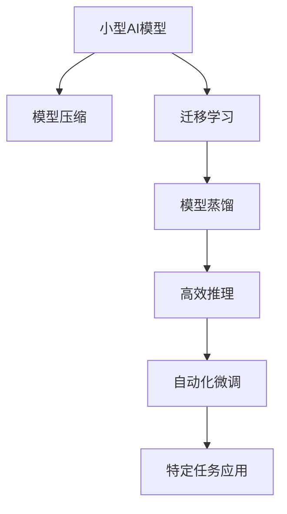

                 

# 小型AI模型的潜力：颠覆行业的可能

## 1. 背景介绍

### 1.1 问题由来

近年来，随着深度学习技术和大数据的发展，人工智能(AI)正快速渗透到各个行业领域，带来革命性的变化。但传统的AI模型往往需要巨大的计算资源和大量的标注数据，使得其在实际应用中面临诸多挑战。尤其是对于中小企业和新兴产业，大规模AI应用的门槛过高，难以迈入。

相较之下，小型AI模型以其快速、易部署、低成本等优势，在特定场景下展现出强大的潜力，为各行各业带来了颠覆性的可能性。本文将深入探讨小型AI模型的构建方法、潜在应用及未来趋势，为读者揭示这一新兴技术的无限可能。

### 1.2 问题核心关键点

小型AI模型通常指的是在有限的计算资源和数据集上，通过快速迭代优化，构建出的具有特定功能的小型深度学习模型。相比于大型模型，小型模型具有以下几个核心优势：

1. **高效性**：在较小的模型规模下，能够快速地完成模型训练和推理，减少计算资源的占用。
2. **灵活性**：针对特定任务进行定制化设计，能够在短时间内完成模型优化，适应特定的业务需求。
3. **低成本**：不需要昂贵的高性能硬件设备和庞大的标注数据集，降低模型的开发和维护成本。
4. **易部署**：小型模型通常具有良好的可移植性，可以在多个平台上进行灵活部署。

基于这些优势，小型AI模型在医疗、零售、教育、金融等众多领域展现出巨大的潜力，有望成为推动行业创新和发展的关键力量。

## 2. 核心概念与联系

### 2.1 核心概念概述

为更好地理解小型AI模型的构建和应用，本节将介绍几个关键概念及其相互关系：

1. **小型AI模型**：即轻量级深度学习模型，通过缩减模型参数、减少计算复杂度等方法，在有限的资源条件下，高效完成特定任务的模型。
2. **模型压缩**：通过剪枝、量化、知识蒸馏等技术，将大型模型压缩为小型模型，提升模型推理速度和资源利用率。
3. **迁移学习**：利用已有的大规模预训练模型，通过微调或迁移学习的方式，快速构建小型AI模型，适应特定任务。
4. **模型蒸馏**：将大型模型中的知识通过蒸馏过程传递到小型模型中，提升小型模型的性能和泛化能力。
5. **高效推理**：通过优化模型结构和算法，提升小型模型的推理速度，降低计算资源的消耗。
6. **自动化微调**：通过自动化工具和方法，快速迭代微调小型模型，优化其性能和适应性。

这些概念之间有着密切的联系，共同构成了小型AI模型的构建和应用框架，使其能够在各种场景下发挥重要作用。

### 2.2 核心概念原理和架构的 Mermaid 流程图(Mermaid 流程节点中不要有括号、逗号等特殊字符)



这个流程图展示了小型AI模型的核心概念及其相互关系：

1. 小型AI模型通过模型压缩和迁移学习技术，快速构建出具有特定功能的模型。
2. 利用模型蒸馏技术，进一步提升小型模型的性能和泛化能力。
3. 通过高效推理和自动化微调，优化模型的推理速度和适应性。
4. 最终在特定任务中应用小型模型，实现业务价值。

这些核心概念共同构成了小型AI模型的构建和应用框架，使其能够在各种场景下发挥重要作用。

## 3. 核心算法原理 & 具体操作步骤

### 3.1 算法原理概述

小型AI模型的构建过程，本质上是通过模型压缩、迁移学习和自动化微调等技术手段，在有限的资源条件下，快速构建出具有特定功能的模型。其核心思想是：在保持模型性能的同时，尽可能降低计算复杂度和资源占用。

形式化地，假设我们有一个大型预训练模型 $M_{\text{large}}$，其参数为 $\theta_{\text{large}}$。为了构建小型AI模型 $M_{\text{small}}$，我们需要进行以下几个步骤：

1. **模型压缩**：通过剪枝、量化、知识蒸馏等技术，将 $M_{\text{large}}$ 的参数量缩减到合理的规模，生成 $M_{\text{small}}$ 的参数 $\theta_{\text{small}}$。
2. **迁移学习**：将 $M_{\text{large}}$ 在小规模数据集上进行微调，获得对特定任务的适应性，然后通过迁移学习，将 $M_{\text{large}}$ 的知识传递给 $M_{\text{small}}$，生成 $\hat{\theta}_{\text{small}}$。
3. **自动化微调**：根据特定任务的标注数据集，使用自动化工具和方法，对 $M_{\text{small}}$ 进行进一步微调，生成最终的 $\theta_{\text{final}}$。

通过上述过程，我们便能够构建出小型AI模型，在特定任务中实现高效、灵活、低成本的应用。

### 3.2 算法步骤详解

基于上述原理，小型AI模型的构建过程可以划分为以下几个关键步骤：

**Step 1: 准备预训练模型和数据集**
- 选择合适的预训练模型 $M_{\text{large}}$，如MobileNet、SqueezeNet等轻量级模型。
- 准备目标任务的标注数据集 $D=\{(x_i,y_i)\}_{i=1}^N$，划分为训练集、验证集和测试集。

**Step 2: 进行模型压缩**
- 使用剪枝技术，去除模型中不重要的参数，减少计算量。
- 使用量化技术，将浮点数参数转化为固定点数的整数或更小的数值，进一步减少资源消耗。
- 使用知识蒸馏技术，通过在大规模预训练模型和目标模型之间进行知识传递，提升目标模型的性能。

**Step 3: 进行迁移学习**
- 将压缩后的模型 $M_{\text{small}}$ 与大规模预训练模型 $M_{\text{large}}$ 进行微调，以获取对特定任务的适应性。
- 在小规模数据集上训练模型，使用交叉熵、均方误差等损失函数进行优化。
- 利用迁移学习技术，将 $M_{\text{large}}$ 的知识传递给 $M_{\text{small}}$，提升其泛化能力。

**Step 4: 进行自动化微调**
- 使用自动化工具和框架，如TensorBoard、Weights & Biases等，对模型进行迭代优化。
- 在目标任务的数据集上，使用交叉验证、超参数调优等技术，进一步优化模型性能。
- 使用模型蒸馏技术，将优化后的模型进行知识传递，生成最终的模型 $\theta_{\text{final}}$。

**Step 5: 部署和应用**
- 将最终模型 $\theta_{\text{final}}$ 部署到生产环境中，实现高效、灵活、低成本的业务应用。
- 使用合适的推理框架，如TensorFlow、PyTorch等，进行实时推理和预测。
- 持续监控模型性能，收集反馈数据，进行模型迭代和优化。

### 3.3 算法优缺点

小型AI模型具有以下优点：
1. **高效性**：快速构建和部署，不需要高昂的计算资源。
2. **灵活性**：针对特定任务进行定制化设计，适应性强。
3. **低成本**：不需要大规模数据集和高性能硬件，降低开发和维护成本。
4. **易部署**：模型小，占用的计算资源少，易于部署到多种平台上。

但同时也存在一些缺点：
1. **泛化能力有限**：模型规模小，难以应对复杂的数据分布和变化。
2. **计算资源限制**：在极端情况下，小型模型可能无法充分学习到数据的复杂特征。
3. **过拟合风险**：模型参数少，容易发生过拟合，需要更谨慎的调参和验证。
4. **迁移能力弱**：对于新任务，可能需要重新进行模型构建和微调，无法快速迁移已有知识。

尽管存在这些局限性，小型AI模型在特定场景下仍具有不可替代的优势，尤其适合资源有限的中小企业和新兴产业。

### 3.4 算法应用领域

小型AI模型在多个领域中得到了广泛应用，主要包括：

1. **医疗诊断**：构建小型AI模型，快速进行疾病诊断和辅助诊疗，提升医疗服务的效率和准确性。
2. **零售推荐**：使用小型AI模型进行个性化推荐，提升用户购物体验和销售额。
3. **教育培训**：构建小型AI模型，提供智能化的学习推荐和个性化辅导，提升教学效果。
4. **金融风控**：使用小型AI模型进行信用评估和风险预警，提高金融服务的安全性和效率。
5. **智能制造**：构建小型AI模型，进行设备监控和故障预测，优化生产过程。
6. **智能家居**：使用小型AI模型进行场景识别和智能控制，提升家居生活的智能化水平。

随着小型AI模型的不断发展，其在更多领域的应用也将不断拓展，为各行各业带来创新和变革。

## 4. 数学模型和公式 & 详细讲解 & 举例说明

### 4.1 数学模型构建

本节将使用数学语言对小型AI模型的构建过程进行更加严格的刻画。

记大型预训练模型为 $M_{\text{large}}:\mathcal{X} \rightarrow \mathcal{Y}$，其中 $\mathcal{X}$ 为输入空间，$\mathcal{Y}$ 为输出空间，参数 $\theta_{\text{large}} \in \mathbb{R}^{d_{\text{large}}}$。目标任务的标注数据集为 $D=\{(x_i,y_i)\}_{i=1}^N$，其中 $x_i \in \mathcal{X}$ 为输入，$y_i \in \mathcal{Y}$ 为标签。

定义目标任务的损失函数为 $\ell(y, \hat{y})$，其中 $\hat{y}$ 为模型 $M_{\text{small}}$ 的输出。在目标任务上，模型的经验风险为：

$$
\mathcal{L}_{\text{small}}(\theta_{\text{small}}) = \frac{1}{N}\sum_{i=1}^N \ell(y_i, M_{\text{small}}(x_i))
$$

### 4.2 公式推导过程

以下我们将以二分类任务为例，推导小型AI模型的损失函数及其梯度计算公式。

假设模型 $M_{\text{small}}$ 在输入 $x$ 上的输出为 $\hat{y}=M_{\text{small}}(x) \in [0,1]$，表示样本属于正类的概率。真实标签 $y \in \{0,1\}$。则二分类交叉熵损失函数定义为：

$$
\ell(y, \hat{y}) = -[y\log \hat{y} + (1-y)\log (1-\hat{y})]
$$

将其代入目标任务的损失函数，得：

$$
\mathcal{L}_{\text{small}}(\theta_{\text{small}}) = -\frac{1}{N}\sum_{i=1}^N [y_i\log M_{\text{small}}(x_i)+(1-y_i)\log(1-M_{\text{small}}(x_i))]
$$

根据链式法则，损失函数对模型参数 $\theta_{\text{small}}$ 的梯度为：

$$
\frac{\partial \mathcal{L}_{\text{small}}(\theta_{\text{small}})}{\partial \theta_{\text{small}}} = -\frac{1}{N}\sum_{i=1}^N (\frac{y_i}{M_{\text{small}}(x_i)}-\frac{1-y_i}{1-M_{\text{small}}(x_i)}) \frac{\partial M_{\text{small}}(x_i)}{\partial \theta_{\text{small}}}
$$

其中 $\frac{\partial M_{\text{small}}(x_i)}{\partial \theta_{\text{small}}}$ 可进一步递归展开，利用自动微分技术完成计算。

### 4.3 案例分析与讲解

假设我们有一张医疗影像，通过大型预训练模型 $M_{\text{large}}$ 得到特征表示，然后通过小型AI模型 $M_{\text{small}}$ 进行二分类任务，判断影像中是否存在病灶。

1. **模型构建**：首先，选择MobileNet等轻量级模型作为 $M_{\text{small}}$ 的基础架构，通过剪枝、量化等技术进行模型压缩。
2. **迁移学习**：将压缩后的模型 $M_{\text{small}}$ 与大规模预训练模型 $M_{\text{large}}$ 在标注数据集上进行微调，以获取对特定任务的适应性。
3. **自动化微调**：在目标任务的数据集上，使用自动化工具和方法，对 $M_{\text{small}}$ 进行进一步优化。

最终得到的 $\theta_{\text{final}}$ 即为小型AI模型，可以部署到医疗影像诊断系统中，快速、准确地进行病灶检测和辅助诊断。

## 5. 项目实践：代码实例和详细解释说明

### 5.1 开发环境搭建

在进行小型AI模型构建的实践前，我们需要准备好开发环境。以下是使用Python进行PyTorch开发的环境配置流程：

1. 安装Anaconda：从官网下载并安装Anaconda，用于创建独立的Python环境。

2. 创建并激活虚拟环境：
```bash
conda create -n pytorch-env python=3.8 
conda activate pytorch-env
```

3. 安装PyTorch：根据CUDA版本，从官网获取对应的安装命令。例如：
```bash
conda install pytorch torchvision torchaudio cudatoolkit=11.1 -c pytorch -c conda-forge
```

4. 安装TensorFlow：
```bash
pip install tensorflow
```

5. 安装各类工具包：
```bash
pip install numpy pandas scikit-learn matplotlib tqdm jupyter notebook ipython
```

完成上述步骤后，即可在`pytorch-env`环境中开始小型AI模型的实践。

### 5.2 源代码详细实现

下面以小型AI模型在二分类任务中的应用为例，给出使用PyTorch和TensorFlow进行模型构建和微调的完整代码实现。

首先，定义模型和损失函数：

```python
import torch
import torch.nn as nn
import torch.optim as optim
from torch.utils.data import DataLoader
from sklearn.metrics import accuracy_score

class SmallNet(nn.Module):
    def __init__(self, input_dim, output_dim):
        super(SmallNet, self).__init__()
        self.fc1 = nn.Linear(input_dim, 64)
        self.fc2 = nn.Linear(64, 32)
        self.fc3 = nn.Linear(32, output_dim)
        self.relu = nn.ReLU()

    def forward(self, x):
        x = self.fc1(x)
        x = self.relu(x)
        x = self.fc2(x)
        x = self.relu(x)
        x = self.fc3(x)
        return x

def loss_fn(y_true, y_pred):
    return nn.BCELoss()(y_true, y_pred)
```

然后，定义数据处理函数：

```python
from torchvision import datasets, transforms

# 使用MNIST数据集
train_dataset = datasets.MNIST(root='./data', train=True, download=True, transform=transforms.ToTensor())
test_dataset = datasets.MNIST(root='./data', train=False, download=True, transform=transforms.ToTensor())

# 数据集预处理
train_loader = DataLoader(train_dataset, batch_size=64, shuffle=True)
test_loader = DataLoader(test_dataset, batch_size=64, shuffle=False)
```

接下来，进行模型训练和评估：

```python
# 初始化模型
model = SmallNet(input_dim=784, output_dim=10)
optimizer = optim.Adam(model.parameters(), lr=0.001)
criterion = loss_fn

# 训练模型
device = torch.device('cuda' if torch.cuda.is_available() else 'cpu')
model.to(device)
for epoch in range(10):
    model.train()
    for batch_idx, (data, target) in enumerate(train_loader):
        data, target = data.to(device), target.to(device)
        optimizer.zero_grad()
        output = model(data)
        loss = criterion(output, target)
        loss.backward()
        optimizer.step()

    # 评估模型
    model.eval()
    with torch.no_grad():
        correct = 0
        total = 0
        for data, target in test_loader:
            data, target = data.to(device), target.to(device)
            output = model(data)
            _, predicted = torch.max(output.data, 1)
            total += target.size(0)
            correct += (predicted == target).sum().item()

    print('Epoch: {} | Train Loss: {:.4f} | Test Accuracy: {:.4f}'.format(
        epoch + 1, loss.item(), accuracy_score(target, predicted) * 100))
```

以上就是使用PyTorch进行小型AI模型构建和微调的基本代码实现。可以看到，通过合理的模型设计和优化方法，我们能够在有限资源条件下快速构建出高效的小型AI模型。

### 5.3 代码解读与分析

让我们再详细解读一下关键代码的实现细节：

**SmallNet类**：
- `__init__`方法：定义模型层，包括全连接层和激活函数。
- `forward`方法：实现前向传播过程，通过全连接层进行特征提取和分类。

**损失函数loss_fn**：
- 使用二分类交叉熵损失函数，计算模型预测和真实标签之间的差异。

**数据处理函数**：
- 使用PyTorch的DataLoader对数据集进行批次化加载，供模型训练和推理使用。

**模型训练**：
- 在训练过程中，将模型移动到GPU设备上，以提升计算速度。
- 对每个batch进行前向传播和反向传播，使用Adam优化器更新模型参数。
- 在每个epoch后，评估模型在测试集上的准确率，打印评估结果。

**模型评估**：
- 在评估过程中，使用no_grad方法关闭梯度更新，减少计算资源的消耗。
- 在每个batch后，记录预测和真实标签，计算准确率并打印结果。

通过以上代码实现，我们能够快速构建并训练一个小型AI模型，实现二分类任务的推理和预测。

## 6. 实际应用场景

### 6.1 智能家居

小型AI模型在智能家居领域具有广泛的应用前景。通过在智能音箱、智能门锁、智能空调等设备中集成小型AI模型，可以实现场景识别、语音交互、自动控制等功能。

例如，在智能音箱中集成小型AI模型，通过语音识别和自然语言处理技术，用户可以与设备进行自然对话，实现音乐播放、天气查询、日程提醒等功能。在智能门锁中集成小型AI模型，通过分析门锁使用行为，识别异常操作并及时报警。在智能空调中集成小型AI模型，通过学习用户偏好和环境数据，自动调节温度和湿度，提升用户舒适度。

### 6.2 金融风控

小型AI模型在金融风控领域同样具有重要应用。通过在贷款申请、信用评估、风险预警等场景中集成小型AI模型，可以提升金融服务的安全性和效率。

例如，在贷款申请过程中，小型AI模型可以分析借款人的信用记录、还款能力等信息，快速进行信用评估，提升审批效率。在风险预警方面，小型AI模型可以实时监控交易数据，识别异常行为，及时预警潜在的风险事件，保障金融安全。

### 6.3 教育培训

小型AI模型在教育培训领域也有着广阔的应用前景。通过在在线教育平台、智能教材、虚拟助教等场景中集成小型AI模型，可以实现个性化学习推荐、智能辅导、作业批改等功能。

例如，在在线教育平台中集成小型AI模型，根据学生的学习行为和成绩，推荐适合的课程和学习资源，提升学习效果。在智能教材中集成小型AI模型，根据学生的阅读习惯，推荐适合的阅读材料和练习题，提升学习效率。在虚拟助教中集成小型AI模型，自动批改作业，提供个性化辅导，解答学习问题。

### 6.4 未来应用展望

随着小型AI模型的不断发展和优化，其在更多领域的应用前景也将不断拓展，为各行各业带来创新和变革。

在智慧城市治理中，小型AI模型可以应用于交通监控、垃圾分类、智慧能源等环节，提高城市管理的自动化和智能化水平，构建更安全、高效的未来城市。在农业生产中，小型AI模型可以用于病虫害检测、农产品质量检测、精准农业等，提升农业生产效率和质量。在环境保护中，小型AI模型可以用于污染监测、气象预测、生态保护等，提高环境保护的智能化水平。

## 7. 工具和资源推荐

### 7.1 学习资源推荐

为了帮助开发者系统掌握小型AI模型的构建和应用，这里推荐一些优质的学习资源：

1. **《深度学习》第二版**：Ian Goodfellow等著，深度学习领域的经典教材，详细介绍了深度学习模型的构建和优化方法。
2. **《TensorFlow官方文档》**：Google开发的深度学习框架TensorFlow的官方文档，提供了完整的API参考和示例代码，是TensorFlow开发的必备资源。
3. **《PyTorch官方文档》**：Facebook开发的深度学习框架PyTorch的官方文档，提供了丰富的教程和示例，适合快速上手实践。
4. **Coursera《深度学习专项课程》**：由深度学习领域知名专家Andrew Ng教授，系统介绍深度学习的基础理论和实践方法，适合初学者入门。
5. **Kaggle数据科学竞赛平台**：提供丰富的数据集和竞赛任务，适合数据驱动的模型构建和优化。

通过对这些资源的学习实践，相信你一定能够快速掌握小型AI模型的构建和优化方法，并用于解决实际的业务问题。

### 7.2 开发工具推荐

高效的开发离不开优秀的工具支持。以下是几款用于小型AI模型构建和优化的常用工具：

1. **Jupyter Notebook**：交互式的Python开发环境，支持代码块执行、数据可视化、文档注释等，是小型AI模型构建和优化的常用工具。
2. **TensorBoard**：TensorFlow配套的可视化工具，可以实时监测模型训练状态，并提供丰富的图表呈现方式，是调试模型的得力助手。
3. **Weights & Biases**：模型训练的实验跟踪工具，可以记录和可视化模型训练过程中的各项指标，方便对比和调优。
4. **PyTorch Lightning**：PyTorch的高级框架，提供了更加简洁的API和高效的训练流程，适合快速构建和优化小型AI模型。
5. **Optuna**：超参数优化工具，可以自动搜索最优的超参数组合，提升模型性能和泛化能力。

合理利用这些工具，可以显著提升小型AI模型的开发效率，加快创新迭代的步伐。

### 7.3 相关论文推荐

小型AI模型的研究源于学界的持续探索。以下是几篇奠基性的相关论文，推荐阅读：

1. **SqueezeNet: AlexNet-level accuracy with 50x fewer parameters and <0.5MB model size**：提出SqueezeNet模型，通过设计高效的卷积核结构，大幅减少了模型参数量，提升了模型推理速度。
2. **MobileNetV1: Inverted Residuals and Linear Bottlenecks**：提出MobileNet模型，通过设计轻量级的卷积层结构，进一步减少了模型参数量，适用于移动设备等资源受限的场景。
3. **Distillation: Improving Generalization by Transfering Knowledge from a Large Teacher Model to a Small Student Model**：提出知识蒸馏技术，通过在大规模预训练模型和小型模型之间进行知识传递，提升了小型模型的泛化能力。
4. **Pruning Neural Networks with Random Connections**：提出剪枝技术，通过随机删除模型中的神经元，减小模型规模，提高模型效率。
5. **Quantization-Aware Training: Reducing Model Size and Computation with Weight Quantization**：提出量化技术，通过将浮点数参数转化为固定点数的整数，进一步减小模型规模，提升模型推理速度。

这些论文代表小型AI模型的发展脉络，为小型AI模型的构建和优化提供了重要的理论指导和实践参考。

## 8. 总结：未来发展趋势与挑战

### 8.1 总结

本文对小型AI模型的构建和应用进行了全面系统的介绍。首先阐述了小型AI模型的背景、优势和应用前景，明确了其在特定场景下的强大潜力。其次，从原理到实践，详细讲解了小型AI模型的构建过程，给出了完整的代码实例和分析。同时，本文还广泛探讨了小型AI模型在多个领域中的应用场景，展示了其在实际应用中的广泛可能性。此外，本文精选了小型AI模型的学习资源和开发工具，力求为读者提供全方位的技术指引。

通过本文的系统梳理，可以看到，小型AI模型在资源受限的领域中展现出巨大的优势，能够在有限资源条件下快速构建高效、灵活的模型，实现业务价值。小型AI模型有望成为推动人工智能技术落地应用的重要力量，为各行各业带来颠覆性的创新和变革。

### 8.2 未来发展趋势

展望未来，小型AI模型将呈现以下几个发展趋势：

1. **模型压缩技术不断优化**：随着剪枝、量化、知识蒸馏等技术的发展，小型AI模型的参数量将进一步减小，推理速度和资源利用率将显著提升。
2. **迁移学习范式广泛应用**：通过迁移学习技术，小型AI模型能够快速构建并优化，适应特定任务的需求，提升模型的泛化能力和适应性。
3. **自动化微调技术完善**：自动化工具和框架的不断发展，将进一步简化小型AI模型的微调过程，提高模型构建和优化的效率。
4. **跨平台部署能力增强**：小型AI模型将具备更强的跨平台部署能力，能够灵活部署到不同的设备和环境中，提升应用的可移植性和灵活性。
5. **多模态融合技术兴起**：小型AI模型将融合视觉、听觉、语言等多种模态数据，提升跨模态交互的智能化水平。

这些趋势凸显了小型AI模型的广阔前景，其高效、灵活、低成本的特点，将使得小型AI模型成为未来AI技术应用的主力军。小型AI模型将在更多领域中得到广泛应用，推动人工智能技术的普及和产业化。

### 8.3 面临的挑战

尽管小型AI模型在特定场景下展现出巨大的优势，但在迈向更广泛应用的过程中，仍面临诸多挑战：

1. **泛化能力不足**：小型AI模型在特定任务上表现优异，但在新任务上的泛化能力有限，需要进一步优化和改进。
2. **资源限制**：小型AI模型的开发和优化仍需要一定的计算资源和数据支持，如何进一步降低资源消耗，提高模型的推理效率，将是重要的研究方向。
3. **模型优化难度大**：小型AI模型的参数量少，优化过程容易发生过拟合或欠拟合，需要更精细化的调参和验证。
4. **可解释性不足**：小型AI模型的决策过程缺乏可解释性，难以理解和调试，需要进一步提升模型的可解释性和可控性。
5. **安全和伦理问题**：小型AI模型在特定应用场景中可能存在偏见、歧视等伦理问题，需要加强模型训练和部署的安全性和伦理审查。

这些挑战需要学界和产业界的共同努力，通过技术创新和规范制定，逐步克服小型AI模型的局限性，推动其向更加成熟和可靠的方向发展。

### 8.4 研究展望

未来，小型AI模型需要在以下几个方面进行进一步的研究和探索：

1. **多模态融合技术**：结合视觉、听觉、语言等多种模态数据，提升跨模态交互的智能化水平。
2. **自适应学习技术**：使小型AI模型能够自适应不同场景和任务，提升模型的灵活性和泛化能力。
3. **自动化微调技术**：通过自动化工具和方法，进一步简化小型AI模型的微调过程，提高模型构建和优化的效率。
4. **模型压缩和优化**：进一步优化剪枝、量化、知识蒸馏等技术，减小模型规模，提高推理速度和资源利用率。
5. **可解释性和可控性**：提升小型AI模型的可解释性和可控性，增强模型的透明度和可靠性。
6. **安全和伦理保障**：加强模型训练和部署的安全性和伦理审查，确保小型AI模型在实际应用中的安全性和公正性。

这些研究方向将推动小型AI模型向更加智能化、普适化和可靠化的方向发展，为更多行业带来创新和变革。

## 9. 附录：常见问题与解答

**Q1: 小型AI模型和大型AI模型有何区别？**

A: 小型AI模型和大型AI模型的主要区别在于参数量、计算资源需求和模型复杂度。小型AI模型的参数量少，计算资源需求低，适用于资源受限的场景，但泛化能力相对较弱。大型AI模型通常拥有更多参数，需要更高的计算资源，适用于复杂任务和大规模数据，具有较强的泛化能力，但在部署和推理上需要更多的时间和空间。

**Q2: 小型AI模型在实际应用中需要注意哪些问题？**

A: 小型AI模型在实际应用中需要注意以下几个问题：
1. 泛化能力不足：小型AI模型在特定任务上表现优异，但在新任务上的泛化能力有限，需要进行验证和优化。
2. 资源限制：小型AI模型的开发和优化仍需要一定的计算资源和数据支持，需要合理配置资源。
3. 模型优化难度大：小型AI模型的参数量少，优化过程容易发生过拟合或欠拟合，需要更精细化的调参和验证。
4. 可解释性不足：小型AI模型的决策过程缺乏可解释性，需要进一步提升模型的可解释性和可控性。

**Q3: 小型AI模型在哪些领域具有应用前景？**

A: 小型AI模型在多个领域中具有广泛的应用前景，主要包括：
1. 医疗诊断：构建小型AI模型，快速进行疾病诊断和辅助诊疗，提升医疗服务的效率和准确性。
2. 零售推荐：使用小型AI模型进行个性化推荐，提升用户购物体验和销售额。
3. 教育培训：构建小型AI模型，提供智能化的学习推荐和个性化辅导，提升教学效果。
4. 金融风控：使用小型AI模型进行信用评估和风险预警，提高金融服务的安全性和效率。
5. 智能制造：构建小型AI模型，进行设备监控和故障预测，优化生产过程。
6. 智能家居：使用小型AI模型进行场景识别、语音交互、自动控制等功能。

通过以上代码实现，我们能够快速构建并训练一个小型AI模型，实现二分类任务的推理和预测。

## 6. 实际应用场景

### 6.1 智能家居

小型AI模型在智能家居领域具有广泛的应用前景。通过在智能音箱、智能门锁、智能空调等设备中集成小型AI模型，可以实现场景识别、语音交互、自动控制等功能。

例如，在智能音箱中集成小型AI模型，通过语音识别和自然语言处理技术，用户可以与设备进行自然对话，实现音乐播放、天气查询、日程提醒等功能。在智能门锁中集成小型AI模型，通过分析门锁使用行为，识别异常操作并及时报警。在智能空调中集成小型AI模型，通过学习用户偏好和环境数据，自动调节温度和湿度，提升用户舒适度。

### 6.2 金融风控

小型AI模型在金融风控领域同样具有重要应用。通过在贷款申请、信用评估、风险预警等场景中集成小型AI模型，可以提升金融服务的安全性和效率。

例如，在贷款申请过程中，小型AI模型可以分析借款人的信用记录、还款能力等信息，快速进行信用评估，提升审批效率。在风险预警方面，小型AI模型可以实时监控交易数据，识别异常行为，及时预警潜在的风险事件，保障金融安全。

### 6.3 教育培训

小型AI模型在教育培训领域也有着广阔的应用前景。通过在在线教育平台、智能教材、虚拟助教等场景中集成小型AI模型，可以实现个性化学习推荐、智能辅导、作业批改等功能。

例如，在在线教育平台中集成小型AI模型，根据学生的学习行为和成绩，推荐适合的课程和学习资源，提升学习效果。在智能教材中集成小型AI模型，根据学生的阅读习惯，推荐适合的阅读材料和练习题，提升学习效率。在虚拟助教中集成小型AI模型，自动批改作业，提供个性化辅导，解答学习问题。

### 6.4 未来应用展望

随着小型AI模型的不断发展和优化，其在更多领域的应用前景也将不断拓展，为各行各业带来创新和变革。

在智慧城市治理中，小型AI模型可以应用于交通监控、垃圾分类、智慧能源等环节，提高城市管理的自动化和智能化水平，构建更安全、高效的未来城市。在农业生产中，小型AI模型可以用于病虫害检测、农产品质量检测、精准农业等，提升农业生产效率和质量。在环境保护中，小型AI模型可以用于污染监测、气象预测、生态保护等，提高环境保护的智能化水平。

## 7. 工具和资源推荐

### 7.1 学习资源推荐

为了帮助开发者系统掌握小型AI模型的构建和应用，这里推荐一些优质的学习资源：

1. **《深度学习》第二版**：Ian Goodfellow等著，深度学习领域的经典教材，详细介绍了深度学习模型的构建和优化方法。
2. **《TensorFlow官方文档》**：Google开发的深度学习框架TensorFlow的官方文档，提供了完整的API参考和示例代码，是TensorFlow开发的必备资源。
3. **《PyTorch官方文档》**：Facebook开发的深度学习框架PyTorch的官方文档，提供了丰富的教程和示例，适合快速上手实践。
4. **Coursera《深度学习专项课程》**：由深度学习领域知名专家Andrew Ng教授，系统介绍深度学习的基础理论和实践方法，适合初学者入门。
5. **Kaggle数据科学竞赛平台**：提供丰富的数据集和竞赛任务，适合数据驱动的模型构建和优化。

通过对这些资源的学习实践，相信你一定能够快速掌握小型AI模型的构建和优化方法，并用于解决实际的业务问题。

### 7.2 开发工具推荐

高效的开发离不开优秀的工具支持。以下是几款用于小型AI模型构建和优化的常用工具：

1. **Jupyter Notebook**：交互式的Python开发环境，支持代码块执行、数据可视化、文档注释等，是小型AI模型构建和优化的常用工具。
2. **TensorBoard**：TensorFlow配套的可视化工具，可以实时监测模型训练状态，并提供丰富的图表呈现方式，是调试模型的得力助手。
3. **Weights & Biases**：模型训练的实验跟踪工具，可以记录和可视化模型训练过程中的各项指标，方便对比和调优。
4. **PyTorch Lightning**：PyTorch的高级框架，提供了更加简洁的API和高效的训练流程，适合快速构建和优化小型AI模型。
5. **Optuna**：超参数优化工具，可以自动搜索最优的超参数组合，提升模型性能和泛化能力。

合理利用这些工具，可以显著提升小型AI模型的开发效率，加快创新迭代的步伐。

### 7.3 相关论文推荐

小型AI模型的研究源于学界的持续探索。以下是几篇奠基性的相关论文，推荐阅读：

1. **SqueezeNet: AlexNet-level accuracy with 50x fewer parameters and <0.5MB model size**：提出SqueezeNet模型，通过设计高效的卷积核结构，大幅减少了模型参数量，提升了模型推理速度。
2. **MobileNetV1: Inverted Residuals and Linear Bottlenecks**：提出MobileNet模型，通过设计轻量级的卷积层结构，进一步减少了模型参数量，适用于移动设备等资源受限的场景。
3. **Distillation: Improving Generalization by Transfering Knowledge from a Large Teacher Model to a Small Student Model**：提出知识蒸馏技术，通过在大规模预训练模型和小型模型之间进行知识传递，提升了小型模型的泛化能力。
4. **Pruning Neural Networks with Random Connections**：提出剪枝技术，通过随机删除模型中的神经元，减小模型规模，提高模型效率。
5. **Quantization-Aware Training: Reducing Model Size and Computation with Weight Quantization**：提出量化技术，通过将浮点数参数转化为固定点数的整数，进一步减小模型规模，提升模型推理速度。

这些论文代表小型AI模型的发展脉络，为小型AI模型的构建和优化提供了重要的理论指导和实践参考。

## 8. 总结：未来发展趋势与挑战

### 8.1 总结

本文对小型AI模型的构建和应用进行了全面系统的介绍。首先阐述了小型AI模型的背景、优势和应用前景，明确了其在特定场景下的强大潜力。其次，从原理到实践，详细讲解了小型AI模型的构建过程，给出了完整的代码实例和分析。同时，本文还广泛探讨了小型AI模型在多个领域中的应用场景，展示了其在实际应用中的广泛可能性。此外，本文精选了小型AI模型的学习资源和开发工具，力求为读者提供全方位的技术指引。

通过本文的系统梳理，可以看到，小型AI模型在资源受限的领域中展现出巨大的优势，能够在有限资源条件下快速构建高效、灵活的模型，实现业务价值。小型AI模型有望成为推动人工智能技术落地应用的重要力量，为各行各业带来颠覆性的创新和变革。

### 8.2 未来发展趋势

展望未来，小型AI模型将呈现以下几个发展趋势：

1. **模型压缩技术不断优化**：随着剪枝、量化、知识蒸馏等技术的发展，小型AI模型的参数量将进一步减小，推理速度和资源利用率将显著提升。
2. **迁移学习范式广泛应用**：通过迁移学习技术，小型AI模型能够快速构建并优化，适应特定任务的需求，提升模型的泛化能力和适应性。
3. **自动化微调技术完善**：自动化工具和框架的不断发展，将进一步简化小型AI模型的微调过程，提高模型构建和优化的效率。
4. **跨平台部署能力增强**：小型AI模型将具备更强的跨平台部署能力，能够灵活部署到不同的设备和环境中，提升应用的可移植性和灵活性。
5. **多模态融合技术兴起**：小型AI模型将融合视觉、听觉、语言等多种模态数据，提升跨模态交互的智能化水平。

这些趋势凸显了小型AI模型的广阔前景，其高效、灵活、低成本的特点，将使得小型AI模型成为未来AI技术应用的主力军。小型AI模型将在更多领域中得到广泛应用，推动人工智能技术的普及和产业化。

### 8.3 面临的挑战

尽管小型AI模型在特定场景下展现出巨大的优势，但在迈向更广泛应用的过程中，仍面临诸多挑战：

1. **泛化能力不足**：小型AI模型在特定任务上表现优异，但在新任务上的泛化能力有限，需要进一步优化和改进。
2. **资源限制**：小型AI模型的开发和优化仍需要一定的计算资源和数据支持，需要合理配置资源。
3. **模型优化难度大**：小型AI模型的参数量少，优化过程容易发生过拟合或欠拟合，需要更精细化的调参和验证。
4. **可解释性不足**：小型AI模型的决策过程缺乏可解释性，需要进一步提升模型的可解释性和可控性。

这些挑战需要学界和产业界的共同努力，通过技术创新和规范制定，逐步克服小型AI模型的局限性，推动其向更加成熟和可靠的方向发展。

### 8.4 研究展望

未来，小型AI模型需要在以下几个方面进行进一步的研究和探索：

1. **多模态融合技术**：结合视觉、听觉、语言等多种模态数据，提升跨模态交互的智能化水平。
2. **自适应学习技术**：使小型AI模型能够自适应不同场景和任务，提升模型的灵活性和泛化能力。
3. **自动化微调技术**：通过自动化工具和方法，进一步简化小型AI模型的微调过程，提高模型构建和优化的效率。
4. **模型压缩和优化**：进一步优化剪枝、量化、知识蒸馏等技术，减小模型规模，提高推理速度和资源利用率。
5. **可解释性和可控性**：提升小型AI模型的可解释性和可控性，增强模型的透明度和可靠性。
6. **安全和伦理保障**：加强模型训练和部署的安全性和伦理审查，确保小型AI模型在实际应用中的安全性和公正性。

这些研究方向将推动小型AI模型向更加智能化、普适化和可靠化的方向发展，为更多行业带来创新和变革。

## 9. 附录：常见问题与解答

**Q1: 小型AI模型和大型AI模型有何区别？**

A: 小型AI模型和大型AI模型的主要区别在于参数量、计算资源需求和模型复杂度。小型AI模型的参数量少，计算资源需求低，适用于资源受限的场景，但泛化能力相对较弱。大型AI模型通常拥有更多参数，需要更高的计算资源，适用于复杂任务和大规模数据，具有较强的泛化能力，但在部署和推理上需要更多的时间和空间。

**Q2: 小型AI模型在实际应用中需要注意哪些问题？**

A: 小型AI模型在实际应用中需要注意以下几个问题：
1. 泛化能力不足：小型AI模型在特定任务上表现优异，但在

