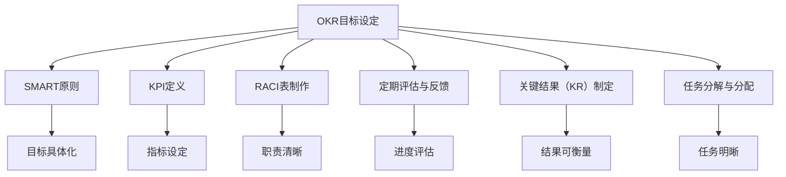

                 

## 1. 背景介绍

### 1.1 问题由来
项目管理的复杂性和多样性使其成为企业管理的核心难点之一。如何在一个高效、可控、透明的环境下完成项目，确保按时交付、质量达标、成本可控，是每个项目经理面临的挑战。巴菲特目标管理法則（OKR，Objectives and Key Results）作为一种高效的项目管理方法，为项目管理的标准化、透明化和高效化提供了有效途径。

### 1.2 问题核心关键点
OKR是一种以目标为驱动，通过明确设定可量化、可衡量的关键结果（Key Results）来提升组织绩效和项目成功概率的管理方法。OKR方法的关键在于目标设定、定期检查进度、透明沟通和持续改进。

### 1.3 问题研究意义
OKR方法论在项目管理中的应用，可以提升项目的透明度和效率，帮助团队集中精力，聚焦关键任务，同时通过定期的反馈和调整，提高项目的成功率。在快速变化的市场环境下，OKR可以帮助企业快速适应外部环境变化，调整战略和策略，确保项目目标的达成。

## 2. 核心概念与联系

### 2.1 核心概念概述
- **OKR（目标和关键结果）**：一种目标设定和追踪方法，通过设定具体、可衡量、可达成的目标，和一系列与之相关的关键结果，来推动项目的进展和绩效提升。
- **SMART原则**：设定目标时需遵循的具体性（Specific）、可衡量性（Measurable）、可达成性（Achievable）、相关性（Relevant）、时限性（Time-bound）五项原则。
- **KPI（关键绩效指标）**：用于衡量关键结果达成情况的指标，如时间进度、成本、质量、客户满意度等。
- **RACI表**：职责分配表，明确每个任务或决策由谁负责、协助、咨询或报告，确保项目管理团队各司其职。
- **定期评估与反馈**：通过定期的回顾会议和评估，确保目标和关键结果的进度符合预期，并根据实际情况调整策略。

这些概念通过OKR这一核心框架有机结合，形成了一套完整、系统化的项目管理方法。

### 2.2 核心概念原理和架构的 Mermaid 流程图



该图展示了OKR流程的核心节点和关键步骤，从目标设定、关键结果制定、指标设定到职责分配、进度评估和任务分解，确保项目管理的全面性和高效性。

## 3. 核心算法原理 & 具体操作步骤
### 3.1 算法原理概述
OKR方法的核心在于设定清晰的目标和关键结果，通过定期的评估和反馈，确保项目按照既定的路径高效推进。算法原理基于SMART原则和KPI指标，通过系统化的目标设定和持续改进，提升项目管理效率和效果。

### 3.2 算法步骤详解
1. **目标设定**：在项目开始时，明确项目的最终目标，确保目标具有具体性、可衡量性、可达成性、相关性和时限性（SMART）。
2. **关键结果制定**：基于目标，制定具体的、可衡量的关键结果，用于衡量目标的达成情况。
3. **指标设定**：为每个关键结果设定关键绩效指标（KPI），如时间进度、成本、质量等。
4. **职责分配**：使用RACI表明确任务和决策的责任人、协助人、咨询人和报告人。
5. **任务分解与分配**：将项目拆分为可管理的子任务，并分配给相应的团队成员或小组。
6. **定期评估与反馈**：设置固定的时间点（如每月、每季度），评估关键结果的达成情况，根据实际情况调整策略。

### 3.3 算法优缺点
**优点**：
- **提高透明度**：OKR方法通过明确的设定和定期评估，提升了项目的透明度，确保每个成员对项目目标和进展都有清晰的了解。
- **聚焦关键任务**：通过关键结果和KPI的设定，帮助团队集中精力在最重要的任务上，提高工作效率。
- **促进持续改进**：定期评估和反馈机制，使得项目团队能够及时发现问题，调整策略，确保项目顺利进行。

**缺点**：
- **依赖经理能力**：OKR的执行效果很大程度上取决于项目经理的目标设定和沟通协调能力。
- **复杂度较高**：对于复杂的项目，目标和关键结果的设定可能需要较多的时间和精力。
- **灵活性受限**：在执行过程中，如果目标和关键结果需要调整，可能影响整体进度。

### 3.4 算法应用领域
OKR方法适用于各种规模和类型的项目，特别是在大型企业、高科技公司和快速迭代的项目中效果显著。例如：
- **软件开发项目**：通过OKR设定软件开发的里程碑和质量标准。
- **市场推广活动**：设定市场推广目标和关键结果，如用户增长、品牌曝光等。
- **新产品开发**：为新产品的研发设定时间表和性能指标。
- **项目管理咨询**：帮助企业构建高效的OKR管理体系，提升项目管理能力。

## 4. 数学模型和公式 & 详细讲解 & 举例说明

### 4.1 数学模型构建
OKR方法主要依赖于定性和定量的结合。目标设定遵循SMART原则，而关键结果和KPI的衡量则使用统计学和数据分析方法。

### 4.2 公式推导过程
以一个软件开发项目为例，目标为“在六个月内推出新功能A”，关键结果设定为“每月完成一个功能模块”，KPI为“每月功能模块的完成度”。假设每月需要完成的功能模块数为$X$，已完成的功能模块数为$Y$，则KPI的计算公式为：

$$ KPI = \frac{Y}{X} $$

### 4.3 案例分析与讲解
假设某软件开发项目的目标是“在六个月内推出新功能A”，关键结果设定为“每月完成一个功能模块”，KPI为“每月功能模块的完成度”。假设每月需要完成的功能模块数为5个，则目标可以表达为：

$$ 目标 = 0.5 \times X $$

其中，$X$为6个月内总共需要完成的功能模块数，即30个。每个功能模块的完成度（KPI）可以通过以下公式计算：

$$ KPI = \frac{Y}{5} $$

例如，如果一个月内完成了3个功能模块，则该月的KPI为：

$$ KPI = \frac{3}{5} = 0.6 $$

通过定期评估KPI，可以及时发现问题，调整策略，确保项目按计划推进。

## 5. 项目实践：代码实例和详细解释说明
### 5.1 开发环境搭建
1. **安装Python**：在项目开始前，确保所有团队成员安装了Python和相关依赖库。
2. **配置环境**：使用virtualenv或conda创建项目虚拟环境，确保项目的依赖隔离。
3. **版本控制**：使用Git进行版本控制，确保代码的追踪和协作。

### 5.2 源代码详细实现

```python
import time

# 目标设定
class Objective:
    def __init__(self, name, description, start_date, end_date):
        self.name = name
        self.description = description
        self.start_date = start_date
        self.end_date = end_date
        self.key_results = []

# 关键结果制定
class KeyResult:
    def __init__(self, name, kpi):
        self.name = name
        self.kpi = kpi
        self.status = 'Not Started'
        self.progress = 0.0

# 定期评估与反馈
class Review:
    def __init__(self, objective):
        self.objective = objective
        self.date = None
        self.status = 'Pending'
        self.reviews = []

    def add_review(self, review):
        self.reviews.append(review)

    def update(self, status):
        self.status = status
        self.date = time.strftime('%Y-%m-%d')

# 创建OKR项目
class OKRProject:
    def __init__(self, name):
        self.name = name
        self.objectives = []
        self.reviews = []

    def add_objective(self, objective):
        self.objectives.append(objective)

    def add_review(self, review):
        self.reviews.append(review)

# 创建目标和关键结果
def create_objective(name, description, start_date, end_date):
    objective = Objective(name, description, start_date, end_date)
    return objective

def create_key_result(name, kpi):
    key_result = KeyResult(name, kpi)
    return key_result

# 执行项目
def execute_project(project):
    for objective in project.objectives:
        for key_result in objective.key_results:
            # 执行关键结果
            pass
```

### 5.3 代码解读与分析
1. **类结构设计**：通过定义`Objective`、`KeyResult`和`Review`等类，清晰地表示OKR项目的各个组成部分。
2. **目标和关键结果的创建**：通过`create_objective`和`create_key_result`函数，方便地创建和管理目标和关键结果。
3. **定期评估与反馈**：通过`Review`类记录定期评估的结果，并使用`add_review`和`update`方法更新状态。
4. **项目执行**：在`execute_project`函数中，遍历目标和关键结果，执行相应的任务。

### 5.4 运行结果展示
项目执行过程中，通过定期评估和反馈，可以调整目标和关键结果，确保项目顺利推进。例如，假设某个目标的KPI为0.6，表示每月需要完成的功能模块数为6个，而实际完成数为3个，则该月的KPI为0.5，需要通过定期评估和反馈调整策略。

## 6. 实际应用场景

### 6.1 软件开发项目管理
在软件开发项目中，OKR方法可以帮助项目团队设定清晰的目标和关键结果，如功能模块的完成时间、代码质量标准、用户测试反馈等。通过定期的评估和反馈，确保项目按时交付，同时提升代码质量和用户体验。

### 6.2 市场营销管理
市场营销团队可以通过OKR方法设定广告投放目标和关键结果，如品牌曝光量、用户转化率、社交媒体互动等。定期评估广告效果，根据反馈调整投放策略，提升市场推广效果。

### 6.3 人力资源管理
人力资源部门可以通过OKR方法设定招聘目标和关键结果，如招聘人数、候选人质量、员工满意度等。定期评估招聘效果，根据反馈优化招聘策略，提升人才管理效率。

### 6.4 未来应用展望
未来，随着技术的不断进步和组织管理的不断创新，OKR方法将在更多领域得到应用。例如：
- **金融风险管理**：通过设定金融产品的收益率、市场波动等关键结果，提升风险管理效率。
- **医疗健康管理**：设定患者满意度、疾病治愈率等关键结果，提升医疗服务质量。
- **环境可持续发展**：设定节能减排目标和关键结果，提升环保绩效。

## 7. 工具和资源推荐
### 7.1 学习资源推荐
1. **《OKR：目标管理与执行》书籍**：详细介绍了OKR方法的原理和实践，适合初学者和项目经理阅读。
2. **OKR在线课程**：如Coursera和edX等平台提供的OKR管理课程，深入浅出地讲解OKR的设定和执行。
3. **OKR工具软件**：如Okropy、Jira、Trello等，提供OKR目标设定和跟踪的在线工具。

### 7.2 开发工具推荐
1. **版本控制工具**：如Git、SVN等，确保代码的追踪和协作。
2. **项目管理工具**：如Jira、Trello等，提供目标设定、任务管理和进度跟踪功能。
3. **协作工具**：如Slack、Microsoft Teams等，方便团队成员之间的沟通和协作。

### 7.3 相关论文推荐
1. **OKR方法论研究**：如《The OKR Method: A Systematic Approach for Team Goals》。
2. **项目管理工具的OKR集成**：如《Integrating OKR with Project Management Tools: A Case Study》。

## 8. 总结：未来发展趋势与挑战
### 8.1 研究成果总结
OKR方法在项目管理中的应用已经取得了显著的效果，特别是在提升透明度、聚焦关键任务和促进持续改进方面表现突出。随着OKR方法论的不断发展和完善，其在项目管理中的应用范围将进一步扩大，为企业提供更高效的项目管理手段。

### 8.2 未来发展趋势
1. **工具和技术的创新**：随着AI、大数据和云计算等技术的发展，OKR工具和系统将更加智能化和自动化，提升项目管理效率。
2. **跨组织协作的加强**：OKR方法将进一步促进跨组织、跨部门的协作，提升企业整体的管理水平。
3. **灵活性和敏捷性的提升**：OKR方法将更好地支持敏捷项目管理，适应快速变化的市场环境。

### 8.3 面临的挑战
1. **数据质量和准确性**：OKR方法依赖于数据的准确性和完整性，如何提升数据质量是一个重要挑战。
2. **执行力和文化**：OKR方法的成功实施依赖于团队成员的执行力和组织的文化支持。
3. **持续改进的难度**：在项目执行过程中，如何持续改进目标和关键结果，确保OKR方法的有效性，需要更多的实践和探索。

### 8.4 研究展望
未来，OKR方法需要在以下几个方面进行深入研究：
1. **数据驱动的OKR管理**：利用AI和大数据技术，提升OKR数据的质量和准确性。
2. **自动化和智能化**：开发更加智能化的OKR管理工具，提升项目管理效率。
3. **跨组织协作的优化**：探索如何更好地支持跨组织、跨部门的协作，提升企业整体的管理水平。

## 9. 附录：常见问题与解答

**Q1：OKR和KPI有什么区别？**

A: OKR（目标和关键结果）是一种目标管理方法，强调设定清晰、可达成的目标和相关的关键结果。而KPI（关键绩效指标）是用来衡量关键结果达成情况的指标，如时间进度、成本、质量等。OKR关注的是目标和结果，KPI关注的是结果的具体表现。

**Q2：OKR方法是否适用于小型团队？**

A: OKR方法适用于各种规模的团队，包括小型团队。通过设定明确的目标和关键结果，可以提升小型团队的管理效率和协作水平。

**Q3：OKR如何处理目标和关键结果的调整？**

A: OKR方法强调定期评估和反馈，根据实际情况调整目标和关键结果。如果目标和关键结果需要调整，项目团队可以根据评估结果进行相应调整，确保项目按计划推进。

**Q4：OKR方法是否适用于短期项目？**

A: OKR方法适用于短期和长期项目。通过设定明确的短期目标和关键结果，可以提升项目的执行效率和成功率。

**Q5：OKR方法的执行效果如何衡量？**

A: OKR方法的执行效果可以通过定期评估和反馈来衡量。项目团队可以根据设定的目标和关键结果，评估项目的进度和结果，根据评估结果调整策略，确保项目按计划推进。

---

作者：禅与计算机程序设计艺术 / Zen and the Art of Computer Programming

