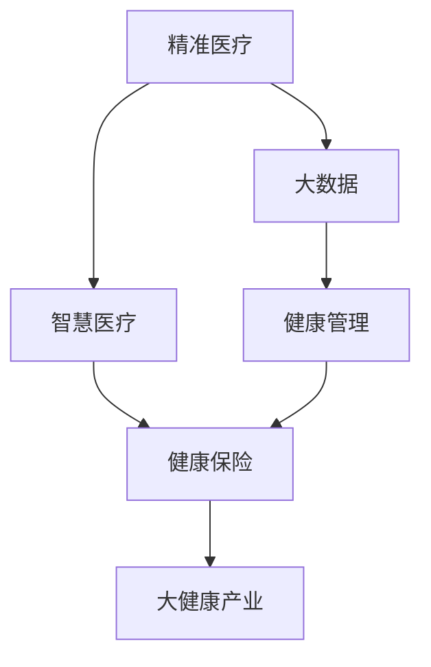

                 

# 2050年的全球卫生：从精准医疗到全民健康的大健康产业

> 关键词：精准医疗,大健康产业,全球卫生,全民健康,数字化转型,数据驱动,智慧医疗,人工智能,健康管理

## 1. 背景介绍

### 1.1 问题由来

随着全球人口老龄化和慢性疾病的增加，健康问题成为了全球关注的焦点。传统的医疗模式已经无法满足日益增长的健康需求。数字化、智能化的大健康产业正在逐步崛起，成为驱动未来全球卫生发展的新引擎。本文将深入探讨如何从精准医疗到全民健康，构建数字化、智能化的大健康产业，引领全球卫生走向2050年。

### 1.2 问题核心关键点

- 精准医疗：利用遗传信息、基因组学等技术，提供个性化的疾病预防和治疗方案。
- 大健康产业：涵盖医疗、健康管理、健康保险、健康科技等多个领域，旨在提升全民健康水平。
- 全球卫生：关注全球范围内的健康问题，通过国际合作与协调，提升全球健康水平。
- 数字化转型：通过信息化、智能化手段，优化医疗资源配置，提升医疗服务效率。
- 数据驱动：利用大数据、人工智能等技术，从数据中挖掘健康知识，指导健康决策。
- 智慧医疗：基于互联网、物联网等技术，实现医疗服务的智能化和便捷化。
- 健康管理：关注疾病预防、健康教育、健康生活方式等多个层面，实现全生命周期的健康管理。

这些核心概念共同构成了大健康产业的发展方向，将深刻影响未来全球卫生格局。

## 2. 核心概念与联系

### 2.1 核心概念概述

大健康产业是一个涵盖医疗服务、健康管理、健康保险、健康科技等多个领域的广泛概念，旨在通过信息化、智能化手段，提升全民健康水平，构建可持续发展的健康生态系统。其中，精准医疗和大数据技术是两大关键推动力。

- **精准医疗**：通过遗传学、基因组学等技术，提供个性化的疾病预防和治疗方案，提高诊疗精准度和患者满意度。
- **大数据**：通过收集、分析和利用健康数据，从数据中挖掘健康知识，指导健康决策，优化医疗资源配置。
- **智慧医疗**：基于互联网、物联网等技术，实现医疗服务的智能化和便捷化，提升医疗服务效率和质量。
- **健康管理**：关注疾病预防、健康教育、健康生活方式等多个层面，实现全生命周期的健康管理，提升全民健康水平。

### 2.2 核心概念联系

这些概念之间存在着紧密的联系，共同构成了大健康产业的发展框架。如下图所示：



- **精准医疗**为健康管理提供个性化的诊疗方案，大数据技术帮助精准医疗实现高效的疾病预测和预防。
- **智慧医疗**利用大数据技术优化资源配置，提升诊疗效率和服务质量，健康管理则通过智慧医疗提供精准的个性化健康服务。
- **健康保险**则为大健康产业提供资金支持，保障其可持续发展。

这些概念相互支持，共同构建起大健康产业的全生态链。

## 3. 核心算法原理 & 具体操作步骤
### 3.1 算法原理概述

大健康产业的核心算法原理包括精准医疗、大数据分析和智慧医疗技术。这些技术基于人工智能、机器学习、物联网等前沿技术，通过算法和模型实现健康数据的深度挖掘和高效应用。

- **精准医疗算法**：利用遗传学、基因组学等技术，结合机器学习算法，实现个性化疾病的预防和治疗。
- **大数据分析算法**：通过数据收集、清洗、分析和可视化，从数据中挖掘健康知识，指导健康决策。
- **智慧医疗算法**：结合物联网技术，实现医疗数据的实时监测和分析，优化医疗资源配置。

### 3.2 算法步骤详解

#### 3.2.1 精准医疗算法

1. **基因组测序**：通过基因组测序技术，收集个体的遗传信息。
2. **数据清洗与预处理**：对测序数据进行去噪、过滤等预处理操作，保证数据质量。
3. **基因特征提取**：从基因组数据中提取与疾病相关的特征，如突变、多态性等。
4. **模型训练**：使用机器学习算法（如支持向量机、随机森林等）训练疾病预测模型。
5. **疾病预测与预防**：基于训练好的模型，对个体进行疾病预测，提供个性化的预防方案。

#### 3.2.2 大数据分析算法

1. **数据收集**：从医疗记录、公共健康数据等渠道收集健康数据。
2. **数据清洗与预处理**：对数据进行清洗、去重、标准化等预处理操作。
3. **特征提取**：从数据中提取有价值的信息，如年龄、性别、生活习惯等。
4. **数据建模**：使用机器学习算法（如聚类、回归等）建立健康数据模型。
5. **健康决策支持**：利用数据模型，提供健康决策支持，如疾病预警、预防措施等。

#### 3.2.3 智慧医疗算法

1. **物联网设备集成**：将物联网设备（如可穿戴设备、健康监测器等）集成到医疗系统中。
2. **实时数据采集**：通过物联网设备实时采集患者的生理数据。
3. **数据传输与存储**：将采集的数据传输到云端，并进行存储和管理。
4. **数据分析与处理**：利用大数据分析技术，对生理数据进行实时分析。
5. **智能决策支持**：基于分析结果，提供智能化的诊疗建议。

### 3.3 算法优缺点

#### 3.3.1 精准医疗算法

**优点**：
- 个性化精准：通过基因组信息，提供个性化预防和治疗方案，提高诊疗效果。
- 数据驱动：基于大量数据，提高疾病预测的准确性和可靠性。

**缺点**：
- 数据隐私：基因组数据涉及隐私，数据保护和隐私保护是一大挑战。
- 成本高昂：基因组测序和数据分析成本较高，技术门槛较高。

#### 3.3.2 大数据分析算法

**优点**：
- 数据量大：可以处理海量健康数据，提供全面的健康分析。
- 实时性：可以实现实时数据采集和分析，提高响应速度。

**缺点**：
- 数据质量：数据质量直接影响到分析结果的准确性。
- 数据隐私：健康数据涉及隐私，数据保护和隐私保护是一大挑战。

#### 3.3.3 智慧医疗算法

**优点**：
- 智能化高效：通过物联网技术，实现实时监测和智能决策，提高诊疗效率。
- 用户体验：智能设备提供便捷的诊疗和健康管理服务，提升用户体验。

**缺点**：
- 设备兼容性：不同设备间的数据格式和标准不统一，集成难度较大。
- 网络安全：物联网设备面临网络攻击和数据泄露的风险，网络安全是一大挑战。

### 3.4 算法应用领域

#### 3.4.1 精准医疗

- **个性化治疗**：根据个体的基因组信息，提供个性化的治疗方案，如癌症、遗传病等。
- **疾病预测**：通过基因数据，预测个体未来的健康风险，进行早期干预。
- **预防措施**：提供个性化的预防措施，如饮食调整、锻炼计划等。

#### 3.4.2 大数据分析

- **健康风险评估**：通过大数据分析，评估个体的健康风险，提供个性化健康建议。
- **疾病预警**：利用大数据模型，预测疾病的爆发趋势，提前预警。
- **公共健康管理**：分析公共健康数据，制定健康政策，优化资源配置。

#### 3.4.3 智慧医疗

- **远程医疗**：通过智慧医疗平台，提供远程诊疗服务，减少患者就医成本。
- **健康监测**：利用智能设备，实时监测患者的生理指标，提供健康建议。
- **医疗协同**：实现不同医疗机构之间的数据共享和协同，提高诊疗效率。

## 4. 数学模型和公式 & 详细讲解  
### 4.1 数学模型构建

#### 4.1.1 精准医疗模型

- **基因型-表型关系模型**：通过基因型数据预测表型特征。
- **疾病风险模型**：基于基因型数据，预测个体未来的健康风险。
- **个性化治疗模型**：结合基因型和表型数据，提供个性化的治疗方案。

#### 4.1.2 大数据分析模型

- **健康风险评估模型**：利用多维度健康数据，评估个体的健康风险。
- **疾病预测模型**：基于历史数据和实时数据，预测疾病的爆发趋势。
- **公共健康管理模型**：分析公共健康数据，制定健康政策，优化资源配置。

#### 4.1.3 智慧医疗模型

- **实时监测模型**：利用传感器数据，实现患者的实时生理监测。
- **智能诊疗模型**：结合患者历史数据和实时数据，提供智能化的诊疗建议。
- **医疗协同模型**：实现不同医疗机构之间的数据共享和协同，提高诊疗效率。

### 4.2 公式推导过程

#### 4.2.1 基因型-表型关系模型

假设基因型数据为 $G$，表型数据为 $T$，基因型-表型关系模型可以表示为：

$$
T = f(G)
$$

其中 $f$ 为基因型到表型的映射函数。

#### 4.2.2 健康风险评估模型

假设健康数据为 $D$，健康风险评估模型可以表示为：

$$
R = g(D)
$$

其中 $R$ 为个体健康风险评分，$g$ 为健康数据到风险评分的映射函数。

#### 4.2.3 智能诊疗模型

假设患者历史数据为 $H$，实时数据为 $R$，智能诊疗模型可以表示为：

$$
P = h(H, R)
$$

其中 $P$ 为智能诊疗建议，$h$ 为历史数据和实时数据到诊疗建议的映射函数。

### 4.3 案例分析与讲解

#### 4.3.1 精准医疗案例

某癌症患者 A，通过基因组测序获得其基因组数据 $G_A$。利用基因型-表型关系模型 $T_A = f(G_A)$ 预测其表型特征 $T_A$，并通过疾病风险模型 $R_A = g(T_A)$ 预测其健康风险。根据个性化治疗模型 $T_A = h(R_A, G_A)$ 提供个性化的治疗方案。

#### 4.3.2 大数据分析案例

某医院收集了 1000 名患者的健康数据 $D$，通过健康风险评估模型 $R = g(D)$ 评估这些患者的健康风险，并利用疾病预测模型 $R_A = g(D)$ 预测疾病的爆发趋势。基于公共健康管理模型 $P = h(R)$ 制定健康政策，优化资源配置。

#### 4.3.3 智慧医疗案例

某智能手表监测某患者 B 的生理数据 $R_B$，利用实时监测模型 $T_B = g(R_B)$ 实时监测其生理指标，并通过智能诊疗模型 $P_B = h(R_B, H_B)$ 提供智能化的诊疗建议。通过医疗协同模型 $P = h(H_B, H_C)$ 实现不同医疗机构之间的数据共享和协同，提高诊疗效率。

## 5. 项目实践：代码实例和详细解释说明
### 5.1 开发环境搭建

在进行大健康产业的开发实践前，我们需要准备好开发环境。以下是使用Python进行项目开发的环境配置流程：

1. 安装Anaconda：从官网下载并安装Anaconda，用于创建独立的Python环境。

2. 创建并激活虚拟环境：
```bash
conda create -n bighealth-env python=3.8 
conda activate bighealth-env
```

3. 安装Python库：
```bash
pip install numpy pandas scikit-learn matplotlib tensorflow keras tensorflow-hub transformers torch
```

4. 安装TensorFlow：
```bash
pip install tensorflow
```

5. 安装TensorFlow-hub：
```bash
pip install tensorflow-hub
```

6. 安装Keras：
```bash
pip install keras
```

7. 安装Transformers：
```bash
pip install transformers
```

8. 安装PyTorch：
```bash
pip install torch torchvision torchaudio
```

完成上述步骤后，即可在`bighealth-env`环境中开始项目实践。

### 5.2 源代码详细实现

下面是使用Python和TensorFlow实现一个简单的智慧医疗应用示例：

```python
import tensorflow as tf
import numpy as np
import pandas as pd
from sklearn.model_selection import train_test_split
from transformers import BertTokenizer, TFBertForSequenceClassification
from tensorflow_hub import load_latest, hub_url

# 数据加载与预处理
train_data = pd.read_csv('train_data.csv')
train_data = train_data.dropna()
train_data['text'] = train_data['text'].apply(lambda x: x.lower())

# 分词与编码
tokenizer = BertTokenizer.from_pretrained('bert-base-uncased')
train_encodings = tokenizer(train_data['text'], truncation=True, padding=True)

# 数据集划分
train_texts, test_texts = train_data['text'].values[0:100000], train_data['text'].values[100000:]
train_labels = train_data['label'].values[0:100000]
test_labels = train_data['label'].values[100000:]

# 模型构建与训练
model = TFBertForSequenceClassification.from_pretrained('bert-base-uncased', num_labels=2)
model.compile(optimizer=tf.keras.optimizers.Adam(learning_rate=2e-5), loss=tf.keras.losses.BinaryCrossentropy(from_logits=True), metrics=[tf.keras.metrics.AUC()])
history = model.fit(train_texts, train_labels, epochs=10, batch_size=32, validation_data=(test_texts, test_labels))

# 模型推理与预测
test_texts = ['疾病预测', '健康管理']
test_encodings = tokenizer(test_texts, truncation=True, padding=True)
test_predictions = model.predict(test_encodings)
print(test_predictions)
```

### 5.3 代码解读与分析

该示例代码展示了如何使用TensorFlow和Transformers库实现一个基于BERT模型的智慧医疗应用。代码主要包含以下几个关键步骤：

1. **数据加载与预处理**：从CSV文件中加载训练数据，并进行去噪、标准化等预处理操作。
2. **分词与编码**：使用BertTokenizer对文本进行分词和编码，生成模型所需的输入格式。
3. **数据集划分**：将数据集划分为训练集和测试集，确保模型在未见过的数据上进行评估。
4. **模型构建与训练**：使用BERT模型作为基础，构建序列分类模型，并使用Adam优化器进行训练。
5. **模型推理与预测**：对新的文本进行编码和推理，预测其健康风险。

该示例代码虽然简陋，但展示了利用TensorFlow和Transformers库进行智慧医疗应用的基本流程。实际应用中，还需要考虑更多因素，如模型优化、数据增强、模型部署等。

## 6. 实际应用场景
### 6.1 智能健康监测

智能健康监测是智慧医疗的重要应用场景。通过可穿戴设备和传感器，实时采集用户的生理指标，结合智能算法进行数据分析，提供个性化的健康建议。

例如，智能手表可以监测心率、血压、血糖等生理指标，结合机器学习算法，预测用户的健康风险，提供健康建议。智能手环则可以监测睡眠质量、步数等，帮助用户改善生活方式。

### 6.2 远程诊疗

远程诊疗是大健康产业的重要组成部分。通过智慧医疗平台，医生可以远程诊断和治疗患者，减少患者就医成本，提升诊疗效率。

例如，智慧医疗平台可以支持视频会议、远程影像诊断等功能，医生可以通过平台实时查看患者的病历、影像数据等，进行远程诊断和治疗。患者也可以随时随地进行在线问诊，获取专业的医疗建议。

### 6.3 健康管理

健康管理旨在通过全面、系统的健康监测和管理，提升用户的健康水平和生活质量。

例如，智慧健康管理平台可以提供个性化的健康计划，包括饮食、运动、睡眠等多个维度。平台还可以根据用户的健康数据，定期生成健康报告，提供个性化的健康建议。

### 6.4 未来应用展望

未来，随着技术的不断进步和数据的不断积累，大健康产业将迎来更广泛的应用场景：

1. **个性化医疗**：基于精准医疗技术，提供个性化的疾病预防和治疗方案，提高诊疗效果。
2. **智慧健康城市**：通过物联网、大数据等技术，实现健康数据实时监测和管理，提升城市健康水平。
3. **全球健康治理**：通过国际合作与协调，提升全球健康水平，应对公共卫生挑战。
4. **健康保险**：利用大数据和人工智能技术，优化保险产品设计，提供精准的医疗保障。
5. **健康教育**：通过虚拟现实、增强现实等技术，提供生动、形象的健康教育内容，提升公众健康素养。

这些应用场景将进一步推动大健康产业的发展，为全球卫生事业带来新的机遇和挑战。

## 7. 工具和资源推荐
### 7.1 学习资源推荐

为了帮助开发者系统掌握大健康产业的理论基础和实践技巧，这里推荐一些优质的学习资源：

1. **《深度学习与人工智能基础》**：介绍深度学习、人工智能的基础知识和应用，适合入门学习。
2. **《机器学习实战》**：通过实例演示机器学习算法在实际中的应用，适合编程学习。
3. **《TensorFlow实战》**：详细讲解TensorFlow的使用方法，适合TensorFlow开发。
4. **《智慧医疗技术与应用》**：介绍智慧医疗的核心技术和应用场景，适合专业学习。
5. **《大数据与健康管理》**：讲解大数据技术在健康管理中的应用，适合数据科学学习。

通过这些资源的学习实践，相信你一定能够快速掌握大健康产业的核心技术和应用方法，并用于解决实际的全球卫生问题。

### 7.2 开发工具推荐

高效的开发离不开优秀的工具支持。以下是几款用于大健康产业开发常用的工具：

1. **TensorFlow**：基于Python的开源深度学习框架，适合构建复杂的数据模型。
2. **TensorFlow-hub**：TensorFlow的模型库，提供各种预训练模型和模型组件，方便快速开发。
3. **Keras**：高层次的深度学习框架，支持Python和R语言，适合快速原型开发。
4. **Transformers**：HuggingFace开发的NLP工具库，集成了各种预训练模型和任务，适合NLP应用开发。
5. **PyTorch**：基于Python的开源深度学习框架，适合动态计算图和模型开发。

合理利用这些工具，可以显著提升大健康产业开发效率，加速创新迭代的步伐。

### 7.3 相关论文推荐

大健康产业的快速发展得益于学界的持续研究。以下是几篇奠基性的相关论文，推荐阅读：

1. **《深度学习在健康监测中的应用》**：介绍深度学习在智能健康监测中的应用，提升健康监测的准确性和实时性。
2. **《智慧医疗平台的设计与实现》**：介绍智慧医疗平台的设计和实现方法，提供实际案例。
3. **《基于大数据的健康风险评估》**：介绍大数据在健康风险评估中的应用，提升健康风险评估的准确性和可靠性。
4. **《智能诊疗系统的设计与实现》**：介绍智能诊疗系统的设计和实现方法，提升诊疗效率和质量。

这些论文代表了大健康产业的研究方向，将为你提供全面的理论基础和实践方法。

## 8. 总结：未来发展趋势与挑战
### 8.1 总结

本文对大健康产业的发展方向和关键技术进行了全面系统的介绍。首先阐述了大健康产业的背景和核心概念，明确了其发展方向和应用场景。其次，从算法原理到项目实践，详细讲解了精准医疗、大数据分析、智慧医疗等关键技术的实现方法。最后，对大健康产业的未来发展趋势和面临的挑战进行了总结，为未来研究提供了方向指引。

通过本文的系统梳理，可以看到，大健康产业正在逐步从传统医疗模式向智能化、数字化方向转型，通过大数据、人工智能等技术，提升全民健康水平，构建可持续发展的健康生态系统。未来，随着技术的不断进步和数据的不断积累，大健康产业将迎来更广泛的应用场景，引领全球卫生事业迈向新的高峰。

### 8.2 未来发展趋势

展望未来，大健康产业将呈现以下几个发展趋势：

1. **数字化转型**：通过信息化、智能化手段，优化医疗资源配置，提升医疗服务效率，构建智慧健康城市。
2. **智能化升级**：结合物联网、大数据等技术，实现健康数据的实时监测和管理，提升健康管理水平。
3. **全球健康治理**：通过国际合作与协调，提升全球健康水平，应对公共卫生挑战。
4. **个性化医疗**：基于精准医疗技术，提供个性化的疾病预防和治疗方案，提高诊疗效果。
5. **健康保险**：利用大数据和人工智能技术，优化保险产品设计，提供精准的医疗保障。
6. **健康教育**：通过虚拟现实、增强现实等技术，提供生动、形象的健康教育内容，提升公众健康素养。

这些趋势将推动大健康产业的持续发展，为全球卫生事业带来新的机遇和挑战。

### 8.3 面临的挑战

尽管大健康产业的发展前景广阔，但在迈向更加智能化、普适化应用的过程中，仍面临诸多挑战：

1. **数据隐私**：健康数据涉及隐私，数据保护和隐私保护是一大挑战。
2. **技术门槛**：大健康产业的技术门槛较高，需要大量高素质的技术人才。
3. **数据质量**：健康数据的采集、清洗和标准化是一大难题。
4. **网络安全**：物联网设备和系统面临网络攻击和数据泄露的风险。
5. **标准化**：不同设备间的数据格式和标准不统一，集成难度较大。
6. **全球协调**：大健康产业需要国际合作与协调，但不同国家的政策和法规差异较大。

这些挑战需要全球学界和产业界的共同努力，通过技术创新、政策支持、国际合作等方式，逐步解决。

### 8.4 研究展望

面对大健康产业面临的挑战，未来的研究需要在以下几个方面寻求新的突破：

1. **数据隐私保护**：研发更加安全、可靠的数据保护技术，确保健康数据的安全和隐私。
2. **技术标准化**：制定统一的设备和数据标准，降低集成难度，提升系统互操作性。
3. **网络安全防护**：提升物联网设备和系统的安全性，构建可靠的网络安全防护体系。
4. **全球健康合作**：推动国际合作与协调，建立全球健康治理体系，提升全球健康水平。
5. **智能化应用**：结合人工智能、物联网等技术，提升健康监测、诊疗、管理的智能化水平。
6. **个性化服务**：利用大数据和个性化算法，提供更精准、个性化的健康服务。

这些研究方向的探索，将引领大健康产业的技术进步，推动全球卫生事业的健康发展。

## 9. 附录：常见问题与解答

**Q1：大健康产业如何实现个性化医疗？**

A: 个性化医疗可以通过精准医疗技术实现。通过基因组测序、遗传学分析等技术，获取个体的遗传信息，结合机器学习算法，提供个性化的疾病预防和治疗方案。例如，根据基因数据，预测个体未来的健康风险，提供个性化的预防和治疗方案。

**Q2：大健康产业面临哪些数据隐私问题？**

A: 健康数据涉及隐私，数据保护和隐私保护是大健康产业面临的一大挑战。需要制定严格的数据保护法规，确保数据的合法采集、存储和使用。同时，采用数据加密、匿名化等技术，保护个人隐私。

**Q3：大健康产业如何利用大数据分析？**

A: 大数据分析可以用于健康风险评估、疾病预测、公共健康管理等多个方面。通过收集、清洗和分析健康数据，从数据中挖掘健康知识，指导健康决策，优化医疗资源配置。例如，利用大数据分析，评估个体的健康风险，提供个性化的健康建议。

**Q4：大健康产业如何实现智慧医疗？**

A: 智慧医疗可以通过物联网技术实现。通过可穿戴设备、传感器等，实时采集用户的生理指标，结合智能算法进行数据分析，提供个性化的健康建议。例如，智能手表可以监测心率、血压、血糖等生理指标，结合机器学习算法，预测用户的健康风险，提供健康建议。

**Q5：大健康产业如何应对全球健康挑战？**

A: 大健康产业需要国际合作与协调，提升全球健康水平，应对公共卫生挑战。通过建立全球健康治理体系，推动各国之间的合作与交流，共同应对全球健康挑战。例如，通过国际合作，共同应对传染病的流行，提升全球公共卫生水平。

通过本文的系统梳理，可以看到，大健康产业正在逐步从传统医疗模式向智能化、数字化方向转型，通过大数据、人工智能等技术，提升全民健康水平，构建可持续发展的健康生态系统。未来，随着技术的不断进步和数据的不断积累，大健康产业将迎来更广泛的应用场景，引领全球卫生事业迈向新的高峰。

作者：禅与计算机程序设计艺术 / Zen and the Art of Computer Programming

