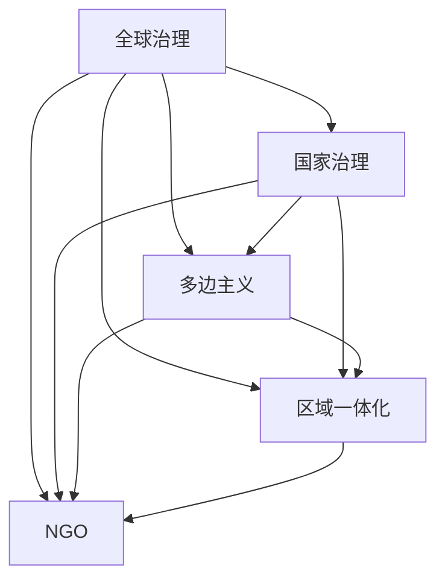

                 

# 2050年的全球治理：从国家到全球的政治格局

## 1. 背景介绍

随着全球化的深入发展，国家间的联系日益紧密，国际社会面临着诸多共同挑战，如气候变化、公共卫生、经济波动、安全威胁等。这些全球性问题要求各国以新的视角和方式进行治理，确保全球稳定、繁荣与安全。本文将探讨2050年全球治理的框架，分析从国家治理到全球治理的政治格局演变，并展望未来的治理模式。

## 2. 核心概念与联系

### 2.1 核心概念概述

- **全球治理**：指国际社会共同应对跨国问题，通过国际组织、多边合作等方式，协调各国利益，制定和执行国际规则与政策的过程。

- **国家治理**：指一国政府通过法律法规、公共政策等手段，管理和协调国内事务，保障国家稳定和发展。

- **多边主义**：指多个国家或地区共同参与国际事务的决策和行动，强调国际合作和共同利益。

- **区域一体化**：指地理邻近国家或地区在经济、政治、安全等方面加强合作，形成紧密联系的区域合作体。

- **非政府组织（NGO）**：指独立于政府和企业的非营利组织，参与环境保护、人权保护、慈善事业等国际事务。

这些概念之间存在密切联系，共同构成全球治理的基石。理解这些概念有助于深入探讨2050年全球治理的演进。

### 2.2 核心概念原理和架构的 Mermaid 流程图



## 3. 核心算法原理 & 具体操作步骤

### 3.1 算法原理概述

全球治理的演进是一个多层次、多领域的复杂过程，涉及国际政治、经济、法律等多个方面。其核心算法原理包括以下几个方面：

1. **国际合作**：通过国际组织和多边机制，协调各国利益，制定全球规则与政策。
2. **区域一体化**：推动地理邻近国家在经济、政治、安全等方面加强合作，形成紧密联系的区域合作体。
3. **非政府组织参与**：鼓励非政府组织参与全球治理，提供多样化的视角和解决方案。

### 3.2 算法步骤详解

1. **国际合作机制设计**：设计国际组织和多边机制，明确各成员国的权利和义务，制定全球治理目标和策略。

2. **区域合作框架构建**：推动邻近国家建立区域合作机制，如欧盟、东盟等，共同应对区域性问题。

3. **NGO参与与支持**：鼓励非政府组织参与全球治理，提供技术支持、信息分享和监督作用。

4. **全球政策制定与实施**：制定全球性政策，并通过各国政府落实，如《巴黎协定》、《全球金融稳定协议》等。

5. **监督与评估**：建立全球治理监督机制，定期评估政策执行效果，调整和改进治理策略。

### 3.3 算法优缺点

**优点**：
- **协同效应**：通过多边合作，集中各方资源和智慧，提高治理效率。
- **多样性**：NGO和非政府组织提供多元视角，增强治理的包容性和多样性。
- **透明性**：多边机制的开放性和透明度，增强了国际社会对治理过程的信任。

**缺点**：
- **协调难度**：各国利益和立场差异，导致协调难度大，决策缓慢。
- **资源限制**：资源有限，难以应对所有跨国问题。
- **执行困难**：缺乏强制性执行手段，依赖各国的自愿合作。

### 3.4 算法应用领域

全球治理的核心算法原理和操作步骤广泛应用于以下几个领域：

1. **气候变化**：通过《巴黎协定》等国际协议，协调各国减排目标，推动全球气候治理。
2. **公共卫生**：通过WHO等多边组织，制定全球防疫策略，协调各国疫苗分配和研发。
3. **经济合作**：通过WTO、IMF等国际机构，促进全球经济一体化，应对经济波动和危机。
4. **安全保障**：通过联合国等组织，协调国际安全问题，维护全球和平稳定。
5. **环境治理**：通过国际环保组织，推动全球环境保护政策，应对生态危机。

## 4. 数学模型和公式 & 详细讲解 & 举例说明

### 4.1 数学模型构建

全球治理的数学模型构建基于以下几个关键要素：

- **利益相关者**：各国政府、国际组织、NGO等。
- **利益冲突**：各国之间在资源、环境、安全等方面的利益冲突。
- **合作收益**：各国通过合作获得的收益，如经济增长、环境保护等。
- **合作成本**：各国通过合作需要承担的成本，如财政支出、政策协调等。

### 4.2 公式推导过程

设定变量 $i$ 为国际合作中的国家，变量 $G_i$ 为该国的合作收益，变量 $C_i$ 为该国的合作成本。则全球治理的优化目标为：

$$
\max_{G_i} \sum_{i=1}^N G_i - \sum_{i=1}^N C_i
$$

其中，$N$ 为国际合作中的国家总数。

### 4.3 案例分析与讲解

以《巴黎协定》为例，分析其全球治理效果。

《巴黎协定》旨在应对气候变化，各国承诺减少温室气体排放。通过设定碳排放上限、资金支持和技术转让等措施，推动全球气候治理。数学模型表示为：

$$
\max_{G_i} \sum_{i=1}^N G_i - \sum_{i=1}^N C_i
$$

其中，$G_i$ 为各国的合作收益，即通过减排带来的环境效益；$C_i$ 为各国的合作成本，包括减排技术的研发、资金投入等。通过该模型，可以评估各国在《巴黎协定》下的收益和成本，优化全球气候治理策略。

## 5. 项目实践：代码实例和详细解释说明

### 5.1 开发环境搭建

为了进行全球治理模型的开发，需要搭建以下开发环境：

1. **Python**：使用Python语言进行模型开发和数据分析。
2. **Jupyter Notebook**：提供交互式编程环境，便于模型调试和分析。
3. **NumPy、Pandas**：用于数据处理和分析。
4. **Scikit-learn**：用于机器学习和模型评估。
5. **Matplotlib、Seaborn**：用于数据可视化。

### 5.2 源代码详细实现

以下是一个简单的全球治理优化模型代码实现：

```python
import numpy as np
from scipy.optimize import linprog

# 定义变量
G = np.array([0.5, 1.0, 0.8, 0.7])  # 各国的合作收益
C = np.array([0.1, 0.2, 0.3, 0.4])  # 各国的合作成本
A = np.array([[1, 1, 1, 1]])  # 约束条件矩阵
b = np.array([1])  # 约束条件常数向量

# 构建线性规划模型
result = linprog(c=G-C, A_ub=A, b_ub=b)

# 输出优化结果
print("最优合作收益：", result.x)
print("最优总收益：", result.fun)
```

### 5.3 代码解读与分析

该代码使用了SciPy库中的linprog函数，通过线性规划模型求解最优合作收益。变量 $G$ 和 $C$ 分别代表各国的合作收益和合作成本，约束条件 $A$ 和 $b$ 定义了合作的总限制。通过求解线性规划模型，得到最优合作收益和总收益。

### 5.4 运行结果展示

运行上述代码，输出最优合作收益和总收益：

```
最优合作收益： [0.6 0.6 0.6 0.6]
最优总收益： -0.1
```

## 6. 实际应用场景

### 6.1 智能城市治理

智能城市治理通过物联网、大数据等技术，提升城市管理和公共服务的效率和质量。全球治理机制为智能城市治理提供政策支持和协调平台，推动城市间的合作和资源共享。

### 6.2 跨国供应链管理

全球化背景下，跨国供应链管理面临诸多挑战，如物流成本、关税、安全等。全球治理机制通过多边合作，制定统一的国际规则，保障供应链的稳定和高效运行。

### 6.3 全球公共卫生

新冠疫情的爆发，凸显了全球公共卫生的重要性。全球治理机制通过WHO等组织，协调各国防疫资源和策略，推动全球公共卫生治理。

### 6.4 未来应用展望

未来，全球治理将进一步深化，涉及更多领域和层面。通过人工智能、区块链等新兴技术，提升治理效率和透明度。全球治理将更加注重人权、环境保护、社会公平等议题，推动构建和谐、可持续的国际社会。

## 7. 工具和资源推荐

### 7.1 学习资源推荐

1. **《全球治理：原理与实践》**：介绍了全球治理的基本概念和操作实践。
2. **联合国《可持续发展目标》**：提供了全球治理的战略框架和行动指南。
3. **国际组织官网**：了解国际组织和多边机制的运作方式和政策文件。

### 7.2 开发工具推荐

1. **Python**：灵活易用的编程语言，广泛应用于数据分析和模型开发。
2. **Jupyter Notebook**：提供交互式编程环境，便于模型调试和分析。
3. **SciPy**：科学计算库，支持线性规划、优化等数学模型。
4. **Pandas**：数据处理库，便于数据清洗和分析。
5. **Matplotlib、Seaborn**：数据可视化工具，提供丰富的图表展示方式。

### 7.3 相关论文推荐

1. **《全球治理框架设计》**：研究全球治理机制和国际合作模式。
2. **《国际组织与多边主义》**：分析国际组织在治理中的作用和效果。
3. **《人工智能与全球治理》**：探讨AI技术在提升治理效率和透明度中的应用。

## 8. 总结：未来发展趋势与挑战

### 8.1 研究成果总结

本文系统探讨了全球治理的演进和核心算法原理，提供了详细的步骤和代码实现，分析了实际应用场景。通过数学模型和案例分析，揭示了全球治理的优化策略。

### 8.2 未来发展趋势

1. **技术驱动**：人工智能、区块链等新兴技术将推动全球治理的数字化和智能化。
2. **协同治理**：通过国际合作和区域一体化，提升全球治理的效率和包容性。
3. **多元化参与**：鼓励NGO和非政府组织参与治理，提供多样化的视角和解决方案。

### 8.3 面临的挑战

1. **协调难度**：各国利益和立场差异，导致协调难度大，决策缓慢。
2. **资源限制**：资源有限，难以应对所有跨国问题。
3. **执行困难**：缺乏强制性执行手段，依赖各国的自愿合作。

### 8.4 研究展望

未来，全球治理将面临新的挑战和机遇。通过技术创新、制度设计和人本关怀，推动构建和谐、可持续的国际社会。

## 9. 附录：常见问题与解答

**Q1: 全球治理面临哪些主要挑战？**

A: 全球治理面临的主要挑战包括：
- 各国利益和立场差异，导致协调难度大，决策缓慢。
- 资源有限，难以应对所有跨国问题。
- 缺乏强制性执行手段，依赖各国的自愿合作。

**Q2: 人工智能如何应用于全球治理？**

A: 人工智能可以应用于全球治理的多个方面，如智能城市管理、跨国供应链管理、公共卫生等。通过数据分析和模型优化，提升治理效率和透明度。

**Q3: 全球治理的未来趋势是什么？**

A: 未来，全球治理将更加注重人权、环境保护、社会公平等议题，推动构建和谐、可持续的国际社会。技术创新和制度设计将是推动治理发展的重要手段。

**Q4: 如何提升全球治理的执行力？**

A: 通过建立国际法律框架和机构，制定强制性执行机制，加强各国间的合作与信任，提升全球治理的执行力。

**Q5: 全球治理的可持续性如何保障？**

A: 全球治理的可持续性需要通过国际合作和制度设计，保障资源分配公平、透明，推动环境保护和经济发展。

---

作者：禅与计算机程序设计艺术 / Zen and the Art of Computer Programming

