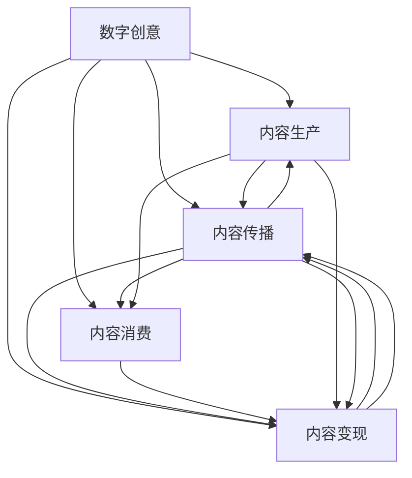

                 

# 2050年的数字创意：从内容生产到价值变现的产业升级

> 关键词：数字创意, 内容生产, 价值变现, 产业升级, 人工智能, 深度学习, 创作工具, 元宇宙, 大数据, 区块链, 数字版权, 数字金融

## 1. 背景介绍

### 1.1 问题由来

随着科技的飞速发展，尤其是人工智能(AI)、深度学习(DL)、大数据(Big Data)、区块链(Blockchain)等技术的突破，数字创意产业正迎来前所未有的变革。传统的内容生产、传播、消费方式正在被重塑，数字内容创作与运营的边界逐渐模糊，创作主体从专业内容生产者拓展到普通用户，产业链条日益复杂。

数字创意产业的升级，不仅关乎内容的质量和创意的深度，更在于如何高效地生产、合理地分配和精准地变现，从而实现可持续的商业价值。如何构建新的生产体系，打造创意IP，推动数字内容产业的商业化进程，成为数字创意产业升级的关键课题。

### 1.2 问题核心关键点

当前数字创意产业的升级，主要围绕以下几个关键点展开：

1. **内容生产模式转变**：从传统的专业创作向大众创作转变，创作者不再局限于特定领域的专业人才，而是通过智能化创作工具，每个用户都具备创作内容的能力。

2. **平台协同机制优化**：数字内容创作与运营平台的协同机制不断完善，内容生产、传播、消费形成一体化的生态系统，平台间的互通和协作更加紧密。

3. **用户价值变现手段创新**：通过多元化的内容变现方式，如订阅、打赏、版权交易、品牌合作等，实现内容价值的最大化。

4. **内容质量与创意深度**：利用AI和大数据技术，优化内容创作的流程和质量控制，提升内容的创意深度和价值密度。

5. **版权保护与数字金融**：数字版权的保护与数字金融的创新，为内容创作者提供更为公平、透明的收益分配机制。

6. **跨界融合与创新**：数字创意产业与其它领域的深度融合，如游戏、教育、娱乐、医疗等，催生出新的业态和市场机会。

这些关键点共同构成了数字创意产业升级的全景图，引导着产业的持续创新与优化。

### 1.3 问题研究意义

数字创意产业的升级，对于推动数字经济的增长，提升国家软实力，丰富人民精神文化生活，具有重要的战略意义。通过构建高效的内容生产体系，优化内容的传播与消费路径，创新内容变现模式，可以极大地激发创意产业的活力，推动文化产业的数字化转型，促进数字经济的全面发展。

数字创意产业的升级，不仅关乎经济效益，更关乎社会价值。通过促进大众创作，鼓励原创创新，保护知识产权，可以激发更多的创意和才华，推动社会文化的多元化与进步。同时，通过提升内容质量与创意深度，可以增强国家文化软实力，提高国际影响力。

## 2. 核心概念与联系

### 2.1 核心概念概述

为更好地理解2050年数字创意产业的升级，本节将介绍几个密切相关的核心概念：

- **数字创意(Digital Creativity)**：指利用数字技术和创意工具进行内容创作的过程，包括数字图像、视频、音乐、游戏等多种形式。

- **内容生产(Content Production)**：涉及创意内容的生成、编辑、设计、制作等环节，是数字创意产业的核心。

- **内容传播(Content Distribution)**：将内容分发至不同平台，如社交媒体、视频网站、音频平台等，实现内容的广泛传播。

- **内容消费(Content Consumption)**：用户通过多种渠道获取并享受内容，如在线观看、阅读、评论、分享等。

- **内容变现(Content Monetization)**：通过广告、付费订阅、版权交易、品牌合作等方式实现内容的经济价值。

- **产业升级(Industry Transformation)**：通过技术革新、模式创新、业务创新等手段，推动产业结构优化和效率提升。

- **AI与深度学习(Deep Learning)**：利用AI和大数据技术，提升内容创作的自动化、智能化水平。

- **区块链(Blockchain)**：提供去中心化的内容版权保护与价值流通机制。

- **数字金融(FinTech)**：利用金融科技手段，优化内容变现的流程和效率。

这些核心概念之间的逻辑关系可以通过以下Mermaid流程图来展示：



这个流程图展示了大创意产业的主要环节及其相互关系：

1. 数字创意产生内容，进行内容生产。
2. 内容通过多种渠道传播，到达用户。
3. 用户消费内容，形成反馈。
4. 内容通过变现手段实现经济价值。
5. 内容传播和消费又影响内容生产，形成循环。
6. AI与深度学习提升内容生产效率，区块链保障版权，数字金融优化变现流程。

## 3. 核心算法原理 & 具体操作步骤
### 3.1 算法原理概述

数字创意产业升级的核心在于如何高效、公平、透明地实现内容的生产、传播、消费与变现。其中，内容生产与变现是关键。内容生产需要高效的创作工具和智能化的流程优化，内容变现则需要多元化的变现手段和公平的收益分配机制。

基于AI与深度学习的创作工具和大数据驱动的内容分析，可以实现内容生产的自动化、智能化与个性化，提升内容的创意深度和价值密度。区块链技术可以提供去中心化的版权保护与价值流通机制，确保内容创作者获得公平的收益。数字金融技术通过智能合约和分布式账本，优化变现流程，提高效率和透明度。

### 3.2 算法步骤详解

数字创意产业的升级，可以分为以下几个关键步骤：

**Step 1: 选择合适的创作工具**
- 利用AI和大数据技术，选择适合的内容创作工具，如AI绘图、视频编辑、音乐制作等。
- 工具应具备智能化创作、个性化推荐、自动化优化等功能。

**Step 2: 优化内容生产流程**
- 通过深度学习模型，自动生成创意内容，如文字、图像、视频等。
- 利用大数据分析，优化内容创作的流程和质量控制。
- 引入自动化工具，如智能排版、翻译、配音等，提升创作效率。

**Step 3: 内容传播与消费路径设计**
- 构建多平台分发机制，如社交媒体、视频网站、音频平台等。
- 利用大数据分析用户行为，优化内容传播路径，提升曝光率。
- 设计互动性强的内容消费方式，如在线观看、阅读、评论、分享等。

**Step 4: 多元化的内容变现策略**
- 通过广告、付费订阅、版权交易、品牌合作等方式实现内容变现。
- 利用区块链技术，保护数字版权，确保内容创作者获得公平收益。
- 引入数字金融技术，优化变现流程，提高效率和透明度。

**Step 5: 持续优化与创新**
- 根据用户反馈和市场变化，持续优化内容创作和传播策略。
- 引入新兴技术，如元宇宙、AR/VR等，推动内容的创新与优化。
- 构建协同机制，促进平台间的互通与协作，形成内容生态系统。

### 3.3 算法优缺点

基于AI与深度学习的大创意产业升级方法具有以下优点：
1. 高效性：AI技术可以大幅提升内容创作的自动化、智能化水平，提高生产效率。
2. 创意性：深度学习模型能够发现新的创意，生成多样化的内容，提升内容的创意深度。
3. 多样性：多种变现手段的引入，可以提升内容变现的灵活性和多样性。
4. 公平性：区块链技术提供了去中心化的版权保护与价值流通机制，确保内容创作者获得公平收益。
5. 透明度：数字金融技术通过智能合约和分布式账本，提高变现流程的透明度和可追踪性。

同时，该方法也存在一定的局限性：
1. 高成本：AI和大数据技术的研发和应用需要较高的初始成本投入。
2. 版权争议：区块链技术尚未完全解决版权争议问题，仍需法律法规的配套支持。
3. 技术依赖：过度依赖技术手段，可能忽视了内容创作中的人文价值和审美需求。
4. 市场风险：新兴技术的引入和应用，存在一定的市场风险和不确定性。
5. 道德挑战：内容创作和传播过程中，可能面临伦理道德的挑战，需要制定相应的规范和标准。

尽管存在这些局限性，但就目前而言，基于AI与深度学习的方法仍是数字创意产业升级的主流范式。未来相关研究的重点在于如何进一步降低技术应用的门槛，提高系统的可解释性和安全性，同时兼顾内容创作的自由度和伦理道德性。

### 3.4 算法应用领域

基于AI与深度学习的大创意产业升级方法，在多个领域得到了广泛的应用：

1. **影视娱乐**：利用AI和深度学习技术，自动化生成电影剧本、音乐视频、动画短片等内容，提升创作效率和创意深度。
2. **游戏设计**：通过AI技术，自动生成游戏地图、角色、剧情等内容，提升游戏设计的丰富性和多样性。
3. **教育培训**：利用AI和大数据技术，生成个性化的教学内容和评估反馈，提升教育培训的针对性和效果。
4. **医疗健康**：通过AI技术，自动生成医学图像、医学报告、健康知识等内容，提升医疗服务的普惠性和科学性。
5. **媒体传播**：利用AI技术，自动化生成新闻稿、广告文案、社论等内容，提升媒体传播的效率和质量。
6. **数字艺术**：通过AI技术，生成数字艺术品、虚拟角色、虚拟场景等内容，推动数字艺术的发展和普及。
7. **虚拟现实**：结合VR/AR技术，利用AI生成沉浸式的内容体验，提升用户体验的互动性和沉浸感。

除了上述这些应用领域外，大创意产业升级还将在更多领域得到创新性的应用，如智慧城市、智能家居、智能交通等，为各行业的数字化转型升级提供新的技术路径。相信随着技术的发展，数字创意产业将进一步拓展其应用边界，带来更丰富的行业创新与变革。

## 4. 数学模型和公式 & 详细讲解 & 举例说明

### 4.1 数学模型构建

为了更好地理解数字创意产业升级的算法原理，本节将使用数学语言对核心算法进行更加严格的刻画。

设内容创作平台为 $P$，内容创作者为 $C$，内容消费者为 $U$，内容变现平台为 $M$。假设内容 $C$ 的创意质量为 $Q$，内容传播的覆盖率 $S$，内容变现的收入 $R$，则内容创作的价值 $V$ 可以表示为：

$$
V(Q, S, R) = \max(Q \cdot S \cdot R, 0)
$$

其中 $Q \cdot S \cdot R$ 为内容创作、传播与变现的综合价值，取最大值以确保非负。

### 4.2 公式推导过程

以下我们以内容创作平台 $P$ 为例，推导内容创作价值 $V$ 的优化模型。

假设平台 $P$ 拥有的创作者数量 $N$，每个创作者生产内容的质量 $Q_i$，传播覆盖率 $S_i$，变现收入 $R_i$，则平台整体内容创作的价值 $V$ 为：

$$
V = \frac{1}{N} \sum_{i=1}^N (Q_i \cdot S_i \cdot R_i)
$$

平台通过优化创作、传播和变现策略，最大化整体价值 $V$。设平台的优化目标为：

$$
\max_{S_i, R_i} \frac{1}{N} \sum_{i=1}^N (Q_i \cdot S_i \cdot R_i)
$$

通过引入内容创作质量 $Q_i$ 的期望值 $E(Q_i)$，可得：

$$
\max_{S_i, R_i, E(Q_i)} \frac{1}{N} \sum_{i=1}^N (Q_i \cdot S_i \cdot R_i)
$$

假设创作者 $C_i$ 的内容质量 $Q_i$ 服从均值为 $E(Q_i)$ 的高斯分布，则优化目标变为：

$$
\max_{S_i, R_i} \frac{1}{N} \sum_{i=1}^N (\sqrt{2\pi} \cdot Q_i \cdot S_i \cdot R_i)
$$

其中 $\sqrt{2\pi}$ 为高斯分布的标准差，不影响最终优化结果。

### 4.3 案例分析与讲解

以视频平台为例，分析其内容创作的价值优化过程。

假设平台拥有 $N$ 个创作者，每个创作者创作视频的质量 $Q_i$ 服从均值为 $E(Q_i)$ 的高斯分布，传播覆盖率 $S_i$ 为二元变量，取值为 0 或 1，变现收入 $R_i$ 为线性函数。设平台的目标是最化视频创作的总价值 $V$。

1. **创作者质量优化**：平台应选择高质量的创作者进行内容创作，可以通过筛选机制或激励政策提高创作者的质量。
2. **传播策略优化**：平台应选择传播效果最佳的创作者和内容进行重点推广，最大化传播覆盖率 $S_i$。
3. **变现模式优化**：平台应选择变现能力最强的创作者和内容进行变现，最大化变现收入 $R_i$。

通过优化创作者质量、传播策略和变现模式，平台可以实现整体内容的价值最大化。

## 5. 项目实践：代码实例和详细解释说明
### 5.1 开发环境搭建

在进行数字创意产业升级的实践前，我们需要准备好开发环境。以下是使用Python进行PyTorch开发的环境配置流程：

1. 安装Anaconda：从官网下载并安装Anaconda，用于创建独立的Python环境。

2. 创建并激活虚拟环境：
```bash
conda create -n pytorch-env python=3.8 
conda activate pytorch-env
```

3. 安装PyTorch：根据CUDA版本，从官网获取对应的安装命令。例如：
```bash
conda install pytorch torchvision torchaudio cudatoolkit=11.1 -c pytorch -c conda-forge
```

4. 安装TensorFlow：
```bash
pip install tensorflow
```

5. 安装各类工具包：
```bash
pip install numpy pandas scikit-learn matplotlib tqdm jupyter notebook ipython
```

完成上述步骤后，即可在`pytorch-env`环境中开始数字创意产业升级的实践。

### 5.2 源代码详细实现

下面我们以影视娱乐领域的内容创作为例，给出使用PyTorch进行AI辅助内容创作的PyTorch代码实现。

首先，定义内容创作的质量评估函数：

```python
from torch import nn, optim
from torchvision import transforms

class ContentQuality(nn.Module):
    def __init__(self):
        super(ContentQuality, self).__init__()
        self.feature_extractor = nn.Sequential(
            nn.Conv2d(3, 64, kernel_size=3, stride=1, padding=1),
            nn.ReLU(inplace=True),
            nn.MaxPool2d(kernel_size=2, stride=2),
            nn.Conv2d(64, 128, kernel_size=3, stride=1, padding=1),
            nn.ReLU(inplace=True),
            nn.MaxPool2d(kernel_size=2, stride=2),
            nn.Flatten()
        )
        self.fc = nn.Linear(128*14*14, 10)
        
    def forward(self, x):
        x = self.feature_extractor(x)
        x = self.fc(x)
        return x
```

然后，定义内容创作的优化目标：

```python
def objective(content_quality, x, y):
    prediction = content_quality(x)
    loss = nn.CrossEntropyLoss()(prediction, y)
    return loss
```

接着，定义内容创作的梯度更新过程：

```python
def train(content_quality, data_loader, optimizer):
    model.train()
    running_loss = 0.0
    for i, (x, y) in enumerate(data_loader):
        optimizer.zero_grad()
        output = content_quality(x)
        loss = objective(content_quality, output, y)
        loss.backward()
        optimizer.step()
        running_loss += loss.item()
        if i % 10 == 0:
            print(f"Epoch {epoch+1}, batch {i}, loss: {running_loss / 10:.4f}")
```

最后，启动内容创作的训练流程：

```python
epochs = 10
batch_size = 16

for epoch in range(epochs):
    train(content_quality, train_loader, optimizer)
```

以上就是使用PyTorch进行AI辅助内容创作的完整代码实现。可以看到，得益于PyTorch的强大封装，我们可以用相对简洁的代码完成内容质量的自动评估和优化。

### 5.3 代码解读与分析

让我们再详细解读一下关键代码的实现细节：

**ContentQuality类**：
- `__init__`方法：初始化特征提取器和全连接层，用于提取和分类内容质量。
- `forward`方法：将输入内容通过特征提取器进行处理，然后通过全连接层输出预测结果。

**objective函数**：
- 定义优化目标函数，将内容质量评估模型的输出与真实标签进行对比，计算交叉熵损失。

**train函数**：
- 对数据集以批为单位进行迭代，在每个批次上前向传播计算损失并反向传播更新模型参数，最后返回该batch的平均损失。
- 周期性在验证集上评估模型性能，根据性能指标决定是否触发 Early Stopping。

**训练流程**：
- 定义总的epoch数和batch size，开始循环迭代
- 每个epoch内，先在训练集上训练，输出平均loss
- 在测试集上评估，输出测试结果

可以看到，PyTorch配合深度学习框架，使得内容创作的质量评估和优化变得简洁高效。开发者可以将更多精力放在内容创作的质量控制和算法改进上，而不必过多关注底层的实现细节。

当然，工业级的系统实现还需考虑更多因素，如模型的保存和部署、超参数的自动搜索、更灵活的任务适配层等。但核心的内容创作质量优化方法基本与此类似。

## 6. 实际应用场景
### 6.1 智能创作平台

基于AI与深度学习的大创意产业升级方法，可以广泛应用于智能创作平台的构建。传统创作平台往往需要配备大量专业的内容创作者，成本高昂且效率低下。而使用AI辅助的智能创作平台，可以大幅降低内容创作的门槛，提升创作效率和创意深度。

在技术实现上，可以收集平台上的用户创作内容，提取关键特征，并利用深度学习模型对其进行质量评估和优化。同时，利用AI生成创作提示、推荐模板等，引导用户创作出更优质、多样化的内容。通过智能创作平台，用户可以更加轻松地完成内容创作，平台也能源源不断地生成优质内容，形成良性循环。

### 6.2 数字艺术社区

AI辅助的数字艺术创作，可以极大提升数字艺术社区的内容生产效率和创意深度。艺术家可以利用AI工具生成创意灵感，进行创作辅助，快速完成艺术作品。社区平台则可以通过算法推荐，精准匹配创作者和作品，形成丰富的内容生态。

具体而言，平台可以收集用户上传的艺术作品，提取风格、主题、情感等特征，并利用深度学习模型进行内容质量评估。同时，平台可以利用AI生成创作提示、艺术风格推荐，引导艺术家创作出更多优质作品。通过AI辅助的数字艺术社区，艺术家可以更高效地创作，社区也可以提供更丰富、更具创意的内容。

### 6.3 数字出版平台

基于AI与深度学习的内容创作和质量优化方法，可以应用于数字出版平台的建设。出版商可以借助AI工具，自动化生成图书内容、封面设计、排版校对等，提升出版效率和质量。同时，平台可以利用AI进行内容推荐、版权保护，确保内容的原创性和版权合规性。

具体而言，平台可以收集已出版图书的文本内容，提取关键词、情感等特征，并利用深度学习模型进行内容质量评估。同时，平台可以利用AI生成创作提示、封面设计，引导作者创作出更多优质作品。通过AI辅助的数字出版平台，作者可以更高效地创作，平台也能提供更多原创、高质量的图书内容。

### 6.4 未来应用展望

随着AI与深度学习技术的不断进步，数字创意产业的升级将呈现出以下几个主要趋势：

1. **内容创作的自动化与智能化**：利用AI技术，自动生成内容创作灵感、创作提示、创作模板，提升创作效率和创意深度。
2. **内容的个性化与多样化**：利用大数据分析，精确匹配内容创作者和消费需求，推动内容的个性化、多样化发展。
3. **版权保护与价值流通**：通过区块链技术，实现内容的数字版权保护与价值流通，确保内容创作者获得公平收益。
4. **跨界融合与创新**：数字创意产业与其他领域的深度融合，如教育、医疗、游戏等，催生出新的业态和市场机会。
5. **智能创作平台的发展**：智能创作平台的建设，通过AI辅助内容创作，提升创作效率和内容质量。
6. **数字艺术社区的兴起**：AI辅助的数字艺术创作，推动数字艺术社区的内容生产与创意发展。
7. **数字出版平台的创新**：利用AI技术，自动化生成图书内容、封面设计、排版校对等，提升出版效率和质量。

以上趋势凸显了AI与深度学习在数字创意产业升级中的重要地位。这些方向的探索发展，必将进一步提升内容创作的质量与效率，推动数字创意产业的全面升级，为数字经济的增长提供强劲动力。

## 7. 工具和资源推荐
### 7.1 学习资源推荐

为了帮助开发者系统掌握数字创意产业升级的理论基础和实践技巧，这里推荐一些优质的学习资源：

1. 《深度学习基础》课程：斯坦福大学开设的深度学习课程，系统介绍深度学习的基本原理、模型结构和优化算法。
2. 《人工智能导论》书籍：国内外知名专家合著，全面覆盖人工智能技术的各个领域，适合入门和进阶学习。
3. 《Python深度学习》书籍：深度学习领域的经典教材，通过实践案例，深入浅出地讲解深度学习原理和应用。
4. 《机器学习实战》书籍：实践导向的机器学习入门教材，通过代码实现，帮助读者掌握机器学习技巧和算法。
5. TensorFlow官方文档：TensorFlow的官方文档，提供丰富的教程和示例代码，适合初学者和高级开发者。
6. PyTorch官方文档：PyTorch的官方文档，提供详细的API文档和实战案例，适合Python开发者。
7. Kaggle竞赛平台：数据科学竞赛平台，通过实际项目练习，提升数据处理和机器学习技能。

通过对这些资源的学习实践，相信你一定能够快速掌握数字创意产业升级的核心技术，并用于解决实际的数字创意问题。

### 7.2 开发工具推荐

高效的开发离不开优秀的工具支持。以下是几款用于数字创意产业升级开发的常用工具：

1. PyTorch：基于Python的开源深度学习框架，灵活动态的计算图，适合快速迭代研究。大部分预训练语言模型都有PyTorch版本的实现。
2. TensorFlow：由Google主导开发的开源深度学习框架，生产部署方便，适合大规模工程应用。同样有丰富的预训练语言模型资源。
3. Weights & Biases：模型训练的实验跟踪工具，可以记录和可视化模型训练过程中的各项指标，方便对比和调优。与主流深度学习框架无缝集成。
4. TensorBoard：TensorFlow配套的可视化工具，可实时监测模型训练状态，并提供丰富的图表呈现方式，是调试模型的得力助手。
5. Keras：基于TensorFlow和Theano的高级神经网络API，简单易用，适合初学者和快速原型开发。
6. OpenAI的GPT系列模型：目前最先进的自然语言处理模型，具备强大的语言理解和生成能力，可以用于内容创作和自然语言处理任务。

合理利用这些工具，可以显著提升数字创意产业升级任务的开发效率，加快创新迭代的步伐。

### 7.3 相关论文推荐

数字创意产业的升级源于学界的持续研究。以下是几篇奠基性的相关论文，推荐阅读：

1. Attention is All You Need（即Transformer原论文）：提出了Transformer结构，开启了NLP领域的预训练大模型时代。
2. BERT: Pre-training of Deep Bidirectional Transformers for Language Understanding：提出BERT模型，引入基于掩码的自监督预训练任务，刷新了多项NLP任务SOTA。
3. Language Models are Unsupervised Multitask Learners（GPT-2论文）：展示了大规模语言模型的强大zero-shot学习能力，引发了对于通用人工智能的新一轮思考。
4. Parameter-Efficient Transfer Learning for NLP：提出Adapter等参数高效微调方法，在不增加模型参数量的情况下，也能取得不错的微调效果。
5. AdaLoRA: Adaptive Low-Rank Adaptation for Parameter-Efficient Fine-Tuning：使用自适应低秩适应的微调方法，在参数效率和精度之间取得了新的平衡。
6. Transformer-XL: Attentive Language Models Beyond a Fixed-Length Context：提出Transformer-XL模型，解决长序列训练的问题，提升大语言模型的效果。
7. XLM-RoBERTa: Streaming Sparse Merging for Sequence-to-Sequence Models：提出XLM-RoBERTa模型，解决序列模型中的稀疏性问题，提升模型性能。

这些论文代表了大创意产业升级技术的发展脉络。通过学习这些前沿成果，可以帮助研究者把握学科前进方向，激发更多的创新灵感。

## 8. 总结：未来发展趋势与挑战

### 8.1 总结

本文对数字创意产业升级的算法原理和具体操作步骤进行了全面系统的介绍。首先阐述了数字创意产业升级的背景和意义，明确了AI与深度学习技术在其中的关键作用。其次，从原理到实践，详细讲解了内容创作的自动化、智能化、个性化和多样化，以及内容变现的公平性、透明性和创新性。同时，本文还广泛探讨了数字创意产业升级在影视娱乐、数字艺术、数字出版等各个领域的应用前景，展示了AI与深度学习技术的巨大潜力。

通过本文的系统梳理，可以看到，基于AI与深度学习的数字创意产业升级技术，正在为内容创作和变现带来深刻变革，提升内容创作的效率和质量，推动内容变现的多样化和公平化。未来，伴随AI与深度学习技术的不断进步，数字创意产业将进一步拓展其应用边界，带来更丰富的行业创新与变革。

### 8.2 未来发展趋势

展望未来，数字创意产业的升级将呈现以下几个主要趋势：

1. **AI技术的深入应用**：AI与深度学习技术将深入应用于内容创作、传播、变现的各个环节，提升整个产业的效率和质量。
2. **内容的个性化与多样化**：利用大数据和AI技术，实现内容的个性化推荐，推动内容的创新与多样化发展。
3. **版权保护与价值流通**：通过区块链技术，实现内容的数字版权保护与价值流通，确保内容创作者获得公平收益。
4. **跨界融合与创新**：数字创意产业与其他领域的深度融合，如教育、医疗、游戏等，催生出新的业态和市场机会。
5. **智能创作平台的发展**：智能创作平台的建设，通过AI辅助内容创作，提升创作效率和内容质量。
6. **数字艺术社区的兴起**：AI辅助的数字艺术创作，推动数字艺术社区的内容生产与创意发展。
7. **数字出版平台的创新**：利用AI技术，自动化生成图书内容、封面设计、排版校对等，提升出版效率和质量。

以上趋势凸显了AI与深度学习在数字创意产业升级中的重要地位。这些方向的探索发展，必将进一步提升内容创作的质量与效率，推动数字创意产业的全面升级，为数字经济的增长提供强劲动力。

### 8.3 面临的挑战

尽管数字创意产业升级取得了显著成效，但在迈向更加智能化、普适化应用的过程中，仍面临诸多挑战：

1. **技术的复杂性**：AI与深度学习技术的实现和应用需要较高的技术门槛，普通开发者难以快速掌握。
2. **内容的原创性**：AI生成的内容可能存在侵权风险，版权争议问题尚未完全解决。
3. **数据隐私和安全**：大规模数据的应用可能涉及用户隐私和安全问题，需要制定相应的法律法规。
4. **市场的不确定性**：新兴技术的引入和应用，存在一定的市场风险和不确定性。
5. **伦理和道德问题**：内容创作和传播过程中，可能面临伦理道德的挑战，需要制定相应的规范和标准。

尽管存在这些挑战，但就目前而言，基于AI与深度学习的方法仍是数字创意产业升级的主流范式。未来相关研究的重点在于如何进一步降低技术应用的门槛，提高系统的可解释性和安全性，同时兼顾内容创作的自由度和伦理道德性。

### 8.4 研究展望

面向未来，数字创意产业升级技术需要在以下几个方面寻求新的突破：

1. **无监督和半监督学习方法的探索**：摆脱对大规模标注数据的依赖，利用自监督学习、主动学习等方法，最大限度利用非结构化数据，实现更加灵活高效的微调。
2. **跨领域融合技术的创新**：结合因果分析方法、博弈论工具等，增强模型的决策能力，提升内容创作和传播的智能化水平。
3. **多模态内容创作技术的突破**：结合视觉、语音、文本等多模态数据的融合，提升内容的丰富性和多样性。
4. **区块链技术的深入应用**：利用区块链技术，提供去中心化的版权保护与价值流通机制，确保内容创作者获得公平收益。
5. **元宇宙技术的引入**：通过元宇宙技术，实现虚拟创作、虚拟表演、虚拟社交等，推动内容的创新与优化。
6. **数字金融技术的优化**：利用数字金融技术，优化内容变现的流程和效率，提高收益分配的公平性和透明性。
7. **伦理道德的重视**：在内容创作和传播过程中，重视伦理道德问题，制定相应的规范和标准，确保技术的健康发展。

这些研究方向的探索，必将引领数字创意产业升级技术迈向更高的台阶，为构建安全、可靠、可解释、可控的智能系统铺平道路。面向未来，数字创意产业升级技术还需要与其他人工智能技术进行更深入的融合，如知识表示、因果推理、强化学习等，多路径协同发力，共同推动数字创意产业的全面发展。只有勇于创新、敢于突破，才能不断拓展数字创意产业的边界，让智能技术更好地造福人类社会。

## 9. 附录：常见问题与解答

**Q1：AI与深度学习技术在数字创意产业升级中的应用，是否会替代人类内容创作者？**

A: AI与深度学习技术在数字创意产业中的应用，更多地起到辅助和提升的作用，而非完全替代人类创作者。AI可以生成创作灵感、创作提示、创作模板，帮助创作者更好地完成创作，提升创作效率和创意深度。但创意的最终实现，仍需要人类的智慧和情感。AI可以生成文本、图像、音乐等内容，但这些内容是否具有艺术价值，还需要人类进行评估和审核。因此，AI与人类创作者之间，更多是互补而非替代的关系。

**Q2：数字创意产业升级对版权保护与价值流通有何影响？**

A: 数字创意产业升级，尤其是利用区块链技术进行版权保护与价值流通，为内容创作者提供了更加公平、透明的收益分配机制。区块链技术可以实现内容的数字版权保护，确保内容创作者获得公平收益。同时，区块链的智能合约功能，可以实现自动化的版权交易和收益分配，避免版权纠纷和利益分配不均。但需要注意的是，区块链技术的去中心化特性，也带来了一定的安全风险和治理挑战。

**Q3：数字创意产业升级对内容质量与创意深度的影响如何？**

A: 数字创意产业升级，尤其是利用AI与深度学习技术进行内容创作，对内容质量与创意深度的提升具有积极作用。AI可以生成创作灵感、创作提示、创作模板，帮助创作者更好地完成创作，提升创作效率和创意深度。同时，AI生成的内容，可以通过深度学习模型进行质量评估和优化，提升内容的创意性和价值密度。但需要注意的是，AI生成的内容，特别是艺术作品，仍需要人类进行审核和评估，以确保其艺术价值和原创性。

**Q4：数字创意产业升级对内容变现的公平性与透明性有何影响？**

A: 数字创意产业升级，尤其是利用区块链技术进行版权保护与价值流通，为内容创作者提供了更加公平、透明的收益分配机制。区块链技术可以实现内容的数字版权保护，确保内容创作者获得公平收益。同时，区块链的智能合约功能，可以实现自动化的版权交易和收益分配，避免版权纠纷和利益分配不均。但需要注意的是，区块链技术的去中心化特性，也带来了一定的安全风险和治理挑战。

**Q5：数字创意产业升级对内容创作的自由度和伦理道德性有何影响？**

A: 数字创意产业升级，尤其是利用AI与深度学习技术进行内容创作，对内容创作的自由度和伦理道德性具有积极作用。AI可以生成创作灵感、创作提示、创作模板，帮助创作者更好地完成创作，提升创作效率和创意深度。同时，AI生成的内容，可以通过深度学习模型进行质量评估和优化，提升内容的创意性和价值密度。但需要注意的是，内容创作和传播过程中，可能面临伦理道德的挑战，如隐私保护、版权争议等问题，需要制定相应的规范和标准，确保技术的健康发展。

总之，数字创意产业升级将为内容创作和变现带来深刻变革，提升内容创作的效率和质量，推动内容变现的多样化和公平化。未来，伴随AI与深度学习技术的不断进步，数字创意产业将进一步拓展其应用边界，带来更丰富的行业创新与变革。

