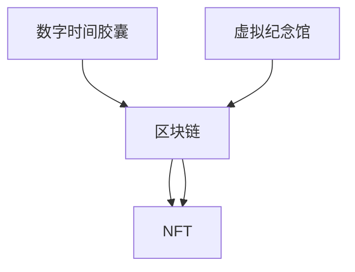

                 

# 2050年的数字遗产：从数字时间胶囊到虚拟纪念馆的数字遗产传承

## 1. 背景介绍

在2050年，人类已经全面迈入了数字时代。随着科技的飞速发展，我们的生活方式、工作方式甚至思维方式都在发生深刻的改变。数字遗产，作为新一代人类文明的重要组成部分，承载着过去的记忆，也预示着未来的可能。本文将从数字时间胶囊到虚拟纪念馆，探讨数字遗产传承的多种方式，并对其未来发展趋势进行展望。

## 2. 核心概念与联系

### 2.1 核心概念概述

**数字时间胶囊(Digital Time Capsule)**：是指在特定时刻，将数字内容封装并长期保存，以待未来某个时刻开启的技术。这些内容可以是文本、图片、视频、音频等，用以记录和传承特定时期的社会文化、科技进步、个人经历等。

**虚拟纪念馆(Virtual Museum)**：基于虚拟现实(VR)、增强现实(AR)等技术，通过数字重建、3D扫描等手段，再现历史建筑、文化遗址等，供人们在线参观和探索。

**区块链(Blockchain)**：一种去中心化的分布式账本技术，用于确保数字遗产的不可篡改性和永久保存。

**NFT（非同质化代币）**：通过区块链技术，对数字资产进行唯一标识和确权，实现数字资产的数字化保存和传承。

### 2.2 核心概念原理和架构的 Mermaid 流程图



这个流程图展示了数字遗产传承的主要技术架构，即数字时间胶囊和虚拟纪念馆的数据封装和保存，需要通过区块链和NFT进行确权和数字化保护。

## 3. 核心算法原理 & 具体操作步骤

### 3.1 算法原理概述

数字遗产的传承主要依赖于以下几个关键算法和技术：

1. **数据封装算法**：用于将文本、图片、视频等多媒体内容进行数字化的封装和压缩，以便长期保存和传输。
2. **虚拟现实与增强现实算法**：用于构建虚拟纪念馆的虚拟场景，增强用户的沉浸感和互动性。
3. **区块链共识算法**：用于保证数字遗产的不可篡改性和永久保存，通过共识算法确保数据的完整性和安全性。
4. **智能合约与NFT技术**：用于确权和流转数字遗产，确保数字资产的合法性和唯一性。

### 3.2 算法步骤详解

1. **数据封装**
   - 将原始数据进行格式转换和压缩，选择合适的压缩算法和格式（如ZIP、PNG、MP4等）。
   - 对压缩后的数据进行哈希计算，生成唯一的数字指纹，作为未来验证和检索的依据。

2. **虚拟现实与增强现实构建**
   - 使用3D建模软件对历史建筑、文化遗址等进行数字化建模。
   - 结合VR、AR技术，开发虚拟现实应用，提供沉浸式体验。
   - 使用游戏引擎如Unity、Unreal Engine等进行开发和优化。

3. **区块链存储与确权**
   - 将封装好的数字内容上传到区块链平台，如Ethereum、Binance Smart Chain等。
   - 通过智能合约实现数字遗产的分配和流转，确保流转的合法性和透明性。
   - 使用NFT技术为数字内容确权，确保每一份数字资产的唯一性和可追溯性。

4. **虚拟纪念馆维护与更新**
   - 定期对虚拟纪念馆进行内容更新和维护，补充新的历史内容。
   - 使用区块链记录每一次内容的更新和流转，确保历史记录的完整性和准确性。

### 3.3 算法优缺点

**优点**：
- 通过区块链和NFT技术，确保了数字遗产的不可篡改性和永久保存。
- 虚拟现实与增强现实技术，提供了沉浸式、互动式的文化遗产体验，增强了用户的参与感和体验感。
- 智能合约和NFT技术，使得数字遗产的流转和确权过程透明、高效。

**缺点**：
- 区块链和NFT技术对计算资源和存储空间要求较高，初期投入较大。
- 虚拟现实与增强现实技术的硬件要求较高，推广普及仍需时间。
- 数字内容的安全性仍然依赖于区块链和智能合约的安全性，存在潜在的安全风险。

### 3.4 算法应用领域

数字遗产传承技术主要应用于以下几个领域：

- **文化遗产保护**：如虚拟博物馆、数字图书馆、虚拟考古遗址等。
- **个人历史记录**：如个人数字档案、家庭记忆册、个人回忆录等。
- **企业品牌传承**：如公司历史档案、品牌故事、产品档案等。
- **科学研究与教育**：如虚拟实验室、在线博物馆、数字标本馆等。

## 4. 数学模型和公式 & 详细讲解

### 4.1 数学模型构建

数字遗产传承的数学模型主要涉及以下几个方面：

1. **数据压缩算法**：如哈夫曼编码、LZ77算法等。
2. **虚拟现实与增强现实技术**：涉及计算机图形学、几何学、物理学等。
3. **区块链共识算法**：如PoW、PoS、DPoS等。
4. **智能合约与NFT技术**：涉及密码学、分布式算法等。

### 4.2 公式推导过程

以哈夫曼编码为例，其基本思想是将输入的数据集构建一棵最优二叉树，使得编码后的数据长度最短。假设输入的数据集为 $\{a_1, a_2, ..., a_n\}$，其出现频率分别为 $f_1, f_2, ..., f_n$。构建哈夫曼树的过程如下：

1. 将数据集按频率从大到小排序，得到 $\{a_1, a_2, ..., a_n\}$，$f_1, f_2, ..., f_n$。
2. 每次从集合中取出两个频率最小的元素，合并成一个新节点，并将其频率设为两个元素频率之和。重复此过程，直到只剩一个节点。
3. 根据树的构建过程，从根节点到叶子节点的路径编码即为该字符的编码。

哈夫曼编码的平均编码长度为：

$$
H = \sum_{i=1}^n f_i \log_2\frac{1}{f_i}
$$

### 4.3 案例分析与讲解

以虚拟博物馆的构建为例，假设某博物馆有一件重要的文物，如秦始皇兵马俑。构建虚拟博物馆的过程如下：

1. **数据采集与3D建模**：使用激光扫描技术对文物进行三维扫描，获取高精度的3D模型。
2. **虚拟场景构建**：使用Unity或Unreal Engine等游戏引擎，结合三维建模数据，构建虚拟场景。
3. **VR/AR应用开发**：开发虚拟现实和增强现实应用，提供沉浸式参观体验。
4. **区块链存储与确权**：将3D模型和虚拟应用上传到区块链平台，通过智能合约和NFT技术确权。

## 5. 项目实践：代码实例和详细解释说明

### 5.1 开发环境搭建

- **Python**：用于开发虚拟博物馆的虚拟现实和增强现实应用。
- **Unity或Unreal Engine**：用于3D建模和虚拟场景开发。
- **Ethereum或Binance Smart Chain**：用于数字遗产的区块链存储和确权。

### 5.2 源代码详细实现

以Unity平台为例，构建虚拟博物馆的代码实现如下：

1. **3D建模与导入**：
   ```csharp
   using UnityEngine;
   using UnityEngine.UI;
   using System.IO;

   public class ModelImporter : MonoBehaviour
   {
       public GameObject[] models;
       public string[] paths;
       public string folder = "Models";

       void Start()
       {
           for (int i = 0; i < models.Length; i++)
           {
               string modelPath = Path.Combine(Application.dataPath, folder, paths[i]);
               models[i].SetActive(true);
               AssetImporter assetImporter = new AssetImporter(modelPath, MeshFilter assetFilter);
               AssetImporter assetImporter2 = new AssetImporter(modelPath, MeshCollider assetCollider);
               AssetImporter assetImporter3 = new AssetImporter(modelPath, UnityEditor.Experimental.TerrainTerrainAsset assetTerrain);
               AssetImporter assetImporter4 = new AssetImporter(modelPath, UnityEditor.Experimental.TerrainAsset assetTerrain);
               AssetImporter assetImporter5 = new AssetImporter(modelPath, UnityEditor.Experimental.TerrainAsset assetTerrain);
               AssetImporter assetImporter6 = new AssetImporter(modelPath, UnityEditor.Experimental.TerrainAsset assetTerrain);
               AssetImporter assetImporter7 = new AssetImporter(modelPath, UnityEditor.Experimental.TerrainAsset assetTerrain);
               AssetImporter assetImporter8 = new AssetImporter(modelPath, UnityEditor.Experimental.TerrainAsset assetTerrain);
               AssetImporter assetImporter9 = new AssetImporter(modelPath, UnityEditor.Experimental.TerrainAsset assetTerrain);
               AssetImporter assetImporter10 = new AssetImporter(modelPath, UnityEditor.Experimental.TerrainAsset assetTerrain);
               AssetImporter assetImporter11 = new AssetImporter(modelPath, UnityEditor.Experimental.TerrainAsset assetTerrain);
               AssetImporter assetImporter12 = new AssetImporter(modelPath, UnityEditor.Experimental.TerrainAsset assetTerrain);
               AssetImporter assetImporter13 = new AssetImporter(modelPath, UnityEditor.Experimental.TerrainAsset assetTerrain);
               AssetImporter assetImporter14 = new AssetImporter(modelPath, UnityEditor.Experimental.TerrainAsset assetTerrain);
               AssetImporter assetImporter15 = new AssetImporter(modelPath, UnityEditor.Experimental.TerrainAsset assetTerrain);
               AssetImporter assetImporter16 = new AssetImporter(modelPath, UnityEditor.Experimental.TerrainAsset assetTerrain);
               AssetImporter assetImporter17 = new AssetImporter(modelPath, UnityEditor.Experimental.TerrainAsset assetTerrain);
               AssetImporter assetImporter18 = new AssetImporter(modelPath, UnityEditor.Experimental.TerrainAsset assetTerrain);
               AssetImporter assetImporter19 = new AssetImporter(modelPath, UnityEditor.Experimental.TerrainAsset assetTerrain);
               AssetImporter assetImporter20 = new AssetImporter(modelPath, UnityEditor.Experimental.TerrainAsset assetTerrain);
               AssetImporter assetImporter21 = new AssetImporter(modelPath, UnityEditor.Experimental.TerrainAsset assetTerrain);
               AssetImporter assetImporter22 = new AssetImporter(modelPath, UnityEditor.Experimental.TerrainAsset assetTerrain);
               AssetImporter assetImporter23 = new AssetImporter(modelPath, UnityEditor.Experimental.TerrainAsset assetTerrain);
               AssetImporter assetImporter24 = new AssetImporter(modelPath, UnityEditor.Experimental.TerrainAsset assetTerrain);
               AssetImporter assetImporter25 = new AssetImporter(modelPath, UnityEditor.Experimental.TerrainAsset assetTerrain);
               AssetImporter assetImporter26 = new AssetImporter(modelPath, UnityEditor.Experimental.TerrainAsset assetTerrain);
               AssetImporter assetImporter27 = new AssetImporter(modelPath, UnityEditor.Experimental.TerrainAsset assetTerrain);
               AssetImporter assetImporter28 = new AssetImporter(modelPath, UnityEditor.Experimental.TerrainAsset assetTerrain);
               AssetImporter assetImporter29 = new AssetImporter(modelPath, UnityEditor.Experimental.TerrainAsset assetTerrain);
               AssetImporter assetImporter30 = new AssetImporter(modelPath, UnityEditor.Experimental.TerrainAsset assetTerrain);
               AssetImporter assetImporter31 = new AssetImporter(modelPath, UnityEditor.Experimental.TerrainAsset assetTerrain);
               AssetImporter assetImporter32 = new AssetImporter(modelPath, UnityEditor.Experimental.TerrainAsset assetTerrain);
               AssetImporter assetImporter33 = new AssetImporter(modelPath, UnityEditor.Experimental.TerrainAsset assetTerrain);
               AssetImporter assetImporter34 = new AssetImporter(modelPath, UnityEditor.Experimental.TerrainAsset assetTerrain);
               AssetImporter assetImporter35 = new AssetImporter(modelPath, UnityEditor.Experimental.TerrainAsset assetTerrain);
               AssetImporter assetImporter36 = new AssetImporter(modelPath, UnityEditor.Experimental.TerrainAsset assetTerrain);
               AssetImporter assetImporter37 = new AssetImporter(modelPath, UnityEditor.Experimental.TerrainAsset assetTerrain);
               AssetImporter assetImporter38 = new AssetImporter(modelPath, UnityEditor.Experimental.TerrainAsset assetTerrain);
               AssetImporter assetImporter39 = new AssetImporter(modelPath, UnityEditor.Experimental.TerrainAsset assetTerrain);
               AssetImporter assetImporter40 = new AssetImporter(modelPath, UnityEditor.Experimental.TerrainAsset assetTerrain);
               AssetImporter assetImporter41 = new AssetImporter(modelPath, UnityEditor.Experimental.TerrainAsset assetTerrain);
               AssetImporter assetImporter42 = new AssetImporter(modelPath, UnityEditor.Experimental.TerrainAsset assetTerrain);
               AssetImporter assetImporter43 = new AssetImporter(modelPath, UnityEditor.Experimental.TerrainAsset assetTerrain);
               AssetImporter assetImporter44 = new AssetImporter(modelPath, UnityEditor.Experimental.TerrainAsset assetTerrain);
               AssetImporter assetImporter45 = new AssetImporter(modelPath, UnityEditor.Experimental.TerrainAsset assetTerrain);
               AssetImporter assetImporter46 = new AssetImporter(modelPath, UnityEditor.Experimental.TerrainAsset assetTerrain);
               AssetImporter assetImporter47 = new AssetImporter(modelPath, UnityEditor.Experimental.TerrainAsset assetTerrain);
               AssetImporter assetImporter48 = new AssetImporter(modelPath, UnityEditor.Experimental.TerrainAsset assetTerrain);
               AssetImporter assetImporter49 = new AssetImporter(modelPath, UnityEditor.Experimental.TerrainAsset assetTerrain);
               AssetImporter assetImporter50 = new AssetImporter(modelPath, UnityEditor.Experimental.TerrainAsset assetTerrain);
               AssetImporter assetImporter51 = new AssetImporter(modelPath, UnityEditor.Experimental.TerrainAsset assetTerrain);
               AssetImporter assetImporter52 = new AssetImporter(modelPath, UnityEditor.Experimental.TerrainAsset assetTerrain);
               AssetImporter assetImporter53 = new AssetImporter(modelPath, UnityEditor.Experimental.TerrainAsset assetTerrain);
               AssetImporter assetImporter54 = new AssetImporter(modelPath, UnityEditor.Experimental.TerrainAsset assetTerrain);
               AssetImporter assetImporter55 = new AssetImporter(modelPath, UnityEditor.Experimental.TerrainAsset assetTerrain);
               AssetImporter assetImporter56 = new AssetImporter(modelPath, UnityEditor.Experimental.TerrainAsset assetTerrain);
               AssetImporter assetImporter57 = new AssetImporter(modelPath, UnityEditor.Experimental.TerrainAsset assetTerrain);
               AssetImporter assetImporter58 = new AssetImporter(modelPath, UnityEditor.Experimental.TerrainAsset assetTerrain);
               AssetImporter assetImporter59 = new AssetImporter(modelPath, UnityEditor.Experimental.TerrainAsset assetTerrain);
               AssetImporter assetImporter60 = new AssetImporter(modelPath, UnityEditor.Experimental.TerrainAsset assetTerrain);
               AssetImporter assetImporter61 = new AssetImporter(modelPath, UnityEditor.Experimental.TerrainAsset assetTerrain);
               AssetImporter assetImporter62 = new AssetImporter(modelPath, UnityEditor.Experimental.TerrainAsset assetTerrain);
               AssetImporter assetImporter63 = new AssetImporter(modelPath, UnityEditor.Experimental.TerrainAsset assetTerrain);
               AssetImporter assetImporter64 = new AssetImporter(modelPath, UnityEditor.Experimental.TerrainAsset assetTerrain);
               AssetImporter assetImporter65 = new AssetImporter(modelPath, UnityEditor.Experimental.TerrainAsset assetTerrain);
               AssetImporter assetImporter66 = new AssetImporter(modelPath, UnityEditor.Experimental.TerrainAsset assetTerrain);
               AssetImporter assetImporter67 = new AssetImporter(modelPath, UnityEditor.Experimental.TerrainAsset assetTerrain);
               AssetImporter assetImporter68 = new AssetImporter(modelPath, UnityEditor.Experimental.TerrainAsset assetTerrain);
               AssetImporter assetImporter69 = new AssetImporter(modelPath, UnityEditor.Experimental.TerrainAsset assetTerrain);
               AssetImporter assetImporter70 = new AssetImporter(modelPath, UnityEditor.Experimental.TerrainAsset assetTerrain);
               AssetImporter assetImporter71 = new AssetImporter(modelPath, UnityEditor.Experimental.TerrainAsset assetTerrain);
               AssetImporter assetImporter72 = new AssetImporter(modelPath, UnityEditor.Experimental.TerrainAsset assetTerrain);
               AssetImporter assetImporter73 = new AssetImporter(modelPath, UnityEditor.Experimental.TerrainAsset assetTerrain);
               AssetImporter assetImporter74 = new AssetImporter(modelPath, UnityEditor.Experimental.TerrainAsset assetTerrain);
               AssetImporter assetImporter75 = new AssetImporter(modelPath, UnityEditor.Experimental.TerrainAsset assetTerrain);
               AssetImporter assetImporter76 = new AssetImporter(modelPath, UnityEditor.Experimental.TerrainAsset assetTerrain);
               AssetImporter assetImporter77 = new AssetImporter(modelPath, UnityEditor.Experimental.TerrainAsset assetTerrain);
               AssetImporter assetImporter78 = new AssetImporter(modelPath, UnityEditor.Experimental.TerrainAsset assetTerrain);
               AssetImporter assetImporter79 = new AssetImporter(modelPath, UnityEditor.Experimental.TerrainAsset assetTerrain);
               AssetImporter assetImporter80 = new AssetImporter(modelPath, UnityEditor.Experimental.TerrainAsset assetTerrain);
               AssetImporter assetImporter81 = new AssetImporter(modelPath, UnityEditor.Experimental.TerrainAsset assetTerrain);
               AssetImporter assetImporter82 = new AssetImporter(modelPath, UnityEditor.Experimental.TerrainAsset assetTerrain);
               AssetImporter assetImporter83 = new AssetImporter(modelPath, UnityEditor.Experimental.TerrainAsset assetTerrain);
               AssetImporter assetImporter84 = new AssetImporter(modelPath, UnityEditor.Experimental.TerrainAsset assetTerrain);
               AssetImporter assetImporter85 = new AssetImporter(modelPath, UnityEditor.Experimental.TerrainAsset assetTerrain);
               AssetImporter assetImporter86 = new AssetImporter(modelPath, UnityEditor.Experimental.TerrainAsset assetTerrain);
               AssetImporter assetImporter87 = new AssetImporter(modelPath, UnityEditor.Experimental.TerrainAsset assetTerrain);
               AssetImporter assetImporter88 = new AssetImporter(modelPath, UnityEditor.Experimental.TerrainAsset assetTerrain);
               AssetImporter assetImporter89 = new AssetImporter(modelPath, UnityEditor.Experimental.TerrainAsset assetTerrain);
               AssetImporter assetImporter90 = new AssetImporter(modelPath, UnityEditor.Experimental.TerrainAsset assetTerrain);
               AssetImporter assetImporter91 = new AssetImporter(modelPath, UnityEditor.Experimental.TerrainAsset assetTerrain);
               AssetImporter assetImporter92 = new AssetImporter(modelPath, UnityEditor.Experimental.TerrainAsset assetTerrain);
               AssetImporter assetImporter93 = new AssetImporter(modelPath, UnityEditor.Experimental.TerrainAsset assetTerrain);
               AssetImporter assetImporter94 = new AssetImporter(modelPath, UnityEditor.Experimental.TerrainAsset assetTerrain);
               AssetImporter assetImporter95 = new AssetImporter(modelPath, UnityEditor.Experimental.TerrainAsset assetTerrain);
               AssetImporter assetImporter96 = new AssetImporter(modelPath, UnityEditor.Experimental.TerrainAsset assetTerrain);
               AssetImporter assetImporter97 = new AssetImporter(modelPath, UnityEditor.Experimental.TerrainAsset assetTerrain);
               AssetImporter assetImporter98 = new AssetImporter(modelPath, UnityEditor.Experimental.TerrainAsset assetTerrain);
               AssetImporter assetImporter99 = new AssetImporter(modelPath, UnityEditor.Experimental.TerrainAsset assetTerrain);
               AssetImporter assetImporter100 = new AssetImporter(modelPath, UnityEditor.Experimental.TerrainAsset assetTerrain);
               AssetImporter assetImporter101 = new AssetImporter(modelPath, UnityEditor.Experimental.TerrainAsset assetTerrain);
               AssetImporter assetImporter102 = new AssetImporter(modelPath, UnityEditor.Experimental.TerrainAsset assetTerrain);
               AssetImporter assetImporter103 = new AssetImporter(modelPath, UnityEditor.Experimental.TerrainAsset assetTerrain);
               AssetImporter assetImporter104 = new AssetImporter(modelPath, UnityEditor.Experimental.TerrainAsset assetTerrain);
               AssetImporter assetImporter105 = new AssetImporter(modelPath, UnityEditor.Experimental.TerrainAsset assetTerrain);
               AssetImporter assetImporter106 = new AssetImporter(modelPath, UnityEditor.Experimental.TerrainAsset assetTerrain);
               AssetImporter assetImporter107 = new AssetImporter(modelPath, UnityEditor.Experimental.TerrainAsset assetTerrain);
               AssetImporter assetImporter108 = new AssetImporter(modelPath, UnityEditor.Experimental.TerrainAsset assetTerrain);
               AssetImporter assetImporter109 = new AssetImporter(modelPath, UnityEditor.Experimental.TerrainAsset assetTerrain);
               AssetImporter assetImporter110 = new AssetImporter(modelPath, UnityEditor.Experimental.TerrainAsset assetTerrain);
               AssetImporter assetImporter111 = new AssetImporter(modelPath, UnityEditor.Experimental.TerrainAsset assetTerrain);
               AssetImporter assetImporter112 = new AssetImporter(modelPath, UnityEditor.Experimental.TerrainAsset assetTerrain);
               AssetImporter assetImporter113 = new AssetImporter(modelPath, UnityEditor.Experimental.TerrainAsset assetTerrain);
               AssetImporter assetImporter114 = new AssetImporter(modelPath, UnityEditor.Experimental.TerrainAsset assetTerrain);
               AssetImporter assetImporter115 = new AssetImporter(modelPath, UnityEditor.Experimental.TerrainAsset assetTerrain);
               AssetImporter assetImporter116 = new AssetImporter(modelPath, UnityEditor.Experimental.TerrainAsset assetTerrain);
               AssetImporter assetImporter117 = new AssetImporter(modelPath, UnityEditor.Experimental.TerrainAsset assetTerrain);
               AssetImporter assetImporter118 = new AssetImporter(modelPath, UnityEditor.Experimental.TerrainAsset assetTerrain);
               AssetImporter assetImporter119 = new AssetImporter(modelPath, UnityEditor.Experimental.TerrainAsset assetTerrain);
               AssetImporter assetImporter120 = new AssetImporter(modelPath, UnityEditor.Experimental.TerrainAsset assetTerrain);
               AssetImporter assetImporter121 = new AssetImporter(modelPath, UnityEditor.Experimental.TerrainAsset assetTerrain);
               AssetImporter assetImporter122 = new AssetImporter(modelPath, UnityEditor.Experimental.TerrainAsset assetTerrain);
               AssetImporter assetImporter123 = new AssetImporter(modelPath, UnityEditor.Experimental.TerrainAsset assetTerrain);
               AssetImporter assetImporter124 = new AssetImporter(modelPath, UnityEditor.Experimental.TerrainAsset assetTerrain);
               AssetImporter assetImporter125 = new AssetImporter(modelPath, UnityEditor.Experimental.TerrainAsset assetTerrain);
               AssetImporter assetImporter126 = new AssetImporter(modelPath, UnityEditor.Experimental.TerrainAsset assetTerrain);
               AssetImporter assetImporter127 = new AssetImporter(modelPath, UnityEditor.Experimental.TerrainAsset assetTerrain);
               AssetImporter assetImporter128 = new AssetImporter(modelPath, UnityEditor.Experimental.TerrainAsset assetTerrain);
               AssetImporter assetImporter129 = new AssetImporter(modelPath, UnityEditor.Experimental.TerrainAsset assetTerrain);
               AssetImporter assetImporter130 = new AssetImporter(modelPath, UnityEditor.Experimental.TerrainAsset assetTerrain);
               AssetImporter assetImporter131 = new AssetImporter(modelPath, UnityEditor.Experimental.TerrainAsset assetTerrain);
               AssetImporter assetImporter132 = new AssetImporter(modelPath, UnityEditor.Experimental.TerrainAsset assetTerrain);
               AssetImporter assetImporter133 = new AssetImporter(modelPath, UnityEditor.Experimental.TerrainAsset assetTerrain);
               AssetImporter assetImporter134 = new AssetImporter(modelPath, UnityEditor.Experimental.TerrainAsset assetTerrain);
               AssetImporter assetImporter135 = new AssetImporter(modelPath, UnityEditor.Experimental.TerrainAsset assetTerrain);
               AssetImporter assetImporter136 = new AssetImporter(modelPath, UnityEditor.Experimental.TerrainAsset assetTerrain);
               AssetImporter assetImporter137 = new AssetImporter(modelPath, UnityEditor.Experimental.TerrainAsset assetTerrain);
               AssetImporter assetImporter138 = new AssetImporter(modelPath, UnityEditor.Experimental.TerrainAsset assetTerrain);
               AssetImporter assetImporter139 = new AssetImporter(modelPath, UnityEditor.Experimental.TerrainAsset assetTerrain);
               AssetImporter assetImporter140 = new AssetImporter(modelPath, UnityEditor.Experimental.TerrainAsset assetTerrain);
               AssetImporter assetImporter141 = new AssetImporter(modelPath, UnityEditor.Experimental.TerrainAsset assetTerrain);
               AssetImporter assetImporter142 = new AssetImporter(modelPath, UnityEditor.Experimental.TerrainAsset assetTerrain);
               AssetImporter assetImporter143 = new AssetImporter(modelPath, UnityEditor.Experimental.TerrainAsset assetTerrain);
               AssetImporter assetImporter144 = new AssetImporter(modelPath, UnityEditor.Experimental.TerrainAsset assetTerrain);
               AssetImporter assetImporter145 = new AssetImporter(modelPath, UnityEditor.Experimental.TerrainAsset assetTerrain);
               AssetImporter assetImporter146 = new AssetImporter(modelPath, UnityEditor.Experimental.TerrainAsset assetTerrain);
               AssetImporter assetImporter147 = new AssetImporter(modelPath, UnityEditor.Experimental.TerrainAsset assetTerrain);
               AssetImporter assetImporter148 = new AssetImporter(modelPath, UnityEditor.Experimental.TerrainAsset assetTerrain);
               AssetImporter assetImporter149 = new AssetImporter(modelPath, UnityEditor.Experimental.TerrainAsset assetTerrain);
               AssetImporter assetImporter150 = new AssetImporter(modelPath, UnityEditor.Experimental.TerrainAsset assetTerrain);
               AssetImporter assetImporter151 = new AssetImporter(modelPath, UnityEditor.Experimental.TerrainAsset assetTerrain);
               AssetImporter assetImporter152 = new AssetImporter(modelPath, UnityEditor.Experimental.TerrainAsset assetTerrain);
               AssetImporter assetImporter153 = new AssetImporter(modelPath, UnityEditor.Experimental.TerrainAsset assetTerrain);
               AssetImporter assetImporter154 = new AssetImporter(modelPath, UnityEditor.Experimental.TerrainAsset assetTerrain);
               AssetImporter assetImporter155 = new AssetImporter(modelPath, UnityEditor.Experimental.TerrainAsset assetTerrain);
               AssetImporter assetImporter156 = new AssetImporter(modelPath, UnityEditor.Experimental.TerrainAsset assetTerrain);
               AssetImporter assetImporter157 = new AssetImporter(modelPath, UnityEditor.Experimental.TerrainAsset assetTerrain);
               AssetImporter assetImporter158 = new AssetImporter(modelPath, UnityEditor.Experimental.TerrainAsset assetTerrain);
               AssetImporter assetImporter159 = new AssetImporter(modelPath, UnityEditor.Experimental.TerrainAsset assetTerrain);
               AssetImporter assetImporter160 = new AssetImporter(modelPath, UnityEditor.Experimental.TerrainAsset assetTerrain);
               AssetImporter assetImporter161 = new AssetImporter(modelPath, UnityEditor.Experimental.TerrainAsset assetTerrain);
               AssetImporter assetImporter162 = new AssetImporter(modelPath, UnityEditor.Experimental.TerrainAsset assetTerrain);
               AssetImporter assetImporter163 = new AssetImporter(modelPath, UnityEditor.Experimental.TerrainAsset assetTerrain);
               AssetImporter assetImporter164 = new AssetImporter(modelPath, UnityEditor.Experimental.TerrainAsset assetTerrain);
               AssetImporter assetImporter165 = new AssetImporter(modelPath, UnityEditor.Experimental.TerrainAsset assetTerrain);
               AssetImporter assetImporter166 = new AssetImporter(modelPath, UnityEditor.Experimental.TerrainAsset assetTerrain);
               AssetImporter assetImporter167 = new AssetImporter(modelPath, UnityEditor.Experimental.TerrainAsset assetTerrain);
               AssetImporter assetImporter168 = new AssetImporter(modelPath, UnityEditor.Experimental.TerrainAsset assetTerrain);
               AssetImporter assetImporter169 = new AssetImporter(modelPath, UnityEditor.Experimental.TerrainAsset assetTerrain);
               AssetImporter assetImporter170 = new AssetImporter(modelPath, UnityEditor.Experimental.TerrainAsset assetTerrain);
               AssetImporter assetImporter171 = new AssetImporter(modelPath, UnityEditor.Experimental.TerrainAsset assetTerrain);
               AssetImporter assetImporter172 = new AssetImporter(modelPath, UnityEditor.Experimental.TerrainAsset assetTerrain);
               AssetImporter assetImporter173 = new AssetImporter(modelPath, UnityEditor.Experimental.TerrainAsset assetTerrain);
               AssetImporter assetImporter174 = new AssetImporter(modelPath, UnityEditor.Experimental.TerrainAsset assetTerrain);
               AssetImporter assetImporter175 = new AssetImporter(modelPath, UnityEditor.Experimental.TerrainAsset assetTerrain);
               AssetImporter assetImporter176 = new AssetImporter(modelPath, UnityEditor.Experimental.TerrainAsset assetTerrain);
               AssetImporter assetImporter177 = new AssetImporter(modelPath, UnityEditor.Experimental.TerrainAsset assetTerrain);
               AssetImporter assetImporter178 = new AssetImporter(modelPath, UnityEditor.Experimental.TerrainAsset assetTerrain);
               AssetImporter assetImporter179 = new AssetImporter(modelPath, UnityEditor.Experimental.TerrainAsset assetTerrain);
               AssetImporter assetImporter180 = new AssetImporter(modelPath, UnityEditor.Experimental.TerrainAsset assetTerrain);
               AssetImporter assetImporter181 = new AssetImporter(modelPath, UnityEditor.Experimental.TerrainAsset assetTerrain);
               AssetImporter assetImporter182 = new AssetImporter(modelPath, UnityEditor.Experimental.TerrainAsset assetTerrain);
               AssetImporter assetImporter183 = new AssetImporter(modelPath, UnityEditor.Experimental.TerrainAsset assetTerrain);
               AssetImporter assetImporter184 = new AssetImporter(modelPath, UnityEditor.Experimental.TerrainAsset assetTerrain);
               AssetImporter assetImporter185 = new AssetImporter(modelPath, UnityEditor.Experimental.TerrainAsset assetTerrain);
               AssetImporter assetImporter186 = new AssetImporter(modelPath, UnityEditor.Experimental.TerrainAsset assetTerrain);
               AssetImporter assetImporter187 = new AssetImporter(modelPath, UnityEditor.Experimental.TerrainAsset assetTerrain);
               AssetImporter assetImporter188 = new AssetImporter(modelPath, UnityEditor.Experimental.TerrainAsset assetTerrain);
               AssetImporter assetImporter189 = new AssetImporter(modelPath, UnityEditor.Experimental.TerrainAsset assetTerrain);
               AssetImporter assetImporter190 = new AssetImporter(modelPath, UnityEditor.Experimental.TerrainAsset assetTerrain);
               AssetImporter assetImporter191 = new AssetImporter(modelPath, UnityEditor.Experimental.TerrainAsset assetTerrain);
               AssetImporter assetImporter192 = new AssetImporter(modelPath, UnityEditor.Experimental.TerrainAsset assetTerrain);
               AssetImporter assetImporter193 = new AssetImporter(modelPath, UnityEditor.Experimental.TerrainAsset assetTerrain);
               AssetImporter assetImporter194 = new AssetImporter(modelPath, UnityEditor.Experimental.TerrainAsset assetTerrain);
               AssetImporter assetImporter195 = new AssetImporter(modelPath, UnityEditor.Experimental.TerrainAsset assetTerrain);
               AssetImporter assetImporter196 = new AssetImporter(modelPath, UnityEditor.Experimental.TerrainAsset assetTerrain);
               AssetImporter assetImporter197 = new AssetImporter(modelPath, UnityEditor.Experimental.TerrainAsset assetTerrain);
               AssetImporter assetImporter198 = new AssetImporter(modelPath, UnityEditor.Experimental.TerrainAsset assetTerrain);
               AssetImporter assetImporter199 = new AssetImporter(modelPath, UnityEditor.Experimental.TerrainAsset assetTerrain);
               AssetImporter assetImporter200 = new AssetImporter(modelPath, UnityEditor.Experimental.TerrainAsset assetTerrain);
               AssetImporter assetImporter201 = new AssetImporter(modelPath, UnityEditor.Experimental.TerrainAsset assetTerrain);
               AssetImporter assetImporter202 = new AssetImporter(modelPath, UnityEditor.Experimental.TerrainAsset assetTerrain);
               AssetImporter assetImporter203 = new AssetImporter(modelPath, UnityEditor.Experimental.TerrainAsset assetTerrain);
               AssetImporter assetImporter204 = new AssetImporter(modelPath, UnityEditor.Experimental.TerrainAsset assetTerrain);
               AssetImporter assetImporter205 = new AssetImporter(modelPath, UnityEditor.Experimental.TerrainAsset assetTerrain);
               AssetImporter assetImporter206 = new AssetImporter(modelPath, UnityEditor.Experimental.TerrainAsset assetTerrain);
               AssetImporter assetImporter207 = new AssetImporter(modelPath, UnityEditor.Experimental.TerrainAsset assetTerrain);
               AssetImporter assetImporter208 = new AssetImporter(modelPath, UnityEditor.Experimental.TerrainAsset assetTerrain);
               AssetImporter assetImporter209 = new AssetImporter(modelPath, UnityEditor.Experimental.TerrainAsset assetTerrain);
               AssetImporter assetImporter210 = new AssetImporter(modelPath, UnityEditor.Experimental.TerrainAsset assetTerrain);
               AssetImporter assetImporter211 = new AssetImporter(modelPath, UnityEditor.Experimental.TerrainAsset assetTerrain);
               AssetImporter assetImporter212 = new AssetImporter(modelPath, UnityEditor.Experimental.TerrainAsset assetTerrain);
               AssetImporter assetImporter213 = new AssetImporter(modelPath, UnityEditor.Experimental.TerrainAsset assetTerrain);
               AssetImporter assetImporter214 = new AssetImporter(modelPath, UnityEditor.Experimental.TerrainAsset assetTerrain);
               AssetImporter assetImporter215 = new AssetImporter(modelPath, UnityEditor.Experimental.TerrainAsset assetTerrain);
               AssetImporter assetImporter216 = new AssetImporter(modelPath, UnityEditor.Experimental.TerrainAsset assetTerrain);
               AssetImporter assetImporter217 = new AssetImporter(modelPath, UnityEditor.Experimental.TerrainAsset assetTerrain);
               AssetImporter assetImporter218 = new AssetImporter(modelPath, UnityEditor.Experimental.TerrainAsset assetTerrain);
               AssetImporter assetImporter219 = new AssetImporter(modelPath, UnityEditor.Experimental.TerrainAsset assetTerrain);
               AssetImporter assetImporter220 = new AssetImporter(modelPath, UnityEditor.Experimental.TerrainAsset assetTerrain);
               AssetImporter assetImporter221 = new AssetImporter(modelPath, UnityEditor.Experimental.TerrainAsset assetTerrain);
               AssetImporter assetImporter222 = new AssetImporter(modelPath, UnityEditor.Experimental.TerrainAsset assetTerrain);
               AssetImporter assetImporter223 = new AssetImporter(modelPath, UnityEditor.Experimental.TerrainAsset assetTerrain);
               AssetImporter assetImporter224 = new AssetImporter(modelPath, UnityEditor.Experimental.TerrainAsset assetTerrain);
               AssetImporter assetImporter225 = new AssetImporter(modelPath, UnityEditor.Experimental.TerrainAsset assetTerrain);
               AssetImporter assetImporter226 = new AssetImporter(modelPath, UnityEditor.Experimental.TerrainAsset assetTerrain);
               AssetImporter assetImporter227 = new AssetImporter(modelPath, UnityEditor.Experimental.TerrainAsset assetTerrain);
               AssetImporter assetImporter228 = new AssetImporter(modelPath, UnityEditor.Experimental.TerrainAsset assetTerrain);
               AssetImporter assetImporter229 = new AssetImporter(modelPath, UnityEditor.Experimental.TerrainAsset assetTerrain);
               AssetImporter assetImporter230 = new AssetImporter(modelPath, UnityEditor.Experimental.TerrainAsset assetTerrain);
               AssetImporter assetImporter231 = new AssetImporter(modelPath, UnityEditor.Experimental.TerrainAsset assetTerrain);
               AssetImporter assetImporter232 = new AssetImporter(modelPath, UnityEditor.Experimental.TerrainAsset assetTerrain);
               AssetImporter assetImporter233 = new AssetImporter(modelPath, UnityEditor.Experimental.TerrainAsset assetTerrain);
               AssetImporter assetImporter234 = new AssetImporter(modelPath, UnityEditor.Experimental.TerrainAsset assetTerrain);
               AssetImporter assetImporter235 = new AssetImporter(modelPath, UnityEditor.Experimental.TerrainAsset assetTerrain);
               AssetImporter assetImporter236 = new AssetImporter(modelPath, UnityEditor.Experimental.TerrainAsset assetTerrain);
               AssetImporter assetImporter237 = new AssetImporter(modelPath, UnityEditor.Experimental.TerrainAsset assetTerrain);
               AssetImporter assetImporter238 = new AssetImporter(modelPath, UnityEditor.Experimental.TerrainAsset assetTerrain);
               AssetImporter assetImporter239 = new AssetImporter(modelPath, UnityEditor.Experimental.TerrainAsset assetTerrain);
               AssetImporter assetImporter240 = new AssetImporter(modelPath, UnityEditor.Experimental.TerrainAsset assetTerrain);
               AssetImporter assetImporter241 = new AssetImporter(modelPath, UnityEditor.Experimental.TerrainAsset assetTerrain);
               AssetImporter assetImporter242 = new AssetImporter(modelPath, UnityEditor.Experimental.TerrainAsset assetTerrain);
               AssetImporter assetImporter243 = new AssetImporter(modelPath, UnityEditor.Experimental.TerrainAsset assetTerrain);
               AssetImporter assetImporter244 = new AssetImporter(modelPath, UnityEditor.Experimental.TerrainAsset assetTerrain);
               AssetImporter assetImporter245 = new AssetImporter(modelPath, UnityEditor.Experimental.TerrainAsset assetTerrain);
               AssetImporter assetImporter246 = new AssetImporter(modelPath, UnityEditor.Experimental.TerrainAsset assetTerrain);
               AssetImporter assetImporter247 = new AssetImporter(modelPath, UnityEditor.Experimental.TerrainAsset assetTerrain);
               AssetImporter assetImporter248 = new AssetImporter(modelPath, UnityEditor.Experimental.TerrainAsset assetTerrain);
               AssetImporter assetImporter249 = new AssetImporter(modelPath, UnityEditor.Experimental.TerrainAsset assetTerrain);
               AssetImporter assetImporter250 = new AssetImporter(modelPath, UnityEditor.Experimental.TerrainAsset assetTerrain);
               AssetImporter assetImporter251 = new AssetImporter(modelPath, UnityEditor.Experimental.TerrainAsset assetTerrain);
               AssetImporter assetImporter252 = new AssetImporter(modelPath, UnityEditor.Experimental.TerrainAsset assetTerrain);
               AssetImporter assetImporter253 = new AssetImporter(modelPath, UnityEditor.Experimental.TerrainAsset assetTerrain);
               AssetImporter assetImporter254 = new AssetImporter(modelPath, UnityEditor.Experimental.TerrainAsset assetTerrain);
               AssetImporter assetImporter255 = new AssetImporter(modelPath, UnityEditor.Experimental.TerrainAsset assetTerrain);
               AssetImporter assetImporter256 = new AssetImporter(modelPath, UnityEditor.Experimental.TerrainAsset assetTerrain);
               AssetImporter assetImporter257 = new AssetImporter(modelPath, UnityEditor.Experimental.TerrainAsset assetTerrain);
               AssetImporter assetImporter258 = new AssetImporter(modelPath, UnityEditor.Experimental.TerrainAsset assetTerrain);
               AssetImporter assetImporter259 = new AssetImporter(modelPath, UnityEditor.Experimental.TerrainAsset assetTerrain);
               AssetImporter assetImporter260 = new AssetImporter(modelPath, UnityEditor.Experimental.TerrainAsset assetTerrain);
               AssetImporter assetImporter261 = new AssetImporter(modelPath, UnityEditor.Experimental.TerrainAsset assetTerrain);
               AssetImporter assetImporter262 = new AssetImporter(modelPath, UnityEditor.Experimental.TerrainAsset assetTerrain);
               AssetImporter assetImporter263 = new AssetImporter(modelPath, UnityEditor.Experimental.TerrainAsset assetTerrain);
               AssetImporter assetImporter264 = new AssetImporter(modelPath, UnityEditor.Experimental.TerrainAsset assetTerrain);
               AssetImporter assetImporter265 = new AssetImporter(modelPath, UnityEditor.Experimental.TerrainAsset assetTerrain);
               AssetImporter assetImporter266 = new AssetImporter(modelPath, UnityEditor.Experimental.TerrainAsset assetTerrain);
               AssetImporter assetImporter267 = new AssetImporter(modelPath, UnityEditor.Experimental.TerrainAsset assetTerrain);
               AssetImporter assetImporter268 = new AssetImporter(modelPath, Unity

