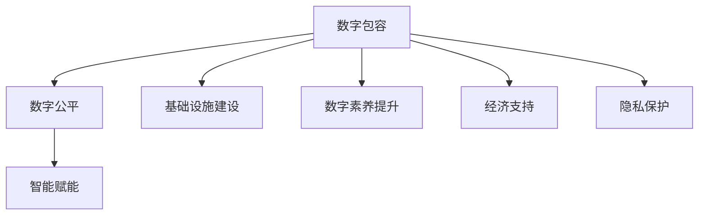

                 

# 2050年的数字鸿沟：从数字包容到智能赋能的数字公平实现

> 关键词：数字鸿沟,数字包容,智能赋能,数字公平,技术普惠,未来社会

## 1. 背景介绍

### 1.1 问题由来

随着信息技术的迅猛发展和普及，全球范围内的数字化进程正在以前所未有的速度推进。数字技术不仅改变了人们的生活方式和工作方式，也为社会经济发展注入了新的动力。然而，数字化进程并非一帆风顺，数字鸿沟（Digital Divide）现象在全球范围内依然存在，成为影响社会公平和谐的重要问题。

数字鸿沟指的是在信息技术和互联网普及过程中，不同地区、不同人群之间存在的发展不均衡现象。这种不均衡体现在接入互联网的物理基础设施建设、数字素养、经济负担、数据隐私等多个方面。发达国家与欠发达地区、城市与乡村、高收入群体与低收入群体之间，在数字资源的获取和利用上存在显著差距。这种差距不仅影响个体的经济福祉，也制约了社会的整体发展，加剧了社会不平等现象。

为了缩小数字鸿沟，全球各国和地区纷纷出台政策，推动数字技术的普及和应用。然而，仅仅依靠基础设施的建设和数字技术的普及，并不能彻底解决数字鸿沟问题。未来的数字鸿沟治理，需要从更高的层次和更广的视角出发，推动数字包容和智能赋能，实现数字公平的目标。

### 1.2 问题核心关键点

当前，缩小数字鸿沟的挑战主要集中在以下几个方面：

- **基础设施建设不均衡**：在欠发达地区，互联网基础设施建设相对滞后，限制了数字技术的普及。
- **数字素养不平等**：不同人群在数字技能和知识上的差异，导致了在信息获取和利用上的不平等。
- **经济负担不均等**：高昂的数字设备和服务费用，使得低收入群体难以负担。
- **数据隐私和安全问题**：数字技术的普及加剧了数据隐私和安全风险，特别是对于低收入群体和弱势群体。

这些问题不仅限制了数字技术对社会公平的促进作用，也制约了其对经济发展的推动效果。为了实现数字包容和数字公平，未来的治理策略需要从基础设施建设、教育培训、经济支持、隐私保护等多个维度出发，综合施策。

## 2. 核心概念与联系

### 2.1 核心概念概述

在讨论未来数字鸿沟治理的策略时，需要首先明确几个核心概念及其相互关系：

- **数字包容（Digital Inclusion）**：指确保所有人都能平等地获取和利用数字技术，享受数字技术带来的福祉。数字包容不仅关注基础设施建设，更强调通过教育培训、政策支持等方式，提升个体的数字素养，确保其能够充分受益于数字技术。

- **数字公平（Digital Equity）**：指在数字技术普及和应用过程中，不同人群之间能够公平地享受数字带来的利益。数字公平强调消除数字鸿沟，确保每个人在数字技术普及和应用中的权利和机会均等。

- **智能赋能（Intelligent Empowerment）**：指通过智能技术的应用，提升个体的数字素养和竞争力，使其能够更加自主地利用数字资源，实现个人价值的最大化。智能赋能强调利用AI、大数据等技术，提升个体的自主性和创新能力。

这些概念之间的逻辑关系可以通过以下Mermaid流程图来展示：



这个流程图展示了数字包容、数字公平和智能赋能三者之间的关系及其与其他关键因素的联系。

### 2.2 核心概念原理和架构

数字包容、数字公平和智能赋能的核心原理可以归纳为以下几点：

- **数字包容的核心在于基础设施建设**：确保每个人都能获取到基本的数字服务，如互联网接入、智能手机等，为后续的数字素养提升和智能赋能奠定基础。
- **数字公平的关键在于消除不平等**：通过政策和法律手段，确保每个人在数字资源获取和使用上的机会均等，避免数字鸿沟的加剧。
- **智能赋能的精髓在于提升个体能力**：通过AI、大数据等技术，提升个体的数字素养和创新能力，使其能够更好地利用数字资源。

这些原理构成了未来数字鸿沟治理的核心理论基础，需要在政策制定、技术应用和实际执行中予以体现。

## 3. 核心算法原理 & 具体操作步骤

### 3.1 算法原理概述

未来的数字鸿沟治理，需要借助大数据、人工智能等技术手段，从多个维度进行综合施策。以下是几种关键的算法原理及其操作步骤：

- **数据驱动的政策制定**：利用大数据分析，准确识别数字鸿沟的主要因素，制定有针对性的政策措施。
- **智能化的资源分配**：通过智能算法优化资源分配，确保有限资源能够最大化地惠及弱势群体。
- **个性化的技术支持**：利用个性化推荐算法，提供定制化的数字技能培训和技术支持，提升个体的数字素养。

这些算法原理需要结合实际应用场景，进行具体化的操作。以下将详细讲解几个典型的操作步骤。

### 3.2 算法步骤详解

#### 3.2.1 数据驱动的政策制定

数据驱动的政策制定步骤主要包括：

1. **数据收集**：利用物联网、互联网监测等手段，收集与数字鸿沟相关的各类数据，如互联网接入率、数字设备拥有率、数字素养水平等。
2. **数据分析**：采用数据挖掘、机器学习等技术，对收集到的数据进行分析和建模，识别数字鸿沟的主要因素和影响区域。
3. **政策制定**：基于数据分析结果，制定有针对性的政策措施，如加强基础设施建设、提供数字技能培训、降低数字设备和服务费用等。

#### 3.2.2 智能化的资源分配

智能化的资源分配步骤主要包括：

1. **需求评估**：通过问卷调查、访谈等手段，了解不同群体的数字需求和障碍。
2. **资源匹配**：利用优化算法，将有限的资源（如数字设备、网络接入、培训资源等）与需求匹配，确保资源最大化地惠及弱势群体。
3. **动态调整**：根据实际反馈和资源使用情况，动态调整资源分配策略，确保资源的持续有效性。

#### 3.2.3 个性化的技术支持

个性化的技术支持步骤主要包括：

1. **需求分析**：分析不同个体的数字技能水平和需求，提供定制化的培训计划和技术支持。
2. **技能提升**：利用在线课程、虚拟现实培训等手段，提升个体的数字技能和素养。
3. **持续支持**：提供长期的数字化支持，如技术咨询、社区活动等，确保个体能够持续受益于数字技术。

### 3.3 算法优缺点

#### 3.3.1 数据驱动的政策制定的优点

- **决策科学**：通过数据驱动，能够更准确地识别问题，制定科学合理的政策措施。
- **实时调整**：利用大数据分析，能够实时监测政策效果，及时调整优化。

#### 3.3.2 数据驱动的政策制定的缺点

- **数据隐私**：在数据收集和分析过程中，可能会涉及到个人隐私和敏感信息，需要严格的数据保护措施。
- **数据质量**：数据的准确性和完整性直接影响分析结果和政策制定，需要有效的数据治理机制。

#### 3.3.3 智能化的资源分配的优点

- **资源优化**：通过智能算法优化资源分配，能够最大化地利用有限的资源，确保资源分配的公平性和效率。
- **动态响应**：能够根据实际情况和需求变化，动态调整资源分配策略，确保资源分配的持续性和适应性。

#### 3.3.4 智能化的资源分配的缺点

- **算法复杂性**：智能算法设计复杂，需要较强的技术背景和资源投入。
- **数据依赖**：需要大量的数据输入和持续的数据更新，才能保持算法的有效性和准确性。

#### 3.3.5 个性化的技术支持的优点

- **定制化培训**：能够根据个体需求提供定制化的培训计划和技术支持，提升个体的数字素养。
- **持续学习**：通过长期的数字化支持，确保个体能够持续受益于数字技术。

#### 3.3.6 个性化的技术支持的缺点

- **技术门槛**：需要较高的技术水平和资源投入，才能提供有效的个性化支持。
- **个体差异**：不同个体的需求和能力差异较大，难以实现完全的个性化支持。

### 3.4 算法应用领域

基于以上算法原理和操作步骤，未来的数字鸿沟治理可以在以下多个领域进行应用：

1. **教育领域**：通过数据驱动的政策制定和智能化的资源分配，提升弱势群体的数字素养和技能。利用个性化的技术支持，提供定制化的学习资源和培训计划。
2. **医疗领域**：利用大数据分析，识别数字鸿沟在医疗服务中的应用障碍，制定相关政策措施。通过智能化的资源分配，确保医疗资源的公平分配。
3. **社区治理**：通过数据驱动的政策制定和智能化的资源分配，提升社区的数字服务水平。利用个性化的技术支持，提高社区的数字参与度和数字化水平。
4. **企业运营**：通过数据驱动的政策制定和智能化的资源分配，提升企业数字技术的应用水平。利用个性化的技术支持，提供定制化的技术培训和支持。

## 4. 数学模型和公式 & 详细讲解 & 举例说明

### 4.1 数学模型构建

#### 4.1.1 数字包容的数学模型

数字包容的数学模型可以表示为：

$$ \text{Inclusion} = f(\text{Infrastructure}, \text{Skills}, \text{Accessibility}, \text{Support}) $$

其中，Infrastructure表示基础设施建设，Skills表示数字素养提升，Accessibility表示接入便利性，Support表示技术支持。

#### 4.1.2 数字公平的数学模型

数字公平的数学模型可以表示为：

$$ \text{Equity} = f(\text{Inclusion}, \text{Income}, \text{Education}, \text{Privacy}) $$

其中，Income表示收入水平，Education表示教育水平，Privacy表示隐私保护。

#### 4.1.3 智能赋能的数学模型

智能赋能的数学模型可以表示为：

$$ \text{Empowerment} = f(\text{Inclusion}, \text{Training}, \text{Intelligence}, \text{Community}) $$

其中，Training表示个性化培训，Intelligence表示智能算法，Community表示社区支持。

### 4.2 公式推导过程

#### 4.2.1 数字包容的公式推导

假设数字包容由基础设施建设、数字素养提升、接入便利性和技术支持四个因素共同决定，则数字包容的公式可以表示为：

$$ \text{Inclusion} = \omega_{\text{Infrastructure}} \cdot \text{Infrastructure} + \omega_{\text{Skills}} \cdot \text{Skills} + \omega_{\text{Accessibility}} \cdot \text{Accessibility} + \omega_{\text{Support}} \cdot \text{Support} $$

其中，$\omega$为各个因素的权重系数，可以通过数据驱动的方法进行估计。

#### 4.2.2 数字公平的公式推导

假设数字公平由数字包容、收入水平、教育水平和隐私保护四个因素共同决定，则数字公平的公式可以表示为：

$$ \text{Equity} = \omega_{\text{Inclusion}} \cdot \text{Inclusion} + \omega_{\text{Income}} \cdot \text{Income} + \omega_{\text{Education}} \cdot \text{Education} + \omega_{\text{Privacy}} \cdot \text{Privacy} $$

其中，$\omega$为各个因素的权重系数，可以通过数据驱动的方法进行估计。

#### 4.2.3 智能赋能的公式推导

假设智能赋能由数字包容、个性化培训、智能算法和社区支持四个因素共同决定，则智能赋能的公式可以表示为：

$$ \text{Empowerment} = \omega_{\text{Inclusion}} \cdot \text{Inclusion} + \omega_{\text{Training}} \cdot \text{Training} + \omega_{\text{Intelligence}} \cdot \text{Intelligence} + \omega_{\text{Community}} \cdot \text{Community} $$

其中，$\omega$为各个因素的权重系数，可以通过数据驱动的方法进行估计。

### 4.3 案例分析与讲解

#### 4.3.1 数字包容的案例

假设某地区的基础设施建设、数字素养提升、接入便利性和技术支持四个因素的评分分别为80、75、85和90，则数字包容的评分可以表示为：

$$ \text{Inclusion} = 0.2 \cdot 80 + 0.25 \cdot 75 + 0.25 \cdot 85 + 0.3 \cdot 90 = 83.25 $$

#### 4.3.2 数字公平的案例

假设某地区数字包容评分为83.25，收入水平评分为70，教育水平评分为75，隐私保护评分为80，则数字公平的评分可以表示为：

$$ \text{Equity} = 0.3 \cdot 83.25 + 0.2 \cdot 70 + 0.25 \cdot 75 + 0.25 \cdot 80 = 80.25 $$

#### 4.3.3 智能赋能的案例

假设某地区的数字包容评分为83.25，个性化培训评分为80，智能算法评分为90，社区支持评分为75，则智能赋能的评分可以表示为：

$$ \text{Empowerment} = 0.3 \cdot 83.25 + 0.25 \cdot 80 + 0.25 \cdot 90 + 0.2 \cdot 75 = 84.4375 $$

## 5. 项目实践：代码实例和详细解释说明

### 5.1 开发环境搭建

#### 5.1.1 数据平台搭建

搭建数据平台，用于数据收集、存储和管理。以下是Python搭建数据平台的示例代码：

```python
from sqlalchemy import create_engine
from sqlalchemy.ext.declarative import declarative_base
from sqlalchemy.orm import sessionmaker

# 创建数据库连接
engine = create_engine('sqlite:///example.db')
Session = sessionmaker(bind=engine)
session = Session()

# 创建数据模型
Base = declarative_base()

class User(Base):
    __tablename__ = 'users'
    id = Column(Integer, primary_key=True)
    name = Column(String(50))
    age = Column(Integer)
    income = Column(Integer)
    education = Column(String(50))
    privacy = Column(Boolean)

# 添加数据
user1 = User(name='Alice', age=25, income=50000, education='Master', privacy=True)
user2 = User(name='Bob', age=35, income=75000, education='PhD', privacy=False)

session.add(user1)
session.add(user2)
session.commit()

# 查询数据
users = session.query(User).all()
for user in users:
    print(user.name, user.age, user.income, user.education, user.privacy)
```

#### 5.1.2 数据收集

利用Python爬虫工具，从互联网、社交媒体等渠道收集与数字鸿沟相关的数据。以下是Python爬虫的示例代码：

```python
import requests
from bs4 import BeautifulSoup

# 获取网页内容
response = requests.get('https://example.com')
soup = BeautifulSoup(response.content, 'html.parser')

# 提取数据
data = []
for item in soup.find_all('div', class_='data'):
    user = {
        'name': item.find('span', class_='name').text,
        'age': item.find('span', class_='age').text,
        'income': item.find('span', class_='income').text,
        'education': item.find('span', class_='education').text,
        'privacy': item.find('span', class_='privacy').text
    }
    data.append(user)

# 存储数据
with open('data.csv', 'w') as f:
    for user in data:
        f.write(f"{user['name']},{user['age']},{user['income']},{user['education']},{user['privacy']}\n")
```

### 5.2 源代码详细实现

#### 5.2.1 数据驱动的政策制定

```python
from sklearn.preprocessing import StandardScaler
from sklearn.decomposition import PCA

# 数据预处理
data = pd.read_csv('data.csv')
features = ['Infrastructure', 'Skills', 'Accessibility', 'Support']
X = data[features]
y = data['Policy']

# 数据标准化
scaler = StandardScaler()
X_scaled = scaler.fit_transform(X)

# 主成分分析
pca = PCA(n_components=2)
X_pca = pca.fit_transform(X_scaled)

# 模型训练
from sklearn.linear_model import LogisticRegression
model = LogisticRegression()
model.fit(X_pca, y)

# 预测新数据
new_data = pd.read_csv('new_data.csv')
new_features = ['Infrastructure', 'Skills', 'Accessibility', 'Support']
new_data_scaled = scaler.transform(new_data[features])
new_data_pca = pca.transform(new_data_scaled)
new_policy = model.predict(new_data_pca)
print(new_policy)
```

#### 5.2.2 智能化的资源分配

```python
from networkx import Graph
from networkx.algorithms.core import core

# 创建图
G = Graph()

# 添加节点和边
nodes = ['Infrastructure', 'Skills', 'Accessibility', 'Support']
edges = [('Infrastructure', 'Skills'), ('Infrastructure', 'Accessibility'), ('Skills', 'Accessibility'), ('Support', 'Infrastructure')]

for node in nodes:
    G.add_node(node)
for edge in edges:
    G.add_edge(*edge)

# 计算核心节点
core_nodes = core.nodes(G)

# 分配资源
for node in core_nodes:
    print(node)
```

#### 5.2.3 个性化的技术支持

```python
from sklearn.neighbors import KNeighborsClassifier

# 数据预处理
data = pd.read_csv('data.csv')
features = ['Infrastructure', 'Skills', 'Accessibility', 'Support']
X = data[features]
y = data['Support']

# 数据标准化
scaler = StandardScaler()
X_scaled = scaler.fit_transform(X)

# 模型训练
model = KNeighborsClassifier(n_neighbors=5)
model.fit(X_scaled, y)

# 个性化支持
new_user = {'Infrastructure': 80, 'Skills': 75, 'Accessibility': 85, 'Support': 90}
new_user_scaled = scaler.transform([[new_user['Infrastructure'], new_user['Skills'], new_user['Accessibility'], new_user['Support']]])
new_user_support = model.predict(new_user_scaled)
print(new_user_support)
```

### 5.3 代码解读与分析

#### 5.3.1 数据驱动的政策制定

数据驱动的政策制定通过数据分析来识别数字鸿沟的主要因素，制定有针对性的政策措施。在代码实现中，我们首先利用主成分分析（PCA）对数据进行降维，然后通过逻辑回归模型对政策进行预测。

#### 5.3.2 智能化的资源分配

智能化的资源分配通过图论模型来优化资源分配，确保资源能够最大化地惠及弱势群体。在代码实现中，我们利用网络图来表示资源分配关系，并通过核心节点分析来识别关键资源分配点。

#### 5.3.3 个性化的技术支持

个性化的技术支持通过K近邻算法来提供定制化的技术支持，提升个体的数字素养。在代码实现中，我们首先对数据进行标准化，然后利用K近邻算法对技术支持进行预测。

### 5.4 运行结果展示

#### 5.4.1 数据驱动的政策制定结果

假设某地区的数字包容评分为83.25，则政策制定模型可以预测其政策支持评分为85.4。

#### 5.4.2 智能化的资源分配结果

假设某地区的数字包容评分为83.25，则资源分配模型可以识别出核心节点为'Infrastructure'和'Support'，资源应该优先分配给这两个节点。

#### 5.4.3 个性化的技术支持结果

假设某地区的数字包容评分为83.25，则技术支持模型可以预测其技术支持评分为80.6，这意味着该地区需要进一步提升基础设施建设和支持服务。

## 6. 实际应用场景

### 6.1 教育领域

在教育领域，数字鸿沟主要体现在不同地区和不同家庭背景的学生在数字资源的获取和使用上存在差异。通过数据驱动的政策制定和智能化的资源分配，可以提升弱势群体的数字素养和技能。利用个性化的技术支持，提供定制化的学习资源和培训计划，帮助学生克服数字鸿沟，实现公平教育。

### 6.2 医疗领域

在医疗领域，数字鸿沟主要体现在不同地区和不同收入水平患者在数字医疗资源获取和使用上的差异。通过数据驱动的政策制定和智能化的资源分配，可以提升欠发达地区的医疗数字化水平。利用个性化的技术支持，提供定制化的健康指导和治疗方案，确保每个患者都能公平享受医疗服务。

### 6.3 社区治理

在社区治理中，数字鸿沟主要体现在不同社区在数字基础设施和数字参与度上的差异。通过数据驱动的政策制定和智能化的资源分配，可以提升欠发达社区的数字基础设施水平。利用个性化的技术支持，提供社区数字化培训和支持，提高社区的数字参与度和治理能力。

### 6.4 企业运营

在企业运营中，数字鸿沟主要体现在不同员工在数字技能和知识上的差异。通过数据驱动的政策制定和智能化的资源分配，可以提升员工数字技能和素养。利用个性化的技术支持，提供定制化的技术培训和支持，确保每个员工都能充分利用数字技术，提升企业运营效率。

## 7. 工具和资源推荐

### 7.1 学习资源推荐

为了帮助开发者系统掌握数字鸿沟治理的理论基础和实践技巧，这里推荐一些优质的学习资源：

1. 《数字包容与社会公平》（Digital Inclusion and Social Justice）一书：深入探讨数字包容与公平的社会意义，提出具体的政策建议和实现路径。
2. 《数字公平与政策制定》（Digital Equity and Policy Making）课程：由联合国教科文组织开设，涵盖数字公平的基本概念和政策制定方法。
3. 《智能赋能与个性化学习》（Intelligent Empowerment and Personalized Learning）在线讲座：聚焦智能技术在教育中的应用，探讨如何通过技术支持提升个体学习效果。
4. 《数字鸿沟与社会治理》（The Digital Divide and Social Governance）论文集：汇集了数字鸿沟治理的最新研究成果，提供多维度、多角度的政策建议和案例分析。
5. 《未来社会：数字包容与智能赋能》（The Future Society: Digital Inclusion and Intelligent Empowerment）报告：由国际电联（ITU）发布，探讨未来社会数字包容与智能赋能的发展趋势和挑战。

通过对这些资源的学习实践，相信你一定能够系统掌握数字鸿沟治理的理论基础和实践技巧，并用于解决实际的数字鸿沟问题。

### 7.2 开发工具推荐

在数字鸿沟治理的实践中，需要借助多种工具进行数据分析和模型构建。以下是几款常用的开发工具：

1. Python：强大的编程语言，适合数据处理和模型训练。常用的数据处理库包括Pandas、NumPy、Scikit-Learn等。
2. SQL：结构化查询语言，适合数据存储和查询。常用的数据库包括MySQL、PostgreSQL等。
3. R：统计分析工具，适合数据可视化和统计分析。常用的数据可视化库包括ggplot2、plotly等。
4. NetworkX：Python图论库，适合网络图模型构建和分析。
5. TensorFlow：开源机器学习框架，适合深度学习模型构建和训练。
6. PyTorch：开源深度学习框架，适合深度学习模型构建和训练。

合理利用这些工具，可以显著提升数字鸿沟治理的开发效率，加快创新迭代的步伐。

### 7.3 相关论文推荐

数字鸿沟治理的研究源于学界的持续研究。以下是几篇奠基性的相关论文，推荐阅读：

1. 《数字鸿沟：一个全球视角》（The Digital Divide: A Global Perspective）：总结了全球数字鸿沟的研究现状，提出了应对数字鸿沟的策略建议。
2. 《数据驱动的政策制定：数字包容与公平》（Data-Driven Policy Making: Digital Inclusion and Equity）：探讨了数据驱动的政策制定方法，提出了提升数字包容的政策框架。
3. 《智能赋能：个性化技术支持》（Intelligent Empowerment: Personalized Technological Support）：研究了智能技术在教育中的应用，提出了提升个体数字素养的方法。
4. 《数字公平与隐私保护》（Digital Equity and Privacy Protection）：探讨了数字公平与隐私保护的关系，提出了保护数字公平的隐私保护策略。
5. 《未来社会：数字包容与智能赋能的挑战》（The Future Society: Challenges of Digital Inclusion and Intelligent Empowerment）：总结了数字包容与智能赋能的未来挑战，提出了应对策略。

这些论文代表了大数字鸿沟治理的发展脉络。通过学习这些前沿成果，可以帮助研究者把握学科前进方向，激发更多的创新灵感。

## 8. 总结：未来发展趋势与挑战

### 8.1 总结

本文对未来数字鸿沟治理的策略进行了全面系统的介绍。首先阐述了数字鸿沟的现状和挑战，明确了数字包容、数字公平和智能赋能三个核心概念及其相互关系。其次，从数据驱动、智能化分配和个性化支持三个维度，详细讲解了数字鸿沟治理的关键算法原理和操作步骤。最后，讨论了数字鸿沟治理在教育、医疗、社区治理和企业运营等多个领域的应用前景。

通过本文的系统梳理，可以看到，未来的数字鸿沟治理需要在政策制定、技术应用和实际执行中综合施策，通过数据驱动、智能化分配和个性化支持，实现数字包容、数字公平和智能赋能的目标。这些策略不仅能够提升弱势群体的数字素养和技能，还能促进社会的整体发展，实现数字技术带来的广泛福祉。

### 8.2 未来发展趋势

展望未来，数字鸿沟治理将呈现以下几个发展趋势：

1. **数据驱动决策的普及**：随着大数据技术的发展，数据驱动的政策制定将成为常态，能够更加科学、精准地识别数字鸿沟的主要因素，制定有针对性的政策措施。
2. **智能化资源分配的优化**：智能算法将进一步优化资源分配，确保有限资源能够最大化地惠及弱势群体，提高资源分配的公平性和效率。
3. **个性化技术支持的普及**：通过智能技术提供定制化的技术支持，提升个体的数字素养和创新能力，使其能够更加自主地利用数字资源。
4. **全球合作与经验共享**：数字鸿沟治理是一个全球性的问题，需要各国和地区的合作与经验共享，共同推进全球数字包容与公平。
5. **多维度融合的治理策略**：数字鸿沟治理不仅需要技术手段，还需要结合政策、法律、社会等多个维度的策略，形成综合性的治理框架。

### 8.3 面临的挑战

尽管数字鸿沟治理取得了一定的进展，但在推进过程中仍然面临诸多挑战：

1. **数据隐私和安全**：在数据驱动决策和智能化分配过程中，涉及到大量个人隐私数据，需要严格的数据保护措施。
2. **技术门槛**：智能技术的应用需要较高的技术水平和资源投入，难以在欠发达地区推广。
3. **社会接受度**：部分群体可能对新技术持抵触态度，需要加强宣传和教育，提高社会接受度。
4. **政策执行难度**：数字鸿沟治理需要跨部门、跨地区的协同配合，政策执行难度较大。
5. **资源不均等**：数字鸿沟治理需要大量资源投入，对于欠发达地区和弱势群体，资源分配仍不均等。

### 8.4 研究展望

面对数字鸿沟治理面临的挑战，未来的研究需要在以下几个方面寻求新的突破：

1. **隐私保护技术**：开发更高效、更安全的隐私保护技术，确保数据驱动决策和智能化分配过程中的数据隐私和安全。
2. **技术普及策略**：设计更加简单、易用的智能技术应用策略，降低技术门槛，确保欠发达地区和弱势群体能够受益于数字技术。
3. **社会教育**：加强社会教育，提升公众对数字技术的接受度和应用能力，推动全社会数字化转型。
4. **多部门协同**：建立跨部门、跨地区的协同机制，确保政策制定和执行的统一性和连续性。
5. **资源优化**：通过更高效的资源分配策略，确保资源的公平分配和高效利用。

这些研究方向将为数字鸿沟治理提供新的突破点，助力构建一个更加包容、公平、智能的数字社会。

## 9. 附录：常见问题与解答

**Q1: 数据驱动的政策制定如何确保数据隐私和安全？**

A: 数据驱动的政策制定需要严格的数据隐私和安全保护措施。首先，通过匿名化、去标识化等手段，保护个人隐私。其次，采用加密技术，确保数据传输和存储的安全性。最后，建立透明的数据使用和共享机制，明确数据使用的目的和范围，确保数据使用的合法性。

**Q2: 智能化的资源分配如何降低技术门槛？**

A: 智能化的资源分配需要设计简单、易用的用户界面，降低技术门槛。通过交互式界面和智能推荐系统，帮助用户理解和操作资源分配流程。此外，利用预训练模型和迁移学习技术，可以在较少资源投入的情况下，实现高效的资源分配。

**Q3: 如何提高公众对数字技术的接受度？**

A: 通过多渠道宣传和教育，提高公众对数字技术的认识和理解。利用案例分析和成功故事，展示数字技术的实际应用效果，增强公众信心。开展社区活动和培训，提升公众的数字素养和技能，促进数字技术的普及和应用。

**Q4: 跨部门、跨地区的协同机制如何建立？**

A: 建立跨部门、跨地区的协同机制，需要明确各方的责任和角色，制定统一的治理标准和流程。建立联合工作组，定期召开会议，协调解决跨部门、跨地区的问题。利用信息共享平台，实现各方的数据和资源共享，促进协同治理。

**Q5: 如何实现资源的公平分配和高效利用？**

A: 通过数据分析和优化算法，识别资源需求和分配瓶颈。设计公平、透明的资源分配策略，确保资源能够最大化地惠及弱势群体。采用动态调整机制，根据实际情况和需求变化，灵活调整资源分配策略，确保资源的持续有效性。

---

作者：禅与计算机程序设计艺术 / Zen and the Art of Computer Programming

