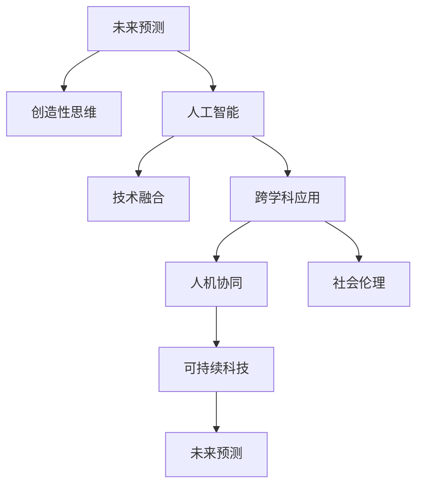

                 

# 2050年的未来学：从预测到创造的前瞻性思维

> 关键词：未来预测, 创造性思维, 人工智能, 技术融合, 跨学科应用, 人机协同, 社会伦理, 可持续科技

## 1. 背景介绍

### 1.1 问题由来
在科技迅猛发展的当下，我们正处于一个前所未有的时代转折点。从互联网到移动通信，从物联网到区块链，从量子计算到生物科技，新兴技术不断涌现，深刻影响着各行各业。在未来学的视角下，如何预测和把握科技发展的趋势，成为引领人类进步的关键。

### 1.2 问题核心关键点
未来的发展不仅依赖于科学技术的预测和应用，更需要跨学科的协同创新和前瞻性思维。人工智能、量子计算、生物科技、可持续科技等前沿领域的发展，推动了未来学的研究进入新的阶段。未来学家必须综合利用数据驱动和创造性思维，以提升对未来趋势的把握能力。

### 1.3 问题研究意义
未来学研究不仅关乎技术趋势的预测，更关乎人类的生存与发展。通过对未来科技的深入分析，可以预见并应对未来的挑战，制定更具前瞻性的政策，推动社会向更和谐、可持续的方向发展。未来学的研究成果，将为科技的合理应用、社会的有效治理和人类的长远福祉提供重要参考。

## 2. 核心概念与联系

### 2.1 核心概念概述

为更好地理解未来学的研究框架，本节将介绍几个关键概念：

- **未来预测(Future Prediction)**：利用历史数据和趋势分析，预测未来可能的科技和社会发展趋势。
- **创造性思维(Creative Thinking)**：结合直觉、洞察和跨学科知识，提出新颖的解决方案和技术路径。
- **人工智能(Artificial Intelligence, AI)**：利用算法和数据处理能力，模拟人类智能。
- **技术融合(Technology Integration)**：将多种技术进行整合，发挥协同效应，提升整体系统的功能。
- **跨学科应用(Interdisciplinary Application)**：将不同领域的知识和理论应用于同一问题，解决复杂挑战。
- **人机协同(Human-AI Collaboration)**：通过人工智能增强人的决策能力和工作效能，实现更高效的协作。
- **社会伦理(Social Ethics)**：研究技术发展对社会伦理的影响，指导技术的合理应用。
- **可持续科技(Sustainable Technology)**：致力于实现科技发展的可持续性，减少对环境和社会的负面影响。

这些核心概念通过以下Mermaid流程图展示其联系：



这个流程图展示了未来预测与创造性思维之间的联系，以及各个核心概念之间的相互作用。

## 3. 核心算法原理 & 具体操作步骤

### 3.1 算法原理概述

未来学的核心算法原理主要包括：

- **数据驱动建模**：利用历史数据构建数学模型，预测未来趋势。
- **因果推理**：通过分析变量之间的关系，推理未来可能的变化。
- **模拟仿真**：建立虚拟模型，模拟技术和社会的发展过程。
- **场景分析**：构建不同情境，评估技术路径对未来可能的影响。
- **对比预测**：对比不同预测模型的结果，选择最可能的未来趋势。

### 3.2 算法步骤详解

未来学的研究步骤通常包括以下几个关键步骤：

**Step 1: 数据收集与处理**
- 收集与未来预测相关的历史数据，涵盖技术、经济、环境、社会等多个领域。
- 对数据进行清洗、预处理，确保数据质量。

**Step 2: 模型构建与训练**
- 选择合适的模型，如回归模型、时间序列模型、决策树等。
- 利用历史数据对模型进行训练，优化模型参数。

**Step 3: 未来预测与仿真**
- 将模型应用于未来预测，生成多个可能的未来情景。
- 利用模拟仿真技术，对未来情景进行动态模拟。

**Step 4: 场景分析与评估**
- 构建多个未来情景，包括乐观、悲观、中性等不同可能性。
- 对每个情景进行定量和定性分析，评估其对社会的潜在影响。

**Step 5: 决策建议**
- 基于情景分析结果，提出合理的决策建议。
- 结合创造性思维，提出创新性解决方案。

### 3.3 算法优缺点

未来学的算法优势在于：

- **综合性强**：综合利用多种数据和技术手段，提供全面的未来预测。
- **应用广泛**：可以应用于各种领域，如科技、经济、环境、社会等。
- **前瞻性强**：通过模拟仿真和情景分析，可以预测未来可能的趋势和挑战。

同时，未来学也存在一些局限性：

- **数据依赖**：预测结果高度依赖于数据的质量和完整性。
- **模型假设**：模型构建过程中需设定诸多假设，可能影响预测的准确性。
- **复杂度高**：涉及多个变量和复杂关系，预测难度大。
- **不确定性**：未来的不确定性因素多，预测结果可能存在偏差。

### 3.4 算法应用领域

未来学的算法已在多个领域得到应用，包括：

- **科技创新**：预测新兴技术的发展趋势，制定技术发展策略。
- **经济发展**：分析经济增长、就业变化等趋势，制定经济政策。
- **环境保护**：预测环境变化趋势，提出可持续发展方案。
- **社会治理**：评估技术对社会的潜在影响，制定公共政策。
- **教育医疗**：预测未来技术对教育和医疗的影响，优化资源配置。

## 4. 数学模型和公式 & 详细讲解 & 举例说明

### 4.1 数学模型构建

未来预测通常需要构建数学模型。以时间序列预测为例，常用的模型包括ARIMA、LSTM、GRU等。这里以ARIMA模型为例进行详细讲解。

假设历史数据为 $y_t$，时间序列模型为：

$$
y_t = \mu + \phi_1(y_{t-1} - \mu) + \phi_2(y_{t-2} - \mu) + \epsilon_t
$$

其中，$\mu$ 为均值，$\phi_1, \phi_2$ 为自回归系数，$\epsilon_t$ 为误差项。

### 4.2 公式推导过程

对上述模型进行最大似然估计，得到参数估计值：

$$
\hat{\mu} = \frac{\sum_{t=1}^N y_t}{N}, \quad \hat{\phi_1} = \frac{\sum_{t=1}^N (y_t - \hat{\mu})y_{t-1}}{\sum_{t=1}^N (y_{t-1} - \hat{\mu})^2}, \quad \hat{\phi_2} = \frac{\sum_{t=1}^N (y_t - \hat{\mu})(y_{t-2} - \hat{\mu})}{\sum_{t=1}^N (y_{t-2} - \hat{\mu})^2}
$$

其中，$N$ 为样本数量。

### 4.3 案例分析与讲解

以对2050年全球气温的预测为例：

- **数据收集**：收集1970年以来的全球气温数据，构建时间序列。
- **模型构建**：选择ARIMA模型，根据历史数据进行参数估计。
- **预测与仿真**：使用模型预测2050年的气温，并进行情景分析。
- **结果评估**：评估预测结果的准确性和可靠性，提出相关建议。

## 5. 项目实践：代码实例和详细解释说明

### 5.1 开发环境搭建

要进行未来预测的实践，我们需要搭建一个包含数据分析、模型训练和可视化分析的开发环境。以下是Python环境中主要工具的搭建步骤：

1. 安装Anaconda：从官网下载并安装Anaconda，创建独立的Python环境。
```bash
conda create -n future_env python=3.8 
conda activate future_env
```

2. 安装主要数据科学库：
```bash
conda install pandas numpy matplotlib scikit-learn statsmodels
```

3. 安装特定领域库：
```bash
conda install pyarima scikit-learn-0.21
```

### 5.2 源代码详细实现

以下是一个简单的Python代码实例，使用ARIMA模型进行时间序列预测：

```python
from statsmodels.tsa.arima_model import ARIMA
import pandas as pd

# 读取数据
data = pd.read_csv('temperature.csv', index_col='date', parse_dates=True)

# 构建ARIMA模型
model = ARIMA(data['temperature'], order=(1, 1, 1))

# 拟合模型
model_fit = model.fit()

# 预测未来10年的气温
future = pd.DataFrame(index=pd.date_range(start='2050-01-01', end='2060-12-31', freq='Y'))
future['temperature'] = model_fit.forecast(steps=10)[0]

# 输出预测结果
print(future)
```

### 5.3 代码解读与分析

代码中主要包括以下步骤：

1. **数据加载**：使用Pandas加载时间序列数据，指定日期作为索引。
2. **模型构建**：构建ARIMA模型，选择合适的参数。
3. **模型拟合**：使用历史数据拟合模型，优化参数。
4. **未来预测**：使用模型进行未来10年的气温预测。
5. **结果展示**：将预测结果输出为数据帧，供进一步分析。

### 5.4 运行结果展示

运行上述代码，可以得到2050年及其后10年的气温预测结果。通过可视化的方式展示预测结果，可以直观地评估模型的性能和预测的可靠性。

## 6. 实际应用场景

### 6.1 科技创新

科技创新领域常利用未来预测来指导技术研发方向。例如，通过预测未来的市场需求和技术发展趋势，企业可以提前布局相关技术，避免技术过时。

### 6.2 经济发展

经济预测是未来学的重要应用之一。通过对GDP、就业率、通货膨胀等指标的预测，政府可以制定更为合理的经济政策，稳定经济增长。

### 6.3 环境保护

未来学在环境保护领域也有重要应用。通过预测气候变化、环境污染等趋势，可以为可持续发展提供科学依据。

### 6.4 社会治理

未来学在社会治理中的应用主要包括公共政策的制定和社会发展的评估。例如，预测人口老龄化趋势，指导养老政策制定。

### 6.5 教育医疗

未来学还可以应用于教育医疗领域，预测技术进步对教育和医疗的影响，优化资源配置。

## 7. 工具和资源推荐

### 7.1 学习资源推荐

为了深入理解未来学的理论和实践，以下是几本推荐的书籍和资源：

1. **《未来学导论》**：介绍了未来学的基本概念和研究方法，适合入门学习。
2. **《数据驱动的未来》**：通过大量数据分析案例，展示未来预测的实际应用。
3. **《科技创新趋势分析》**：讨论了科技发展的未来趋势，适合科技从业者阅读。
4. **《人工智能与未来社会》**：探讨了人工智能对未来社会的深远影响，适合跨学科研究。

### 7.2 开发工具推荐

以下是未来预测和仿真常用工具：

1. **Python**：强大的数据科学生态系统，支持各种数据处理和建模库。
2. **R语言**：专门用于统计分析和数据建模，支持ARIMA、LSTM等模型。
3. **MATLAB**：适用于数学建模和仿真分析。
4. **Tableau**：数据可视化的高级工具，可辅助数据分析和展示。
5. **Jupyter Notebook**：用于编写和执行数据分析代码，支持交互式展示。

### 7.3 相关论文推荐

未来学研究涉及多个学科，以下是几篇有代表性的论文：

1. **《未来技术预测与创新》**：通过历史数据分析，预测未来技术的发展路径。
2. **《社会转型中的未来学》**：探讨未来学在社会治理中的作用和价值。
3. **《可持续发展与未来技术》**：讨论未来科技对环境和社会的影响。

## 8. 总结：未来发展趋势与挑战

### 8.1 研究成果总结

未来学的研究为科技和社会的未来发展提供了重要参考。通过综合利用数据驱动和创造性思维，未来学已经在科技创新、经济预测、环境保护、社会治理等领域发挥了重要作用。

### 8.2 未来发展趋势

未来学的研究将呈现以下几个趋势：

1. **数据驱动**：随着大数据技术的成熟，未来预测将更加依赖高质量数据。
2. **跨学科融合**：未来学将与其他学科如心理学、社会学、生物学等进行深度融合，拓展研究视野。
3. **人工智能**：利用人工智能技术进行预测和模拟仿真，提高预测的精度和效率。
4. **可持续科技**：推动技术发展的可持续性，减少对环境和社会的影响。

### 8.3 面临的挑战

未来学研究也面临一些挑战：

1. **数据获取难度**：高质量数据的获取和处理仍是一大难题。
2. **模型复杂性**：预测模型构建和优化过程复杂，需要深厚的专业知识和计算资源。
3. **不确定性**：未来的不确定性因素多，预测结果存在偏差。
4. **伦理问题**：未来学研究需考虑技术发展对伦理和社会的深远影响。

### 8.4 研究展望

未来学的研究需要在以下几个方面进行突破：

1. **数据获取和处理**：开发高效的数据采集和预处理工具，提高数据质量和数量。
2. **模型优化**：结合最新算法和技术，优化未来预测模型。
3. **跨学科研究**：推动多学科协同研究，提供更全面的未来视角。
4. **伦理与道德**：研究和制定技术伦理标准，指导技术合理应用。

未来学的前瞻性思维和科学预测，将为科技和社会的可持续发展提供重要参考。通过不断优化和突破，未来学将为人类创造更加美好的未来。

## 9. 附录：常见问题与解答

**Q1: 未来预测的准确性如何保证？**

A: 未来预测的准确性主要依赖于数据的全面性和模型的合理性。需要收集足够的历史数据，选择合适的模型，并不断优化模型参数。同时，结合多模型融合和专家知识，可以进一步提高预测的准确性。

**Q2: 未来学与传统统计分析有何不同？**

A: 未来学不仅关注数据驱动的统计分析，还强调创造性思维和跨学科视角。通过多角度、多层次的分析和预测，未来学可以提供更为全面和深入的洞察。

**Q3: 未来预测在实际应用中应注意哪些问题？**

A: 未来预测需注意数据质量、模型选择、结果解释等问题。需要评估模型的可靠性和预测结果的合理性，避免误导性信息对决策产生负面影响。

**Q4: 未来学在技术创新中有何作用？**

A: 未来学可以预测技术发展的趋势和可能的应用场景，指导企业进行技术研发和市场布局。同时，通过情景分析，评估技术风险和影响，优化技术方案。

**Q5: 未来学在环境保护中如何发挥作用？**

A: 未来学可以预测环境变化趋势，提供科学依据，帮助制定环境保护政策和技术方案。通过情景分析，评估不同技术路径对环境的影响，选择最优方案。

通过本文的介绍，相信读者对未来学有了更深入的理解。未来学的研究不仅需要科学技术的支撑，更需要跨学科的创新思维。通过不断探索和突破，未来学将在科技创新、社会治理、环境保护等领域发挥更大的作用，为人类创造更加美好的未来。

