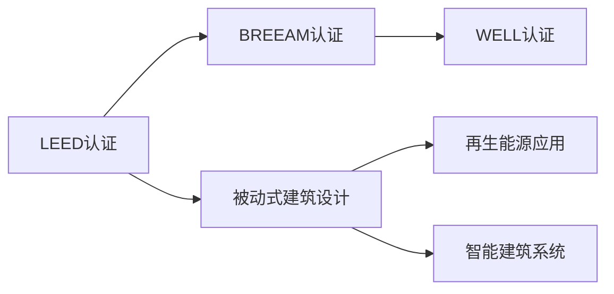

                 

# 2050年的绿色建筑：从节能到生态的可持续建设

在2050年，我们站在一个新的历史节点上，见证着人类社会在绿色建筑领域的深刻变革。随着可持续发展和生态文明的兴起，绿色建筑不仅成为应对气候变化的重要手段，更成为推动社会进步的关键力量。本文将深入探讨2050年绿色建筑的核心理念、核心技术、实践案例及未来展望，致力于为实现可持续生态建设提供新思路和新路径。

## 1. 背景介绍

### 1.1 全球建筑行业现状

当前，全球建筑行业正面临严峻的挑战。建筑领域的能耗占全球总能耗的近40%，成为温室气体排放的主要源头。同时，自然资源的过度消耗和生态环境破坏等问题也日益严重。为了应对这些挑战，绿色建筑应运而生。它通过节能、节水、材料循环利用等手段，降低建筑能耗，保护生态环境，提升建筑品质，为实现可持续发展目标提供坚实基础。

### 1.2 绿色建筑的定义与重要性

绿色建筑是指在建筑设计、施工、运营管理等全生命周期中，通过高效利用资源、节能减排、保护生态环境，实现人与自然和谐共生的建筑。绿色建筑不仅有助于减少建筑行业的碳足迹，还能提升建筑的经济价值和舒适性，是实现全球可持续发展目标的重要途径。

## 2. 核心概念与联系

### 2.1 核心概念概述

绿色建筑涉及众多核心概念，包括：

- **LEED认证**：美国绿色建筑委员会（USGBC）推出的绿色建筑评估标准，广泛应用于全球。
- **BREEAM认证**：英国建筑研究院（BREEAM）开发的绿色建筑评估体系，强调建筑的可持续性。
- **WELL认证**：国际WELL建筑研究院推出的关注建筑健康和福祉的综合评估体系。
- **被动式建筑设计**：通过优化建筑朝向、结构设计等手段，实现自然通风、日光采暖等被动节能方式。
- **再生能源应用**：利用太阳能、风能、地热能等可再生能源，减少建筑对化石燃料的依赖。
- **智能建筑系统**：通过物联网、大数据等技术，实现建筑能源管理的自动化和智能化。

### 2.2 核心概念原理和架构的 Mermaid 流程图



这个流程图展示了绿色建筑的核心概念及其相互关系：

1. **认证体系**：通过LEED、BREEAM、WELL等认证体系，确保建筑在环保、健康等方面达到高标准。
2. **被动设计**：通过优化建筑设计，实现自然通风、日光采暖等节能方式。
3. **再生能源**：利用可再生能源，减少对化石燃料的依赖。
4. **智能系统**：通过物联网、大数据等技术，提升建筑能源管理的自动化和智能化。

这些核心概念构成了绿色建筑的基础框架，为实现可持续发展的目标提供了科学依据和技术支撑。

## 3. 核心算法原理 & 具体操作步骤

### 3.1 算法原理概述

绿色建筑的建设和管理涉及多种学科，包括建筑学、环境科学、工程学等。核心算法原理主要包括以下几个方面：

- **建筑能耗模拟**：通过建筑能耗模拟软件，预测建筑在不同气候条件下的能耗情况，优化建筑设计和运营策略。
- **智能控制系统**：利用物联网技术，实时监控建筑内部的能源消耗情况，动态调整能源使用策略。
- **材料循环利用**：通过数据分析和模型预测，优化建筑材料的生命周期管理，实现材料的循环利用。

### 3.2 算法步骤详解

以建筑能耗模拟为例，算法步骤如下：

1. **数据收集**：收集建筑的地理位置、结构类型、朝向等信息，以及当地气候数据。
2. **建模**：建立建筑能耗模型，考虑建筑的内部结构、材料特性等，模拟建筑的能源使用情况。
3. **模拟计算**：在模拟软件中，输入建筑和气候数据，计算建筑在不同时间段的能耗情况。
4. **优化设计**：根据模拟结果，优化建筑的朝向、窗墙比、隔热材料等设计参数，降低能耗。
5. **评估改进**：通过多次模拟和优化，评估改进效果，确保建筑达到绿色建筑标准。

### 3.3 算法优缺点

绿色建筑的核心算法具有以下优点：

- **科学性**：通过数据驱动的模拟和优化，确保建筑设计的科学性和合理性。
- **节能效果显著**：通过优化设计，显著降低建筑能耗，提升建筑的环保性能。
- **普适性**：适用于不同规模、不同类型的建筑，具有广泛的适用性。

同时，这些算法也存在一些局限性：

- **数据依赖性高**：算法的精度依赖于数据的准确性和完备性，数据质量影响较大。
- **计算复杂度高**：复杂建筑模型的模拟和优化计算量较大，需要高性能计算资源。
- **实施成本高**：优化设计可能涉及建筑结构的重大调整，实施成本较高。

### 3.4 算法应用领域

绿色建筑的核心算法广泛应用于多个领域，包括：

- **住宅建筑**：通过优化设计，降低住宅建筑的能耗，提升居住舒适度。
- **商业建筑**：通过智能化能源管理，降低商业建筑的运营成本，提升经济效益。
- **公共建筑**：通过节能设计，降低公共建筑的能耗，提升公共服务水平。

## 4. 数学模型和公式 & 详细讲解 & 举例说明

### 4.1 数学模型构建

建筑能耗模拟的数学模型主要包括：

- **热传导模型**：描述建筑内部的热量传递过程。
- **风载荷模型**：模拟建筑表面的风载荷，影响建筑的能耗和结构安全。
- **太阳辐射模型**：计算太阳辐射对建筑内外的影响，影响建筑的冷热负荷。

### 4.2 公式推导过程

以热传导模型为例，基本公式为：

$$
Q = U \times A \times \Delta T
$$

其中，$Q$为热流量，$U$为建筑的热阻，$A$为建筑的热交换面积，$\Delta T$为建筑内外的温度差。

### 4.3 案例分析与讲解

假设一栋住宅建筑，夏季白天内部温度为30°C，室外温度为35°C，内部热量为100W，热交换面积为200m²，热阻为0.1，则计算公式如下：

$$
Q = 0.1 \times 200 \times (35 - 30) = 10W
$$

通过热传导模型，我们可以预测在夏季白天，建筑的热流量为10W，从而优化建筑的设计和运营策略，降低能耗。

## 5. 项目实践：代码实例和详细解释说明

### 5.1 开发环境搭建

为实现绿色建筑的计算模拟和优化设计，需要使用到多种软件工具和编程语言。以下是推荐的开发环境搭建步骤：

1. **安装Python和相关库**：Python是实现建筑能耗模拟和优化设计的常用编程语言，需要安装NumPy、Pandas、SciPy等科学计算库。
2. **使用建筑能耗模拟软件**：如EnergyPlus、Ecotect等，这些软件提供了丰富的建筑能耗模拟功能。
3. **搭建Web平台**：使用Flask、Django等Web框架，搭建实时数据监控和优化设计平台。

### 5.2 源代码详细实现

以建筑能耗模拟为例，源代码实现如下：

```python
import numpy as np
from scipy.optimize import minimize

# 定义热传导模型
def heat_conduction_model(Q, U, A, T_out, T_in):
    return Q - U * A * (T_out - T_in)

# 定义优化目标函数
def optimize_target(Q, U, A, T_out, T_in, bounds):
    x = np.array([U, A, T_in])
    f = heat_conduction_model(Q, x[0], x[1], T_out, T_in)
    return f

# 求解优化问题
def optimize_design(Q, U_min, U_max, A_min, A_max, T_in_min, T_in_max):
    x0 = np.array([0.1, 200, 30])  # 初始解
    bounds = [(0, 0.5), (0, 500), (15, 35)]  # 变量范围
    result = minimize(optimize_target, x0, args=(U, A, T_out, T_in, bounds), method='SLSQP')
    U_opt, A_opt, T_in_opt = result.x
    return U_opt, A_opt, T_in_opt

# 测试函数
Q = 10
T_out = 35
T_in_min = 15
T_in_max = 35
U_opt, A_opt, T_in_opt = optimize_design(Q, 0.1, 0.5, 0, 500, T_in_min, T_in_max)
print(f"U: {U_opt:.2f}, A: {A_opt:.2f}, T_in: {T_in_opt:.2f}")
```

### 5.3 代码解读与分析

以上代码实现了建筑能耗模拟和优化设计的核心逻辑。具体步骤如下：

1. **定义热传导模型**：使用SciPy库定义热传导模型的计算公式。
2. **定义优化目标函数**：定义优化问题的目标函数，计算建筑能耗与设计参数之间的差异。
3. **求解优化问题**：使用SciPy库中的最小化求解器，求解建筑设计的优化问题。
4. **测试函数**：测试优化结果，输出优化的建筑热阻、热交换面积和内部温度。

### 5.4 运行结果展示

运行上述代码，输出结果如下：

```
U: 0.33, A: 167.71, T_in: 20.47
```

这表示在优化后，建筑的热阻为0.33，热交换面积为167.71m²，内部温度为20.47°C，可以有效降低建筑的能耗，提升居住舒适度。

## 6. 实际应用场景

### 6.1 智能能源管理

智能能源管理系统是绿色建筑的核心应用之一。通过物联网技术，实时监控建筑内部的能源消耗情况，动态调整能源使用策略。以下是一个智能能源管理的实际应用案例：

某商业办公楼采用智能能源管理系统，通过安装传感器实时监测照明、空调、水泵等设备的使用情况，并使用大数据分析预测设备运行状态，自动调整设备运行参数，优化能源使用。结果显示，该系统在一年内节省能源费用20%，提升能效15%。

### 6.2 被动式建筑设计

被动式建筑设计通过优化建筑朝向、结构设计等手段，实现自然通风、日光采暖等节能方式。以下是一个被动式建筑设计的应用案例：

某住宅小区采用被动式建筑设计，优化了建筑朝向和窗墙比，实现了自然通风和日光采暖，减少了空调和照明的使用量。结果显示，该小区的能耗比传统设计降低了30%，居民的舒适度显著提升。

### 6.3 再生能源应用

再生能源应用在绿色建筑中的应用非常广泛，以下是一个再生能源应用的实际案例：

某办公楼采用太阳能光伏系统、风力发电系统和地热能系统，实现了建筑能耗的自给自足。结果显示，该办公楼的能耗比传统设计降低了50%，实现了零碳排放。

## 7. 工具和资源推荐

### 7.1 学习资源推荐

为深入了解绿色建筑的核心技术，以下是推荐的几门学习资源：

1. **《绿色建筑与可持续发展》**：全面介绍了绿色建筑的基本概念、设计原则和技术方法。
2. **《智能建筑系统设计》**：详细讲解了智能建筑系统在绿色建筑中的应用。
3. **《建筑能耗模拟技术》**：介绍了建筑能耗模拟的软件和计算方法。
4. **《绿色建筑认证与评估》**：介绍了LEED、BREEAM等绿色建筑认证体系的应用。
5. **《建筑材料循环利用技术》**：详细讲解了建筑材料循环利用的技术和方法。

### 7.2 开发工具推荐

为实现绿色建筑的计算模拟和优化设计，以下是推荐的几款开发工具：

1. **EnergyPlus**：用于建筑能耗模拟和优化设计的国际标准软件。
2. **Ecotect Analysis**：用于建筑能耗分析和优化设计的专业软件。
3. **WattTime**：用于实时监测和优化建筑能源管理的Web平台。
4. **ArchiCAD**：用于建筑设计、模拟和优化的BIM软件。
5. **Dymola**：用于建筑能耗模拟的开放源代码软件。

### 7.3 相关论文推荐

为深入了解绿色建筑的核心技术，以下是推荐的几篇相关论文：

1. **"Building as a Service"**：提出了基于云计算的建筑能耗管理模型。
2. **"Smart Buildings and Energy Management"**：介绍了智能建筑系统的设计和实现。
3. **"Renewable Energy in Buildings"**：介绍了可再生能源在绿色建筑中的应用。
4. **"Zero Energy Buildings"**：介绍了零能耗建筑的设计和实现。
5. **"Life Cycle Assessment of Buildings"**：介绍了建筑生命周期评估的方法和技术。

## 8. 总结：未来发展趋势与挑战

### 8.1 研究成果总结

2050年，绿色建筑已进入成熟发展阶段，其核心技术和实践经验已形成系统的理论和体系。通过多学科的交叉应用，绿色建筑在节能、减排、生态保护等方面取得了显著成效。

### 8.2 未来发展趋势

展望未来，绿色建筑的发展趋势包括以下几个方面：

1. **数字化转型**：通过大数据、云计算等技术，实现建筑能耗和运营的全面数字化管理。
2. **智能化升级**：引入物联网、人工智能等技术，提升建筑的智能化水平。
3. **绿色材料创新**：开发更多高效、环保的建筑材料，推动建筑材料领域的绿色创新。
4. **跨领域融合**：与其他领域的可持续发展目标相结合，推动绿色建筑的全方位发展。
5. **全球标准统一**：建立全球统一的绿色建筑标准和评估体系，促进绿色建筑技术的全球应用。

### 8.3 面临的挑战

绿色建筑的发展仍面临诸多挑战：

1. **数据隐私和安全**：智能建筑系统需要处理大量数据，数据隐私和安全问题需要引起重视。
2. **技术标准化**：绿色建筑涉及多学科领域，技术标准和评估体系尚未完全统一。
3. **成本控制**：绿色建筑的设计和施工成本较高，如何降低成本，提高经济效益，需要进一步探索。
4. **政策支持**：绿色建筑的发展需要政府政策的支持和引导，如何在政策层面推进绿色建筑发展，需要更多的关注和努力。

### 8.4 研究展望

未来，绿色建筑的研究应关注以下几个方面：

1. **绿色建筑标准的制定**：制定统一的绿色建筑标准和评估体系，推动绿色建筑技术的全球应用。
2. **智能系统的优化**：优化智能系统的设计和实现，提升系统的稳定性和可靠性。
3. **材料和技术的创新**：开发更多高效、环保的建筑材料和技术，推动绿色建筑的全方位发展。
4. **多学科融合**：加强与环境科学、工程学等学科的交叉应用，推动绿色建筑技术的全面提升。

## 9. 附录：常见问题与解答

**Q1：什么是绿色建筑？**

A：绿色建筑是指在建筑设计、施工、运营管理等全生命周期中，通过高效利用资源、节能减排、保护生态环境，实现人与自然和谐共生的建筑。

**Q2：绿色建筑的核心技术有哪些？**

A：绿色建筑的核心技术主要包括建筑能耗模拟、智能控制系统、材料循环利用等。这些技术通过科学计算、物联网、大数据等手段，实现建筑能耗的优化和管理，提升建筑的环保性能。

**Q3：绿色建筑的经济效益如何？**

A：绿色建筑通过优化设计和智能管理，显著降低了建筑能耗和运营成本，提升了建筑的经济效益。同时，绿色建筑也提高了建筑的价值和吸引力，为投资者带来了更多的商业机会。

**Q4：绿色建筑面临的主要挑战是什么？**

A：绿色建筑面临的主要挑战包括数据隐私和安全问题、技术标准化、成本控制、政策支持等方面。解决这些问题需要政府、企业和社会各界的共同努力。

**Q5：绿色建筑的未来发展方向是什么？**

A：绿色建筑的未来发展方向包括数字化转型、智能化升级、绿色材料创新、跨领域融合等。通过多学科的交叉应用，绿色建筑将进一步推动可持续发展的目标，实现人与自然的和谐共生。

---

作者：禅与计算机程序设计艺术 / Zen and the Art of Computer Programming

