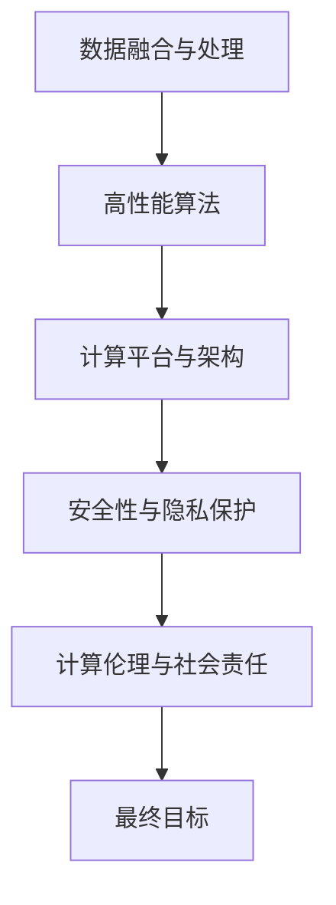

                 

## 1. 背景介绍

### 1.1 问题由来

在当今这个信息爆炸、数据量激增的时代，人类计算面临着前所未有的挑战。从气候变化、疾病防控到环境保护，从智能交通、能源管理到金融安全，计算技术在各个领域中扮演着至关重要的角色。然而，这些复杂问题的解决往往需要跨学科的协作和高度复杂的计算能力。

在人工智能(AI)、大数据、云计算等技术的驱动下，人类计算正在迎来一场深刻的变革。计算不再只是计算机科学家的专利，而是整个社会共同面对的挑战。在这个背景下，如何高效、透明、可控地进行人类计算，成为一个亟待解决的问题。

### 1.2 问题核心关键点

1. **数据融合与处理**：在解决复杂问题时，往往需要从多个数据源中提取有用信息。如何高效、透明地整合和处理这些数据，是提高人类计算能力的核心。

2. **算法设计与优化**：复杂问题通常需要高性能算法才能有效求解。如何设计和优化这些算法，使其在计算资源有限的情况下取得最优解，是实现高效计算的关键。

3. **计算平台与架构**：计算资源分布广泛，如何设计和构建高效的计算平台和架构，使得数据和算法能够有效结合，是实现高性能计算的基础。

4. **安全性与隐私保护**：计算过程中涉及大量敏感数据，如何确保数据安全，保护用户隐私，是计算技术落地应用的重要保障。

5. **计算伦理与社会责任**：计算技术的应用往往具有深远影响，如何确保计算过程透明、公平、公正，承担社会责任，是计算技术发展的必然要求。

这些关键点构成了人类计算的核心挑战，也决定了未来技术发展的方向。

### 1.3 问题研究意义

研究和解决人类计算的挑战，不仅能够提升计算能力，解决当前社会面临的诸多问题，还能够推动计算技术的进步，促进相关产业的发展。具体而言：

1. **提升社会福祉**：通过高效计算，可以实现更精准的疾病防控、环境保护、能源管理等，提升人类生活质量，减少社会损失。

2. **促进经济发展**：计算技术的应用能够促进传统行业的数字化转型，提升生产效率，带动相关产业的发展。

3. **推动科技进步**：解决人类计算挑战的过程，本身就是技术创新的过程。这将推动计算科学、工程、应用等领域的研究进步。

4. **构建透明公正的计算环境**：确保计算过程透明、公正，可以增强社会对计算技术的信任，促进其广泛应用。

5. **承担社会责任**：通过技术手段解决社会问题，体现了计算技术的社会价值和责任。

## 2. 核心概念与联系

### 2.1 核心概念概述

在人类计算的过程中，涉及到以下几个核心概念：

1. **数据融合与处理**：将来自不同数据源的数据进行整合和处理，提取有用的信息。数据融合技术包括数据清洗、归一化、融合算法等。

2. **高性能算法**：针对特定问题，设计和优化高性能算法，以提高计算效率。如深度学习、优化算法、图计算等。

3. **计算平台与架构**：设计和构建高效的计算平台和架构，以支持大规模、高复杂度的计算任务。如分布式计算、云计算、超级计算机等。

4. **安全性与隐私保护**：确保计算过程中数据的安全性和隐私保护。包括数据加密、访问控制、匿名化处理等技术。

5. **计算伦理与社会责任**：确保计算过程透明、公正，承担社会责任。涉及算法公平性、数据使用规范、结果可解释性等。

这些概念之间的逻辑关系可以通过以下Mermaid流程图来展示：



这个流程图展示了数据融合、算法设计、计算平台、安全性保护和计算伦理之间的联系，共同构成了解决人类共同挑战的核心框架。

## 3. 核心算法原理 & 具体操作步骤

### 3.1 算法原理概述

人类计算的核心是高效、透明地解决复杂问题。这一过程通常分为数据融合、算法设计与优化、计算平台与架构设计、安全性与隐私保护以及计算伦理与社会责任等环节。

在数据融合阶段，通过数据清洗、归一化、融合算法等技术，从多个数据源中提取有用的信息。常用的融合算法包括加权平均、贝叶斯融合、卡尔曼滤波等。

在算法设计与优化阶段，针对具体问题设计和优化高性能算法。如在自然语言处理领域，常用的算法包括深度学习、注意力机制、Transformer等。

在计算平台与架构设计阶段，需要构建高效的计算平台和架构，以支持大规模、高复杂度的计算任务。常用的平台包括云平台、分布式计算集群、超级计算机等。

在安全性与隐私保护阶段，需要确保计算过程中数据的安全性和隐私保护。常用的技术包括数据加密、访问控制、匿名化处理等。

在计算伦理与社会责任阶段，需要确保计算过程透明、公正，承担社会责任。涉及算法公平性、数据使用规范、结果可解释性等。

### 3.2 算法步骤详解

基于上述核心概念，人类计算的典型流程包括：

1. **数据收集与预处理**：收集来自不同数据源的数据，并进行清洗、归一化等预处理。

2. **算法设计与优化**：针对具体问题，设计和优化高性能算法。

3. **计算平台与架构设计**：设计和构建高效的计算平台和架构，以支持大规模、高复杂度的计算任务。

4. **安全性与隐私保护**：确保计算过程中数据的安全性和隐私保护。

5. **计算伦理与社会责任**：确保计算过程透明、公正，承担社会责任。

### 3.3 算法优缺点

**优点**：
1. **数据融合与处理**：通过融合不同数据源的信息，可以更全面、准确地解决问题。
2. **高性能算法**：针对具体问题，设计和优化高性能算法，提高计算效率。
3. **计算平台与架构设计**：构建高效的计算平台和架构，支持大规模、高复杂度的计算任务。
4. **安全性与隐私保护**：确保数据安全，保护用户隐私。
5. **计算伦理与社会责任**：确保计算过程透明、公正，承担社会责任。

**缺点**：
1. **数据融合与处理**：数据源的多样性和质量差异可能影响结果的准确性。
2. **算法设计与优化**：高性能算法的设计和优化往往需要较高的技术门槛。
3. **计算平台与架构设计**：设计和构建高效的计算平台和架构需要投入大量资源。
4. **安全性与隐私保护**：数据安全性和隐私保护的措施可能增加计算成本。
5. **计算伦理与社会责任**：确保计算过程透明、公正，可能需要制定新的规范和标准。

### 3.4 算法应用领域

人类计算技术在多个领域中得到了广泛应用：

1. **气候变化**：通过融合气象数据、卫星遥感数据等，利用高性能算法预测气候变化趋势，制定应对策略。

2. **疾病防控**：利用医疗数据、公共卫生数据，设计算法进行疫情预测和传播分析，优化防控措施。

3. **环境保护**：融合环境监测数据、卫星遥感数据等，利用算法进行生态保护、污染监测等。

4. **智能交通**：融合交通数据、环境数据等，设计算法进行交通流量预测、路径优化等。

5. **能源管理**：融合电力数据、气象数据等，利用算法进行能源需求预测、优化调度等。

6. **金融安全**：融合交易数据、市场数据等，设计算法进行风险评估、欺诈检测等。

7. **城市管理**：融合城市数据、社会数据等，利用算法进行城市规划、公共服务优化等。

8. **教育**：融合学习数据、社交数据等，设计算法进行个性化学习推荐、学情分析等。

## 4. 数学模型和公式 & 详细讲解 & 举例说明

### 4.1 数学模型构建

在人类计算中，常见的数学模型包括线性回归、逻辑回归、决策树、随机森林、深度学习等。以线性回归为例，其数学模型为：

$$
y = \theta_0 + \sum_{i=1}^n \theta_i x_i
$$

其中 $y$ 为输出变量，$\theta_0$ 为截距，$\theta_i$ 为系数，$x_i$ 为输入变量。

### 4.2 公式推导过程

在线性回归中，目标是最小化预测误差。常用的损失函数为均方误差(MSE)：

$$
L = \frac{1}{2m} \sum_{i=1}^m (y_i - h_\theta(x_i))^2
$$

其中 $m$ 为样本数量，$y_i$ 为真实标签，$h_\theta(x_i)$ 为模型预测值。

根据梯度下降算法，可以求得系数 $\theta_i$ 的更新公式：

$$
\theta_i = \theta_i - \eta \frac{1}{m} \sum_{i=1}^m (y_i - h_\theta(x_i))x_i
$$

其中 $\eta$ 为学习率，用于控制更新步长。

### 4.3 案例分析与讲解

假设我们有一组房屋价格数据，包括面积、房间数、地段等因素，以及相应的房屋价格标签。我们可以通过线性回归模型来预测新房屋的价格。

**数据准备**：
- 收集房屋面积、房间数、地段等特征数据。
- 获取房屋价格标签。
- 进行数据预处理，如归一化、缺失值处理等。

**模型构建**：
- 使用线性回归模型，定义输入变量 $x_i$ 和输出变量 $y$。
- 设置损失函数为均方误差，定义学习率等参数。

**模型训练**：
- 对训练集进行迭代训练，更新模型参数。
- 在验证集上评估模型性能，调整学习率等参数。
- 在测试集上测试模型效果。

**结果分析**：
- 分析模型预测误差，评估预测准确度。
- 分析模型在不同特征组合下的表现，优化模型结构。

## 5. 项目实践：代码实例和详细解释说明

### 5.1 开发环境搭建

在进行人类计算项目开发前，需要准备好开发环境。以下是使用Python进行PyTorch开发的环境配置流程：

1. 安装Anaconda：从官网下载并安装Anaconda，用于创建独立的Python环境。

2. 创建并激活虚拟环境：
```bash
conda create -n pytorch-env python=3.8 
conda activate pytorch-env
```

3. 安装PyTorch：根据CUDA版本，从官网获取对应的安装命令。例如：
```bash
conda install pytorch torchvision torchaudio cudatoolkit=11.1 -c pytorch -c conda-forge
```

4. 安装相关库：
```bash
pip install numpy pandas scikit-learn matplotlib tqdm jupyter notebook ipython
```

完成上述步骤后，即可在`pytorch-env`环境中开始项目开发。

### 5.2 源代码详细实现

以下是一个线性回归模型的Python实现：

```python
import torch
import torch.nn as nn
import torch.optim as optim

# 定义线性回归模型
class LinearRegression(nn.Module):
    def __init__(self, n_features):
        super(LinearRegression, self).__init__()
        self.linear = nn.Linear(n_features, 1)

    def forward(self, x):
        return self.linear(x)

# 定义损失函数
criterion = nn.MSELoss()

# 定义优化器
optimizer = optim.SGD(model.parameters(), lr=0.01)

# 定义训练函数
def train(model, train_loader, epochs):
    model.train()
    for epoch in range(epochs):
        for batch in train_loader:
            inputs, labels = batch
            optimizer.zero_grad()
            outputs = model(inputs)
            loss = criterion(outputs, labels)
            loss.backward()
            optimizer.step()

# 训练模型
train_loader = DataLoader(train_dataset, batch_size=32, shuffle=True)
epochs = 100
model = LinearRegression(n_features)
train(model, train_loader, epochs)
```

### 5.3 代码解读与分析

在上述代码中，我们定义了一个线性回归模型，使用均方误差作为损失函数，采用随机梯度下降(Stochastic Gradient Descent, SGD)优化器进行参数更新。

**LinearRegression类**：
- `__init__`方法：初始化模型，定义输入和输出维度。
- `forward`方法：前向传播，计算模型的输出。

**训练函数train**：
- 在每个epoch中，对每个batch进行前向传播、计算损失、反向传播和参数更新。

**训练过程**：
- 加载训练数据集。
- 设置模型、损失函数、优化器。
- 定义训练次数epochs。
- 调用训练函数train，进行模型训练。

### 5.4 运行结果展示

训练过程中，可以实时查看损失函数的变化：

```python
import matplotlib.pyplot as plt

# 记录训练过程中的损失函数值
loss_values = []
for batch in train_loader:
    inputs, labels = batch
    optimizer.zero_grad()
    outputs = model(inputs)
    loss = criterion(outputs, labels)
    loss_values.append(loss.item())
    loss.backward()
    optimizer.step()

# 绘制损失函数变化图
plt.plot(loss_values)
plt.title('Training Loss')
plt.xlabel('Epochs')
plt.ylabel('Loss')
plt.show()
```

通过观察损失函数的变化趋势，可以评估模型的收敛情况和训练效果。

## 6. 实际应用场景

### 6.1 气候变化预测

气候变化是当前人类面临的重大挑战之一。通过融合气象数据、卫星遥感数据等，利用高性能算法进行气候变化预测，可以制定更有效的应对策略。

**数据准备**：
- 收集气象数据、卫星遥感数据等。
- 进行数据清洗、归一化等预处理。

**模型构建**：
- 使用深度学习模型，如卷积神经网络(CNN)、循环神经网络(RNN)等。
- 定义损失函数、优化器等参数。

**模型训练**：
- 对训练集进行迭代训练，更新模型参数。
- 在验证集上评估模型性能，调整参数。
- 在测试集上测试模型效果。

**结果分析**：
- 分析模型预测误差，评估预测准确度。
- 分析模型在不同数据源组合下的表现，优化模型结构。

### 6.2 疾病防控

疾病防控是公共卫生领域的重要课题。通过融合医疗数据、公共卫生数据等，利用高性能算法进行疫情预测和传播分析，可以优化防控措施。

**数据准备**：
- 收集医疗数据、公共卫生数据等。
- 进行数据清洗、归一化等预处理。

**模型构建**：
- 使用深度学习模型，如卷积神经网络(CNN)、循环神经网络(RNN)等。
- 定义损失函数、优化器等参数。

**模型训练**：
- 对训练集进行迭代训练，更新模型参数。
- 在验证集上评估模型性能，调整参数。
- 在测试集上测试模型效果。

**结果分析**：
- 分析模型预测误差，评估预测准确度。
- 分析模型在不同数据源组合下的表现，优化模型结构。

### 6.3 智能交通

智能交通是提高城市交通效率的关键技术。通过融合交通数据、环境数据等，利用高性能算法进行交通流量预测和路径优化，可以提升交通管理水平。

**数据准备**：
- 收集交通数据、环境数据等。
- 进行数据清洗、归一化等预处理。

**模型构建**：
- 使用深度学习模型，如卷积神经网络(CNN)、循环神经网络(RNN)等。
- 定义损失函数、优化器等参数。

**模型训练**：
- 对训练集进行迭代训练，更新模型参数。
- 在验证集上评估模型性能，调整参数。
- 在测试集上测试模型效果。

**结果分析**：
- 分析模型预测误差，评估预测准确度。
- 分析模型在不同数据源组合下的表现，优化模型结构。

### 6.4 未来应用展望

随着人类计算技术的不断进步，未来在多个领域将有更广泛的应用：

1. **环境保护**：通过融合环境监测数据、卫星遥感数据等，利用高性能算法进行生态保护、污染监测等。

2. **智能交通**：融合交通数据、环境数据等，利用算法进行交通流量预测、路径优化等。

3. **能源管理**：融合电力数据、气象数据等，利用算法进行能源需求预测、优化调度等。

4. **金融安全**：融合交易数据、市场数据等，设计算法进行风险评估、欺诈检测等。

5. **城市管理**：融合城市数据、社会数据等，利用算法进行城市规划、公共服务优化等。

6. **教育**：融合学习数据、社交数据等，设计算法进行个性化学习推荐、学情分析等。

7. **医疗健康**：利用医疗数据、公共卫生数据等，设计算法进行疾病预测、诊断优化等。

8. **环境保护**：通过融合环境监测数据、卫星遥感数据等，利用高性能算法进行生态保护、污染监测等。

## 7. 工具和资源推荐

### 7.1 学习资源推荐

为了帮助开发者系统掌握人类计算的理论基础和实践技巧，这里推荐一些优质的学习资源：

1. 《深度学习》系列课程：由斯坦福大学开设的深度学习课程，涵盖了深度学习的基础知识和常用算法。

2. 《大数据技术与应用》系列课程：由清华大学开设的大数据课程，介绍了大数据的常用技术和应用场景。

3. 《分布式系统》系列课程：由斯坦福大学开设的分布式系统课程，讲解了分布式计算的基本原理和设计思路。

4. 《计算机科学导论》书籍：涵盖了计算机科学的基础理论和经典算法，适合初学者入门。

5. 《人工智能与机器学习》书籍：介绍了人工智能和机器学习的基本概念和常用算法，涵盖多个应用场景。

通过这些资源的学习实践，相信你一定能够快速掌握人类计算的核心技术，并用于解决实际的计算问题。

### 7.2 开发工具推荐

高效的开发离不开优秀的工具支持。以下是几款用于人类计算开发的常用工具：

1. PyTorch：基于Python的开源深度学习框架，灵活动态的计算图，适合快速迭代研究。

2. TensorFlow：由Google主导开发的开源深度学习框架，生产部署方便，适合大规模工程应用。

3. Weights & Biases：模型训练的实验跟踪工具，可以记录和可视化模型训练过程中的各项指标，方便对比和调优。

4. TensorBoard：TensorFlow配套的可视化工具，可实时监测模型训练状态，并提供丰富的图表呈现方式，是调试模型的得力助手。

5. HuggingFace官方文档：提供了海量预训练模型和完整的微调样例代码，是上手实践的必备资料。

合理利用这些工具，可以显著提升人类计算任务的开发效率，加快创新迭代的步伐。

### 7.3 相关论文推荐

人类计算技术的发展源于学界的持续研究。以下是几篇奠基性的相关论文，推荐阅读：

1. Deep Learning: A Survey and Summary of Research by Deep Machine Learning Researchers：综述了深度学习的最新进展，是了解深度学习基础的重要资源。

2. Big Data: Technologies for Analyzing and Understanding Big Data：介绍了大数据技术的常用技术和应用场景，是理解大数据基础的重要资源。

3. Distributed Computing: Principles and Practice：讲解了分布式计算的基本原理和设计思路，是学习分布式系统的重要资源。

4. Machine Learning: A Probabilistic Perspective：介绍了机器学习的基本概念和常用算法，是了解机器学习基础的重要资源。

这些论文代表了大规模计算和数据分析的研究脉络，通过学习这些前沿成果，可以帮助研究者把握学科前进方向，激发更多的创新灵感。

## 8. 总结：未来发展趋势与挑战

### 8.1 研究成果总结

本文对人类计算的核心概念和关键技术进行了全面系统的介绍。首先阐述了数据融合、算法设计、计算平台、安全性保护和计算伦理之间的联系，明确了人类计算的核心挑战和任务。

其次，从原理到实践，详细讲解了人类计算的数学模型和关键步骤，给出了人类计算任务开发的完整代码实例。同时，本文还广泛探讨了人类计算在气候变化、疾病防控、智能交通等多个领域的应用前景，展示了人类计算技术的巨大潜力。

最后，本文精选了人类计算技术的各类学习资源，力求为读者提供全方位的技术指引。

### 8.2 未来发展趋势

展望未来，人类计算技术将呈现以下几个发展趋势：

1. **数据融合与处理**：随着数据采集技术的进步，数据种类和数量将持续增长。如何高效、透明地整合和处理这些数据，将是未来研究的重要方向。

2. **高性能算法**：针对具体问题，设计和优化高性能算法，提高计算效率。未来将出现更多高效的算法设计和优化方法。

3. **计算平台与架构设计**：构建高效的计算平台和架构，以支持大规模、高复杂度的计算任务。未来将出现更多先进的计算平台和架构设计技术。

4. **安全性与隐私保护**：确保计算过程中数据的安全性和隐私保护。未来将出现更多安全性和隐私保护的解决方案。

5. **计算伦理与社会责任**：确保计算过程透明、公正，承担社会责任。未来将出现更多计算伦理和社会责任的规范和标准。

### 8.3 面临的挑战

尽管人类计算技术已经取得了瞩目成就，但在迈向更加智能化、普适化应用的过程中，它仍面临着诸多挑战：

1. **数据融合与处理**：数据源的多样性和质量差异可能影响结果的准确性。如何高效、透明地整合和处理这些数据，是未来研究的重要方向。

2. **高性能算法**：高性能算法的设计和优化往往需要较高的技术门槛。如何设计和优化高效的算法，提高计算效率，将是未来研究的重要方向。

3. **计算平台与架构设计**：设计和构建高效的计算平台和架构需要投入大量资源。如何构建高效的计算平台和架构，支持大规模、高复杂度的计算任务，将是未来研究的重要方向。

4. **安全性与隐私保护**：数据安全性和隐私保护的措施可能增加计算成本。如何确保计算过程中数据的安全性和隐私保护，是未来研究的重要方向。

5. **计算伦理与社会责任**：确保计算过程透明、公正，承担社会责任。如何确保计算过程透明、公正，承担社会责任，将是未来研究的重要方向。

### 8.4 研究展望

面对人类计算面临的挑战，未来的研究需要在以下几个方面寻求新的突破：

1. **数据融合与处理**：探索无监督和半监督数据融合方法，利用自监督学习、主动学习等技术，最大限度利用非结构化数据，实现更加灵活高效的融合。

2. **高性能算法**：开发更加参数高效和计算高效的算法，在固定大部分预训练参数的同时，只更新极少量的任务相关参数。同时优化算法计算图，减少前向传播和反向传播的资源消耗。

3. **计算平台与架构设计**：研究和开发更加高效、可扩展的计算平台和架构，支持大规模、高复杂度的计算任务。

4. **安全性与隐私保护**：研究数据加密、匿名化处理等技术，确保计算过程中数据的安全性和隐私保护。

5. **计算伦理与社会责任**：研究和制定计算伦理和社会责任的规范和标准，确保计算过程透明、公正，承担社会责任。

这些研究方向的探索，必将引领人类计算技术迈向更高的台阶，为解决复杂问题提供更高效、透明、可控的技术手段。只有勇于创新、敢于突破，才能不断拓展人类计算的边界，让计算技术更好地服务于社会，造福人类。

## 9. 附录：常见问题与解答

**Q1：如何高效、透明地进行数据融合与处理？**

A: 数据融合与处理是人类计算的核心步骤，涉及数据清洗、归一化、融合算法等技术。常用的数据融合算法包括加权平均、贝叶斯融合、卡尔曼滤波等。同时，需要建立透明的数据融合流程，确保数据融合的透明度和可解释性。

**Q2：如何选择高性能算法？**

A: 高性能算法的选择应根据具体问题而定。常用的算法包括深度学习、优化算法、图计算等。在选择算法时，需要考虑算法的计算效率、可解释性、泛化能力等因素。

**Q3：如何设计和构建高效的计算平台和架构？**

A: 高效计算平台和架构的设计需要综合考虑计算资源、数据分布、算法特点等因素。常用的平台包括云平台、分布式计算集群、超级计算机等。同时，需要优化算法的计算图，减少前向传播和反向传播的资源消耗。

**Q4：如何确保计算过程中数据的安全性和隐私保护？**

A: 数据安全性和隐私保护是计算技术落地应用的重要保障。常用的技术包括数据加密、匿名化处理、访问控制等。同时，需要建立透明的数据保护机制，确保数据的安全性和隐私保护。

**Q5：如何确保计算过程透明、公正，承担社会责任？**

A: 计算伦理和社会责任是计算技术发展的必然要求。需要制定计算伦理和社会责任的规范和标准，确保计算过程透明、公正，承担社会责任。同时，需要建立透明的数据使用机制，确保算法的公平性和可解释性。

---

作者：禅与计算机程序设计艺术 / Zen and the Art of Computer Programming

