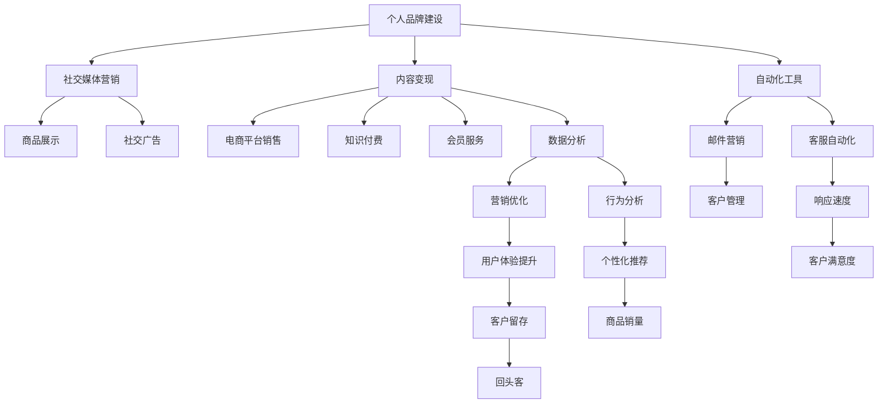

                 

# 建立个人品牌线上商城：变现你的影响力

> 关键词：个人品牌建设, 电商系统开发, 社交媒体营销, 内容变现, 数据分析, 自动化工具, 安全与隐私

## 1. 背景介绍

### 1.1 问题由来
在当今信息爆炸的互联网时代，如何有效地建立个人品牌，利用其影响力变现，已经成为众多网络从业者关注的焦点。传统的线下方式已经无法满足快速传播的需求，因此将影响力迁移到线上，通过电子商务平台进行变现，成为了一个热门选择。

### 1.2 问题核心关键点
本文聚焦于如何利用现有的电商平台和社交媒体平台，结合个人品牌的影响力，通过电商系统的开发，进行内容变现。将个人品牌作为营销工具，通过在线商品销售、知识付费、会员服务等多种方式，最大化其商业价值。

### 1.3 问题研究意义
探讨个人品牌线上商城的建设方法，不仅可以帮助个人变现其影响力，还能促进知识传播，推动内容经济的繁荣。同时，有助于理解如何在数字时代利用互联网资源，进行个人品牌的有效推广和变现。

## 2. 核心概念与联系

### 2.1 核心概念概述

为更好地理解个人品牌线上商城的建设方法，本节将介绍几个核心概念：

- 个人品牌建设：指通过在社交媒体、博客、视频网站等平台发表有价值的内容，建立独特的个人形象，吸引并影响特定群体。
- 电商平台：指提供商品展示、交易、支付等服务的在线平台，如淘宝、京东、拼多多等。
- 社交媒体营销：指利用社交媒体平台（如微博、微信、Instagram等）进行品牌推广和产品销售的营销策略。
- 内容变现：指通过发布有价值的内容，吸引流量，并在其基础上进行商业变现的过程。
- 数据分析：指收集、处理、分析用户数据，以指导商业决策，提升运营效率和用户体验。
- 自动化工具：指用于自动化营销、客服、运营等功能的工具，如邮件自动化、社交媒体管理工具等。
- 安全与隐私：指在数据收集、处理和共享过程中，保护用户隐私，确保平台运营安全的原则和方法。

这些核心概念之间的逻辑关系可以通过以下Mermaid流程图来展示：



这个流程图展示了个人品牌与电商系统的联系，通过社交媒体营销传播个人品牌影响力，通过内容变现和数据分析，优化电商销售策略，最终实现品牌的影响力和商业价值变现。

## 3. 核心算法原理 & 具体操作步骤
### 3.1 算法原理概述

个人品牌线上商城的建设涉及多个关键环节，包括内容创作、平台运营、数据分析和客户服务。其中，内容创作是基础，平台运营是关键，数据分析是支撑，客户服务是保障。通过科学的方法论，整合个人品牌的影响力和电商平台的技术优势，可以实现个人品牌的线上变现。

### 3.2 算法步骤详解

建立个人品牌线上商城主要包括以下几个关键步骤：

**Step 1: 个人品牌定位**
- 明确个人品牌的目标受众、核心价值和独特卖点。
- 分析竞争对手，确定差异化策略。
- 利用社交媒体、博客、视频网站等平台，发布有价值的内容，建立品牌形象。

**Step 2: 电商平台选择与搭建**
- 选择适合自己品牌特点和目标受众的电商平台，如淘宝、京东、拼多多等。
- 搭建电商网站，实现商品展示、购买、支付等功能。
- 设计友好的用户体验，确保网站的易用性和安全性。

**Step 3: 内容创作与商品规划**
- 根据个人品牌的特点，设计适合电商平台的商品品类和规格。
- 创作与商品相关的高质量内容，如产品介绍、用户评价、行业分析等。
- 利用SEO优化技巧，提升内容的搜索引擎排名，吸引流量。

**Step 4: 社交媒体营销**
- 在社交媒体平台上创建品牌账号，定期发布有价值的内容。
- 利用社交广告投放，扩大品牌影响力。
- 与用户互动，建立社区，增强品牌粘性。

**Step 5: 数据分析与优化**
- 收集用户行为数据，分析用户购买偏好和行为特征。
- 利用数据分析工具，如Google Analytics、阿里数据魔方等，优化电商运营策略。
- 持续优化商品展示、价格、推荐算法等，提升销售转化率。

**Step 6: 客户服务**
- 建立客户服务团队，提供24小时在线客服支持。
- 利用自动化工具，如Zendesk、Alimama等，提高客服效率和响应速度。
- 定期收集用户反馈，不断改进产品和服务质量。

### 3.3 算法优缺点

个人品牌线上商城建设具有以下优点：
1. 多渠道营销：通过多平台发布内容，扩大品牌影响力。
2. 数据驱动运营：利用数据分析，优化电商策略，提高转化率。
3. 持续变现：通过内容变现、会员服务、广告等多种方式，持续获取收入。
4. 品牌粘性：通过社交媒体和客户服务，增强用户忠诚度。

同时，该方法也存在一定的局限性：
1. 时间投入大：需要持续发布内容，进行数据分析，提高运营效率。
2. 资源需求高：需要投入大量资金和人力，初期投入成本较大。
3. 竞争激烈：电商领域竞争激烈，需要不断创新，保持竞争力。
4. 用户隐私问题：收集和使用用户数据，需要注意隐私保护和合规性。

尽管存在这些局限性，但个人品牌线上商城仍是一个具有巨大潜力的商业模式，特别是在知识付费、自媒体等新兴领域。

### 3.4 算法应用领域

个人品牌线上商城建设已经广泛应用于以下多个领域：

- 知识付费：如罗振宇的得到、付费知乎等，通过个人品牌吸引用户，进行知识变现。
- 自媒体电商：如薇娅、李佳琦等，通过网红效应，在社交媒体平台上销售商品。
- 垂直领域：如旅游、健身、美容等，通过个人品牌在特定领域深耕，进行垂直领域的电商运营。
- 科技产品：如科技博主，通过发布技术评测、教程等，销售相关产品。

这些领域的成功案例展示了个人品牌线上商城建设的广泛应用前景。

## 4. 数学模型和公式 & 详细讲解 & 举例说明

### 4.1 数学模型构建

个人品牌线上商城的建设涉及多个数学模型，包括内容推荐、广告投放、转化率预测等。这里以内容推荐模型为例，介绍其构建过程。

设内容库为 $\mathcal{C}$，内容为 $c=(c_1,c_2,\dots,c_n)$，用户群体为 $\mathcal{U}$，用户为 $u=(u_1,u_2,\dots,u_m)$，用户对内容的评分矩阵为 $R\in \mathbb{R}^{m\times n}$。目标是为每个用户 $u_i$ 推荐最相关的 $k$ 个内容 $c_j$，构建内容推荐模型。

### 4.2 公式推导过程

采用协同过滤算法中的基于用户的矩阵分解方法，设用户-内容评分矩阵 $R=\mathbf{U}\times \mathbf{V}^T$，其中 $\mathbf{U}\in \mathbb{R}^{m\times k}, \mathbf{V}\in \mathbb{R}^{n\times k}$。对于用户 $u_i$，其对内容 $c_j$ 的评分预测为：

$$
\hat{r}_{i,j} = \sum_{k=1}^k \mathbf{u}_{i,k}\mathbf{v}_{j,k}
$$

其中 $\mathbf{u}_{i,k}, \mathbf{v}_{j,k}$ 为 $\mathbf{U}, \mathbf{V}$ 矩阵的第 $i$ 行和第 $j$ 列的第 $k$ 个元素。

### 4.3 案例分析与讲解

以小红书平台为例，分析其内容推荐模型的应用。小红书利用协同过滤算法，通过分析用户对内容的评分数据，为用户推荐最相关的商品和文章。具体步骤如下：

1. 收集用户评分数据，构建用户-内容评分矩阵 $R$。
2. 利用奇异值分解(SVD)等矩阵分解方法，分解评分矩阵 $R=\mathbf{U}\times \mathbf{V}^T$。
3. 对于新用户 $u_i$，利用 $\mathbf{u}_i$ 和 $\mathbf{V}$ 计算其对内容的评分预测。
4. 将预测评分与用户历史评分进行对比，计算相似度，推荐评分最高的 $k$ 个内容。

通过内容推荐模型的应用，小红书提升了用户体验，实现了商品的高效展示和销售。

## 5. 项目实践：代码实例和详细解释说明
### 5.1 开发环境搭建

在进行个人品牌线上商城的建设实践前，我们需要准备好开发环境。以下是使用Python进行Flask开发的环境配置流程：

1. 安装Anaconda：从官网下载并安装Anaconda，用于创建独立的Python环境。

2. 创建并激活虚拟环境：
```bash
conda create -n flask-env python=3.8 
conda activate flask-env
```

3. 安装Flask：
```bash
pip install flask
```

4. 安装Flask插件：
```bash
pip install flask-bcrypt flask-login flask-sqlalchemy flask-migrate flask-restful
```

5. 安装第三方库：
```bash
pip install google-auth google-auth-oauthlib google-auth-httplib2
```

完成上述步骤后，即可在`flask-env`环境中开始开发实践。

### 5.2 源代码详细实现

下面以建立一个小红书商品推荐系统为例，给出使用Flask框架进行开发的Python代码实现。

首先，创建Flask应用：

```python
from flask import Flask, render_template, request, jsonify
from flask_sqlalchemy import SQLAlchemy

app = Flask(__name__)
app.config['SQLALCHEMY_DATABASE_URI'] = 'sqlite:////mnt/c/Users/Administrator/Users/Users_HP_Aspen/Flask/app.db'
db = SQLAlchemy(app)
```

然后，定义数据模型：

```python
class User(db.Model):
    id = db.Column(db.Integer, primary_key=True)
    name = db.Column(db.String(64), unique=True)
    password_hash = db.Column(db.String(128))
    email = db.Column(db.String(120), unique=True)

class Product(db.Model):
    id = db.Column(db.Integer, primary_key=True)
    name = db.Column(db.String(64), unique=True)
    description = db.Column(db.Text)
    price = db.Column(db.Float)
    rating = db.Column(db.Float)

db.create_all()
```

接着，定义用户注册和登录功能：

```python
from flask_login import UserMixin, login_user, logout_user, login_required
from werkzeug.security import generate_password_hash, check_password_hash

@app.route('/register', methods=['GET', 'POST'])
def register():
    if request.method == 'POST':
        name = request.form['name']
        password = request.form['password']
        email = request.form['email']
        hashed_password = generate_password_hash(password)
        user = User(name=name, password_hash=hashed_password, email=email)
        db.session.add(user)
        db.session.commit()
        return '注册成功'
    return render_template('register.html')

@app.route('/login', methods=['GET', 'POST'])
def login():
    if request.method == 'POST':
        name = request.form['name']
        password = request.form['password']
        user = User.query.filter_by(name=name).first()
        if user and check_password_hash(user.password_hash, password):
            login_user(user)
            return '登录成功'
    return render_template('login.html')
```

最后，实现商品推荐功能：

```python
from flask_restful import Resource, Api
from sklearn.metrics.pairwise import cosine_similarity

class ProductRecommendation(Resource):
    def get(self, user_id):
        user = User.query.get(user_id)
        if not user:
            return jsonify({'error': '用户不存在'}), 404
        
        user_ratings = [(user_id, product.id, product.rating) for product in Product.query]
        product_ratings = [(product.id, user_ratings) for product in Product.query]
        ratings_matrix = np.array([user_ratings], dtype=np.float32)
        product_ratings = np.array(product_ratings, dtype=np.float32).T
        cos_sim = cosine_similarity(ratings_matrix, product_ratings)
        recommended_products = [product_ratings[i] for i in np.argsort(cos_sim)[1:]]
        return jsonify({'recommended_products': recommended_products})

api = Api(app)
api.add_resource(ProductRecommendation, '/recommend')
```

以上代码展示了使用Flask框架搭建个人品牌线上商城商品推荐系统的基本流程。开发者可以根据实际需求，进一步扩展功能，如商品搜索、购物车、订单管理等。

### 5.3 代码解读与分析

让我们再详细解读一下关键代码的实现细节：

**Flask应用创建**：
- 使用Flask框架创建应用实例，并设置数据库连接信息。

**数据模型定义**：
- 定义User和Product模型，并使用SQLAlchemy进行数据库操作。

**用户注册和登录功能**：
- 使用Flask-Login扩展，实现用户注册和登录功能。
- 使用werkzeug.security模块生成和验证密码。

**商品推荐功能**：
- 使用Flask-RESTful扩展，实现RESTful接口，提供商品推荐服务。
- 使用sklearn.metrics.pairwise模块计算余弦相似度，实现商品推荐。

完成以上步骤后，即可启动Flask应用，访问推荐接口，获取用户推荐商品列表。

## 6. 实际应用场景
### 6.1 智能客服系统

个人品牌线上商城可以通过智能客服系统，提升用户体验。智能客服系统可以24小时在线，快速响应用户咨询，解答常见问题，提升用户满意度。

在技术实现上，可以利用自然语言处理技术，构建智能客服机器人。机器人通过学习用户历史咨询记录，能够理解用户意图，并提供针对性的回答。同时，利用用户数据进行个性化推荐，引导用户购买相关商品。

### 6.2 金融产品销售

个人品牌可以在金融领域进行线上商城建设，销售理财产品、保险等金融产品。通过社交媒体和内容营销，吸引目标用户群体，进行精准投放。

在运营策略上，可以结合金融大数据，进行用户画像分析和行为预测，优化产品推荐策略，提升销售转化率。同时，提供个性化的投资建议和理财方案，增强用户粘性。

### 6.3 教育在线课程

个人品牌可以搭建教育在线商城，销售各类在线课程。通过发布有价值的教育内容，吸引用户注册和购买课程。

在课程推荐上，可以利用数据分析，了解用户的学习偏好和历史行为，推荐适合的学习资源。同时，提供互动式学习体验，如在线测试、讨论组等，提升用户学习效果。

### 6.4 未来应用展望

随着个人品牌线上商城的不断发展，未来将会有更多应用场景涌现。以下是几个可能的未来趋势：

1. 内容创作平台化：通过平台化运营，整合各类内容创作者，提供统一的内容管理和变现渠道。
2. 全渠道营销：结合社交媒体、视频平台、搜索引擎等，进行全渠道营销，提升品牌影响力。
3. 数据驱动运营：利用大数据和机器学习技术，优化商品推荐和广告投放策略，提升运营效率。
4. 技术融合创新：结合AR/VR、区块链等前沿技术，提供更丰富的用户体验和更安全的交易保障。
5. 平台整合优化：通过API接口，与其他电商平台和服务商进行整合，实现资源共享和跨平台运营。

## 7. 工具和资源推荐
### 7.1 学习资源推荐

为了帮助开发者系统掌握个人品牌线上商城的开发方法，这里推荐一些优质的学习资源：

1. 《Flask Web Development》书籍：深入浅出地介绍了Flask框架的各项功能和开发技巧，适合Flask开发新手。
2. 《自然语言处理入门与实战》课程：介绍自然语言处理的基本概念和技术实现，适合对NLP有兴趣的开发者。
3. 《机器学习实战》书籍：涵盖机器学习的基础知识和经典模型实现，适合入门学习。
4. 《Google Cloud Platform》课程：介绍Google云平台的各项服务，适合云计算开发者。
5. 《Python编程：从入门到实践》书籍：适合Python编程初学者，通过实践项目逐步提升技能。

通过这些资源的学习实践，相信你一定能够快速掌握个人品牌线上商城的开发方法，并用于解决实际的商业问题。

### 7.2 开发工具推荐

高效的开发离不开优秀的工具支持。以下是几款用于个人品牌线上商城开发的常用工具：

1. Flask：轻量级Web框架，简单易用，适合快速迭代开发。
2. SQLAlchemy：Python ORM框架，支持复杂的数据库操作。
3. Flask-Login：用户认证扩展，支持用户登录、注销等功能。
4. Flask-RESTful：RESTful接口开发工具，支持API设计和测试。
5. TensorFlow：深度学习框架，支持自定义模型训练和优化。
6. PyTorch：深度学习框架，支持动态计算图和高效训练。
7. Google Cloud Platform：云端基础设施，提供强大的计算和存储资源。
8. Weights & Biases：模型实验跟踪工具，记录和可视化模型训练过程。
9. TensorBoard：TensorFlow配套的可视化工具，实时监测模型训练状态。

合理利用这些工具，可以显著提升个人品牌线上商城的开发效率，加快创新迭代的步伐。

### 7.3 相关论文推荐

个人品牌线上商城的发展离不开学界的持续研究。以下是几篇奠基性的相关论文，推荐阅读：

1. "User-Centric Social Commerce: A New Paradigm for E-commerce"：探讨用户中心化的社交电商模式，为个人品牌线上商城建设提供理论基础。
2. "Recommender Systems Handbook"：全面介绍推荐系统理论和算法，适合深入学习推荐模型。
3. "Social Media Analytics: An Introduction"：介绍社交媒体数据分析方法，适合社交媒体营销的开发者。
4. "Adaptive Recommender Systems"：研究推荐系统的自适应方法，提高模型预测精度和稳定性。
5. "Smart Customer Service: A Survey of Recent Advances"：综述智能客服技术的最新进展，适合智能客服系统的开发者。

这些论文代表了大品牌线上商城建设的最新研究方向。通过学习这些前沿成果，可以帮助研究者把握学科前进方向，激发更多的创新灵感。

## 8. 总结：未来发展趋势与挑战

### 8.1 总结

本文对个人品牌线上商城的建设方法进行了全面系统的介绍。首先阐述了个人品牌线上商城的重要性，明确了其在电商领域和内容变现中的应用前景。其次，从原理到实践，详细讲解了个人品牌线上商城的建设过程，包括内容创作、平台搭建、数据分析和客户服务等多个环节。同时，分析了个人品牌线上商城建设中的优缺点，并展望了其未来发展趋势。

通过本文的系统梳理，可以看到，个人品牌线上商城建设是电子商务领域的新趋势，不仅可以帮助个人变现其影响力，还能推动内容经济的发展。未来，伴随技术的发展和模式的创新，个人品牌线上商城必将在更多领域得到应用，为传统行业的数字化转型提供新的解决方案。

### 8.2 未来发展趋势

展望未来，个人品牌线上商城建设将呈现以下几个发展趋势：

1. 平台化运营：利用平台化运营模式，整合各类内容创作者，提供统一的内容管理和变现渠道。
2. 数据驱动决策：通过大数据和机器学习技术，优化运营策略，提升销售转化率。
3. 技术融合创新：结合AR/VR、区块链等前沿技术，提供更丰富的用户体验和更安全的交易保障。
4. 全渠道营销：结合社交媒体、视频平台、搜索引擎等，进行全渠道营销，提升品牌影响力。
5. 技术平台整合：通过API接口，与其他电商平台和服务商进行整合，实现资源共享和跨平台运营。

以上趋势凸显了个人品牌线上商城建设的广阔前景。这些方向的探索发展，必将进一步提升电子商务系统的性能和应用范围，为内容变现带来新的机遇。

### 8.3 面临的挑战

尽管个人品牌线上商城建设已经取得了一定的成果，但在迈向更加智能化、普适化应用的过程中，仍面临诸多挑战：

1. 数据隐私问题：在收集和处理用户数据时，需要严格遵守隐私保护法规，确保用户数据安全。
2. 技术门槛高：需要开发者具备较高的技术水平，掌握多种技术和工具，如Flask、SQLAlchemy、TensorFlow等。
3. 运营成本高：需要投入大量资金和人力，进行内容创作、技术开发和市场推广。
4. 竞争激烈：电商领域竞争激烈，需要不断创新，保持竞争力。
5. 用户管理复杂：需要有效管理用户行为数据，进行精准投放和个性化推荐。

尽管存在这些挑战，但个人品牌线上商城仍是一个具有巨大潜力的商业模式，特别是在知识付费、自媒体等新兴领域。通过克服这些挑战，个人品牌线上商城必将在电商和内容变现领域发挥更大的作用。

### 8.4 研究展望

面对个人品牌线上商城建设所面临的挑战，未来的研究需要在以下几个方面寻求新的突破：

1. 用户数据隐私保护：通过数据脱敏、加密等技术，保护用户隐私，避免数据泄露。
2. 技术平台整合：构建开放平台，促进跨平台合作和资源共享。
3. 自动化运营优化：利用自动化工具，提高运营效率和用户体验。
4. 全渠道营销优化：通过多渠道营销策略，提升品牌影响力和销售效果。
5. 内容创作激励：建立内容创作激励机制，吸引更多高质量内容创作者。
6. 用户体验优化：通过用户行为分析，提升商品推荐和广告投放的精准度，提升用户体验。

这些研究方向将推动个人品牌线上商城技术的进一步发展，为内容变现带来新的突破。

## 9. 附录：常见问题与解答

**Q1：个人品牌线上商城的建设需要哪些技术？**

A: 个人品牌线上商城建设需要以下技术：
1. Web开发框架：如Flask、Django等，用于构建电商网站。
2. 数据库技术：如SQLAlchemy、MySQL等，用于管理商品信息和用户数据。
3. 自然语言处理技术：如BERT、GPT等，用于内容推荐和用户意图理解。
4. 推荐系统技术：如协同过滤、矩阵分解等，用于商品推荐。
5. 数据分析技术：如Python、R等，用于用户行为分析和数据可视化。

**Q2：个人品牌线上商城如何获取流量？**

A: 个人品牌线上商城获取流量的主要方法包括：
1. 内容营销：通过发布有价值的内容，吸引用户关注和访问。
2. 社交媒体营销：在社交媒体平台上进行广告投放和用户互动。
3. 搜索引擎优化：优化电商网站SEO，提升搜索引擎排名。
4. 合作伙伴推广：与相关行业合作伙伴进行联合推广。
5. 用户口碑传播：通过用户口碑传播，吸引新用户。

**Q3：个人品牌线上商城如何提升用户体验？**

A: 个人品牌线上商城提升用户体验的方法包括：
1. 友好的用户界面：设计简洁直观的电商网站界面，提高用户操作便捷性。
2. 快速的加载速度：优化网站加载速度，提高用户访问体验。
3. 个性化的推荐：根据用户历史行为和偏好，进行个性化商品推荐。
4. 优质的客服服务：提供24小时在线客服支持，快速响应用户咨询。
5. 安全的支付系统：提供多种支付方式，保障用户交易安全。

**Q4：个人品牌线上商城如何实现多渠道营销？**

A: 个人品牌线上商城实现多渠道营销的方法包括：
1. 社交媒体平台：在微博、微信、Instagram等平台进行品牌推广和广告投放。
2. 搜索引擎优化：优化电商网站SEO，提升在搜索引擎中的排名。
3. 邮件营销：通过邮件发送产品推荐和促销信息，吸引用户访问。
4. 合作广告投放：与相关网站进行联合广告投放，扩大品牌影响力。
5. 线下活动推广：组织线下活动，吸引用户关注和参与。

**Q5：个人品牌线上商城如何实现用户行为分析？**

A: 个人品牌线上商城实现用户行为分析的方法包括：
1. 数据收集：通过电商网站、移动应用等渠道，收集用户行为数据。
2. 数据处理：使用Python、R等工具，对用户行为数据进行清洗和预处理。
3. 数据分析：利用机器学习算法，进行用户行为分析和预测。
4. 数据可视化：使用Tableau、Power BI等工具，对分析结果进行可视化展示。
5. 行为预测：根据用户历史行为数据，预测用户购买意愿和行为倾向。

完成以上步骤后，即可实现对用户行为的全面分析，为个性化推荐和运营优化提供数据支撑。

---

作者：禅与计算机程序设计艺术 / Zen and the Art of Computer Programming

